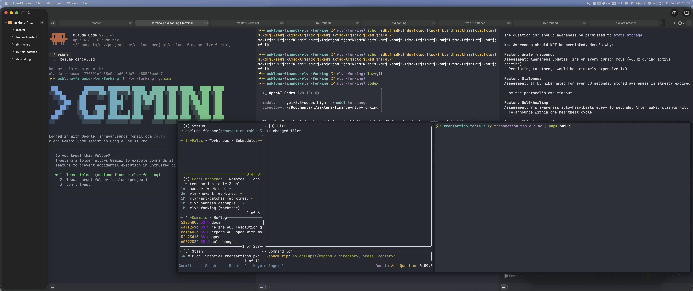
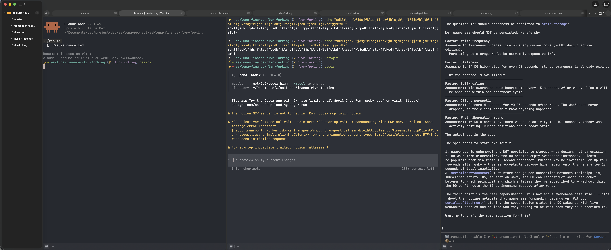
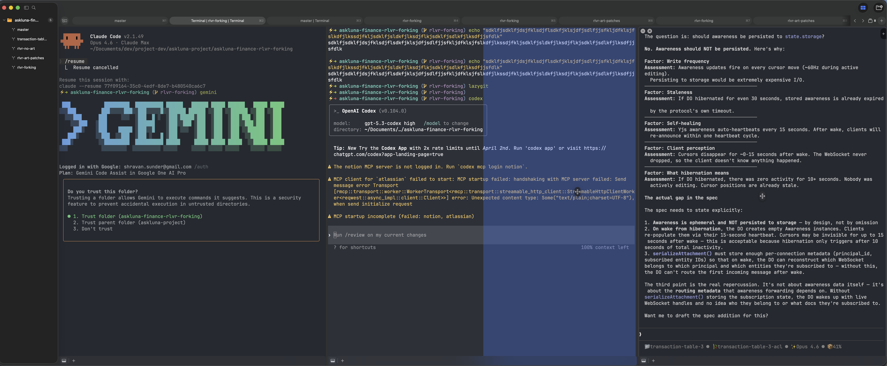

# Agent Studio



A macOS workspace for agent-assisted development. Run multiple coding agents across projects simultaneously — and stay oriented while they work.

Agent-agnostic. Keyboard-first. Native macOS. Built on [Ghostty](https://github.com/ghostty-org/ghostty).

## Install

```bash
brew tap ShravanSunder/agentstudio
brew install --cask agent-studio
```

Requires macOS 15+. No external dependencies.

## Why

Development is changing. Coding agents run alongside you now — sometimes several at once, across multiple projects and worktrees. But the tools weren't built for this.

Your terminals multiply. Context scatters across terminal tabs, browser windows, and editor panels. You alt-tab to GitHub to check a diff, lose your place, and spend more time managing your workspace than doing the work. Agents spawn sub-processes — builds, tests, tool calls — that float away from the parent with no association. You end up with dozens of panes and no way to tell which belongs to which project, which worktree, or which agent.

Agent Studio is a ground-up redesign of the development experience around agents. Not a terminal with extra features — a workspace where agents, terminals, diffs, PRs, and project context live together.

## How It Works

**Everything in one workspace.** Terminals and webviews sit side by side. View GitHub PRs, review diffs, or browse documentation right next to the agents doing the work — without switching windows.


**Context that travels with you.** Every pane knows its project, worktree, and working directory. Terminals for a worktree live in the pane's drawer — associated, not scattered. Close a pane, its children come with it.



**Saved focus modes.** Pane arrangements let you switch between "coding", "reviewing", and "monitoring" layouts per tab. Sessions keep running in the background — nothing is lost when you switch.

**Session continuity.** Close the app, reopen, pick up where you left off. zmx restores your sessions without tmux, without scripts, without configuration.

**Any agent, any pane.** Claude Code, Codex, aider, Cursor CLI — Agent Studio doesn't care. It provides the workspace. The agent is just a process in a terminal.

**Command bar (Cmd+P).** One interaction point for everything — switch arrangements, navigate panes, create terminals, move panes between tabs.



## Roadmap

### Window System

- [x] Multi-pane split layouts with drag-to-rearrange
- [x] Pane arrangements — saved layout configurations per tab
- [x] Pane drawers — contextual sub-panes with cascade lifecycle
- [x] Webview panes — embedded browser alongside terminals
- [x] Session restore via zmx
- [x] Project and worktree sidebar
- [ ] Dynamic views — computed grouping by repo, worktree, agent type, or CWD
- [ ] Pane movement between tabs
- [ ] Ghostty integration layer improvements (type-safe bridge, @Observable surface state)

### Bridge and Diff Viewer

A Swift-to-React bridge that embeds rich UI panels inside webview panes. The first use case is an inline diff viewer and code review system.

- [ ] Transport foundation — bidirectional Swift-to-JavaScript messaging
- [ ] State push pipeline — Swift @Observable changes synced to React stores
- [ ] JSON-RPC command channel — React commands back to Swift
- [ ] Diff viewer — inline diffs with file tree navigation
- [ ] Review system — comment threads, review actions, agent event integration
- [ ] Security hardening — content world isolation, navigation policy

### Future

- Auth isolation per project context
- Session teleportation between machines
- Tag-based dynamic grouping
- Notification routing per workspace group

## Architecture

AppKit-main with SwiftUI views. Single `WorkspaceStore` owns all state. Immutable layout trees. Sessions exist independently of views or surfaces.

Built with Swift 6.2, Swift Package Manager, Ghostty (via C API), and Zig build system. Targets macOS 26.

See the [Architecture Overview](docs/architecture/README.md) for the full system design.

## Development

### Prerequisites

- macOS 15+, Xcode 15+
- [mise](https://mise.jdx.dev/) (`brew install mise`)

### Build and Run

```bash
mise install                  # Install pinned tool versions
mise run build                # Full debug build (ghostty + zmx + swift)
.build/debug/AgentStudio      # Launch
```

### Test, Format, and Lint

```bash
mise run test                 # Run tests
mise run format               # Auto-format Swift sources
mise run lint                 # swift-format + swiftlint
```

### Project Structure

```
agent-studio/
├── Sources/AgentStudio/      # Swift source
│   ├── App/                  # Window/tab controllers
│   ├── Ghostty/              # Ghostty C API wrapper
│   ├── Models/               # TerminalSession, Layout, Tab, Pane
│   └── Services/             # WorkspaceStore, SessionRuntime, WorktrunkService
├── Frameworks/               # Generated: GhosttyKit.xcframework (not in git)
├── vendor/ghostty/           # Git submodule: Ghostty source
├── vendor/zmx/               # Session multiplexer
├── docs/                     # Architecture and design docs
└── Package.swift             # SPM manifest
```

### Clone with Submodules

```bash
git clone --recurse-submodules https://github.com/ShravanSunder/agentstudio.git
cd agent-studio
```

## Contributing

Contributions welcome. Fork, branch, test, PR. By submitting a pull request you agree to the [Contributor License Agreement](CLA.md).

## License

[AGPL-3.0](LICENSE)

## Acknowledgments

- [Ghostty](https://github.com/ghostty-org/ghostty) — terminal emulator
- [zmx](vendor/zmx/) — session multiplexer for persistence
