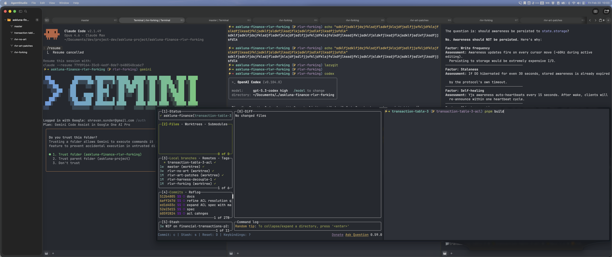
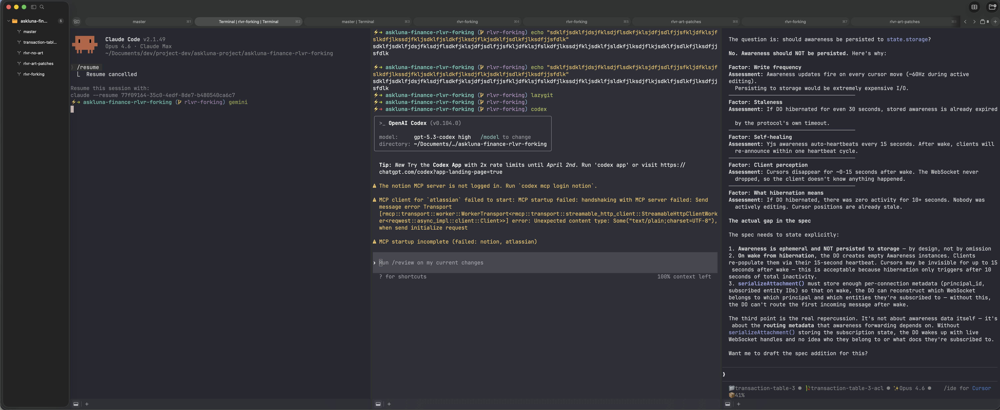
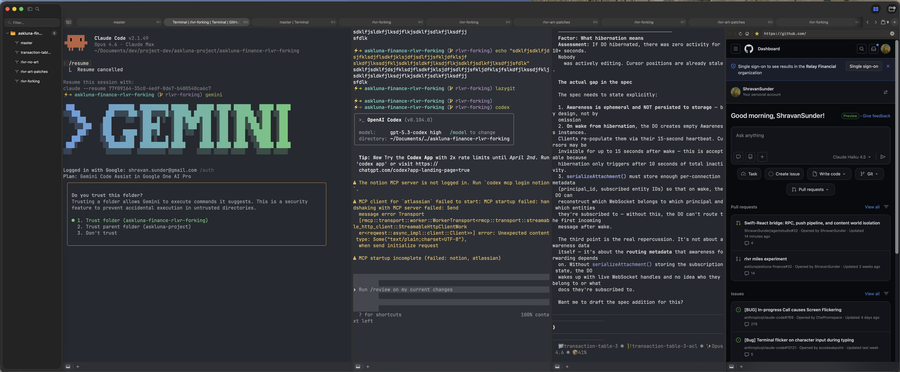
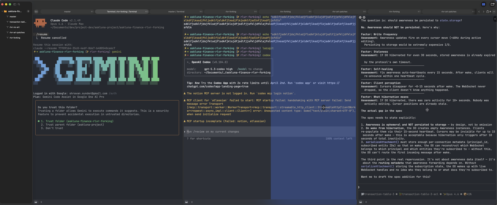

# Agent Studio



A macOS workspace for agent-assisted development. Run multiple coding agents across projects simultaneously — and stay oriented while they work.

Agent-agnostic. Keyboard-first. Native macOS. Built on [Ghostty](https://github.com/ghostty-org/ghostty).

## Install

```bash
brew tap ShravanSunder/agentstudio
brew install --cask agent-studio
```

Requires macOS 26+. No external dependencies.

## Why

Development is changing. Coding agents run alongside you now — sometimes several at once, across multiple projects and worktrees. But the tools weren't built for this.

Your terminals multiply. Context scatters across terminal tabs, browser windows, and editor panels. You alt-tab to GitHub to check a diff, lose your place, and spend more time managing your workspace than doing the work.

Agents spawn sub-processes — builds, tests, tool calls — that float away from the parent with no association. You end up with dozens of panes and no way to tell which belongs to which project, which worktree, or which agent.

Agent Studio is a ground-up redesign of the development experience around agents. Not a terminal with extra features — a workspace where agents, terminals, diffs, PRs, and project context live together.

## How It Works

### One pane per unit of work. Everything else in its drawer.

Each worktree, agent, or task gets a main terminal pane. Below it, a **drawer** holds everything associated with that work — sub-terminals, git operations, build output, webviews, whatever context belongs together.

```
┌─────────────────────────────────────┐
│  Claude Code — feature-auth         │  ← main pane (your agent)
│  > Implementing OAuth flow...       │
│                                     │
├─────────────────────────────────────┤
│ [shell] [git log] [build] [+]       │  ← drawer (associated context)
│ ┌─────────────────────────────────┐ │
│ │ $ git diff --stat               │ │
│ │  src/auth.swift | 42 +++---     │ │
│ └─────────────────────────────────┘ │
└─────────────────────────────────────┘
```

Agent spawns a build? It lands in the drawer. Need to check git status? It's already there. Open a webview to review the PR? Drawer. Close the main pane — the drawer goes with it. Move it to another tab — the drawer follows.

This is what keeps you oriented. Not a flat list of 30 terminals — a structured workspace where every pane has a home.



### GitHub, PRs, and diffs without leaving the workspace

Webview panes sit alongside your terminals. Review a pull request, check CI status, or browse documentation right next to the agent doing the work. No alt-tab. No lost context.



### Built for the keyboard

**Pane arrangements** — save named layouts per tab ("coding", "reviewing", "monitoring") and switch between them. Sessions keep running in the background.

**Session restore** — close the app, reopen, pick up where you left off. Optional zmx-backed persistence is on by default — no tmux, no scripts, no configuration.

**Any agent, any pane** — Claude Code, Codex, aider, Cursor CLI. Agent Studio provides the workspace. The agent is just a process.

**Command bar (Cmd+P)** — one interaction point for everything.



## Roadmap

### Solved

**Pane explosion** — agents and worktrees generate dozens of terminals. Pane drawers keep sub-processes associated with their parent. Split layouts and arrangements let you organize what's visible without killing what's running.

**Lost sessions** — close the app, lose your work. Optional zmx-backed session restore (on by default) brings every session back on relaunch. No tmux, no scripts.

**No project context** — terminals are anonymous. Agent Studio ties every pane to its repo, worktree, and working directory automatically.

### Solving next

**"Which pane was that?"** — you're running agents across five repos. You need to see all panes for one project, or all panes running Claude Code, or all panes in a specific worktree. Today you hunt through tabs.

Dynamic views regroup your entire workspace on demand — by repo, by worktree, by agent type, by CWD — without touching your layout. Switch to "By Agent" and every Claude pane appears in one tab, every aider pane in another. Switch back and your workspace is untouched.

**"I have to leave to review diffs"** — agents generate diffs constantly and you alt-tab to GitHub or VS Code to review them.

Agent Studio will embed a full read-only diff viewer and code review experience directly in pane drawers — inline diffs with syntax highlighting, file tree navigation, markdown-capable review comments, annotations, and review actions. When an agent finishes a task, its changes appear in the drawer right below it. Review, comment, send context back to the agent, move on. Source editing and patch application belong to separate panes/workflows.

**"I just gave an agent root access to my machine"** — agents execute shell commands, install packages, and make network requests with your full permissions. One bad tool call and credentials leak, repos corrupt, or packages install that you didn't authorize. No guardrails.

Built-in sandboxing with network isolation (egress firewalls, domain allowlisting), credential injection (secrets stay on host, never enter the agent environment), and filesystem controls (read-only git, scoped workspace access). Full agent capability, bounded access.

## Architecture

AppKit-main with SwiftUI views. Canonical app state lives in `@MainActor @Observable` atoms under `Core/State/MainActor/Atoms`, with persistence wrappers under `Core/State/MainActor/Persistence`. `WorkspaceStore` wraps workspace-domain atoms, `RepoCacheStore` wraps derived enrichment, and `UIStateStore` wraps app-shell presentation state. `PaneCoordinator` lives in the App composition root and sequences cross-store, cross-feature work without owning domain state.

Pane implementations are feature slices: Terminal owns Ghostty, Webview owns browser panes, Bridge owns the React/WebKit bridge, CodeViewer owns native source viewing, CommandBar owns command-palette state, RepoExplorer owns repo/worktree navigation, and InboxNotification owns notification state. Shared pane layout primitives live in Core; reusable stateless UI primitives live in `SharedComponents`; domain-agnostic utilities live in `Infrastructure`.

Built with Swift 6.2, Swift Package Manager, Swift Testing, AppKit, SwiftUI, Observation, WebKit, Ghostty (via C API), `swift-async-algorithms`, and Zig build tasks. Targets macOS 26.

See the [Architecture Overview](docs/architecture/README.md) for the full system design.

## Development

### Prerequisites

- macOS 26+, Xcode 26+, Swift 6
- [mise](https://mise.jdx.dev/) (`brew install mise`)

Current platform references for docs and implementation work:

- [Swift documentation](https://www.swift.org/documentation/) and [Swift Package Manager](https://docs.swift.org/package-manager/)
- [Swift language concurrency guide](https://docs.swift.org/swift-book/documentation/the-swift-programming-language/concurrency/)
- [Swift Testing](https://developer.apple.com/documentation/testing)
- [AppKit](https://developer.apple.com/documentation/appkit), [SwiftUI](https://developer.apple.com/documentation/swiftui), [Observation](https://developer.apple.com/documentation/observation), and [WebKit](https://developer.apple.com/documentation/webkit)
- [Designing for macOS](https://developer.apple.com/design/human-interface-guidelines/designing-for-macos)

> **Time-based note (as of 2026-04):** Xcode 26.4+ ships a `MacOSX.sdk/usr/lib/libSystem.B.tbd` that omits `arm64-macos` from top-level targets, which breaks zig 0.15.2's bundled linker with `undefined symbol: _abort/_getenv/...` errors when building vendored Ghostty and zmx. Fixed in zig 0.16, not backported to 0.15. Workaround: install **Xcode 26.3** side-by-side at `/Applications/Xcode_26.3.app`, `sudo xcode-select --switch /Applications/Xcode_26.3.app/Contents/Developer`, `xcodebuild -downloadComponent MetalToolchain` (26.3 ships without it), then `rm -rf ~/.cache/zig` and rebuild. Refs: [ghostty#11991](https://github.com/ghostty-org/ghostty/issues/11991), [zig#31658](https://codeberg.org/ziglang/zig/issues/31658). Remove this note once ghostty bumps to zig 0.16 or Apple ships a fixed SDK.

### Build and Run

```bash
mise run doctor-mac           # Check local macOS prerequisites and env hazards
mise install                  # Install pinned tool versions
mise run setup                # Init submodules, build vendored artifacts, copy resources
mise run build                # Build the Swift app
.build/debug/AgentStudio      # Launch
```

### Test, Format, and Lint

```bash
mise run test                 # Run tests
mise run format               # Auto-format Swift sources
mise run lint                 # swift-format + swiftlint
```

If `doctor-mac` reports compiler or linker env pollution from Homebrew LLVM, rerun setup/build from a scrubbed shell environment before assuming the repo build is broken locally.

### Clone

```bash
git clone --recurse-submodules https://github.com/ShravanSunder/agentstudio.git
cd agent-studio
```

### Project Structure

```
agent-studio/
├── Sources/AgentStudio/
│   ├── App/                  # Composition root: boot, lifecycle, windows, panes, coordination
│   ├── Core/                 # Shared models, actions, runtime contracts, atoms, persistence, pane UI
│   ├── Features/             # Terminal, Bridge, Webview, CodeViewer, CommandBar, RepoExplorer, InboxNotification
│   ├── SharedComponents/     # Stateless reusable UI primitives
│   ├── Infrastructure/       # Domain-agnostic utilities and integrations
│   └── Resources/            # App assets, terminfo, shell integration resources
├── Frameworks/               # Generated: GhosttyKit.xcframework (not in git)
├── Tests/                    # Swift Testing suites plus bridge contract fixtures
├── vendor/ghostty/           # Git submodule: Ghostty source
├── vendor/zmx/               # Git submodule: zmx session multiplexer
├── docs/                     # Architecture, guides, plans, specs
└── Package.swift             # SPM manifest
```

## Contributing

Contributions welcome. Fork, branch, test, PR. By submitting a pull request you agree to the [Contributor License Agreement](CLA.md).

## License

[AGPL-3.0](LICENSE)

## Acknowledgments

- [Ghostty](https://github.com/ghostty-org/ghostty) — terminal emulator
- [zmx](vendor/zmx/) — session persistence for terminal processes
