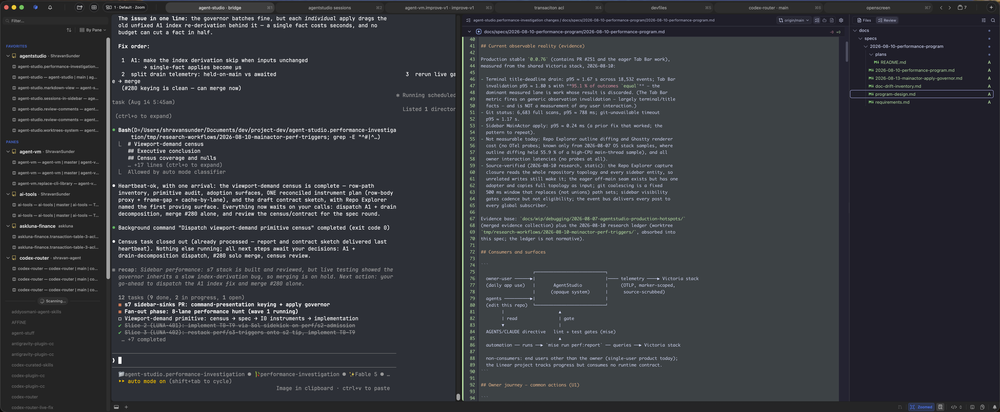

# Agent Studio


An opinionated native macOS workspace for running dozens of coding agents across repositories and worktrees. Stay oriented while they work without losing context.

Agent-agnostic. Repo-aware. Keyboard-first. Built on [Ghostty](https://github.com/ghostty-org/ghostty).

## Install

```bash
brew tap ShravanSunder/agentstudio
brew install --cask agent-studio
```

Requires macOS 26+. No external dependencies.

## Why

Coding agents multiply both the work you can run and the places you can lose track of it. Terminals, builds, diffs, documentation, and reviews spread across tabs, windows, and worktrees. Traditional terminal tabs flatten all of that into one long list.

Agent Studio makes the repository and worktree, not the terminal tab, the unit of organization. Panes carry repository, worktree, branch, and working-directory context. Related panes can live in a drawer. Layouts can be saved as arrangements. Source and changes open beside the terminal that prompted the work.

It is not a terminal with a few agent features added. It is a workspace for keeping agents, terminals, source, reviews, and project context together.

## How It Works

### One pane per unit of work. Related context in its drawer.

Give each worktree, agent session, or task a main pane. Its **drawer** holds the terminals and tools you choose to associate with that work.


The relationship stays simple:

```text
┌─ MAIN PANE ─────────────────────────────────────┐
│  Agent session for feature-auth                 │
│  The primary unit of work                       │
├─ DRAWER ────────────────────────────────────────┤
│  [ Shell ]  [ Diff ]  [ Build ]  [ Browser ]    │
│  Related terminals and tools stay attached      │
└─────────────────────────────────────────────────┘
```

Open a build log, git status, documentation, or a browser beside the agent that prompted it. The drawer travels with its main pane when you move it and closes with that pane when the work is finished.

This is what keeps you oriented. Not a flat list of 30 terminals, but a structured workspace where every pane has a home.

### Stay oriented across repositories and worktrees

Choose one or more folders to watch. Agent Studio scans them for Git repositories and linked worktrees, then keeps that topology current as the filesystem changes. The repository sidebar turns those watched folders into one live map of your work: branches, checkout type, dirty changes, ahead and behind state, pull requests, unread activity, and every open pane. Jump to existing work or open a terminal, Files, or Review for any worktree.

### Keep parallel work separate, but visible

Put Codex, Claude Code, or any CLI agent in its own pane. Each pane keeps its repository, branch, worktree, and current directory visible. Save layouts as named arrangements, or zoom one pane when the work needs focus.

### Close the app without tearing down your work

Persistent terminal sessions are the default. zmx keeps their processes alive when Agent Studio closes, while the app saves the workspace around them. Reopen it to restore your tabs, panes, drawers, layouts, and visible terminal sessions instead of reconstructing the context by hand. Temporary sessions remain available for work you do not want to keep.

### Jump instead of hunting

The command bar is one keyboard interaction model for the workspace. Press Cmd+P for Quick Find, then use `#` for repositories and worktrees, `$` for panes and tabs, and `>` for commands. Recents and open-pane counts help you resume work without remembering where it lives.

<p align="center">
  
</p>

### Review changes in a diff viewer built to stay fast

Agent Studio presents every changed file as one continuous, read-only diff with file-tree navigation and syntax highlighting. The viewer is built on [`@pierre/diffs`](https://www.npmjs.com/package/@pierre/diffs) and [`@pierre/trees`](https://www.npmjs.com/package/@pierre/trees), then adds a demand-driven data path designed to stay responsive when a review spans thousands of changed files.

It does not render the whole change at once: metadata streams separately, visible files hydrate from viewport demand, and a worker prepares bounded render windows before budgeted main-thread updates. Scroll through large reviews without leaving the workspace. Editing stays in your editor.



## What works today

- **Watched folders** discover repositories and linked worktrees, keep them refreshed, and collect them in one navigable sidebar.
- **Structured panes and drawers** keep related terminals and tools together without flattening the workspace.
- **Repository-aware navigation** connects panes to repositories, worktrees, branches, and working directories.
- **Fast keyboard navigation** uses repository, pane, tab, and command scopes with recent-item and open-pane context.
- **Named arrangements and Pane Zoom** let you switch between saved layouts or focus one pane without stopping the others.
- **Full workspace restoration and persistent terminal sessions by default** let you close the app and resume without rebuilding tabs, panes, drawers, layouts, or terminal process context.
- **Built-in Files and Review viewers** keep source and performant read-only diffs beside the agent doing the work.
- **Multiple pane types** let terminal, browser, and native code-viewer content share the same workspace.

## Next

These capabilities are planned, not shipped:

- Review comments, annotations, and context-return workflows.
- Whole-workspace dynamic regrouping beyond the current repository and pane navigation.
- Sandboxed runtimes with explicit network, credential, and filesystem boundaries.

## Architecture

Agent Studio is AppKit-main with SwiftUI views. `AtomRegistry` composes one `CoreAtoms` graph plus explicit feature roots, while persistence wrappers store workspace, repository-cache, and local UI state. `WorkspaceSurfaceCoordinator` sequences cross-feature lifecycle work from the App composition root. `PaneTabViewController` owns pane, drawer, focus, layout, and workspace-command routing.

Pane implementations are feature slices: Terminal owns Ghostty, Webview owns browser panes, Bridge owns the React/WebKit bridge, CodeViewer owns native source viewing, CommandBar owns command-palette state, RepoExplorer owns repo/worktree navigation, and InboxNotification owns notification state. Shared pane layout primitives live in Core; reusable stateless UI primitives live in `SharedComponents`; domain-agnostic utilities live in `Infrastructure`.

Built with Swift 6.2, Swift Package Manager, Swift Testing, AppKit, SwiftUI, Observation, WebKit, Ghostty (via C API), `swift-async-algorithms`, and Zig build tasks. Targets macOS 26.

See the [Architecture Overview](docs/architecture/README.md) for the full system design.

## Development

[DeepWiki: Agent Studio](https://deepwiki.com/ShravanSunder/agentstudio)

### Prerequisites

- macOS 26+, Xcode 26+, Swift 6
- [mise](https://mise.jdx.dev/) (`brew install mise`)

Current platform references for docs and implementation work:

- [Swift documentation](https://www.swift.org/documentation/) and [Swift Package Manager](https://docs.swift.org/package-manager/)
- [Swift language concurrency guide](https://docs.swift.org/swift-book/documentation/the-swift-programming-language/concurrency/)
- [Swift Testing](https://developer.apple.com/documentation/testing)
- [AppKit](https://developer.apple.com/documentation/appkit), [SwiftUI](https://developer.apple.com/documentation/swiftui), [Observation](https://developer.apple.com/documentation/observation), and [WebKit](https://developer.apple.com/documentation/webkit)
- [Designing for macOS](https://developer.apple.com/design/human-interface-guidelines/designing-for-macos)

> **Time-based note (as of 2026-04):** Xcode 26.4+ ships a `MacOSX.sdk/usr/lib/libSystem.B.tbd` that omits `arm64-macos` from top-level targets, which breaks zig 0.15.2's bundled linker with `undefined symbol: _abort/_getenv/...` errors when building vendored Ghostty and zmx. Fixed in zig 0.16, not backported to 0.15. Workaround: install **Xcode 26.3** side-by-side at `/Applications/Xcode_26.3.app`, `sudo xcode-select --switch /Applications/Xcode_26.3.app/Contents/Developer`, `xcodebuild -downloadComponent MetalToolchain` (26.3 ships without it), then `rm -rf ~/.cache/zig` and rebuild. Refs: [ghostty#11991](https://github.com/ghostty-org/ghostty/issues/11991), [zig#31658](https://codeberg.org/ziglang/zig/issues/31658). Remove this note once ghostty bumps to zig 0.16 or Apple ships a fixed SDK.

### Build and Run

```bash
mise run doctor-mac           # Check local macOS prerequisites and env hazards
mise install                  # Install pinned tool versions
mise run setup                # Prepare or reuse vendored build inputs
mise run build                # Build the Swift app
.build/debug/AgentStudio      # Launch
```

### Test, Format, and Lint

```bash
mise run test                 # Run tests
mise run format               # Auto-format Swift sources
mise run lint                 # swift-format + swiftlint
```

Plain `mise run setup` is the normal entry point. It builds Ghostty and zmx in
the primary worktree and reuses those prepared inputs in linked worktrees.
Developers intentionally changing Ghostty or zmx in a linked worktree can use
`mise run setup --use-local-vendors` to hydrate and build private vendor inputs.

If `doctor-mac` reports compiler or linker env pollution from Homebrew LLVM in
a vendor-producing worktree, rerun setup/build from a scrubbed shell environment
before assuming the repo build is broken locally.

### Clone

```bash
git clone https://github.com/ShravanSunder/agentstudio.git agent-studio
cd agent-studio
mise install
mise run doctor-mac
mise run setup
```

### Project Structure

```
agent-studio/
├── Sources/AgentStudio/
│   ├── App/                  # Composition root: boot, lifecycle, windows, panes, coordination
│   ├── Core/                 # Shared models, actions, runtime contracts, atoms, persistence, pane UI
│   ├── Features/             # Terminal, Bridge, Webview, CodeViewer, CommandBar, RepoExplorer, InboxNotification
│   ├── SharedComponents/     # Stateless reusable UI primitives
│   ├── Infrastructure/       # Domain-agnostic utilities and integrations
│   └── Resources/            # App assets, terminfo, shell integration resources
├── Frameworks/               # Generated: GhosttyKit.xcframework (not in git)
├── Tests/                    # Swift Testing suites plus bridge contract fixtures
├── vendor/ghostty/           # Ghostty gitlink; normally unhydrated in linked worktrees
├── vendor/zmx/               # zmx gitlink; normally unhydrated in linked worktrees
├── docs/                     # Architecture, guides, plans, specs
└── Package.swift             # SPM manifest
```

## Contributing

Contributions welcome. Fork, branch, test, PR. By submitting a pull request you agree to the [Contributor License Agreement](CLA.md).

## License

[AGPL-3.0](LICENSE)

## Acknowledgments

- [Ghostty](https://github.com/ghostty-org/ghostty): terminal emulator
- [zmx](https://github.com/neurosnap/zmx): session persistence for terminal processes
