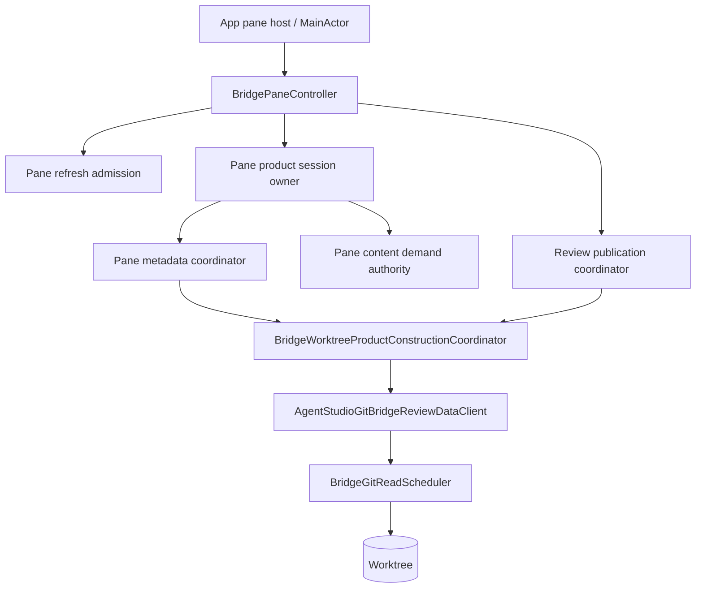
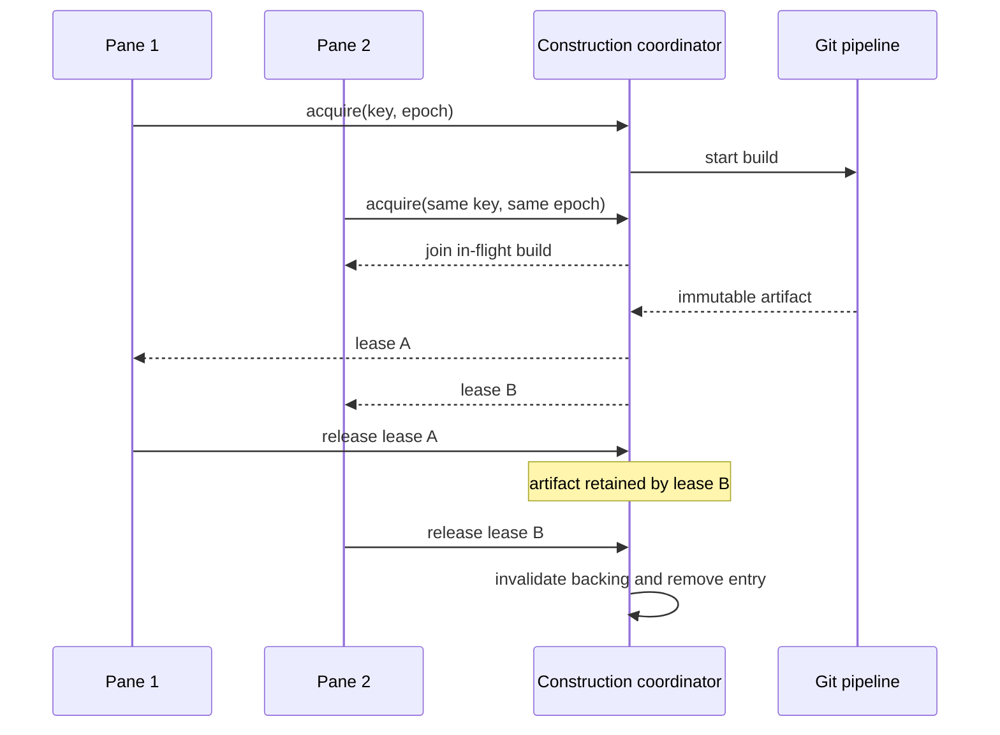
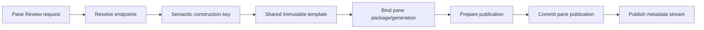
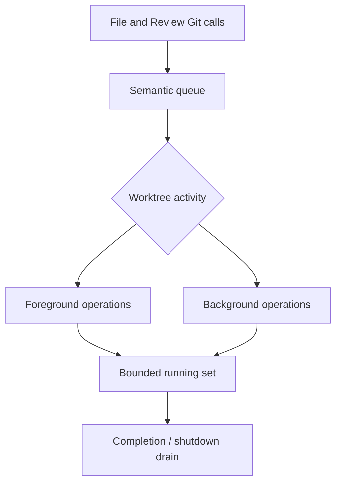
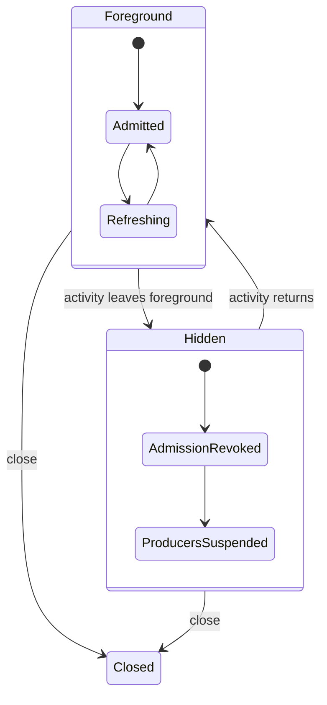

# Bridge Native Runtime Architecture

The native Bridge runtime is the authority for worktree identity, production
Git reads, immutable File/Review construction, pane publication, product
sessions, and content authorization. It keeps expensive Git and preparation
work off the main actor while leaving WebKit and pane presentation under
pane-local control.

Start with [Bridge Viewer Architecture](bridge_viewer_architecture.md) for the
outer model. Continue with [Bridge Web Runtime
Architecture](bridge_web_runtime_architecture.md) at the worker boundary.

## Ownership Map

| Owner | Owns | Does not own |
| --- | --- | --- |
| `BridgePaneController` | WKWebView lifecycle, pane commands, accepted surface and publication wiring | Shared Git artifacts or another pane's state |
| Refresh admission coordinator | Foreground work epoch and hidden/closed admission | Git results or UI selection |
| Product session owner | Capability, stream, subscription, resync, revocation, drain | File/Review semantic construction |
| Metadata/content sources | Pane-scoped metadata production and authorized content reads | Global mutable UI state |
| Review publication coordinator | Prepared, pending, committed, and retiring publication for one pane | Worktree-wide artifact identity |
| Construction coordinator | Worktree epoch, semantic build identity, shared build, leases, invalidation | Pane publication or presentation |
| Git read scheduler | Queued/running/draining Git operation admission and activity priority | Product semantics |
| `agentstudio-git` client | Git object/status/content access and mapping into Bridge contracts | Web rendering or pane selection |

## Shared Construction

A construction identity combines:

- repository, worktree, stable root, and provider identity;
- File status/ignore/path semantics, or Review query/filter/grouping semantics;
- resolved Review endpoints rather than unresolved branch labels;
- the current worktree freshness epoch.

Equivalent requests share one build only when all of those facts match. An
epoch advance makes old entries stale. In-flight waiters fail or retry against
the new epoch; ready artifacts remain alive only while a consumer lease pins
them.

File construction is progressive: consumers can acquire the shared manifest
and request content while construction continues. Review construction produces
an immutable shared template, then binds pane-specific publication identity
after acquisition. That binding step is why construction can be shared without
sharing pane authority.

## Review Build And Publication

The ordering is transactional:

1. Resolve endpoint identity and acquire the matching shared template.
2. Bind the template into a pane-specific package and artifact pin.
3. Prepare publication off-main.
4. Recheck cancellation, foreground admission, and request freshness.
5. Commit the publication and product metadata for that pane.
6. Retire the previous publication only after the replacement is accepted.

Every abandoned or stale path releases its artifact pin. Content handles are
served only through a committed or retiring publication lease, so a body cannot
outlive its publication authority accidentally.

## File Metadata And Content

File mode has two related but separate native products:

- a shared progressive File snapshot/manifest describes the tree and content
  read plans;
- the pane metadata source publishes a pane-scoped stream and authorizes content
  reads for committed subscriptions.

Tree metadata can advance incrementally without pushing complete file bodies.
Content requests are checked against the current subscription, authoritative
path or Review item, demand lane, generation, capability, and source
containment before a byte stream is opened.

## Git Scheduling

The scheduler is a shared execution boundary, not a second cache. It owns
queueing, cancellation, activity ranking, concurrency, and shutdown drain.
Construction owns reuse. `agentstudio-git` owns the Git operation. Keeping
those jobs separate prevents queue state, semantic identity, and provider code
from collapsing into one actor.

Packaged production reads must use `agentstudio-git`. TypeScript Git helpers are
limited to Vite development and fixture construction.

## Product Transport

The native/web product transport has three logical paths:

| Path | Direction | Purpose |
| --- | --- | --- |
| Control | Web to Swift | Open/update/cancel subscriptions, resync, product calls, active surface |
| Metadata frames | Swift to worker | Transactional File tree and Review package/catalog state |
| Content frames | Swift to worker | On-demand, bounded bodies referenced by authorized metadata |

The session capability is pane-scoped. Request admission validates capability,
route, body budget, sequence, stream/session state, and revocation. Metadata
and content frames are acknowledged so native producers can apply backpressure
and release resources.

## Activity, Suspension, And Resume

Leaving foreground advances or revokes the foreground-work admission epoch.
Metadata producers suspend and in-flight foreground work becomes stale. Shared
construction is not automatically destroyed: another foreground pane may still
lease it, and the same pane may reuse current immutable state after resume.

Native pane activity is the only authority that can mint foreground admission.
Browser visibility, focus, and active File/Review mode are presentation facts;
they cannot promote a native pane from `loadedHidden` or `dormant` to
`foreground`. `closed` is terminal.

Resume reacquires admission and restarts work from committed subscription and
publication state. Code must not merely continue an old task after visibility
returns; it must revalidate the current admission and generation.

## Close And Failure Boundaries

The stable close contract is ordered so no producer can publish after authority
is gone. Exact controller composition and call ordering remain subordinate to
the resolved `BridgePaneController` implementation:

1. mark pane activity closed and revoke foreground admission;
2. stop accepting product control and content work;
3. close metadata producers and the product session;
4. close publication and release artifact pins;
5. drain frame pumps, content admission, scheduler consumers, and cleanup;
6. release WebKit handlers and pane resources.

Expected failures are converted into bounded product failure/reset state and
telemetry at the owner boundary. A WebView, worker, Git read, or content stream
failure must not crash the application. Replacement sessions request a fresh
native bootstrap; they do not reuse a revoked capability.

## Invariants

- Shared construction is immutable and worktree-scoped; publication is mutable
  only inside one pane.
- A semantic key is resolved before acquisition; raw branch labels do not stand
  in for immutable Git object identity.
- Every acquired lease has exactly one terminal release path.
- Foreground admission is checked again at commit/publication boundaries.
- Metadata publication precedes content demand for that generation.
- Content routes never trust a client path in place of native metadata.
- Closing and invalidation are idempotent and drain their asynchronous cleanup.
- Git provider, construction, scheduler, publication, and transport remain
  separate owners.

## Source Map

| Concern | Source |
| --- | --- |
| Worktree and semantic keys | `Runtime/Construction/BridgeWorktreeProductConstructionKeys.swift` |
| Shared build, leases, epochs | `Runtime/Construction/BridgeWorktreeProductConstructionCoordinator*.swift` |
| Review template binding | `Transport/BridgePaneReviewSharedConstructionBinder.swift` |
| Progressive File binding | `Transport/BridgePaneProductFileSharedConstructionBinder.swift` |
| Git provider | `Runtime/ReviewFoundation/AgentStudioGitBridgeReviewDataClient*.swift` |
| Git queue | `Runtime/Git/BridgeGitReadScheduler*.swift` |
| Review pipeline/publication | `Runtime/ReviewFoundation/BridgeReviewPipeline.swift`, `BridgeReviewPublicationCoordinator.swift` |
| Pane refresh admission | `Runtime/BridgePaneRefreshAdmissionCoordinator.swift` |
| Pane Review command flow | `Runtime/BridgePaneController+DiffCommands.swift`, `+ReviewProductPublication.swift` |
| Product session | `Transport/BridgePaneProductSessionOwner.swift`, `BridgeProductSession*.swift` |
| Metadata producers | `Transport/BridgePaneProductMetadataCoordinator*.swift` |
| Content demand/admission | `Transport/BridgePaneProductContentDemandAuthority.swift`, `BridgeContentDemandAdmission.swift` |
