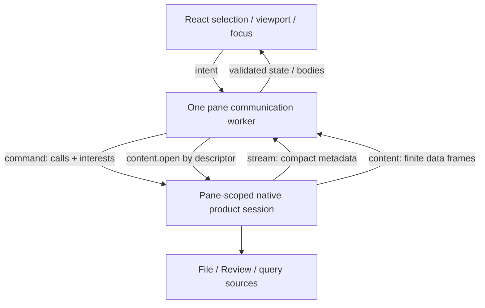
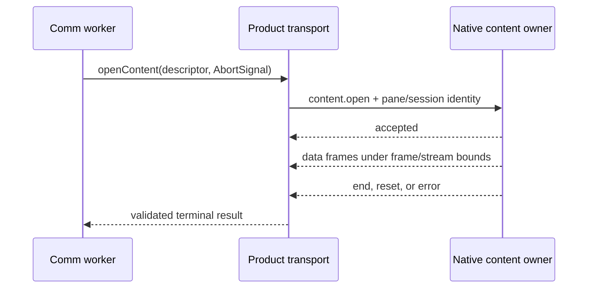

# Bridge Product Transport Architecture

Bridge uses one pane-scoped product transport with three physical routes. The
routes are generic; File, Review, and future Bridge applications give commands,
metadata events, and content their application-specific shape.

Start with [Bridge Viewer Architecture](bridge_viewer_architecture.md). Native
ownership is detailed in [Bridge Native Runtime
Architecture](bridge_native_runtime_architecture.md); worker and demand
ownership are detailed in [Bridge Web Runtime
Architecture](bridge_web_runtime_architecture.md).

## The three route jobs

| Route | Direction | Job |
| --- | --- | --- |
| `agentstudio://rpc/command` | BridgeWeb → native | typed commands, mutations, subscription/demand changes, and query initiation/results |
| `agentstudio://rpc/stream` | native → BridgeWeb | compact pushed state, subscription lifecycle, invalidations, and notifications |
| `agentstudio://rpc/content` | native → BridgeWeb | finite application data requested through an authorized descriptor |

The Swift development backend preserves the same contracts and owners while
mapping them to `/__bridge-product/command`, `/__bridge-product/stream`, and
`/__bridge-product/content` for Vite.



## Command is control, not bulk response transport

A typed product call names application intent and returns a bounded typed
result. Mutations such as `review.comparison.update` may complete with no data.
Queries may return a content descriptor:

```text
typed query call
  → native validates pane/session/application request
  → result returns authorized content descriptor
  → worker opens descriptor through rpc/content
  → actual requested application data arrives as finite frames
```

This keeps application semantics in the call/content registries while the
generic transport remains responsible for correlation, admission, sequencing,
bounds, cancellation, and errors.

## Metadata describes what exists and what changed

One metadata stream is installed per pane. Application subscriptions are
multiplexed over it:

```text
pane metadata stream
  ├─ pane.presentation
  │    activity, refresh state, compact current comparison state
  ├─ file.metadata subscription
  │    source, tree rows/deltas, status, descriptors, invalidations
  └─ review.metadata subscription
       source/publication, item/tree windows and deltas,
       content descriptors, invalidations, resets
```

Generic stream mechanics know stream/subscription identities, sequence,
generation/revision, accepted/reset/end/error, acknowledgement, and
backpressure. File and Review protocols define their own metadata payloads.

Metadata may say that a file or Review item exists, changed, has a particular
extent, and has an authorized content descriptor. It does not carry the file,
diff, or rendered Markdown body.

Item metadata and its content descriptor are not required to arrive in the same
accepted stream event. A consumer may therefore admit selected demand after an
item becomes addressable but before its descriptor is present. That intermediate
condition is nonterminal: the consumer remains loading and waits for the
descriptor mutation. Descriptor arrival is the event that reschedules the
current demand. Only explicit application unavailability or a failed authorized
content request is terminal for that demand.

## Content returns the requested application data

The content route accepts an authorized application descriptor and produces a
finite accepted/data/end, reset, or error stream. Current content kinds include
File and Review bodies. Other finite requested datasets use the same route by
adding an application-specific content kind—not another physical transport.

`content.accepted` establishes transport admission and the framed response
identity for a registered content operation. It does not assert that every
application-specific semantic check has succeeded. A request-scoped descriptor
that becomes stale, replaced, or already claimed after registration therefore
completes as `content.accepted` followed by terminal `content.error`; it does
not produce application data.



## Demand lanes schedule content

Demand lanes are scheduling policy, not transports or data owners:

```text
foreground / selected ─┐
visible                ─┤
nearby                 ─┼─► choose the next content.open request
speculative            ─┤
idle                   ─┘
```

The communication worker derives membership from selection, viewport, focus,
and application policy. Native admission and the content route still authorize
and carry the selected request.

## File and Review application metadata

File subscription interests center on paths. File metadata carries source
identity, bounded tree windows and deltas, Git status facts, file descriptors,
extent facts, and invalidations. Requested file bytes arrive through content.

Review subscription interests center on Review item IDs. Review metadata
carries publication identity, resolved comparison summary, bounded item/tree
windows and deltas, per-item roles and descriptors, and invalidation/reset
events. Requested base/head/diff bodies arrive through content.

Pane presentation carries only compact pane state needed independently of an
application query. For Review comparison this includes the active target,
attempt, and displayed snapshot status. A selectable branch catalog is not pane
lifecycle, File metadata, Review-item metadata, or a notification; it is a
finite requested dataset.

## Placement test

Use these questions when adding Bridge data:

| Question | Owner |
| --- | --- |
| Does the frontend intend a command, mutation, subscription change, or query? | typed command RPC |
| Must compact state or invalidation arrive without an explicit fetch? | metadata stream |
| Is this the actual finite dataset/body the application requested? | content route |
| Which admitted content request should start first? | demand policy |

UI placement does not choose transport placement. A control in the Review
header may depend on both compact current metadata and an on-demand catalog.

## Review comparison target catalog

The Review comparison branch catalog follows the finite requested-dataset path.
Opening the comparison picker issues the typed
`review.comparisonTargets.query` product call, even when Commit is the
remembered mode, so Branch choices are ready for an immediate mode switch.
Native authorization returns a single-use request-scoped descriptor before
catalog production. The worker opens that descriptor through the product
content route; the registered producer task atomically consumes its reservation
and only a successful claim invokes bounded `agentstudio-git` capture,
encoding, and terminal integrity production. The worker validates and decodes
the complete catalog and publishes it to the picker. Newer requests supersede
older ones, and foreground/session loss cancels the pending request.

The wire descriptor contains only content kind, descriptor identity, and the
maximum response bytes. Existing command and `content.open` envelope fields
carry pane, session, Review-surface, and worker authority. The provider-owned
reservation records the issuing authority and matches it against those existing
fields; the transport does not duplicate authority inside the descriptor.

`pane.presentation` carries only the compact active target, attempt state,
displayed snapshot identity, and repository-default identity needed before a
catalog request. The strict metadata contract rejects a target catalog in pane
presentation. The picker filters the complete returned catalog and virtualizes
visible branch rows, so transport bounds and DOM bounds remain separate.

The governing behavior and internal flow are in
[Bridge Review Comparison Target Loading](../specs/2026-08-10-bridge-review-comparison-target-loading/specification.md)
and its Program Design.

## Source map

| Concern | Source |
| --- | --- |
| Route names and limits | [`Sources/AgentStudio/Features/Bridge/Models/Transport/BridgeProductSessionContract.swift`](../../Sources/AgentStudio/Features/Bridge/Models/Transport/BridgeProductSessionContract.swift) |
| Native scheme routing | [`Sources/AgentStudio/Features/Bridge/Transport/BridgeSchemeHandler.swift`](../../Sources/AgentStudio/Features/Bridge/Transport/BridgeSchemeHandler.swift) |
| Typed native calls/content | [`BridgeProductCallContracts.swift`](../../Sources/AgentStudio/Features/Bridge/Models/Transport/BridgeProductCallContracts.swift), [`BridgeProductContentContracts.swift`](../../Sources/AgentStudio/Features/Bridge/Models/Transport/BridgeProductContentContracts.swift) |
| Worker transport API | [`BridgeWeb/src/core/comm-worker/bridge-product-transport.ts`](../../BridgeWeb/src/core/comm-worker/bridge-product-transport.ts) |
| Packaged route mapping | [`bridge-product-agent-studio-request-executor.ts`](../../BridgeWeb/src/core/comm-worker/bridge-product-agent-studio-request-executor.ts) |
| Vite route mapping | [`bridge-product-http-request-executor.ts`](../../BridgeWeb/src/core/comm-worker/bridge-product-http-request-executor.ts) |
| File metadata protocol | [`bridge-product-subscription-contracts.ts`](../../BridgeWeb/src/core/comm-worker/bridge-product-subscription-contracts.ts) |
| Review metadata protocol | [`bridge-product-review-metadata-contracts.ts`](../../BridgeWeb/src/core/comm-worker/bridge-product-review-metadata-contracts.ts) |
