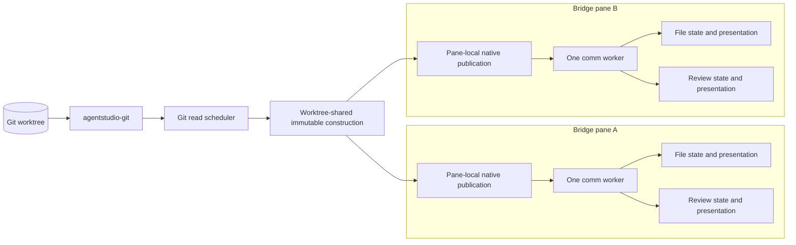
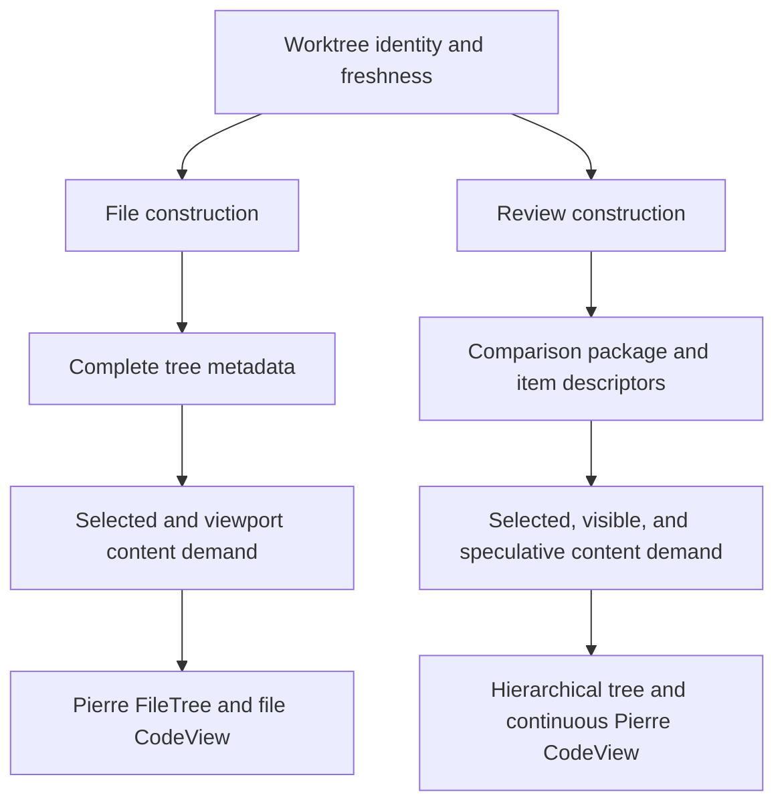
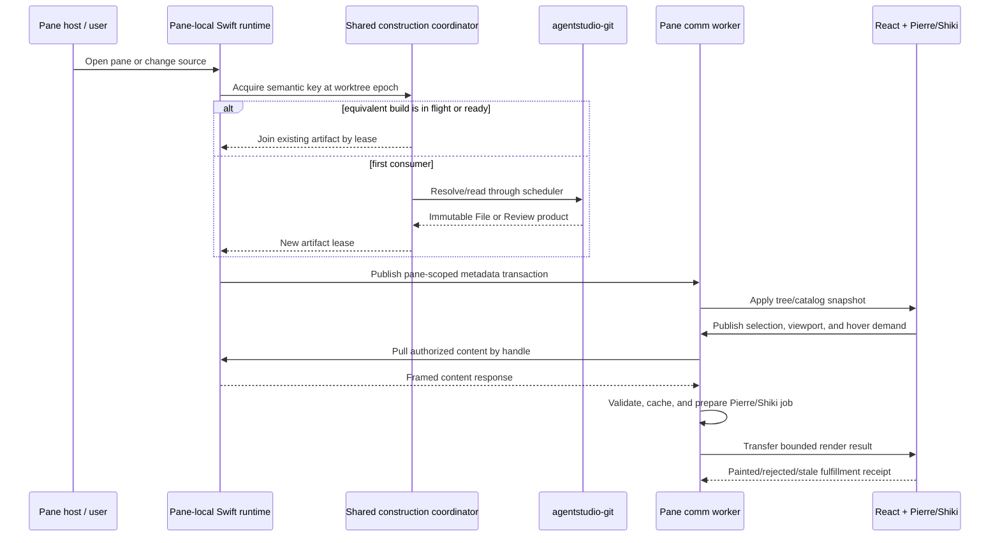
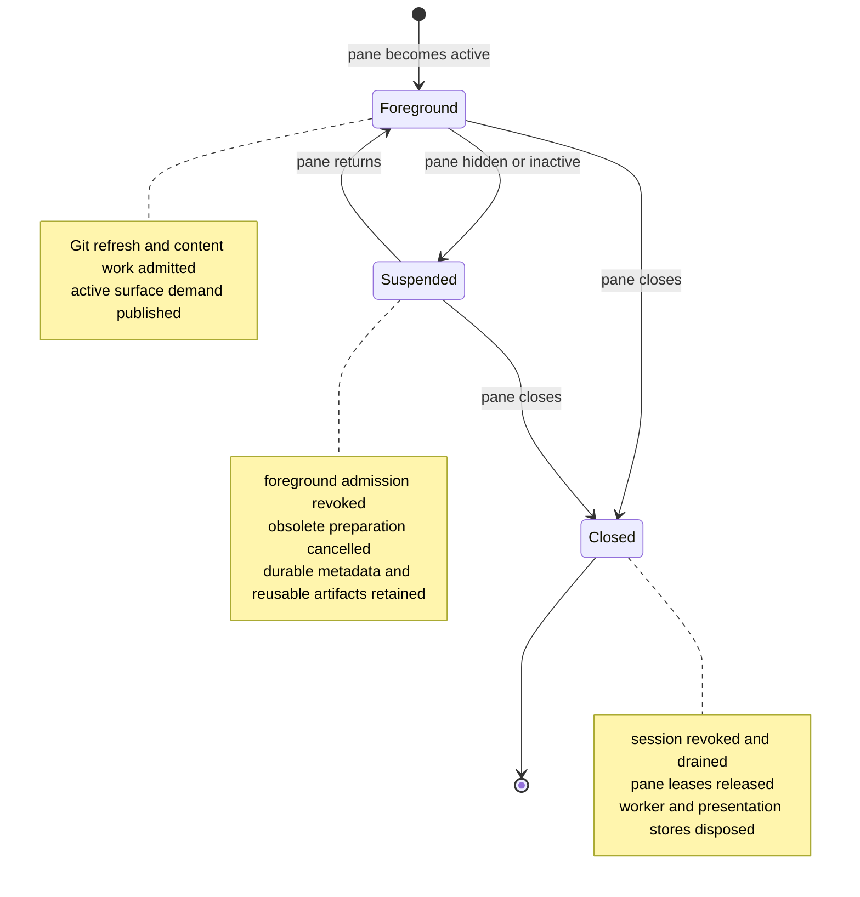

# Bridge Viewer Architecture

Bridge Viewer is Agent Studio's read-only, worktree-aware source browser. One
Bridge pane contains two product surfaces:

- **File** browses the complete worktree and opens one file at a time.
- **Review** presents a hierarchical, continuous comparison of changed files.

Both surfaces use the same native Git authority and pane transport, but they do
not share mutable presentation state. The native runtime builds immutable
worktree products that equivalent panes can reuse; each pane independently owns
publication, demand, selection, scroll, and rendering.

For implementation detail, continue with [Bridge Native Runtime
Architecture](bridge_native_runtime_architecture.md) and [Bridge Web Runtime
Architecture](bridge_web_runtime_architecture.md).

## System Map

The sharing boundary is deliberately narrow:

| Shared by equivalent panes | Kept pane-local |
| --- | --- |
| Resolved Git endpoints and immutable Review template construction | Accepted publication and generation |
| Progressive File manifest/snapshot construction | Product capability, stream, subscription, and resync state |
| Content backing referenced by a live construction lease | Active File/Review surface, selection, hover, filters, and scroll |
| Worktree freshness epoch and Git scheduling | Demand membership, caches, render fulfillment, and DOM state |

This split prevents duplicate Git and diff computation without turning panes
into coupled views of one mutable UI session.

## File And Review Are Different Products

File and Review share visual primitives where the interaction is genuinely the
same, but their data contracts remain separate:

- File metadata describes the worktree tree and content handles for individual
  paths. A file can exist without being changed.
- Review metadata describes a resolved endpoint comparison, ordered review
  items, change kinds, render semantics, and per-role content handles.
- File selection opens one source artifact. Review selection navigates within a
  continuous comparison; it must not replace the package with a single-file
  review.
- Neither surface owns production Git reads in TypeScript. Vite and test fixture
  utilities are the only permitted TypeScript Git boundary.

## Source-To-Paint Lifecycle

Metadata establishes what can be displayed. Content bodies are pulled only
after demand. A metadata-complete pane can therefore still show a short
"Waiting for content" state while a demanded body is fetched and rendered; it
must not remain wedged after demand changes, invalidation, suspension, or
failure.

## Authority And Freshness

The end-to-end freshness chain has several independent identities:

1. **Worktree identity and epoch** invalidate shared construction after source
   changes.
2. **Construction key** includes the semantic File or Review request, resolved
   endpoints, provider identity, and worktree identity.
3. **Pane publication generation** prevents an older native result from
   replacing a newer accepted result in one pane.
4. **Product session and subscription identities** fence metadata and content
   transport.
5. **Worker derivation epoch and render receipts** prevent stale prepared work
   from entering the current display.

No one number replaces the others. Each protects a different ownership
boundary.

## Foreground, Suspension, And Teardown

Suspension is not teardown. Returning to the foreground re-derives work from
current metadata, selection, and viewport state. Closing a pane is terminal and
must release pane-local authority without invalidating an artifact still leased
by another pane.

## Performance Model

Bridge performance comes from doing less duplicate work and keeping expensive
work off the main thread:

- equivalent panes join one worktree construction instead of recomputing it;
- Git reads pass through one scheduler with foreground-aware admission;
- metadata is streamed independently from content bodies;
- demand ranks interactive work ahead of warming work;
- the worker performs content validation and Pierre/Shiki preparation;
- the main thread applies bounded render units and records fulfillment.

Demand policy names are vocabulary, not proof that every lane is active on
every surface. Before tuning a constant, trace the surface's producer,
membership derivation, native interest mapping, fetch admission, cancellation,
and render priority end to end. See [Bridge Web Runtime Architecture — Demand
Is A Pipeline](bridge_web_runtime_architecture.md#demand-is-a-pipeline).

## Non-Goals And Hard Boundaries

- Bridge is read-only source presentation; it does not edit or apply patches.
- Swift and `agentstudio-git` own packaged production Git data.
- There is one comm worker per pane, not one worker per surface or file.
- File and Review do not share mutable worker-local presentation state.
- Shared construction contains immutable products, never pane selection,
  viewport, or publication authority.
- Pierre/Shiki remain the rendering implementation; Bridge does not fork or
  patch Pierre to compensate for application scheduling bugs.
- Legacy projection workers, native push carriers, and compatibility owners are
  not part of the current architecture.

## Source Map

| Concern | Primary source |
| --- | --- |
| Pane hosting and lifecycle | `Sources/AgentStudio/Features/Bridge/Runtime/BridgePaneController*.swift` |
| Shared construction | `Sources/AgentStudio/Features/Bridge/Runtime/Construction/` |
| Git provider and scheduling | `Sources/AgentStudio/Features/Bridge/Runtime/ReviewFoundation/AgentStudioGitBridgeReviewDataClient*.swift`, `Runtime/Git/` |
| Pane product transport | `Sources/AgentStudio/Features/Bridge/Transport/` |
| One-pane-worker topology | `BridgeWeb/src/core/comm-worker/bridge-pane-runtime.ts` and `bridge-pane-comm-worker-session.ts` |
| File and Review UI owners | `BridgeWeb/src/app/bridge-app-file-viewer-mode.tsx`, `bridge-app-review-viewer-mode.tsx` |
| Demand policy | `BridgeWeb/src/core/demand/bridge-content-demand-policy.ts` |
| Pierre/Shiki preparation and fulfillment | `BridgeWeb/src/core/comm-worker/bridge-worker-*`, `bridge-main-render-*` |
