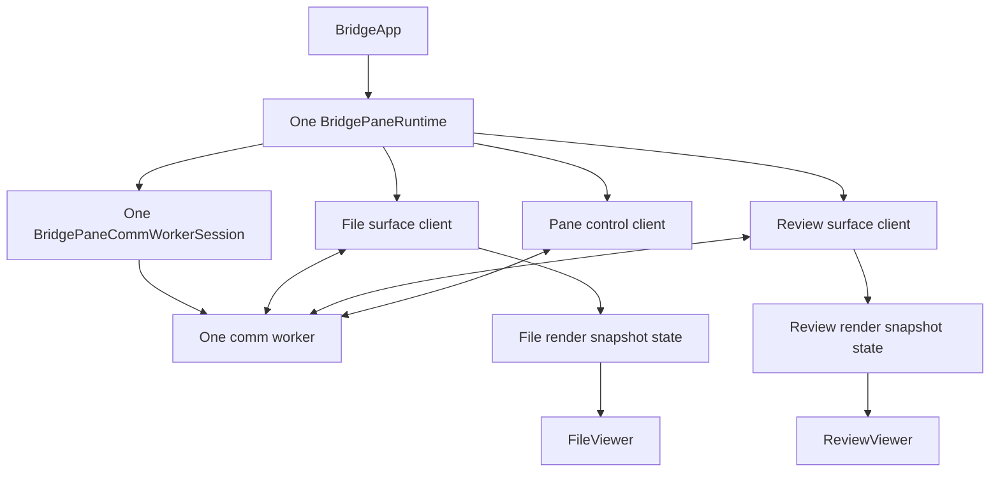
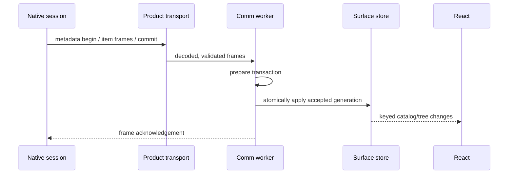
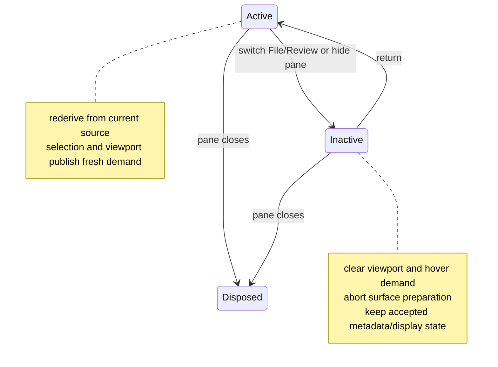

# Bridge Web Runtime Architecture

BridgeWeb is the pane-local React and worker runtime for Bridge Viewer. Each
pane creates exactly one communication worker. File and Review share that
worker and product session, while retaining separate surface clients,
surface-local worker state, main-thread render stores, demand state, and
presentation owners.

Start with [Bridge Viewer Architecture](bridge_viewer_architecture.md). The
native side is documented in [Bridge Native Runtime
Architecture](bridge_native_runtime_architecture.md).

## Runtime Topology



`BridgeApp` creates the pane runtime once and obtains the File, Review, and pane
control clients from it. The clients multiplex over one worker session. Creating
a second surface must not create a second comm worker, and switching modes must
not destroy the inactive surface's durable display state.

## State Boundaries

| State | Owner | Examples |
| --- | --- | --- |
| Product/session state | Comm worker | capability, stream, subscriptions, resync, native bootstrap |
| File runtime state | File-owned fields and projections in the comm worker | tree metadata, source generation, selection, File demand, cached bodies |
| Review runtime state | Review-owned fields and projections in the comm worker | package/catalog, item metadata, Review demand, render fulfillment |
| Main-thread display snapshots | Surface-specific render stores | compact keyed rows/items and transaction cursors |
| React presentation | File or Review component | search, filters, tree expansion, reveal, scroll, local control refs |
| Native truth | Swift | worktree, Git products, publication, content authorization |

Large content and prepared render payloads do not belong in React state or
Zustand. The worker owns byte-oriented preparation and transfers bounded display
artifacts to the main thread. React subscribes to keyed snapshots so one item
change does not rebuild the entire package.

## Metadata Intake



File and Review metadata use separate applicators and projections. Transactions
are generation/epoch checked before commit. A reset clears identities and
derived state that belong to the retired source; it does not leave old items
addressable through a new generation.

Metadata intake is not content hydration. It makes tree rows, item descriptors,
content handles, and render semantics available so demand can be derived.

## Demand Is A Pipeline

```mermaid
flowchart LR
    Intent[Selection / viewport / hover]
    Membership[Demand membership]
    Rank[Lane and priority]
    NativeInterest[Subscription interest]
    Admission[Native content admission]
    Fetch[Content fetch]
    Cache[Worker byte/body registry]
    Prepare[Pierre/Shiki preparation]
    Apply[Main-thread bounded apply]
    Paint[Paint fulfillment receipt]

    Intent --> Membership --> Rank --> NativeInterest --> Admission --> Fetch --> Cache --> Prepare --> Apply --> Paint
```



A lane is working only when every arrow exists. A policy constant by itself does
not schedule content.

The shared role vocabulary is:

| Role | Intended source | Relative priority |
| --- | --- | --- |
| selected | explicit selection | highest |
| visible | current tree or CodeView viewport | immediate |
| nearby | bounded area around the viewport | warming |
| speculative | hover or prediction | opportunistic |
| background | bounded package-prefix warming | lowest |

The active producer set is surface-specific and must be verified in code before
tuning. Review currently has explicit selected, visible, and hover-speculative
preparation paths. File publishes selected, visible, and nearby metadata
interests. Background retention limits in policy do not, by themselves, prove
that a background producer is installed.

## Selection, Visible Demand, And Heavy Scroll

Selected work is latency-sensitive but cannot starve the viewport forever.
Visible demand is derived from the current accepted package and viewport. The
worker caps concurrent starts, tracks in-flight membership, and reruns a visible
item when source churn makes an active preparation obsolete.

During momentum scrolling:

1. React publishes a new viewport membership.
2. Items leaving demand lose membership; their stale results are rejected even
   if underlying fetch cancellation races completion.
3. Newly visible items enter the immediate queue.
4. Worker preparation produces bounded windows rather than whole-file DOM work.
5. The main-thread apply pump enforces time and unit budgets and sends a render
   disposition receipt.

Look-ahead/behind constants describe membership policy. They do not compensate
for missing cancellation, an unbounded global start rate, or a render job whose
priority is lost before Pierre/Shiki. Those are separate pipeline boundaries.

## Content Fetch, Cache, And Materialization

```mermaid
sequenceDiagram
    participant D as Demand scheduler
    participant P as Product transport
    participant C as Native content source
    participant W as Worker preparation
    participant M as Main render store

    D->>P: fetch authorized descriptor/handle
    P->>C: streamed content request
    C-->>P: framed bytes + identity
    P-->>W: decoded content
    W->>W: verify identity; register/cache body
    W->>W: run bounded Pierre/Shiki job
    W-->>M: transferable render payload
    M-->>D: painted/rejected/stale receipt
```

The byte/body registry is a worker-local optimization, not source authority.
Entries are keyed by content identity, invalidated when metadata changes, and
bounded separately from lane concurrency. A "25% of byte-cache capacity"
policy is a warming admission budget; it does not mean the cache fetches or
evicts twenty-five percent at once.

Materialization has two budgets:

- worker render budgets limit bytes and line windows sent through Pierre/Shiki;
- main-thread apply budgets limit work per animation frame and preserve
  selected/visible fairness.

## Pierre And Shiki Ownership

The comm worker prepares Pierre render work and returns transferable results.
The main thread adapts those results into File or Review display snapshots.
Pierre FileTree and CodeView remain the product renderers; Bridge does not
replace them with route-local lists or `<pre>` fallbacks.

Review uses a continuous CodeView over ordered review items. File uses a single
selected file view. Both may share UI primitives and render couriers, but their
source identities and fulfillment registries stay separate.

## Surface Activation And Suspension



Inactive Review clears hover and visible item IDs and suspends its preparation
lifecycle. Resume creates a fresh abort scope and replays only current metadata,
selected, and visible work. File follows the same ownership rule through its
surface-specific controller.

The pane worker itself survives a File/Review switch. It is disposed only when
the pane runtime closes or is replaced after a worker/session failure.

## Reset, Replacement, And Reconvergence

Stale work can exist at several stages: queued, fetching, cached, preparing,
transferred, or waiting for main-thread apply. Each stage checks current source,
generation, worker derivation epoch, or fulfillment identity before committing.

On source reset or worker replacement:

1. abort active surface work and cancel queued tickets;
2. clear retired demand and fulfillment identities;
3. install a fresh native bootstrap and capability;
4. replay committed metadata through a new session;
5. rederive selection and viewport demand;
6. accept paint receipts only for the new derivation epoch.

Failure must converge to retry, reset, or an explicit unavailable state. A
permanent `loading` entry with no active demand or retry owner is a lifecycle
bug, not a valid idle state.

## Invariants

- Exactly one comm worker exists per Bridge pane.
- File and Review never share mutable surface state merely because they share a
  worker.
- React owns presentation; the worker owns heavy preparation; Swift owns Git
  and content authority.
- Metadata commits atomically before demand addresses its content.
- Demand membership is re-derivable and stale completion is harmless.
- Inactive surfaces do not continue foreground hydration.
- Cache identity includes source/content freshness, not only a path or item ID.
- Main-thread apply is bounded and returns explicit fulfillment disposition.
- Production rendering uses Pierre/Shiki; production Git uses
  `agentstudio-git` through Swift.

## Source Map

| Concern | Source |
| --- | --- |
| Pane runtime and surface clients | `BridgeWeb/src/core/comm-worker/bridge-pane-runtime.ts` |
| One worker session | `bridge-pane-comm-worker-session.ts` |
| Worker entry and runtime protocol | `bridge-comm-worker-entry.ts`, `bridge-comm-worker-runtime-protocol.ts` |
| File/Review worker state | `bridge-comm-worker-store.ts`, `bridge-comm-worker-file-view-runtime.ts`, `bridge-comm-worker-review-runtime.ts` |
| Review demand scheduling | `bridge-comm-worker-review-demand-scheduling.ts` |
| Demand policy | `BridgeWeb/src/core/demand/bridge-content-demand-policy.ts` |
| Content preparation pump | `bridge-worker-content-preparation-pump.ts` |
| Pierre/Shiki jobs | `bridge-worker-pierre-render-job.ts`, `bridge-worker-pierre-courier.ts` |
| Main-thread snapshots and fulfillment | `bridge-main-render-snapshot-store.ts`, `bridge-main-render-fulfillment-coordinator.ts` |
| React mode ownership | `BridgeWeb/src/app/bridge-app.tsx`, `bridge-app-file-viewer-mode.tsx`, `bridge-app-review-viewer-mode.tsx` |
