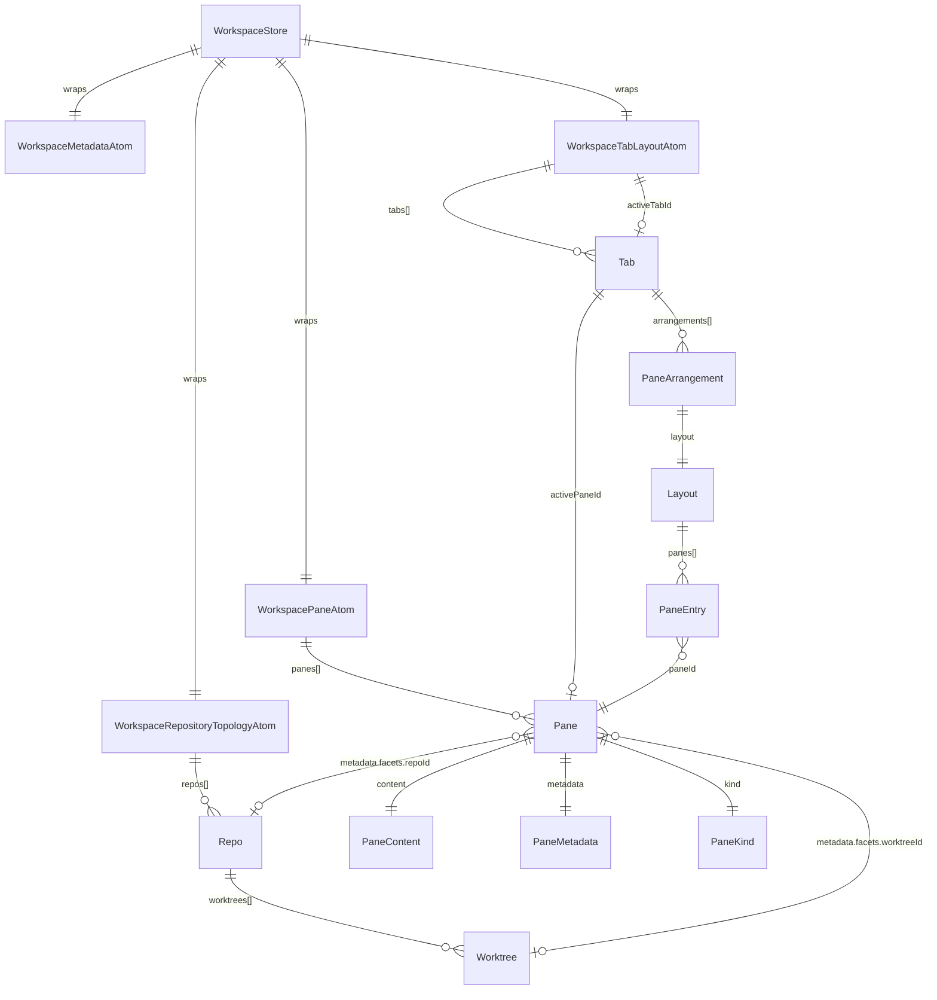
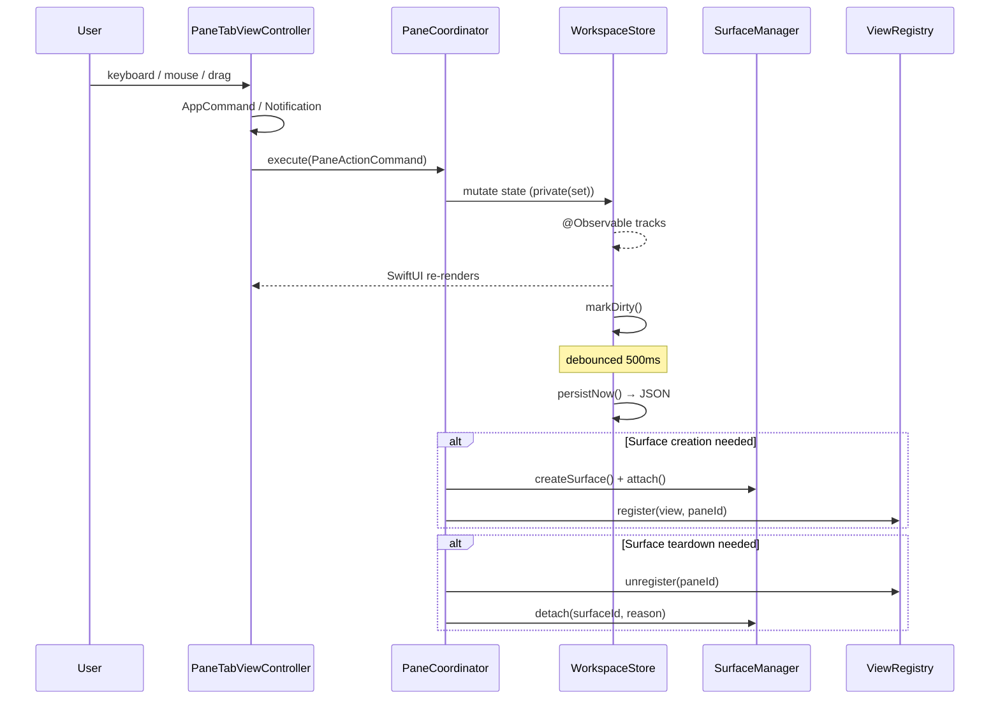
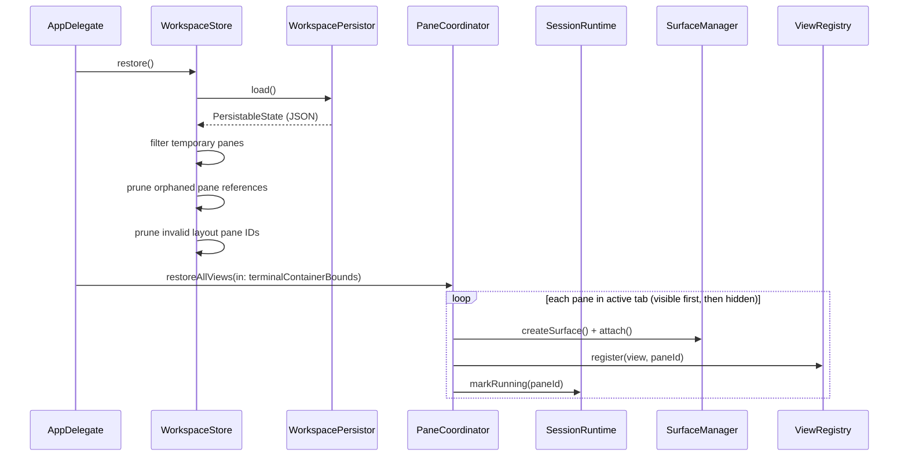

# Component Architecture

## TL;DR

State is distributed across independent `@Observable` atoms (Jotai-style atomic stores) with `private(set)` for unidirectional flow (Valtio-style). `WorkspaceStore` is a persistence wrapper over four atoms (`WorkspaceMetadataAtom`, `WorkspaceRepositoryTopologyAtom`, `WorkspacePaneAtom`, `WorkspaceTabLayoutAtom`). `SurfaceManager` owns Ghostty surfaces, `SessionRuntime` owns backends. A coordinator sequences cross-store operations. `Pane` is the primary entity — referenced by UUID across every layer. Tabs own arrangements containing flat pane-strip layouts. `@Observable` drives SwiftUI re-renders; persistence is debounced. Twelve invariants are enforced at all times.

---

## 1. Overview

### 1.1 Architecture Principles

1. **Pane identity is primary** — `Pane` is the primary entity in the window system. `PaneId` (UUID v7) is the single identity used across every layer: `WorkspacePaneAtom`, `Layout`, `ViewRegistry`, `SurfaceManager`, `SessionRuntime`, and zmx. A pane exists independently of layout position, tab, or surface and can move between tabs and layout positions while keeping identity.
2. **Atomic stores (Jotai-style)** — Each domain has its own `@Observable` atom. `WorkspaceMetadataAtom` owns workspace identity, `WorkspaceRepositoryTopologyAtom` owns repos/worktrees, `WorkspacePaneAtom` owns panes, `WorkspaceTabLayoutAtom` owns tabs/arrangements. `SurfaceManager` owns Ghostty surfaces. `SessionRuntime` owns backends. No god-store — each atom has one domain, one reason to change, testable in isolation.
3. **Unidirectional flow (Valtio-style)** — All store state is `private(set)`. External code reads freely, mutates only through store methods. No action enums, no reducers — the compiler enforces the boundary.
4. **Coordinator for cross-store sequencing** — A coordinator sequences operations across multiple stores for a single user action. Owns no state, contains no domain logic. If a coordinator method contains an `if` that decides what to do with domain data, that logic belongs in a store.
5. **Explicit layout model** — `Layout` is a flat pane-strip value type with ordered `PaneEntry` items. Leaves reference panes by ID. No `NSView` references, no opaque blobs.
6. **Surface independence** — Ghostty surfaces are ephemeral runtime resources. The model layer never holds `NSView` references.
7. **Provider abstraction** — zmx is a headless restore backend. The model carries provider metadata without coupling to zmx specifics.
8. **AsyncStream over Combine/NotificationCenter** — All new event plumbing uses `AsyncStream` + `swift-async-algorithms`. Existing Combine/NotificationCenter migrated incrementally.
9. **Testability** — Core model and layout logic are pure value types. Injectable `Clock` for time-dependent logic. No real delays in tests.

Clock migration note (target pattern, not fully complete yet): remaining production `Task.sleep` call sites are in
`MainSplitViewController` and `AppDelegate`. Store-level time-dependent paths in `WorkspaceStore`, `SessionRuntime`,
and `SurfaceManager` have been migrated to injected clocks in this branch. The target is
constructor-injected clocks (`any Clock<Duration>`) for all store-level time-dependent behavior.

Configuration injection pattern: prefer constructor injection with defaults over mutable configuration vars. Example:
`init(clock: any Clock<Duration> = ContinuousClock(), ...)` and `private let` configuration fields.

### 1.2 High-Level System Diagram

```
┌──────────────────────────────────────────────────────────────────────┐
│                            AppDelegate                               │
│                                                                      │
│   Persisted State            Runtime                   UI Bridge     │
│  ┌──────────────┐    ┌───────────────┐    ┌──────────────────────┐   │
│  │WorkspaceStore│    │SessionRuntime │    │    ViewRegistry       │   │
│  │ (persistence │    │ statuses      │    │ paneId → PaneViewSlot│   │
│  │  wrapper)    │◄───│ backends      │    │ renderTree()         │   │
│  │ Metadata Atom│    └───────┬───────┘    └──────────┬───────────┘   │
│  │ Topology Atom│            │                       │               │
│  │ Pane Atom    │            │                       │               │
│  │ TabLayout Atm│            │                       │               │
│  └──────┬───────┘            │                       │               │
│         │            ┌───────┴───────────────────────┴────────┐      │
│         │            │      PaneCoordinator                   │      │
│         │            │   (sole bridge: model ↔ view ↔ surface) │      │
│         │            └───────────────────┬────────────────────┘      │
│         │                                │                           │
│  ┌──────┴──────┐                ┌────────┴────────┐                  │
│  │   Action    │                │ SurfaceManager  │                  │
│  │  Executor   │                │   (singleton)   │                  │
│  │ (dispatch)  │                │ active|hidden   │                  │
│  └─────────────┘                │ |undoStack      │                  │
│                                 └─────────────────┘                  │
│  ┌─────────────┐  ┌────────────┐  ┌──────────────┐                  │
│  │TabBarAdapter│  │ Persistor  │  │WorktrunkSvc  │                  │
│  │(derived UI) │  │ (JSON I/O) │  │(git worktree)│                  │
│  └─────────────┘  └────────────┘  └──────────────┘                  │
└──────────────────────────────────────────────────────────────────────┘
```

---

## 2. Data Model

### 2.1 Entity Relationship Overview


```mermaid
erDiagram
    WorkspaceStore ||--|| WorkspaceMetadataAtom : "wraps"
    WorkspaceStore ||--|| WorkspaceRepositoryTopologyAtom : "wraps"
    WorkspaceStore ||--|| WorkspacePaneAtom : "wraps"
    WorkspaceStore ||--|| WorkspaceTabLayoutAtom : "wraps"

    WorkspaceRepositoryTopologyAtom ||--o{ Repo : "repos[]"
    Repo ||--o{ Worktree : "worktrees[]"

    WorkspacePaneAtom ||--o{ Pane : "panes[]"
    WorkspaceTabLayoutAtom ||--o{ Tab : "tabs[]"
    WorkspaceTabLayoutAtom ||--o| Tab : "activeTabId"

    Tab ||--o{ PaneArrangement : "arrangements[]"
    Tab ||--o| Pane : "activePaneId"

    PaneArrangement ||--|| Layout : "layout"
    Layout ||--o{ PaneEntry : "panes[]"
    PaneEntry }o--|| Pane : "paneId"

    Pane ||--|| PaneContent : "content"
    Pane ||--|| PaneMetadata : "metadata"
    Pane ||--|| PaneKind : "kind"

    Pane }o--o| Worktree : "metadata.facets.worktreeId"
    Pane }o--o| Repo : "metadata.facets.repoId"
```

### 2.2 Repo & Worktree

Models are split across two stores. See [Workspace Data Architecture](workspace_data_architecture.md) for the full persistence tier spec and enrichment pipeline.

**`Repo`** — A git repository on disk. Structure-only — no enrichment data.

| Field | Type | Notes |
|-------|------|-------|
| `id` | `UUID` | Primary key |
| `name` | `String` | Directory name |
| `repoPath` | `URL` | Filesystem path |
| `worktrees` | `[Worktree]` | Git worktrees (each has explicit repoId FK) |
| `createdAt` | `Date` | When the repo was added |
| `stableKey` | `String` | SHA-256 of path, derived, deterministic across reinstalls |

**`Worktree`** — A git worktree within a repo. Structure-only.

| Field | Type | Notes |
|-------|------|-------|
| `id` | `UUID` | Primary key |
| `repoId` | `UUID` | FK to parent Repo |
| `name` | `String` | Display name |
| `path` | `URL` | Filesystem path |
| `isMainWorktree` | `Bool` | Whether this is the main checkout |
| `stableKey` | `String` | SHA-256 of path, derived |

All enrichment (branch, git status, origin, PR counts) lives in `RepoCacheAtom`, populated by the event bus. See the "Three Persistence Tiers" section in workspace_data_architecture.md.

> **Files:** `Core/Models/Repo.swift`, `Core/Models/Worktree.swift`

### 2.3 Pane

The **primary entity** in the window system. Stable identity for any content type, independent of layout position, tab, or surface. The `id` (UUID v7, time-ordered) is the single identity used across every layer: `WorkspacePaneAtom`, `Layout`, `ViewRegistry`, `SurfaceManager`, `SessionRuntime`, and zmx.

| Field | Type | Notes |
|-------|------|-------|
| `id` | `UUID` | Immutable primary key (UUID v7), never changes |
| `content` | `PaneContent` | Discriminated union: what this pane displays |
| `metadata` | `PaneMetadata` | Context tracking, grouping facets, identity |
| `residency` | `SessionResidency` | Lifecycle position |
| `kind` | `PaneKind` | Whether this is a layout pane or a drawer child |

**`PaneKind`** — Discriminant for container context:
- `.layout(drawer: Drawer)` — Top-level pane in a tab's layout tree. Always has a drawer container.
- `.drawerChild(parentPaneId: UUID)` — Child pane inside a drawer. Cannot have a sub-drawer.

**`PaneContent`** — Discriminated union for the content type held by a pane. Each pane holds exactly one content type, fixed at creation. Uses custom `Codable` with a `type` discriminator for forward-compatible deserialization:
- `.terminal(TerminalState)` — Terminal emulator (Ghostty or zmx-backed). `TerminalState` contains `provider: SessionProvider` and `lifetime: SessionLifetime`.
- `.webview(WebviewState)` — Embedded web content. `WebviewState` contains `url`, `title`, `showNavigation`.
- `.bridgePanel(BridgePaneState)` — Bridge-backed React panel (e.g., diff viewer). `BridgePaneState` contains `panelKind: BridgePanelKind` and optional `source`.
- `.codeViewer(CodeViewerState)` — Source code viewer. `CodeViewerState` contains `filePath` and optional `scrollToLine`.
- `.unsupported(UnsupportedContent)` — Placeholder for unrecognized content types. Preserved on round-trip to avoid data loss.

**`PaneMetadata`** — Rich identity and context tracking. Fixed-at-creation fields plus live fields updated by the enrichment pipeline:

| Field | Mutability | Type | Notes |
|-------|-----------|------|-------|
| `paneId` | immutable | `PaneId` | Mirrors `Pane.id`, enforced equal on decode |
| `contentType` | immutable | `PaneContentType` | `.terminal`, `.browser`, `.diff`, `.codeViewer`, `.plugin(String)` |
| `source` | immutable | `PaneMetadataSource` | `.worktree(worktreeId, repoId, launchDirectory)` or `.floating(launchDirectory, title)` |
| `executionBackend` | immutable | `ExecutionBackend` | `.local`, `.docker(image)`, `.gondolin(policyId)`, `.remote(host)` |
| `createdAt` | immutable | `Date` | Creation timestamp |
| `title` | live | `String` | Display title (updated from shell) |
| `facets` | live | `PaneContextFacets` | Dynamic grouping: `repoId`, `worktreeId`, `cwd`, `repoName`, `worktreeName`, `parentFolder`, `organizationName`, `origin`, `upstream`, `tags` |
| `checkoutRef` | live | `String?` | Current git checkout ref |

**`SessionProvider`** — Backend type for terminal panes:
- `.ghostty` — Direct Ghostty surface, no session multiplexer
- `.zmx` — Headless zmx backend for persistence/restore across app restarts

**`SessionLifetime`** — Whether the terminal session survives app restart:
- `.persistent` — zmx-backed, saved to disk and restored on launch.
- `.temporary` — Ephemeral, never persisted. Filtered out during save/restore.

**`SessionResidency`** — Where the pane currently lives in the app lifecycle. Prevents false-positive orphan detection:
- `.active` — In a layout, view exists, fully visible
- `.pendingUndo(expiresAt: Date)` — Closed but in the undo window. Not an orphan.
- `.backgrounded` — Alive but not visible in the current view. Not an orphan.
- `.orphaned(reason: WorktreeUnavailableReason)` — Backing worktree path is unavailable.

**`Drawer`** — A container holding child panes attached to a parent layout pane. Mirrors tab container capabilities:

| Field | Type | Notes |
|-------|------|-------|
| `paneIds` | `[UUID]` | Owned child panes in insertion order |
| `layout` | `Layout` | Spatial arrangement (same `Layout` type as tabs) |
| `activePaneId` | `UUID?` | Currently focused pane. Nil when empty. |
| `isExpanded` | `Bool` | Whether the drawer panel is visible or collapsed |
| `minimizedPaneIds` | `Set<UUID>` | Transient — not persisted |

> **Files:** `Core/Models/Pane.swift`, `Core/Models/PaneContent.swift`, `Core/RuntimeEventSystem/Contracts/PaneMetadata.swift`, `Core/RuntimeEventSystem/Contracts/PaneId.swift`, `Core/Models/Drawer.swift`, `Core/Models/TerminalSource.swift`, `Core/Models/SessionLifetime.swift`, `Core/Models/SessionResidency.swift`

### 2.4 DynamicView

Dynamic views are projections of workspace state into virtual tab groups, used by the sidebar and view switcher. They do not own tabs — they project panes through a grouping facet.

**`DynamicViewType`** — The facet type for grouping:
- `.byRepo` — One tab per repository
- `.byWorktree` — One tab per worktree
- `.byCWD` — One tab per distinct CWD
- `.byParentFolder` — One tab per parent folder of repos

**`DynamicViewGroup`** — A single group in a projection (one virtual tab):
- `id: String` — Stable identity derived from the group key
- `name: String` — Display name
- `paneIds: [UUID]` — Pane IDs in this group
- `layout: Layout` — Auto-tiled layout for display

**`DynamicViewProjection`** — Result of projecting workspace state through a dynamic view:
- `viewType: DynamicViewType` — The grouping facet used
- `groups: [DynamicViewGroup]` — Generated groups sorted alphabetically

> **File:** `Core/Models/DynamicView.swift`

### 2.5 Tab

A tab in the workspace. Contains panes organized into arrangements. Order is implicit — determined by array position in `WorkspaceTabLayoutAtom.tabs`.

| Field | Type | Persisted | Notes |
|-------|------|-----------|-------|
| `id` | `UUID` | yes | Primary key |
| `name` | `String` | yes | Display name |
| `allPaneIds` | `[UUID]` | yes | All pane IDs owned by this tab |
| `arrangements` | `[PaneArrangement]` | yes | Named arrangements. Always has at least one default. |
| `activeArrangementId` | `UUID` | yes | Currently active arrangement |
| `activePaneId` | `UUID?` | yes | Focused pane within this tab. Nil only during construction. |
| `zoomedPaneId` | `UUID?` | no | Display-only zoom state. Zoomed pane fills the tab. |
| `minimizedPaneIds` | `Set<UUID>` | no | Panes collapsed to narrow bars. Transient. |

**Derived state:**
- `defaultArrangement` — The arrangement with `isDefault == true` (exactly one per tab)
- `activeArrangement` — The arrangement matching `activeArrangementId`
- `activePaneIds` — Pane IDs in the active arrangement's layout (left-to-right)
- `isSplit` — Whether the active arrangement has more than one pane
- `layout` — The layout of the active arrangement (convenience accessor)

**`PaneArrangement`** — A named arrangement of panes within a tab. Each tab has exactly one default arrangement and zero or more custom arrangements:

| Field | Type | Notes |
|-------|------|-------|
| `id` | `UUID` | Primary key |
| `name` | `String` | Display name |
| `isDefault` | `Bool` | Exactly one per tab must be `true` |
| `layout` | `Layout` | Spatial layout of panes |
| `visiblePaneIds` | `Set<UUID>` | Subset of tab's panes visible in this arrangement |

> **Files:** `Core/Models/Tab.swift`, `Core/Models/PaneArrangement.swift`

### 2.6 Layout (Pure Value Type)

A flat pane strip shared by pane containers (tabs and drawers). Every pane is a direct sibling in left-to-right order with a preserved width ratio. All operations return **new** `Layout` instances — no in-place mutation.

```
Layout
├── panes: [PaneEntry]       # ordered left-to-right
│   └── PaneEntry
│       ├── paneId: UUID
│       └── ratio: Double    # normalized, sums to 1.0
└── dividerIds: [UUID]       # count == max(panes.count - 1, 0)
```

**Immutable Operations** (all return new Layout):

| Operation | Description |
|-----------|-------------|
| `inserting(paneId:at:direction:position:)` | Insert a pane adjacent to a target. Splits the target's ratio in half. |
| `removing(paneId:)` | Remove a pane; redistributes ratio to neighbor. Returns `nil` if layout becomes empty. |
| `resizing(splitId:ratio:)` | Update a divider's ratio (clamped 0.1–0.9) |
| `equalized()` | Set all pane ratios to equal values |
| `autoTiled(_:)` | Static factory: create a layout with equal-ratio panes |

**Navigation:**

| Method | Description |
|--------|-------------|
| `neighbor(of:direction:)` | Find the pane in the given direction (left/right; up/down return nil) |
| `next(after:)` | Next pane in left-to-right order (wraps) |
| `previous(before:)` | Previous pane in left-to-right order (wraps) |
| `resizeTarget(for:direction:)` | Find the divider and direction for resizing a pane |

> **File:** `Core/Models/Layout.swift`

### 2.7 Templates

Templates define the initial pane layout when opening a worktree. Not yet wired into the main flow (future).

**`TerminalTemplate`** — Blueprint for a single terminal pane:
- `title`, `provider`, `relativeWorkingDir`
- `instantiate(worktreeId:repoId:launchDirectory:)` → `Pane`

**`WorktreeTemplate`** — Blueprint for a multi-pane tab:
- `terminals: [TerminalTemplate]`, `createPolicy`, `splitDirection`
- `instantiate(worktreeId:repoId:launchDirectory:)` → `(panes: [Pane], tab: Tab)`

**`CreatePolicy`** — When templates auto-create panes:
- `.onCreate` — When the worktree is first opened
- `.onActivate` — When the worktree view is activated
- `.manual` — Only on explicit user action

> **File:** `Core/Models/Templates.swift`

---

## 3. Service Layer

### 3.1 Ownership Hierarchy

```
AppDelegate (creates all services in dependency order)
├── AtomRegistry                     ← composition root for all shared atoms
├── WorkspaceStore                ← persistence wrapper over four atoms
├── RepoCacheStore                ← persistence wrapper for RepoCacheAtom
├── UIStateStore                  ← persistence wrapper for UIStateAtom
├── AppLifecycleAtom             ← app active/terminating state (in-memory)
├── WindowLifecycleAtom          ← key/focused window identity, terminal geometry (in-memory)
├── ApplicationLifecycleMonitor   ← AppKit lifecycle ingress into lifecycle stores
├── ManagementLayerMonitor         ← management layer state tracking
├── SessionRuntime                ← backend status tracking (zmx health)
├── ViewRegistry                  ← paneId → PaneViewSlot mapping
├── PaneCoordinator               ← action dispatch + model↔view↔surface orchestration
│   ├── +ActionExecution          ← execute(PaneActionCommand), view creation, undo close/restore
│   ├── +ViewLifecycle            ← createViewForContent, teardownView, restoreAllViews
│   ├── +TerminalPlaceholders     ← deferred view creation, placeholder management
│   ├── +RuntimeDispatch          ← dispatchRuntimeCommand to RuntimeRegistry
│   ├── +FilesystemSource         ← filesystem root sync, worktree activity tracking
│   └── +Undo                     ← undoCloseTab, undo stack management
├── WorkspaceCacheCoordinator     ← event bus consumer, updates stores
├── ActionExecutor                ← bridges CommandDispatcher to PaneCoordinator
├── TabBarAdapter                 ← derived display state
├── CommandBarPanelController     ← command bar lifecycle (⌘P)
│     init(store:, repoCache: RepoCacheAtom, dispatcher:)
├── OAuthService                  ← OAuth flow handling
└── MainWindowController
    └── MainSplitViewController
        └── PaneTabViewController
            ├── DraggableTabBarHostingView (SwiftUI)
            └── terminalContainer (dynamic split hierarchy)

Boot sequence (App/Boot/WorkspaceBootSequence.swift):
  loadCanonicalStore → loadCacheStore → loadUIStore → establishRuntimeBus
  → startFilesystemActor → startGitProjector → startForgeActor
  → startCacheCoordinator → triggerInitialTopologySync → readyForReactiveSidebar

Core/RuntimeEventSystem/ (shared pane-runtime domain):
├── PaneRuntime protocol     ← per-pane runtime contract
├── RuntimeRegistry          ← paneId → runtime lookup (owned by PaneCoordinator)
├── NotificationReducer      ← priority-aware event delivery
├── EventReplayBuffer        ← bounded replay for late-joining consumers
├── PaneRuntimeEvent         ← typed event vocabulary (GhosttyEvent, BrowserEvent, etc.)
└── RuntimeCommand           ← typed command vocabulary (TerminalCommand, BrowserCommand, etc.)

Singletons:
├── SurfaceManager.shared    ← Ghostty surface lifecycle
├── GhosttyAdapter.shared    ← C FFI boundary, routes to per-pane TerminalRuntime
├── CommandDispatcher.shared ← command definitions + dispatch
├── WorktrunkService.shared  ← git worktree CLI
└── Ghostty.shared           ← Ghostty C API wrapper
```

> **Testability note on singletons:** These `static let shared` singletons are `@MainActor` (inferred or explicit). Under Swift 6.2, `static var` on `@MainActor` types is also MainActor-isolated (enforced since Swift 5.10). This is fine for production — they don't cross actor boundaries. However, `static let` cannot be swapped for testing. When boundary actors need these services (e.g., `FilesystemActor` needing `WorktrunkService` for worktree path resolution, or `ForgeActor` needing `ProcessExecutor` for git CLI), **inject via constructor parameter**, not via `.shared` access from inside the actor. The EventBus design already follows this pattern: `private let bus: EventBus<RuntimeEnvelope>` is constructor-injected. Apply the same to any singleton that a non-MainActor component needs.

### 3.2 WorkspaceStore

Main-actor persistence aggregate for the workspace atoms. `WorkspaceStore` is **not** an `@Observable` store itself — it is a persistence wrapper that owns debounced persistence, restore, and flush. Live workspace reads go through atoms or `derived`, and workspace-domain mutations live on the owning atoms or `WorkspaceMutationCoordinator`. Do not add convenience query or mutation facades to `WorkspaceStore`.

**Owned atoms:**

| Atom | Domain |
|------|--------|
| `metadataAtom: WorkspaceMetadataAtom` | Workspace identity, sidebar width, window frame |
| `repositoryTopologyAtom: WorkspaceRepositoryTopologyAtom` | Repos, worktrees, watched paths, availability |
| `paneAtom: WorkspacePaneAtom` | Pane registry, pane metadata/content/residency, drawers |
| `tabLayoutAtom: WorkspaceTabLayoutAtom` | Tabs, arrangements, active selection, zoom/minimize |
| `mutationCoordinator: WorkspaceMutationCoordinator` | Cross-atom workspace mutations (remove pane, background, reactivate, close snapshots) |

**Public role:**
- owns the four canonical workspace atoms plus `WorkspaceMutationCoordinator`
- restores persisted canonical state into those atoms
- observes atom changes, marks canonical state dirty, and debounces persistence
- flushes canonical state to disk on demand

**Not its role:**
- serving as a query facade for UI, command, or runtime code
- re-exporting atom state through convenience computed properties
- forwarding mutation methods that belong to the owning atom or coordinator

**Persistence:**
- `restore()` — Load from disk via `WorkspacePersistor`, hydrate all four atoms through `WorkspacePersistenceTransformer`
- `flush()` — Cancel pending debounce, persist immediately
- `observePersistedState()` — Uses `withObservationTracking` on persisted fields across all atoms; triggers debounced save on change
- `prePersistHook` — Called before each persist (used by `PaneCoordinator` to sync webview states)

> **File:** `Core/State/MainActor/Persistence/WorkspaceStore.swift`

### 3.3 SessionRuntime

Manages live session state. Does **not** own sessions — reads the session list from `WorkspaceStore`. Tracks runtime status per session, schedules health checks, coordinates backends. `@Observable`, `@MainActor`.

**Runtime status:** `SessionRuntimeStatus` — `.initializing`, `.running`, `.exited`, `.unhealthy`

**Backend protocol:** `SessionBackendProtocol` — `start()`, `isAlive()`, `terminate()`, `restore()`

**Key operations:**
- `registerBackend()` — Register a backend (e.g., `ZmxBackend`) for a provider type
- `syncWithStore()` — Align tracked sessions with store's session list
- `startHealthChecks()` / `runHealthCheck()` — Periodic backend liveness checks
- `startSession()` / `restoreSession()` / `terminateSession()` — Backend lifecycle

> **Note:** A full `SessionStatus` state machine (7 states: unknown, verifying, alive, dead, missing, recovering, failed) exists in `Core/Models/SessionStatus.swift` for future zmx health integration but is not yet wired into `SessionRuntime`. See [Session Lifecycle](session_lifecycle.md) for details.
>
> `ZmxBackend` conforms to a separate `SessionBackend` protocol (defined in `ZmxBackend.swift`) with its own method signatures. A future phase will wire `SessionRuntime` → `ZmxBackend` and consolidate the two protocols.
>
> **Isolation audit:** `ZmxBackend.isAlive()` shells out to the `zmx` CLI — this is 10-100ms of blocking I/O. Since `SessionRuntime` is `@MainActor`, `isAlive()` must not run synchronously on the main thread. The current implementation dispatches via `ProcessExecutor` (which uses `DispatchQueue.global()`). When the backend protocol is consolidated, `isAlive()` should be `@concurrent nonisolated` (Swift 6.2) to explicitly run on the cooperative pool. Plain `nonisolated async` would inherit MainActor isolation if called from `SessionRuntime` — see [EventBus Design — Swift 6.2 Gotchas](pane_runtime_eventbus_design.md#swift-62-gotchas-quick-reference).

> **File:** `Core/RuntimeEventSystem/Runtime/SessionRuntime.swift`

### 3.4 ViewRegistry

Maps pane IDs to live `PaneHostView` instances via per-pane `@Observable` `PaneViewSlot` objects. Runtime-only (not persisted). `@MainActor`.

**Slot model** — Each pane gets its own `PaneViewSlot`. SwiftUI views read `slot(for: paneId).host` to get automatic, scoped invalidation when a view is registered. Slots have pane-lifetime identity (not host-lifetime), surviving unregister/re-register cycles (repair, undo).

- `ensureSlot(for: paneId)` — Create the slot proactively when a pane enters workspace structure (idempotent)
- `slot(for: paneId)` — Get the observable slot for SwiftUI observation (lazy fallback with assertion if `ensureSlot` was not called)
- `register(_, for: paneId)` — Set `slot.host`, auto-invalidates SwiftUI observers of that slot
- `unregister(_ paneId)` — Clear `slot.host = nil`, slot object survives
- `removeSlot(for: paneId)` — Delete the slot when pane is permanently removed
- `view(for: paneId)` — Imperative host lookup (no observation overhead)
- Typed mount accessors: `terminalView(for:)`, `terminalStatusPlaceholderView(for:)`, `webviewView(for:)`, `allWebviewViews`, `allTerminalViews`
- `registeredPaneIds` — All pane IDs with non-nil hosts

> **File:** `App/Panes/ViewRegistry.swift`

### 3.5 Dynamic View Resolution

Dynamic and worktree view selection is implemented in the pane composition flow.
There is no standalone `ViewResolver` type in code; this behavior is owned by the
`App/Panes` layer.

- `PaneTabViewController` observes app state and renders the active view arrangement.
- `ViewRegistry` provides pane-to-view mapping used by split rendering.
- `FlatTabStripContainer` handles split-drop routing in management layer using:
  - `SplitContainerDropCaptureOverlay` (single drop input surface)
  - `PaneDragCoordinator` (pure drag target resolution)
  - `PaneDropTargetOverlay` (single target visualization layer)
  - `PaneLeafContainer` (pane-type-agnostic leaf wrapper)

> **Files:** `App/Panes/ViewRegistry.swift`, `Core/Views/Splits/SplitContainerDropCaptureOverlay.swift`

### 3.6 PaneCoordinator

The `PaneCoordinator` is the canonical orchestration boundary for action execution and model↔view↔surface coordination. It owns no domain state and performs only sequencing.

- Coordinates `WorkspaceStore`, `SessionRuntime`, `SurfaceManager`, and `ViewRegistry`.
- Owns the `RuntimeRegistry`, subscribes to the `EventBus`, feeds the `NotificationReducer`, and dispatches `RuntimeCommand`s to individual runtimes.
- Applies action intent through command validation and mutation APIs.
- Manages undo sequencing with deterministic restore/reattach behavior.
- Conforms to `TopologyEffectHandler` for orphan pane detection and filesystem root sync after topology changes.

**Extensions** — The coordinator is split across six extensions by responsibility:

| Extension | File | Role |
|-----------|------|------|
| `+ActionExecution` | `PaneCoordinator+ActionExecution.swift` | `execute(PaneActionCommand)`, view creation helpers, undo close/restore, terminal tab creation |
| `+ViewLifecycle` | `PaneCoordinator+ViewLifecycle.swift` | `createViewForContent`, `createView(for:worktree:repo:)`, `teardownView`, `restoreAllViews`, `restoreViewsForActiveTabIfNeeded` |
| `+TerminalPlaceholders` | `PaneCoordinator+TerminalPlaceholders.swift` | Deferred view creation using current geometry, placeholder registration for zmx panes awaiting bounds |
| `+RuntimeDispatch` | `PaneCoordinator+RuntimeDispatch.swift` | `dispatchRuntimeCommand` to `RuntimeRegistry` with target resolution |
| `+FilesystemSource` | `PaneCoordinator+FilesystemSource.swift` | Filesystem root sync, worktree activity tracking, `FilesystemGitPipeline` registration |
| `+Undo` | `PaneCoordinator+Undo.swift` | `undoCloseTab()`, undo stack management, pane/tab close snapshot restore |

**Two action layers flow through the coordinator:**
- **Workspace actions** (`PaneActionCommand` from `Core/Actions/`): workspace structure mutations (selectTab, closePane, insertPane, etc.) → resolved by `WorkspaceCommandResolver`, validated by `WorkspaceCommandValidator`, executed against `WorkspaceStore`.
- **Runtime commands** (`RuntimeCommand` from `Core/RuntimeEventSystem/Contracts/`): commands to individual runtimes (sendInput, navigate, approveHunk, etc.) → dispatched via `RuntimeRegistry.runtime(for:).handleCommand(envelope)`.

**Key operations:**
- `execute(_ action: PaneActionCommand)` — dispatch workspace actions (selectTab, closeTab, closePane, insertPane, extractPaneToTab, resizePane, equalizePanes, mergeTab, breakUpTab, focusPane, arrangements, drawers, repair)
- `openTerminal(for:in:)` — Focus existing worktree tab or create pane + surface + tab
- `openNewTerminal(for:in:)` — Always create a fresh pane + tab (never navigate to existing)
- `openWorktreeInPane(for:in:)` — Open worktree as a split pane in the active tab
- `openWebview(url:)` — Open a webview pane and append it as a new tab
- `openContextualWebviewInPane/InDrawer` — Open contextual browser panes with inherited worktree context
- `openFloatingTerminal(launchDirectory:title:)` — Open a standalone terminal without repo/worktree context
- `undoCloseTab()` — Pop `CloseEntry` from undo stack, restore to store, reattach surfaces in reverse order
- `createViewForContent(pane:)` — Dispatch to terminal, webview, code viewer, or bridge panel view factory; mount inside `PaneHostView`; register host in `ViewRegistry`
- `teardownView(for: paneId)` — Unregister → detach surface (with undo support)
- `restoreView(for:worktree:repo:)` — Pop surface from `SurfaceManager.undoClose()` LIFO stack → reattach
- `restoreAllViews()` — App launch: staged restore (visible panes first, then hidden cooperatively)
- `syncFilesystemRootsAndActivity()` — Keep `FilesystemGitPipeline` registrations in sync with workspace topology

**Undo stack:**
- `undoStack: [WorkspaceMutationCoordinator.CloseEntry]` — in-memory LIFO, max 10 entries
- `.tab(TabCloseSnapshot)` captures: `tab`, `panes`, `tabIndex`
- `.pane(PaneCloseSnapshot)` captures: `pane`, `drawerChildPanes`, `tabId`, `anchorPaneId`
- Oldest entries GC'd when stack exceeds limit; orphaned panes cleaned up

**Reentrant-safety invariant:** The coordinator has both synchronous mutation methods (e.g., `execute(_ action: PaneActionCommand)`) and an async `for await` event loop consuming from the EventBus. Since both are `@MainActor`, synchronous methods can interleave between event loop iterations — the `for await` yields at each iteration, and synchronous calls execute during the yield. This is correct and expected (same model as Python asyncio). The multiplexing rule guarantees safety: `@Observable` mutation happens synchronously on MainActor **before** `bus.post()`, so by the time the coordinator's event loop picks up an envelope, all store state is already consistent. The coordinator never sees an envelope whose corresponding `@Observable` state hasn't been applied yet. Frame-level interleaving between synchronous UI mutations and async event processing is expected and safe — UI sees updates immediately (synchronous `@Observable`), coordination consumers see complete envelopes within one frame (~16ms). This is not a race; it's the intended scheduling model.

> **Files:** `App/Coordination/PaneCoordinator.swift`, `App/Coordination/PaneCoordinator+ActionExecution.swift`, `App/Coordination/PaneCoordinator+ViewLifecycle.swift`, `App/Coordination/PaneCoordinator+TerminalPlaceholders.swift`, `App/Coordination/PaneCoordinator+RuntimeDispatch.swift`, `App/Coordination/PaneCoordinator+FilesystemSource.swift`, `App/Coordination/PaneCoordinator+Undo.swift`

### 3.7 TabBarAdapter

Derived state bridge between `WorkspaceStore` and the tab bar SwiftUI view. Bridges `@Observable` store state via `withObservationTracking` and transforms it into tab bar display items.

> **File:** `App/Panes/TabBar/TabBarAdapter.swift`

### 3.9 WorkspacePersistor

Owned by `WorkspaceStore` as a `private let` member. Pure persistence I/O. No business logic.

- `PersistableState` — Codable struct mirroring workspace fields
- `save(state)` / `load()` — JSON serialization to `~/.agentstudio/workspaces/`
- `ensureDirectory()`, `hasWorkspaceFiles()`, `delete()`

> **File:** `Core/State/MainActor/Persistence/WorkspacePersistor.swift`

### 3.9.1 Persistence Domain Segregation (Target)

> **Authoritative spec:** [Workspace Data Architecture](workspace_data_architecture.md) defines the complete three-tier model including canonical models (`CanonicalRepo`, `CanonicalWorktree`), enrichment models (`RepoEnrichment`, `WorktreeEnrichment`), and the event-driven enrichment pipeline. This section summarizes the persistence split; the workspace data doc is the source of truth for model shapes and lifecycle flows.

To keep Jotai-style store boundaries and Valtio-style source-of-truth guarantees intact, persistence is split by domain responsibility:

- Canonical workspace model (`WorkspaceStore`) stays in `workspace.state.json` — contains `watchedPaths`, `CanonicalRepo[]`, `CanonicalWorktree[]`, panes, tabs, layouts
- Derived enrichment data (`RepoCacheAtom`) in `workspace.cache.json` — contains `RepoEnrichment`, `WorktreeEnrichment`, PR/notification counts. Written exclusively by `WorkspaceCacheCoordinator` via enrichment pipeline events.
- Workspace-scoped UI preferences (`UIStateAtom`) in `workspace.ui.json`
- Global app preferences and keybindings are stored separately from workspace state

This prevents derived data from silently becoming canonical truth and aligns each persisted file with exactly one reason to change.

#### File Layout (Target)

```text
~/.agentstudio/
  workspaces/
    <workspace-id>/
      workspace.state.json
      workspace.cache.json
      workspace.ui.json
  preferences.global.json
  keybindings.json
  webview.history.json
  webview.favorites.json
```

#### Store Ownership

- `WorkspaceStore` → canonical workspace model in `workspace.state.json`
- `RepoCacheAtom` → derived git/wt/gh metadata + status in `workspace.cache.json`
- `UIStateAtom` → workspace-scoped UI preferences in `workspace.ui.json`
- `PreferencesStore` → global app preferences in `preferences.global.json`
- `KeybindingsStore` → command-to-shortcut overrides in `keybindings.json`

#### Property-to-File Contract

**Canonical (`workspace.state.json`)**

- `workspaceId`, `workspaceName`, `createdAt`, `updatedAt`
- `repos[].id`, `repos[].repoPath`
- `worktrees[].id`, `worktrees[].path`, `worktrees[].agent`
- `panes`, `tabs`, `activeTabId`
- Canonical layout and drawer model state

Explicitly excluded from canonical state:

- Branch labels
- Dirty/sync/divergence status
- PR counts
- Diff stats
- Remote metadata that can change out-of-band

**Derived cache (`workspace.cache.json`)**

- Repo identity metadata:
  - `repoName`
  - `worktreeCommonDirectory`
  - `folderCwd`
  - `parentFolder`
  - `organizationName`
  - `originRemote`
  - `upstreamRemote`
  - `lastPathComponent`
  - `worktreeCwds`
  - `remoteFingerprint`
  - `remoteSlug`
- Worktree status metadata:
  - `branch`
  - `isMainWorktree`
  - `isDirty`
  - `syncState` (`ahead`, `behind`, `diverged`, `noUpstream`, `unknown`)
  - `linesAdded`, `linesDeleted`
  - `prCount`
  - `notificationCount`

Required cache validity fields:

- `workspaceId`
- `sourceStateRevision` (or `sourceStateUpdatedAt`)
- `generatedAt`
- Optional per-entry `fetchedAt`

**Workspace UI (`workspace.ui.json`)**

- Sidebar collapsed/expanded groups
- Checkout color overrides
- Workspace-local command bar recents (if scoped per workspace)
- Workspace-local view toggles

**Global preferences (`preferences.global.json`)**

- Terminal defaults (for example `terminalFontSize`)
- Global behavior toggles (for example `autoRefreshWorktrees`, `detachOnClose`)
- Global visual defaults (for example drawer ratio if globally scoped)

**Keybindings (`keybindings.json`)**

- `AppCommand` → `KeyBinding` override map only
- No command execution history
- No UI state

#### Load / Refresh Sequencing

1. Load `workspace.state.json` into `WorkspaceStore`
2. Load `workspace.ui.json` into `UIStateAtom`
3. Load global preferences and keybindings into their stores
4. Load `workspace.cache.json` only if cache revision matches canonical workspace revision
5. Trigger async refresh pipeline (`wt`, `git`, `gh`) and patch `RepoCacheAtom`

Coordinator owns sequencing, not domain decisions:

- `WorkspaceBootSequence` (`App/Boot/WorkspaceBootSequence.swift`) — Defines the ordered boot steps. `AppDelegate.executeBootStep()` performs each step.

#### Write Semantics

- `workspace.state.json` — debounced writes on canonical model mutation
- `workspace.cache.json` — throttled/coalesced writes on derived refresh updates
- `workspace.ui.json` — immediate atomic writes on workspace UI preference change
- `preferences.global.json` — immediate atomic writes on global preference change
- `keybindings.json` — immediate atomic writes on keymap change

#### Rules and Invariants

1. Canonical state never depends on cache correctness
2. Cache can be deleted at any time without data loss
3. Cache must be versioned against canonical state revision
4. Every persisted file has one owning store and one reason to change
5. Cross-store flows are coordinator-only sequencing

#### Migration Notes

1. Read legacy single-file workspace JSON
2. Split fields into canonical and cache structures on load
3. Write segmented files atomically
4. Keep legacy reader for compatibility during migration window
5. Migrate scattered `UserDefaults` keys into `workspace.ui.json` or `preferences.global.json`

### 3.10 SurfaceManager

Singleton managing Ghostty surface lifecycle. Detailed in [Surface Architecture](ghostty_surface_architecture.md).

Key points relevant here:
- Surfaces are keyed by their own UUID, joined to panes via `SurfaceMetadata.paneId`
- Three collections: `activeSurfaces`, `hiddenSurfaces`, `undoStack`
- `attach()` / `detach(reason:)` / `undoClose()` / `destroy()`

> **File:** `Features/Terminal/Ghostty/SurfaceManager.swift`

### 3.11 WorktrunkService

Git worktree management via the `wt` CLI tool. Singleton.

- `discoverWorktrees(at:)` — Parse `git worktree list` output
- `createWorktree()` / `removeWorktree()` — Lifecycle

> **File:** `Infrastructure/WorktrunkService.swift`
>
> Worktree discovery flows through the enrichment pipeline: AppDelegate persists watched scope and triggers the watched-folder command → `FilesystemActor` scans and emits `.repoDiscovered` / `.repoRemoved` → `WorkspaceCacheCoordinator` registers or marks unavailable canonical entries in `WorkspaceStore` and seeds enrichment in `RepoCacheAtom`. See [Workspace Data Architecture](workspace_data_architecture.md) for the full pipeline.

### 3.12 Command Bar System

Keyboard-driven search/command palette (⌘P) providing unified access to tabs, panes, commands, repos, and worktrees. Modeled after Linear's ⌘K.

**`CommandBarPanelController`** — Owns the panel lifecycle and state. Created by `AppDelegate` with `init(store: WorkspaceStore, repoCache: RepoCacheAtom, dispatcher: CommandDispatcher)`. Manages show/dismiss/toggle behavior, backdrop overlay, and animations.

**`CommandBarState`** — `@Observable` state for the command bar. Manages:
- `rawInput` with prefix parsing: `"> "` → commands scope, `"$ "` → panes scope, `"# "` → repos scope
- Navigation stack for nested drill-in levels
- Selection index with wrap-around navigation
- Recent item IDs persisted to `UserDefaults`
- Scope-dependent placeholder text and scope icon

**`CommandBarScope`** — Four scopes derived from prefix:

| Scope | Prefix | Content |
|-------|--------|---------|
| `.everything` | (none) | Tabs, panes, commands, worktrees (all groups) |
| `.commands` | `> ` | Commands grouped by category (Pane, Focus, Tab, Repo, Window, Webview, Auth) |
| `.panes` | `$ ` | Panes grouped by parent tab, tabs as selectable items |
| `.repos` | `# ` | Repos and worktrees for opening, with presence awareness |

**`CommandBarDataSource`** — Builds `CommandBarItem` arrays from live app state, scope-filtered. Constructor params: `scope`, `store: WorkspaceStore`, `repoCache: RepoCacheAtom`, `dispatcher: CommandDispatcher`. Also builds `CommandBarLevel` targets for drill-in commands (e.g., "Close Tab..." → list of open tabs). Visibility is driven by `CommandSpec.visibleWhen` against `atom(\.workspaceFocusContext).currentFocus`, while enablement continues to flow through `CommandDispatcher.canDispatch`.

**`WorktreePresence`** — Value type capturing a worktree's open state in the workspace: `worktreeId`, `repoId`, `openPanes: [WorktreePaneLocation]`, computed `openState: WorktreeOpenState` (`.notOpen`, `.singlePane`, `.multiplePanes`). Used by the `.repos` scope and `.everything` worktree rows to show presence indicators and resolve context-aware actions.

**`CommandBarWorktreeActionResolver`** — Pure function resolving worktree selection actions based on `WorktreePresence`, `EnterModifier` (plain/command/option), and whether tabs are open. Returns `.dispatch(command:target:targetType:)`, `.showOpenChoice`, or `.showPaneChoice`, which the view then uses to either execute immediately or drill into a choice level.

**`CommandBarAction`** — What happens when an item is selected:
- `.dispatch(AppCommand)` — Execute a contextual command
- `.dispatchTargeted(AppCommand, target: UUID, targetType: SearchItemType)` — Execute on a specific element
- `.navigate(CommandBarLevel)` — Drill into a sub-level
- `.custom(() -> Void)` — Arbitrary action
- `.worktreeAction(presence: WorktreePresence)` — Resolve at selection time based on presence and modifier keys

**`CommandBarSearch`** — Custom fuzzy matching engine. Returns scores (0.0 = best) and character match ranges for highlighting. Weighted scoring: title (1.0), subtitle (0.8), keywords (0.6). Recency boost for recently used items.

**`CommandBarPanel`** — `NSPanel` subclass with `NSVisualEffectView` (`.sidebar` material) and `NSHostingView` for SwiftUI content. Child window of the main window.

**Key design decisions:**
- NSPanel over SwiftUI overlay — guarantees z-ordering above Ghostty `NSView` surfaces
- Custom fuzzy matcher over third-party — FuzzyMatchingSwift lacks character match ranges needed for highlighting
- Actions route through `CommandDispatcher` → full validation pipeline — the command bar never mutates `WorkspaceStore` directly
- Worktree presence awareness: items show open pane count, tab location, and adapt their enter behavior (go-to vs. drill-in) based on whether the worktree already has panes open

> **Files:** `Features/CommandBar/CommandBarPanelController.swift`, `Features/CommandBar/CommandBarState.swift`, `Features/CommandBar/CommandBarDataSource.swift`, `Features/CommandBar/CommandBarDataSource+WorktreeRows.swift`, `Features/CommandBar/CommandBarSearch.swift`, `Features/CommandBar/CommandBarPanel.swift`, `Features/CommandBar/CommandBarItem.swift`, `Features/CommandBar/WorktreePresence.swift`, `Features/CommandBar/CommandBarWorktreeActionResolver.swift`, `Features/CommandBar/Views/*.swift`

### 3.8 Command Metadata & UI Action Presentation

Agent Studio has two typed presentation layers for user-triggerable UI:

- **`AppCommand` + `CommandSpec`** for dispatchable app commands
- **`LocalActionSpec` / `ActionSpec`** for local UI actions that do not route through `CommandDispatcher`

`AppCommand` is still the authoritative command ID. The metadata lives in an exhaustive
`AppCommand.definition` switch, so adding a new command case forces metadata completion at compile time.

```text
┌──────────────────────────────────────────────────────────────┐
│ AppCommand                                                  │
│ authoritative dispatchable command id                       │
└──────────────────────────────────────────────────────────────┘
                           │
                           ▼
┌──────────────────────────────────────────────────────────────┐
│ CommandSpec                                                  │
│ authoritative metadata for dispatchable commands             │
│                                                              │
│ - command                                                    │
│ - label                                                      │
│ - icon                                                       │
│ - helpText                                                   │
│ - keyBinding                                                 │
│ - appliesTo                                                  │
│ - requiresManagementLayer                                     │
│ - visibleWhen                                                │
│ - command bar group / priority                               │
└──────────────────────────────────────────────────────────────┘
                           │
            ┌──────────────┼───────────────┬──────────────────┐
            ▼              ▼               ▼                  ▼
┌─────────────────┐ ┌───────────────┐ ┌──────────────┐ ┌──────────────┐
│ menus/toolbars  │ │ command bar   │ │ titlebar     │ │ app surfaces │
│ read metadata   │ │ reads metadata│ │ reads metadata│ │ read metadata│
└─────────────────┘ └───────────────┘ └──────────────┘ └──────────────┘
                           │
                           ▼
┌──────────────────────────────────────────────────────────────┐
│ CommandDispatcher                                             │
│ - lookup definition by AppCommand                            │
│ - route execution                                             │
│ - canDispatch gate                                            │
└──────────────────────────────────────────────────────────────┘
                           │
                 ┌─────────┴─────────┐
                 ▼                   ▼
┌──────────────────────────┐   ┌──────────────────────────────┐
│ ShellCommandHandling     │   │ WorkspaceCommandHandling     │
│ app/window/sidebar shell │   │ tab/pane/workspace handling  │
└──────────────────────────┘   └──────────────────────────────┘
                                          │
                                          ▼
┌──────────────────────────────────────────────────────────────┐
│ WorkspaceCommandResolver                                    │
│ resolves AppCommand → PaneActionCommand? using live state   │
│ builds ActionStateSnapshot for validation                   │
│ → WorkspaceCommandValidator → PaneCoordinator               │
└──────────────────────────────────────────────────────────────┘
```

For UI actions that are *not* `AppCommand`s — for example drawer hover tooltips, sidebar
editor menus, settings buttons, and command-bar mode entries — the app uses
`ActionSpec` and `LocalActionSpec` in `Core/Actions/UIActionPresentation.swift`.
This keeps labels, help text, and icons centralized even when an action is not a dispatcher-backed command.

**Why two metadata layers?**
- `CommandSpec` owns anything that must dispatch through the validated command pipeline.
- `LocalActionSpec` owns UI-only actions that do not have an `AppCommand` identity.

This keeps `AppCommand` as the single command ID while still removing duplicated labels/tooltips across the UI.

### 3.9 Command Bar Integration

The command bar is a presentation layer over the shared command and focus models. It does not define command metadata, own visibility rules, or bypass the command pipeline.

```text
┌──────────────────────────────────────────────────────────────┐
│ AppCommand                                                  │
│ authoritative user command id                               │
└──────────────────────────────────────────────────────────────┘
                           │
                           ▼
┌──────────────────────────────────────────────────────────────┐
│ CommandSpec                                                 │
│ authoritative metadata for dispatchable commands            │
└──────────────────────────────────────────────────────────────┘
                           │
          ┌────────────────┼────────────────┬─────────────────┐
          ▼                ▼                ▼                 ▼
┌─────────────────┐ ┌───────────────┐ ┌──────────────┐ ┌──────────────┐
│ menus/toolbars  │ │ command bar   │ │ sidebar      │ │ drawer       │
│ read CommandSpec│ │ reads Command │ │ reads specs  │ │ reads specs  │
│ + ActionSpec    │ │ Spec + focus  │ │ + ActionSpec │ │ + ActionSpec │
└─────────────────┘ └───────────────┘ └──────────────┘ └──────────────┘
                           │
                           ▼
┌──────────────────────────────────────────────────────────────┐
│ CommandDispatcher                                            │
│ - lookup spec by AppCommand                                  │
│ - filter visibility                                           │
│ - route execution                                             │
└──────────────────────────────────────────────────────────────┘
                           │
               ┌───────────┴───────────┐
               ▼                       ▼
┌──────────────────────────┐   ┌──────────────────────────────┐
│ ShellCommandHandling     │   │ WorkspaceCommandHandling     │
│ app/window/sidebar shell │   │ tab/pane/workspace handling  │
└──────────────────────────┘   └──────────────────────────────┘
                                          │
                                          ▼
┌──────────────────────────────────────────────────────────────┐
│ WorkspaceCommandResolver                                    │
│ resolves AppCommand → PaneActionCommand? using live state   │
│ builds ActionStateSnapshot for validation                   │
└──────────────────────────────────────────────────────────────┘
                                          │
                                          ▼
┌──────────────────────────────────────────────────────────────┐
│ WorkspaceCommandValidator                                   │
│ validates PaneActionCommand                                 │
└──────────────────────────────────────────────────────────────┘
                                          │
                                          ▼
┌──────────────────────────────────────────────────────────────┐
│ ActionExecutor / PaneCoordinator                            │
└──────────────────────────────────────────────────────────────┘
```

This architecture gives us one true command ID (`AppCommand`), one true command metadata record (`CommandSpec`), one shared focus surface (`atom(\.workspaceFocus).currentFocus(...)`), and one shared UI metadata shape (`ActionSpec`).

---

## 4. Data Flow

### 4.1 Mutation Pipeline

Every state change follows this path:


```mermaid
sequenceDiagram
    participant User
    participant PaneTabViewController
    participant PC as PaneCoordinator
    participant Store as WorkspaceStore
    participant SM as SurfaceManager
    participant VR as ViewRegistry

    User->>PaneTabViewController: keyboard / mouse / drag
    PaneTabViewController->>PaneTabViewController: AppCommand / Notification
    PaneTabViewController->>PC: execute(PaneActionCommand)
    PC->>Store: mutate state (private(set))
    Store-->>Store: @Observable tracks
    Store-->>PaneTabViewController: SwiftUI re-renders
    Store->>Store: markDirty()
    Note over Store: debounced 500ms
    Store->>Store: persistNow() → JSON

    alt Surface creation needed
        PC->>SM: createSurface() + attach()
        PC->>VR: register(view, paneId)
    end

    alt Surface teardown needed
        PC->>VR: unregister(paneId)
        PC->>SM: detach(surfaceId, reason)
    end
```

### 4.2 Restore Flow


```mermaid
sequenceDiagram
    participant AD as AppDelegate
    participant Store as WorkspaceStore
    participant P as WorkspacePersistor
    participant Coord as PaneCoordinator
    participant RT as SessionRuntime
    participant SM as SurfaceManager
    participant VR as ViewRegistry

    AD->>Store: restore()
    Store->>P: load()
    P-->>Store: PersistableState (JSON)
    Store->>Store: filter temporary panes
    Store->>Store: prune orphaned pane references
    Store->>Store: prune invalid layout pane IDs

    AD->>Coord: restoreAllViews(in: terminalContainerBounds)
    loop each pane in active tab (visible first, then hidden)
        Coord->>SM: createSurface() + attach()
        Coord->>VR: register(view, paneId)
        Coord->>RT: markRunning(paneId)
    end
```

> **Deferred restore gate:** When `terminalContainerBounds` is unavailable at launch (window geometry not yet settled), zmx-backed panes receive `.preparing` placeholders instead of live surfaces. Once geometry settles, `restoreViewsForActiveTabIfNeeded()` retries view creation for any panes still showing placeholders. `TerminalRestoreScheduler` orders panes by `VisibilityTier` (p0 visible first, p1 hidden second) so the active tab paints before background tabs are hydrated.

### 4.3 Undo Close Flow

1. **Close**: `PaneCoordinator.executeCloseTab(tabId)`
   - `store.snapshotForClose()` → `TabCloseSnapshot` (tab + panes + tabIndex)
   - Push snapshot to `undoStack` (max 10)
   - `coordinator.teardownView()` for each pane → `SurfaceManager.detach(.close)` (surfaces enter undo stack with TTL)
   - `store.removeTab(tabId)` — panes stay in `store.panes`
   - GC oldest undo entries if stack > 10

2. **Undo** (`Cmd+Shift+T`): `PaneCoordinator.undoCloseTab()`
   - Pop `WorkspaceMutationCoordinator.CloseEntry` from undo stack
   - `store.restoreFromSnapshot()` → re-insert tab at original position
   - `coordinator.restoreView()` for each pane (reversed order, matching SurfaceManager LIFO)
   - `SurfaceManager.undoClose()` pops surface → reattach (no recreation)

### 4.4 Command Bar Execution Flow

When a user selects an item from the command bar:

```
CommandBarView.executeItem(item)
│
├─ If dimmed (canDispatch == false) → blocked, no action
│
├─ .dispatch(command)
│   └─ onDismiss() → CommandDispatcher.dispatch(command)
│       → WorkspaceCommandHandling.execute(command)
│         → WorkspaceCommandResolver → WorkspaceCommandValidator → PaneCoordinator → WorkspaceStore
│
├─ .dispatchTargeted(command, target: UUID, targetType)
│   └─ onDismiss() → CommandDispatcher.dispatch(command, target, targetType)
│       → WorkspaceCommandHandling.execute(command, target, targetType)
│         → WorkspaceCommandResolver (with explicit target) → WorkspaceCommandValidator → PaneCoordinator
│
├─ .navigate(level)
│   └─ state.pushLevel(level) — drill into nested target picker
│
└─ .custom(closure)
    └─ onDismiss() → closure() — e.g., NotificationCenter.post(.selectTabById)
```

The command bar records the selected item ID in `recentItemIds` (persisted to `UserDefaults`) before executing. Dimmed items (commands where `dispatcher.canDispatch()` returns false) are blocked from execution on both click and Enter key.

---

## 5. Persistence

### 5.1 Write Strategy

All mutations call `markDirty()`, which:
1. Sets `isDirty = true`
2. Calls `ProcessInfo.disableSuddenTermination()` (prevents macOS kill during write)
3. Schedules debounced save (500ms window, cancels previous)
4. After 500ms with no new mutations: `persistNow()` → JSON to disk
5. Resets `isDirty`, re-enables sudden termination

**On app termination:** `flush()` cancels any pending debounce and persists immediately.

**Window frame:** Not debounced — only saved on quit via `flush()`. `setWindowFrame()` does not call `markDirty()`.

### 5.2 Save Filtering

Before writing to disk:
- Temporary panes (`lifetime == .temporary`) are **excluded** from the persisted copy
- Tab layouts are pruned: any pane ID not in the persisted pane list is removed from layout entries
- Empty tabs (all panes pruned) are removed
- `activeTabId` pointers are fixed if they reference removed tabs
- The in-memory state is **not** mutated — only the serialized output is cleaned

### 5.3 Restore Filtering

On app launch:
1. Load JSON from disk
2. Filter out `.temporary` panes
3. Remove panes whose worktree no longer exists on disk
4. Prune dangling pane IDs from all tab layouts
5. Remove empty tabs, fix `activeTabId` pointers

---

## 6. Invariants

These rules are enforced by `WorkspaceStore`, its atoms, and model types at all times:

1. **Pane ID uniqueness** — Every `Pane.id` (UUID v7) is unique within the workspace
2. **Tab minimum** — A `Tab` always has at least one pane in its layout. Removing the last pane closes the tab.
3. **Active pane validity** — `Tab.activePaneId` references a pane in that tab's layout, or is nil during construction
4. **Active tab validity** — `activeTabId` references a tab in `tabs`, or is nil when no tabs exist
5. **Layout structure** — Every layout entry is a valid `PaneEntry` with a `paneId` referencing an existing pane and a ratio summing to 1.0 across siblings
6. **Pane independence** — Removing a pane from a layout does NOT remove it from `panes[]`. Panes are explicitly removed only on user close or GC.
7. **No NSView in model** — No model type holds `NSView` references
8. **Persistence safety** — `disableSuddenTermination()` while dirty; `flush()` on quit
9. **Drawer consistency** — Drawer child panes always have `kind == .drawerChild(parentPaneId:)` referencing the owning layout pane. A drawer child cannot have a sub-drawer.
10. **Worktree/repo references are metadata** — `PaneMetadata.source` may reference a worktree or repo that no longer exists on disk. The pane survives; UI shows fallback text. Orphan detection uses `SessionResidency.orphaned`.

---

## 7. Key Files

| File | Purpose |
|------|---------|
| **Core/Models** | |
| `Core/Models/Pane.swift` | `Pane` — primary entity: id, content, metadata, residency, kind |
| `Core/Models/TerminalSource.swift` | `TerminalSource` discriminated union (`.worktree` / `.floating`) |
| `Core/Models/SessionLifetime.swift` | `.persistent` / `.temporary` |
| `Core/Models/SessionResidency.swift` | `.active` / `.pendingUndo` / `.backgrounded` / `.orphaned` |
| `Core/Models/Layout.swift` | Pure value-type flat pane strip, `FocusDirection` |
| `Core/Models/Tab.swift` | Tab with arrangements, layout, and active pane |
| `Core/Models/DynamicView.swift` | `DynamicViewType`, `DynamicViewGroup`, `DynamicViewProjection` |
| `Core/Models/Repo.swift` | `Repo` entity |
| `Core/Models/Worktree.swift` | `Worktree` (structure-only: id, repoId, name, path, isMainWorktree) |
| `Core/Models/Templates.swift` | `WorktreeTemplate`, `TerminalTemplate`, `CreatePolicy` |
| `Core/Models/StableKey.swift` | SHA-256 path hashing for deterministic IDs |
| `Infrastructure/StateMachine/StateMachine.swift` | Generic state machine with effect handling |
| `Core/Models/SessionStatus.swift` | 7-state session lifecycle machine (future zmx health) |
| **Core/State/MainActor** | |
| `Core/State/MainActor/Atoms/WorkspaceMetadataAtom.swift` | Workspace identity, sidebar width, window frame |
| `Core/State/MainActor/Atoms/WorkspaceRepositoryTopologyAtom.swift` | Repos, worktrees, watched paths, availability |
| `Core/State/MainActor/Atoms/WorkspacePaneAtom.swift` | Pane registry, pane metadata/content/residency, drawers |
| `Core/State/MainActor/Atoms/WorkspaceTabLayoutAtom.swift` | Tabs, arrangements, active selection, zoom/minimize |
| `Core/State/MainActor/Atoms/WorkspaceMutationCoordinator.swift` | Cross-atom workspace mutations (remove pane, background, reactivate, close snapshots) |
| `Core/State/MainActor/Atoms/WorkspaceFocus.swift` | Shared `WorkspaceFocus` and `FocusRequirement` domain types for command visibility and status UI |
| `Core/State/MainActor/Atoms/WorkspaceFocusDerived.swift` | Shared app-wide focus reader for command visibility and status UI |
| `Core/State/MainActor/Persistence/WorkspaceStore.swift` | Main-actor persistence wrapper around the canonical workspace atoms |
| `Core/State/MainActor/Persistence/WorkspacePersistor.swift` | JSON persistence I/O |
| `Core/RuntimeEventSystem/Runtime/SessionRuntime.swift` | Runtime status tracking and health checks |
| `App/Panes/ViewRegistry.swift` | paneId → PaneViewSlot mapping (runtime-only) |
| `Core/RuntimeEventSystem/Runtime/ZmxBackend.swift` | zmx CLI wrapper — session create/destroy/health |
| **Infrastructure** | |
| `Infrastructure/WorktrunkService.swift` | Git worktree CLI wrapper |
| `Infrastructure/WorktreeReconciler.swift` | Pure function: matches existing vs discovered worktrees, preserves UUIDs, returns merged list + `WorktreeTopologyDelta` |
| `Infrastructure/ProcessExecutor.swift` | Protocol + default impl for CLI execution |
| **App** | |
| `App/Coordination/PaneCoordinator.swift` | Action dispatch, orchestration, undo sequencing, and `TopologyEffectHandler` conformance (orphan panes + filesystem root sync after topology changes) |
| `App/Windows/MainWindowController.swift` | Primary window management |
| `App/Windows/MainSplitViewController.swift` | Split view: sidebar + terminal panes |
| `App/Panes/PaneTabViewController.swift` | Tab controller, observes store via @Observable |
| **Features/Terminal** | |
| `Features/Terminal/Hosting/TerminalStatusPlaceholderView.swift` | Placeholder shown for zmx panes awaiting geometry (`.preparing`) or failed starts |
| `Features/Terminal/Restore/TerminalRestoreScheduler.swift` | Orders panes by `VisibilityTier` for staged restore (visible first) |
| **Core/Actions** (workspace mutations) | |
| `Core/Actions/PaneActionCommand.swift` | Workspace-level action enum (selectTab, closePane, insertPane, etc.) |
| `Core/Actions/ActionResolver.swift` | `WorkspaceCommandResolver` resolves user input → PaneActionCommand |
| `Core/Actions/ActionValidator.swift` | `WorkspaceCommandValidator` validates actions before execution |
| `Core/Actions/ActionStateSnapshot.swift` | Captures state for validation |
| **Core/RuntimeEventSystem/** | |
| `Core/RuntimeEventSystem/Contracts/PaneRuntime.swift` | Per-pane runtime protocol |
| `Core/RuntimeEventSystem/Contracts/PaneRuntimeEvent.swift` | Typed event discriminated union + per-kind enums |
| `Core/RuntimeEventSystem/Contracts/RuntimeEnvelopeCore.swift` | 3-tier event envelope (SystemEnvelope, WorktreeEnvelope, PaneEnvelope) |
| `Core/RuntimeEventSystem/Contracts/RuntimeCommand.swift` | Runtime-level command enum + per-kind command enums |
| `Core/RuntimeEventSystem/Contracts/PaneMetadata.swift` | Rich pane identity (contentType, source, execution backend) |
| `Core/RuntimeEventSystem/Contracts/WorkspaceActivityEvent.swift` | Workspace-level activity events |
| `Core/RuntimeEventSystem/Runtime/PaneRuntimeEventChannel.swift` | Per-pane event channel for runtime communication |
| `Core/RuntimeEventSystem/Runtime/SwiftPaneRuntime.swift` | Swift-side pane runtime implementation |
| `Core/RuntimeEventSystem/Registry/RuntimeRegistry.swift` | paneId → runtime lookup (owned by PaneCoordinator) |
| `Core/RuntimeEventSystem/Reduction/NotificationReducer.swift` | Priority-aware event delivery (critical + lossy queues) |
| `Core/RuntimeEventSystem/Reduction/VisibilityTier.swift` | p0/p1 — two tiers: visible and hidden |
| `Core/RuntimeEventSystem/Replay/EventReplayBuffer.swift` | Bounded ring buffer for late-joining consumers |
| **Features/CommandBar** | |
| `Features/CommandBar/CommandBarPanelController.swift` | Panel lifecycle: show/dismiss/toggle, backdrop, animation |
| `Features/CommandBar/CommandBarState.swift` | Observable state: prefix parsing, navigation, selection, recents |
| `Features/CommandBar/CommandBarDataSource.swift` | Builds items from `WorkspaceStore` + `CommandDispatcher`, scope-filtered |
| `Features/CommandBar/CommandBarSearch.swift` | Custom fuzzy matching with score + character match ranges |
| `Features/CommandBar/CommandBarPanel.swift` | `NSPanel` subclass with `NSVisualEffectView` + `NSHostingView` |
| `Features/CommandBar/CommandBarItem.swift` | Data models: `CommandBarItem`, `CommandBarLevel`, `CommandBarAction`, `ShortcutKey` |
| `Features/CommandBar/Views/CommandBarView.swift` | Root SwiftUI view — composes search, results, scope pill, footer |
| `Features/CommandBar/Views/CommandBarTextField.swift` | `NSViewRepresentable` wrapping `NSTextField` for keyboard interception |
| `Features/CommandBar/Views/CommandBarResultsList.swift` | Grouped scrollable list with flattened index tracking |
| `Features/CommandBar/Views/CommandBarResultRow.swift` | Result row with fuzzy match highlighting and dimming |

---

## 8. Cross-References

- **[Architecture Overview](README.md)** — System overview and document index
- **[Workspace Data Architecture](workspace_data_architecture.md)** — Three-tier persistence, enrichment pipeline, event bus contracts, sidebar data flow
- **[Pane Runtime Architecture](pane_runtime_architecture.md)** — Pane runtime contracts, RuntimeEnvelope, event taxonomy
- **[Session Lifecycle](session_lifecycle.md)** — Pane creation, close, undo, restore flows; runtime status; zmx backend
- **[Surface Architecture](ghostty_surface_architecture.md)** — Ghostty surface ownership, state machine, health monitoring, crash isolation
- **[App Architecture](appkit_swiftui_architecture.md)** — AppKit+SwiftUI hybrid patterns, window/controller hierarchy
