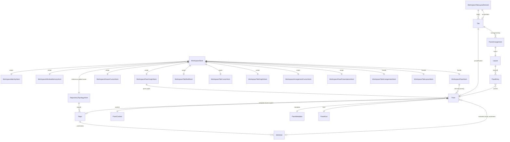
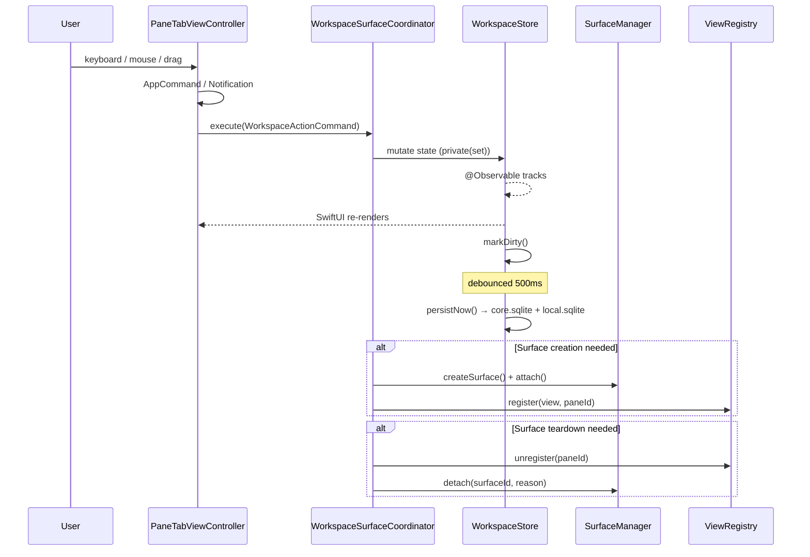
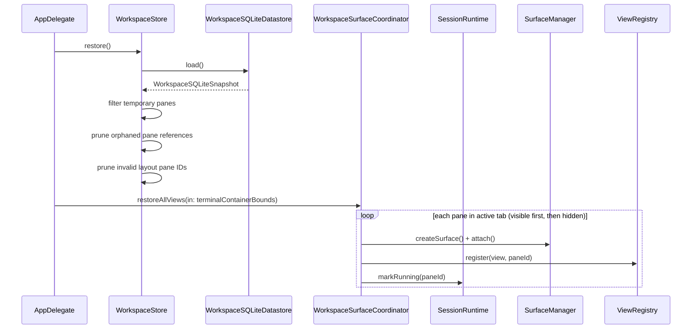

# Component Architecture

## TL;DR

State is distributed across independent `@Observable` atoms (Jotai-style atomic stores) with `private(set)` for unidirectional flow (Valtio-style). Keyed hot state uses atom-family-style slots through `AtomFamily` so one repo/worktree row can observe one key instead of a whole dictionary snapshot. `ActiveWorkspaceSelectionAtom`, `RepositoryTopologyAtom`, `RepoEnrichmentCacheAtom`, and `ApplicationEntityRecencyAtom` own application-global state. `WorkspaceStore` wraps the currently hydrated workspace graph while referencing the shared topology owner; that reference is not a workspace relation on `Repo`, `Worktree`, or `WatchedPath`. `WorkspaceTabLayoutDerived` is the rich tab read model. `SurfaceManager` owns Ghostty surfaces, `SessionRuntime` owns backends. A coordinator sequences cross-store operations. `Pane` is the primary workspace entity — referenced by UUID across every layer. Tabs own arrangements containing flat pane-strip layouts. `@Observable` drives SwiftUI re-renders; persistence is debounced. Ten invariants are enforced at all times.

---

## 1. Overview

### 1.0 Compiled Component Boundaries

The `AgentStudio` executable owns App composition, concrete services, resources,
and the concrete `AtomRegistry`. Beneath it, eight independent Feature modules
(Bridge, CodeViewer, CommandBar, EditorChooser, InboxNotification,
RepoExplorer, Terminal, and Webview) consume the one coarse
`AgentStudioCore`, stateless `AgentStudioSharedComponents`, and
`AgentStudioInfrastructure` modules. Features do not import siblings.

The coarse Core boundary is intentional for the current graph. App injects
Feature mutable state explicitly and adapts cross-Feature facts into read-only
consumer projections. `CoreAtomScope` is the only ambient product state scope;
there is no ambient Feature resolver or service locator. Cross-target product
contracts use `package` access rather than broad `public` exposure.

### 1.1 Architecture Principles

1. **Pane identity is primary** — `Pane` is the primary entity in the window system. `PaneId` (UUID v7) is the single identity used across every layer: `WorkspacePaneGraphAtom`, `WorkspacePaneAtom`, `Layout`, `ViewRegistry`, `SurfaceManager`, `SessionRuntime`, and zmx. A pane exists independently of layout position, tab, or surface and can move between tabs and layout positions while keeping identity.
2. **Atomic stores (Jotai-style)** — Each domain has its own `@Observable` atom. `RepositoryTopologyAtom` owns application-global repos/worktrees/watched paths, `RepoEnrichmentCacheAtom` owns their rebuildable enrichment, and `ApplicationEntityRecencyAtom` owns application-global recency. Workspace identity, pane/tab/drawer graphs and cursors, and pane recency remain explicitly workspace-owned. Window/sidebar presentation memory is window-keyed. `WorkspacePaneAtom`, `WorkspaceTabArrangementAtom`, and `WorkspaceTabLayoutAtom` remain compatibility mutation/read facades over split owners while callers migrate to derived readers. `SurfaceManager` owns Ghostty surfaces. `SessionRuntime` owns backends. No god-store — each atom has one domain, one reason to change, testable in isolation.
3. **Unidirectional flow (Valtio-style)** — All store state is `private(set)`. External code reads freely, mutates only through store methods. No action enums, no reducers — the compiler enforces the boundary.
4. **Coordinator for cross-store sequencing** — A coordinator sequences operations across multiple stores for a single user action. Owns no state, contains no domain logic. If a coordinator method contains an `if` that decides what to do with domain data, that logic belongs in a store.
5. **Explicit layout model** — `Layout` is a flat pane-strip value type with ordered `PaneEntry` items. Leaves reference panes by ID. No `NSView` references, no opaque blobs.
6. **Surface independence** — Ghostty surfaces are ephemeral runtime resources. The model layer never holds `NSView` references.
7. **Provider abstraction** — zmx is a headless restore backend. The model carries provider metadata without coupling to zmx specifics.
8. **AsyncStream over Combine/NotificationCenter** — All new event plumbing uses `AsyncStream` + `swift-async-algorithms`. Existing Combine/NotificationCenter migrated incrementally.
9. **Testability** — Core model and layout logic are pure value types. Injectable `Clock` for time-dependent logic. No real delays in tests.

Clock migration note (target pattern, not fully complete yet): remaining production `Task.sleep` call sites are in
`MainSplitViewController` and `AppDelegate`. Store-level time-dependent paths in `WorkspaceStore`, `SessionRuntime`,
and `SurfaceManager` have been migrated to injected clocks in this branch. The target is
constructor-injected clocks (`any Clock<Duration>`) for all store-level time-dependent behavior.

Configuration injection pattern: prefer constructor injection with defaults over mutable configuration vars. Example:
`init(clock: any Clock<Duration> = ContinuousClock(), ...)` and `private let` configuration fields.

### 1.2 High-Level System Diagram

```
┌──────────────────────────────────────────────────────────────────────┐
│                            AppDelegate                               │
│                                                                      │
│   Persisted State            Runtime                   UI Bridge     │
│  ┌──────────────┐    ┌───────────────┐    ┌──────────────────────┐   │
│  │WorkspaceStore│    │SessionRuntime │    │    ViewRegistry       │   │
│  │ (persistence │    │ statuses      │    │ paneId → PaneViewSlot│   │
│  │  wrapper)    │◄───│ backends      │    │ renderTree()         │   │
│  │ Identity/Win │    └───────┬───────┘    └──────────┬───────────┘   │
│  │ Topology Atom│            │                       │               │
│  │ Pane graph   │            │                       │               │
│  │ Tab owners   │            │                       │               │
│  └──────┬───────┘            │                       │               │
│         │            ┌───────┴───────────────────────┴────────┐      │
│         │            │      WorkspaceSurfaceCoordinator                   │      │
│         │            │   (sole bridge: model ↔ view ↔ surface) │      │
│         │            └───────────────────┬────────────────────┘      │
│         │                                │                           │
│  ┌──────┴──────┐                ┌────────┴────────┐                  │
│  │   Action    │                │ SurfaceManager  │                  │
│  │  Executor   │                │   (singleton)   │                  │
│  │ (dispatch)  │                │ active|hidden   │                  │
│  └─────────────┘                │ |undoStack      │                  │
│                                 └─────────────────┘                  │
│  ┌─────────────┐  ┌────────────┐                                    │
│  │TabBarAdapter│  │SQLite Data │                                    │
│  │(derived UI) │  │ core/local │                                    │
│  └─────────────┘  └────────────┘                                    │
└──────────────────────────────────────────────────────────────────────┘
```

---

## 2. Data Model

### 2.1 Entity Relationship Overview


```mermaid
erDiagram
    WorkspaceStore ||--|| WorkspaceIdentityAtom : "wraps"
    WorkspaceStore ||--|| WorkspaceWindowMemoryAtom : "wraps"
    WorkspaceStore }o--|| RepositoryTopologyAtom : "references global owner"
    WorkspaceStore ||--|| WorkspacePaneGraphAtom : "wraps"
    WorkspaceStore ||--|| WorkspaceDrawerCursorAtom : "wraps"
    WorkspaceStore ||--|| WorkspacePaneAtom : "facade"
    WorkspaceStore ||--|| WorkspaceTabShellAtom : "wraps"
    WorkspaceStore ||--|| WorkspaceTabCursorAtom : "wraps"
    WorkspaceStore ||--|| WorkspaceTabGraphAtom : "wraps"
    WorkspaceStore ||--|| WorkspaceArrangementCursorAtom : "wraps"
    WorkspaceStore ||--|| WorkspacePanePresentationAtom : "wraps"
    WorkspaceStore ||--|| WorkspaceTabArrangementAtom : "facade"
    WorkspaceStore ||--|| WorkspaceTabLayoutAtom : "facade"

    RepositoryTopologyAtom ||--o{ Repo : "repos[]"
    Repo ||--o{ Worktree : "worktrees[]"

    WorkspacePaneGraphAtom ||--o{ Pane : "pane graph"
    WorkspacePaneAtom ||--o{ Pane : "derived panes[]"
    WorkspaceTabLayoutDerived ||--o{ Tab : "tabs[]"
    WorkspaceTabLayoutDerived ||--o| Tab : "activeTabId"

    Tab ||--o{ PaneArrangement : "arrangements[]"
    Tab ||--o| Pane : "activePaneId"

    PaneArrangement ||--|| Layout : "layout"
    Layout ||--o{ PaneEntry : "panes[]"
    PaneEntry }o--|| Pane : "paneId"

    Pane ||--|| PaneContent : "content"
    Pane ||--|| PaneMetadata : "metadata"
    Pane ||--|| PaneKind : "kind"

    Pane }o--o| Worktree : "metadata.facets.worktreeId"
    Pane }o--o| Repo : "metadata.facets.repoId"
```

### 2.2 Repo & Worktree

Models are split across two stores. See [Workspace Data Architecture](workspace_data_architecture.md) for the full persistence tier contract and enrichment pipeline.

**`Repo`** — A git repository on disk. Structure-only — no enrichment data.

| Field | Type | Notes |
|-------|------|-------|
| `id` | `UUID` | Primary key |
| `name` | `String` | Directory name |
| `repoPath` | `URL` | Filesystem path |
| `worktrees` | `[Worktree]` | Git worktrees (each has explicit repoId FK) |
| `createdAt` | `Date` | When the repo was added |
| `stableKey` | `String` | SHA-256 of path, derived, deterministic across reinstalls |

**`Worktree`** — A git worktree within a repo. Structure-only.

| Field | Type | Notes |
|-------|------|-------|
| `id` | `UUID` | Primary key |
| `repoId` | `UUID` | FK to parent Repo |
| `name` | `String` | Display name |
| `path` | `URL` | Filesystem path |
| `isMainWorktree` | `Bool` | Whether this is the main checkout |
| `stableKey` | `String` | SHA-256 of path, derived |

All enrichment (branch, git status, origin, PR counts) lives in `RepoEnrichmentCacheAtom`, populated by the event bus and exposed through the composed `RepoCacheAtom` read surface. Hot consumers read `repoEnrichment(for:)`, `worktreeEnrichment(for:)`, `pullRequestCount(for:)`, or `worktreeFacts(for:)` when they genuinely need both branch state and PR count; dictionary snapshots are persistence/cold batch bridges. See the "Three Persistence Tiers" section in workspace_data_architecture.md.

> **Files:** `Core/Models/Repo.swift`, `Core/Models/Worktree.swift`

### 2.3 Pane

The **primary entity** in the window system. Stable identity for any content type, independent of layout position, tab, or surface. The `id` (UUID v7, time-ordered) is the single identity used across every layer: `WorkspacePaneAtom`, `Layout`, `ViewRegistry`, `SurfaceManager`, `SessionRuntime`, and zmx.

| Field | Type | Notes |
|-------|------|-------|
| `id` | `UUID` | Immutable primary key (UUID v7), never changes |
| `content` | `PaneContent` | Discriminated union: what this pane displays |
| `metadata` | `PaneMetadata` | Context tracking, grouping facets, identity |
| `residency` | `SessionResidency` | Lifecycle position |
| `kind` | `PaneKind` | Whether this is a layout pane or a drawer child |

**`PaneKind`** — Discriminant for container context:
- `.layout(drawer: Drawer)` — Top-level pane in a tab's layout tree. Always has a drawer container.
- `.drawerChild(parentPaneId: UUID)` — Child pane inside a drawer. Cannot have a sub-drawer.

**`PaneContent`** — Discriminated union for the content type held by a pane. Each pane holds exactly one content type, fixed at creation. Uses custom `Codable` with a `type` discriminator for forward-compatible deserialization:
- `.terminal(TerminalState)` — Terminal emulator (Ghostty or zmx-backed). `TerminalState` contains `provider: SessionProvider`, `lifetime: SessionLifetime`, and the frozen `zmxSessionId` anchor for persistent zmx panes.
- `.webview(WebviewState)` — Embedded web content. `WebviewState` contains `url`, `title`, `showNavigation`.
- `.bridgePanel(BridgePaneState)` — Bridge-backed React panel (e.g., diff viewer). `BridgePaneState` contains `panelKind: BridgePanelKind` and optional `source`.
- `.codeViewer(CodeViewerState)` — Source code viewer. `CodeViewerState` contains `filePath` and optional `scrollToLine`.
- `.unsupported(UnsupportedContent)` — Placeholder for unrecognized content types. Preserved on round-trip to avoid data loss.

**`PaneMetadata`** — Rich identity and context tracking. Fixed-at-creation fields plus live fields updated by the enrichment pipeline:

| Field | Mutability | Type | Notes |
|-------|-----------|------|-------|
| `paneId` | immutable | `PaneId` | Mirrors `Pane.id`, enforced equal on decode |
| `contentType` | immutable | `PaneContentType` | `.terminal`, `.browser`, `.diff`, `.codeViewer`, `.plugin(String)` |
| `launchDirectory` | immutable | `URL?` | Cold-spawn directory for terminal/session creation and legacy restore fallback |
| `executionBackend` | immutable | `ExecutionBackend` | `.local`, `.docker(image)`, `.gondolin(policyId)`, `.remote(host)` |
| `createdAt` | immutable | `Date` | Creation timestamp |
| `title` | live | `String` | Display title (updated from shell) |
| `facets` | live | `PaneContextFacets` | Dynamic grouping: `repoId`, `worktreeId`, `cwd`, `repoName`, `worktreeName`, `parentFolder`, `organizationName`, `origin`, `upstream`, `tags` |
| `checkoutRef` | live | `String?` | Current git checkout ref |
| `note` | live | `String?` | User/agent-authored main-pane label. Trimmed on write; blank values are stored as nil. |

`launchDirectory` is cold-spawn metadata, not pane/worktree ownership.
`facets` are the live pane location and grouping identity; they follow cwd via
`WorkspaceSurfaceCoordinator` updates from runtime and surface cwd events. Command-bar
classification, dynamic views, and `RuntimeRegistry.findPaneWithWorktree` read
live facets rather than any creation-time binding. Main-pane notes live alongside
metadata so minimized labels, persistence, and `$` pane search read the same
field. Drawer child panes keep their own metadata for runtime facts, but note
editing is exposed only for main layout panes.

**`SessionProvider`** — Backend type for terminal panes:
- `.ghostty` — Direct Ghostty surface, no session multiplexer
- `.zmx` — Headless zmx backend for persistence/restore across app restarts

**`SessionLifetime`** — Whether the terminal session survives app restart:
- `.persistent` — zmx-backed, saved to disk and restored on launch.
- `.temporary` — Ephemeral, never persisted. Filtered out during save/restore.

**`SessionResidency`** — Where the pane currently lives in the app lifecycle. Prevents false-positive orphan detection:
- `.active` — In a layout, view exists, fully visible
- `.pendingUndo(expiresAt: Date)` — Closed but in the undo window. Not an orphan.
- `.backgrounded` — Alive but not visible in the current view. Not an orphan.
- `.orphaned(reason: WorktreeUnavailableReason)` — Backing worktree path is unavailable.

**`Drawer`** — A container holding child panes attached to a parent layout pane. Mirrors tab container capabilities:

| Field | Type | Notes |
|-------|------|-------|
| `paneIds` | `[UUID]` | Owned child panes in insertion order |
| `layout` | `Layout` | Spatial arrangement (same `Layout` type as tabs) |
| `activePaneId` | `UUID?` | Currently focused pane. Nil when empty. |
| `isExpanded` | `Bool` | Whether the drawer panel is visible or collapsed |
| `minimizedPaneIds` | `Set<UUID>` | Transient — not persisted |

> **Files:** `Core/Models/Pane.swift`, `Core/Models/PaneContent.swift`, `Core/RuntimeEventSystem/Contracts/PaneMetadata.swift`, `Core/RuntimeEventSystem/Contracts/PaneId.swift`, `Core/Models/Drawer.swift`, `Core/Models/SessionLifetime.swift`, `Core/Models/SessionResidency.swift`

### 2.4 DynamicView

Dynamic views are projections of workspace state into virtual tab groups, used by the sidebar and view switcher. They do not own tabs — they project panes through a grouping facet.

**`DynamicViewType`** — The facet type for grouping:
- `.byRepo` — One tab per repository
- `.byWorktree` — One tab per worktree
- `.byCWD` — One tab per distinct CWD
- `.byParentFolder` — One tab per parent folder of repos

**`DynamicViewGroup`** — A single group in a projection (one virtual tab):
- `id: String` — Stable identity derived from the group key
- `name: String` — Display name
- `paneIds: [UUID]` — Pane IDs in this group
- `layout: Layout` — Auto-tiled layout for display

**`DynamicViewProjection`** — Result of projecting workspace state through a dynamic view:
- `viewType: DynamicViewType` — The grouping facet used
- `groups: [DynamicViewGroup]` — Generated groups sorted alphabetically

> **File:** `Core/Models/DynamicView.swift`

### 2.5 Tab

A tab in the workspace. Contains panes organized into arrangements. Order is implicit — determined by array position in `WorkspaceTabShellAtom.tabShells` and exposed through `WorkspaceTabLayoutDerived.tabs`.

| Field | Type | Persisted | Notes |
|-------|------|-----------|-------|
| `id` | `UUID` | yes | Primary key |
| `name` | `String` | yes | Display name |
| `allPaneIds` | `[UUID]` | yes | All pane IDs owned by this tab |
| `arrangements` | `[PaneArrangement]` | yes | Named arrangements. Always has at least one default. |
| `activeArrangementId` | `UUID` | yes | Currently active arrangement |
| `activePaneId` | `UUID?` | yes | Focused pane within this tab. Nil only during construction. |
| `zoomedPaneId` | `UUID?` | no | Display-only zoom state. Zoomed pane fills the tab. |
| `activeMinimizedPaneIds` | `Set<UUID>` | no | Derived from the active arrangement's `minimizedPaneIds`. |

**Derived state:**
- `defaultArrangement` — The arrangement with `isDefault == true` (exactly one per tab)
- `activeArrangement` — The arrangement matching `activeArrangementId`
- `activePaneIds` — Pane IDs in the active arrangement's layout (left-to-right)
- `isSplit` — Whether the active arrangement has more than one pane
- `layout` — The layout of the active arrangement (convenience accessor)

**`PaneArrangement`** — A named arrangement of panes within a tab. Each tab has exactly one default arrangement and zero or more custom arrangements:

| Field | Type | Notes |
|-------|------|-------|
| `id` | `UUID` | Primary key |
| `name` | `String` | Display name |
| `isDefault` | `Bool` | Exactly one per tab must be `true` |
| `layout` | `Layout` | Spatial layout of panes |
| `visiblePaneIds` | `Set<UUID>` | Subset of tab's panes visible in this arrangement |
| `minimizedPaneIds` | `Set<UUID>` | Visible panes collapsed to narrow bars in this arrangement. Persisted. |

> **Files:** `Core/Models/Tab.swift`, `Core/Models/PaneArrangement.swift`

### 2.6 Layout (Pure Value Type)

A flat pane strip shared by pane containers (tabs and drawers). Every pane is a direct sibling in left-to-right order with a preserved width ratio. All operations return **new** `Layout` instances — no in-place mutation.

```
Layout
├── panes: [PaneEntry]       # ordered left-to-right
│   └── PaneEntry
│       ├── paneId: UUID
│       └── ratio: Double    # normalized, sums to 1.0
└── dividerIds: [UUID]       # count == max(panes.count - 1, 0)
```

**Immutable Operations** (all return new Layout):

| Operation | Description |
|-----------|-------------|
| `inserting(paneId:at:direction:position:)` | Insert a pane adjacent to a target. Splits the target's ratio in half. |
| `removing(paneId:)` | Remove a pane; redistributes ratio to neighbor. Returns `nil` if layout becomes empty. |
| `resizing(splitId:ratio:)` | Update a divider's ratio (clamped 0.1–0.9) |
| `equalized()` | Set all pane ratios to equal values |
| `autoTiled(_:)` | Static factory: create a layout with equal-ratio panes |

**Navigation:**

| Method | Description |
|--------|-------------|
| `neighbor(of:direction:)` | Find the pane in the given direction (left/right; up/down return nil) |
| `next(after:)` | Next pane in left-to-right order (wraps) |
| `previous(before:)` | Previous pane in left-to-right order (wraps) |
| `resizeTarget(for:direction:)` | Find the divider and direction for resizing a pane |

> **File:** `Core/Models/Layout.swift`

### 2.7 Templates

Templates define the initial pane layout when opening a worktree. Not yet wired into the main flow (future).

**`TerminalTemplate`** — Blueprint for a single terminal pane:
- `title`, `provider`, `relativeWorkingDir`
- `instantiate(worktreeId:repoId:launchDirectory:)` → `Pane`

**`WorktreeTemplate`** — Blueprint for a multi-pane tab:
- `terminals: [TerminalTemplate]`, `createPolicy`, `splitDirection`
- `instantiate(worktreeId:repoId:launchDirectory:)` → `(panes: [Pane], tab: Tab)`

**`CreatePolicy`** — When templates auto-create panes:
- `.onCreate` — When the worktree is first opened
- `.onActivate` — When the worktree view is activated
- `.manual` — Only on explicit user action

> **File:** `Core/Models/Templates.swift`

---

## 3. Service Layer

### 3.1 Ownership Hierarchy

```
AppDelegate (creates all services in dependency order)
├── AtomRegistry                     ← internal App root: CoreAtoms + explicit Feature roots
│   └── CoreAtoms                    ← installed into the sole CoreAtomScope
├── WorkspaceStore                ← persistence wrapper over workspace-domain atoms
├── RepoCacheStore                ← persistence wrapper for global enrichment cache
├── EntityRecencyStore            ← application/workspace recency lifecycle wrapper
├── UIStateStore                  ← persistence wrapper for sidebar memory
├── WorkspaceSettingsStore        ← App-owned cross-Feature settings persistence
├── AppLifecycleAtom             ← app active/terminating state (in-memory)
├── WindowLifecycleAtom          ← key/focused window identity, terminal geometry (in-memory)
├── ApplicationLifecycleMonitor   ← AppKit lifecycle ingress into lifecycle stores
├── ManagementLayerMonitor         ← management layer state tracking
├── SessionRuntime                ← backend status tracking (zmx health)
├── ViewRegistry                  ← paneId → PaneViewSlot mapping
├── WorkspaceSurfaceCoordinator               ← action dispatch + model↔view↔surface orchestration
│   ├── +ActionExecution          ← execute(WorkspaceActionCommand), view creation, undo close/restore
│   ├── +ViewLifecycle            ← createViewForContent, teardownView, restoreAllViews
│   ├── +TerminalPlaceholders     ← deferred view creation, placeholder management
│   ├── +RuntimeDispatch          ← dispatchRuntimeCommand to RuntimeRegistry
│   ├── +FilesystemSource         ← filesystem root sync, worktree activity tracking
│   └── +Undo                     ← undoCloseTab, undo stack management
├── WorkspaceCacheCoordinator     ← event bus consumer, updates stores
├── WorkspaceActionExecutor                ← bridges AppCommandDispatcher to WorkspaceSurfaceCoordinator
├── TabBarAdapter                 ← derived display state
├── CommandBarPanelController     ← command bar lifecycle (⌘P)
│     init(store:, repoCache: RepoCacheAtom, dispatcher:)
├── OAuthService                  ← OAuth flow handling
└── MainWindowController
    └── MainSplitViewController
        └── PaneTabViewController
            ├── DraggableTabBarHostingView (SwiftUI)
            └── terminalContainer (dynamic split hierarchy)

Boot sequence (App/Boot/WorkspaceBootSequence.swift):
  loadCanonicalStore → loadCacheStore → loadUIStore → establishRuntimeBus
  → startFilesystemActor → startGitProjector → startForgeActor
  → startCacheCoordinator → triggerInitialTopologySync → readyForReactiveSidebar

Core/RuntimeEventSystem/ (shared pane-runtime domain):
├── PaneRuntime protocol     ← per-pane runtime contract
├── RuntimeRegistry          ← paneId → runtime lookup (owned by WorkspaceSurfaceCoordinator)
├── NotificationReducer      ← priority-aware event delivery
├── EventReplayBuffer        ← bounded replay for late-joining consumers
├── PaneRuntimeEvent         ← typed event vocabulary (GhosttyEvent, BrowserEvent, etc.)
└── PaneRuntimeCommand           ← typed command vocabulary (TerminalCommand, BrowserCommand, etc.)

Singletons:
├── SurfaceManager.shared    ← Ghostty surface lifecycle
├── GhosttyAdapter.shared    ← C FFI boundary, routes to per-pane TerminalRuntime
├── AppCommandDispatcher.shared ← command definitions + dispatch
└── Ghostty.shared           ← Ghostty C API wrapper
```

> **Testability note on singletons:** These `static let shared` singletons are `@MainActor` (inferred or explicit). Under Swift 6.2, `static var` on `@MainActor` types is also MainActor-isolated (enforced since Swift 5.10). This is fine for production — they don't cross actor boundaries. However, `static let` cannot be swapped for testing. When a boundary actor needs a service, inject it through the constructor rather than reaching through `.shared`. The EventBus design already follows this pattern: `private let bus: EventBus<RuntimeEnvelope>` is constructor-injected.

### 3.2 WorkspaceStore

Main-actor persistence aggregate for the workspace atoms. `WorkspaceStore` is **not** an `@Observable` store itself — it is a persistence wrapper that owns debounced persistence, restore, and flush. Live workspace reads go through atoms or `derived`, and workspace-domain mutations live on the owning atoms or `WorkspaceMutationCoordinator`. Do not add convenience query or mutation facades to `WorkspaceStore`.

**Owned atoms:**

| Atom | Domain |
|------|--------|
| `identityAtom: WorkspaceIdentityAtom` | Workspace id, name, and creation timestamp |
| `windowMemoryAtom: WorkspaceWindowMemoryAtom` | Window-keyed sidebar width and window frame |
| `repositoryTopologyAtom: RepositoryTopologyAtom` | Reference to application-global repos, worktrees, watched paths, availability, and stable-key indexes |
| `paneGraphAtom: WorkspacePaneGraphAtom` | Core pane graph: identity, content, residency, durable metadata, drawer membership |
| `drawerCursorAtom: WorkspaceDrawerCursorAtom` | Local drawer expansion cursor |
| `paneAtom: WorkspacePaneAtom` | Compatibility mutation facade over pane graph + drawer cursor |
| `tabShellAtom: WorkspaceTabShellAtom` | Tab identity and ordering |
| `tabCursorAtom: WorkspaceTabCursorAtom` | Active tab cursor |
| `tabGraphAtom: WorkspaceTabGraphAtom` | Tab membership and arrangement/layout graph |
| `arrangementCursorAtom: WorkspaceArrangementCursorAtom` | Active arrangement, active pane, and drawer child cursors |
| `panePresentationAtom: WorkspacePanePresentationAtom` | Runtime-only pane presentation such as zoom |
| `tabArrangementAtom: WorkspaceTabArrangementAtom` | Compatibility mutation facade over tab graph, arrangement cursor, and presentation |
| `tabLayoutAtom: WorkspaceTabLayoutAtom` | Compatibility read facade over tab shell and arrangement facades |
| `mutationCoordinator: WorkspaceMutationCoordinator` | Cross-atom workspace mutations (remove pane, background, reactivate, close snapshots) |

**Public role:**
- owns the split workspace atom graph plus `WorkspaceMutationCoordinator`
- applies strictly validated SQLite composition through the prepared composition applier
- observes atom changes, marks canonical state dirty, and debounces persistence
- flushes canonical state to disk on demand

**Not its role:**
- serving as a query facade for UI, command, or runtime code
- re-exporting atom state through convenience computed properties
- forwarding mutation methods that belong to the owning atom or coordinator

**Persistence:**
- `restoreAsync()` — Strictly load the active completed core/local SQLite snapshot, or bootstrap one UUIDv7 empty workspace only for a newly created empty database
- invalid, incomplete, unavailable, or corrupt existing composition fails before canonical mutation or terminal activation; no workspace JSON fallback/import/archive or startup repair exists
- `flushAsync()` — Cancel pending debounce and persist immediately through SQLite
- `observePersistedState()` — Uses `withObservationTracking` on persisted fields across all atoms; triggers debounced save on change
- `prePersistHook` — Called before each persist (used by `WorkspaceSurfaceCoordinator` to sync webview states)

> **File:** `Core/State/MainActor/Persistence/WorkspaceStore.swift`

### 3.3 SessionRuntime

Manages live session state. Does **not** own sessions — reads the session list from `WorkspaceStore`. Tracks runtime status per session, schedules health checks, coordinates backends. `@Observable`, `@MainActor`.

**Runtime status:** `SessionRuntimeStatus` — `.initializing`, `.running`, `.exited`, `.unhealthy`

**Backend protocol:** `SessionBackendProtocol` — `start()`, `isAlive()`, `terminate()`, `restore()`

**Key operations:**
- `registerBackend()` — Register a backend (e.g., `ZmxBackend`) for a provider type
- `syncWithStore()` — Align tracked sessions with store's session list
- `startHealthChecks()` / `runHealthCheck()` — Periodic backend liveness checks
- `startSession()` / `restoreSession()` / `terminateSession()` — Backend lifecycle

> **Note:** A full `SessionStatus` state machine (7 states: unknown, verifying, alive, dead, missing, recovering, failed) exists in `Core/Models/SessionStatus.swift` for future zmx health integration but is not yet wired into `SessionRuntime`. See [Session Lifecycle](session_lifecycle.md) for details.
>
> `ZmxBackend` conforms to a separate `SessionBackend` protocol (defined in `ZmxBackend.swift`) with its own method signatures. A future phase will wire `SessionRuntime` → `ZmxBackend` and consolidate the two protocols.
>
> **Isolation audit:** `ZmxBackend.isAlive()` shells out to the `zmx` CLI — this is 10-100ms of blocking I/O. Since `SessionRuntime` is `@MainActor`, `isAlive()` must not run synchronously on the main thread. The current implementation dispatches via `ProcessExecutor` (which uses `DispatchQueue.global()`). When the backend protocol is consolidated, `isAlive()` should be `@concurrent nonisolated` (Swift 6.2) to explicitly run on the cooperative pool. Plain `nonisolated async` would inherit MainActor isolation if called from `SessionRuntime` — see [EventBus Design — Swift 6.2 Gotchas](pane_runtime_eventbus_design.md#swift-62-gotchas-quick-reference).

> **File:** `Core/RuntimeEventSystem/Runtime/SessionRuntime.swift`

### 3.4 ViewRegistry

Maps pane IDs to live `PaneHostView` instances via per-pane `@Observable` `PaneViewSlot` objects. Runtime-only (not persisted). `@MainActor`.

**Slot model** — Each pane gets its own `PaneViewSlot`. SwiftUI views read `slot(for: paneId).host` to get automatic, scoped invalidation when a view is registered. Slots have pane-lifetime identity (not host-lifetime), surviving unregister/re-register cycles (repair, undo).

- `ensureSlot(for: paneId)` — Create the slot proactively when a pane enters workspace structure (idempotent)
- `slot(for: paneId)` — Get the observable slot for SwiftUI observation (lazy fallback with assertion if `ensureSlot` was not called)
- `register(_, for: paneId)` — Set `slot.host`, auto-invalidates SwiftUI observers of that slot
- `unregister(_ paneId)` — Clear `slot.host = nil`, slot object survives
- `removeSlot(for: paneId)` — Delete the slot when pane is permanently removed
- `view(for: paneId)` — Imperative host lookup (no observation overhead)
- Typed mount accessors: `terminalView(for:)`, `terminalStatusPlaceholderView(for:)`, `webviewView(for:)`, `allWebviewViews`, `allTerminalViews`
- `registeredPaneIds` — All pane IDs with non-nil hosts

> **File:** `App/Panes/ViewRegistry.swift`

### 3.5 Dynamic View Resolution

Dynamic and worktree view selection is implemented in the pane composition flow.
There is no standalone `ViewResolver` type in code; this behavior is owned by the
`App/Panes` layer.

- `PaneTabViewController` observes app state and renders the active view arrangement.
- `ViewRegistry` provides pane-to-view mapping used by split rendering.
- `FlatTabStripContainer` handles split-drop routing in management layer using:
  - `SplitContainerDropCaptureOverlay` (single drop input surface)
  - `PaneDragCoordinator` (pure drag target resolution)
  - `PaneDropTargetOverlay` (single target visualization layer)
  - `PaneLeafContainer` (App-owned concrete Feature UI composition)

> **Files:** `App/Panes/ViewRegistry.swift`, `App/Panes/Hosting/PaneLeafContainer.swift`, `Core/Views/Panes/SplitContainerDropCaptureOverlay.swift`

### 3.6 WorkspaceSurfaceCoordinator

The `WorkspaceSurfaceCoordinator` is the canonical orchestration boundary for action execution and model↔view↔surface coordination. It owns no domain state and performs only sequencing.

- Coordinates `WorkspaceStore`, `SessionRuntime`, `SurfaceManager`, and `ViewRegistry`.
- Owns the `RuntimeRegistry`, subscribes to the `EventBus`, feeds the `NotificationReducer`, and dispatches `PaneRuntimeCommand`s to individual runtimes.
- Applies action intent through command validation and mutation APIs.
- Manages undo sequencing with deterministic restore/reattach behavior.
- Conforms to `TopologyEffectHandler` for orphan pane detection and filesystem root sync after topology changes.

**Extensions** — The coordinator is split across six extensions by responsibility:

| Extension | File | Role |
|-----------|------|------|
| `+ActionExecution` | `WorkspaceSurfaceCoordinator+ActionExecution.swift` | `execute(WorkspaceActionCommand)`, view creation helpers, undo close/restore, terminal tab creation |
| `+ViewLifecycle` | `WorkspaceSurfaceCoordinator+ViewLifecycle.swift` | `createViewForContent`, `createView(for:worktree:repo:)`, `teardownView`, `restoreAllViews`, `restoreViewsForActiveTabIfNeeded` |
| `+TerminalPlaceholders` | `WorkspaceSurfaceCoordinator+TerminalPlaceholders.swift` | Deferred view creation using current geometry, placeholder registration for zmx panes awaiting bounds |
| `+RuntimeDispatch` | `WorkspaceSurfaceCoordinator+RuntimeDispatch.swift` | `dispatchRuntimeCommand` to `RuntimeRegistry` with target resolution |
| `+FilesystemSource` | `WorkspaceSurfaceCoordinator+FilesystemSource.swift` | Filesystem root sync, worktree activity tracking, `FilesystemGitPipeline` registration |
| `+Undo` | `WorkspaceSurfaceCoordinator+Undo.swift` | `undoCloseTab()`, undo stack management, pane/tab close snapshot restore |

**Two action layers flow through the coordinator:**
- **Workspace actions** (`WorkspaceActionCommand` from `Core/Actions/`): workspace structure mutations (selectTab, closePane, insertPane, etc.) → resolved by `WorkspaceCommandResolver`, validated by `WorkspaceCommandValidator`, executed against `WorkspaceStore`.
- **Runtime commands** (`PaneRuntimeCommand` from `Core/RuntimeEventSystem/Contracts/`): commands to individual runtimes (sendInput, navigate, requestAgentReview, etc.) → dispatched via `RuntimeRegistry.runtime(for:).handleCommand(envelope)`.

**Key operations:**
- `execute(_ action: WorkspaceActionCommand)` — dispatch workspace actions (selectTab, closeTab, closePane, insertPane, extractPaneToTab, resizePane, equalizePanes, mergeTab, breakUpTab, focusPane, arrangements, drawers, repair)
- `openTerminal(for:in:)` — Focus existing worktree tab or create pane + surface + tab
- `openNewTerminal(for:in:)` — Always create a fresh pane + tab (never navigate to existing)
- `openWorktreeInPane(for:in:)` — Open worktree as a split pane in the active tab
- `openWebview(url:)` — Open a webview pane and append it as a new tab
- `openContextualWebviewInPane/InDrawer` — Open contextual browser panes with inherited worktree context
- `openFloatingTerminal(launchDirectory:title:)` — Open a standalone terminal without repo/worktree context
- `undoCloseTab()` — Pop `CloseEntry` from undo stack, restore to store, reattach surfaces in reverse order
- `createViewForContent(pane:)` — Dispatch to terminal, webview, code viewer, or bridge panel view factory; mount inside `PaneHostView`; register host in `ViewRegistry`
- `teardownView(for: paneId)` — Unregister → detach surface (with undo support)
- `restoreView(for:worktree:repo:)` — Pop surface from `SurfaceManager.undoClose()` LIFO stack → reattach
- `restoreAllViews()` — App launch: staged restore (visible panes first, then hidden cooperatively)
- `syncFilesystemRootsAndActivity()` — Keep `FilesystemGitPipeline` registrations in sync with workspace topology

**Undo stack:**
- `undoStack: [WorkspaceMutationCoordinator.CloseEntry]` — in-memory LIFO, max 10 entries
- `.tab(TabCloseSnapshot)` captures: `tab`, `panes`, `tabIndex`
- `.pane(PaneCloseSnapshot)` captures: `pane`, `drawerChildPanes`, `tabId`, `anchorPaneId`
- Oldest entries GC'd when stack exceeds limit; orphaned panes cleaned up

**Reentrant-safety invariant:** The coordinator has both synchronous mutation methods (e.g., `execute(_ action: WorkspaceActionCommand)`) and an async `for await` event loop consuming from the EventBus. Since both are `@MainActor`, synchronous methods can interleave between event loop iterations — the `for await` yields at each iteration, and synchronous calls execute during the yield. This is correct and expected (same model as Python asyncio). The multiplexing rule guarantees safety: `@Observable` mutation happens synchronously on MainActor **before** `bus.post()`, so by the time the coordinator's event loop picks up an envelope, all store state is already consistent. The coordinator never sees an envelope whose corresponding `@Observable` state hasn't been applied yet. Frame-level interleaving between synchronous UI mutations and async event processing is expected and safe — UI sees updates immediately (synchronous `@Observable`), coordination consumers see complete envelopes within one frame (~16ms). This is not a race; it's the intended scheduling model.

> **Files:** `App/Coordination/WorkspaceSurfaceCoordinator.swift`, `App/Coordination/WorkspaceSurfaceCoordinator+ActionExecution.swift`, `App/Coordination/WorkspaceSurfaceCoordinator+ViewLifecycle.swift`, `App/Coordination/WorkspaceSurfaceCoordinator+TerminalPlaceholders.swift`, `App/Coordination/WorkspaceSurfaceCoordinator+RuntimeDispatch.swift`, `App/Coordination/WorkspaceSurfaceCoordinator+FilesystemSource.swift`, `App/Coordination/WorkspaceSurfaceCoordinator+Undo.swift`

### 3.7 TabBarAdapter

Derived state bridge between `WorkspaceStore` and the tab bar SwiftUI view. Bridges `@Observable` store state via `withObservationTracking` and transforms it into tab bar display items.

> **File:** `App/Panes/TabBar/TabBarAdapter.swift`

### 3.9 Persistence Domain Segregation

> **Authoritative architecture:** [Workspace Data Architecture](workspace_data_architecture.md) defines the complete three-tier model including canonical models (`CanonicalRepo`, `CanonicalWorktree`), enrichment models (`RepoEnrichment`, `WorktreeEnrichment`), and the event-driven enrichment pipeline. This section summarizes the persistence split; the workspace data doc is the source of truth for model shapes and lifecycle flows.

The SQLite foundation is `SQLiteDatabaseFactory`, `WorkspaceCoreMigrations`,
`WorkspaceLocalMigrations`, and repository-facing storage tokens such as
`SQLitePaneContentTypeStorage`, `SQLiteLocalUXStorage`, and
`SQLiteInboxNotificationClaimStorage`. The live app path explicitly prepares
authoritative `core.sqlite` and one non-authoritative app-root `local.sqlite`
before hydration, then retains one writable owner for each accepted database.
Workspace composition JSON and per-workspace local sidecars are not import or
fallback sources. Core preparation failure stops boot. Physical local
unavailability defaults every local lane; when local remains available, an
invalid query or decode defaults only its logical slice.

To keep Jotai-style store boundaries and Valtio-style source-of-truth guarantees intact, persistence is split by domain responsibility:

- Canonical workspace model (`WorkspaceStore`) writes through `WorkspaceSQLiteDatastore` into `core.sqlite`; no workspace JSON import/fallback path exists.
- Local workspace continuation, pane recency, inbox rows, and feature preferences are keyed by `workspace_id` in the application `local.sqlite`. Window/sidebar presentation is keyed by durable `window_id` (the single window has the stable `main` role). Runtime focus remains on `SidebarFocusRuntimeAtom` and is composed for UI reads by `WorkspaceSidebarState`.
- Derived enrichment data (`RepoEnrichmentCacheAtom`) is global in that same local database: repo/worktree/PR cache rows have no workspace owner. Enrichment contains `RepoEnrichment`, `WorktreeEnrichment`, PR counts, and rebuild metadata as separate keyed lanes. Notification unread counts are inbox-owned and derived from `InboxNotificationAtom`. Enrichment is written exclusively by `WorkspaceCacheCoordinator` via enrichment pipeline events; `RepoCacheAtom` is the composed read surface for existing repo/sidebar consumers.
- Product enum and cross-field semantics are decoded and validated by typed Swift codecs, while SQLite enforces storage integrity such as keys, relationships, uniqueness, boolean representation, scalar ranges, and singleton rows.

This prevents derived data from silently becoming canonical truth and gives each
persistence domain an explicit owner.

#### Current File Layout

```text
~/.agentstudio/
  core.sqlite
  local.sqlite
  preferences.global.json
```

#### Store Ownership

- `WorkspaceStore` → authoritative workspace composition in `core.sqlite` plus
  cursor/window snapshot projections in `local.sqlite`
- `RepositoryTopologyAtom` → application-global repos, worktrees, watched paths,
  availability, and stable-key indexes; persisted as global topology in `core.sqlite`
- `RepoEnrichmentCacheAtom` → global derived git/wt/gh metadata, counts, and rebuild metadata in `local.sqlite`
- `ApplicationEntityRecencyAtom` → global repository/worktree recency in
  `local_entity_recency`
- `WorkspaceEntityRecencyAtom` → workspace-keyed pane recency in
  `local_workspace_entity_recency`
- `EntityRecencyStore` → independent application and workspace hydration/flush
  lifecycles for those two atoms
- `WorkspaceSidebarMemoryAtom` → window/sidebar and workspace-local shell rows in `local.sqlite`
- `SidebarFocusRuntimeAtom` → runtime-only sidebar focus (`sidebarHasFocus`), never persisted
- Global preferences → `preferences.global.json`

#### Local Ownership Contract

`core.sqlite` owns authoritative workspace composition and global topology.
`local.sqlite` owns only non-authoritative state: workspace continuation,
workspace-scoped feature rows and pane recency, application entity recency,
window/sidebar presentation, and global repository/worktree/PR caches. The database path is application-global;
each row is scoped by its actual owner rather than by a per-workspace file.
`preferences.global.json` remains the standalone global-preference file.

#### Load / Refresh Sequencing

1. Prepare both databases. Core acceptance is strict; local may be available,
   replaced, or unavailable for the launch.
2. Consume the prepared authoritative core snapshot into `WorkspaceStore`.
3. Independently load typed local slices from the retained app-root
   `local.sqlite`; default all slices when physical local is unavailable, or
   only the failing logical slice when it remains available.
4. Load global preferences from `preferences.global.json`.
5. Trigger the async repository and forge enrichment pipeline and patch
   `RepoEnrichmentCacheAtom` through `RepoCacheAtom`.

Coordinator owns sequencing, not domain decisions:

- `WorkspaceBootSequence` (`App/Boot/WorkspaceBootSequence.swift`) — Defines the ordered boot steps. `AppDelegate.executeBootStep()` performs each step.

#### Write Semantics

- `core.sqlite` — authoritative transactional writes on canonical model mutation
- `local.sqlite` — independent local-lane transactions for derived refresh and local UI state
- `preferences.global.json` — immediate atomic writes on global preference change

#### Rules and Invariants

1. Canonical state never depends on local correctness.
2. Local cache and UX lanes can reset without canonical data loss; local recovery
   may quarantine corrupt database sidecars.
3. Local writes neither roll back nor invalidate committed core state.
4. Cross-store flows are coordinator-only sequencing.
5. Local recovery is exactly quarantine present DB/WAL/SHM, then create and
   migrate a fresh database. A failed recovery remains unavailable for the
   launch; there is no same-process reopen.

### 3.10 SurfaceManager

Singleton managing Ghostty surface lifecycle. Detailed in [Surface Architecture](ghostty_surface_architecture.md).

Key points relevant here:
- Surfaces are keyed by their own UUID, joined to panes via `SurfaceMetadata.paneId`
- Three collections: `activeSurfaces`, `hiddenSurfaces`, `undoStack`
- `attach()` / `detach(reason:)` / `undoClose()` / `destroy()`

> **File:** `Features/Terminal/Ghostty/SurfaceManager.swift`

### 3.11 Command Bar System

Keyboard-driven search/command palette (⌘P) providing unified access to tabs, panes, commands, repos, and worktrees. Modeled after Linear's ⌘K.

**`CommandBarPanelController`** — Owns the panel lifecycle and state. Created by `AppDelegate` with `init(store: WorkspaceStore, repoCache: RepoCacheAtom, dispatcher: AppCommandDispatcher)`. Manages show/dismiss/toggle behavior, backdrop overlay, and animations.

**`CommandBarState`** — `@Observable` state for the command bar. Manages:
- `rawInput` with prefix parsing: `"> "` → commands scope, `"$ "` → panes scope, `"# "` → repos scope
- Navigation stack for nested drill-in levels
- Selection index with wrap-around navigation
- Recent item IDs persisted to `UserDefaults`
- Scope-dependent placeholder text and scope icon

**`CommandBarScope`** — Four scopes derived from prefix:

| Scope | Prefix | Content |
|-------|--------|---------|
| `.everything` | (none) | Tabs, panes, commands, worktrees (all groups) |
| `.commands` | `> ` | Commands grouped by category (Pane, Focus, Tab, Repo, Window, Webview, Auth) |
| `.panes` | `$ ` | Panes grouped by parent tab, tabs as selectable items |
| `.repos` | `# ` | Repos and worktrees for opening, with presence awareness |

**`CommandBarDataSource`** — Builds `CommandBarItem` arrays from live app state, scope-filtered. Constructor params: `scope`, `store: WorkspaceStore`, `repoCache: RepoCacheAtom`, `dispatcher: AppCommandDispatcher`. It requests `.commandBar` presentation against the current `CommandContext`, and uses `AppCommandTargeting.preferredInvocation` plus declared target kinds to build direct-dispatch rows or `CommandBarLevel` drill-ins. `shouldPresent` controls presence; enablement continues to flow through the matching `AppCommandDispatcher.canDispatch` overload.

**`WorktreePresence`** — Value type capturing a worktree's open state in the workspace: `worktreeId`, `repoId`, `openPanes: [WorktreePaneLocation]`, computed `openState: WorktreeOpenState` (`.notOpen`, `.singlePane`, `.multiplePanes`). Used by the `.repos` scope and `.everything` worktree rows to show presence indicators and resolve context-aware actions.

**`CommandBarWorktreeActionResolver`** — Pure function resolving worktree selection actions based on `WorktreePresence`, `EnterModifier` (plain/command/option), and whether tabs are open. Returns `.dispatch(command:target:targetType:)`, `.showOpenChoice`, or `.showPaneChoice`, which the view then uses to either execute immediately or drill into a choice level.

**`CommandBarAction`** — What happens when an item is selected:
- `.dispatch(AppCommand)` — Execute a contextual command
- `.dispatchTargeted(AppCommand, target: UUID, targetType: SearchItemType)` — Execute on a specific element
- `.navigate(CommandBarLevel)` — Drill into a sub-level
- `.custom(() -> Void)` — Arbitrary action
- `.worktreeAction(presence: WorktreePresence)` — Resolve at selection time based on presence and modifier keys

**`FuzzySearch`** (`Infrastructure/Search/CommandBarSearch.swift`) — Shared fuzzy matching. Returns scores (0.0 = best) and character match ranges for highlighting. Weighted scoring: title (1.0), subtitle (0.8), keywords (0.6). Recency boost for recently used items.

**`CommandBarPanel`** — `NSPanel` subclass with `NSVisualEffectView` (`.sidebar` material) and `NSHostingView` for SwiftUI content. Child window of the main window.

**Key design decisions:**
- NSPanel over SwiftUI overlay — guarantees z-ordering above Ghostty `NSView` surfaces
- Custom fuzzy matcher over third-party — FuzzyMatchingSwift lacks character match ranges needed for highlighting
- Actions route through `AppCommandDispatcher` → full validation pipeline — the command bar never mutates `WorkspaceStore` directly
- Worktree presence awareness: items show open pane count, tab location, and adapt their enter behavior (go-to vs. drill-in) based on whether the worktree already has panes open

> **Files:** `Features/CommandBar/CommandBarPanelController.swift`, `Features/CommandBar/CommandBarState.swift`, `Features/CommandBar/CommandBarDataSource.swift`, `Features/CommandBar/CommandBarDataSource+WorktreeRows.swift`, `Infrastructure/Search/CommandBarSearch.swift`, `Features/CommandBar/CommandBarPanel.swift`, `Features/CommandBar/CommandBarItem.swift`, `Features/CommandBar/WorktreePresence.swift`, `Features/CommandBar/CommandBarWorktreeActionResolver.swift`, `Features/CommandBar/Views/*.swift`

### 3.8 Command Metadata & UI Action Presentation

Agent Studio has two typed presentation layers for user-triggerable UI:

- **`AppCommand` + `AppCommandSpec`** for dispatchable app commands
- **`LocalActionSpec` / `ActionSpec`** for local UI actions that do not route through `AppCommandDispatcher`

`AppCommand` is the authoritative command ID shared by two exhaustive
projections. `AppCommand.definition` owns interactive presentation metadata;
the App-owned `AppCommand.ipcSpec` companion owns IPC exposure, durable-target,
privilege, and argument contracts. Adding a command case forces both
projections to classify it at compile time.

```text
WorkspaceFocusOwnerAtom (only mutable requested-focus owner)
  → WorkspaceFocusedPaneResolver
  → WorkspaceFocusedPane
      ├─ focus/status presentation
      └─ CommandContextDerived + workspace/presentation facts
          → CommandContext + satisfied CommandRequirement values

AppCommand
  ├─ AppCommand.definition
  │   └─ AppCommandSpec
  │       ├─ display and tooltip projection
  │       ├─ AppCommandSurfacePolicy
  │       ├─ AppCommandTargeting + preferred invocation
  │       └─ visibleWhen requirements
  └─ AppCommand.ipcSpec
      ├─ AppCommandIPCExposure
      ├─ targetless | required(primary, additional)
      ├─ privilege classification
      └─ noArguments | typed argument/filter execution payload

AppCommandPresentationQuery
  → AppCommandSpec.shouldPresent(...)       presence only
  → AppCommandDispatcher.canDispatch(...)  enabled/executable
  → execution owner + validators           authoritative effects
```

`WorkspaceFocusedPaneResolver` is a stateless read operation. It validates the
requested main-pane, empty-drawer, or drawer-child owner against the active tab
and live drawer state, returning immutable focus identity/content.
`CommandContextDerived` consumes that value and projects an independent,
immutable `CommandContext`. Neither projection mutates focus or workspace
state.

Every `AppCommandSpec` explicitly declares an `AppCommandSurfacePolicy`.
Interactive consumers identify themselves as command bar, main menu, context
menu, inline control, or an exact toolbar surface (`app`, `pane`, or
`terminalZoom`). The host still owns placement, ordering, spacing, selected
state, and control construction.

`AppCommandSpec.shouldPresent` accepts a typed contextual, targeted, or
contextual-target subject. It checks only surface exposure, satisfied
`CommandRequirement` values, and declared `SearchItemType` support. It controls
presence, never enablement, authorization, or mutation validity. Visible
controls use contextual or targeted `canDispatch`; dispatch repeats the same
mode preflight before an execution owner runs. Workspace and runtime validators
remain authoritative immediately before effects.

`AppCommandTargeting` makes contextual-only, targeted-only, and combined
commands explicit. Combined commands also declare whether their preferred root
invocation dispatches contextually or opens target selection. Dispatch rejects
an undeclared invocation mode or target kind before calling
`ShellCommandHandling` or `WorkspaceCommandHandling`.

`ShellCommandHandling` is deliberately narrow. It may open app windows,
toggle the sidebar shell, open command-bar modes, and start app-level
auth or file-picker flows. It must not own pane-local presentation.
Commands that depend on active pane identity, drawer focus, drawer
children, or workspace validation terminate in `WorkspaceCommandHandling`
on `PaneTabViewController`. This keeps keyboard shortcuts, command-bar
rows, and drawer buttons on the same resolver path.

Keyboard routing stays separate: `ActiveKeyboardSurface` and
`AppShortcutDispatchPolicy` own shortcut precedence and transient-surface
suppression. IPC likewise does not request an interactive surface.
`AppCommand+IPCProjection.swift` owns exhaustive discriminated IPC contracts,
and the adapter owns durable-target authorization and execution validation.
Existing public target-kind, privilege, argument-schema arrays and JSON encoding
appear only when those internal contracts project to `IPCCommandListEntry`.

For UI actions that are *not* `AppCommand`s — for example drawer hover
tooltips, sidebar editor menus, settings buttons, and command-bar mode entries
— the app uses `ActionSpec` and `LocalActionSpec` in
`Core/Actions/UIActionPresentation.swift`. This keeps labels, help text, and
icons centralized even when an action is not dispatcher-backed.

**Why two metadata layers?**
- `AppCommandSpec` owns anything that must dispatch through the validated command pipeline.
- `LocalActionSpec` owns UI-only actions that do not have an `AppCommand` identity.

This keeps `AppCommand` as the single command ID while still removing duplicated labels/tooltips across the UI.

### 3.9 Command Bar Integration

The command bar is a presentation layer over the shared command, context, and
focus models. It does not define command metadata, own visibility rules, or
bypass the command pipeline.

```text
WorkspaceFocusedPane → status strip presentation
CommandContext + AppCommandSpec
  → shouldPresent(.commandBar, contextual/targeted subject)
  → AppCommandTargeting.preferredInvocation
      ├─ contextual dispatch row
      └─ declared target-kind drill-in
  → matching AppCommandDispatcher.canDispatch overload
  → contextual/targeted dispatch mode preflight
  → WorkspaceCommandResolver
  → WorkspaceCommandValidator
  → WorkspaceSurfaceCoordinator
```

This architecture gives us one command ID (`AppCommand`), independent
interactive (`AppCommandSpec`) and IPC (`AppCommandIPCSpec`) projections, one
mutable workspace-focus owner (`WorkspaceFocusOwnerAtom`), separate immutable
focus and command-policy projections, and one shared UI metadata shape
(`ActionSpec`).

---

## 4. Data Flow

### 4.1 Mutation Pipeline

Every state change follows this path:


```mermaid
sequenceDiagram
    participant User
    participant PaneTabViewController
    participant PC as WorkspaceSurfaceCoordinator
    participant Store as WorkspaceStore
    participant SM as SurfaceManager
    participant VR as ViewRegistry

    User->>PaneTabViewController: keyboard / mouse / drag
    PaneTabViewController->>PaneTabViewController: AppCommand / Notification
    PaneTabViewController->>PC: execute(WorkspaceActionCommand)
    PC->>Store: mutate state (private(set))
    Store-->>Store: @Observable tracks
    Store-->>PaneTabViewController: SwiftUI re-renders
    Store->>Store: markDirty()
    Note over Store: debounced 500ms
    Store->>Store: persistNow() → core.sqlite + local.sqlite

    alt Surface creation needed
        PC->>SM: createSurface() + attach()
        PC->>VR: register(view, paneId)
    end

    alt Surface teardown needed
        PC->>VR: unregister(paneId)
        PC->>SM: detach(surfaceId, reason)
    end
```

### 4.2 Restore Flow


```mermaid
sequenceDiagram
    participant AD as AppDelegate
    participant Store as WorkspaceStore
    participant DB as WorkspaceSQLiteDatastore
    participant Coord as WorkspaceSurfaceCoordinator
    participant RT as SessionRuntime
    participant SM as SurfaceManager
    participant VR as ViewRegistry

    AD->>Store: restore()
    Store->>DB: load()
    DB-->>Store: WorkspaceSQLiteSnapshot
    Store->>Store: filter temporary panes
    Store->>Store: prune orphaned pane references
    Store->>Store: prune invalid layout pane IDs

    AD->>Coord: restoreAllViews(in: terminalContainerBounds)
    loop each pane in active tab (visible first, then hidden)
        Coord->>SM: createSurface() + attach()
        Coord->>VR: register(view, paneId)
        Coord->>RT: markRunning(paneId)
    end
```

> **Deferred restore gate:** When `terminalContainerBounds` is unavailable at launch (window geometry not yet settled), zmx-backed panes receive `.preparing` placeholders instead of live surfaces. Once geometry settles, `restoreViewsForActiveTabIfNeeded()` retries view creation for any panes still showing placeholders. `TerminalRestoreScheduler` orders panes by `VisibilityTier` (p0 visible first, p1 hidden second) so the active tab paints before background tabs are hydrated.

### 4.3 Undo Close Flow

1. **Close**: `WorkspaceSurfaceCoordinator.executeCloseTab(tabId)`
   - `store.snapshotForClose()` → `TabCloseSnapshot` (tab + panes + tabIndex)
   - Push snapshot to `undoStack` (max 10)
   - `coordinator.teardownView()` for each pane → `SurfaceManager.detach(.close)` (surfaces enter undo stack with TTL)
   - `store.removeTab(tabId)` — panes stay in `store.panes`
   - GC oldest undo entries if stack > 10

2. **Undo** (`Cmd+Shift+T`): `WorkspaceSurfaceCoordinator.undoCloseTab()`
   - Pop `WorkspaceMutationCoordinator.CloseEntry` from undo stack
   - `store.restoreFromSnapshot()` → re-insert tab at original position
   - `coordinator.restoreView()` for each pane (reversed order, matching SurfaceManager LIFO)
   - `SurfaceManager.undoClose()` pops surface → reattach (no recreation)

### 4.4 Command Bar Execution Flow

When a user selects an item from the command bar:

```
CommandBarView.executeItem(item)
│
├─ If dimmed (canDispatch == false) → blocked, no action
│
├─ .dispatch(command)
│   └─ onDismiss() → AppCommandDispatcher.dispatch(command)
│       → reject unless AppCommandTargeting supports contextual invocation
│       → WorkspaceCommandHandling.execute(command)
│         → WorkspaceCommandResolver → WorkspaceCommandValidator → WorkspaceSurfaceCoordinator → WorkspaceStore
│
├─ .dispatchTargeted(command, target: UUID, targetType)
│   └─ onDismiss() → AppCommandDispatcher.dispatch(command, target, targetType)
│       → reject unless AppCommandTargeting declares targetType
│       → WorkspaceCommandHandling.execute(command, target, targetType)
│         → WorkspaceCommandResolver (with explicit target) → WorkspaceCommandValidator → WorkspaceSurfaceCoordinator
│
├─ .navigate(level)
│   └─ state.pushLevel(level) — drill into nested target picker
│
└─ .custom(closure)
    └─ onDismiss() → closure() — for a UI-local action without an `AppCommand` identity
```

The command bar records the selected item ID in `recentItemIds` (persisted to `UserDefaults`) before executing. Dimmed items (commands where `dispatcher.canDispatch()` returns false) are blocked from execution on both click and Enter key.

---

## 5. Persistence

### 5.1 Write Strategy

All mutations call `markDirty()`, which:
1. Sets `isDirty = true`
2. Calls `ProcessInfo.disableSuddenTermination()` (prevents macOS kill during write)
3. Schedules debounced save (500ms window, cancels previous)
4. After 500ms with no new mutations: `persistNow()` → SQLite snapshot commit
5. Resets `isDirty`, re-enables sudden termination

**On app termination:** `flush()` cancels any pending debounce and persists immediately.

**Window frame:** Not debounced — only saved on quit via `flush()`. `setWindowFrame()` does not call `markDirty()`.

### 5.2 Save Filtering

Before writing to disk:
- Temporary panes (`lifetime == .temporary`) are **excluded** from the persisted copy
- Tab layouts are pruned: any pane ID not in the persisted pane list is removed from layout entries
- Empty tabs (all panes pruned) are removed
- `activeTabId` pointers are fixed if they reference removed tabs
- The in-memory state is **not** mutated — only the serialized output is cleaned

### 5.3 Restore Filtering

On app launch:
1. Load the authoritative core SQLite snapshot; local rows load independently or default when unavailable
2. Filter out `.temporary` panes
3. Preserve panes whose live facet worktree no longer exists; normalize dangling facet refs to NULL and/or mark residency `.orphaned`
4. Prune dangling pane IDs from all tab layouts
5. Remove empty tabs, fix `activeTabId` pointers

---

## 6. Invariants

These rules are enforced by `WorkspaceStore`, its atoms, and model types at all times:

1. **Pane ID uniqueness** — Every `Pane.id` (UUID v7) is unique within the workspace
2. **Tab minimum** — A `Tab` always has at least one pane in its layout. Removing the last pane closes the tab.
3. **Active pane validity** — `Tab.activePaneId` references a pane in that tab's layout, or is nil during construction
4. **Active tab validity** — `activeTabId` references a tab in `tabs`, or is nil when no tabs exist
5. **Layout structure** — Every layout entry is a valid `PaneEntry` with a `paneId` referencing an existing pane and a ratio summing to 1.0 across siblings
6. **Pane independence** — Removing a pane from a layout does NOT remove it from `panes[]`. Panes are explicitly removed only on user close or GC.
7. **No NSView in model** — No model type holds `NSView` references
8. **Persistence safety** — `disableSuddenTermination()` while dirty; `flush()` on quit
9. **Drawer consistency** — Drawer child panes always have `kind == .drawerChild(parentPaneId:)` referencing the owning layout pane. A drawer child cannot have a sub-drawer.
10. **Worktree/repo references are live facets** — `PaneMetadata.facets` may reference a worktree or repo that no longer exists on disk or has moved out from under the pane. Persistence normalizes dangling facet refs to NULL instead of rejecting the save. The pane survives; UI shows fallback text and topology changes can use `SessionResidency.orphaned` for restore behavior.

---

## 7. Key Files

| File | Purpose |
|------|---------|
| **Core/Models** | |
| `Core/Models/Pane.swift` | `Pane` — primary entity: id, content, metadata, residency, kind |
| `Core/Models/PaneContent.swift` | `PaneContent`, `TerminalState`, terminal provider/lifetime, and stored zmx session anchors |
| `Core/Models/SessionLifetime.swift` | `.persistent` / `.temporary` |
| `Core/Models/SessionResidency.swift` | `.active` / `.pendingUndo` / `.backgrounded` / `.orphaned` |
| `Core/Models/Layout.swift` | Pure value-type flat pane strip, `FocusDirection` |
| `Core/Models/Tab.swift` | Tab with arrangements, layout, and active pane |
| `Core/Models/DynamicView.swift` | `DynamicViewType`, `DynamicViewGroup`, `DynamicViewProjection` |
| `Core/Models/Repo.swift` | `Repo` entity |
| `Core/Models/Worktree.swift` | `Worktree` (structure-only: id, repoId, name, path, isMainWorktree) |
| `Core/Models/Templates.swift` | `WorktreeTemplate`, `TerminalTemplate`, `CreatePolicy` |
| `Core/Models/StableKey.swift` | SHA-256 path hashing for deterministic IDs |
| `Infrastructure/StateMachine/StateMachine.swift` | Generic state machine with effect handling |
| `Core/Models/SessionStatus.swift` | 7-state session lifecycle machine (future zmx health) |
| **Core/State/MainActor** | |
| `Core/State/MainActor/Atoms/ActiveWorkspaceSelectionAtom.swift` | Global active workspace id selection |
| `Core/State/MainActor/Atoms/WorkspaceIdentityAtom.swift` | Workspace id, name, and creation timestamp |
| `Core/State/MainActor/Atoms/WorkspaceWindowMemoryAtom.swift` | Local sidebar width and window frame |
| `Core/State/MainActor/Atoms/RepositoryTopologyAtom.swift` | Application-global repos, worktrees, watched paths, availability, and stable-key indexes |
| `Core/State/MainActor/Atoms/EntityRecencyAtoms.swift` | Application-global repository/worktree recency and workspace-keyed pane recency |
| `Core/State/MainActor/Atoms/WorkspacePaneGraphAtom.swift` | Core pane graph: identity, content, residency, durable metadata, drawer membership |
| `Core/State/MainActor/Atoms/WorkspaceDrawerCursorAtom.swift` | Local drawer expansion cursor |
| `Core/State/MainActor/Atoms/WorkspacePaneAtom.swift` | Compatibility mutation facade over pane graph + drawer cursor |
| `Core/State/MainActor/Atoms/WorkspacePaneDerived.swift` | Rich pane read model composed from graph, cursor, topology, and cache facts |
| `Core/State/MainActor/Atoms/WorkspaceTabShellAtom.swift` | Tab identity and ordering |
| `Core/State/MainActor/Atoms/WorkspaceTabCursorAtom.swift` | Active tab cursor |
| `Core/State/MainActor/Atoms/WorkspaceTabGraphAtom.swift` | Tab membership and arrangement/layout graph |
| `Core/State/MainActor/Atoms/WorkspaceArrangementCursorAtom.swift` | Active arrangement, active pane, and drawer child cursors |
| `Core/State/MainActor/Atoms/WorkspacePanePresentationAtom.swift` | Runtime-only pane presentation such as zoom |
| `Core/State/MainActor/Atoms/WorkspaceTabArrangementAtom.swift` | Compatibility mutation facade over tab graph, arrangement cursor, and presentation |
| `Core/State/MainActor/Atoms/WorkspaceTabLayoutAtom.swift` | Compatibility read facade over tab shell and arrangement facades |
| `Core/State/MainActor/Persistence/EntityRecencyStore.swift` | Independent application and workspace recency hydration/flush lifecycles |
| `Core/State/MainActor/Atoms/WorkspaceTabLayoutDerived.swift` | Rich tab read model composed from shell, cursor, graph, arrangement cursor, and presentation |
| `Core/State/MainActor/Coordination/WorkspaceMutationCoordinator.swift` | Cross-atom workspace mutations (remove pane, background, reactivate, close snapshots) |
| `Core/State/MainActor/Coordination/RepositoryWorktreeReconciliation.swift` | Identity-preserving worktree merge; returns `WorktreeTopologyDelta` |
| `Core/State/MainActor/Atoms/WorkspaceFocusOwnerAtom.swift` | Sole mutable requested-focus owner for main-pane, empty-drawer, and drawer-pane focus |
| `Core/State/MainActor/Atoms/WorkspaceFocusedPane.swift` | Immutable normalized focus identity/content used by focus presentation and command-context projection |
| `Core/State/MainActor/Atoms/WorkspaceFocusedPaneResolver.swift` | Stateless normalization of requested focus against active tab, pane, and drawer state |
| `Core/State/MainActor/Atoms/CommandContext.swift` | Immutable command-policy projection and `CommandRequirement` vocabulary |
| `Core/State/MainActor/Atoms/CommandContextDerived.swift` | Stateless projection from focused-pane plus workspace/presentation facts into `CommandContext` |
| `Core/State/MainActor/Persistence/WorkspaceStore.swift` | Main-actor persistence wrapper around the canonical workspace atoms |
| `Core/State/SQLite/WorkspaceSQLiteDatastore.swift` | Explicit core/local preparation, retained database ownership, strict hydration, local-slice I/O, and commit sequencing |
| `Core/State/SQLite/WorkspaceSQLiteDatastoreFactory.swift` | App composition helper that supplies production database URLs and tracing |
| `Core/State/SQLite/WorkspaceSQLiteRecoveryClassifier.swift` | GRDB corruption/not-a-database classifier shared by product SQLite recovery paths; no repository or atom ownership |
| `Core/State/MainActor/Persistence/WorkspaceCoreMigrations.swift` | `core.sqlite` migration identifiers and durable workspace schema DDL |
| `Core/State/MainActor/Persistence/WorkspaceLocalMigrations.swift` | application-root `local.sqlite` migration identifiers and local UX/cache schema DDL |
| `Core/State/MainActor/Persistence/SQLitePaneContentTypeStorage.swift` | Storage tokens that map live `PaneContentType` values to `pane.content_type` |
| `Core/State/MainActor/Persistence/SQLiteLocalUXStorage.swift` | Storage tokens for local sidebar and feature preference vocabularies |
| `Core/State/MainActor/Persistence/SQLiteInboxNotificationClaimStorage.swift` | Storage tokens that map live inbox notification claim lanes to local notification claim predicates |
| `Features/InboxNotification/State/MainActor/Persistence/InboxNotificationSQLiteRepository.swift` | Feature-owned local SQLite repository for notification inbox rows, collapsed inbox groups, claim coalescence, retention, and empty-lane marking |
| `Features/InboxNotification/State/MainActor/Persistence/InboxNotificationStore.swift` | Main-actor persistence wrapper for inbox notification history and collapsed inbox groups; unavailable local rows default without blocking core startup |
| `Core/RuntimeEventSystem/Runtime/SessionRuntime.swift` | Runtime status tracking and health checks |
| `App/Panes/ViewRegistry.swift` | paneId → PaneViewSlot mapping (runtime-only) |
| `Core/RuntimeEventSystem/Runtime/ZmxBackend.swift` | zmx CLI wrapper — session create/destroy/health |
| **Infrastructure** | |
| `Infrastructure/SQLite/SQLiteDatabaseFactory.swift` | Generic GRDB connection setup, pragmas, WAL, and capability-test construction |
| `Infrastructure/SQLite/SQLiteSidecarQuarantine.swift` | Generic SQLite database/WAL/SHM quarantine helper with no product schema knowledge |
| `Infrastructure/ProcessExecutor.swift` | Protocol + default impl for CLI execution |
| **App** | |
| `App/Coordination/WorkspaceSurfaceCoordinator.swift` | Action dispatch, orchestration, undo sequencing, and `TopologyEffectHandler` conformance (orphan panes + filesystem root sync after topology changes) |
| `App/Coordination/WorkspaceSurfaceCoordinator+ActionExecution.swift` | Action command execution flow |
| `App/Coordination/WorkspaceSurfaceCoordinator+FilesystemSource.swift` | Filesystem root sync for pane runtimes |
| `App/Coordination/WorkspaceSurfaceCoordinator+RuntimeDispatch.swift` | Runtime command dispatch to pane runtimes |
| `App/Coordination/WorkspaceSurfaceCoordinator+TerminalPlaceholders.swift` | Terminal placeholder creation and management |
| `App/Coordination/WorkspaceSurfaceCoordinator+Undo.swift` | Pane close undo support |
| `App/Coordination/WorkspaceSurfaceCoordinator+ViewLifecycle.swift` | NSView lifecycle orchestration for panes |
| `App/Coordination/WorkspaceCacheCoordinator.swift` | Event bus consumer; updates enrichment/cache stores |
| `App/Commands/AppCommand+IPCProjection.swift` | Independent exhaustive IPC companion contracts and public command-list DTO projection |
| `App/Windows/MainWindowController.swift` | Primary window management |
| `App/Windows/MainSplitViewController.swift` | Split view: sidebar + terminal panes |
| `App/Panes/PaneTabViewController.swift` | Tab controller, observes store via @Observable |
| **Features/Bridge** | |
| `Features/Bridge/Runtime/BridgePaneController.swift` | WKWebView lifecycle for React panes |
| `Features/Bridge/Transport/BridgeProductSchemeControlDispatcher.swift` | Product-scheme control dispatch (successor to the retired `RPCRouter` JSON-RPC entry) |
| **Features/Terminal** | |
| `Features/Terminal/Hosting/TerminalStatusPlaceholderView.swift` | Placeholder shown for zmx panes awaiting geometry (`.preparing`) or failed starts |
| `Features/Terminal/Restore/TerminalRestoreScheduler.swift` | Orders panes by `VisibilityTier` for staged restore (visible first) |
| **Core/Actions** (workspace mutations) | |
| `Core/Actions/Commands/AppCommand.swift` | Exhaustive command identity plus interactive spec shape and dispatch protocol |
| `Core/Actions/Commands/AppCommand+Catalog.swift` | Exhaustive interactive presentation catalog keyed by `AppCommand` |
| `Core/Actions/WorkspaceActionCommand.swift` | Workspace-level action enum (selectTab, closePane, insertPane, etc.) |
| `Core/Actions/ActionResolver.swift` | `WorkspaceCommandResolver` resolves user input → WorkspaceActionCommand |
| `Core/Actions/ActionValidator.swift` | `WorkspaceCommandValidator` validates actions before execution |
| `Core/Actions/ActionStateSnapshot.swift` | Captures state for validation |
| **Core/RuntimeEventSystem/** | |
| `Core/RuntimeEventSystem/Contracts/PaneRuntime.swift` | Per-pane runtime protocol |
| `Core/RuntimeEventSystem/Contracts/PaneRuntimeEvent.swift` | Typed event discriminated union + per-kind enums |
| `Core/RuntimeEventSystem/Contracts/RuntimeEnvelopeCore.swift` | 3-tier event envelope (SystemEnvelope, WorktreeEnvelope, PaneEnvelope) |
| `Core/RuntimeEventSystem/Contracts/PaneRuntimeCommand.swift` | Runtime-level command enum + per-kind command enums |
| `Core/RuntimeEventSystem/Contracts/PaneMetadata.swift` | Rich pane identity (contentType, launch directory, live facets, execution backend) |
| `Core/RuntimeEventSystem/Contracts/WorkspaceActivityEvent.swift` | Workspace-level activity events |
| `Core/RuntimeEventSystem/Runtime/PaneRuntimeEventChannel.swift` | Per-pane event channel for runtime communication |
| `Core/RuntimeEventSystem/Runtime/SwiftPaneRuntime.swift` | Swift-side pane runtime implementation |
| `Core/RuntimeEventSystem/Registry/RuntimeRegistry.swift` | paneId → runtime lookup (owned by WorkspaceSurfaceCoordinator) |
| `Core/RuntimeEventSystem/Reduction/NotificationReducer.swift` | Priority-aware event delivery (critical + lossy queues) |
| `Core/RuntimeEventSystem/Reduction/VisibilityTier.swift` | p0/p1 — two tiers: visible and hidden |
| `Core/RuntimeEventSystem/Replay/EventReplayBuffer.swift` | Bounded ring buffer for late-joining consumers |
| **Features/CommandBar** | |
| `Features/CommandBar/CommandBarPanelController.swift` | Panel lifecycle: show/dismiss/toggle, backdrop, animation |
| `Features/CommandBar/CommandBarState.swift` | Observable state: prefix parsing, navigation, selection, recents |
| `Features/CommandBar/CommandBarDataSource.swift` | Builds items from `WorkspaceStore` + `AppCommandDispatcher`, scope-filtered |
| `Infrastructure/Search/CommandBarSearch.swift` | Shared `FuzzySearch` matching with score + character match ranges |
| `Features/CommandBar/CommandBarPanel.swift` | `NSPanel` subclass with `NSVisualEffectView` + `NSHostingView` |
| `Features/CommandBar/CommandBarItem.swift` | Data models: `CommandBarItem`, `CommandBarLevel`, `CommandBarAction`, `ShortcutKey` |
| `Features/CommandBar/Views/CommandBarView.swift` | Root SwiftUI view — composes search, results, scope pill, footer |
| `Features/CommandBar/Views/CommandBarTextField.swift` | `NSViewRepresentable` wrapping `NSTextField` for keyboard interception |
| `Features/CommandBar/Views/CommandBarResultsList.swift` | Grouped scrollable list with flattened index tracking |
| `Features/CommandBar/Views/CommandBarResultRow.swift` | Result row with fuzzy match highlighting and dimming |

---

## 8. Cross-References

- **[Architecture Overview](README.md)** — System overview and document index
- **[Workspace Data Architecture](workspace_data_architecture.md)** — Three-tier persistence, enrichment pipeline, event bus contracts, sidebar data flow
- **[Atom Persistence Boundaries](atom_persistence_boundaries.md)** — Write-owner atom rules, lifecycle lanes, derived read models, and SQLite boundary map
- **[Pane Runtime Architecture](pane_runtime_architecture.md)** — Pane runtime contracts, RuntimeEnvelope, event taxonomy
- **[Session Lifecycle](session_lifecycle.md)** — Pane creation, close, undo, restore flows; runtime status; zmx backend
- **[Surface Architecture](ghostty_surface_architecture.md)** — Ghostty surface ownership, state machine, health monitoring, crash isolation
- **[App Architecture](appkit_swiftui_architecture.md)** — AppKit+SwiftUI hybrid patterns, window/controller hierarchy
