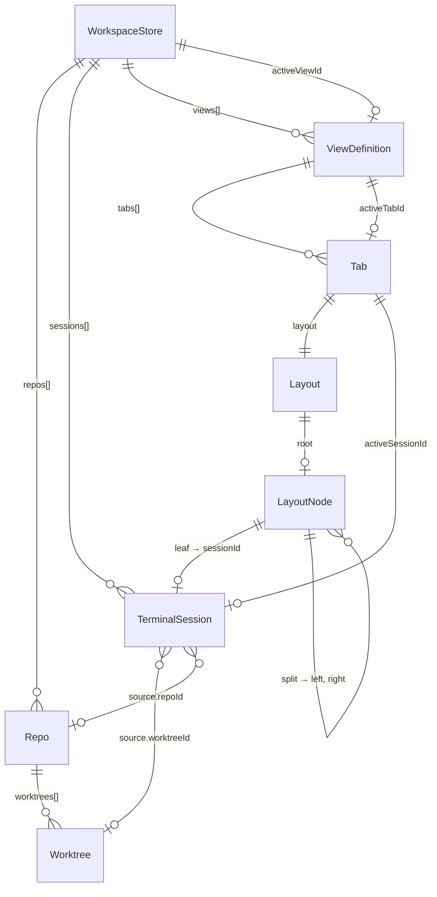
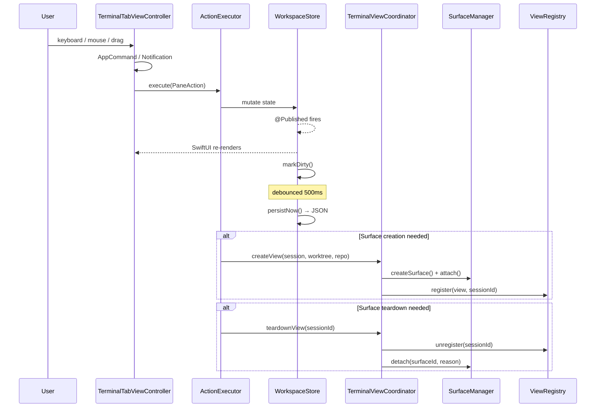
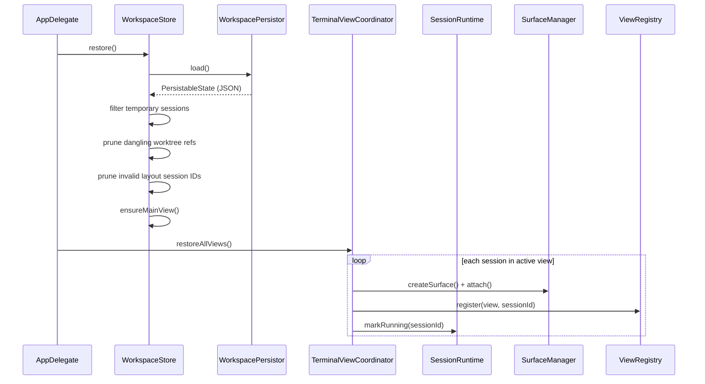

# Component Architecture

## TL;DR

`WorkspaceStore` owns all persisted state: repos, sessions, views, and layouts. `TerminalSession` is the primary identity — referenced by UUID across every layer. Layouts are immutable value-type trees where leaves point to session IDs. All mutations flow through `ActionExecutor` → `WorkspaceStore`, which fires `@Published` for SwiftUI re-renders and debounces persistence. Twelve invariants are enforced at all times.

---

## 1. Overview

### 1.1 Architecture Principles

1. **Session as primary entity** — A `TerminalSession` exists independently of layout, view, or surface. It can move between tabs, views, and layout positions while keeping the same identity.
2. **Single ownership boundary** — `WorkspaceStore` owns all persisted state. `ViewRegistry`, `SessionRuntime`, `WorkspacePersistor` are collaborators, not peers.
3. **Explicit layout model** — The split tree is a structured, queryable `Layout` value type. Leaves reference sessions by ID. No `NSView` references, no opaque blobs.
4. **View model** — Multiple named `ViewDefinition`s organize sessions into tab arrangements. Switching views reattaches surfaces without recreation.
5. **Surface independence** — Ghostty surfaces are ephemeral runtime resources. The model layer never holds `NSView` references.
6. **Provider abstraction** — zmx is a headless restore backend. The model carries provider metadata without coupling to zmx specifics.
7. **Testability** — Core model and layout logic are pure value types with no singletons or `@MainActor` requirements.

### 1.2 High-Level System Diagram

```
┌──────────────────────────────────────────────────────────────────────┐
│                            AppDelegate                               │
│                                                                      │
│   Persisted State            Runtime                   UI Bridge     │
│  ┌──────────────┐    ┌───────────────┐    ┌──────────────────────┐   │
│  │WorkspaceStore│    │SessionRuntime │    │    ViewRegistry       │   │
│  │ repos        │    │ statuses      │    │ sessionId → NSView   │   │
│  │ sessions     │◄───│ backends      │    │ renderTree()         │   │
│  │ views        │    └───────┬───────┘    └──────────┬───────────┘   │
│  │ activeViewId │            │                       │               │
│  └──────┬───────┘            │                       │               │
│         │            ┌───────┴───────────────────────┴────────┐      │
│         │            │      TerminalViewCoordinator            │      │
│         │            │   (sole bridge: model ↔ view ↔ surface) │      │
│         │            └───────────────────┬────────────────────┘      │
│         │                                │                           │
│  ┌──────┴──────┐                ┌────────┴────────┐                  │
│  │   Action    │                │ SurfaceManager  │                  │
│  │  Executor   │                │   (singleton)   │                  │
│  │ (dispatch)  │                │ active|hidden   │                  │
│  └─────────────┘                │ |undoStack      │                  │
│                                 └─────────────────┘                  │
│  ┌─────────────┐  ┌────────────┐  ┌──────────────┐                  │
│  │TabBarAdapter│  │ Persistor  │  │WorktrunkSvc  │                  │
│  │(derived UI) │  │ (JSON I/O) │  │(git worktree)│                  │
│  └─────────────┘  └────────────┘  └──────────────┘                  │
└──────────────────────────────────────────────────────────────────────┘
```

---

## 2. Data Model

### 2.1 Entity Relationship Overview



### 2.2 Repo & Worktree

**`Repo`** — A git repository on disk. Contains discovered worktrees.

| Field | Type | Notes |
|-------|------|-------|
| `id` | `UUID` | Primary key |
| `name` | `String` | Directory name |
| `repoPath` | `URL` | Filesystem path |
| `worktrees` | `[Worktree]` | Discovered git worktrees |
| `createdAt` | `Date` | When the repo was added |
| `updatedAt` | `Date` | Last modification timestamp |
| `stableKey` | `String` | SHA-256 of path (16 hex chars), deterministic across reinstalls |

**`Worktree`** — A git worktree within a repo.

| Field | Type | Notes |
|-------|------|-------|
| `id` | `UUID` | Primary key |
| `name` | `String` | Branch-derived display name |
| `path` | `URL` | Filesystem path |
| `branch` | `String` | Git branch name |
| `agent` | `AgentType?` | Which AI agent is assigned (claude, codex, gemini, aider, custom) |
| `status` | `WorktreeStatus` | Agent status (idle, running, pendingReview, error) |
| `stableKey` | `String` | SHA-256 of path (16 hex chars) |

> **File:** `Models/Repo.swift`, `Models/Worktree.swift`

### 2.3 TerminalSession

The **primary entity**. Stable identity for a terminal, independent of layout position, view, or surface. The `id` (UUID) is used across every layer: `WorkspaceStore`, `Layout`, `ViewRegistry`, `SurfaceManager`, `SessionRuntime`.

| Field | Type | Notes |
|-------|------|-------|
| `id` | `UUID` | Immutable primary key, never changes |
| `source` | `TerminalSource` | What this terminal is for |
| `title` | `String` | Display title (updated from shell) |
| `agent` | `AgentType?` | AI agent running in this terminal |
| `provider` | `SessionProvider` | Backend type |
| `lifetime` | `SessionLifetime` | Persistence behavior |
| `residency` | `SessionResidency` | Lifecycle position |

**`TerminalSource`** — What the terminal is for:
- `.worktree(worktreeId: UUID, repoId: UUID)` — Terminal for a specific worktree. References are **metadata, not foreign keys**: the session survives worktree removal; UI shows fallback text.
- `.floating(workingDirectory: URL?, title: String?)` — Standalone terminal not tied to a worktree.

**`SessionProvider`** — Backend type:
- `.ghostty` — Direct Ghostty surface, no session multiplexer
- `.zmx` — Headless zmx backend for persistence/restore across app restarts

**`SessionLifetime`** — Whether the session survives app restart:
- `.persistent` — Saved to disk and restored on launch. Temporary sessions are filtered out during save and restore.
- `.temporary` — Ephemeral, never persisted.

**`SessionResidency`** — Where the session currently lives in the app lifecycle. Prevents false-positive orphan detection:
- `.active` — In a layout, view exists, fully visible
- `.pendingUndo(expiresAt: Date)` — Closed but in the undo window. Not an orphan.
- `.backgrounded` — Alive but not visible in the current view. Not an orphan.

> **Files:** `Models/TerminalSession.swift`, `Models/TerminalSource.swift`, `Models/SessionLifetime.swift`, `Models/SessionResidency.swift`

### 2.4 ViewDefinition & ViewKind

A **named arrangement** of sessions into tabs. Multiple views can reference the same sessions.

| Field | Type | Notes |
|-------|------|-------|
| `id` | `UUID` | Primary key |
| `name` | `String` | Display name |
| `kind` | `ViewKind` | Lifecycle/behavior type |
| `tabs` | `[Tab]` | Ordered tab array (position = index) |
| `activeTabId` | `UUID?` | Currently focused tab |
| `allSessionIds` | `[UUID]` | Derived: all session IDs across all tabs |

**`ViewKind`** — Determines lifecycle and behavior:
- `.main` — Default view, always exists, cannot be deleted
- `.saved` — User-persisted layout snapshot
- `.worktree(worktreeId: UUID)` — Auto-generated view for a specific worktree
- `.dynamic(rule: DynamicViewRule)` — Rule-based, resolved at runtime

**`DynamicViewRule`** — Rules for dynamic views:
- `.byRepo(repoId: UUID)` — All sessions for a repo
- `.byAgent(AgentType)` — All sessions running a specific agent
- `.custom(name: String)` — Future: user-defined filter

> **File:** `Models/ViewDefinition.swift`

### 2.5 Tab

A tab within a view. Contains a layout and tracks which session is focused. Order is implicit — array position in the parent `ViewDefinition.tabs`.

| Field | Type | Notes |
|-------|------|-------|
| `id` | `UUID` | Primary key |
| `layout` | `Layout` | Split tree of session references |
| `activeSessionId` | `UUID?` | Focused session within this tab |
| `sessionIds` | `[UUID]` | Derived: all leaf session IDs (left-to-right) |
| `isSplit` | `Bool` | Derived: true if layout root is a split |

> **File:** `Models/Tab.swift`

### 2.6 Layout (Pure Value Type)

An immutable binary split tree. Leaves reference sessions by ID. All operations return **new** `Layout` instances — no in-place mutation.

```
Layout
└── root: Node?
    ├── .leaf(sessionId: UUID)
    └── .split(Split)
        ├── id: UUID
        ├── direction: .horizontal | .vertical
        ├── ratio: Double  (clamped 0.1–0.9)
        ├── left: Node
        └── right: Node
```

**Immutable Operations** (all return new Layout):

| Operation | Description |
|-----------|-------------|
| `inserting(sessionId:at:direction:position:)` | Insert a session adjacent to a target |
| `removing(sessionId:)` | Remove a session; collapses single-child splits. Returns `nil` if layout becomes empty |
| `resizing(splitId:ratio:)` | Update a split's ratio |
| `equalized()` | Set all split ratios to 0.5 |

**Navigation:**

| Method | Description |
|--------|-------------|
| `neighbor(of:direction:)` | Find the session in the given direction (left/right/up/down) |
| `next(after:)` | Next session in left-to-right order (wraps) |
| `previous(before:)` | Previous session in left-to-right order (wraps) |

> **File:** `Models/Layout.swift`

### 2.7 Templates

Templates define the initial session layout when opening a worktree. Not yet wired into the main flow (Phase B6, future).

**`TerminalTemplate`** — Blueprint for a single session:
- `title`, `agent`, `provider`, `relativeWorkingDir`
- `instantiate(worktreeId:repoId:)` → `TerminalSession`

**`WorktreeTemplate`** — Blueprint for a multi-session tab:
- `terminals: [TerminalTemplate]`, `createPolicy`, `splitDirection`
- `instantiate(worktreeId:repoId:)` → `([TerminalSession], Tab)`

**`CreatePolicy`** — When templates auto-create sessions:
- `.onCreate` — When the worktree is first opened
- `.onActivate` — When the worktree view is activated
- `.manual` — Only on explicit user action

> **File:** `Models/Templates.swift`

---

## 3. Service Layer

### 3.1 Ownership Hierarchy

```
AppDelegate (creates all services in dependency order)
├── WorkspaceStore           ← single source of truth
├── SessionRuntime           ← runtime status tracking
├── ViewRegistry             ← sessionId → NSView mapping
├── TerminalViewCoordinator  ← sole model↔view↔surface bridge
├── ActionExecutor           ← action dispatch hub
├── TabBarAdapter            ← derived display state
├── CommandBarPanelController ← command bar lifecycle (⌘P)
└── MainWindowController
    └── MainSplitViewController
        └── TerminalTabViewController
            ├── DraggableTabBarHostingView (SwiftUI)
            └── terminalContainer (dynamic split hierarchy)

Singletons:
├── SurfaceManager.shared    ← Ghostty surface lifecycle
├── CommandDispatcher.shared ← command definitions + dispatch
├── WorktrunkService.shared  ← git worktree CLI
└── Ghostty.shared           ← Ghostty C API wrapper
```

### 3.2 WorkspaceStore

Single source of truth for all persisted workspace state. `@MainActor`, `ObservableObject`.

**Published state** (drives SwiftUI):
- `repos: [Repo]`, `sessions: [TerminalSession]`, `views: [ViewDefinition]`, `activeViewId: UUID?`
- Transient UI: `draggingTabId`, `dropTargetIndex`, `tabFrames`

**Mutation API categories:**

| Category | Methods |
|----------|---------|
| Session | `createSession()`, `removeSession()`, `updateSessionTitle()`, `updateSessionAgent()`, `setResidency()` |
| View | `switchView()`, `createView()`, `deleteView()`, `saveCurrentViewAs()` |
| Tab | `appendTab()`, `removeTab()`, `insertTab()`, `moveTab()`, `setActiveTab()` |
| Layout | `insertSession()`, `removeSessionFromLayout()`, `resizePane()`, `equalizePanes()`, `setActiveSession()` |
| Compound | `breakUpTab()`, `extractSession()`, `mergeTab()` |
| Repo | `addRepo()`, `removeRepo()`, `updateRepoWorktrees()` |

**Derived state** (computed, not stored):
- `activeView`, `activeTabs`, `activeTabId`, `activeSessionIds`
- `isWorktreeActive()`, `sessionCount(for:)`, `sessions(for:)`

> **File:** `Services/WorkspaceStore.swift`

### 3.3 SessionRuntime

Manages live session state. Does **not** own sessions — reads the session list from `WorkspaceStore`. Tracks runtime status per session, schedules health checks, coordinates backends. `@MainActor`, `ObservableObject`.

**Runtime status:** `SessionRuntimeStatus` — `.initializing`, `.running`, `.exited`, `.unhealthy`

**Backend protocol:** `SessionBackendProtocol` — `start()`, `isAlive()`, `terminate()`, `restore()`

**Key operations:**
- `registerBackend()` — Register a backend (e.g., `ZmxBackend`) for a provider type
- `syncWithStore()` — Align tracked sessions with store's session list
- `startHealthChecks()` / `runHealthCheck()` — Periodic backend liveness checks
- `startSession()` / `restoreSession()` / `terminateSession()` — Backend lifecycle

> **Note:** A full `SessionStatus` state machine (7 states: unknown, verifying, alive, dead, missing, recovering, failed) exists in `Models/StateMachine/SessionStatus.swift` for future zmx health integration but is not yet wired into `SessionRuntime`. See [Session Lifecycle](session_lifecycle.md) for details.
>
> `ZmxBackend` conforms to a separate `SessionBackend` protocol (defined in `ZmxBackend.swift`) with its own method signatures. A future phase will wire `SessionRuntime` → `ZmxBackend` and consolidate the two protocols.

> **File:** `Services/SessionRuntime.swift`

### 3.4 ViewRegistry

Maps session IDs to live `AgentStudioTerminalView` instances. Runtime-only (not persisted). `@MainActor`.

- `register(view, sessionId)` / `unregister(sessionId)` — View lifecycle
- `view(for: sessionId)` — Lookup
- `renderTree(for: Layout) -> TerminalSplitTree?` — Traverse a `Layout` tree, resolve each leaf to a registered view, return a renderable split tree. Gracefully promotes single-child splits when one side's view is missing.

> **File:** `Services/ViewRegistry.swift`

### 3.5 ViewResolver

Resolves dynamic and worktree views at runtime. Pure static methods. `@MainActor`.

- `resolveWorktreeView()` — Generate a view showing all sessions for a worktree
- `resolveDynamic()` — Dispatch to rule-specific resolvers
- `resolveByRepo()`, `resolveByAgent()`, `resolveCustom()` — Rule implementations

> **File:** `Services/ViewResolver.swift`

### 3.6 TerminalViewCoordinator

The **sole bridge** between model, view, and surface layers. Views never call `SurfaceManager` directly. `SurfaceManager` never knows about the model layer.

- `createView(for:worktree:repo:)` — Create surface → attach → create `AgentStudioTerminalView` → register in `ViewRegistry`
- `teardownView(for: sessionId)` — Unregister → detach surface (with undo support)
- `restoreView(for:worktree:repo:)` — Pop surface from `SurfaceManager.undoClose()` LIFO stack → reattach
- `restoreAllViews()` — App launch: create views for all sessions in all views

> **File:** `App/TerminalViewCoordinator.swift`

### 3.7 ActionExecutor

Action dispatch hub. Coordinates `WorkspaceStore`, `ViewRegistry`, and `TerminalViewCoordinator`. Manages the undo stack.

**Key operations:**
- `openTerminal(for:in:)` — Create session + surface + tab. Rolls back session if surface creation fails.
- `execute(_ action: PaneAction)` — Dispatch switch for all pane actions (selectTab, closeTab, closePane, insertPane, extractPaneToTab, resizePane, equalizePanes, mergeTab, breakUpTab, focusPane, repair)
- `undoCloseTab()` — Pop `CloseSnapshot` from undo stack, restore to store, reattach surfaces in reverse order

**Undo stack:**
- `undoStack: [WorkspaceStore.CloseSnapshot]` — in-memory LIFO, max 10 entries
- `CloseSnapshot` captures: `tab`, `sessions`, `viewId`, `tabIndex`
- Oldest entries GC'd when stack exceeds limit; orphaned sessions cleaned up

> **File:** `App/ActionExecutor.swift`

### 3.8 TabBarAdapter

Combine-based derived state bridge between `WorkspaceStore` and the tab bar SwiftUI view. Observes `@Published` properties and transforms them into tab bar display items.

> **File:** `Views/TabBarAdapter.swift`

### 3.9 WorkspacePersistor

Owned by `WorkspaceStore` as a `private let` member. Pure persistence I/O. No business logic.

- `PersistableState` — Codable struct mirroring workspace fields
- `save(state)` / `load()` — JSON serialization to `~/.agentstudio/workspaces/`
- `ensureDirectory()`, `hasWorkspaceFiles()`, `delete()`

> **File:** `Services/WorkspacePersistor.swift`

### 3.10 SurfaceManager

Singleton managing Ghostty surface lifecycle. Detailed in [Surface Architecture](ghostty_surface_architecture.md).

Key points relevant here:
- Surfaces are keyed by their own UUID, joined to sessions via `SurfaceMetadata.sessionId`
- Three collections: `activeSurfaces`, `hiddenSurfaces`, `undoStack`
- `attach()` / `detach(reason:)` / `undoClose()` / `destroy()`

> **File:** `Ghostty/SurfaceManager.swift`

### 3.11 WorktrunkService

Git worktree management via the `wt` CLI tool. Singleton.

- `discoverWorktrees(at:)` — Parse `git worktree list` output
- `createWorktree()` / `removeWorktree()` — Lifecycle

> **File:** `Services/WorktrunkService.swift`

### 3.12 Command Bar System

Keyboard-driven search/command palette (⌘P) providing unified access to tabs, panes, commands, and worktrees. Modeled after Linear's ⌘K.

**`CommandBarPanelController`** — Owns the panel lifecycle and state. Created by `AppDelegate` with references to `WorkspaceStore` and `CommandDispatcher`. Manages show/dismiss/toggle behavior, backdrop overlay, and animations.

**`CommandBarState`** — `@Observable` state for the command bar. Manages:
- `rawInput` with prefix parsing (`>` → commands scope, `@` → panes scope)
- Navigation stack for nested drill-in (max 1 level deep)
- Selection index with wrap-around navigation
- Recent item IDs persisted to `UserDefaults`

**`CommandBarDataSource`** — Builds `CommandBarItem` arrays from live app state. Scope-filtered:
- `.everything` — tabs, panes, commands, worktrees (all groups)
- `.commands` — commands grouped by category (Pane, Focus, Tab, Repo, Window)
- `.panes` — panes grouped by parent tab, tabs as selectable items

Also builds `CommandBarLevel` targets for drill-in commands (e.g., "Close Tab..." → list of open tabs).

**`CommandBarSearch`** — Custom fuzzy matching engine. Returns scores (0.0 = best) and character match ranges for highlighting. Weighted scoring: title (1.0), subtitle (0.8), keywords (0.6). Recency boost for recently used items.

**`CommandBarPanel`** — `NSPanel` subclass with `NSVisualEffectView` (`.sidebar` material) and `NSHostingView` for SwiftUI content. Child window of the main window.

**Key design decisions:**
- NSPanel over SwiftUI overlay — guarantees z-ordering above Ghostty `NSView` surfaces
- Custom fuzzy matcher over third-party — FuzzyMatchingSwift lacks character match ranges needed for highlighting
- Actions route through `CommandDispatcher` → full validation pipeline — the command bar never mutates `WorkspaceStore` directly
- Tab/pane navigation uses `selectTabById` notification — avoids accidental destructive command dispatch

> **Files:** `CommandBar/CommandBarPanelController.swift`, `CommandBar/CommandBarState.swift`, `CommandBar/CommandBarDataSource.swift`, `CommandBar/CommandBarSearch.swift`, `CommandBar/CommandBarPanel.swift`, `CommandBar/CommandBarItem.swift`, `CommandBar/Views/*.swift`

---

## 4. Data Flow

### 4.1 Mutation Pipeline

Every state change follows this path:



### 4.2 Restore Flow



### 4.3 View Switch Flow

When switching from View A to View B:

1. `WorkspaceStore.switchView(viewB.id)` sets `activeViewId`
2. `TerminalViewCoordinator.handleViewSwitch(from: A, to: B)`:
   - **Sessions only in A**: `SurfaceManager.detach(.hide)`, `ViewRegistry.unregister()`
   - **Sessions in both A and B**: No change (surface stays attached)
   - **Sessions only in B**: `TerminalViewCoordinator.createView()`, `ViewRegistry.register()`, `SurfaceManager.attach()`

### 4.4 Undo Close Flow

1. **Close**: `ActionExecutor.executeCloseTab(tabId)`
   - `store.snapshotForClose()` → `CloseSnapshot` (tab + sessions + viewId + tabIndex)
   - Push snapshot to `undoStack` (max 10)
   - `coordinator.teardownView()` for each session → `SurfaceManager.detach(.close)` (surfaces enter undo stack with TTL)
   - `store.removeTab(tabId)` — sessions stay in `store.sessions`
   - GC oldest undo entries if stack > 10

2. **Undo** (`Cmd+Shift+T`): `ActionExecutor.undoCloseTab()`
   - Pop `CloseSnapshot` from undo stack
   - `store.restoreFromSnapshot()` → re-insert tab at original position
   - `coordinator.restoreView()` for each session (reversed order, matching SurfaceManager LIFO)
   - `SurfaceManager.undoClose()` pops surface → reattach (no recreation)

### 4.5 Command Bar Execution Flow

When a user selects an item from the command bar:

```
CommandBarView.executeItem(item)
│
├─ If dimmed (canDispatch == false) → blocked, no action
│
├─ .dispatch(command)
│   └─ onDismiss() → CommandDispatcher.dispatch(command)
│       → CommandHandler.execute(command)
│         → ActionResolver → ActionValidator → ActionExecutor → WorkspaceStore
│
├─ .dispatchTargeted(command, target: UUID, targetType)
│   └─ onDismiss() → CommandDispatcher.dispatch(command, target, targetType)
│       → CommandHandler.execute(command, target, targetType)
│         → ActionResolver (with explicit target) → ActionValidator → ActionExecutor
│
├─ .navigate(level)
│   └─ state.pushLevel(level) — drill into nested target picker
│
└─ .custom(closure)
    └─ onDismiss() → closure() — e.g., NotificationCenter.post(.selectTabById)
```

The command bar records the selected item ID in `recentItemIds` (persisted to `UserDefaults`) before executing. Dimmed items (commands where `dispatcher.canDispatch()` returns false) are blocked from execution on both click and Enter key.

---

## 5. Persistence

### 5.1 Write Strategy

All mutations call `markDirty()`, which:
1. Sets `isDirty = true`
2. Calls `ProcessInfo.disableSuddenTermination()` (prevents macOS kill during write)
3. Schedules debounced save (500ms window, cancels previous)
4. After 500ms with no new mutations: `persistNow()` → JSON to disk
5. Resets `isDirty`, re-enables sudden termination

**On app termination:** `flush()` cancels any pending debounce and persists immediately.

**Window frame:** Not debounced — only saved on quit via `flush()`. `setWindowFrame()` does not call `markDirty()`.

### 5.2 Save Filtering

Before writing to disk:
- Temporary sessions (`lifetime == .temporary`) are **excluded** from the persisted copy
- View layouts are pruned: any session ID not in the persisted session list is removed from layout nodes
- Empty tabs (all sessions pruned) are removed
- `activeTabId` pointers are fixed if they reference removed tabs
- The in-memory `views` state is **not** mutated — only the serialized output is cleaned

### 5.3 Restore Filtering

On app launch:
1. Load JSON from disk
2. Filter out `.temporary` sessions
3. Remove sessions whose worktree no longer exists on disk
4. Prune dangling session IDs from all view layouts
5. Remove empty tabs, fix `activeTabId` pointers
6. Ensure main view exists (create if missing)

---

## 6. Invariants

These rules are enforced by `WorkspaceStore` and model types at all times:

1. **Session ID uniqueness** — Every `TerminalSession.id` is unique within the workspace
2. **Tab minimum** — A `Tab` always has at least one session in its layout. Removing the last session closes the tab.
3. **Active session validity** — `Tab.activeSessionId` references a session in that tab's layout, or is nil during construction
4. **Active tab validity** — `ViewDefinition.activeTabId` references a tab in that view, or is nil when no tabs exist
5. **Active view validity** — `activeViewId` references a view in `views`, or is nil
6. **Main view always exists** — `views` always contains exactly one view with `kind == .main`. It cannot be deleted.
7. **Layout tree structure** — Every split has exactly two children. Leaves contain valid session IDs.
8. **Split ratios clamped** — `0.1 <= ratio <= 0.9`
9. **Source is metadata** — `TerminalSource.worktree(id, repoId)` may reference a worktree that no longer exists. The session survives; UI shows fallback text.
10. **Session independence** — Removing a session from a layout does NOT remove it from `sessions[]`. Sessions are explicitly removed only on user close or GC.
11. **No NSView in model** — No model type holds `NSView` references
12. **Persistence safety** — `disableSuddenTermination()` while dirty; `flush()` on quit

---

## 7. Key Files

| File | Purpose |
|------|---------|
| **Models** | |
| `Models/TerminalSession.swift` | `TerminalSession`, `SessionProvider` |
| `Models/TerminalSource.swift` | `TerminalSource` enum |
| `Models/SessionLifetime.swift` | `.persistent` / `.temporary` |
| `Models/SessionResidency.swift` | `.active` / `.pendingUndo` / `.backgrounded` |
| `Models/Layout.swift` | Pure value-type split tree, `FocusDirection` |
| `Models/Tab.swift` | Tab with layout and active session |
| `Models/ViewDefinition.swift` | `ViewDefinition`, `ViewKind`, `DynamicViewRule` |
| `Models/Repo.swift` | `Repo` entity |
| `Models/Worktree.swift` | `Worktree`, `WorktreeStatus`, `AgentType` |
| `Models/Templates.swift` | `WorktreeTemplate`, `TerminalTemplate`, `CreatePolicy` |
| `Models/StableKey.swift` | SHA-256 path hashing for deterministic IDs |
| `Models/StateMachine/StateMachine.swift` | Generic state machine with effect handling |
| `Models/StateMachine/SessionStatus.swift` | 7-state session lifecycle machine (future zmx health) |
| **Services** | |
| `Services/WorkspaceStore.swift` | Single ownership boundary for all state |
| `Services/WorkspacePersistor.swift` | JSON persistence I/O |
| `Services/SessionRuntime.swift` | Runtime status tracking and health checks |
| `Services/ViewRegistry.swift` | Session ID → NSView mapping |
| `Services/ViewResolver.swift` | Dynamic/worktree view resolution |
| `Services/WorktrunkService.swift` | Git worktree CLI wrapper |
| `Services/ProcessExecutor.swift` | Protocol + default impl for CLI execution |
| `Services/Backends/ZmxBackend.swift` | zmx CLI wrapper — session create/destroy/health |
| **App** | |
| `App/ActionExecutor.swift` | Action dispatch hub, undo stack |
| `App/TerminalViewCoordinator.swift` | Sole model↔view↔surface bridge |
| `App/MainWindowController.swift` | Primary window management |
| `App/MainSplitViewController.swift` | Split view: sidebar + terminal panes |
| `App/TerminalTabViewController.swift` | Tab controller, subscribes to store via Combine |
| **Actions** | |
| `Actions/PaneAction.swift` | Action enum for all pane operations |
| `Actions/ActionResolver.swift` | Resolves user input → PaneAction |
| `Actions/ActionValidator.swift` | Validates actions before execution |
| `Actions/ActionStateSnapshot.swift` | Captures state for validation |
| **Command Bar** | |
| `CommandBar/CommandBarPanelController.swift` | Panel lifecycle: show/dismiss/toggle, backdrop, animation |
| `CommandBar/CommandBarState.swift` | Observable state: prefix parsing, navigation, selection, recents |
| `CommandBar/CommandBarDataSource.swift` | Builds items from `WorkspaceStore` + `CommandDispatcher`, scope-filtered |
| `CommandBar/CommandBarSearch.swift` | Custom fuzzy matching with score + character match ranges |
| `CommandBar/CommandBarPanel.swift` | `NSPanel` subclass with `NSVisualEffectView` + `NSHostingView` |
| `CommandBar/CommandBarItem.swift` | Data models: `CommandBarItem`, `CommandBarLevel`, `CommandBarAction`, `ShortcutKey` |
| `CommandBar/Views/CommandBarView.swift` | Root SwiftUI view — composes search, results, scope pill, footer |
| `CommandBar/Views/CommandBarTextField.swift` | `NSViewRepresentable` wrapping `NSTextField` for keyboard interception |
| `CommandBar/Views/CommandBarResultsList.swift` | Grouped scrollable list with flattened index tracking |
| `CommandBar/Views/CommandBarResultRow.swift` | Result row with fuzzy match highlighting and dimming |

---

## 8. Cross-References

- **[Architecture Overview](README.md)** — System overview and document index
- **[Session Lifecycle](session_lifecycle.md)** — Session creation, close, undo, restore flows; runtime status; zmx backend
- **[Surface Architecture](ghostty_surface_architecture.md)** — Ghostty surface ownership, state machine, health monitoring, crash isolation
- **[App Architecture](appkit_swiftui_architecture.md)** — AppKit+SwiftUI hybrid patterns, window/controller hierarchy
