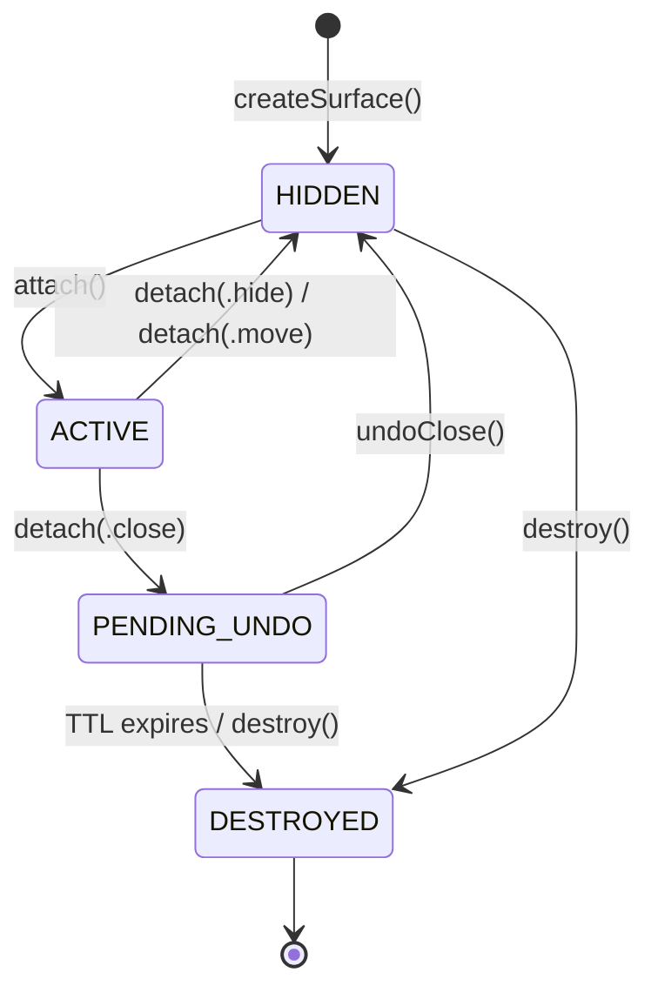

# Ghostty Surface Architecture

## TL;DR

Agent Studio embeds Ghostty terminal surfaces via libghostty. `SurfaceManager` (singleton) **owns** all surfaces. `TerminalPaneMountView` only **displays** them, and it does so from inside a stable `PaneHostView`. `PaneCoordinator` is the sole intermediary — views and the model layer never call `SurfaceManager` directly. Surfaces live in exactly one of three collections (active, hidden, undoStack), with dual-layer health monitoring and crash isolation per terminal.

---

## Core Design: Ownership Separation

The key architectural decision is **separation of ownership from display**:
- `SurfaceManager` **owns** all surfaces (creation, lifecycle, destruction)
- `TerminalPaneMountView` containers only **display** surfaces
- `PaneCoordinator` is the sole intermediary for surface/runtime lifecycle

```
┌─────────────────────────────────────────────────────────────────────┐
│                        SurfaceManager                               │
│                     (OWNS all surfaces)                             │
│                                                                     │
│  ┌─────────────────┐ ┌─────────────────┐ ┌─────────────────┐       │
│  │ activeSurfaces  │ │ hiddenSurfaces  │ │   undoStack     │       │
│  │  [UUID: Surf]   │ │  [UUID: Surf]   │ │ [UndoEntry]     │       │
│  │                 │ │                 │ │                 │       │
│  │  Rendering: ON  │ │  Rendering: OFF │ │ TTL: 5 minutes  │       │
│  └────────┬────────┘ └────────┬────────┘ └────────┬────────┘       │
│           │                   │                   │                 │
│           └───────────────────┴───────────────────┘                 │
│                      Surface lives in ONE                           │
└─────────────────────────────────────────────────────────────────────┘
                              │
                    attach() / detach()
                              │
                    (via PaneCoordinator)
                              │
                              ▼
┌─────────────────────────────────────────────────────────────────────┐
│                    TerminalPaneMountView                            │
│          (mounted under PaneHostView, displays only)                │
│                                                                     │
│   paneId: UUID       ←─ single identity across all layers           │
│   surfaceId: UUID?   ←─ which surface is displayed here             │
│                                                                     │
│   displaySurface(surfaceView)  ←─ called by coordinator             │
│   removeSurface()              ←─ called by coordinator             │
└─────────────────────────────────────────────────────────────────────┘
```

**Pane-to-surface join key:** `SurfaceMetadata.paneId` links a surface to its `Pane`. This is used during undo restore to verify the correct surface is reattached to the correct pane (multi-pane safety).

---

## Ghostty Runtime Lifecycle Facts

The embedding contract depends on four independent axes:

1. Surface existence: create/free (`ghostty_surface_new`/`ghostty_surface_free`)
2. Geometry: resize (`ghostty_surface_set_size`)
3. Visibility: occlusion (`ghostty_surface_set_occlusion`)
4. Focus: input focus (`ghostty_surface_set_focus`)

Design implication:

- Geometry updates must not be modeled as visibility-dependent.
- Background panes can be pre-sized and kept occluded.
- Attach orchestration should treat size readiness and visibility readiness as separate signals.

---

## Surface State Machine

A surface exists in **exactly one** collection. The collection determines the state:


```mermaid
stateDiagram-v2
    [*] --> HIDDEN: createSurface()
    HIDDEN --> ACTIVE: attach()
    ACTIVE --> HIDDEN: detach(.hide) / detach(.move)
    ACTIVE --> PENDING_UNDO: detach(.close)
    PENDING_UNDO --> HIDDEN: undoClose()
    PENDING_UNDO --> DESTROYED: TTL expires / destroy()
    HIDDEN --> DESTROYED: destroy()
    DESTROYED --> [*]
```

| State | Collection | Rendering | Notes |
|-------|-----------|-----------|-------|
| HIDDEN | `hiddenSurfaces` | OFF | Alive but not displayed |
| ACTIVE | `activeSurfaces` | ON | Visible in a container |
| PENDING_UNDO | `undoStack` | OFF | Closed, awaiting undo (5 min TTL) |
| DESTROYED | (freed) | N/A | Surface removed from all collections, ARC deallocated |

---

## Tab Close → Undo Flow

The close/undo flow is coordinated through `PaneCoordinator` → `SurfaceManager`. Views never call `SurfaceManager` directly.

```
User closes tab
       │
       ▼
┌──────────────────────────────────────────────────────────────┐
│ PaneCoordinator.executeCloseTab(tabId)                        │
│   ├─► store.snapshotForClose() → TabCloseSnapshot            │
│   ├─► Push to undo stack (max 10 entries)                    │
│   │                                                          │
│   ├─► For each paneId in tab:                               │
│   │     coordinator.teardownView(paneId)                    │
│   │       ├─► ViewRegistry.unregister(paneId)             │
│   │       └─► SurfaceManager.detach(surfaceId, reason: .close)│
│   │             ├─► Remove from activeSurfaces               │
│   │             ├─► ghostty_surface_set_occlusion(false)     │
│   │             ├─► Create SurfaceUndoEntry with TTL         │
│   │             ├─► Schedule expiration Task                 │
│   │             └─► Append to undoStack                      │
│   │                                                          │
│   └─► store.removeTab(tabId)                                 │
└──────────────────────────────────────────────────────────────┘

User presses Cmd+Shift+T
       │
       ▼
┌──────────────────────────────────────────────────────────────┐
│ PaneCoordinator.undoCloseTab()                                │
│   ├─► Pop CloseEntry from undo stack                        │
│   ├─► store.restoreFromSnapshot() → re-insert tab            │
│   │                                                          │
│   └─► For each pane (reversed, matching LIFO order):         │
│         coordinator.restoreView(pane, worktree, repo)         │
│           ├─► SurfaceManager.undoClose()                     │
│           │     ├─► Pop from undoStack                       │
│           │     ├─► Cancel expiration Task                   │
│           │     ├─► Verify metadata.paneId matches          │
│           │     └─► Move to hiddenSurfaces                   │
│           │                                                  │
│           ├─► SurfaceManager.attach(surfaceId, paneId)       │
│           │     ├─► Move to activeSurfaces                   │
│           │     ├─► ghostty_surface_set_occlusion(true)      │
│           │     └─► Return surfaceView                       │
│           │                                                  │
│           └─► ViewRegistry.register(view, paneId)            │
└──────────────────────────────────────────────────────────────┘
```

---

## Embedded Ghostty Host Composition

`Ghostty.shared` remains the subsystem entrypoint. The local `Ghostty.App` type is now a thin composition root that wires four focused host-side responsibilities:

- `Ghostty.AppHandle` owns `ghostty_app_t` and config lifetime.
- `Ghostty.CallbackRouter` owns the C callback table (`wakeup_cb`, `action_cb`, clipboard callbacks, `close_surface_cb`) and reconstructs Swift objects from userdata.
- `Ghostty.ActionRouter` owns the action-tag switch, surface lookup, and runtime routing.
- `Ghostty.AppFocusSynchronizer` observes `AppLifecycleAtom.isActive` and mirrors app-level focus into `ghostty_app_set_focus`.

The boundary is intentionally split by isolation contract: callback trampolines stay nonisolated and capture stable identity synchronously; surface updates and runtime routing hop to `@MainActor`.

Action routing must never crash the app from inside a Ghostty C callback. Known tags are pinned by tests so each explicitly routed tag produces one decision through the intercepted, workspace, or observed handler chains. Unknown tags and known tags that somehow miss a routing decision are logged, traced, and returned to Ghostty as unhandled (`false`) so Ghostty can apply its default behavior.

---

## Host Scrollback UX Boundary

Agent Studio now consumes libghostty/runtime facts for terminal scrollback UX, but still renders the visible macOS UI on the host side.

- Ghostty core owns terminal scrollback/search state and exposes it through routed runtime events such as `scrollbarChanged` and `search*`.
- `TerminalRuntime` is the observable host-side cache for those facts.
- `TerminalPaneMountView` composes host UI around the surface: `TerminalSurfaceScrollView`, `TerminalSearchOverlayView`, and `ScrollToBottomIndicatorView`.
- `TerminalSurfaceScrollView` provides the native scrollbar UI on macOS and synchronizes scrollbar thumb / live-scroll movement back into Ghostty core via `scroll_to_row:N`.
- `Ghostty.SurfaceView` remains the rendering/input bridge and keeps ordinary wheel/trackpad scrolling owned by Ghostty core, matching Ghostty.app more closely than the earlier host-owned scroll prototype.
- `Ghostty.AppHandle` injects an Agent Studio config override before `ghostty_config_finalize` so Ghostty core does not auto-scroll to bottom on keypress or output while the host wrapper is providing explicit scrollback affordances.

This is a deliberate split of responsibilities:

- libghostty owns terminal truth
- Agent Studio owns macOS host presentation

That differs from Ghostty.app only in product choices such as Agent Studio's always-visible scrollbar.

---

## CWD Propagation Architecture

When a user `cd`s in a terminal, the shell's OSC 7 integration reports the new working directory. Ghostty's core parses this and emits `GHOSTTY_ACTION_PWD`. Agent Studio captures this and propagates it through a 5-stage pipeline.

> **Current state:** Surface-local CWD changes already use the modern host-side path: callback router → `SurfaceView` closure callback → `SurfaceManager.surfaceCWDChanges` `AsyncStream` → `PaneCoordinator` → `WorkspaceStore`.
>
> **Future routing target (LUNA-325):** This can still collapse further into `GhosttyAdapter` → `GhosttyEvent.cwdChanged` → `TerminalRuntime` → `PaneEventEnvelope` when the remaining runtime event expansion lands.

```
Terminal shell (cd /foo)
    │ OSC 7
    ▼
① Ghostty C API                             [GHOSTTY_ACTION_PWD]
    │ Ghostty.CallbackRouter.action_cb
    │   └─► Ghostty.ActionRouter.handleAction()
    │ guard target == surface, safe C→String
    │ Task { @MainActor in surfaceView.pwdDidChange(pwd) }
    ▼
② SurfaceView.pwd: String? didSet           [GhosttySurfaceView.swift]
    │ guard pwd != oldValue (dedup)
    │ onWorkingDirectoryChanged?(surfaceViewId, pwd)
    ▼
③ SurfaceManager.onWorkingDirectoryChanged() [SurfaceManager.swift]
    │ SurfaceView → surfaceId (via surfaceViewToId)
    │ CWDNormalizer: String? → URL? (validates absolute path)
    │ SurfaceMetadata.workingDirectory = url
    │ AsyncStream yield SurfaceCWDChangeEvent(surfaceId, paneId, cwd)
    ▼
④ PaneCoordinator                          [App/Coordination/PaneCoordinator.swift]
    │ for await event in surfaceManager.surfaceCWDChanges
    │ store.updatePaneCWD(paneId, url)
    ▼
⑤ WorkspaceStore                            [WorkspaceStore.swift]
    │ pane.metadata.cwd = url (dedup + markDirty)
    │ @Observable → SwiftUI
    ▼
UI consumers (search by CWD, breadcrumbs, grouping)
```

### Key Design Points

- **1 pane = 1 surface = 1 CWD**. Layout splits create separate panes, so each pane tracks its own CWD independently.
- **`CWDNormalizer`** (`Infrastructure/CWDNormalizer.swift`): Pure function — `nil → nil`, `"" → nil`, non-absolute → nil, valid path → `URL.standardizedFileURL`. Defense-in-depth on top of Ghostty's own OSC 7 URI validation.
- **Dual storage**: `SurfaceMetadata.workingDirectory` (surface-level truth) + `PaneMetadata.cwd` (model-level, persisted). Both update synchronously on main thread.
- **Thread safety**: The C callback may fire off-main; the callback router captures stable identity synchronously, then uses `Task { @MainActor ... }` before touching `SurfaceView` or runtime state.
- **Dedup**: Both `SurfaceView.pwd` (didSet guard) and `WorkspaceStore.updatePaneCWD` (equality check) skip redundant updates.
- **Persistence**: `PaneMetadata.cwd: URL?` is Codable. Old persisted panes missing this field decode as `nil` (Swift optional auto-default).

### Public Read API

```swift
SurfaceManager.shared.workingDirectory(for: surfaceId) -> URL?
```

---

## Health Monitoring Architecture

```
┌────────────────────────────────────────────────────────────────────┐
│                     Health Detection (2 layers)                    │
├────────────────────────────────────────────────────────────────────┤
│                                                                    │
│  Layer 1: Event-Driven (instant)                                   │
│  ┌─────────────────────────────────────────────────────────────┐   │
│  │ Ghostty.Notification.didUpdateRendererHealth                │   │
│  │              │                                              │   │
│  │              ▼                                              │   │
│  │  surfaceViewToId[ObjectIdentifier] → UUID                   │   │
│  │              │                                              │   │
│  │              ▼                                              │   │
│  │  updateHealth(surfaceId, .healthy/.unhealthy)               │   │
│  └─────────────────────────────────────────────────────────────┘   │
│                                                                    │
│  Layer 2: Polling (every 2 seconds)                                │
│  ┌─────────────────────────────────────────────────────────────┐   │
│  │ Timer → checkAllSurfacesHealth()                            │   │
│  │              │                                              │   │
│  │              ├─► surface.surface == nil?  → .dead           │   │
│  │              ├─► ghostty_surface_process_exited? → .exited  │   │
│  │              └─► !surface.healthy? → .unhealthy             │   │
│  └─────────────────────────────────────────────────────────────┘   │
│                                                                    │
├────────────────────────────────────────────────────────────────────┤
│                   Health Delegate Pattern                          │
├────────────────────────────────────────────────────────────────────┤
│                                                                    │
│  SurfaceManager                                                    │
│    healthDelegates = NSHashTable<AnyObject>.weakObjects()          │
│                         │                                          │
│    notifyHealthDelegates(surfaceId, health)                        │
│                         │                                          │
│           ┌─────────────┼─────────────┐                            │
│           ▼             ▼             ▼                            │
│      Terminal 1    Terminal 2    Terminal 3                        │
│      (Tab A)       (Tab B)       (Tab C)                           │
│                                                                    │
│  Each tab filters: guard surfaceId == self.surfaceId               │
│  Weak refs: auto-cleanup when tabs close                           │
└────────────────────────────────────────────────────────────────────┘
```

---

## Attach Orchestration Notes (LUNA-295)

1. Surface creation and geometry warmup can occur before a pane becomes visible.
2. Occlusion should be used to suppress render cost, not as a proxy for geometry validity.
3. For anti-flicker behavior:
   - prioritize active pane attach on stable size,
   - allow background prewarm/pre-size,
   - reconcile final size on reveal.

This document defines surface lifecycle primitives. Scheduling policy belongs to pane runtime orchestration contracts.

---

## Detach Reasons

| Reason | Target | Expires | Rendering | Use Case |
|--------|--------|---------|-----------|----------|
| `.hide` | hiddenSurfaces | No | Paused | Background terminal / view switch |
| `.close` | undoStack | Yes (5 min) | Paused | Tab closed (undo-able) |
| `.move` | hiddenSurfaces | No | Paused | Tab drag reorder |

---

## Restore Initializer Pattern

```swift
// Worktree-bound (with repo context)
let view = TerminalPaneMountView(worktree: w, repo: r, restoredSurfaceId: id, paneId: paneId)
view.displaySurface(restoredSurface)

// Floating (no repo context — drawers, standalone terminals)
let view = TerminalPaneMountView(restoredSurfaceId: id, paneId: paneId, title: "Terminal")
view.displaySurface(restoredSurface)

// Placeholder-only (no surface yet)
let view = TerminalPaneMountView(paneId: paneId, title: "Terminal")
```

All three initializers require `paneId:`. The view never creates its own surface — the caller attaches one via `displaySurface()` after construction.

---

## Key APIs

| API | Purpose |
|-----|---------|
| `SurfaceManager.createSurface()` | Create with retry and error handling |
| `SurfaceManager.attach(to:)` | Attach to container, resume rendering |
| `SurfaceManager.detach(reason:)` | Hide, close (undo-able), or move |
| `SurfaceManager.undoClose()` | Restore last closed surface (LIFO) |
| `SurfaceManager.withSurface()` | Safe operation wrapper |

---

## Crash Isolation

**Goal:** One terminal crash must NEVER bring down the app.

| Layer | Mechanism |
|-------|-----------|
| **Prevention** | `withSurface()` wrapper validates pointers, retry on creation failure |
| **Detection** | Dual-layer health monitoring (events + polling) |
| **Recovery** | Error overlay in affected tab only, restart button, other tabs unaffected |

> **Limitation:** Zig panics on main thread will crash the app. We minimize this risk but can't eliminate it without IPC.

---

## Files

| File | Purpose |
|------|---------|
| `Ghostty/SurfaceManager.swift` | Singleton owner, lifecycle, health monitoring, CWD propagation |
| `Ghostty/SurfaceTypes.swift` | SurfaceState, ManagedSurface, SurfaceMetadata, protocols |
| `Infrastructure/CWDNormalizer.swift` | Pure normalizer: raw pwd string → validated file URL |
| `Ghostty/GhosttySurfaceView.swift` | Surface view with `pwd` property (OSC 7 CWD tracking) |
| `Ghostty/Ghostty.swift` | Thin composition root for the embedded Ghostty host |
| `Ghostty/GhosttyAppHandle.swift` | Owns `ghostty_app_t` and config lifetime |
| `Ghostty/GhosttyCallbackRouter.swift` | Owns the C callback table and userdata reconstruction |
| `Ghostty/GhosttyActionRouter.swift` | Owns Ghostty action routing and runtime lookup |
| `Ghostty/GhosttyAppFocusSynchronizer.swift` | Mirrors app lifecycle focus into `ghostty_app_set_focus` |
| `Hosting/TerminalPaneMountView.swift` | Terminal mount container, implements `SurfaceHealthDelegate` |
| `Views/SurfaceErrorOverlay.swift` | Error state UI with restart/close |

---

## Related Documentation

- **[Architecture Overview](README.md)** — System overview and document index
- **[Component Architecture](component_architecture.md)** — Data model, service layer, ownership hierarchy
- **[Session Lifecycle](session_lifecycle.md)** — Session creation, close, undo, restore, zmx backend
- **[App Architecture](appkit_swiftui_architecture.md)** — AppKit + SwiftUI hybrid, lifecycle management
- **[Zmx Restore and Sizing](zmx_restore_and_sizing.md)** — attach/readiness and restart reconcile policy

## Ticket Mapping

- `LUNA-295`: `Ghostty Runtime Lifecycle Facts`, `Attach Orchestration Notes (LUNA-295)`
- `LUNA-325`: `Ghostty Runtime Lifecycle Facts` (adapter/runtime boundary assumptions)
- `LUNA-342`: `Ghostty Runtime Lifecycle Facts` (contract freeze grounding)
