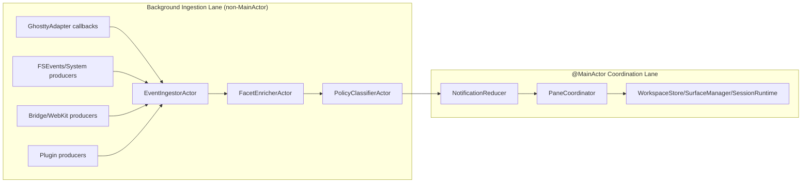
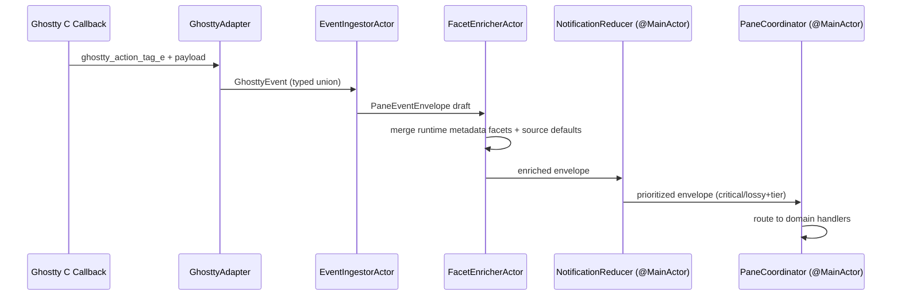

# Pane Runtime Option 2 Design

> **Status:** Draft proposal for the next runtime architecture phase
> **Audience:** LUNA-325 follow-up work, LUNA-349 runtime expansion, plugin/system event integration
> **Companion:** [Pane Runtime Architecture](pane_runtime_architecture.md) remains the contract source of truth

## TL;DR

Option 2 keeps runtime contracts and UI-bound state on `@MainActor`, but moves event ingestion, batching, and enrichment into dedicated background actors. MainActor only applies final state mutations and coordinator sequencing.

This is a middle path between:
- **Option 1:** MainActor-centric runtime pipeline (current baseline)
- **Option 3:** full actor-per-pane with async properties everywhere

Option 2 gives stronger throughput isolation than Option 1 without the migration cost and API churn of Option 3.

## Why This Exists

The current contracts define **what** must be true (typed events, source identity, action policy, reducer semantics). This document defines one concrete **how** for scaling pane + plugin + system events while keeping Swift 6 safety and coordinator boundaries intact.

## Relationship to Existing Architecture Docs

| Doc | Role in Option 2 |
|---|---|
| [Pane Runtime Architecture](pane_runtime_architecture.md) | Canonical contracts/invariants (C1-C16, A1-A15) |
| [AppKit + SwiftUI Architecture](appkit_swiftui_architecture.md) | MainActor UI ownership and `@Observable` boundaries |
| [Component Architecture](component_architecture.md) | Store/coordinator ownership and mutation flow |
| [Ghostty Surface Architecture](ghostty_surface_architecture.md) | Terminal surface lifecycle and callback boundaries |
| [Swift ↔ React Bridge Architecture](swift_react_bridge_design.md) | Three-stream bridge model for bridge/webview-style runtimes |

## Goals

1. Keep the UI thread responsive under bursty pane/system/plugin traffic.
2. Preserve discriminated-union contracts and compile-time exhaustiveness.
3. Keep `PaneCoordinator` as sequencer, not domain logic owner.
4. Propagate context facets (`repo/worktree/cwd/origin/upstream/tags`) consistently on every envelope.
5. Preserve three-tier system source model: built-in, service, plugin.

## Non-Goals

1. Replace the canonical contracts in `pane_runtime_architecture.md`.
2. Introduce backward-compat migration layers for greenfield runtime contracts.
3. Convert every runtime to full actor-isolated API surface (Option 3 scope).

## Architecture Overview



### Key Idea

- **Background lane** does ingestion work: normalize, enrich with facets, classify, and stage envelopes.
- **MainActor lane** performs authoritative mutations and view-facing sequencing.
- The join boundary is explicit: only typed envelopes cross from background actors into MainActor consumers.

## Event Envelope and Facet Propagation

Option 2 requires every envelope to carry:

1. `source` (`.pane`, `.worktree`, `.system`)
2. `sourceFacets` (denormalized pane/worktree/repo/cwd/org/origin/upstream/tags)
3. `event` (`PaneRuntimeEvent`)



### Facet Contract

The enrichment step uses `PaneContextFacets.fillingNilFields(from:)` as the canonical merge primitive:

1. Preserve explicit values from source.
2. Fill missing values from runtime/worktree defaults.
3. Keep tags deterministic: explicit tags win, fallback tags only when source tags are empty.

## Three-Tier System and Plugin Model

Option 2 keeps D9 semantics from `pane_runtime_architecture.md`:

1. **Built-in:** core-defined + core-implemented
2. **Service:** core-defined typed interface + provider backends
3. **Plugin:** plugin-defined schemas via escape hatch

```mermaid
flowchart TB
    S0[System Producer] --> S1{Tier}
    S1 -->|Built-in| S2[Typed Built-in Event]
    S1 -->|Service| S3[Typed Service Event + provider]
    S1 -->|Plugin| S4[Plugin Event wrapper]
    S2 --> E[PaneEventEnvelope.source = .system(...)]
    S3 --> E
    S4 --> E
    E --> R[NotificationReducer]
```

## Threading Model

### What Stays on MainActor

1. `PaneCoordinator`
2. `WorkspaceStore`, `SessionRuntime`, `SurfaceManager`
3. Final runtime `@Observable` state mutation
4. View registry and AppKit/WebKit view updates

### What Moves Off MainActor

1. Adapter payload normalization
2. Envelope enrichment (`sourceFacets`)
3. Lossy coalescing input staging
4. Any expensive parsing/scanning before state mutation

### Swift 6 Concurrency Rules

1. All cross-lane payloads are `Sendable`.
2. No `DispatchQueue.main.async` for new event plumbing.
3. C callbacks use typed trampoline + structured hop.
4. No untyped default/fallback branches for contract-exhaustive enums.

## Option Tradeoffs

| Option | Strengths | Costs | Recommended When |
|---|---|---|---|
| **Option 1** (current baseline) | Lowest migration cost, simplest mental model | MainActor can absorb too much ingestion work under sustained burst | Throughput is moderate and event enrichment is lightweight |
| **Option 2** (this doc) | Better burst isolation, preserves current API shape, no full actor rewrite | Added actor boundaries and queue observability work | Need higher throughput and consistent facet propagation now |
| **Option 3** (full actor-per-pane) | Strong isolation, clean per-pane ownership in theory | Large API churn, async property migration, coordinator and test rewrite | Very high throughput and willingness for broad refactor |

## Adoption Plan (Incremental)

1. Introduce `EventIngestorActor` and `FacetEnricherActor` behind existing runtime APIs.
2. Move adapter-heavy transformations into ingestion lane.
3. Keep `NotificationReducer` and coordinator APIs unchanged.
4. Add observability: queue depth, coalescing drops, enrichment latency.
5. Expand to non-terminal runtimes (LUNA-349) using same ingestion boundary.

## Verification Checklist

1. No MainActor frame stalls from ingestion bursts (benchmark suite + runtime telemetry).
2. Every envelope includes `sourceFacets` with deterministic merge behavior.
3. Built-in/service/plugin sources all route through same typed reducer boundary.
4. Compile-time exhaustiveness remains for discriminated unions (no catch-all defaults in contract-critical switches).
5. Coordinator remains sequencing-only; domain logic remains in runtimes/stores.
