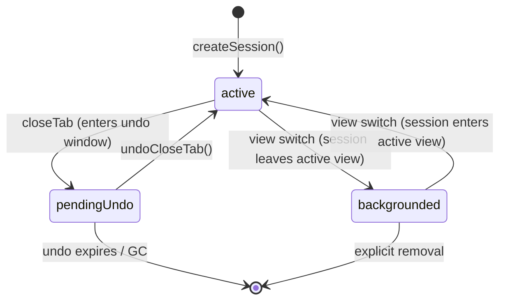
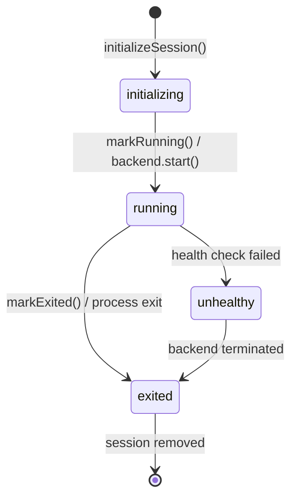
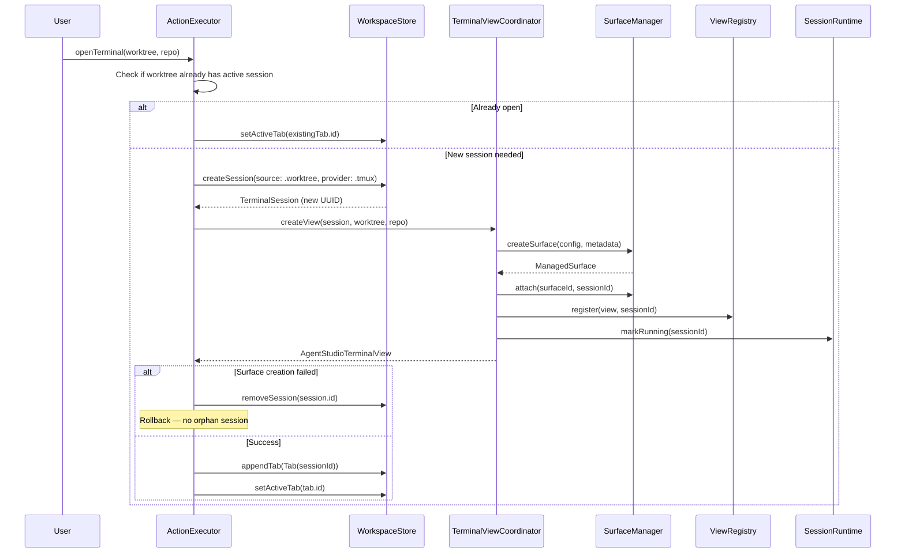
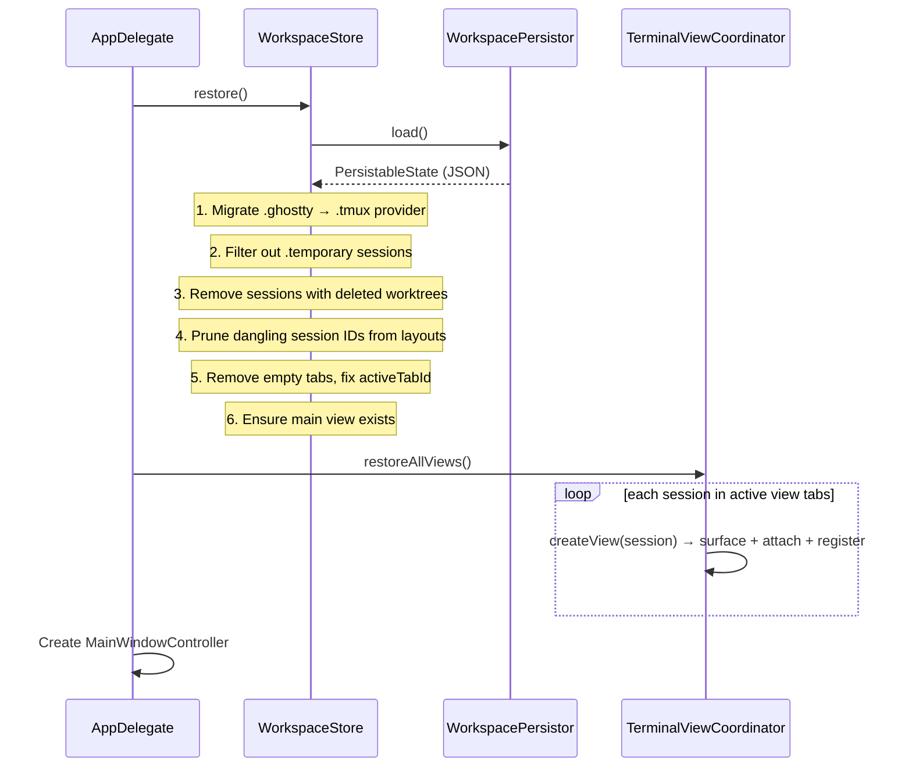
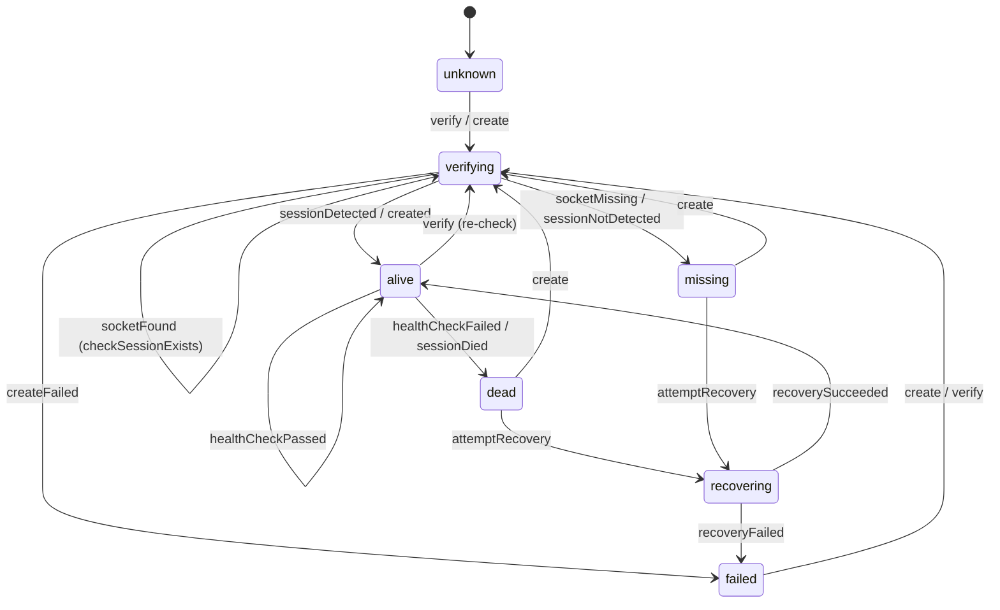

# Session Lifecycle Architecture

## TL;DR

A terminal session's identity (`UUID`) is stable across its entire lifecycle — creation, layout changes, view switches, close/undo, persistence, and restore. `WorkspaceStore` owns session records. `SessionRuntime` tracks runtime health. `TerminalViewCoordinator` bridges sessions to surfaces. Sessions survive layout removal (they persist in `store.sessions`) and can be undone via a `CloseSnapshot` stack. The tmux backend provides persistence across app restarts.

---

## Session Identity

A single `sessionId: UUID` is the identity used across **all** layers:

| Layer | Uses sessionId for |
|-------|--------------------|
| `WorkspaceStore` | Session record ownership |
| `Layout` / `Tab` / `ViewDefinition` | Leaf references in split trees |
| `ViewRegistry` | sessionId → live NSView mapping |
| `SurfaceManager` | `SurfaceMetadata.sessionId` — join key to session |
| `SessionRuntime` | Runtime status tracking |
| `TmuxBackend` | Part of deterministic tmux session name |

## Session Properties

Every session carries metadata that determines its behavior:

```
TerminalSession
├── id: UUID                    ← immutable primary key
├── source: TerminalSource      ← .worktree(wId, rId) or .floating(dir, title)
├── title: String               ← updated from shell title changes
├── agent: AgentType?           ← claude, codex, gemini, aider, custom
├── provider: SessionProvider   ← .ghostty (direct) or .tmux (persistent)
├── lifetime: SessionLifetime   ← .persistent (saved) or .temporary (ephemeral)
├── residency: SessionResidency ← .active, .pendingUndo(expiresAt), .backgrounded
└── lastKnownCWD: URL?          ← last shell-reported working directory (via OSC 7)
```

**`lastKnownCWD`** is the last working directory reported by the terminal shell via OSC 7. It is distinct from `source` (which holds the *initial* CWD from worktree/floating config). Updated live as the user `cd`s, persisted via Codable for display on restore before the next OSC 7 fires. See [Surface Architecture — CWD Propagation](ghostty_surface_architecture.md#cwd-propagation-architecture) for the full pipeline.

---

## Session Lifecycle States

### Residency (Persisted)


`SessionResidency` tracks where a session lives in the application lifecycle. This prevents false-positive orphan detection — a session in `pendingUndo` is not an orphan.



### Runtime Status (Not Persisted)

`SessionRuntimeStatus` tracks the live backend state. Created fresh on each app launch.



| Status | Meaning |
|--------|---------|
| `.initializing` | Session created, backend not yet ready |
| `.running` | Backend is running and healthy |
| `.exited` | Backend process has exited |
| `.unhealthy` | Health check failed, session may be stale. Terminal until backend exits. |

---

## Terminal Creation Flow



---

## Close & Undo Flow

### Close Tab

1. `ActionExecutor.executeCloseTab(tabId)`:
   - `store.snapshotForClose(tabId)` → `CloseSnapshot` (tab, sessions, viewId, tabIndex)
   - Push to `undoStack` (LIFO, max 10 entries)
   - For each session in the tab: `coordinator.teardownView(sessionId)`
     - `ViewRegistry.unregister(sessionId)`
     - `SurfaceManager.detach(surfaceId, reason: .close)` → surface enters SurfaceManager undo stack with TTL (5 min)
   - `store.removeTab(tabId)` — sessions remain in `store.sessions` (not deleted)
   - `expireOldUndoEntries()` — GC entries beyond max, remove orphaned sessions

### Undo Close Tab (`Cmd+Shift+T`)

2. `ActionExecutor.undoCloseTab()`:
   - Pop `CloseSnapshot` from undo stack
   - `store.restoreFromSnapshot(snapshot)` — re-insert tab at original position
   - For each session in **reversed** order (matching SurfaceManager LIFO):
     - `coordinator.restoreView(session, worktree, repo)`
     - `SurfaceManager.undoClose()` → pop surface from undo stack
     - Verify `metadata.sessionId` matches (multi-pane safety)
     - Reattach surface (no recreation)

### Close Pane (No Undo)

`executeClosePane(tabId, sessionId)`:
- `coordinator.teardownView(sessionId)` — surface destroyed (not undo-able)
- `store.removeSessionFromLayout(sessionId, inTab: tabId)` — if last session, removes the tab
- If session is no longer in any layout across all views, `store.removeSession(sessionId)`

---

## App Launch Restore



**Restore filtering details:**
- **Provider migration**: All `.ghostty` sessions become `.tmux` (ensuring persistent backend)
- **Temporary filtering**: Sessions with `lifetime == .temporary` are removed
- **Worktree validation**: Sessions referencing a `worktreeId` not in any repo's worktrees are removed (worktree was deleted between launches)
- **Layout pruning**: Session IDs not in the valid session set are removed from all layout nodes; single-child splits collapse; empty tabs removed
- **Main view guarantee**: If no `.main` view exists, one is created

---

## App Termination

```
AppDelegate.applicationWillTerminate / applicationShouldTerminate
  └── WorkspaceStore.flush()
        ├── Cancel pending debounced save
        ├── Filter temporary sessions from output
        ├── Prune layouts in the serialized copy
        └── Write JSON to disk immediately
```

---

## Persistence

State is persisted via `WorkspacePersistor` as JSON. See [Component Architecture — Persistence](component_architecture.md#5-persistence) for the full write strategy, filtering, and schema details.

Key points:
- All mutations debounced at 500ms via `markDirty()`
- `flush()` on termination for immediate write
- Temporary sessions never persisted
- Window frame saved only on quit

---

## Headless tmux Model

The tmux backend provides session persistence across app restarts. When enabled, terminal sessions survive app crashes — the user sees only a Ghostty terminal surface while tmux preserves the PTY and scrollback in the background.

### Socket Isolation

tmux runs on a dedicated socket `-L agentstudio`, completely separate from any user-owned tmux server. The user's `~/.tmux.conf` and default server are never touched.

### ghost.conf Settings

| Setting | Value | Purpose |
|---------|-------|---------|
| `prefix` | `None` | No prefix key — tmux won't intercept any keystrokes |
| `status` | `off` | No status bar — tmux is invisible |
| `destroy-unattached` | `off` | Session persists when app disconnects |
| `exit-unattached` | `off` | tmux server stays running with no clients |
| `default-terminal` | `xterm-256color` | Avoids Kitty keyboard protocol conflicts between tmux and GhosttyKit |
| `extended-keys` | `off` | Prevents additional keyboard protocol conflicts |
| `escape-time` | `0` | No escape delay — immediate key processing |
| `mouse` | `off` | Prevent tmux scroll/copy-mode overlays; keep tmux non-interactive |
| `unbind -a` (+ root/prefix/copy tables) | enabled | Removes tmux key-driven interactions and copy-mode entry points |
| `history-limit` | `50000` | Large scrollback preserved across restarts |
| `set-environment -g -u TMUX` | (unset) | Allows users to run their own tmux inside ghost sessions without nesting conflicts |
| `set-environment -g TERMINFO` | (runtime path) | Injected at launch — ensures programs find our custom xterm-256color, not the system one |
| Belt-and-suspenders unbinds | WheelUpPane, WheelDownPane, MouseDown1Pane, MouseDrag1Pane | Explicit unbinds in root/copy-mode/copy-mode-vi tables — some tmux versions re-create defaults after `unbind -a` |

### Custom xterm-256color Terminfo

Programs inside tmux use the `default-terminal` value (`xterm-256color`) to look up terminal capabilities. The system xterm-256color lacks Ghostty's features and uses X10 mouse format (`kmous=\E[M`). Our custom xterm-256color provides full Ghostty capabilities:

| Capability | Value | Purpose |
|-----------|-------|---------|
| `kmous` | `\E[<` (SGR) | Matches Ghostty's native mouse format — prevents protocol mismatch |
| `Tc` | enabled | True color (RGB) support |
| `Smulx` | styled underlines | Curly, dotted, dashed underlines |
| `Setulc` | underline colors | Colored underline support |
| `Sync` | synchronized output | Reduces flicker for fast-updating programs |
| `XM` | SGR mouse mode | Extended mouse mode matching Ghostty |
| `BD/BE` | bracketed paste | Safe paste handling |

**File locations:**
- Binary (bundled): `Sources/AgentStudio/Resources/terminfo/78/xterm-256color` — git-tracked
- Source (reference): `Sources/AgentStudio/Resources/terminfo-src/xterm-256color.src` — human-readable
- The binary is NOT generated by `build-ghostty.sh` — it's our custom build, git-tracked separately

**TERMINFO resolution chain:**
1. `SessionConfiguration.resolveTerminfoDir()` finds our custom terminfo directory (SPM bundle → app bundle → dev source tree)
2. `resolveGhostConfigPath()` appends `set-environment -g TERMINFO "<path>"` to `~/.agentstudio/tmux/ghost.conf`
3. When tmux loads ghost.conf, it sets TERMINFO in its global environment
4. All new panes/windows inherit the correct TERMINFO
5. Programs inside tmux find our custom xterm-256color at `$TERMINFO/78/xterm-256color`

**Why this is critical:** The tmux server persists across app restarts. Its initial environment may have stale TERMINFO pointing to an installed Ghostty.app (which lacks our custom xterm-256color). The ghost.conf injection ensures TERMINFO is updated every time the app launches, regardless of server age.

### Terminal Overrides

ghost.conf restores visual capabilities lost by using `xterm-256color` instead of `xterm-ghostty`:
- **RGB**: True color support via `RGB` terminal feature
- **Styled underlines**: `Smulx` for underline styles (curly, dotted, dashed)
- **Underline colors**: `Setulc` for colored underlines
- **Kitty keyboard protocol**: Deliberately **excluded** to prevent conflicts with GhosttyKit's native keyboard handling

### Session ID Format

```
agentstudio--<repo16hex>--<worktree16hex>--<pane16hex>
            |              |                |
            |              |                +-- First 16 hex chars of pane UUID
            |              +-- StableKey: SHA-256 of worktree path (16 hex)
            +-- StableKey: SHA-256 of repo path (16 hex)

Length: 65 characters (fixed)
```

Generated by `TmuxBackend.sessionId(repoStableKey:worktreeStableKey:paneId:)`. Deterministic — same repo path + worktree path + pane UUID triple always produces the same session ID.

---

## SessionStatus State Machine (Dormant)

A full 7-state machine exists in `Models/StateMachine/SessionStatus.swift` for future integration with tmux backend health monitoring. It is **not yet wired** into `SessionRuntime` (which uses the simpler `SessionRuntimeStatus` enum above).



**States:** `unknown`, `verifying`, `alive`, `dead`, `missing`, `recovering`, `failed(reason)`

**Effects:** Each transition can trigger effects (e.g., `checkSocket`, `createSession`, `scheduleHealthCheck`, `notifyAlive`, `notifyDead`) that are executed by the `Machine<SessionStatus>` effect handler.

---

## Key Files

| File | Role |
|------|------|
| `Services/WorkspaceStore.swift` | Central state owner — sessions, views, tabs, layouts, persistence |
| `Services/WorkspacePersistor.swift` | JSON serialization/deserialization |
| `Services/SessionRuntime.swift` | Runtime health monitoring and status tracking |
| `App/ActionExecutor.swift` | Dispatches actions (open, close, split, undo, etc.) |
| `App/TerminalViewCoordinator.swift` | Creates/restores views, sole intermediary for surface lifecycle |
| `Models/TerminalSession.swift` | Session identity with source, provider, lifetime, residency |
| `Models/SessionLifetime.swift` | `.persistent` / `.temporary` enum |
| `Models/SessionResidency.swift` | `.active` / `.pendingUndo` / `.backgrounded` enum |
| `Models/Layout.swift` | Value-type split layout tree (Codable for persistence) |
| `Models/Tab.swift` | Tab with layout and active session |
| `Models/Templates.swift` | Worktree/terminal templates for session creation |
| `Models/SessionConfiguration.swift` | Config detection from env vars |
| `Models/StateMachine/SessionStatus.swift` | 7-state machine definition for future tmux health |
| `Models/StateMachine/StateMachine.swift` | Generic state machine with effect handling |
| `Services/ProcessExecutor.swift` | Protocol + `DefaultProcessExecutor` for CLI execution |
| `Services/Backends/TmuxBackend.swift` | tmux CLI wrapper — session ID gen, create/destroy/healthCheck |
| `Resources/tmux/ghost.conf` | Headless tmux configuration |
| `Views/AgentStudioTerminalView.swift` | Terminal view (displays surfaces, does not own them) |
| `AppDelegate.swift` | Launch flow — restore workspace, create window |

## Related Documentation

- **[Architecture Overview](README.md)** — System overview and document index
- **[Component Architecture](component_architecture.md)** — Data model, service layer, data flow, persistence
- **[Surface Architecture](ghostty_surface_architecture.md)** — Surface ownership, state machine, undo close, health monitoring
- **[App Architecture](app_architecture.md)** — AppKit + SwiftUI hybrid, lifecycle management
