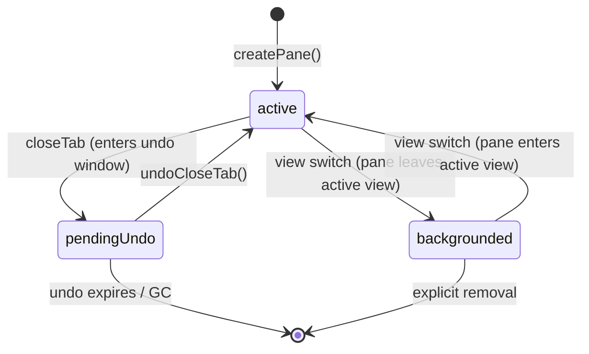
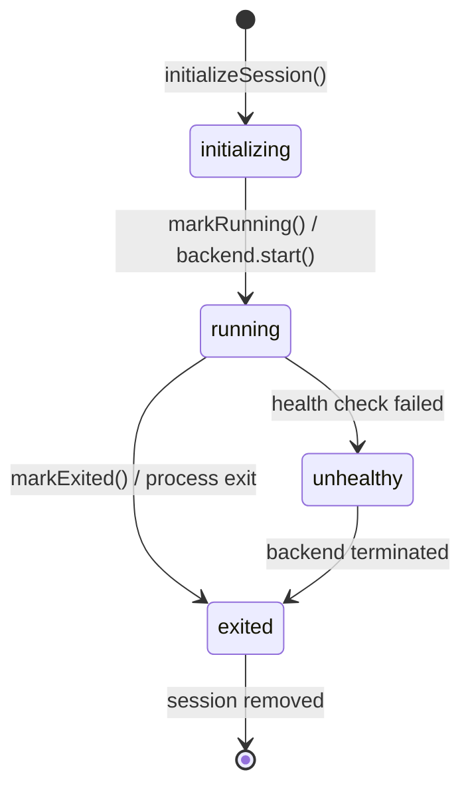
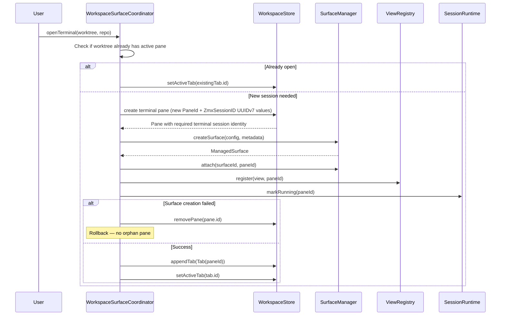
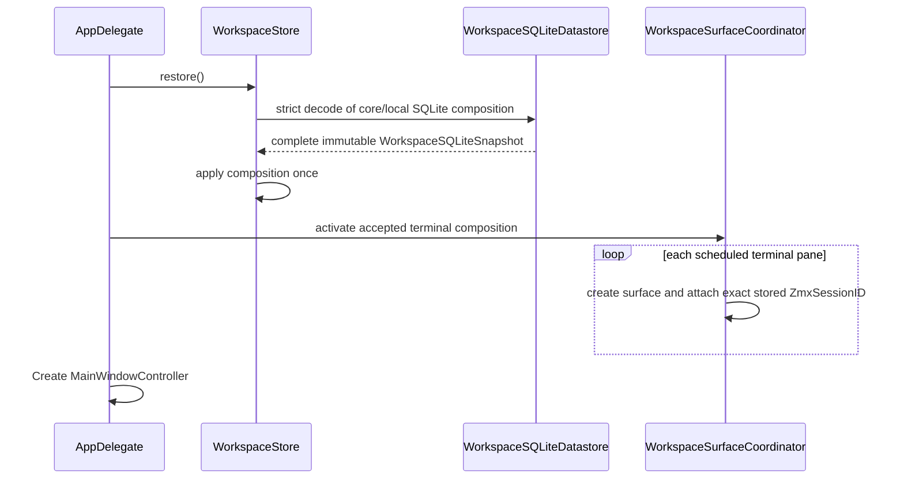
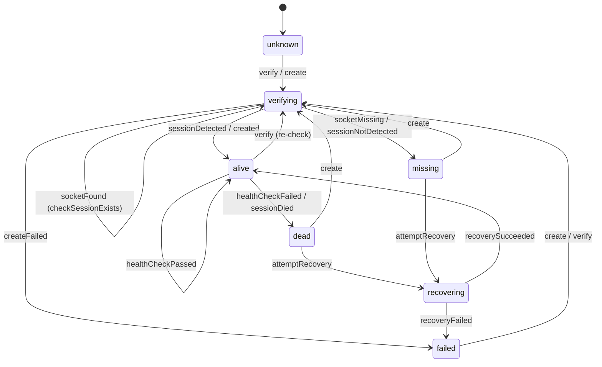

# Session Lifecycle Architecture

## TL;DR

A pane's identity (`PaneId`) is stable across its entire lifecycle — creation, layout changes, view switches, close/undo, persistence, and restore. `WorkspaceStore` owns pane records. `SessionRuntime` tracks runtime health. `WorkspaceSurfaceCoordinator` bridges panes to surfaces. Panes can be undone via a `CloseEntry` stack. The zmx backend provides persistence across app restarts.

---

## Identity Contract (Canonical)

`PaneId` is the pane's primary identity. Every terminal pane also owns a
separate, non-optional opaque `ZmxSessionID`. New pane and session identities
are independent UUIDv7 values minted at terminal-pane creation; neither is
derived from the other. SQLite stores the `ZmxSessionID` text verbatim, and zmx
attach receives that exact value. Restore preserves every existing nonempty
stored identity, including historical `as-*` values, without interpretation or
rewrite. Repository, worktree, path, launch-directory, drawer, pane fragments, and live
daemon inventory never participate in session identity.

### Identifier Types

| Identifier | Type | Owner | Persisted | Generation | Used For |
|------------|------|-------|-----------|------------|----------|
| `PaneId` | `PaneId` (`struct` wrapping `UUID`) | `WorkspaceStore` | Yes | `Pane.init(id: UUID = UUIDv7.generate(), ...)` with `PaneMetadata.paneId = PaneId(uuid: id)` | Universal pane identity across store/layout/view/runtime/surface |
| `ZmxSessionID` | strong opaque value type | `TerminalState` | Yes (existing `pane_content_terminal.zmx_session_id` text column) | New values independently use UUIDv7 at terminal-state creation; existing nonempty values restore verbatim | Exact zmx daemon/socket identity for every terminal pane |

### Session Identity Rules

1. Terminal-state construction mints one fresh UUIDv7 `ZmxSessionID`.
2. The type is non-optional. Persistence decoding accepts an existing nonempty
   opaque value and does not interpret its format.
3. Repository decode/write boundaries require the strong non-optional type and
   round-trip the existing SQLite text exactly. This cut adds no schema or data
   migration.
4. Restore is read-only: strict decode, one composition apply, activation, then
   attach with the exact stored ID.
5. No repair, hydration, adoption, discovery, inference, backfill, fallback, or
   identity mutation exists during restore or startup.
6. No migration rewrites an existing session identity.
7. The zmx subprocess boundary accepts only the strong `ZmxSessionID` type,
   never caller-supplied raw text. This is a security boundary as well as a
   domain invariant; restored historical values remain exact typed identities.

### PaneId Lifecycle (ASCII)

```text
USER ACTION (open terminal / split / drawer)
    |
    v
WorkspaceSurfaceCoordinator.create/open*
    |
    v
WorkspaceStore.createPane(...)
    -> Pane(id = UUIDv7.generate())      <-- PaneId minted once
    -> panes[paneId] = Pane
    |
    v
Tab/Layout references created
    -> Tab.panes[] contains paneId
    -> Layout.leaf(paneId)
    |
    v
Persist (core.sqlite)
    -> Pane.id stored
    -> Tab/Layout paneId references stored
    |
    v   app relaunch
Restore (WorkspaceStore.restore)
    -> strict SQLite decode of a complete valid composition
    -> one composition apply; no normalization, repair, or persistence write
    |
    v
WorkspaceSurfaceCoordinator.restoreAllViews()
    -> lookup Pane by paneId
    -> create/reattach surface + register view by paneId
```

### zmx Interplay and Lookups (ASCII)

```text
Terminal-pane creation
  - independently mint PaneId UUIDv7 and ZmxSessionID UUIDv7
                  |
                  v
TerminalState.zmxSessionID
  - required opaque value restored from pane_content_terminal.zmx_session_id
                  |
                  v
SQLite strict decode
  - reject missing or empty identity; preserve existing text exactly
                  |
                  v
one composition apply
                  |
                  v
terminal activation
  - zmx attach receives the exact stored ZmxSessionID
  - no discovery, inference, adoption, fallback, backfill, or write
```

### Lookup Ownership Table

| Lookup | Source of Truth | API/Path |
|--------|------------------|----------|
| `paneId -> Pane` | `WorkspaceStore.panes` | `store.pane(paneId)` / dictionary lookup |
| `paneId -> View` | `ViewRegistry` | `viewRegistry.view(for: paneId)` |
| `paneId -> RuntimeStatus` | `SessionRuntime.statuses` | `runtime.status(for: paneId)` |
| `paneId -> Surface` | `SurfaceManager` metadata/state | `SurfaceMetadata.paneId`, attach/detach paths |
| `paneId -> zmx session name` | required `TerminalState.zmxSessionID` | strict SQLite decode and immutable terminal activation input |
| `zmx session name -> live daemon` | zmx process state in `ZMX_DIR` | `zmx list` parse |

### Socket Path Budget (Darwin)

`zmx` creates Unix socket paths as:
`socketPath = zmxDir + "/" + sessionName`

Darwin `sockaddr_un.sun_path` is 104 bytes, so practical max is:
`socketPath.count <= 103`

This makes session name length a hard runtime constraint, not just formatting.
`ZmxTestHarness` uses short `/tmp/zt-<id>` paths specifically to stay under this limit.

### Debug App Identity Budget

Debug observability launches first try an app-bundle launch.
`scripts/run-debug-observability.sh` computes a deterministic four-character
base36 code from the canonical worktree path and uses it for debug app
identity:

| Field | Shape |
|-------|-------|
| app display name | `Agent Studio Debug <code>` |
| bundle id | `com.agentstudio.app.debug.d<code>` |
| data root | `~/.agentstudio-db/<code>` |
| zmx dir | `~/.agentstudio-db/<code>/z` |
| URL scheme | none |

This code isolates debug worktrees while keeping app names, bundle identifiers,
zmx paths, and Unix socket paths short. It is not a pane/session identifier.
The debug observability bundle removes URL-handler registration entirely so it
cannot claim stable production `agentstudio://` callbacks or deep links.
Debug isolation is owned by bundle id, app name, data root, and zmx root.
The generated debug bundle, logs, traces, and zmx root live under
`~/.agentstudio-db/<code>` instead of the repo checkout, which keeps autonomous
agent test launches from requiring `~/Documents` access just to read their own
app artifact. If LaunchServices/Gatekeeper rejects the generated local bundle,
the debug launcher may fall back to direct `Contents/MacOS/AgentStudio`
execution and records
`AGENTSTUDIO_OBSERVABILITY_LAUNCH_METHOD=direct_executable` in its state file.
That fallback is valid for Victoria/OTLP debug proof and keeps the same isolated
data/zmx root. It is not beta promotion proof and not full GUI proof.
The short debug worktree code scopes the zmx root only. It never contributes to
the opaque session name; all newly generated names use UUIDv7.

## Session Properties

Every pane carries metadata that determines its behavior:

```
Pane
├── id: UUID                    ← immutable primary key
├── content: PaneContent        ← .terminal/.webview/.codeViewer/.bridgePanel
├── metadata: PaneMetadata      ← title/launchDirectory/live facets/tags
├── kind: PaneKind              ← .layout or .drawerChild
└── residency: SessionResidency ← .active/.pendingUndo/.backgrounded
```

---

## Session Lifecycle States

### Residency (Persisted)

`SessionResidency` tracks where a pane lives in the application lifecycle. This prevents false-positive orphan detection — a pane in `pendingUndo` is not an orphan.


```mermaid
stateDiagram-v2
    [*] --> active: createPane()
    active --> pendingUndo: closeTab (enters undo window)
    active --> backgrounded: view switch (pane leaves active view)
    pendingUndo --> active: undoCloseTab()
    pendingUndo --> [*]: undo expires / GC
    backgrounded --> active: view switch (pane enters active view)
    backgrounded --> [*]: explicit removal
```

### Runtime Status (Not Persisted)

`SessionRuntimeStatus` tracks live backend state per pane. Created fresh on each app launch.


```mermaid
stateDiagram-v2
    [*] --> initializing: initializeSession()
    initializing --> running: markRunning() / backend.start()
    running --> exited: markExited() / process exit
    running --> unhealthy: health check failed
    unhealthy --> exited: backend terminated
    exited --> [*]: session removed
```

| Status | Meaning |
|--------|---------|
| `.initializing` | Session created, backend not yet ready |
| `.running` | Backend is running and healthy |
| `.exited` | Backend process has exited |
| `.unhealthy` | Health check failed, session may be stale. Terminal until backend exits. |

---

## Terminal Creation Flow


```mermaid
sequenceDiagram
    participant User
    participant PC as WorkspaceSurfaceCoordinator
    participant Store as WorkspaceStore
    participant SM as SurfaceManager
    participant VR as ViewRegistry
    participant RT as SessionRuntime

    User->>PC: openTerminal(worktree, repo)
    PC->>PC: Check if worktree already has active pane
    alt Already open
        PC->>Store: setActiveTab(existingTab.id)
    else New session needed
        PC->>Store: create terminal pane (new PaneId + ZmxSessionID UUIDv7 values)
        Store-->>PC: Pane with required terminal session identity
        PC->>SM: createSurface(config, metadata)
        SM-->>PC: ManagedSurface
        PC->>SM: attach(surfaceId, paneId)
        PC->>VR: register(view, paneId)
        PC->>RT: markRunning(paneId)

        alt Surface creation failed
            PC->>Store: removePane(pane.id)
            Note over PC: Rollback — no orphan pane
        else Success
            PC->>Store: appendTab(Tab(paneId))
            PC->>Store: setActiveTab(tab.id)
        end
    end
```

---

## Close & Undo Flow

### Close Tab

1. `WorkspaceSurfaceCoordinator.executeCloseTab(tabId)`:
   - `store.snapshotForClose(tabId)` → `TabCloseSnapshot` (tab, panes, tabIndex)
   - Push to `undoStack` (LIFO, max 10 entries)
   - For each pane in the tab: `coordinator.teardownView(paneId)`
     - `ViewRegistry.unregister(paneId)`
     - `SurfaceManager.detach(surfaceId, reason: .close)` → surface enters SurfaceManager undo stack with TTL (5 min)
   - `store.removeTab(tabId)` — panes remain in `store.panes` (not deleted)
   - `expireOldUndoEntries()` — GC entries beyond max, remove orphaned sessions

### Undo Close Tab (`Cmd+Shift+T`)

2. `WorkspaceSurfaceCoordinator.undoCloseTab()`:
   - Pop `WorkspaceStore.CloseEntry` from undo stack
   - `store.restoreFromSnapshot(snapshot)` — re-insert tab at original position
   - For each pane in **reversed** order (matching SurfaceManager LIFO):
     - `coordinator.restoreView(pane, worktree, repo)`
     - `SurfaceManager.undoClose()` → pop surface from undo stack
     - Verify `metadata.paneId` matches (multi-pane safety)
     - Reattach surface (no recreation)

### Close Pane (With Undo)

`executeClosePane(tabId, paneId)`:
- `store.snapshotForPaneClose(paneId, inTab: tabId)` creates a pane-level undo snapshot
- Push `.pane(PaneCloseSnapshot)` to `undoStack`
- `coordinator.teardownView(paneId)` detaches/destroys runtime view state
- `store.removePaneFromLayout(paneId, inTab: tabId)`; if last pane, close escalates to tab-close path
- Undo via `undoCloseTab()` restores the pane snapshot when its tab/parent context is still valid

---

## App Launch Restore


```mermaid
sequenceDiagram
    participant AD as AppDelegate
    participant Store as WorkspaceStore
    participant DB as WorkspaceSQLiteDatastore
    participant Coord as WorkspaceSurfaceCoordinator

    AD->>Store: restore()
    Store->>DB: strict decode of core/local SQLite composition
    DB-->>Store: complete immutable WorkspaceSQLiteSnapshot
    Store->>Store: apply composition once

    AD->>Coord: activate accepted terminal composition
    loop each scheduled terminal pane
        Coord->>Coord: create surface and attach exact stored ZmxSessionID
    end

    AD->>AD: Create MainWindowController
```

Restore is a read-only DAG: strict SQLite decode, one composition apply,
terminal activation, then exact-ID zmx attach. Missing or invalid required state
is a decode/restore failure; startup does not normalize the graph, prune or
invent references, repair cursors, infer session identities, or write a
corrected snapshot. Repository/topology startup proceeds independently and
never gates or mutates composition or session identity.

---

## App Termination

```
AppDelegate.applicationWillTerminate / applicationShouldTerminate
  └── WorkspaceStore.flush()
        ├── Cancel pending debounced save
        ├── Filter temporary sessions from output
        ├── Prune layouts in the serialized copy
        └── Commit SQLite snapshot immediately
```

---

## Persistence

State is persisted through `WorkspaceSQLiteDatastore` into `core.sqlite` plus
per-workspace `local.sqlite`. Workspace composition restores only from SQLite;
legacy workspace JSON import/fallback is not part of the target startup DAG and
is removed by the persistence hard cut. Preferences JSON remains a separate
settings concern. See
[Component Architecture — Persistence](component_architecture.md#5-persistence)
for the full write strategy, filtering, and schema details.

Key points:
- All mutations debounced at 500ms via `markDirty()`
- `flush()` on termination for immediate write
- Temporary panes never persisted
- Window frame saved only on quit

---

## zmx Session Persistence

The zmx backend provides session persistence across app restarts. When enabled, terminal sessions survive app crashes — the user sees only a Ghostty terminal surface while zmx preserves the PTY and scrollback in the background via raw byte passthrough daemons.

Geometry readiness is a runtime activation concern only; it does not participate
in session identity or restore-time discovery.

### Architecture

zmx is a ~1000 LOC Zig tool that provides raw byte passthrough with an internal `ghostty_vt` terminal for state tracking. `TERM=xterm-ghostty` flows through natively:
- **No config file** needed
- **No terminal emulation layer** for forwarding (keyboard/mouse protocols pass through raw)
- **No custom terminfo** needed (xterm-ghostty works natively)
- One daemon per session (no shared server)
- Internal `ghostty_vt` tracks terminal state for serialization (session restore), not for rendering

### IPC Protocol

zmx uses a binary protocol over Unix domain sockets. Each message is a packed header followed by a variable-length payload. For future direct-client work, re-verify these protocol details against the pinned `vendor/zmx` sources in the primary worktree before implementation; a shared linked worktree may leave vendor source unhydrated. See [zmx Backend IPC Design](../superpowers/specs/2026-06-13-zmx-backend-ipc-design.md).

**Header format (5 bytes):**

```
┌─────────┬──────────────────────┐
│ tag: u8 │ payload_len: u32 LE  │
└─────────┴──────────────────────┘
```

**IPC tags:**

| Tag | Value | Direction | Purpose |
|-----|-------|-----------|---------|
| `Input` | 0 | client → daemon | Keystrokes / stdin bytes |
| `Output` | 1 | daemon → client | PTY output bytes (broadcast to all clients) |
| `Resize` | 2 | client → daemon | New terminal dimensions (cols, rows) |
| `Detach` | 3 | client → daemon | Disconnect this client |
| `DetachAll` | 4 | client → daemon | Disconnect all clients |
| `Kill` | 5 | client → daemon | Terminate session |
| `Info` | 6 | bidirectional | Session metadata (pid, cmd, cwd, created_at) |
| `Init` | 7 | client → daemon | Initial handshake with client dimensions |
| `History` | 8 | daemon → client | Serialized terminal state on attach |
| `Run` | 9 | client → daemon | Execute command in session |
| `Ack` | 10 | daemon → client | Acknowledgment |

**Connection model:** The daemon accepts any connection to its Unix socket without authentication (socket permissions are the access control boundary). All connected clients receive broadcast Output messages. One-shot connections (connect → send → read → close) are safe and match zmx's own `probeSession()` pattern.

**Info struct (552 bytes):** Contains `clients_len: usize`, `pid: i32`, `cols: u16`, `rows: u16`, `cmd: [256]u8`, `cwd: [256]u8`, `created_at: u64`, `task_exit: u64`, `task_exit_valid: u8`, plus alignment padding.

### Session Restore and the Two-Terminal Problem

zmx has two terminals processing the same byte stream — the **outer terminal** (Ghostty surface, what the user sees) and the **inner terminal** (daemon's `ghostty_vt`, shadow tracker for state capture). These can diverge in behavior, and all zmx-related bugs trace to this divergence. See [zmx Terminal Integration](zmx_terminal_integration_lessons.md) for the full investigation.

**Restore flow with OSC 133 fix:**

```
App launches → creates Ghostty surface with zmx attach command
  │
  ▼
zmx client connects to existing daemon, sends Init with dimensions
  │
  ▼
Daemon receives Init:
  ├─ 1. Serializes internal terminal state (serializeTerminalState)
  │     └─ Rewrites OSC 133;A with redraw=0 in serialized output
  ├─ 2. Sends serialized state as Output to client
  ├─ 3. Disables shell_redraws_prompt before resize
  └─ 4. Resizes PTY and internal terminal to new client dimensions
  │
  ▼
Client receives serialized state → writes to stdout → Ghostty renders
  │
  ▼
Shell's SIGWINCH redraw arrives → Ghostty renders current prompt
```

The `redraw=0` injection tells the outer terminal "this process cannot redraw prompts — don't clear prompt rows on resize." This is the Kitty protocol extension applied via `rewritePromptRedraw()` in the daemon's output path. Without it, the outer terminal clears prompt rows expecting the shell to redraw, but the shell's redraw goes through zmx's IPC relay with cursor coordinates relative to the inner PTY. Geometry and resize sequencing do not change the stored session identity.

### ZMX_DIR Isolation

All zmx calls use `ZMX_DIR=<app-root>/z` to isolate Agent Studio sessions from any user-owned zmx sessions. The app root is channel-aware and resolved through `AppDataPaths.zmxDirectory()`.

- Destroy/list/health paths pass `ZMX_DIR` via process environment.
- Attach path passes `ZMX_DIR` through Ghostty surface environment variables.

### zmx CLI Commands

| Command | Purpose |
|---------|---------|
| `zmx attach <name> <cmd...>` | Attach to (or create) a session with the given name |
| `zmx kill <name>` | Kill a session by name |
| `zmx list` | List all active sessions (tab-delimited key=value pairs) |

### Testing

The zmx path is covered by layered tests:

1. unit tests for backend command/session behavior,
2. integration tests against a real zmx binary with isolated `ZMX_DIR`,
3. end-to-end tests for full lifecycle and backend recreation restore semantics.

### zmx Binary Resolution

The zmx binary is resolved via a fallback chain:
1. **Bundled binary**: `Contents/MacOS/zmx` (same directory as app executable)
2. **Well-known PATH locations**: `/opt/homebrew/bin/zmx`, `/usr/local/bin/zmx`
3. **`which zmx`** fallback
4. If none found: fall back to ephemeral `.ghostty` provider (no persistence)

### Canonical Session Identity

See **Identity Contract (Canonical)** above for the complete source of truth.

- Every new terminal-pane creation path mints one independent UUIDv7
  `ZmxSessionID` with the `PaneId`.
- Repository decode requires a nonempty value from the existing SQLite text
  column and reconstructs the opaque typed identity without rewriting it.
- Activation passes that same value to zmx attach.
- zmx attach, health, list, and kill boundaries accept the opaque typed identity;
  raw caller-supplied subprocess input is rejected before command creation.

### Startup Is Not a Session Reconciliation Boundary

App launch does not list zmx daemons to decide identity or restoration. It does
not hydrate, adopt, infer, backfill, repair, rename, or persist a session ID.
Operational cleanup, if separately authorized, is outside restore and cannot
use pane/path fragments, rewrite existing identities, weaken the strong type, or
change the UUIDv7 generation rule for new sessions.

---

## SessionStatus State Machine (Dormant)

A full 7-state machine exists in `Core/Models/SessionStatus.swift` for future integration with zmx backend health monitoring. It is **not yet wired** into `SessionRuntime` (which uses the simpler `SessionRuntimeStatus` enum above).


```mermaid
stateDiagram-v2
    [*] --> unknown
    unknown --> verifying: verify / create
    verifying --> verifying: socketFound (checkSessionExists)
    verifying --> alive: sessionDetected / created
    verifying --> missing: socketMissing / sessionNotDetected
    verifying --> failed: createFailed
    alive --> alive: healthCheckPassed
    alive --> dead: healthCheckFailed / sessionDied
    alive --> verifying: verify (re-check)
    dead --> recovering: attemptRecovery
    dead --> verifying: create
    missing --> verifying: create
    missing --> recovering: attemptRecovery
    recovering --> alive: recoverySucceeded
    recovering --> failed: recoveryFailed
    failed --> verifying: create / verify
```

**States:** `unknown`, `verifying`, `alive`, `dead`, `missing`, `recovering`, `failed(reason)`

**Effects:** Each transition can trigger effects (e.g., `checkSocket`, `createSession`, `scheduleHealthCheck`, `notifyAlive`, `notifyDead`) that are executed by the `Machine<SessionStatus>` effect handler.

---

## Key Files

| File | Role |
|------|------|
| `Core/State/MainActor/Persistence/WorkspaceStore.swift` | Main-actor persistence wrapper over the canonical workspace atoms |
| `Core/State/MainActor/Persistence/WorkspacePersistor.swift` | Legacy JSON persistence/import I/O |
| `Core/RuntimeEventSystem/Runtime/SessionRuntime.swift` | Runtime health monitoring and status tracking |
| `App/Coordination/WorkspaceSurfaceCoordinator.swift` | Dispatches actions (open, close, split, undo, etc.) and is the sole intermediary for view/surface orchestration |
| `Core/Models/Pane.swift` | Pane identity and content metadata |
| `Core/Models/SessionLifetime.swift` | `.persistent` / `.temporary` enum |
| `Core/Models/SessionResidency.swift` | `.active` / `.pendingUndo` / `.backgrounded` enum |
| `Core/Models/Layout.swift` | Value-type split layout tree (Codable for persistence) |
| `Core/Models/Tab.swift` | Tab with layout and active pane |
| `Core/Models/SessionConfiguration.swift` | Config detection from env vars |
| `Core/Models/SessionStatus.swift` | 7-state machine definition for future zmx health |
| `Infrastructure/StateMachine/StateMachine.swift` | Generic state machine with effect handling |
| `Infrastructure/ProcessExecutor.swift` | Protocol + `DefaultProcessExecutor` for CLI execution |
| `Core/RuntimeEventSystem/Runtime/ZmxBackend.swift` | zmx CLI wrapper — session ID gen, create/destroy/healthCheck |
| `Features/Terminal/Hosting/TerminalPaneMountView.swift` | Terminal mounted content (displays surfaces, does not own them) |
| `App/Boot/AppDelegate.swift` | Launch flow — restore workspace, create window |

## Related Documentation

- **[Architecture Overview](README.md)** — System overview and document index
- **[Component Architecture](component_architecture.md)** — Data model, service layer, data flow, persistence
- **[Surface Architecture](ghostty_surface_architecture.md)** — Surface ownership, state machine, undo close, health monitoring
- **[App Architecture](appkit_swiftui_architecture.md)** — AppKit + SwiftUI hybrid, per-tab hosting, ViewRegistry slots
- **[zmx Terminal Integration](zmx_terminal_integration_lessons.md)** — Two-terminal problem, OSC 133 fix, design principles
- **[Remote zmx Architecture Ideas](remote_zmx_architecture_ideas.md)** — SSH tunnel architecture, fork strategy
