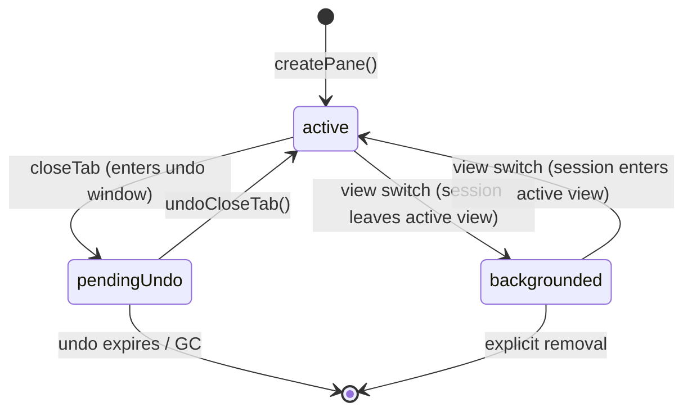
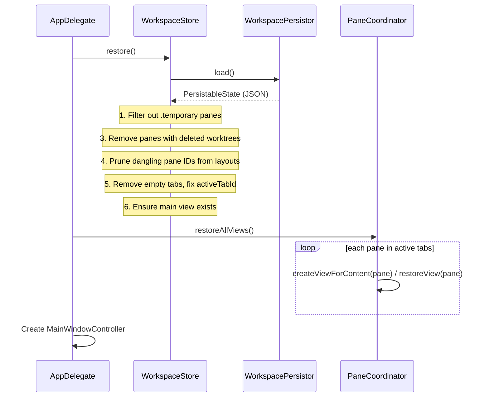

# Session Lifecycle Architecture

## TL;DR

A pane's identity (`UUID`) is stable across its entire lifecycle — creation, layout changes, view switches, close/undo, persistence, and restore. `WorkspaceStore` owns pane records. `SessionRuntime` tracks runtime health. `PaneCoordinator` bridges panes to surfaces. Panes can be undone via a `CloseEntry` stack. The zmx backend provides persistence across app restarts.

---

## Session Identity

A single `paneId: UUID` is the identity used across **all** layers:

| Layer | Uses paneId for |
|-------|--------------------|
| `WorkspaceStore` | Pane record ownership |
| `Layout` / `Tab` / `ViewDefinition` | Leaf references in split trees |
| `ViewRegistry` | paneId → live NSView mapping |
| `SurfaceManager` | `SurfaceMetadata.paneId` — join key to pane |
| `SessionRuntime` | Runtime status tracking |
| `ZmxBackend` | Part of deterministic zmx session name |

## Session Properties

Every pane carries metadata that determines its behavior:

```
Pane
├── id: UUID                    ← immutable primary key
├── content: PaneContent        ← .terminal/.webview/.codeViewer/.bridgePanel
├── metadata: PaneMetadata      ← title/source/cwd/tags
├── kind: PaneKind              ← .layout or .drawerChild
└── residency: SessionResidency ← .active/.pendingUndo/.backgrounded
```

---

## Session Lifecycle States

### Residency (Persisted)

`SessionResidency` tracks where a session lives in the application lifecycle. This prevents false-positive orphan detection — a session in `pendingUndo` is not an orphan.



### Runtime Status (Not Persisted)

`SessionRuntimeStatus` tracks the live backend state. Created fresh on each app launch.


| Status | Meaning |
|--------|---------|
| `.initializing` | Session created, backend not yet ready |
| `.running` | Backend is running and healthy |
| `.exited` | Backend process has exited |
| `.unhealthy` | Health check failed, session may be stale. Terminal until backend exits. |

---

## Terminal Creation Flow


---

## Close & Undo Flow

### Close Tab

1. `PaneCoordinator.executeCloseTab(tabId)`:
   - `store.snapshotForClose(tabId)` → `TabCloseSnapshot` (tab, panes, tabIndex)
   - Push to `undoStack` (LIFO, max 10 entries)
   - For each pane in the tab: `coordinator.teardownView(paneId)`
     - `ViewRegistry.unregister(paneId)`
     - `SurfaceManager.detach(surfaceId, reason: .close)` → surface enters SurfaceManager undo stack with TTL (5 min)
   - `store.removeTab(tabId)` — panes remain in `store.panes` (not deleted)
   - `expireOldUndoEntries()` — GC entries beyond max, remove orphaned sessions

### Undo Close Tab (`Cmd+Shift+T`)

2. `PaneCoordinator.undoCloseTab()`:
   - Pop `WorkspaceStore.CloseEntry` from undo stack
   - `store.restoreFromSnapshot(snapshot)` — re-insert tab at original position
   - For each pane in **reversed** order (matching SurfaceManager LIFO):
     - `coordinator.restoreView(session, worktree, repo)`
     - `SurfaceManager.undoClose()` → pop surface from undo stack
     - Verify `metadata.paneId` matches (multi-pane safety)
     - Reattach surface (no recreation)

### Close Pane (With Undo)

`executeClosePane(tabId, paneId)`:
- `store.snapshotForPaneClose(paneId, inTab: tabId)` creates a pane-level undo snapshot
- Push `.pane(PaneCloseSnapshot)` to `undoStack`
- `coordinator.teardownView(paneId)` detaches/destroys runtime view state
- `store.removePaneFromLayout(paneId, inTab: tabId)`; if last pane, close escalates to tab-close path
- Undo via `undoCloseTab()` restores the pane snapshot when its tab/parent context is still valid

---

## App Launch Restore



**Restore filtering details:**
- **Temporary filtering**: Panes with `lifetime == .temporary` are removed
- **Worktree validation**: Panes referencing a `worktreeId` not in any repo's worktrees are removed (worktree was deleted between launches)
- **Layout pruning**: Pane IDs not in the valid pane set are removed from all layout nodes; single-child splits collapse; empty tabs removed
- **Main view guarantee**: If no `.main` view exists, one is created

---

## App Termination

```
AppDelegate.applicationWillTerminate / applicationShouldTerminate
  └── WorkspaceStore.flush()
        ├── Cancel pending debounced save
        ├── Filter temporary sessions from output
        ├── Prune layouts in the serialized copy
        └── Write JSON to disk immediately
```

---

## Persistence

State is persisted via `WorkspacePersistor` as JSON. See [Component Architecture — Persistence](component_architecture.md#5-persistence) for the full write strategy, filtering, and schema details.

Key points:
- All mutations debounced at 500ms via `markDirty()`
- `flush()` on termination for immediate write
- Temporary sessions never persisted
- Window frame saved only on quit

---

## zmx Session Persistence

The zmx backend provides session persistence across app restarts. When enabled, terminal sessions survive app crashes — the user sees only a Ghostty terminal surface while zmx preserves the PTY and scrollback in the background via raw byte passthrough daemons.

For the startup sequencing details (deferred attach, geometry readiness, and test coverage), see [Zmx Restore and Sizing](zmx_restore_and_sizing.md).

### Architecture

zmx is a ~1000 LOC Zig tool that provides raw byte passthrough with zero terminal emulation. It uses libghostty-vt for state tracking, meaning `TERM=xterm-ghostty` flows through natively:
- **No config file** needed
- **No terminal emulation layer** (no keyboard/mouse protocol conflicts)
- **No custom terminfo** needed (xterm-ghostty works natively)
- One daemon per session (no shared server)

### ZMX_DIR Isolation

All zmx calls use `ZMX_DIR=~/.agentstudio/zmx/` to isolate Agent Studio sessions from any user-owned zmx sessions.

- Destroy/list/health paths pass `ZMX_DIR` via process environment.
- Attach path passes `ZMX_DIR` through Ghostty surface environment variables.

### zmx CLI Commands

| Command | Purpose |
|---------|---------|
| `zmx attach <name> <cmd...>` | Attach to (or create) a session with the given name |
| `zmx kill <name>` | Kill a session by name |
| `zmx list` | List all active sessions (tab-delimited key=value pairs) |

### Testing

The zmx path is covered by layered tests:

1. unit tests for backend command/session behavior,
2. integration tests against a real zmx binary with isolated `ZMX_DIR`,
3. end-to-end tests for full lifecycle and backend recreation restore semantics.

### zmx Binary Resolution

The zmx binary is resolved via a fallback chain:
1. **Bundled binary**: `Contents/MacOS/zmx` (same directory as app executable)
2. **Well-known PATH locations**: `/opt/homebrew/bin/zmx`, `/usr/local/bin/zmx`
3. **`which zmx`** fallback
4. If none found: fall back to ephemeral `.ghostty` provider (no persistence)

### Session ID Format

```
agentstudio--<repo16hex>--<worktree16hex>--<pane16hex>
            |              |                |
            |              |                +-- First 16 hex chars of pane UUID
            |              +-- StableKey: SHA-256 of worktree path (16 hex)
            +-- StableKey: SHA-256 of repo path (16 hex)

Length: 65 characters (fixed)
```

Generated by `ZmxBackend.sessionId(repoStableKey:worktreeStableKey:paneId:)`. Deterministic — same repo path + worktree path + pane UUID triple always produces the same session ID.

### Orphan Cleanup

On app launch, `AppDelegate.cleanupOrphanZmxSessions()` discovers zmx daemons with `agentstudio--` prefix that are not tracked by any persisted session, and kills them. This prevents stale daemons from accumulating across app restarts.

---

## SessionStatus State Machine (Dormant)

A full 7-state machine exists in `Models/StateMachine/SessionStatus.swift` for future integration with zmx backend health monitoring. It is **not yet wired** into `SessionRuntime` (which uses the simpler `SessionRuntimeStatus` enum above).


**States:** `unknown`, `verifying`, `alive`, `dead`, `missing`, `recovering`, `failed(reason)`

**Effects:** Each transition can trigger effects (e.g., `checkSocket`, `createSession`, `scheduleHealthCheck`, `notifyAlive`, `notifyDead`) that are executed by the `Machine<SessionStatus>` effect handler.

---

## Key Files

| File | Role |
|------|------|
| `Core/Stores/WorkspaceStore.swift` | Atomic store — workspace structure (panes, tabs, layouts, persistence) |
| `Core/Stores/WorkspacePersistor.swift` | JSON serialization/deserialization |
| `Core/Stores/SessionRuntime.swift` | Runtime health monitoring and status tracking |
| `App/PaneCoordinator.swift` | Dispatches actions (open, close, split, undo, etc.) and is the sole intermediary for view/surface orchestration |
| `Core/Models/Pane.swift` | Pane identity and content metadata |
| `Core/Models/SessionLifetime.swift` | `.persistent` / `.temporary` enum |
| `Core/Models/SessionResidency.swift` | `.active` / `.pendingUndo` / `.backgrounded` enum |
| `Core/Models/Layout.swift` | Value-type split layout tree (Codable for persistence) |
| `Core/Models/Tab.swift` | Tab with layout and active pane |
| `Core/Models/SessionConfiguration.swift` | Config detection from env vars |
| `Core/Models/StateMachine/SessionStatus.swift` | 7-state machine definition for future zmx health |
| `Infrastructure/StateMachine/StateMachine.swift` | Generic state machine with effect handling |
| `Infrastructure/ProcessExecutor.swift` | Protocol + `DefaultProcessExecutor` for CLI execution |
| `Core/Stores/ZmxBackend.swift` | zmx CLI wrapper — session ID gen, create/destroy/healthCheck |
| `Features/Terminal/Views/AgentStudioTerminalView.swift` | Terminal view (displays surfaces, does not own them) |
| `App/AppDelegate.swift` | Launch flow — restore workspace, create window |

## Related Documentation

- **[Architecture Overview](README.md)** — System overview and document index
- **[Component Architecture](component_architecture.md)** — Data model, service layer, data flow, persistence
- **[Surface Architecture](ghostty_surface_architecture.md)** — Surface ownership, state machine, undo close, health monitoring
- **[App Architecture](appkit_swiftui_architecture.md)** — AppKit + SwiftUI hybrid, lifecycle management
