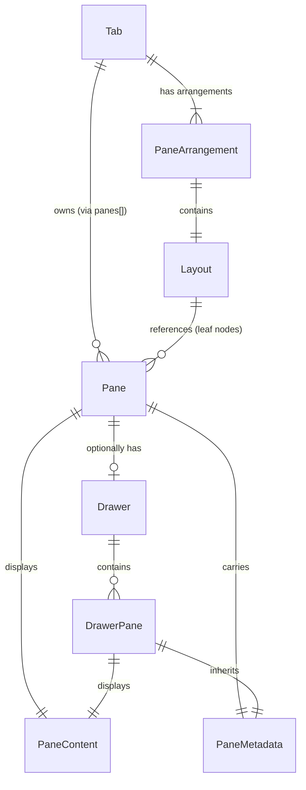
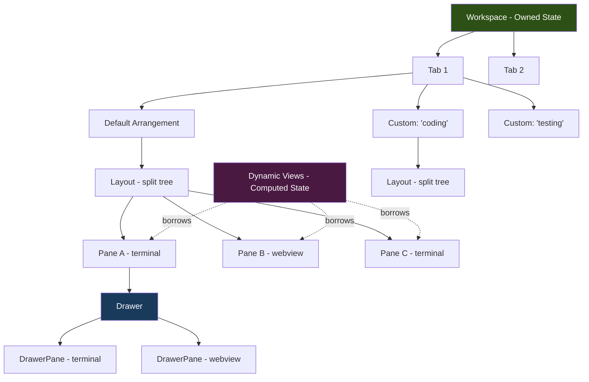
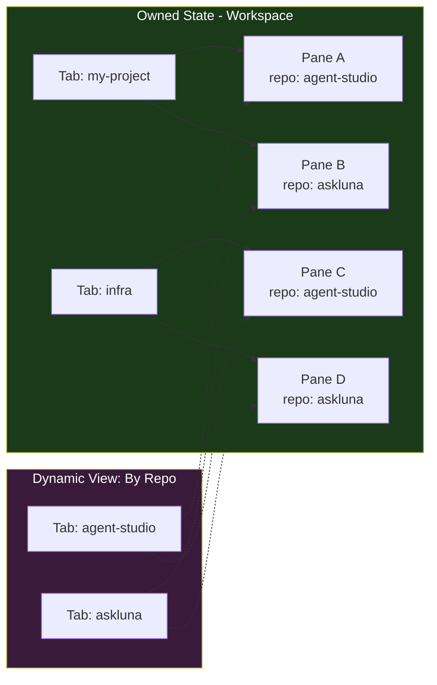
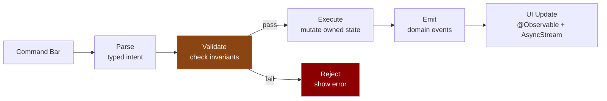
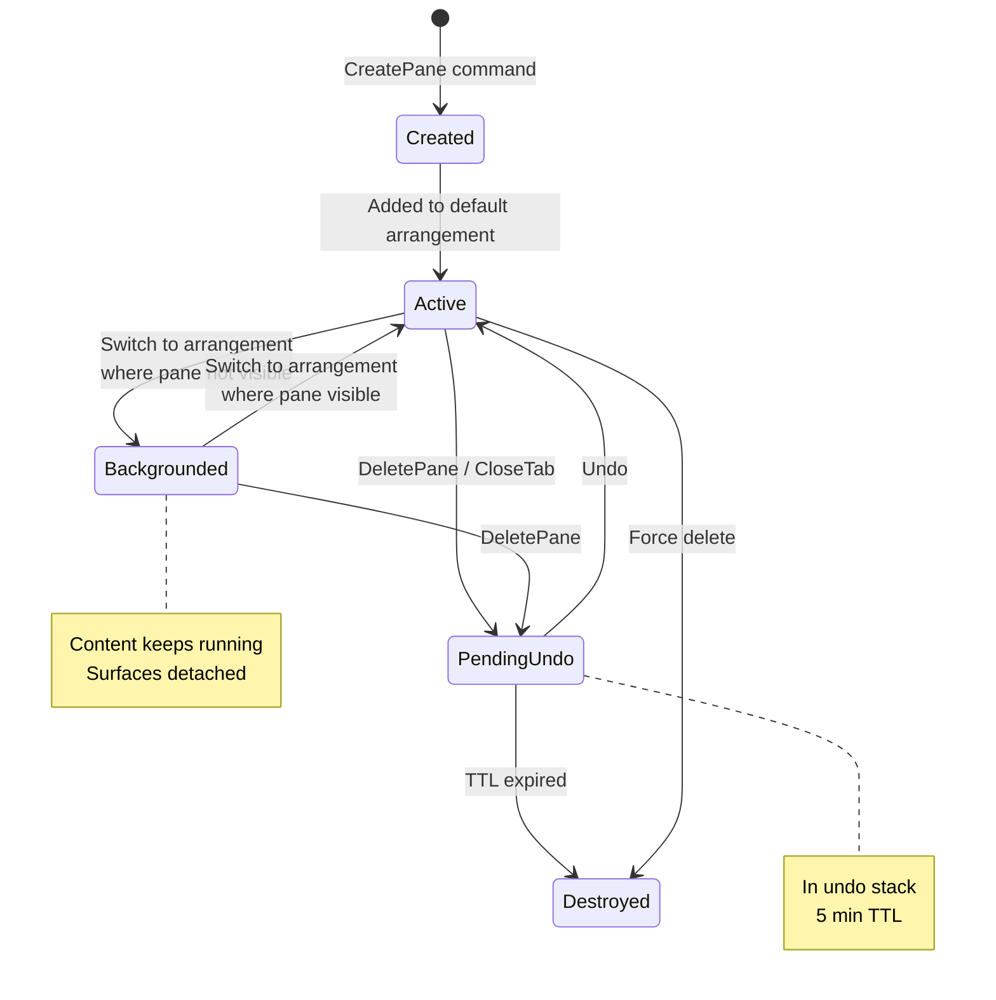
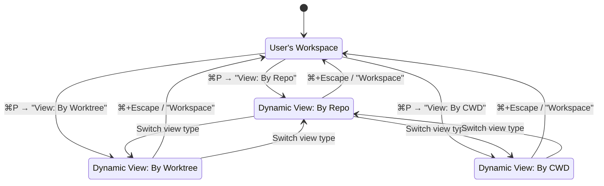

# Window System Design

> Agent Studio — Dynamic Window System Architecture

See [JTBD & Requirements](jtbd_and_requirements.md) for the motivation, pain points, and requirements this design addresses.

---

## Design Overview

The window system has **three layers of organization**:

1. **User's Workspace** — manually arranged tabs with pane arrangements (persistent, user-controlled)
2. **Dynamic Views** — computed lenses that group panes by facet across all tabs (ephemeral, system-arranged)
3. **Pane Drawers** — contextual drawer panes attached to individual panes (persistent, per-pane)

The user's workspace is always the home base. Dynamic views are excursions. Pane drawers are local expansions. The user can always return to their workspace.

### Pane Context Model

Every pane carries context that determines its identity and behavior. This context flows from the project model down to the terminal:

```
Pane Context Chain:
  Repo (git repository on disk)
    └── Worktree (branch checkout — main, feature-x, etc.)
          └── Pane (terminal / webview / code viewer)
                ├── CWD (live working directory, propagated from shell)
                ├── Parent Folder (auto-detected from repo path)
                └── Drawer Panes (inherit context from parent pane)
```

**Context properties on every pane:**

| Property | Source | Example |
|----------|--------|---------|
| `repoId` | From `TerminalSource.worktree` | UUID of "agent-studio" repo |
| `worktreeId` | From `TerminalSource.worktree` | UUID of "feature-x" worktree |
| `cwd` | Live from shell (propagated) | `~/dev/agent-studio/src` |
| Parent folder | Auto-detected from repo path | `~/dev/agent-studio/` |

**Floating terminals** (`TerminalSource.floating`) have no repo or worktree — just a working directory and optional title. They are standalone panes not tied to any project.

**Tab-pane relationship:**
- A tab is a container — it does not inherently belong to a repo
- A tab's identity comes from its panes' contexts
- A tab with all panes from one repo is effectively "that repo's tab"
- A tab can contain panes from different repos (user's choice)
- Dynamic views group panes by context (repo, worktree, parent folder) regardless of which tab they're in

**New tab creation:**
- From sidebar: creates a tab with a pane tied to the selected worktree/repo
- From `+` button: clones the active pane's worktree/repo context into a new tab
- Floating: creates a standalone pane with just a working directory

```
Workspace (user's, persistent)
  ├── Tab "my-project"
  │   ├── Default Pane Arrangement (all panes)
  │   ├── Custom: "coding" (subset)
  │   └── Custom: "testing" (subset)
  │   Each pane:
  │     ├── Content (terminal / webview / code viewer)
  │     └── Drawer (drawer panes — any content type)
  │
  └── Tab "infra"
      ├── Default Pane Arrangement
      └── Custom: "monitoring" (subset)

Dynamic Views (computed, ephemeral — generates tabs)
  "By Repo" view:
    ├── Tab: "agent-studio"       ← auto-generated, one tab per repo
    │   └── Auto-tiled panes
    ├── Tab: "askluna-backend"
    │   └── Auto-tiled panes
    └── Tab: "infra-tools"
        └── Auto-tiled panes

  "By Worktree" view:
    ├── Tab: "main"               ← auto-generated, one tab per worktree
    ├── Tab: "feature-x"
    └── Tab: "hotfix-y"

  "By Parent Folder" view:
    ├── Tab: "~/dev/askluna"      ← auto-generated, one tab per parent folder
    └── Tab: "~/dev/agent-studio"
```

---

## Platform Architecture

**AppKit for structure, SwiftUI for all UI and layouts.** AppKit owns window lifecycle, toolbar, responder chain, and `NSHostingView` bridges. SwiftUI renders everything visual: tab bar, arrangement bar, split layouts, pane controls, drawer.

| AppKit | SwiftUI |
|--------|---------|
| `NSWindow`, `NSToolbar`, `NSViewController` | Tab bar, arrangement bar |
| Responder chain, key handling | Split layout, pane rendering |
| `NSHostingView` / `NSHostingController` bridge | Pane overlay controls, drawer UI |
| Surface management (Ghostty `NSView`) | All visual content and animations |

One command system, multiple trigger surfaces. Every operation dispatches `PaneAction` through `PaneCoordinator`. All UI surfaces are entry points to the same pipeline.

---

## State Architecture

### Owned State (persisted)

All user-created entities with stable identity. Mutated only through transactional commands.

- Workspace tabs
- Panes (with content and metadata)
- Pane arrangements (default + custom per tab)
- Drawer state (drawer panes per pane)

### Transient State (not persisted, TTL-managed)

Recoverable entities that exist temporarily outside normal ownership.

- **Orphaned pane pool**: Panes promoted from DrawerPanes when their parent is deleted. TTL of 5 minutes. User can claim them into a tab or let them expire. This preserves the invariant that every DrawerPane always has a parent — when the parent is deleted, drawer panes become regular Panes in this pool.

### Computed State (ephemeral, derived)

Read-only projections recomputed from owned state. Never persisted. Cannot mutate owned state.

- Dynamic view tabs and layouts
- Facet indexes (repo → panes, worktree → panes, etc.)
- Command bar search results and MRU

This separation ensures dynamic views can never accidentally become owners of panes.

---

## Entity Model

### Core Entities

```
Pane {
  id: UUID
  content: PaneContent                 // what this pane displays
  metadata: PaneMetadata               // context: CWD, repo, worktree, tags
  drawer: Drawer?                      // optional child panes (nil on DrawerPanes)
}

DrawerPane {
  id: UUID
  content: PaneContent                 // same content types as Pane
  metadata: PaneMetadata               // inherits context from parent Pane
}

Drawer {
  panes: [DrawerPane]                  // child panes in this drawer
  activeDrawerPaneId: UUID?            // which drawer pane is expanded
  isExpanded: Bool                     // collapsed to icon bar or fully hidden
}
```

### Content Types (shared by Pane and DrawerPane)

```
PaneContent =
  | .terminal(TerminalState)           // Ghostty surface, zmx backend
  | .webview(WebviewState)             // URL, navigation state
  | .codeViewer(CodeViewerState)       // file path, scroll position
  | .future(...)                       // extensible

TerminalState {
  surfaceId: UUID?                     // Ghostty surface reference
  provider: .ghostty | .zmx           // session backend
  lifetime: .persistent | .temporary
}

WebviewState {
  url: URL
  // navigation history, zoom, etc.
}

CodeViewerState {
  filePath: String
  // scroll position, highlights, etc.
}
```

### Metadata (shared by Pane and DrawerPane)

```
PaneMetadata {
  source: .worktree(id, repoId) | .floating(dir, title)
  cwd: String                          // live, propagated from shell
  agentType: AgentType?                // agent running in this pane
  tags: [String]                       // user or system labels for grouping
}
```

### Structural Entities

```
Tab {
  id: UUID
  name: String
  panes: [UUID]                        // all Pane IDs in this tab
  arrangements: [PaneArrangement]
  activeArrangementId: UUID
  activePaneId: UUID?                  // which pane has focus
}

PaneArrangement {
  id: UUID
  name: String
  isDefault: Bool                      // exactly one per tab
  layout: Layout                       // split tree of Pane IDs
  visiblePaneIds: Set<UUID>            // subset of tab's panes
}
```

### Why Two Types (Pane vs DrawerPane)

The nesting constraint — "drawer panes cannot have their own drawers" — is **enforced by construction**. `DrawerPane` has no `drawer` field. The compiler prevents nesting, eliminating a class of runtime invariant violations.

Both types share `PaneContent` and `PaneMetadata` because they hold the same kinds of content with the same context. They differ only in structural capability: Panes participate in layouts and can have drawers. DrawerPanes cannot.

| Entity | In layout tree? | Can have drawer? | Can have children? |
|--------|----------------|-----------------|-------------------|
| **Pane** | Yes | Yes | Yes (via Drawer) |
| **DrawerPane** | No | No | No |

---

## Concept 1: Pane

### Definition
The primary content container. Appears in layout trees and pane arrangements. Can optionally have a drawer containing child DrawerPanes.

### Content Types
| Type | Description | Example |
|------|-------------|---------|
| Terminal | Ghostty surface | Agent session, shell |
| Webview | Embedded web content | React dev server, diff viewer, PR status |
| Code Viewer | Source code display | File review, code annotations |
| Future | Extensible | Logs, metrics, etc. |

### Rules
- A pane belongs to exactly one tab
- A pane cannot exist in two tabs simultaneously
- A pane cannot exist without a tab
- Content type is immutable after creation
- Only panes (not drawer panes) appear in layout trees and arrangements

---

## Concept 2: Pane Arrangement

### Definition
A named layout configuration within a tab. Defines which panes are visible and how they are tiled.

### Types

**Default Pane Arrangement**
- Exactly one per tab
- Contains ALL panes in the tab
- Auto-updated when panes are created or deleted
- Cannot be deleted
- The source of truth for "what panes exist in this tab"

**Custom Pane Arrangement**
- User-created
- A subset of the default arrangement's panes
- User-defined tiling (split tree)
- Can be created, edited, renamed, deleted

### Rules
- New panes always go to the default pane arrangement (and current active arrangement)
- Custom arrangements reference panes from the default set only
- Deleting a pane from default removes it from all custom arrangements
- Panes not in the active arrangement remain running (backgrounded)
- Switching arrangements changes visibility and tiling; panes keep running

### Data Model

```
Tab {
  id: UUID
  name: String
  panes: [UUID]                        // all Pane IDs in this tab
  arrangements: [PaneArrangement]
  activeArrangementId: UUID
  activePaneId: UUID?
}

PaneArrangement {
  id: UUID
  name: String
  isDefault: Bool                      // exactly one per tab
  layout: Layout                       // split tree of Pane IDs
  visiblePaneIds: Set<UUID>            // subset of tab's panes
}
```

For default: `visiblePaneIds == tab.panes` (always)
For custom: `visiblePaneIds ⊆ tab.panes`

### Operations
| Operation | Via | Effect |
|-----------|-----|--------|
| Switch arrangement | Arrangement bar, pane panel, command bar | Change active arrangement, show/hide panes |
| Create custom | Arrangement bar [+], pane panel, command bar | Snapshot visible panes + tiling |
| Edit custom | Pane panel, command bar | Show/hide panes, rearrange tiling |
| Delete custom | Arrangement bar context menu, command bar | Remove arrangement, switch to default |
| Rename | Arrangement bar context menu, command bar | Update name |

---

## Concept 3: Drawer

### Definition
A collapsible horizontal panel below a pane that holds DrawerPanes. DrawerPanes can hold any content type (terminal, webview, code viewer) and inherit context from their parent pane.

### Visual Structure
```
┌─────────────────────────────────┐
│  Pane content                   │
│  (terminal / webview / etc)     │
│                                 │
├─────────────────────────────────┤
│ [dp1] [dp2] [dp3] [+]          │  ← icon bar (drawer panes)
│ ┌─────────────────────────────┐ │
│ │ Active drawer pane content  │ │  ← selected drawer pane expanded
│ │ (terminal / webview / etc)  │ │
│ └─────────────────────────────┘ │
└─────────────────────────────────┘
```

### Properties
- **Parent pane**: The pane this drawer is attached to
- **Context inheritance**: DrawerPanes inherit CWD, worktree, repo from parent pane
- **Icon bar**: Always visible at the bottom of every pane (not hover-gated). Shows drawer pane icons, click to switch.
- **Collapsible panel**: Slides up from icon bar when expanded. Overlays terminal content (no terminal resize).
- **Navigable**: Keyboard and command bar accessible
- **Any content type**: DrawerPanes can be terminals, webviews, code viewers — same as Panes

### Rules
- Drawer can only exist attached to a parent Pane
- DrawerPanes cannot have their own drawers (enforced by type — no `drawer` field)
- Parent pane deletion cascades to drawer panes (backgrounded)
- Drawer state (which drawer panes, collapsed/expanded) persists with the pane

### Operations
| Operation | Via | Effect |
|-----------|-----|--------|
| Add drawer pane | Command bar or icon bar [+] | Create DrawerPane in drawer |
| Switch drawer pane | Click icon or keyboard | Show different drawer pane |
| Collapse/expand | Click or keyboard | Toggle drawer visibility |
| Close drawer pane | Command bar or icon | Remove DrawerPane from drawer |
| Navigate to | Command bar | Focus a specific drawer pane |

---

## Concept 4: Tab

### Definition
A named group of panes with switchable pane arrangements.

### Properties
- **Panes**: The full set of Pane IDs in this tab
- **Arrangements**: One default + zero or more custom pane arrangements
- **Active arrangement**: Which arrangement is currently displayed
- **Active pane**: Which pane has focus

### Rules
- A tab must have at least one pane
- A tab always has exactly one default pane arrangement
- New panes are added to the default arrangement and the current active arrangement
- Closing the last pane closes the tab (with undo)

### Operations
| Operation | Via | Effect |
|-----------|-----|--------|
| Create pane | Command bar | New pane added to default arrangement |
| Delete pane | Command bar | Removed from default and all custom arrangements; drawer panes cascaded |
| Receive pane | Pane movement | Pane added to default arrangement |
| Send pane | Pane movement | Pane removed from default and all customs |
| Switch arrangement | Command bar | Change which arrangement is visible |
| Close tab | Command bar / shortcut | Close tab with undo support |
| Reorder | Drag in tab bar | Change tab position |

---

## Concept 5: Dynamic View

### Definition
A computed, read-only lens that shows panes from across all tabs, grouped by a facet. Each dynamic view type **generates its own tab bar** where each tab corresponds to one group (one repo, one worktree, one parent folder, etc.). Pane layouts within each tab are auto-tiled by the system.

### View Types

Each dynamic view type slices all workspace panes differently:

| View Type | Each tab = | Example |
|-----------|-----------|---------|
| **By Repo** | One repository | Tab "agent-studio", Tab "askluna-backend" |
| **By Worktree** | One worktree | Tab "main", Tab "feature-x", Tab "hotfix-y" |
| **By CWD** | One working directory | Tab "~/dev/myapp", Tab "~/dev/infra" |
| **By Agent Type** | One agent type | Tab "Claude Code", Tab "Codex", Tab "aider" |
| **By Parent Folder** | One parent directory of repos | Tab "~/dev/askluna/", Tab "~/dev/agent-studio/" |
| **By Tag** (future) | One tag value | Tab "frontend", Tab "backend", Tab "infra" |

### Structure

```
Dynamic View (type: By Repo)
  ├── Tab: "agent-studio"          ← auto-generated tab
  │   └── [pane A | pane B]        ← auto-tiled layout
  ├── Tab: "askluna-backend"
  │   └── [pane C | pane D | pane E]
  └── Tab: "infra-tools"
      └── [pane F]

Dynamic View (type: By Worktree)
  ├── Tab: "main"
  │   └── [pane A | pane C | pane F]
  ├── Tab: "feature-x"
  │   └── [pane B | pane D]
  └── Tab: "hotfix-y"
      └── [pane E]
```

Same panes, different slicing. The panes themselves don't move — the dynamic view borrows them for display.

### Properties
- **View type**: Which facet to group by (repo, worktree, CWD, etc.)
- **Generated tabs**: One tab per group, each with auto-tiled panes
- **Live**: Tabs and pane membership update as pane metadata changes
- **Interactive**: Full terminal interaction (typing, scrolling) within each tab
- **Non-owning**: Panes remain owned by their home tab in the user's workspace
- **Drawer accessible**: Pane drawers are visible and interactive in dynamic views

### Rules
- Dynamic views never own, create, delete, or move panes
- User cannot rearrange the tiling within dynamic view tabs (system-generated only)
- Switching to a dynamic view does not disturb the user's workspace
- Switching back returns to the exact workspace state
- User can switch between dynamic view types while in a dynamic view (e.g., "By Repo" → "By Worktree")
- Recent dynamic view selections are remembered in command bar MRU
- Empty groups (no matching panes) are hidden — no empty tabs shown

### Facet Sources

**Auto-detected (no user setup)**:
- Repo — already tracked per pane via metadata.source
- Worktree — already tracked per pane via metadata.source
- CWD — already propagated from shell
- Agent type — already tracked in metadata
- Parent folder — auto-detected from repo path on disk (e.g., `~/dev/askluna/` groups all repos under it)

**User-configured (requirement now, UX later)**:
- Tags per repo — stored in Agent Studio's own metadata. User assigns tags like "frontend", "backend", "infra" to repos. Panes inherit tags from their repo.
- Tags per pane — direct labels on individual panes for finer control.
- Effective tags = repo tags + pane tags (inheritance rule)
- Tag management UX is a future design concern; the data model must support tags now.

**Recommendation**: Start with auto-detected facets (repo, worktree, CWD, parent folder). Add tag-based grouping when the auto-detected facets prove insufficient. Parent folder is a natural zero-config project grouping.

### Navigation Flow
```
User's Workspace
  ↕ ⌘P → "View: By Repo"                    (switch to dynamic view)
Dynamic View: By Repo
  ├── Browse tabs (one per repo)
  ├── ⌘P → "View: By Worktree"              (switch view type)
  └── ⌘P → "Workspace" or ⌘+Escape          (back to workspace)
User's Workspace (unchanged)
```

Dynamic view selections appear in command bar MRU for quick re-access.

---

## Concept 6: Pane Movement

### Definition
The ability to relocate a pane from one tab to another via the command bar.

### What Moves Together
- The pane itself
- Its drawer (all DrawerPanes)
- Its metadata (CWD, worktree, repo, tags, etc.)

### Rules
- Pane moves from source tab's default arrangement → target tab's default arrangement
- Pane is removed from all custom arrangements in the source tab
- Cannot move to a dynamic view (dynamic views don't own panes)
- Cannot clone — pane exists in exactly one tab at a time
- Cannot move a DrawerPane independently — it moves only with its parent pane
- Movement is atomic: pane + drawer panes move as a unit

### Flow
```
⌘P → "Move pane to Tab: infra"
  1. Remove pane from source tab's default arrangement
  2. Remove pane from source tab's custom arrangements
  3. Add pane to target tab's default arrangement
  4. Drawer (with all DrawerPanes) moves with pane
```

---

## Concept 7: Command Bar (extended)

### Definition
The central interaction point for all window system operations. All actions route through the command pipeline: **Parse → Validate (invariants) → Execute (state mutation) → Emit (domain events)**.

### New Capabilities

| Category | Commands |
|----------|----------|
| Pane Arrangements | Switch arrangement, create custom, edit, delete, rename |
| Dynamic Views | Open by facet, recent queries (MRU), back to workspace, switch view type |
| Pane Movement | Move pane to tab |
| Drawer | Add drawer pane, navigate to drawer pane, collapse/expand |
| Pane Content | Create terminal pane, create webview pane, create code viewer pane |

### Principles
- Command bar is always the primary interaction method
- Keybindings are added later as shortcuts to existing command bar actions
- Recent dynamic view queries appear in MRU for fast re-access
- All commands are typed intents validated against invariants before execution
- Commands that mutate multiple entities are transactional (atomic success or rollback)

---

## Concept 8: UI Controls Layer

### Definition

Multiple UI surfaces that trigger operations through the same `PaneAction` → `PaneCoordinator` pipeline. Every control dispatches typed actions — the UI is just a trigger surface.

### Trigger Surface Matrix

| Trigger | Surface | Pattern |
|---|---|---|
| Command bar (Cmd+P) | `CommandBarDataSource` → `CommandDispatcher` | Text search → action |
| Keyboard shortcut | Menu item → `PaneAction` | Direct dispatch |
| Right-click context menu | Tab context menu → `PaneAction` | Direct dispatch |
| Arrangement button | Floating button under active tab → `PaneAction` | Click → action |
| Pane management panel | SwiftUI popover from arrangement button → `PaneAction` | Click → action |
| Pane overlay controls | SwiftUI overlays on pane → `PaneAction` | Hover → click → action |
| Drawer icon bar | SwiftUI bar at pane bottom → `PaneAction` | Click → action |

### Edit Mode

A window-level toggle that enables pane manipulation controls. When off, panes show clean content with no distractions. When on, hover reveals controls for rearranging, splitting, minimizing, and closing panes.

- Stored in `ManagementModeMonitor.shared` — singleton `@Observable` with `private(set) var isActive: Bool`
- Toggled via toolbar button (separate button group, left of "Add Repo") or keyboard shortcut
- Icon: `slider.horizontal.3`, highlighted when active

**What edit mode gates:**

| Control | Visible When | Position |
|---------|-------------|----------|
| Minimize button | editMode + hover + isSplit | Top-left of pane |
| Close button | editMode + hover + isSplit | Top-left of pane (next to minimize) |
| Quarter-moon split button | editMode + hover | Top-right of pane |
| Drag zone | editMode | Center of pane (~28% height overlay) |
| Hover border | editMode + hover + isSplit | Pane outline |

**What is NOT edit-mode gated:**

| Control | Always Visible When |
|---------|-------------------|
| Collapsed pane bar | Pane is minimized |
| Arrangement button | Always (left side of tab bar) |
| Drawer bar | Always (bottom of every pane, even when empty) |
| Drawer panel | Drawer is expanded |

### Pane Overlay Controls

Controls overlaid on pane content when edit mode is active.

**Minimize + Close Buttons (Top-Left)**

```
┌──[—][✕]────────────────────────────────┐
│                                         │
│            Terminal content              │
│                                         │
└─────────────────────────────────────────┘
```

- Visibility: `editMode && isHovered && isSplit`
- Icons: `minus.circle.fill` (minimize), `xmark.circle.fill` (close)
- Size: 16pt, dark circle background for contrast
- Actions: `.minimizePane` / `.closePane`

**Quarter-Moon Split Button (Top-Right)**

```
┌────────────────────────────────────[+]──┐
│                                         │
│            Terminal content              │
│                                         │
└─────────────────────────────────────────┘
```

- Visibility: `editMode && isHovered`
- Shape: Half-rounded pill (flat on right edge, rounded on left)
- Icon: `+` (10pt bold)
- Action: `.insertPane(source: .newTerminal, direction: .right)`

**Drag Zone (Center)**

```
┌─────────────────────────────────────────┐
│                                         │
│  ┌───────────────────────────────────┐  │
│  │                                   │  │  ← semi-transparent overlay zone
│  │            ⠿ (grip icon)          │  │     ~25-30% of pane height
│  │                                   │  │
│  └───────────────────────────────────┘  │
│                                         │
└─────────────────────────────────────────┘
```

- Visibility: `editMode` (always visible in edit mode, not just hover)
- Shape: Full-width overlay zone, ~25-30% of pane height, centered vertically
- Background: Semi-transparent dark (black at 0.15-0.2 opacity)
- Grip icon: Small 6-dot or 3-line grip centered in the zone
- Purpose: Large grab target for drag-to-rearrange between panes/tabs
- Interaction: Entire zone is draggable via `Transferable`

### Collapsed Pane Bar

When a pane is minimized, it collapses to a narrow bar. Not gated on edit mode — the minimized state persists.

```
┌──────┐
│  ⊕   │  ← expand button (top)
│  ☰   │  ← hamburger menu (expand, close)
│      │
│  m   │
│  a   │  ← sideways text (bottom-to-top)
│  i   │     .rotationEffect(Angle(degrees: -90))
│  n   │
│      │
└──────┘
```

- Width: 30px (horizontal splits) / Height: 30px (vertical splits)
- Click body: expands the pane (dispatches `.expandPane`)
- Hamburger menu: Expand, Close options
- Minimize state: `minimizedPaneIds: Set<UUID>` on Tab (transient, not persisted)

### Tab Bar Layout

Ghostty-style tab bar with equal-width tabs that fill available space.

```
┌─────────────────────────────────────────────────────────────┐
│ [⊞]  [  tab1  ⌘1  ]  [  tab2  ⌘2  ]  [  tab3  ⌘3  ]  [+] │
│  ^                                                       ^   │
│  arrangement                                     new tab     │
└─────────────────────────────────────────────────────────────┘
```

**Tab sizing:** Tabs fill equally, max 400pt, min 220pt. When tabs would shrink below 220pt, overflow scroll kicks in with scroll arrows and a tab count dropdown.

**Fixed controls:**
- **Arrangement button** (left): `rectangle.3.group` icon, always visible. Click opens the active tab's arrangement panel popover.
- **New tab button** (right): `+` icon, always visible. Creates a new tab cloning the active pane's worktree/repo context.
- **Overflow controls** (right, when scrolling): scroll arrows + tab count badge dropdown.

**Tab pill contents:** Title + keyboard shortcut hint + close button on hover. No icons inside pills.

### Pane Management Panel

A floating panel that drops down from the arrangement button.

```
  [≡ Default] → click → panel slides open
    ┌─────────────────────────────┐
    │  Panes:                     │
    │  ● main          [—]       │  ← visible, [—] to minimize
    │  ○ tests         [+]       │  ← minimized, [+] to restore
    │  ● server        [—]       │
    │  ● logs          [—]       │
    │                             │
    │  Saved:                     │
    │  [default] [coding]        │  ← quick-recall chips
    │                             │
    │  [Save] [Save as...]       │
    └─────────────────────────────┘
```

- Pane list with visibility indicators (● visible, ○ minimized) and toggle buttons
- Arrangement chips for quick switching within the panel
- "Default" always present — restores all panes visible
- Save / Save as: create new arrangement from current visible panes + layout
- Dismiss: click-outside or Escape

### Drawer UI

Slim rounded bar at the bottom of every pane, always visible even when empty. Expandable panel when drawer panes exist.

```
Empty drawer (no panes yet):
┌─────────────────────────────────┐
│  Pane content                   │
│                                 │
│                                 │
├────────────────────────────╮    │
│ [+]                        │    │  ← slim bar (~24px), always visible
╰────────────────────────────╯    │
└─────────────────────────────────┘

Populated drawer:
┌─────────────────────────────────┐
│  Pane content                   │
│                                 │
├────────────────────────────╮    │
│ [dp1] [dp2] [dp3] [+] [▾] │    │  ← drawer bar with pane icons
│ ┌─────────────────────────┐│    │
│ │ Active drawer pane      ││    │  ← expanded panel (when toggled)
│ └─────────────────────────┘│    │
╰────────────────────────────╯    │
└─────────────────────────────────┘
```

- Slim rounded bar (~24px) always visible at bottom of every pane
- When empty: shows only [+] button to create first drawer pane
- When populated: pane icons + [+] + [▾] collapse toggle
- Click icon to switch active drawer pane
- Right-click icon for close
- Panel slides up from bottom, overlays terminal content

---

## Invariants

### By Construction (compiler-enforced)

These invariants are impossible to violate because the type system prevents it:

1. **DrawerPanes cannot have drawers** — `DrawerPane` has no `drawer` field
2. **DrawerPanes cannot appear in layout trees** — `Layout.leaf` takes `Pane.id`, not `DrawerPane.id` (different types)
3. **Only Panes appear in arrangements** — `visiblePaneIds` is `Set<Pane.ID>`

### By Runtime Enforcement (command validation)

These invariants are checked by the command validator before every mutation:

**Pane ownership:**
4. Every Pane has a unique ID across the workspace
5. Every active Pane belongs to exactly one tab (orphaned panes in recoverable pool have no tab)
6. Every DrawerPane belongs to exactly one Pane's drawer (no orphaned DrawerPanes — they are promoted to orphaned Panes on parent deletion)

**Arrangement consistency:**
7. Default arrangement `visiblePaneIds` equals the full tab pane set
8. Custom arrangement `visiblePaneIds` is a subset of default
9. Exactly one default arrangement per tab
10. `activePaneId` references a pane visible in the active arrangement (or nil)

**Drawer rules:**
11. DrawerPanes cannot be moved independently of their parent Pane
12. A DrawerPane's parent Pane must be in the same tab

**Tab rules:**
13. A tab always has at least one Pane (enforced by escalation: deleting the last pane triggers CloseTab, not a validation error)
14. `activeArrangementId` references an arrangement in this tab

**Orphaned pane pool:**
15. Orphaned panes (promoted from DrawerPanes on parent deletion) exist in a workspace-level recoverable pool
16. Orphaned panes have a TTL (5 min) — auto-destroyed if not claimed
17. User can claim orphaned panes into a tab via command bar

**Dynamic view rules:**
18. Dynamic views cannot mutate owned state
19. Dynamic views display tab-owned Panes only (DrawerPanes accessible via drawer UI, orphaned panes not shown)

### Transactional Command Invariants

Multi-entity operations must be atomic. If any step fails, all steps roll back:

| Command | Steps (all-or-nothing) |
|---------|----------------------|
| **DeletePane** | Remove from all arrangements → promote drawer panes to orphaned pool (with TTL) → if tab has 0 panes: escalate to CloseTab |
| **MovePane** | Remove from source arrangements → add to target default → move drawer panes → validate both tabs |
| **CloseTab** | Snapshot for undo → teardown all panes + promote drawer panes to orphaned pool → remove tab |
| **SwitchArrangement** | Validate arrangement exists → hide non-visible panes → show visible panes → update active |

Note on **DeletePane**: The invariant "tab must have ≥1 pane" is maintained by escalation, not by preventing deletion. Deleting the last pane in a tab triggers CloseTab (with undo), which closes the tab entirely. The invariant is never violated because the tab ceases to exist.

---

## Lifecycle Policies

| Scenario | Policy |
|----------|--------|
| Parent pane deleted | DrawerPanes are **promoted to orphaned Panes** in a workspace-level recoverable pool with TTL (5 min). They are no longer DrawerPanes — they become regular Panes without a tab. This preserves invariant 6 (every DrawerPane always has a parent). User can claim orphaned panes via command bar or let them expire. |
| Empty groups in dynamic views | Hidden. No empty tabs shown. |
| Drawers in dynamic views | Visible and accessible. Interacting with a pane in a dynamic view shows its drawer. |
| Dynamic view tab sort order | Alphabetical by group name. Stable and predictable. |
| New pane created | Added to default arrangement AND current active arrangement. |
| Pane backgrounded (not in active arrangement) | Content keeps running. Surfaces detached for resource efficiency. |

---

## Resolved Decisions

| Decision | Resolution |
|----------|------------|
| Pane vs Session identity | Pane is the universal identity. Session/terminal is just one content type (PaneContent). |
| Entity model | Two types: Pane (in layout, can have drawer) and DrawerPane (in drawer, no children). Nesting prevented by construction. |
| Drawer content types | Any PaneContent (terminal, webview, code viewer) — not limited to terminals. |
| Drawer nesting | One level only. DrawerPanes cannot have drawers. Enforced by type system. |
| Dynamic view structure | Generates tabs (one per group), not a single flat layout. |
| Dynamic view navigation | Can switch between view types while in dynamic view (repo → worktree). |
| Parent folder detection | Auto-detected from repo path on disk. |
| Tag management UX | Requirement exists now (data model supports tags); UX designed later. |
| Tag inheritance | Effective tags = repo tags + pane tags. |
| Owned vs computed state | Explicit separation. Dynamic views are computed projections that can never mutate owned state. |
| Command pipeline | Typed intents: Parse → Validate (invariants) → Execute (mutation) → Emit (events). |
| Multi-entity operations | Transactional. Atomic success or full rollback. |
| Custom arrangement editing | Pane management panel allows showing/hiding panes after arrangement creation. |
| UI architecture | AppKit for structure (window, toolbar, responder chain). SwiftUI for all UI and layouts. |
| Edit mode | Window-level toggle gates pane overlay controls. Arrangement bar, drawer icon bar, collapsed bars are always visible. |

## Open Questions

1. **Auto-tiling algorithm for dynamic views**: Equal grid? Most-recently-active gets more space? Does it matter initially?

2. **Drawer pane limit**: Is there a limit on how many DrawerPanes a drawer can hold? Or unlimited with scroll in the icon bar?

3. ~~**Custom arrangement editing**~~: Resolved — pane management panel allows showing/hiding panes in an arrangement after creation.

---

## Diagrams

### Entity Relationship



### Ownership Hierarchy



### Dynamic View Projection



### Command Pipeline



### Pane Lifecycle



### Navigation Flow


