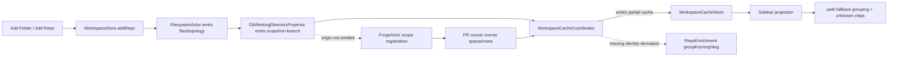
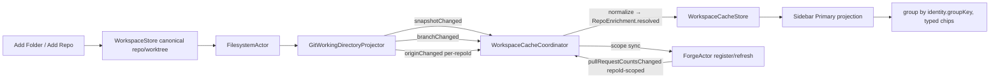
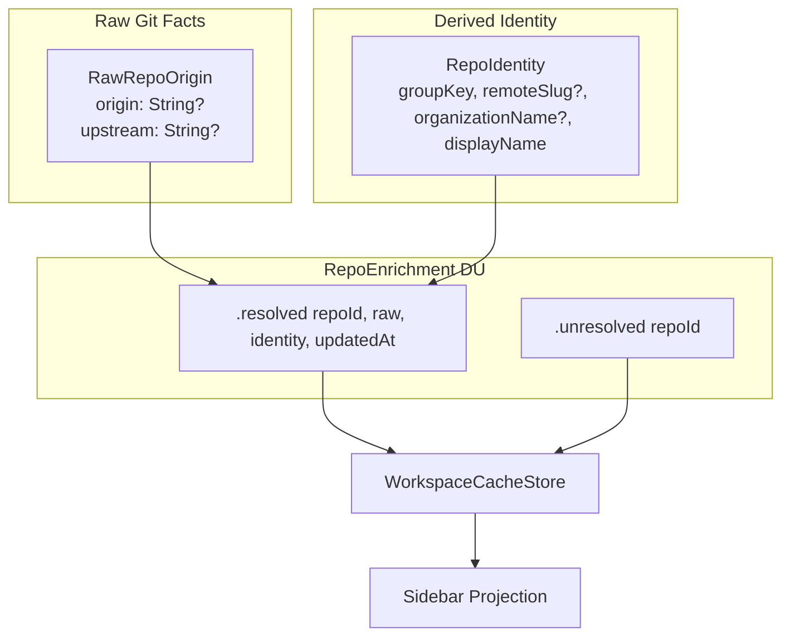

# Primary Sidebar + Forge Dataflow Repair Implementation Plan

> **For Claude:** REQUIRED SUB-SKILL: Use superpowers:executing-plans to implement this plan task-by-task.

**Goal:** Restore a correct event-driven `Primary` sidebar view where repos/worktrees group by shared remote identity and git/forge chips render trustworthy values from cache-backed enrichment.

**Architecture:** Keep canonical workspace state (`WorkspaceStore`) separate from derived identity/status state (`WorkspaceCacheStore`). Make the enrichment chain authoritative: FilesystemActor → GitWorkingDirectoryProjector → WorkspaceCacheCoordinator → ForgeActor scope sync → Forge events → cache → sidebar projection. Replace `RepoEnrichment` struct with a 2-case discriminated union (`unresolved`/`resolved`) that separates raw git facts from derived identity. Origin discovery happens in the projector on worktree registration and `.git/config` changes only (not every filesystem event). Origin is tracked per-repoId to prevent redundant events across worktrees of the same repo.

**Tech Stack:** Swift 6.2, AppKit + SwiftUI, AsyncStream EventBus, @Observable stores, Swift Testing (`Testing`), `mise` test/build tasks.

---

## Design Decisions (validated)

| Decision | Choice | Rationale |
|---|---|---|
| Origin discovery location | GitWorkingDirectoryProjector | Git fact, belongs with other git derivation. No new actors. |
| Origin check frequency | Registration + `.git/config` changes only | Origin changes rarely. Don't waste git calls on every file save. |
| Origin tracking granularity | Per-repoId in projector | Prevents N redundant events for N worktrees of same repo. |
| `RepoEnrichment` type | 2-case discriminated union (`unresolved`/`resolved`) | Type-safe state boundaries. No nullish ambiguity. |
| Identity structure | `raw` (git facts) + `identity` (derived projection) inside `resolved` | Forge reads raw origin. Sidebar reads derived identity. Clean separation. |
| "Local only" | Property of `resolved` case (`raw.origin == nil`) | Not a separate state — checked and found no remote. |
| URL normalizer | Extract existing `extractGitHubRepoSlug` into shared `RemoteIdentityNormalizer` | Single source of truth. `ForgeStatusProvider` delegates to it. |
| PR count mapping | Filter by `repoId` from event | Fix current bug where branch name collisions cross-contaminate across repos. |
| WorktreeEnrichment | Keep current struct design | Not causing bugs. Don't restructure what isn't broken. |
| Grouping strategy enum | Don't add | YAGNI. Just implement primary grouping. Add enum when UI toggle is needed. |

---

## Problem Statement and Evidence

### Symptoms observed
- Sidebar currently groups by local path fallback instead of shared remote identity.
- Newly added folders/repos appear as separate top-level groups even when remotes match.
- PR and git status chips mostly render unknown/placeholder values.

### Root cause trace

**Symptom 1 — path-based grouping:**
1. Sidebar groups by `enrichment?.groupKey ?? "path:..."` (`RepoSidebarContentView.swift:62`)
2. `groupKey` is always nil because coordinator only sets `origin` on `originChanged`, never derives `groupKey`/`slug`/`org`/`displayName` (`WorkspaceCacheCoordinator.swift:145-148`)
3. But `originChanged` never fires because projector doesn't discover or emit origin
4. `GitWorkingTreeStatus` has only `summary` + `branch` — no origin field
5. `git status --porcelain=v1` can't return remote URL

**Symptom 2 — unknown PR chips:**
1. PR counts require `ForgeActor.register(repo:remote:)` which is called on `.originChanged`
2. `.originChanged` never arrives → forge never registers → never fetches → no counts
3. Additionally, `pullRequestCountsChanged` ignores `repoId` (`_`), so branch "main" in repo A could get counts from repo B

**Symptom 3 — add-folder doesn't converge:**
1. AddFolder → `addRepo` → topology → filesystem register → projector emits snapshot/branch (no origin) → partial enrichment → path fallback forever
2. Nowhere in the chain does origin get discovered

---

## Data Flow Diagrams

### Current broken flow



### Target primary flow



### Type contracts



---

## Scope, Non-Goals, and Future Compatibility

### In scope (this plan)
- Fix `Primary` view grouping and chip correctness end-to-end via event/cache pipeline.
- Replace `RepoEnrichment` struct with 2-case discriminated union.
- Extract shared `RemoteIdentityNormalizer` from `ForgeStatusProvider`.
- Fix repo-scoped PR count mapping bug.

### Out of scope (follow-up plan)
- UI for view-mode switching (`By Organization`, `By Folder Path`).
- Additional chip families beyond current PR/git indicators.
- `WorktreeEnrichment` type redesign (current struct is adequate).

---

## Task 1: RepoEnrichment Discriminated Union + RemoteIdentityNormalizer

**Files:**
- Rewrite: `Sources/AgentStudio/Core/Models/RepoEnrichment.swift`
- Create: `Sources/AgentStudio/Core/Models/RemoteIdentityNormalizer.swift`
- Test: `Tests/AgentStudioTests/Core/Models/RepoEnrichmentTests.swift`
- Test: `Tests/AgentStudioTests/Core/Models/RemoteIdentityNormalizerTests.swift`

**Step 1: Write failing tests for RepoEnrichment DU**

```swift
@Suite("RepoEnrichment")
struct RepoEnrichmentTests {
    @Test("unresolved carries repoId only")
    func unresolvedState() {
        let repoId = UUID()
        let enrichment = RepoEnrichment.unresolved(repoId: repoId)
        #expect(enrichment.repoId == repoId)
    }

    @Test("resolved exposes raw origin and derived identity separately")
    func resolvedState() {
        let repoId = UUID()
        let raw = RawRepoOrigin(origin: "git@github.com:org/repo.git", upstream: nil)
        let identity = RepoIdentity(
            groupKey: "remote:org/repo",
            remoteSlug: "org/repo",
            organizationName: "org",
            displayName: "repo"
        )
        let enrichment = RepoEnrichment.resolved(
            repoId: repoId, raw: raw, identity: identity, updatedAt: Date()
        )
        #expect(enrichment.repoId == repoId)
        if case .resolved(_, let r, let id, _) = enrichment {
            #expect(r.origin == "git@github.com:org/repo.git")
            #expect(id.groupKey == "remote:org/repo")
        }
    }

    @Test("resolved with nil origin represents local-only repo")
    func localOnlyRepo() {
        let raw = RawRepoOrigin(origin: nil, upstream: nil)
        let identity = RepoIdentity(
            groupKey: "local:MyProject",
            remoteSlug: nil,
            organizationName: nil,
            displayName: "MyProject"
        )
        let enrichment = RepoEnrichment.resolved(
            repoId: UUID(), raw: raw, identity: identity, updatedAt: Date()
        )
        if case .resolved(_, let r, let id, _) = enrichment {
            #expect(r.origin == nil)
            #expect(id.remoteSlug == nil)
            #expect(id.groupKey == "local:MyProject")
        }
    }

    @Test("Codable round-trip preserves both cases")
    func codableRoundTrip() throws {
        let unresolved = RepoEnrichment.unresolved(repoId: UUID())
        let resolved = RepoEnrichment.resolved(
            repoId: UUID(),
            raw: RawRepoOrigin(origin: "https://github.com/org/repo", upstream: nil),
            identity: RepoIdentity(
                groupKey: "remote:org/repo", remoteSlug: "org/repo",
                organizationName: "org", displayName: "repo"
            ),
            updatedAt: Date()
        )
        let encoder = JSONEncoder()
        let decoder = JSONDecoder()
        let d1 = try encoder.encode(unresolved)
        let d2 = try encoder.encode(resolved)
        #expect(try decoder.decode(RepoEnrichment.self, from: d1) == unresolved)
        #expect(try decoder.decode(RepoEnrichment.self, from: d2) == resolved)
    }
}
```

**Step 2: Write failing normalizer tests**

```swift
@Suite("RemoteIdentityNormalizer")
struct RemoteIdentityNormalizerTests {
    @Test("normalizes github ssh and https to same slug")
    func normalizesGitHubVariants() {
        let ssh = RemoteIdentityNormalizer.normalize("git@github.com:anthropics/claude.git")
        let https = RemoteIdentityNormalizer.normalize("https://github.com/anthropics/claude")
        let sshProto = RemoteIdentityNormalizer.normalize("ssh://git@github.com/anthropics/claude.git")
        #expect(ssh?.remoteSlug == "anthropics/claude")
        #expect(https?.remoteSlug == "anthropics/claude")
        #expect(sshProto?.remoteSlug == "anthropics/claude")
        #expect(ssh?.groupKey == https?.groupKey)
        #expect(ssh?.groupKey == sshProto?.groupKey)
    }

    @Test("extracts organization and display name")
    func extractsOrgAndDisplay() {
        let identity = RemoteIdentityNormalizer.normalize("git@github.com:myorg/my-repo.git")
        #expect(identity?.organizationName == "myorg")
        #expect(identity?.displayName == "my-repo")
    }

    @Test("returns nil for empty or unrecognized remote")
    func returnsNilForBadInput() {
        #expect(RemoteIdentityNormalizer.normalize("") == nil)
        #expect(RemoteIdentityNormalizer.normalize("   ") == nil)
    }

    @Test("handles personal repos without organization")
    func personalRepos() {
        let identity = RemoteIdentityNormalizer.normalize("https://github.com/user/repo")
        #expect(identity?.organizationName == "user")
        #expect(identity?.displayName == "repo")
        #expect(identity?.remoteSlug == "user/repo")
    }

    @Test("extractSlug matches existing ForgeStatusProvider behavior")
    func extractSlugBackwardsCompatible() {
        // These must match GitHubCLIForgeStatusProvider.extractGitHubRepoSlug
        #expect(RemoteIdentityNormalizer.extractSlug("git@github.com:org/repo.git") == "org/repo")
        #expect(RemoteIdentityNormalizer.extractSlug("https://github.com/org/repo") == "org/repo")
        #expect(RemoteIdentityNormalizer.extractSlug("ssh://git@github.com/org/repo.git") == "org/repo")
        #expect(RemoteIdentityNormalizer.extractSlug("http://github.com/org/repo") == "org/repo")
        #expect(RemoteIdentityNormalizer.extractSlug("not-a-url") == nil)
    }
}
```

**Step 3: Run tests and confirm failures**

Run:
```bash
mise run test
```

Expected: FAIL — types don't exist yet.

**Step 4: Implement RepoEnrichment DU and supporting types**

`Sources/AgentStudio/Core/Models/RepoEnrichment.swift`:
```swift
import Foundation

struct RawRepoOrigin: Codable, Sendable, Equatable {
    let origin: String?
    let upstream: String?
}

struct RepoIdentity: Codable, Sendable, Equatable {
    let groupKey: String
    let remoteSlug: String?
    let organizationName: String?
    let displayName: String
}

enum RepoEnrichment: Codable, Sendable, Equatable {
    case unresolved(repoId: UUID)
    case resolved(repoId: UUID, raw: RawRepoOrigin, identity: RepoIdentity, updatedAt: Date)

    var repoId: UUID {
        switch self {
        case .unresolved(let repoId): repoId
        case .resolved(let repoId, _, _, _): repoId
        }
    }
}
```

**Step 5: Implement RemoteIdentityNormalizer**

Extract `extractGitHubRepoSlug` and `stripGitSuffix` from `GitHubCLIForgeStatusProvider` into `RemoteIdentityNormalizer`. Add `normalize(_:)` that returns full `RepoIdentity`. The normalizer is a pure, stateless struct.

`Sources/AgentStudio/Core/Models/RemoteIdentityNormalizer.swift`:
```swift
import Foundation

struct RemoteIdentityNormalizer {
    /// Full identity derivation from a remote URL.
    static func normalize(_ remoteURL: String) -> RepoIdentity? {
        guard let slug = extractSlug(remoteURL) else { return nil }
        let parts = slug.split(separator: "/", maxSplits: 1)
        let org = parts.count > 1 ? String(parts[0]) : nil
        let name = parts.count > 1 ? String(parts[1]) : String(parts[0])
        return RepoIdentity(
            groupKey: "remote:\(slug)",
            remoteSlug: slug,
            organizationName: org,
            displayName: name
        )
    }

    /// Slug extraction — shared with ForgeStatusProvider.
    static func extractSlug(_ remoteURL: String) -> String? {
        let normalized = remoteURL.trimmingCharacters(in: .whitespacesAndNewlines)
        guard !normalized.isEmpty else { return nil }
        let raw: String?
        if normalized.hasPrefix("git@github.com:") {
            raw = String(normalized.dropFirst("git@github.com:".count))
        } else if normalized.hasPrefix("ssh://git@github.com/") {
            raw = String(normalized.dropFirst("ssh://git@github.com/".count))
        } else if normalized.hasPrefix("https://github.com/") {
            raw = String(normalized.dropFirst("https://github.com/".count))
        } else if normalized.hasPrefix("http://github.com/") {
            raw = String(normalized.dropFirst("http://github.com/".count))
        } else {
            raw = nil
        }
        guard let raw else { return nil }
        let trimmed = raw.trimmingCharacters(in: CharacterSet(charactersIn: "/"))
        guard !trimmed.isEmpty else { return nil }
        return trimmed.hasSuffix(".git") ? String(trimmed.dropLast(4)) : trimmed
    }

    /// Build identity for local-only repos (no remote).
    static func localIdentity(repoName: String) -> RepoIdentity {
        RepoIdentity(
            groupKey: "local:\(repoName)",
            remoteSlug: nil,
            organizationName: nil,
            displayName: repoName
        )
    }
}
```

**Step 6: Update ForgeStatusProvider to delegate slug extraction**

In `GitHubCLIForgeStatusProvider`, replace `extractGitHubRepoSlug` with a call to `RemoteIdentityNormalizer.extractSlug`. Delete the private slug methods.

**Step 7: Run tests**

Run:
```bash
mise run test
```

Expected: PASS for new tests. Existing ForgeActor tests still pass (slug behavior unchanged).

**Step 8: Commit**

```bash
git add Sources/AgentStudio/Core/Models/RepoEnrichment.swift \
  Sources/AgentStudio/Core/Models/RemoteIdentityNormalizer.swift \
  Sources/AgentStudio/Core/PaneRuntime/Sources/ForgeActor.swift \
  Tests/AgentStudioTests/Core/Models/RepoEnrichmentTests.swift \
  Tests/AgentStudioTests/Core/Models/RemoteIdentityNormalizerTests.swift
git commit -m "feat(cache): RepoEnrichment DU + shared RemoteIdentityNormalizer"
```

---

## Task 2: Extend Provider and Projector with Origin Discovery

**Files:**
- Modify: `Sources/AgentStudio/Core/PaneRuntime/Sources/GitWorkingTreeStatusProvider.swift`
- Modify: `Sources/AgentStudio/Core/PaneRuntime/Sources/GitWorkingDirectoryProjector.swift`
- Test: `Tests/AgentStudioTests/Core/PaneRuntime/Sources/GitWorkingDirectoryProjectorTests.swift`

**Step 1: Write failing projector tests**

```swift
@Test("projector emits originChanged when remote differs from last known value for repoId")
func emitsOriginChangedOnNewOrigin() async {
    // Arrange: stub provider returns origin "git@github.com:org/repo.git"
    // Act: register worktree, trigger filesystem event
    // Assert: bus receives .worktree(.gitWorkingDirectory(.originChanged(repoId:from:to:)))
}

@Test("projector does NOT re-emit originChanged when origin unchanged across snapshots")
func suppressesDuplicateOrigin() async {
    // Arrange: stub returns same origin twice
    // Act: two filesystem events
    // Assert: only one originChanged event emitted
}

@Test("projector tracks origin per-repoId: two worktrees same repo emit one originChanged")
func originTrackedPerRepo() async {
    // Arrange: two worktrees with same repoId, stub returns same origin for both
    // Act: register both, trigger events
    // Assert: exactly one originChanged for that repoId
}

@Test("projector only re-checks origin when .git/config is in changed paths")
func originOnlyOnGitConfig() async {
    // Arrange: stub returns origin
    // Act: first event (registration) triggers origin check; second event with
    //   paths NOT containing .git/config does NOT re-check origin
    // Assert: provider's origin call count == 1 (only initial)
}

@Test("projector emits originChanged with empty string when no remote configured")
func noRemoteEmitsEmpty() async {
    // Arrange: stub returns nil origin
    // Act: register worktree
    // Assert: originChanged(repoId:, from: "", to: "") emitted
}
```

**Step 2: Run tests and confirm failures**

Run:
```bash
mise run test
```

Expected: FAIL — provider doesn't return origin, projector doesn't emit originChanged.

**Step 3: Extend GitWorkingTreeStatus with origin field**

```swift
struct GitWorkingTreeStatus: Sendable, Equatable {
    let summary: GitWorkingTreeSummary
    let branch: String?
    let origin: String?     // NEW
}
```

**Step 4: Add origin discovery to ShellGitWorkingTreeStatusProvider**

Add a second git call inside `computeStatus`:

```swift
// After git status parsing...
let originResult = try? await processExecutor.execute(
    command: "git",
    args: ["-C", rootPath.path, "config", "--get", "remote.origin.url"],
    cwd: nil,
    environment: nil
)
let origin = originResult?.succeeded == true
    ? originResult?.stdout.trimmingCharacters(in: .whitespacesAndNewlines)
    : nil
return GitWorkingTreeStatus(summary: summary, branch: branch, origin: origin)
```

This is a separate call from `git status`. `git config --get` fails gracefully (exit 1) when no remote is configured — that maps to `origin: nil`.

**Step 5: Add origin tracking per-repoId to projector**

Add to `GitWorkingDirectoryProjector`:
```swift
private var lastKnownOriginByRepoId: [UUID: String] = [:]
```

In `computeAndEmit`, after the existing snapshot/branch logic:
```swift
// Origin tracking — per repoId, not per worktreeId
let currentOrigin = statusSnapshot.origin ?? ""
let previousOrigin = lastKnownOriginByRepoId[changeset.repoId] ?? ""
if currentOrigin != previousOrigin {
    await emitGitWorkingDirectoryEvent(
        worktreeId: changeset.worktreeId,
        repoId: changeset.repoId,
        event: .originChanged(repoId: changeset.repoId, from: previousOrigin, to: currentOrigin)
    )
    lastKnownOriginByRepoId[changeset.repoId] = currentOrigin
}
```

**Step 6: Filter origin re-checks to registration + .git/config**

In `computeAndEmit`, the provider `status(for:)` always returns origin (it's a field on the struct). The optimization: when the filesystem event is NOT a registration and the changed paths don't contain `.git/config`, skip the origin diff check. This is done by checking the changeset:

```swift
// Only re-derive origin when relevant — registration or .git/config change
let shouldCheckOrigin = changeset.paths.isEmpty  // registration (no specific paths)
    || changeset.paths.contains(where: { $0.hasSuffix(".git/config") || $0.hasSuffix("config") })
```

When `shouldCheckOrigin` is false, skip the origin diff block. The provider still returns `origin` (no way to avoid the git call in the current provider design — but see note below), so we simply don't emit from it.

> **Note:** A future optimization could split the provider into `statusOnly(for:)` and `statusWithOrigin(for:)` to avoid the second git call entirely on non-config events. For now, the second git call is cheap (~2ms) and the event suppression prevents downstream waste.

**Step 7: Clean up shutdown**

Add to `shutdown()`:
```swift
lastKnownOriginByRepoId.removeAll(keepingCapacity: false)
```

**Step 8: Update StubGitWorkingTreeStatusProvider**

```swift
struct StubGitWorkingTreeStatusProvider: GitWorkingTreeStatusProvider {
    let handler: @Sendable (URL) async -> GitWorkingTreeStatus?
    // ... existing code, handler now returns GitWorkingTreeStatus with origin field
}
```

**Step 9: Run tests**

Run:
```bash
mise run test
```

Expected: PASS.

**Step 10: Commit**

```bash
git add Sources/AgentStudio/Core/PaneRuntime/Sources/GitWorkingTreeStatusProvider.swift \
  Sources/AgentStudio/Core/PaneRuntime/Sources/GitWorkingDirectoryProjector.swift \
  Tests/AgentStudioTests/Core/PaneRuntime/Sources/GitWorkingDirectoryProjectorTests.swift
git commit -m "feat(projector): discover origin on registration + .git/config changes"
```

---

## Task 3: Coordinator Identity Derivation + Repo-Scoped PR Counts

**Files:**
- Modify: `Sources/AgentStudio/App/WorkspaceCacheCoordinator.swift`
- Modify: `Sources/AgentStudio/Core/Stores/WorkspaceCacheStore.swift`
- Test: `Tests/AgentStudioTests/App/WorkspaceCacheCoordinatorTests.swift`

**Step 1: Write failing coordinator tests**

```swift
@Test("originChanged with valid remote produces resolved enrichment with full identity")
func originChangedDerivesFull Identity() async {
    // Arrange: bus, coordinator, cacheStore
    // Act: post originChanged(repoId: X, from: "", to: "git@github.com:org/repo.git")
    // Assert: cacheStore.repoEnrichmentByRepoId[X] is .resolved with:
    //   identity.groupKey == "remote:org/repo"
    //   identity.remoteSlug == "org/repo"
    //   identity.organizationName == "org"
    //   identity.displayName == "repo"
    //   raw.origin == "git@github.com:org/repo.git"
}

@Test("originChanged with empty string produces resolved local-only enrichment")
func originChangedEmptyProducesLocalOnly() async {
    // Arrange: workspace store has repo at path /Users/foo/MyProject
    // Act: post originChanged(repoId: X, from: "", to: "")
    // Assert: cacheStore enrichment is .resolved with:
    //   raw.origin == nil
    //   identity.groupKey starts with "local:"
}

@Test("originChanged triggers forge scope sync")
func originChangedTriggersForgeSync() async {
    // Arrange: coordinator with scopeSyncHandler spy
    // Act: post originChanged with valid remote
    // Assert: scopeSyncHandler called with .registerForgeRepo(repoId:, remote:)
}

@Test("pullRequestCountsChanged filters by repoId — no cross-repo contamination")
func prCountsRespectRepoScope() async {
    // Arrange: two repos (A, B) each with a worktree on branch "main"
    //   cacheStore has worktree enrichment for both
    // Act: post pullRequestCountsChanged(repoId: A, countsByBranch: ["main": 3])
    // Assert: repo A worktree count == 3, repo B worktree count unchanged (nil)
}
```

**Step 2: Run tests and confirm failures**

Run:
```bash
mise run test
```

Expected: FAIL — coordinator doesn't derive identity, doesn't filter by repoId.

**Step 3: Update WorkspaceCacheStore for new RepoEnrichment type**

The store's `repoEnrichmentByRepoId: [UUID: RepoEnrichment]` already holds the type — it just changes from struct to enum. Update `setRepoEnrichment` signature if needed. The `removeRepo` method still works (removes by key).

**Step 4: Update coordinator originChanged handler**

Replace current handler (`WorkspaceCacheCoordinator.swift:145-156`):

```swift
case .originChanged(let repoId, _, let to):
    let trimmedOrigin = to.trimmingCharacters(in: .whitespacesAndNewlines)
    let enrichment: RepoEnrichment
    if trimmedOrigin.isEmpty {
        // No remote — local-only repo
        let repoName = workspaceStore.repos.first(where: { $0.id == repoId })?.name ?? repoId.uuidString
        let raw = RawRepoOrigin(origin: nil, upstream: nil)
        let identity = RemoteIdentityNormalizer.localIdentity(repoName: repoName)
        enrichment = .resolved(repoId: repoId, raw: raw, identity: identity, updatedAt: Date())
    } else if let identity = RemoteIdentityNormalizer.normalize(trimmedOrigin) {
        // Known forge remote — full identity
        let raw = RawRepoOrigin(origin: trimmedOrigin, upstream: nil)
        enrichment = .resolved(repoId: repoId, raw: raw, identity: identity, updatedAt: Date())
    } else {
        // Has remote but unrecognized forge — use URL as fallback groupKey
        let raw = RawRepoOrigin(origin: trimmedOrigin, upstream: nil)
        let identity = RepoIdentity(
            groupKey: "remote:\(trimmedOrigin)",
            remoteSlug: nil,
            organizationName: nil,
            displayName: URL(string: trimmedOrigin)?.lastPathComponent ?? trimmedOrigin
        )
        enrichment = .resolved(repoId: repoId, raw: raw, identity: identity, updatedAt: Date())
    }
    cacheStore.setRepoEnrichment(enrichment)
    Task { [weak self] in
        guard let self else { return }
        if trimmedOrigin.isEmpty {
            await self.syncScope(.unregisterForgeRepo(repoId: repoId))
        } else {
            await self.syncScope(.registerForgeRepo(repoId: repoId, remote: trimmedOrigin))
        }
    }
```

**Step 5: Fix repo-scoped PR count mapping**

Replace current handler (`WorkspaceCacheCoordinator.swift:162-168`):

```swift
case .pullRequestCountsChanged(let repoId, let countsByBranch):
    for (worktreeId, enrichment) in cacheStore.worktreeEnrichmentByWorktreeId
        where enrichment.repoId == repoId
    {
        if let count = countsByBranch[enrichment.branch] {
            cacheStore.setPullRequestCount(count, for: worktreeId)
        }
    }
```

The only change: add `where enrichment.repoId == repoId` filter.

**Step 6: Run tests**

Run:
```bash
mise run test
```

Expected: PASS.

**Step 7: Commit**

```bash
git add Sources/AgentStudio/App/WorkspaceCacheCoordinator.swift \
  Sources/AgentStudio/Core/Stores/WorkspaceCacheStore.swift \
  Tests/AgentStudioTests/App/WorkspaceCacheCoordinatorTests.swift
git commit -m "feat(cache): derive identity from origin + enforce repo-scoped PR counts"
```

---

## Task 4: Sidebar Projection from Typed Enrichment

**Files:**
- Modify: `Sources/AgentStudio/Features/Sidebar/RepoSidebarContentView.swift`
- Modify: `Sources/AgentStudio/Core/Stores/WorkspacePersistor.swift` (serialize new RepoEnrichment)
- Test: `Tests/AgentStudioTests/Features/Sidebar/RepoSidebarContentViewTests.swift`

**Step 1: Write failing sidebar tests**

```swift
@Test("primary grouping uses resolved identity.groupKey")
func primaryGroupsByIdentity() {
    // Arrange: two repos, both with .resolved enrichment where identity.groupKey == "remote:org/repo"
    // Act: build groups
    // Assert: one group with both repos
}

@Test("unresolved enrichment repos get deterministic pending bucket")
func unresolvedReposGroupedSeparately() {
    // Arrange: one resolved repo, one unresolved repo
    // Act: build groups
    // Assert: two groups — resolved group by identity, unresolved in pending bucket
}

@Test("repos with no enrichment yet (nil) get path-based fallback")
func noEnrichmentYetUsesPathFallback() {
    // Arrange: repo with no entry in cacheStore
    // Act: build groups
    // Assert: group key starts with "path:"
}
```

**Step 2: Run tests and confirm failures**

Run:
```bash
mise run test
```

Expected: FAIL — sidebar still reads old optional fields.

**Step 3: Update sidebar grouping to pattern-match on RepoEnrichment DU**

Update `repoMetadataById` computed property in `RepoSidebarContentView.swift`:

```swift
private var repoMetadataById: [UUID: RepoIdentityMetadata] {
    var metadataByRepoId: [UUID: RepoIdentityMetadata] = [:]
    metadataByRepoId.reserveCapacity(sidebarRepos.count)
    for repo in sidebarRepos {
        let enrichment = cacheStore.repoEnrichmentByRepoId[repo.id]
        let normalizedRepoPath = repo.repoPath.standardizedFileURL.path

        let groupKey: String
        let displayName: String
        let organizationName: String?
        let originRemote: String?
        let remoteSlug: String?

        switch enrichment {
        case .resolved(_, let raw, let identity, _):
            groupKey = identity.groupKey
            displayName = identity.displayName
            organizationName = identity.organizationName
            originRemote = raw.origin
            remoteSlug = identity.remoteSlug
        case .unresolved:
            groupKey = "pending:\(repo.id.uuidString)"
            displayName = repo.name
            organizationName = nil
            originRemote = nil
            remoteSlug = nil
        case nil:
            groupKey = "path:\(normalizedRepoPath)"
            displayName = repo.name
            organizationName = nil
            originRemote = nil
            remoteSlug = nil
        }

        metadataByRepoId[repo.id] = RepoIdentityMetadata(
            groupKey: groupKey,
            displayName: displayName,
            repoName: displayName,
            worktreeCommonDirectory: nil,
            folderCwd: normalizedRepoPath,
            parentFolder: repo.repoPath.deletingLastPathComponent().lastPathComponent,
            organizationName: organizationName,
            originRemote: originRemote,
            upstreamRemote: nil,
            lastPathComponent: repo.repoPath.lastPathComponent,
            worktreeCwds: repo.worktrees.map { $0.path.standardizedFileURL.path },
            remoteFingerprint: originRemote,
            remoteSlug: remoteSlug
        )
    }
    return metadataByRepoId
}
```

**Step 4: Update WorkspacePersistor for new RepoEnrichment Codable**

The `PersistableCacheState` stores `repoEnrichmentByRepoId`. Since `RepoEnrichment` is now an enum with Codable conformance, verify the serialization round-trips correctly. Add migration handling for old format:

```swift
// In decode: try new enum format first, fall back to legacy struct
```

**Step 5: Run tests**

Run:
```bash
mise run test
```

Expected: PASS.

**Step 6: Commit**

```bash
git add Sources/AgentStudio/Features/Sidebar/RepoSidebarContentView.swift \
  Sources/AgentStudio/Core/Stores/WorkspacePersistor.swift \
  Tests/AgentStudioTests/Features/Sidebar/RepoSidebarContentViewTests.swift
git commit -m "feat(sidebar): primary projection from RepoEnrichment DU"
```

---

## Task 5: Add-Folder Convergence Test

**Files:**
- Test: `Tests/AgentStudioTests/App/WorkspaceCacheCoordinatorTests.swift`

**Step 1: Write convergence integration test**

This test wires the full pipeline with stubs and verifies that adding a repo converges to resolved enrichment:

```swift
@Test("add-folder → topology → projector → coordinator → resolved enrichment")
func addFolderConvergesToResolvedEnrichment() async {
    // Arrange:
    //   - Real EventBus
    //   - Stub GitWorkingTreeStatusProvider returning branch: "main", origin: "git@github.com:org/repo.git"
    //   - GitWorkingDirectoryProjector with stub provider
    //   - WorkspaceCacheCoordinator with scopeSyncHandler spy
    //   - WorkspaceStore with one repo
    //
    // Act:
    //   - Start projector and coordinator
    //   - Post worktreeRegistered topology event
    //   - Wait for enrichment to converge (poll cacheStore with timeout)
    //
    // Assert:
    //   - cacheStore.repoEnrichmentByRepoId[repoId] is .resolved
    //   - identity.groupKey == "remote:org/repo"
    //   - scopeSyncHandler was called with .registerForgeRepo
}

@Test("add-folder with no remote converges to local-only resolved enrichment")
func addFolderLocalOnlyConverges() async {
    // Same as above but stub returns origin: nil
    // Assert: enrichment is .resolved with raw.origin == nil, identity.groupKey starts with "local:"
}
```

**Step 2: Run and confirm result**

Run:
```bash
mise run test
```

Expected: PASS (this exercises the pipeline wired in Tasks 2-3).

**Step 3: Commit**

```bash
git add Tests/AgentStudioTests/App/WorkspaceCacheCoordinatorTests.swift
git commit -m "test(integration): add-folder convergence to resolved enrichment"
```

---

## Task 6: Full Pipeline Integration Test

**Files:**
- Create: `Tests/AgentStudioTests/App/PrimarySidebarPipelineIntegrationTests.swift`

**Step 1: Write end-to-end integration test**

```swift
@Suite("PrimarySidebarPipeline")
struct PrimarySidebarPipelineIntegrationTests {
    @Test("filesystem → git → identity → forge → cache converges for two repos with same remote")
    func twoReposSameRemoteConverge() async {
        // Arrange:
        //   - Two repos (A, B) with worktrees, same origin "git@github.com:org/repo.git"
        //   - Stub forge provider returns PR counts
        //   - Full pipeline: bus, projector, coordinator, forge actor (with stub provider)
        //
        // Act:
        //   - Register both worktrees
        //   - Wait for cache convergence
        //
        // Assert:
        //   - Both repos have .resolved enrichment with same groupKey
        //   - PR counts are repo-scoped (no cross-contamination)
        //   - ForgeActor registered once (not twice) for the remote
    }

    @Test("origin change on existing repo triggers re-grouping")
    func originChangeRegroups() async {
        // Arrange: repo A with origin X → resolved with groupKey for X
        // Act: post originChanged(from: X, to: Y)
        // Assert: enrichment updated with new groupKey for Y
    }
}
```

**Step 2: Run integration tests**

Run:
```bash
mise run test
```

Expected: PASS.

**Step 3: Commit**

```bash
git add Tests/AgentStudioTests/App/PrimarySidebarPipelineIntegrationTests.swift
git commit -m "test(integration): full pipeline convergence for primary sidebar"
```

---

## Task 7: Documentation Sync

**Files:**
- Modify: `docs/architecture/pane_runtime_architecture.md`
- Modify: `docs/architecture/pane_runtime_eventbus_design.md`

**Step 1: Update event contract documentation**
- Document mandatory origin identity projection in projector
- Document repo-scoped PR count mapping invariant
- Document RepoEnrichment DU contract (unresolved/resolved)

**Step 2: Update data flow diagrams**
- Add target primary flow diagram
- Mark originChanged as mandatory projector output

**Step 3: Run stale-reference grep**

Run:
```bash
rg -n "TODO\(LUNA-349\)|WorkspaceGitWorkingTreeStore|legacy sidebar inspector path" docs/architecture docs/plans
```

Expected: no stale references.

**Step 4: Commit**

```bash
git add docs/architecture/pane_runtime_architecture.md \
  docs/architecture/pane_runtime_eventbus_design.md
git commit -m "docs(architecture): sync primary sidebar identity and forge dataflow contracts"
```

---

## Task 8: Full Verification Gate

**Files:** No code changes (verification only)

**Step 1: Build**

Run:
```bash
mise run build
```

Expected: exit 0.

**Step 2: Full tests**

Run:
```bash
mise run test
```

Expected: all suites pass.

**Step 3: Lint/format gate**

Run:
```bash
mise run format && mise run lint
```

Expected: exit 0.

**Step 4: Record evidence**
- Capture command output, exit codes, and pass/fail counts
- Screenshot evidence for primary grouping + chip correctness via Peekaboo

---

## Acceptance Criteria Checklist

- [ ] `RepoEnrichment` is a 2-case DU (`unresolved`/`resolved`) with `raw`/`identity` separation.
- [ ] `RemoteIdentityNormalizer` is the single source of truth for URL normalization (ForgeStatusProvider delegates to it).
- [ ] `GitWorkingDirectoryProjector` discovers origin on registration + `.git/config` changes, tracked per-repoId.
- [ ] `WorkspaceCacheCoordinator` derives full identity on `originChanged` and triggers forge scope sync.
- [ ] PR count mapping filters by `repoId` — no cross-repo branch contamination.
- [ ] `Primary` sidebar grouping uses `identity.groupKey` from resolved enrichment.
- [ ] Add Folder flow converges to resolved enrichment without manual refresh.
- [ ] `WorktreeEnrichment` is unchanged (no unnecessary type changes).
- [ ] Full `mise run test` and `mise run lint` pass.
- [ ] Architecture docs match actual runtime behavior.

---

Plan complete and saved to `docs/plans/2026-03-01-primary-sidebar-forge-dataflow-repair.md`. Two execution options:

1. **Subagent-Driven (this session)** — I dispatch fresh subagent per task, review between tasks, fast iteration

2. **Parallel Session (separate)** — Open new session with executing-plans, batch execution with checkpoints

Which approach?
