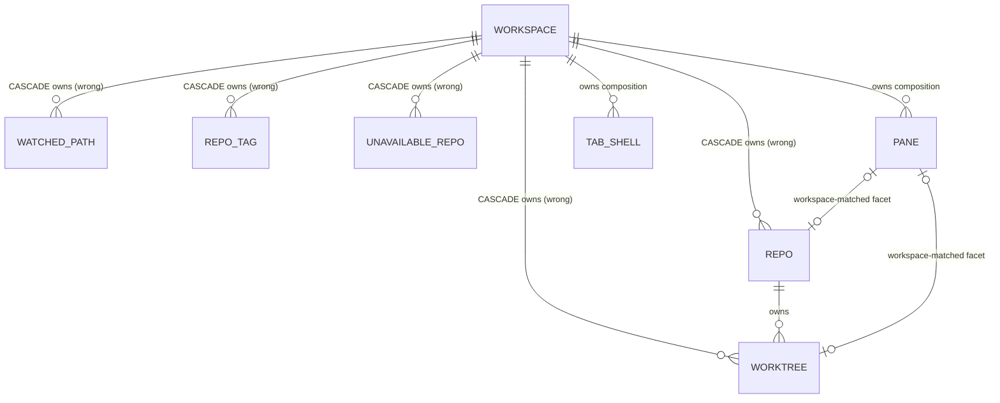
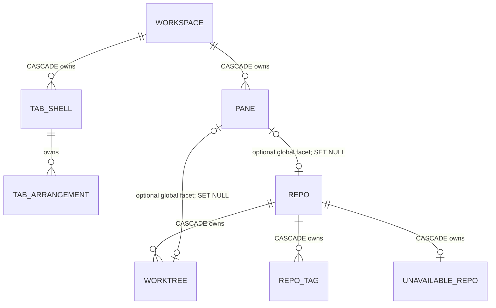
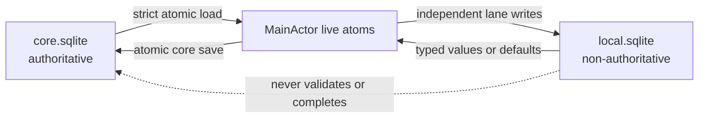
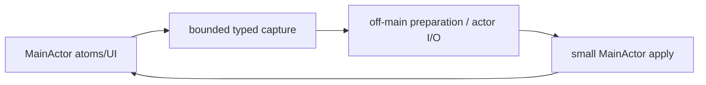
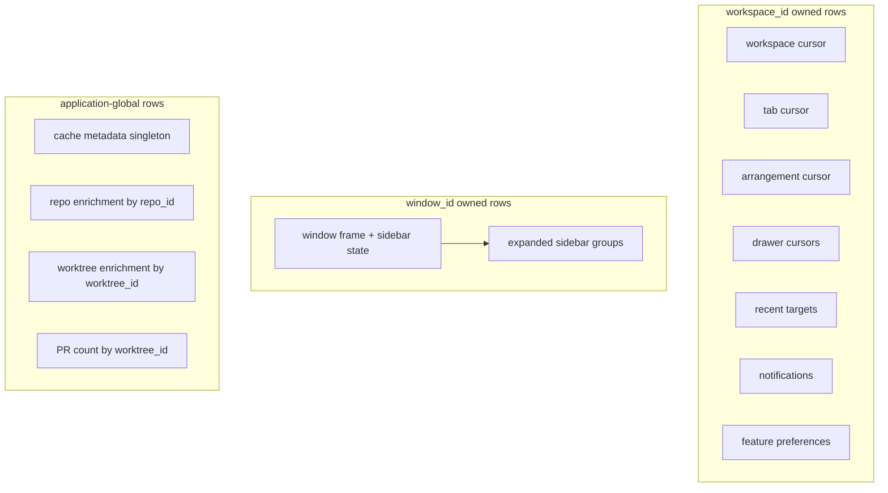
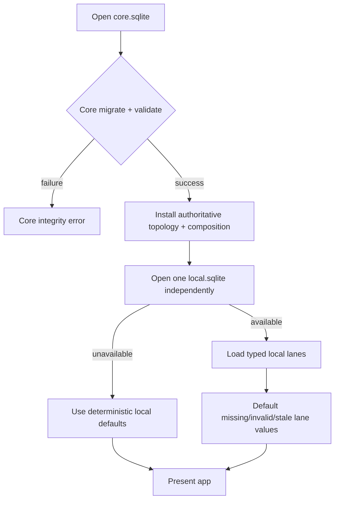
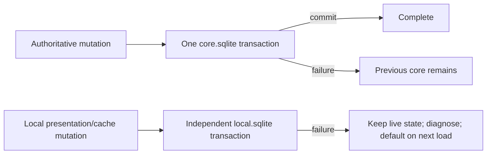

# Persistence Ownership Hard Cut

Date: 2026-07-21
Status: Accepted — persistence hard-cut only

> Scope note (2026-07-22): pane retention, undo expiry, and resource
> finalization are being split into
> [`2026-07-22-pane-retention-and-safe-cleanup`](../2026-07-22-pane-retention-and-safe-cleanup/2026-07-22-pane-retention-and-safe-cleanup.md).
> That follow-up is independent. This spec owns only core/global persistence,
> one clean application `local.sqlite`, and complete removal of legacy
> JSON-to-SQLite and per-workspace-local compatibility code.

## Read this first

This change fixes two customer-impacting problems:

1. Deleting a workspace can currently delete application-level repositories,
   worktrees, watched paths, tags, and availability rows because the SQLite
   schema incorrectly makes them children of the workspace.
2. A local preference/cache write can currently make a valid core snapshot look
   incomplete and prevent AgentStudio from opening.

The target ownership is intentionally small:

```text
core.sqlite
  authoritative global repository topology
  authoritative workspace composition

local.sqlite
  one clean application-level database
  non-authoritative cursors, window/sidebar state, preferences,
  notifications, recent targets, and rebuildable caches

preferences.global.json
  the only supported standalone JSON preference file
```

`core.sqlite` must be internally atomic and sufficient to open the app.
`local.sqlite` may be missing or unusable; the app then uses deterministic
defaults without changing core.

## Customer problems and required outcomes

### 1. Workspace deletion destroys data it does not own

The domain model already treats repositories and worktrees as application-level
entities. The current database does not. It stores `workspace_id` on topology
tables and uses workspace-delete cascades.

Required outcome:

- workspace deletion removes only that workspace's pane/tab/layout composition;
- watched paths, repositories, worktrees, tags, notes, favorite state, and
  availability remain unchanged;
- the same repository or worktree can be referenced by multiple workspace
  compositions;
- only an explicit topology mutation may delete a repository or worktree.

### 2. Local state can brick startup

Core composition is authoritative. Window geometry, cursors, sidebar state,
notifications, preferences, and caches are not. The current staged-core,
local-write, core-completion protocol makes core validity depend on local I/O.

Required outcome:

- one core save is one SQLite transaction;
- one core load is one consistent SQLite read transaction;
- core completion never depends on a local token or write;
- one clean application-level `local.sqlite` replaces per-workspace local
  sidecars;
- missing, corrupt, or unavailable local state never blocks valid core startup.

## Current evidence

The design is grounded in these current source boundaries:

- `WorkspaceCoreMigrations.swift` defines workspace ownership and cascades on
  `watched_path`, `repo`, `worktree`, and `unavailable_repo`.
- `WorkspaceCoreMigrations+RepositoryTopology.swift` repeats workspace ownership
  in `repo_tag`.
- `WorkspaceCoreRepository+Topology.swift` still requires workspace identity for
  topology reads and writes.
- `WorkspaceSQLiteDatastore.swift` and the store backend coordinate separate
  core/local completion state instead of treating core as independently atomic.
- `WorkspaceSQLiteSaveCoordinator.swift` captures composition and topology in
  one bundle before an off-main suspension. A later-arriving older capture can
  therefore replace newer accepted topology.
- `WorkspaceLocalMigrations.swift` defines one schema per workspace-local
  sidecar and repeats `workspace_id` on global cache rows.

## Ownership boundaries

### Current core ownership: incorrect



### Target core ownership



There is no edge from `workspace` to repository topology.

### Target database responsibility



Atoms remain state owners and pure derived-state owners. Persistence remains in
repositories, stores, and the datastore actor.

## Requirements

### R1. Global topology in `core.sqlite`

- `watched_path`, `repo`, `worktree`, `repo_tag`, and `unavailable_repo` have no
  `workspace_id` column, workspace foreign key, or workspace-delete cascade.
- `worktree.repo_id` is the only ownership edge for worktrees.
- Repository APIs fetch and mutate one application-level topology without a
  workspace parameter.
- Workspace composition saves do not carry or replace topology.
- An older captured composition save can never replace newer accepted topology;
  removing topology from composition bundles is the required ownership boundary,
  not a timestamp-based whole-state overwrite from multiple stores.
- Existing identifiers and values are copied unchanged during the schema
  migration. No UUID merge, deduplication, reconciliation, or metadata synthesis
  is performed.
- Newly generated identifiers use UUIDv7. Existing stored identifiers are used
  as-is.

`id` and `stable_key` are different concepts:

```text
id          durable entity identity and foreign-key target
            UUID; newly generated values use UUIDv7

stable_key  discovery fingerprint derived from canonical filesystem path
            16 hexadecimal characters: the first 64 bits of SHA-256
            not a UUID, not a foreign-key identity, and not merge authority
```

Moving a canonical path may change `stable_key` while the entity UUID remains
stable. Equal stable keys reject invalid duplicate topology; they never authorize
combining two stored UUID identities.

### R2. Workspace composition references global topology

- Pane, tab, arrangement, and drawer rows remain owned by `workspace_id`.
- `pane.facet_repo_id` and `pane.facet_worktree_id` reference global topology
  and use `ON DELETE SET NULL`.
- If both pane facets are present, the worktree must belong to the selected
  repository.
- Removing a repository/worktree facet does not change pane residency, CWD,
  terminal lifetime, or ZMX identity.

### R3. Atomic core persistence

- Every authoritative core mutation commits in one SQLite transaction.
- Every core hydration reads workspace selection, workspace metadata,
  composition, and global topology inside one SQLite read transaction.
- A crash before commit leaves the previous core state; a crash after commit
  leaves the new core state.
- `workspace_sqlite_snapshot_status` is removed. A committed SQLite transaction
  is complete by definition.
- `legacy_workspace_import_status` is removed. This hard cut has no JSON import
  or replay authority.

### R4. One clean application `local.sqlite`

- The application opens one local database at the app data root. Its path is not
  derived from a workspace UUID.
- The database is created from the target schema and starts empty.
- Old `<workspace-id>.local.sqlite` files are not read, merged, copied, or
  imported.
- Workspace JSON cache/UI/sidebar/inbox/settings files are not read, replayed,
  or imported. Their runtime readers and writers are removed.
- `preferences.global.json` remains supported and is not moved into SQLite.
- Missing local rows use deterministic defaults. Failure to open the entire
  local database defaults all local state and does not change the core result.
- Local writes are independent transactions. A local write failure does not
  roll back or invalidate core.

This intentionally resets notification history, cursors, recent targets,
window/sidebar memory, workspace-scoped settings, and rebuildable caches once at
cutover. The accepted cost is loss of non-authoritative local state; the gain is
removing all import/replay/compatibility machinery and eliminating local state
as a boot dependency.

### R5. Explicit local ownership

- Workspace continuation and workspace-scoped feature rows include
  `workspace_id` in their primary key.
- Window frame and sidebar presentation are keyed by durable `window_id`, not a
  workspace.
- The current single-window product persists one row with `window_role =
  'main'`. On first use it generates a UUIDv7 `window_id`; later launches find
  the same row by the stable role.
- Repository/worktree/PR caches are keyed globally by repo/worktree identity and
  have no workspace owner.
- Cross-database references are validated in code after core loads because
  SQLite cannot enforce foreign keys across separate files. Stale local rows
  default or disappear without changing core.

### R5a. Swift owns product-value validation

- Closed product vocabularies and cross-field product semantics are validated
  by typed Swift domain models and throwing repository codecs, not duplicated
  as SQLite `CHECK (... IN (...))` lists.
- Local repository write APIs accept typed values rather than arbitrary storage
  strings. Exhaustive Swift switches encode values at the SQLite boundary.
- Local repository reads decode untrusted row values into typed product values
  or return a typed validation error. An invalid non-authoritative row defaults
  or disappears without changing core or blocking startup.
- `RecentWorkspaceTarget` restoration validates the complete discriminator and
  optional-ID tuple in one product-owned operation:
  - `worktree` requires both `repo_id` and `worktree_id`;
  - `cwdOnly` requires both identifiers to be absent;
  - every other tuple is invalid and the recent-target row disappears.
- Notification claim restoration examines all four flattened columns together:
  - four `NULL` values decode to no claim;
  - non-`NULL` pane, lane, and semantic values decode to one typed claim, with
    an optional session identifier;
  - every partial tuple, including a session-only tuple, is invalid and the
    notification row disappears rather than silently losing claim semantics.
- Repo Explorer and inbox preference strings decode through their existing
  Swift enums. Unsupported local values use the owning atom's deterministic
  typed default.
- SQLite continues to enforce storage integrity: primary and foreign keys,
  uniqueness, required columns, boolean representation, scalar ranges, and
  singleton-row constraints. The single-window `window_role = 'main'` check is
  a singleton schema invariant, not a product enum list, and remains.

The existing deployed `pane.content_type` check is not changed by this hard
cut. Removing it would require rebuilding the heavily referenced `pane` table;
this spec does not expand the core migration for that unrelated cleanup. Swift
remains the reader/writer authority for `PaneContentType`, and no new product
enum checks are introduced.

### R6. Failure containment and observability

Existing diagnostics must distinguish:

- core open/migration/validation/commit failure;
- local database unavailable and local lane read/write failure;
- local stale-reference defaulting.

OTLP output must not include raw paths, pane titles, notes, notification bodies,
terminal content, or session IDs.

### R7. MainActor remains a bounded UI-state boundary

This persistence correction must reduce or preserve MainActor work. It must not
move database or collection computation onto MainActor merely because a
coordinator or atom is MainActor-isolated.

MainActor may perform only:

- shallow capture of immutable `Sendable` state needed by an off-main worker;
- bounded identity lookup and validation required to start a transition;
- direct mutation of canonical UI atoms;
- application of an already-prepared result;
- AppKit, SwiftUI observation, and embedded Ghostty calls that require
  MainActor ownership.

MainActor must not perform:

- SQLite open, migration, query, encoding, transaction, or quarantine work;
- filesystem or repository operations;
- composition preparation or schema validation;
- collection-wide sorting, filtering, grouping, diffing, reconciliation,
  aggregation, or cache rebuilding;
- timer waiting or retry loops;
- rebuilding large persistence payloads from observable state on every save.

An `@MainActor` coordinator owns sequencing, not computation. It captures a
small typed request, calls an actor or `@concurrent nonisolated` worker, and
applies the prepared result. Atoms remain canonical state or pure derived state
with small selector-style transforms; they do not become persistence planners
or background-work substitutes.

For persistence, capture uses shallow value/COW snapshots or incrementally
maintained changed-row inputs. Mapping those values into SQL rows, validating
the aggregate, and performing I/O happens after leaving MainActor. Repository
or watch-folder count must not multiply synchronous MainActor work.



## Exact schema changes

### Core current-to-target delta

| Object | Current | Target |
| --- | --- | --- |
| `watched_path` | workspace-owned; unique within workspace | global; `stable_key` globally unique |
| `repo` | workspace-owned; unique within workspace | global; `stable_key` globally unique |
| `worktree` | composite repo/workspace FK | global; owned only by `repo_id` |
| `repo_tag` | workspace-qualified key/FK | `(repo_id, tag)` |
| `unavailable_repo` | workspace-qualified key/FK | one row per global `repo_id` |
| `pane` facet triggers | topology facets must share pane workspace | dropped; facets reference global topology |
| `workspace_sqlite_snapshot_status` | cross-database completion state | dropped |
| `legacy_workspace_import_status` | legacy import/replay state | dropped |

This is not a rebuild of all domain data. SQLite cannot alter the existing
topology foreign keys, primary keys, or uniqueness constraints in place, so the
five topology tables require replacement in one transaction. `pane` is not
rebuilt by this hard cut. Its existing optional facet columns already reference
the global `repo(id)` and `worktree(id)` identities with `ON DELETE SET NULL`;
the migration only drops the obsolete workspace-matching facet triggers.
Existing pane residency and lifecycle columns remain unchanged.

Topology rows and identifiers are copied 1:1.

Previously shipped GRDB migration bodies and identifiers remain unchanged. One
new forward migration produces the target schema; this preserves upgradeability
without retaining any old runtime read/write path.

The migration does not merge duplicate entities. If the existing rows cannot
satisfy the target global uniqueness constraints, the transaction fails and
leaves the original schema/data unchanged.

### Target `core.sqlite` DDL: global topology

```sql
CREATE TABLE watched_path (
    id         TEXT PRIMARY KEY,
    path       TEXT NOT NULL,
    stable_key TEXT NOT NULL UNIQUE,
    added_at   REAL NOT NULL
);

CREATE TABLE repo (
    id          TEXT PRIMARY KEY,
    name        TEXT NOT NULL,
    repo_path   TEXT NOT NULL,
    stable_key  TEXT NOT NULL UNIQUE,
    created_at  REAL NOT NULL,
    is_favorite INTEGER NOT NULL DEFAULT 0
                CHECK (is_favorite IN (0, 1)),
    note        TEXT
);

CREATE TABLE worktree (
    id               TEXT PRIMARY KEY,
    repo_id          TEXT NOT NULL
                     REFERENCES repo(id) ON DELETE CASCADE,
    name             TEXT NOT NULL,
    path             TEXT NOT NULL,
    stable_key       TEXT NOT NULL UNIQUE,
    is_main_worktree INTEGER NOT NULL
                     CHECK (is_main_worktree IN (0, 1)),
    note             TEXT
);

CREATE INDEX idx_worktree_repo_id ON worktree(repo_id);

CREATE TABLE repo_tag (
    repo_id TEXT NOT NULL REFERENCES repo(id) ON DELETE CASCADE,
    tag     TEXT NOT NULL CHECK (
        tag = trim(tag) AND length(tag) BETWEEN 1 AND 64
    ),
    PRIMARY KEY (repo_id, tag)
);

CREATE INDEX idx_repo_tag_tag ON repo_tag(tag);

CREATE TABLE unavailable_repo (
    repo_id TEXT PRIMARY KEY REFERENCES repo(id) ON DELETE CASCADE
);
```

### Existing `pane` table: topology-trigger cut

The `pane` table, its rows, lifecycle columns, parent trigger, content-type
checks, and pane-content-family triggers remain unchanged. These obsolete
workspace-matching topology triggers are dropped:

```sql
DROP TRIGGER IF EXISTS pane_facet_repo_matches_workspace;
DROP TRIGGER IF EXISTS pane_facet_repo_update_matches_workspace;
DROP TRIGGER IF EXISTS pane_facet_worktree_matches_workspace;
DROP TRIGGER IF EXISTS pane_facet_worktree_update_matches_workspace;
```

These obsolete tables are dropped without replacement:

```sql
DROP TABLE workspace_sqlite_snapshot_status;
DROP TABLE legacy_workspace_import_status;
```

### New application `local.sqlite`: complete target DDL

This file is created clean. The following is its complete product schema; GRDB's
own migration table is implicit and is not a product table.



#### Workspace continuation

```sql
CREATE TABLE local_workspace_cursor (
    workspace_id  TEXT PRIMARY KEY,
    active_tab_id TEXT,
    updated_at    REAL NOT NULL
);

CREATE TABLE local_tab_cursor (
    workspace_id          TEXT NOT NULL,
    tab_id                TEXT NOT NULL,
    active_arrangement_id TEXT,
    updated_at            REAL NOT NULL,
    PRIMARY KEY (workspace_id, tab_id)
);

CREATE INDEX idx_local_tab_cursor_workspace
ON local_tab_cursor(workspace_id);

CREATE TABLE local_arrangement_cursor (
    workspace_id   TEXT NOT NULL,
    arrangement_id TEXT NOT NULL,
    active_pane_id TEXT,
    updated_at     REAL NOT NULL,
    PRIMARY KEY (workspace_id, arrangement_id)
);

CREATE INDEX idx_local_arrangement_cursor_workspace
ON local_arrangement_cursor(workspace_id);

CREATE TABLE local_drawer_cursor (
    workspace_id TEXT NOT NULL,
    drawer_id    TEXT NOT NULL,
    is_expanded  INTEGER NOT NULL CHECK (is_expanded IN (0, 1)),
    updated_at   REAL NOT NULL,
    PRIMARY KEY (workspace_id, drawer_id)
);

CREATE INDEX idx_local_drawer_cursor_workspace
ON local_drawer_cursor(workspace_id);

CREATE UNIQUE INDEX idx_local_drawer_one_expanded_per_workspace
ON local_drawer_cursor(workspace_id)
WHERE is_expanded = 1;

CREATE TABLE local_arrangement_drawer_cursor (
    workspace_id    TEXT NOT NULL,
    arrangement_id  TEXT NOT NULL,
    drawer_id       TEXT NOT NULL,
    active_child_id TEXT,
    updated_at      REAL NOT NULL,
    PRIMARY KEY (workspace_id, arrangement_id, drawer_id)
);

CREATE INDEX idx_local_arrangement_drawer_cursor_workspace
ON local_arrangement_drawer_cursor(workspace_id);
```

#### Window and sidebar presentation

```sql
CREATE TABLE local_window_state (
    window_id         TEXT PRIMARY KEY,
    window_role       TEXT NOT NULL UNIQUE CHECK (window_role = 'main'),
    sidebar_width     REAL NOT NULL,
    window_frame_json TEXT,
    filter_text       TEXT NOT NULL,
    is_filter_visible INTEGER NOT NULL CHECK (is_filter_visible IN (0, 1)),
    sidebar_collapsed INTEGER NOT NULL CHECK (sidebar_collapsed IN (0, 1)),
    sidebar_surface   TEXT NOT NULL,
    updated_at        REAL NOT NULL
);

CREATE TABLE local_window_sidebar_expanded_group (
    window_id TEXT NOT NULL
              REFERENCES local_window_state(window_id) ON DELETE CASCADE,
    group_key TEXT NOT NULL,
    PRIMARY KEY (window_id, group_key)
);
```

#### Recent targets

```sql
CREATE TABLE local_recent_workspace_target (
    workspace_id  TEXT NOT NULL,
    id            TEXT NOT NULL,
    path          TEXT NOT NULL,
    display_title TEXT NOT NULL,
    subtitle      TEXT NOT NULL,
    repo_id       TEXT,
    worktree_id   TEXT,
    kind          TEXT NOT NULL,
    last_opened_at REAL NOT NULL,
    PRIMARY KEY (workspace_id, id)
);

CREATE INDEX idx_local_recent_target_workspace_time
ON local_recent_workspace_target(workspace_id, last_opened_at);
```

#### Notification inbox

```sql
CREATE TABLE local_notification_inbox_collapsed_group (
    workspace_id TEXT NOT NULL,
    group_key    TEXT NOT NULL,
    PRIMARY KEY (workspace_id, group_key)
);

CREATE TABLE local_notification_inbox_item (
    workspace_id                    TEXT NOT NULL,
    id                              TEXT NOT NULL,
    timestamp                       REAL NOT NULL,
    kind                            TEXT NOT NULL,
    title                           TEXT NOT NULL,
    body                            TEXT,
    source_kind                     TEXT NOT NULL,
    pane_id                         TEXT,
    tab_id                          TEXT,
    tab_display_label               TEXT,
    tab_ordinal                     INTEGER,
    repo_id                         TEXT,
    repo_name                       TEXT,
    worktree_id                     TEXT,
    worktree_name                   TEXT,
    branch_name                     TEXT,
    pane_display_label              TEXT,
    pane_ordinal                    INTEGER,
    pane_role                       TEXT,
    parent_pane_id                  TEXT,
    parent_pane_display_label       TEXT,
    parent_pane_ordinal             INTEGER,
    drawer_ordinal                  INTEGER,
    runtime_display_label           TEXT,
    activity_burst_window_id        TEXT,
    activity_session_id             TEXT,
    activity_event_count            INTEGER,
    activity_rows_added             INTEGER,
    activity_threshold_rows         INTEGER,
    activity_latest_rows            INTEGER,
    claim_pane_id                   TEXT,
    claim_lane                      TEXT,
    claim_semantic                  TEXT,
    claim_session_id                TEXT,
    is_read                         INTEGER NOT NULL
                                    CHECK (is_read IN (0, 1)),
    is_dismissed_from_pane_inbox    INTEGER NOT NULL
                                    CHECK (is_dismissed_from_pane_inbox IN (0, 1)),
    PRIMARY KEY (workspace_id, id)
);

CREATE INDEX idx_notification_workspace_timestamp
ON local_notification_inbox_item(workspace_id, timestamp);

CREATE INDEX idx_notification_workspace_pane
ON local_notification_inbox_item(workspace_id, pane_id);

CREATE INDEX idx_notification_workspace_tab
ON local_notification_inbox_item(workspace_id, tab_id);

CREATE INDEX idx_notification_workspace_repo
ON local_notification_inbox_item(workspace_id, repo_id);

CREATE INDEX idx_notification_workspace_worktree
ON local_notification_inbox_item(workspace_id, worktree_id);

CREATE INDEX idx_notification_claim_exact
ON local_notification_inbox_item(
    workspace_id,
    claim_pane_id,
    claim_lane,
    claim_semantic,
    claim_session_id
)
WHERE claim_pane_id IS NOT NULL
  AND claim_lane IS NOT NULL
  AND claim_semantic IS NOT NULL;

CREATE INDEX idx_notification_claim_session
ON local_notification_inbox_item(
    workspace_id,
    claim_pane_id,
    claim_session_id
)
WHERE claim_pane_id IS NOT NULL
  AND claim_session_id IS NOT NULL;
```

Notification meaning, coalescence, retention, and presentation are unchanged.
Only the shared-file key shape changes. The general session-claim index does
not encode which claim lanes are mergeable; the exhaustive Swift
`InboxNotificationClaimLane.canMergeWithinActivitySession` policy owns that
decision.

#### Typed workspace preferences

```sql
CREATE TABLE local_editor_preferences (
    workspace_id         TEXT PRIMARY KEY,
    bookmarked_editor_id TEXT,
    updated_at           REAL NOT NULL
);

CREATE TABLE local_repo_explorer_preferences (
    workspace_id    TEXT PRIMARY KEY,
    grouping_mode   TEXT NOT NULL,
    sort_order      TEXT NOT NULL,
    visibility_mode TEXT NOT NULL,
    updated_at      REAL NOT NULL
);

CREATE TABLE local_inbox_notification_preferences (
    workspace_id            TEXT PRIMARY KEY,
    grouping                 TEXT NOT NULL,
    sort_order               TEXT NOT NULL,
    bell_enabled             INTEGER NOT NULL
                             CHECK (bell_enabled IN (0, 1)),
    global_content_mode      TEXT NOT NULL,
    global_row_state_filter  TEXT NOT NULL,
    pane_content_mode        TEXT NOT NULL,
    pane_row_state_filter    TEXT NOT NULL,
    updated_at               REAL NOT NULL
);
```

#### Global rebuildable caches

```sql
CREATE TABLE cache_metadata (
    singleton_id    INTEGER PRIMARY KEY CHECK (singleton_id = 1),
    source_revision INTEGER NOT NULL DEFAULT 0 CHECK (source_revision >= 0),
    last_rebuilt_at REAL
);

CREATE TABLE cache_repo_enrichment (
    repo_id           TEXT PRIMARY KEY,
    state             TEXT NOT NULL,
    origin            TEXT,
    upstream          TEXT,
    group_key         TEXT,
    remote_slug       TEXT,
    organization_name TEXT,
    display_name      TEXT,
    updated_at        REAL NOT NULL,
    payload_json      TEXT
);

CREATE TABLE cache_worktree_enrichment (
    worktree_id      TEXT PRIMARY KEY,
    repo_id          TEXT NOT NULL,
    branch           TEXT,
    is_main_worktree INTEGER NOT NULL CHECK (is_main_worktree IN (0, 1)),
    updated_at       REAL NOT NULL,
    payload_json     TEXT
);

CREATE INDEX idx_cache_worktree_repo
ON cache_worktree_enrichment(repo_id);

CREATE TABLE cache_pull_request_count (
    worktree_id TEXT PRIMARY KEY,
    repo_id     TEXT,
    count       INTEGER NOT NULL CHECK (count >= 0),
    updated_at  REAL NOT NULL
);

CREATE INDEX idx_cache_pull_request_repo
ON cache_pull_request_count(repo_id);
```

### Objects deliberately absent from the target

```text
core.sqlite
  legacy_workspace_import_status
  workspace_sqlite_snapshot_status
  topology workspace_id columns and workspace cascades
  pane/worktree same-workspace triggers

local.sqlite
  local_workspace_sqlite_snapshot_status
  local_persistence_lane_marker
  cache_notification_count
  workspace-owned repository/worktree cache columns
  workspace-owned window/sidebar tables

standalone persistence
  <workspace-id>.local.sqlite readers/writers
  workspace cache/UI/sidebar/inbox/settings JSON readers/writers
```

## Startup and save contracts

### Startup



No local result changes the already accepted core result.

### Save



There is no distributed transaction, matching completion token, receipt, replay
engine, or atom-owned persistence logic.

## Design tradeoffs

### Global topology requires a transactional table rebuild

Gain:

- the database finally matches the domain model;
- workspace deletion cannot destroy repositories;
- multiple compositions can reference the same topology.

Cost:

- five topology tables are mechanically rebuilt because their foreign-key,
  primary-key, and uniqueness definitions change;
- a real pre-existing global-key conflict fails the migration rather than being
  guessed away.

### Clean local database discards local history

Gain:

- no sidecar consolidation, JSON import, replay prevention, receipts, or
  compatibility readers;
- local failure can never make core invalid;
- one clear application-level owner for non-authoritative state.

Cost:

- one-time reset of notification history, local preferences, recent targets,
  cursors, window/sidebar memory, and caches;
- users re-establish preferences through ordinary use.

### One physical local database is one physical failure domain

Gain:

- one connection owner and one schema;
- correct global cache ownership;
- no workspace/window equivalence.

Cost:

- file-level corruption can reset every local lane at once, although each lane
  remains logically independent when the database is readable.

### Product validation moves out of schema DDL

Gain:

- Swift enums and discriminated product values are the single semantic source
  of truth;
- adding a product enum case does not require a `local.sqlite` schema migration;
- exhaustive encoders and throwing decoders keep malformed row handling close
  to the owning model.

Cost:

- every local row codec must validate untrusted SQLite values before exposing a
  product value;
- tests must cover every valid variant and malformed cross-field tuple because
  SQLite no longer rejects those product-semantic combinations first.

## Proof expectations

The implementation plan must turn these into permanent tests and product proof:

1. Core schema inspection shows no workspace FK/cascade in global topology and
   no obsolete completion/import tables.
2. Deleting inactive, active, and final workspaces removes only their
   composition; global topology and metadata remain byte-for-byte equivalent.
3. The same repo/worktree can be referenced from two workspace compositions.
4. A barrier-controlled save proves an older captured composition cannot replace
   newer topology after an off-main suspension.
5. A forward migration preserves topology UUIDs and values 1:1 and rolls back
   entirely on target uniqueness failure.
6. Core save interruption leaves either the previous complete state or the new
   complete state, never a staged incomplete state.
7. Core hydration reads one consistent generation while a concurrent writer
   commits.
8. Missing/corrupt/unavailable `local.sqlite` still opens valid core and presents
   usable deterministic tab/pane/sidebar defaults.
9. Production opens exactly one local database and never reads old local
   sidecars or workspace JSON persistence.
10. Every new local table round-trips its typed values. Typed Swift codecs reject
   unsupported enum strings, invalid recent-target discriminator/ID tuples, and
   every partial notification-claim tuple, including session-only claims.
   Malformed non-authoritative rows default or disappear without blocking valid
   core startup. SQLite schema tests separately prove boolean, scalar-range,
   singleton, key, and relationship constraints.
11. Removing a repo/worktree clears pane facets but leaves the pane, CWD,
    surface, and ZMX session alive.
12. Atoms contain no persistence or persistence-coordination logic.
13. MainActor proof shows persistence paths perform only bounded
    capture/apply work there. Composition preparation, row mapping, SQLite,
    filesystem, retries, timers, and collection-wide computation
    execute off MainActor. A production-shaped repository/watch-folder fixture
    does not increase synchronous MainActor work in proportion to topology size.

The later plan owns exact commands and sequencing. Proof should use the existing
Swift test suite, SQLite integration fixtures, and a bounded debug-app smoke. No
ad hoc proof scripts are required.

## Non-goals

- Multi-window creation or restoration.
- Repository discovery, filesystem watching, Git scheduling, EventBus, Ghostty
  callback admission, or terminal activity redesign.
- Notification meaning, retention, grouping, or coalescence redesign.
- Pane retention, close/undo expiry, Ghostty/runtime/ZMX finalization, orphan
  residency cleanup, or surface checkpoint cleanup; those belong to the linked
  pane-retention follow-up.
- Automatic deletion of unreferenced repositories or worktrees.
- A generic recovery framework, reconciliation engine, receipt protocol,
  replay system, compatibility layer, or persistence logic in atoms.
- Preserving non-authoritative local data from the old sidecars/JSON files.

## Spec boundary and separability map

```text
Global topology repository
  owns: watched paths, repos, worktrees, tags, availability
  exposes: global typed reads/mutations

Workspace composition repository
  owns: workspace, pane, tab, arrangement, drawer graph
  references: global repo/worktree IDs
  guarantees: one atomic core transaction

Local persistence repository
  owns: one local.sqlite and typed non-authoritative lanes
  owns: product-value encoding and validated restoration from untrusted rows
  exposes: loaded typed value, deterministic default, or row disappearance

Atoms
  own: live canonical state and pure derived projections
  do not own: persistence or migration

Off-main workers and actors
  own: validation, row mapping, collection computation, SQLite I/O,
       filesystem work, timers, and retries
```

The core schema correction and clean local database are the two implementation
slices. They share one hard boundary: local state must never validate core, and
topology loss must never become pane destruction.
