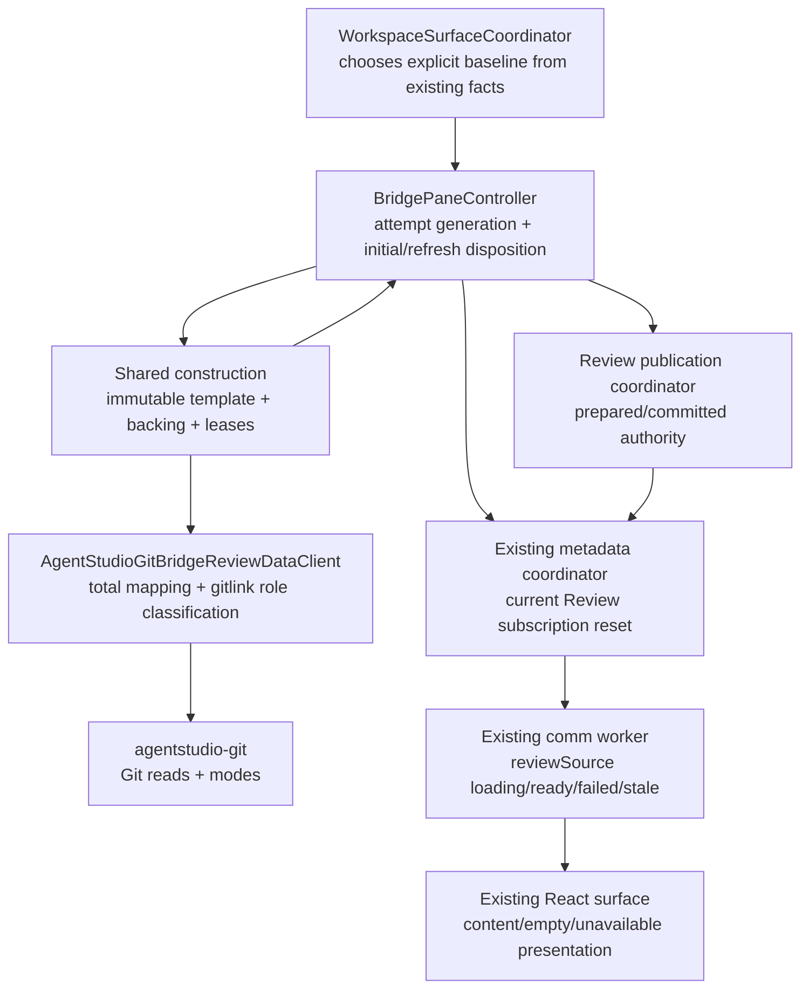
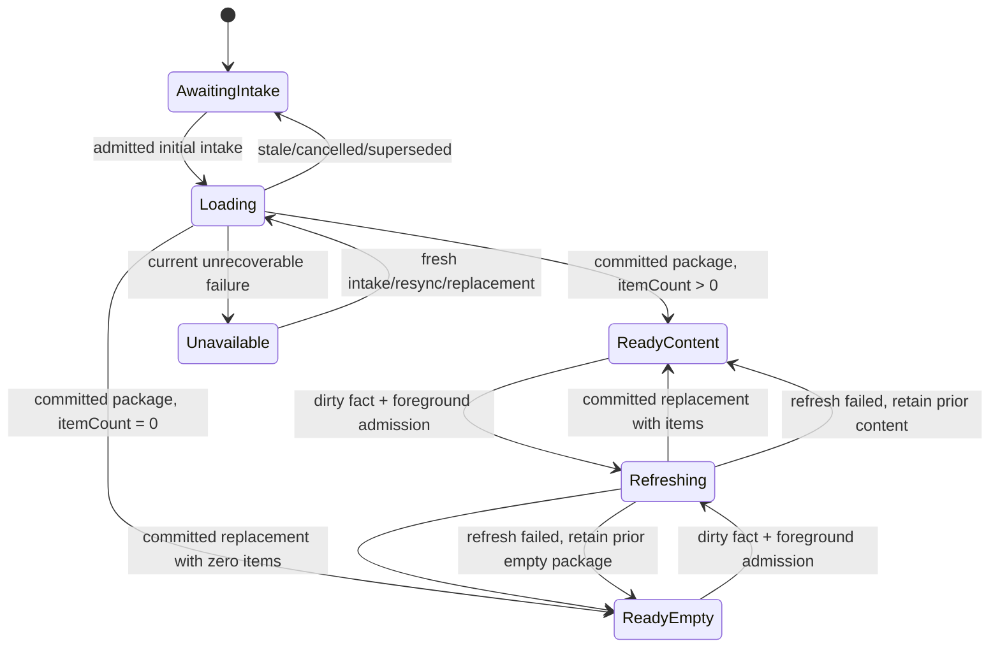

# Bridge Review Terminal Loading

Date: 2026-07-22

Status: draft design contract

## Decision Summary

Opening Review for a valid worktree must terminate in exactly one visible outcome:

1. ready with changed items;
2. ready with no changed items;
3. explicitly unavailable.

Review must never remain loading after its current construction/publication attempt settles.

The correction stays inside the existing owners. It does not add an actor, scheduler, EventBus route, Browser store, wire event, protocol version, or retry framework.

The design corrects four independent defects that currently collapse into “Review does not load”:

- pane opening guesses that every repository has a local `main` branch;
- Git mode facts are discarded, so changed gitlinks are read as ordinary files;
- initial native failure does not terminate the accepted Review subscription;
- a successful zero-item package is rejected by the presentation adapter and remains projection-pending.

## Product Problem

A user can open File mode for a valid worktree while Review remains loading or becomes a native error. File mode working proves that the pane, worktree, and Browser session are usable; Review adds baseline resolution, diff construction, immutable content capture, publication, and Review metadata projection, so failures in those stages are Review-specific.

Two observed worktrees expose different causes:

| Worktree | Direct evidence | Current consequence |
| --- | --- | --- |
| `agent-vm` | repository uses `master`; no local `main`; Review opener hard-codes `.localDefaultBranch("main")` | base revision resolution returns libgit2 not-found |
| `ai-dev-skills` | changed `mattpocock-skills` entry is a gitlink with mode `160000`; Bridge discards mode and creates file handles | shared content capture attempts to read a submodule directory as file bytes |

The Browser symptom is amplified by a lifecycle gap:

```text
Review intake accepted
        │
        ▼
native construction / publication
        │
        ├── succeeds with items ───────────────► ready
        │
        ├── succeeds with zero items ──────────► projection pending today
        │
        └── fails ─► native DiffState.error ───► Browser loading today
```

The product promise after this change is:

```text
Review intake accepted
        │
        ▼
one generation-scoped attempt
        │
        ├── valid items ───────────────────────► ready with content
        ├── valid zero-item package ───────────► ready empty
        └── current unrecoverable failure ─────► explicitly unavailable
```

## Goals

- Load Review for repositories whose default branch is not named `main`.
- Keep changed gitlinks visible as Review items without treating their directories as file content.
- Make Git-to-Bridge error mapping total at the adapter boundary.
- Give every admitted initial Review generation one terminal Browser outcome.
- Preserve an already committed Review when refresh fails.
- Keep File mode, pane session, shared construction, and Browser worker architecture intact.
- Preserve the existing display-data boundary while keeping failure details
  private: repository-relative item paths and endpoint labels may cross to the
  Browser only as untrusted display values; absolute paths, provider messages,
  serialized errors, and Review baseline/ref values in failure or telemetry
  payloads do not cross into Browser or OTLP.

## Non-Goals

- Recursive submodule browsing or rendering submodule repository contents.
- A new default-branch discovery service or MainActor Git read.
- A generic Git error taxonomy for all consumers.
- Automatic retry loops, backoff, polling, or timeout frameworks.
- A new Review failure protocol, protocol version, EventBus event, or React state owner.
- Changing File metadata/content behavior.
- Replacing the existing shared construction, publication, metadata coordinator, comm worker, or fallback shells.
- Synthesizing an empty Review from any failure.

## Current-State Evidence

### Baseline selection is guessed

`WorkspaceSurfaceCoordinator+BridgeReviewOpening.swift` currently ignores its `Repo` parameter and always returns `.localDefaultBranch(branchName: "main")`.

This contradicts the existing Review control-surface contract, which says the opener chooses the best known default from repository enrichment and treats `main` or `master` as data, not universal constants.

The failure is reproducible from repository facts: `agent-vm` has `HEAD -> master`, `origin/HEAD -> origin/master`, and no local `main`.

### Gitlink shape is lost

`agentstudio-git` already provides `GitDiffFile.oldMode` and `newMode`. Mode `160000` identifies a gitlink. `AgentStudioGitBridgeReviewDataClient.bridgeChangedFile` drops both values, and the package builder creates ordinary base/head content handles.

For a gitlink role, neither commit blob lookup nor working-tree file read is valid:

- the Git object is a commit OID, not a blob;
- the working-tree path is a directory containing the checked-out submodule.

### The adapter is not a total boundary

Most Git reads catch `GitDataPlaneError` and convert it to `BridgeProviderFailure`. `captureSharedContent` calls `loadGitContentPayload` directly and can throw the raw dependency error after cleanup.

The controller then sees an implementation type rather than a stable Bridge semantic. Its string-based unresolved-HEAD predicate cannot distinguish revision resolution from missing content.

### Initial failure never reaches Review transport

Initial construction failure sets native `paneState.diff.status = .error`. The Review metadata source can already have an accepted subscription waiting for a future package, and no producer operation fails at that point. The worker therefore receives neither a package nor a reset.

Publication reservation failure also collapses to `.rejected`. The caller must
use the existing generation and admission checks to decide whether that means
current source failure or stale/closed work.

### Zero-item success must be visibly terminal

Native package construction and metadata windowing support zero items and zero tree rows. The worker can produce a ready Review source slice with both totals equal to zero.

A completed source with both totals equal to zero must produce a valid empty presentation snapshot and use the normal loaded Review shell. The existing `empty` state means “waiting for review metadata,” so it is not a correct zero-change result.

## Requirements

### R1 — Terminal generation invariant

Every admitted initial Review generation must settle exactly once. If it is
still the current generation when it settles, it must produce exactly one
visible outcome:

- `readyContent` — a committed package with one or more Review items;
- `readyEmpty` — a committed, valid package with zero Review items;
- `unavailable` — a bounded Review-source failure.

An invalidated, cancelled, suspended, closed, or superseded generation settles
as stale work, not as a visible terminal result for the current generation. It
must not publish over newer state.

### R2 — No guessed branch name

The native Review opener must not use a literal `main`, `master`, or `origin/main` as an unconditional default.

For both a newly opened pane and a restored workspace-backed pane whose source is
the semantic `localDefaultBranch` case, the mount/open boundary must choose the
best synchronous baseline from existing state:

1. the cached enrichment branch for the repository's main worktree, when it is
   non-empty and is not a detached-head sentinel;
2. the selected main worktree's cached branch, under the same constraints, when
   the selected worktree is the main worktree;
3. exact `HEAD` as the degraded fallback when no authoritative branch fact is available.

New panes persist the selected baseline explicitly in `BridgePaneSource`.
Restored semantic `localDefaultBranch` sources are normalized before controller
construction so an old guessed branch does not permanently brick the pane. This
is runtime interpretation of the existing semantic case, not a second persisted
format or a legacy migration path. No Git command or filesystem scan is added to
the MainActor opener/mount boundary.

A stale explicit `.branch` or `.ref` selected by the user or caller is
unavailable, not empty and not an excuse to guess another branch.

### R3 — Exact unresolved-HEAD recovery only

Only a failure produced while resolving the exact revision target `HEAD` may trigger the existing `.unstaged` fallback.

The adapter must convert that operation-context-specific result into a typed internal failure such as `BridgeProviderFailure.unresolvedHead`. The controller matches the enum case, never message text.

The following must not trigger fallback:

- missing `main`, `master`, another branch, a tag, or an arbitrary ref;
- missing repository or worktree;
- missing tree, index, or content path;
- permission denial, timeout, cancellation, capacity rejection, or provider outage;
- a generic sanitized `notFound` with no exact revision-resolution context.

The fallback is attempted at most once for the current pane request. It is not shared, recursive, delayed, or retried with backoff.

### R4 — Gitlink roles are metadata-only

The adapter must preserve enough role-specific Git mode information to distinguish regular file/blob content from gitlink content.

For each base/head role independently:

- a regular file role receives its existing content handle;
- an absent role receives no handle;
- a gitlink role receives no ordinary file/blob content handle.

The changed gitlink remains in the Review package with its path, change kind, and old/new identity facts. A mixed regular-file-to-gitlink type change may expose content only for the regular side.

The worker must not schedule content demand for a missing gitlink role. Selecting an item with no renderable role must converge on the existing bounded “selected content unavailable” presentation rather than loading forever.

This spec does not recurse into the submodule or invent synthetic file bytes.

### R5 — Total Git adapter mapping

No dependency-specific `GitDataPlaneError` may escape
`AgentStudioGitBridgeReviewDataClient`, including shared content capture. Every
`agentstudio-git` failure must settle as cancellation/stale work or a typed,
closed `BridgeProviderFailure`; arbitrary provider prose is never preserved as
a Bridge failure message.

The adapter must map every Git read outcome into one of:

- a successful Bridge value;
- cancellation/stale work;
- a typed `BridgeProviderFailure`.

Shared capture must preserve its existing cleanup guarantees: failed capture removes the backing directory, removes temporary live locators, caches no failed artifact, and settles every shared waiter.

A file that disappears between comparison and capture is a bounded unavailable result. It is never converted to a zero-item package.

### R6 — Current publication failure is not stale work

Publication preparation/reservation failure must use the existing generation,
product-admission, and foreground-admission checks:

- invalid or superseded admission settles silently as stale work;
- a still-current initial publication failure becomes unavailable;
- a refresh failure preserves the committed Review.

No new publication result type is required for this distinction.

If native commit succeeds but initial Browser delivery exhausts the existing bounded delivery attempt, the Review subscription becomes unavailable while the native committed publication remains eligible for later replay. No fake rollback or empty package is created.

### R7 — Review-scoped terminal failure delivery

For a current initial generation with no previously readable Review, construction or publication failure must:

1. preserve a scrubbed native error summary;
2. terminate each currently matching Review metadata subscription through the
   existing subscription reset/failure path.

The existing `.staleSource` reset and worker `metadataUnavailable` projection are the wire contract. The Browser receives no provider-specific details.

This must not reset:

- File metadata;
- pane presentation metadata;
- the shared product stream;
- the pane session;
- another pane's Review subscription.

No unavailable-state cache or replay owner is added. A later intake, resync, or
replacement worker starts a fresh attempt through the existing scheduling path.

### R8 — Failure is recoverable but not self-retrying

Native `.error` must not permanently prevent a later explicit attempt.

A fresh Review intake, product resync, or replacement worker may transition:

```text
unavailable ──► loading ──► readyContent | readyEmpty | unavailable
```

Filesystem churn alone must not create a failure retry loop. No autonomous retry, timer, or polling mechanism is added.

### R9 — Refresh preserves committed Review authority

When a readable committed Review already exists, a refresh failure must retain:

- committed package and publication identity;
- artifact/content authority;
- worker active projection;
- dirty fact needed for a later refresh.

Refresh failure must not replace readable Review content with the initial unavailable shell. Existing ready/stale behavior remains authoritative.

### R10 — Zero-change Review uses loaded chrome and explicit empty copy

A successful zero-change comparison must commit and transport the normal zero-item package.

Browser presentation must distinguish:

- no Review source yet — loading/awaiting metadata;
- ready source with zero items — normal loaded Review shell, “Nothing to review” in the canvas, and “No changed files” in the file-tree rail;
- failed source — metadata unavailable;
- ready source with items — normal Review shell.

The zero-change state must retain the real Review toolbar icons and an empty file tree. It must not render fallback chrome, skeletons, loading placeholders, or “waiting for review metadata,” and it must not require a non-empty presentation snapshot.

## Boundary and Separability Map



| Surface | Owns | Explicitly does not own |
| --- | --- | --- |
| Review opener | synchronous baseline choice from current app facts | Git reads, retry, package state |
| `agentstudio-git` | Git/libgit2 operations and `GitDiffFile` mode facts | Bridge state and UI policy |
| AgentStudio Git adapter | total Git-to-Bridge mapping and content-role classification | pane acceptance and Browser state |
| shared construction | immutable artifact, capture backing, waiter/lease lifecycle | pane failure presentation |
| pane controller | current generation and initial-versus-refresh disposition | Review subscription implementation |
| publication coordinator | pane-local prepared/committed publication authority | shared artifact identity and Browser presentation |
| metadata coordinator | Review subscription lifecycle and current reset | Git classification and package authority |
| comm worker | Review source lifecycle reduction | native Git/package truth |
| React | visible empty/loading/unavailable/ready presentation | retries and provider diagnostics |

## State Contract



The two refresh-failure arrows return to whichever committed state existed before refresh. They never enter initial `Unavailable`.

## Failure Classification

Browser failure remains deliberately coarse. Native behavior needs only distinctions that alter policy.

| Native class | Policy |
| --- | --- |
| exact unresolved `HEAD` revision | one `.unstaged` fallback |
| missing explicit named baseline | terminal unavailable |
| gitlink role | metadata-only item; no file-content read |
| content disappeared/read failed | terminal unavailable for initial; retain committed Review on refresh |
| timeout/capacity/provider unavailable | terminal unavailable for initial; retain committed Review on refresh |
| cancellation/admission invalidation | stale; publish nothing over current state |
| zero changed files | ready empty |

## Security and Privacy Contract

Repository paths, worktree paths, ref names, provider messages, libgit2 prose,
item content, and serialized errors are untrusted inputs. They do not all have
the same product role:

- repository-relative item/tree paths are intentionally Browser-visible display
  data;
- the selected endpoint label currently crosses to the Browser worker as
  display data, even though later presentation may render generic Base/Head
  labels;
- absolute roots, provider diagnostics, and serialized errors are native-only;
- Browser-supplied display paths never authorize native filesystem reads.

This spec accepts the existing endpoint-label exposure because changing Review
label semantics is unrelated to terminal loading. The new failure route must
not add another ref/path channel or embed those values in error data. A future
requirement to hide selected ref labels from the Browser would require a
separate transport/display decision.

The following may remain native-only for local debugging:

- a scrubbed stage;
- a closed failure class;
- generation/outcome counters that contain no stable user data.

New failure and telemetry fields may contain only bounded values such as:

- outcome: `readyContent`, `readyEmpty`, `unavailable`, `stale`;
- stage: `baseline`, `comparison`, `capture`, `publication`, `delivery`;
- class: `unresolvedHead`, `unavailableEndpoint`, `missingContent`, `providerUnavailable`, `unsupportedContentKind`, `other`.

They must never contain the baseline/ref itself, any path, endpoint label,
provider identity, arbitrary `Error.description`, libgit2 message, or payload
excerpt. Existing `dev.branch.name` OTLP resource behavior is the current
worktree identity carveout; it is not permission to export a Review baseline.

Initial failure crosses native-to-Browser only through the existing Review
subscription reset, which the worker reduces to:

```text
reviewSource.failed
  status = failed
  error  = metadataUnavailable
```

The failed patch remains strict: no `message`, `safeMessage`, `path`, `ref`,
`providerFailure`, or `rawError` field is added.

## Observability Contract

Existing Bridge telemetry should record one terminal outcome for each admitted initial generation. This is an extension of existing telemetry, not a new proof harness.

Required diagnostic questions:

- Did the initial generation end content-ready, empty-ready, unavailable, or stale?
- Which closed stage and failure class ended it?
- Was the unavailable outcome delivered/reset for the Review subscription?
- Did a refresh retain an existing publication?

Package-build duration alone is insufficient because a build can finish while Browser remains loading.

## Proof Expectations

| Requirement | Permanent proof |
| --- | --- |
| R1 terminal invariant | table-driven controller tests cover content, empty, unavailable, and stale generations; exactly one current terminal outcome |
| R2 baseline choice | opener tests cover main-worktree branch `main`, `master`, absent enrichment -> `HEAD`, and stale named branch -> unavailable |
| R3 exact fallback | adapter/controller tests prove exact `HEAD` retries once; named refs, content not-found, timeout, and permission failures do not retry |
| R4 gitlink | real-Git fixture includes changed gitlink and regular file; package keeps the gitlink item, emits no gitlink handle/demand, and regular content remains readable |
| R5 total adapter | every Git read path, including shared capture, produces Bridge failure/cancellation; failed capture leaves no locator/backing/lease residue |
| R6 failure versus stale | focused controller tests prove current initial rejection becomes unavailable while invalid admission stays silent |
| R7 scoped failure | a current Review subscriber reaches existing `metadataUnavailable`; File subscription and pane metadata continue |
| R8 recovery | initial failure followed by fresh intake and success replaces failed state; no filesystem-triggered retry loop |
| R9 refresh retention | failed refresh preserves publication identity, content handles, active worker projection, and dirty fact |
| R10 empty state | zero-item native package reaches a visible no-changes state, never projection-pending or “waiting for metadata” |
| generation fencing | failure from generation N cannot overwrite ready generation N+1; close/suspend cannot publish stale failure |
| security | focused adapter tests prove shared capture and arbitrary provider prose settle as scrubbed Bridge failures; the failed Browser patch remains unchanged |
| gitlink role matrix | added and deleted gitlinks expose no handle on their present role; file-to-gitlink exposes base only; gitlink-to-file exposes head only; gitlink-to-gitlink exposes neither |

The highest product proof is the existing packaged WKWebView journey plus a
manual debug-app check against the two repositories that exposed the defects:

- default branch named `master`;
- changed gitlink plus ordinary changed file;
- clean/zero-change worktree;
- initial failure reaches the existing unavailable shell.

Use permanent suites and the existing app/observability harness. Do not add proof scripts or wall-clock sleeps.

## Alternatives and Tradeoffs

### Guess `master` after `main` fails

Rejected. This adds another guess, hides stale source configuration, and still fails repositories with other default branches.

### Treat every not-found as unborn `HEAD`

Rejected. The same libgit2 class can mean a missing branch, tree entry, index entry, or content path. Broad fallback can misreport real failure as an empty or unrelated unstaged Review.

### Fail the whole Review when any gitlink changes

Rejected. The diff metadata is valid and other files remain reviewable. Gitlink roles can be represented honestly as metadata-only without recursive submodule support.

### Synthesize text for a gitlink

Rejected for this scope. Synthetic body ownership, hashes, MIME type, and rendering semantics would add a second content-production path. Metadata-only is smaller and truthful.

### Add a new Browser failure event with rich reasons

Rejected. Existing Review subscription reset already reaches the worker's `metadataUnavailable` state. Rich reasons would expand protocol, schemas, fixtures, and privacy exposure without solving loading.

### Keep native `.error` permanently latched

Rejected. Repository state and worker sessions can change. Explicit intake/resync must be able to try again, while autonomous retry remains out of scope.

## Accepted Tradeoffs

- Default-branch choice uses the best existing synchronous enrichment fact. When it is absent, exact `HEAD` provides a loadable local-review fallback but may not include the full branch delta against the repository's remote default.
- Gitlink content is unavailable in this scope, but the changed item and the rest of Review remain usable.
- Browser failure copy stays generic. Native closed telemetry preserves enough stage/class information to diagnose policy failures without leaking repository data.
- Exact unresolved-HEAD classification remains internal to the AgentStudio adapter. Promote it into `agentstudio-git` only when another consumer needs the same policy distinction.
- Existing repository-relative paths and selected endpoint labels remain
  Browser-visible display data. This avoids an unrelated label redesign, but
  the renderer must continue treating them as data rather than native read
  authority.

## Revisit Triggers

- Review must browse or diff the contents of submodules.
- Product requires authoritative remote-default resolution when enrichment is absent.
- More than one consumer needs typed revision-not-found semantics from `agentstudio-git`.
- Distinct user actions become possible for permission, missing baseline, and transient provider failures; that would justify a richer bounded Browser failure union.
- Product requires selected Review ref labels to be hidden from the Browser
  worker rather than treated as display data.

## Source Anchors

- `docs/specs/2026-06-20-review-pane-control-surface.md:84`
- `docs/architecture/bridge_native_runtime_architecture.md:10`
- `docs/architecture/bridge_web_runtime_architecture.md:31`
- `Sources/AgentStudio/App/Coordination/WorkspaceSurfaceCoordinator+BridgeReviewOpening.swift:219`
- `Sources/AgentStudio/Features/Bridge/State/BridgePaneState.swift:51`
- `Sources/AgentStudio/Features/Bridge/Runtime/ReviewFoundation/AgentStudioGitBridgeReviewDataClient+GitIO.swift:6`
- `Sources/AgentStudio/Features/Bridge/Runtime/ReviewFoundation/AgentStudioGitBridgeReviewDataClient+SharedContent.swift:59`
- `Sources/AgentStudio/Features/Bridge/Runtime/ReviewFoundation/AgentStudioGitBridgeReviewDataClient.swift:508`
- `Sources/AgentStudio/Features/Bridge/Runtime/ReviewFoundation/BridgeReviewPackageBuilder.swift:23`
- `Sources/AgentStudio/Features/Bridge/Runtime/BridgePaneController+DiffCommands.swift:127`
- `Sources/AgentStudio/Features/Bridge/Runtime/BridgePaneController+ReviewProductPublication.swift:10`
- `Sources/AgentStudio/Features/Bridge/Transport/BridgePaneProductReviewMetadataSource.swift:126`
- `Sources/AgentStudio/Features/Bridge/Transport/BridgePaneProductReviewMetadataSource.swift:753`
- `Sources/AgentStudio/Features/Bridge/Models/Transport/BridgeProductSessionContract.swift:252`
- `Sources/AgentStudio/Features/Bridge/Transport/BridgePaneProductMetadataCoordinator+ProducerLifecycle.swift:123`
- `BridgeWeb/src/core/comm-worker/bridge-comm-worker-runtime-protocol.ts:588`
- `BridgeWeb/src/core/comm-worker/bridge-worker-review-display-patch-contracts.ts:93`
- `BridgeWeb/src/app/bridge-app-review-presentation-adapter.ts:108`
- `BridgeWeb/src/app/bridge-app-review-viewer-mode.tsx:303`
- `Package.resolved:5` (pins `agentstudio-git` at `fdeb5b3e822f49e97b44df6d9267565d8c353f7d`)
- [`GitDiffContentContracts.swift`](https://github.com/ShravanSunder/agentstudio-git/blob/fdeb5b3e822f49e97b44df6d9267565d8c353f7d/Sources/AgentStudioGitContracts/GitDiffContentContracts.swift#L83)
- [`GitDataPlaneError.swift`](https://github.com/ShravanSunder/agentstudio-git/blob/fdeb5b3e822f49e97b44df6d9267565d8c353f7d/Sources/AgentStudioGitContracts/GitDataPlaneError.swift#L3)
- [`LibGit2ContentReader.swift`](https://github.com/ShravanSunder/agentstudio-git/blob/fdeb5b3e822f49e97b44df6d9267565d8c353f7d/Sources/AgentStudioGitLocal/Review/LibGit2ContentReader.swift#L17)

## Plan Boundary

The implementation plan must translate these requirements into the smallest independently provable slices. It must not reinterpret the spec as permission to redesign Review transport, default-branch discovery, shared construction, or submodule browsing.
