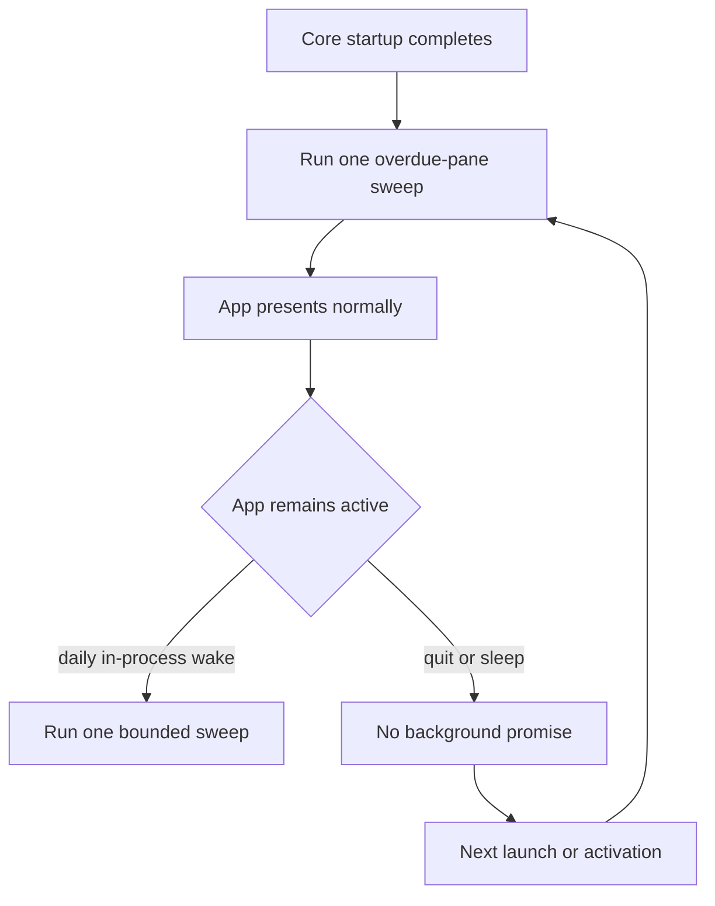
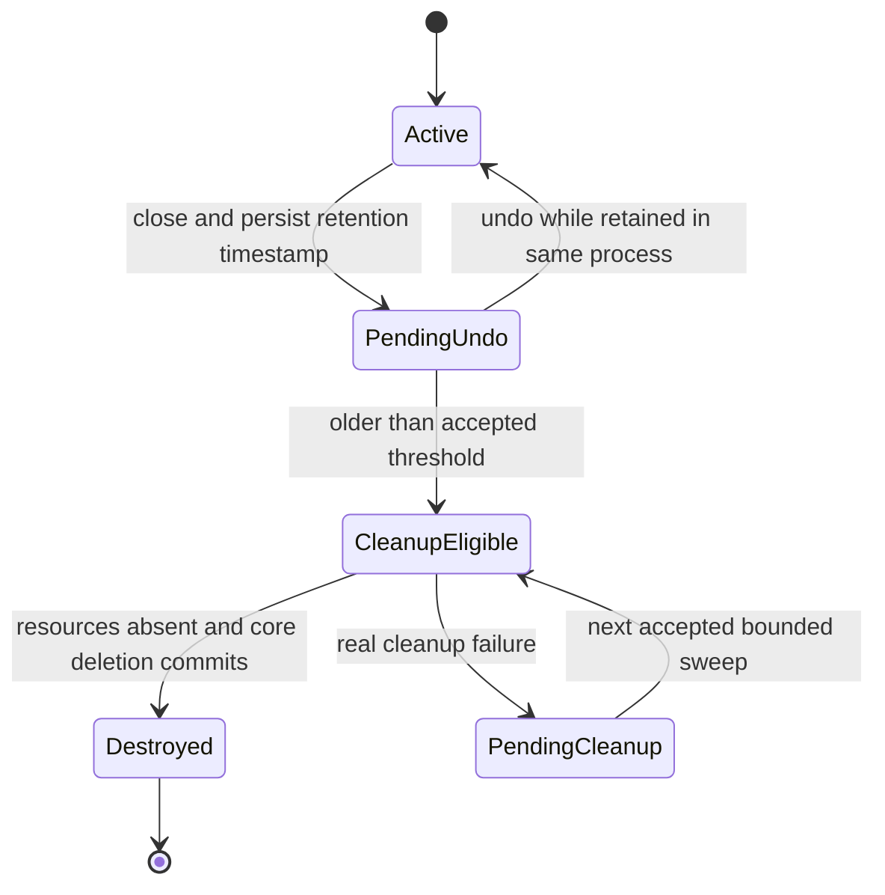

# Pane Retention And Safe Cleanup

Date: 2026-07-22
Status: Stub — discussion only, not ready for planning or implementation
Linear: [LUNA-397](https://linear.app/askluna/issue/LUNA-397/design-pane-retention-and-crash-safe-zmx-cleanup)

## Why this is separate

Persistence ownership and pane cleanup solve different customer problems.

The persistence hard cut decides which database owns topology, composition,
and local preferences. This follow-up decides how long a closed pane remains
recoverable and how AgentStudio eventually retires its UI, Ghostty, runtime,
and ZMX resources without losing the stored terminal identity during a crash.

Keeping this separate prevents cleanup scheduling and cross-resource lifecycle
work from expanding the core/local SQLite hard cut.

## Customer problem

AgentStudio currently has more than one close/cleanup authority:

- `WorkspaceSurfaceCoordinator` owns an in-memory undo stack bounded by count;
- `SurfaceManager` owns a separate five-minute surface expiry;
- production close paths do not consistently persist `pendingUndo`;
- a pane row, Ghostty surface, runtime entry, and ZMX session can outlive one
  another;
- deleting the pane/content row also deletes the only durable copy of its
  `ZmxSessionID`.

The customer-visible failure is either accumulated background resources or a
pane that cannot be restored/cleaned coherently after a crash.

## Working direction, not yet requirements

The current idea is intentionally small:

1. Closed panes become invisible durable `pendingUndo` rows while retained.
2. Retention may be one day rather than the earlier 15-minute proposal.
3. Cleanup runs as a bounded sweep rather than one timer/task per pane.
4. The app sweeps on startup and at most once per day while it remains active.
5. The durable pane/content row keeps the stored `ZmxSessionID` until terminal
   cleanup is confirmed.
6. Cleanup is subtree-based: a parent pane and its owned drawer children are
   evaluated and finalized together.
7. `WorkspaceSurfaceCoordinator` remains the sequencing owner. Atoms remain
   state or pure derived state; they do not schedule cleanup or perform I/O.
8. SQLite, waiting, collection work, and ZMX subprocess calls remain off the
   MainActor. MainActor only captures a bounded request and applies prepared UI
   state.

No item above is accepted until the open decisions below are resolved.

## Proposed scheduling shape

AgentStudio does not need an exact cron daemon for this problem. Cleanup may
run late safely because the rule is “older than the retention threshold,” not
“must run at midnight.”



The likely Swift implementation is one lifecycle-owned task using an injected
`Clock` for process-local waiting, plus mandatory startup/activation checks.
It must not create a task or timer per pane. Tests use an injected clock and
state/event waits, never wall-clock sleeps.

`NSBackgroundActivityScheduler` is available on macOS for opportunistic work,
but it does not provide an exact daily execution guarantee and is unnecessary
if next-launch cleanup is acceptable. A `launchd` helper would add installation,
authorization, lifecycle, and support complexity and is outside this design.

The current repository toolchain reports Swift 6.2.4. The design should use
stable Swift concurrency/Clock concepts rather than depend on an assumed Swift
6.4-only API.

## Identity-preserving cleanup sequence under discussion

```mermaid
sequenceDiagram
    participant UI as MainActor coordinator
    participant Core as core.sqlite actor
    participant Worker as cleanup worker
    participant ZMX as ZmxBackend

    UI->>Core: persist closed subtree as pendingUndo
    Core-->>UI: committed with stored ZmxSessionID values

    Note over UI,Core: Later: startup or daily sweep finds rows older than threshold

    UI->>Worker: immutable subtree cleanup request
    Worker->>ZMX: destroySessionByID(stored typed ID)
    alt cleanup succeeds or session already absent
        ZMX-->>Worker: success
        Worker->>Core: delete finalized pane/content subtree
        Core-->>UI: committed
    else real backend failure
        ZMX-->>Worker: failure
        Worker-->>UI: diagnosed failure; exact policy still open
        Note over Core: Do not lose the only durable ZMX identity
    end
```

The load-bearing invariant is:

```text
The last durable copy of ZmxSessionID is never deleted before the design's
accepted cleanup-success boundary.
```

This does not require a generic receipt, outbox, repair engine, or second
registry. The open question is whether the existing `pendingUndo` row remains
as an invisible cleanup tombstone after a real backend failure, and when the
next bounded retry is allowed.

## Candidate state model



`CleanupEligible` and `PendingCleanup` are conceptual states in this stub, not
accepted new persisted enum cases. The smallest implementation may express both
with an expired `pendingUndo` row and coordinator-local execution state.

## Open decisions

1. Retention policy:
   - exactly 24 hours from close;
   - “older than one day” evaluated by a daily sweep;
   - another customer-facing undo period.
2. Wake policy:
   - startup plus one in-process daily sweep;
   - also sweep whenever the app becomes active after a long sleep;
   - opportunistic `NSBackgroundActivityScheduler` work.
3. Real ZMX cleanup failure:
   - keep the invisible expired `pendingUndo` row and stored ID until a later
     bounded sweep succeeds;
   - another explicitly accepted failure contract.
4. Undo scope:
   - whether undo is available for the full retention period;
   - whether retention for cleanup and the interactive undo window are separate
     durations.
5. Capacity:
   - whether a hard cap may finalize old entries before the age threshold;
   - whether age alone is sufficient.

## Constraints already accepted

- New ZMX identities use UUIDv7; restored stored text is used unchanged.
- ZMX identity comes only from stored terminal content, never pane paths or
  derived strings.
- Parent and owned drawer-child resources finalize together.
- Worktree/repository disappearance never triggers pane cleanup.
- No per-pane task fleet, generic scheduler framework, repair engine, receipt
  protocol, replay system, or durable undo-layout snapshot.
- No Ghostty or zmx source changes.
- No cleanup work proportional to all repositories or watched folders on the
  MainActor.
- No new ad hoc proof scripts.

## Proof shape to retain when this becomes a real spec

- injected-clock unit proof for age eligibility and undo;
- SQLite integration proof that retained rows preserve exact ZMX IDs;
- crash-boundary tests before/during/after cleanup and core deletion;
- one bounded-sweep proof for parent/drawer subtrees;
- real ZMX E2E proof that confirmed cleanup removes every stored session;
- failure proof that a backend error does not make a pane visible and does not
  discard the last durable ZMX identity;
- startup/activation proof without wall-clock sleeps;
- MainActor boundedness proof;
- OTLP redaction proof for paths, pane/session IDs, content, and backend output.

## Non-goals

- Changing the core/global topology ownership hard cut.
- Migrating or importing old local SQLite/JSON state.
- Exact wall-clock cron execution while AgentStudio is not running.
- A helper daemon or `launchd` installation.
- Multi-window design.
- EventBus, Ghostty callback, filesystem watcher, or Git redesign.
- Agent lifecycle detection, screen parsing, or Herdr integration.
