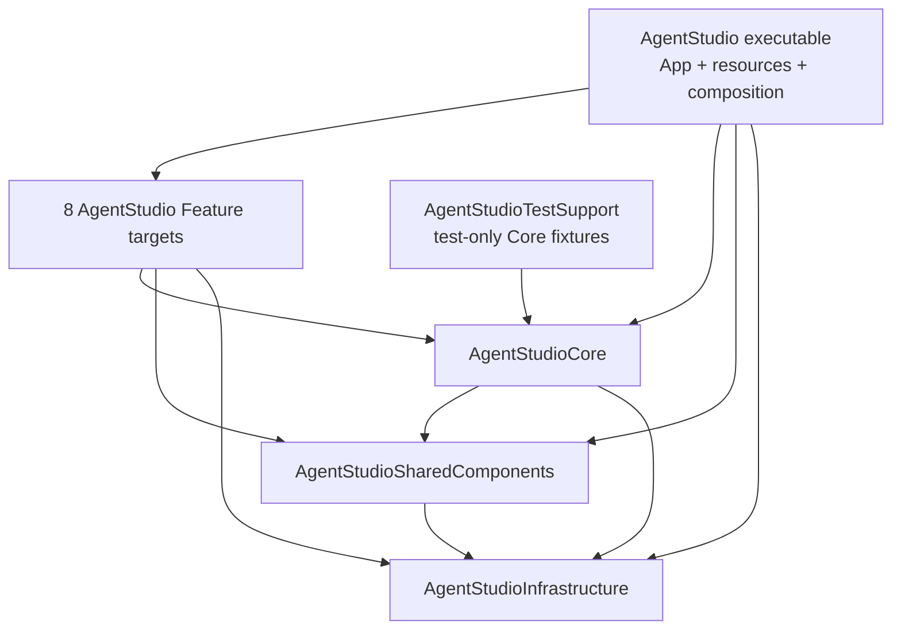

# AgentStudio SwiftPM Target Modularization Plan

Date: 2026-07-27
Status: accepted after one focused review; ownership corrections synchronized
Stacked base: `fix-tests` at `daadf1a1135095749bbb4404008c6b94161ac915`
Implementation branch: `swiftpm-target-modularization`

## Outcome

Turn the existing ownership folders into one compiler-visible SwiftPM target
graph without changing product behavior beyond retiring the unused Worktrunk
startup installation offer:



The result remains one package, one executable, one resource bundle, one
coarse Core, one target per existing Feature, and one paired test target per
product target. The stacked pull request targets `fix-tests` and is not merged
by this goal.

## Source Contract and Coverage

The plan implements:

- all 732 lines of
  `docs/specs/2026-07-23-swiftpm-target-modularization/2026-07-23-swiftpm-target-modularization.md`;
- all 1,403 lines of
  `docs/specs/2026-07-25-core-atom-scope-feature-injection/2026-07-25-core-atom-scope-feature-injection.md`;
- TM-01 through TM-20;
- the user's required pure `git mv` checkpoint before semantic edits;
- one plan review, one implementation review, and one consolidated broad final
  proof cycle.

The state precursor already moved the seven pane-hosting files and
`WorkspaceSettingsStore` into App. This plan does not move them again.

## Hard Scope Boundary

Do not add:

- another package, product target, App target, Core subtarget, or Feature
  subtarget;
- a resolver, service locator, runtime registry, Feature ambient scope,
  generalized dependency-injection framework, or compatibility layer;
- Feature resource bundles or a changed packaged resource path;
- selective-test infrastructure, caching infrastructure, a benchmark
  framework, or new performance instrumentation;
- IPC, vendor, persistence-schema, signing, notarization, release-channel, or
  user-visible behavior changes beyond the spec-required Worktrunk retirement.

Use `package` access by default. Do not solve compiler errors through blanket
`public` promotion.

## Realized Target Map

### Product targets

| Target | SwiftPM path | Internal dependencies |
| --- | --- | --- |
| `AgentStudioInfrastructure` | `Sources/AgentStudio/Infrastructure` | none |
| `AgentStudioSharedComponents` | `Sources/AgentStudio/SharedComponents` | Infrastructure |
| `AgentStudioCore` | `Sources/AgentStudio/Core` | SharedComponents, Infrastructure |
| `AgentStudioBridge` | `Sources/AgentStudio/Features/Bridge` | Core, SharedComponents, Infrastructure |
| `AgentStudioCodeViewer` | `Sources/AgentStudio/Features/CodeViewer` | Core, SharedComponents, Infrastructure |
| `AgentStudioCommandBar` | `Sources/AgentStudio/Features/CommandBar` | Core, SharedComponents, Infrastructure |
| `AgentStudioEditorChooser` | `Sources/AgentStudio/Features/EditorChooser` | Core, SharedComponents, Infrastructure |
| `AgentStudioInboxNotification` | `Sources/AgentStudio/Features/InboxNotification` | Core, SharedComponents, Infrastructure |
| `AgentStudioRepoExplorer` | `Sources/AgentStudio/Features/RepoExplorer` | Core, SharedComponents, Infrastructure |
| `AgentStudioTerminal` | `Sources/AgentStudio/Features/Terminal` | Core, SharedComponents, Infrastructure, `GhosttyKit` |
| `AgentStudioWebview` | `Sources/AgentStudio/Features/Webview` | Core, SharedComponents, Infrastructure |
| `AgentStudio` | `Sources/AgentStudio`, excluding lower target paths | all Feature/lower targets, existing IPC targets, resources, final-link settings |

Every target declares only products it directly imports. Known external
ownership starts as:

- Infrastructure: GRDB, AgentStudioGit, Logging, Metrics, Tracing, OpenTelemetry,
  and ServiceLifecycle as required by current imports;
- Core: GRDB and AgentStudioGit as required by current imports;
- Bridge: AgentStudioGit and AgentStudioProgrammaticControl as required by
  current imports;
- InboxNotification: GRDB;
- Terminal: GhosttyKit;
- App: existing IPC products, AgentStudioProgrammaticControl, GhosttyKit, and
  final linker settings.

Replicate `.swiftLanguageMode(.v6)` on every new source, test-support, and test
target.

### Test targets

| Test target | Path | Required dependency shape |
| --- | --- | --- |
| `AgentStudioInfrastructureTests` | `Tests/AgentStudioTests/Infrastructure` | Infrastructure only |
| `AgentStudioSharedComponentsTests` | `Tests/AgentStudioTests/SharedComponents` | SharedComponents and permitted Infrastructure helpers; no TestSupport |
| `AgentStudioCoreTests` | `Tests/AgentStudioTests/Core` | Core, permitted lower targets, TestSupport |
| `AgentStudioBridgeTests` | `Tests/AgentStudioTests/Features/Bridge` | Bridge, permitted lower targets, TestSupport |
| `AgentStudioCodeViewerTests` | `Tests/AgentStudioTests/Features/CodeViewer` | CodeViewer, permitted lower targets, TestSupport when needed |
| `AgentStudioCommandBarTests` | `Tests/AgentStudioTests/Features/CommandBar` | CommandBar, permitted lower targets, TestSupport |
| `AgentStudioEditorChooserTests` | `Tests/AgentStudioTests/Features/EditorChooser` | EditorChooser, permitted lower targets, TestSupport |
| `AgentStudioInboxNotificationTests` | `Tests/AgentStudioTests/Features/InboxNotification` | InboxNotification, permitted lower targets, TestSupport |
| `AgentStudioRepoExplorerTests` | `Tests/AgentStudioTests/Features/RepoExplorer` | RepoExplorer, permitted lower targets, TestSupport |
| `AgentStudioTerminalTests` | `Tests/AgentStudioTests/Features/Terminal` | Terminal, permitted lower targets, TestSupport |
| `AgentStudioWebviewTests` | `Tests/AgentStudioTests/Features/Webview` | Webview, permitted lower targets, TestSupport |
| `AgentStudioTests` | explicit App, Architecture, Integration, Scripts, Helpers, and fixture sources | executable, all Feature/lower targets, TestSupport |

`AgentStudioTestSupport` is a regular test-only target at
`Tests/AgentStudioTests/TestSupport`. It depends only on Core and owns the sole
package-process Core fallback installer plus reusable Core fixture helpers. It
does not own an App-root factory or Feature fixture.

The default aggregate SwiftPM test product remains mandatory. Focused filters
select execution after aggregate compilation; they are not treated as
selective compilation.

## Execution DAG

```text
G0  exact branch/base, clean source state, accepted plan, debug sidebar baseline
 |
M0  pure git mv only
 |   verify every listed path is R100; commit before any source edit
 |
S1  semantic lower-owner seams while the package is still one app module
|   command/event, sibling seams, telemetry, resources, residual ownership,
|   Worktrunk retirement
 |
G1  focused preservation tests in the monolithic module
 |
S2  product targets bottom-up
 |   Infrastructure -> SharedComponents -> Core -> Features -> App
 |
S3  TestSupport, paired test targets, helper/test partition, lane parity
 |
S4  architecture lint and docs synchronize with the realized compiler graph
 |
G2  one consolidated final proof at one exact HEAD
 |
R1  one implementation-review cycle; address accepted findings once
 |
PR  stacked PR against fix-tests; checks/comments/threads/mergeability/head proof
```

M0 is exclusive. No agent or lane may make semantic edits until its move-only
commit exists. `Package.swift`, App command composition, test-support
installation, and final App integration each have one write owner. Feature
work may run in parallel only after lower APIs are frozen and only across
disjoint Feature/test directories.

## G0 — Re-anchor and Capture the Existing Baseline

Before product edits:

1. Record branch, exact base, exact HEAD, and `git status --short`.
2. Verify every source/test move and semantic deletion below still exists and
   every destination owner matches the accepted spec.
3. Record the current 114 Core-scope helper consumers by owner:
   55 App, 18 Core, 37 Feature, and four Integration files.
4. Run the existing sidebar workload in baseline mode:

   ```bash
   mise run observability:up
   /bin/bash scripts/verify-sidebar-performance-workload.sh --baseline
   ```

5. Preserve the workload's source HEAD, worktree identity, configuration,
   marker, sample counts, and comparator artifact. Do not run or invent a
   release-runtime benchmark.

Baseline capture is evidence, not a speed claim.

## M0 — Exact Pure-Move Commit

Perform only `git mv`. Create needed directories, then verify
`git diff --summary` reports only the expected renames at `R100`. Commit before
changing imports, declarations, access control, manifest entries, or tests.

### Product source moves

| From | To |
| --- | --- |
| `App/Commands/AppCommand.swift` | `Core/Actions/Commands/AppCommand.swift` |
| `App/Commands/AppCommand+Catalog.swift` | `Core/Actions/Commands/AppCommand+Catalog.swift` |
| `App/Commands/AppCommand+CatalogHelpers.swift` | `Core/Actions/Commands/AppCommand+CatalogHelpers.swift` |
| `App/Commands/AppCommand+CommandBarGroupPriority.swift` | `Core/Actions/Commands/AppCommand+CommandBarGroupPriority.swift` |
| `App/Commands/AppCommand+DisplayDescriptor.swift` | `Core/Actions/Commands/AppCommand+DisplayDescriptor.swift` |
| `App/Commands/AppCommand+OrdinalShortcuts.swift` | `Core/Actions/Commands/AppCommand+OrdinalShortcuts.swift` |
| `App/Commands/AppShortcut.swift` | `Core/Actions/Commands/AppShortcut.swift` |
| `App/Commands/AppShortcutDispatchPolicy.swift` | `Core/Actions/Commands/AppShortcutDispatchPolicy.swift` |
| `App/Events/AppEvent.swift` | `Core/RuntimeEventSystem/Events/AppEvent.swift` |
| `App/Events/AppEventBus.swift` | `Core/RuntimeEventSystem/Events/AppEventBus.swift` |
| `Features/Bridge/Runtime/BridgePaneCommandResolver.swift` | `Core/Actions/BridgePaneCommandResolver.swift` |
| `Features/Webview/WebviewDialogHandler.swift` | `Infrastructure/WebKit/WebviewDialogHandler.swift` |
| `Features/CommandBar/CommandBarSearch.swift` | `Infrastructure/Search/CommandBarSearch.swift` |
| `Infrastructure/Extensions/Bundle+AppResources.swift` | `App/Boot/Bundle+AppResources.swift` |
| `Features/Bridge/Models/Telemetry/BridgeTelemetryPlane.swift` | `Infrastructure/Diagnostics/BridgeTelemetryPlane.swift` |
| `Features/Bridge/Models/Telemetry/BridgeTelemetryPriority.swift` | `Infrastructure/Diagnostics/BridgeTelemetryPriority.swift` |
| `Features/Bridge/Models/Telemetry/BridgeTelemetrySlice.swift` | `Infrastructure/Diagnostics/BridgeTelemetrySlice.swift` |
| `Features/Bridge/Models/Telemetry/BridgeTelemetryDropReason.swift` | `Infrastructure/Diagnostics/BridgeTelemetryDropReason.swift` |
| `Features/Bridge/Runtime/Telemetry/BridgeTelemetryEventValidator+Allowlists.swift` | `Infrastructure/Diagnostics/BridgeTelemetryWireSchema+Allowlists.swift` |
| `Features/Bridge/Runtime/Telemetry/BridgeTelemetryEventValidator+AuxiliaryContracts.swift` | `Infrastructure/Diagnostics/BridgeTelemetryWireSchema+AuxiliaryContracts.swift` |
| `Features/Bridge/Runtime/Telemetry/BridgeTelemetryEventValidator+BrowserEventContracts.swift` | `Infrastructure/Diagnostics/BridgeTelemetryWireSchema+BrowserEventContracts.swift` |
| `Features/Bridge/Runtime/Telemetry/BridgeTelemetryEventValidator+ClickLatencyContracts.swift` | `Infrastructure/Diagnostics/BridgeTelemetryWireSchema+ClickLatencyContracts.swift` |
| `Features/Bridge/Runtime/Telemetry/BridgeTelemetryEventValidator+ViewerSamples.swift` | `Infrastructure/Diagnostics/BridgeTelemetryWireSchema+ViewerContracts.swift` |
| `Features/Bridge/Runtime/Telemetry/BridgeTelemetryEventValidator+WorktreeFileContracts.swift` | `Infrastructure/Diagnostics/BridgeTelemetryWireSchema+WorktreeFileContracts.swift` |
| `Core/RuntimeEventSystem/Diagnostics/RuntimeDeliveryPerformanceReporter.swift` | `Infrastructure/Diagnostics/RuntimeDeliveryPerformanceReporter.swift` |
| `Core/RuntimeEventSystem/Filesystem/FilesystemPathCanonicalizer.swift` | `Infrastructure/Filesystem/FilesystemPathCanonicalizer.swift` |
| `Core/RuntimeEventSystem/Filesystem/FilesystemSourceConfiguration.swift` | `Infrastructure/Filesystem/FilesystemSourceConfiguration.swift` |
| `Core/RuntimeEventSystem/Filesystem/FilesystemSourceTypes.swift` | `Infrastructure/Filesystem/FilesystemSourceTypes.swift` |
| `Infrastructure/PaneFocus/PaneCommandFocusDecider.swift` | `Core/PaneFocus/PaneCommandFocusDecider.swift` |
| `Infrastructure/PaneFocus/PaneContentClickFocusDecider.swift` | `Core/PaneFocus/PaneContentClickFocusDecider.swift` |
| `Infrastructure/PaneFocus/PaneDrawerFocusDecider.swift` | `Core/PaneFocus/PaneDrawerFocusDecider.swift` |
| `Infrastructure/PaneFocus/PaneFocusContext.swift` | `Core/PaneFocus/PaneFocusContext.swift` |
| `Infrastructure/PaneFocus/PaneFocusDecision.swift` | `Core/PaneFocus/PaneFocusDecision.swift` |
| `Infrastructure/PaneFocus/PaneFocusHandlers.swift` | `Core/PaneFocus/PaneFocusHandlers.swift` |
| `Infrastructure/PaneFocus/PaneFocusOrchestrator.swift` | `Core/PaneFocus/PaneFocusOrchestrator.swift` |
| `Infrastructure/PaneFocus/PaneFocusTrigger.swift` | `Core/PaneFocus/PaneFocusTrigger.swift` |
| `Infrastructure/PaneFocus/PaneKeyboardFocusDecider.swift` | `Core/PaneFocus/PaneKeyboardFocusDecider.swift` |
| `Infrastructure/PaneFocus/PaneModeFocusDecider.swift` | `Core/PaneFocus/PaneModeFocusDecider.swift` |
| `Infrastructure/PaneFocus/PaneRefocusRequestFocusDecider.swift` | `Core/PaneFocus/PaneRefocusRequestFocusDecider.swift` |
| `Infrastructure/PaneFocus/PaneTabClickFocusDecider.swift` | `Core/PaneFocus/PaneTabClickFocusDecider.swift` |
| `Infrastructure/PaneFocus/WorkspaceFocusOwnerNormalizer.swift` | `Core/PaneFocus/WorkspaceFocusOwnerNormalizer.swift` |

Files that deliberately stay App-owned include
`AppCommand+IPCProjection.swift`, `PaneFocusAppControl.swift`,
`WorkspaceActionExecutor.swift`, the concrete dispatcher/execution behavior
that is extracted back from the moved command files in S1, and all App pane
hosting already moved by the precursor.

`BridgeTelemetryEventValidator.swift`, its result/sample/scope/trace-context
types, `BridgeTelemetryScopeGate`, and runtime telemetry orchestration remain
Bridge-owned.

### Test and helper moves

| From | To / later semantic split |
| --- | --- |
| `Core/Views/CodeViewerPaneMountViewTests.swift` | `Features/CodeViewer/CodeViewerPaneMountViewTests.swift` |
| `Core/Stores/WorkspaceUIStoreTests.swift` | `Features/EditorChooser/EditorChooserStateTests.swift`; S3 extracts its one Core sidebar test |
| `Features/Bridge/BridgePaneCommandResolverTests.swift` | `Core/Actions/BridgePaneCommandResolverTests.swift` |
| `Features/CommandBar/CommandBarSearchTests.swift` | `Infrastructure/Search/CommandBarSearchTests.swift`; S3 returns item ranking/filter tests to CommandBar |
| `App/ShortcutCatalogTests.swift` | `Core/Actions/ShortcutCatalogTests.swift`; S3 returns concrete-dispatcher assertions to App |
| `App/TerminalAppOwnedShortcutPolicyTests.swift` | `Core/Actions/AppShortcutDispatchPolicyTests.swift` |
| `Helpers/BridgeGitReadSchedulerTestFixtures.swift` | `Features/Bridge/TestSupport/BridgeGitReadSchedulerTestFixtures.swift` |
| `Helpers/CommandBarFactories.swift` | `Features/CommandBar/TestSupport/CommandBarFactories.swift` |
| `Helpers/ControllableFSEventStreamClient.swift` | `TestSupport/ControllableFSEventStreamClient.swift` |
| `Helpers/EventBusHarness.swift` | `TestSupport/EventBusHarness.swift` |
| `Helpers/FilesystemTestGitRepo.swift` | `TestSupport/FilesystemTestGitRepo.swift` |
| `Helpers/MockTab.swift` | `TestSupport/MockTab.swift` |
| `Helpers/ModelFactories.swift` | `TestSupport/ModelFactories.swift` |
| `Helpers/PaneArrangementStateTestAdapters.swift` | `TestSupport/PaneArrangementStateTestAdapters.swift` |
| `Helpers/RuntimeEnvelopeHarness.swift` | `TestSupport/RuntimeEnvelopeHarness.swift` |
| `Helpers/TestAtomRegistry.swift` | `TestSupport/TestAtomRegistry.swift`; S3 returns the complete App-root factory to App tests |
| `Helpers/TestPathResolver.swift` | `TestSupport/TestPathResolver.swift` |
| `Helpers/TestPushClock.swift` | `TestSupport/TestPushClock.swift`; Infrastructure receives its own dependency-free local clock fixture in S3 |
| `Helpers/WorkspaceStoreTestAccess.swift` | `TestSupport/WorkspaceStoreTestAccess.swift` |
| `Helpers/MockProcessExecutor.swift` | `Core/TestSupport/MockProcessExecutor.swift` |
| `Core/PaneRuntime/Diagnostics/RuntimeDeliveryPerformanceReporterTests.swift` | `Infrastructure/Diagnostics/RuntimeDeliveryPerformanceReporterTests.swift` |
| `Core/PaneRuntime/Sources/FilesystemSourceConfigurationTests.swift` | `Infrastructure/Filesystem/FilesystemSourceConfigurationTests.swift` |
| `App/Panes/Focus/PaneCommandFocusDeciderTests.swift` | `Core/PaneFocus/PaneCommandFocusDeciderTests.swift` |
| `App/Panes/Focus/PaneContentClickFocusDeciderTests.swift` | `Core/PaneFocus/PaneContentClickFocusDeciderTests.swift` |
| `App/Panes/Focus/PaneDrawerFocusDeciderTests.swift` | `Core/PaneFocus/PaneDrawerFocusDeciderTests.swift` |
| `App/Panes/Focus/PaneFocusOrchestratorTests.swift` | `Core/PaneFocus/PaneFocusOrchestratorTests.swift` |
| `App/Panes/Focus/PaneKeyboardFocusDeciderTests.swift` | `Core/PaneFocus/PaneKeyboardFocusDeciderTests.swift` |
| `App/Panes/Focus/PaneModeFocusDeciderTests.swift` | `Core/PaneFocus/PaneModeFocusDeciderTests.swift` |
| `App/Panes/Focus/PaneRefocusRequestFocusDeciderTests.swift` | `Core/PaneFocus/PaneRefocusRequestFocusDeciderTests.swift` |
| `App/Panes/Focus/PaneTabClickFocusDeciderTests.swift` | `Core/PaneFocus/PaneTabClickFocusDeciderTests.swift` |
| `Core/Views/TabBarAdapterTests.swift` | `App/Panes/TabBarAdapterTests.swift` |
| `Core/Actions/DrawerCommandIntegrationTests.swift` | `App/Panes/DrawerCommandIntegrationTests.swift` |
| `Core/Stores/WorkspaceSQLiteStoreBridgeRepairTests.swift` | `App/State/WorkspaceSQLiteStoreBridgeRepairTests.swift` |
| `Core/Stores/WorkspaceLocalNotificationClaimMigrationTests.swift` | `Features/InboxNotification/State/WorkspaceLocalNotificationClaimMigrationTests.swift` |
| `Core/Stores/WorkspaceLocalSchemaContractTests.swift` | `Features/InboxNotification/State/WorkspaceLocalSchemaContractTests.swift` |

Do not force shared files with genuinely different dependency closures into
TestSupport. `NSEventTestHelpers.swift`,
`ShellGitWorkingTreeStatusProvider.swift`, and mixed App/Core/Feature helpers
are partitioned semantically in S3 so Infrastructure and SharedComponents
tests never import TestSupport. App/integration-only helpers remain under
`Helpers`.

Move the complete serialized WebKit suite into the executable integration test
target without changing suite membership:

- `Features/Bridge/WebKitSerializedTests.swift` becomes
  `App/WebKit/WebKitSerializedTests.swift`;
- every current Bridge WebKit test under
  `Tests/AgentStudioTests/Features/Bridge` becomes
  `Tests/AgentStudioTests/App/WebKit/Bridge/<same-name>`;
- `Features/Webview/WebviewPaneControllerTests.swift` becomes
  `App/WebKit/Webview/WebviewPaneControllerTests.swift`.

The exact Bridge `<same-name>` set is:

- `BridgeContentWorldIsolationTests.swift`
- `BridgePaneControllerContentAuthorityTests.swift`
- `BridgePaneControllerDiffLoadTests.swift`
- `BridgePaneControllerIPCProjectionTests.swift`
- `BridgePaneControllerIPCRenderStateDiagnosticsTests.swift`
- `BridgePaneControllerInitialLoadTests.swift`
- `BridgePaneControllerProductBootstrapDeliveryTests.swift`
- `BridgePaneControllerRealGitReviewLoadTests.swift`
- `BridgePaneControllerRefreshAdmissionIntegrationTests.swift`
- `BridgePaneControllerTelemetryBootstrapDeliveryTests.swift`
- `BridgePaneControllerTelemetryTests.swift`
- `BridgePaneControllerTests.swift`
- `BridgePaneProductActiveViewerModeTests.swift`
- `BridgeProductRealGitFileAndReviewWebKitLiveProof.swift`
- `BridgeProductRealGitFileAndReviewWebKitTests.swift`
- `BridgeProductReviewIntakeLockOrderTests.swift`
- `BridgeProductStreamWebKitFeasibilityWebKitTests.swift`
- `BridgeReviewContentStreamTransportTests.swift`
- `BridgeSchemeHandlerSpikeTests.swift`
- `BridgeTransportIntegrationTests.swift`
- `BridgeWebKitSpikeTests.swift`

Existing App WebKit, E2E, and zmx tests remain where they are.

Do not move or edit Worktrunk files during M0. Its source and two dedicated
tests are semantic deletions in S1.6.

Move proof:

```bash
git status --short
git diff --summary
git diff --name-status --find-renames=100%
git diff --check
```

Stop if any row is not `R100`, a destination implies a new target, or moving a
file requires changing its contents.

## S1 — Close the Lower-Owner Seams in the Monolithic Module

S1 changes ownership APIs while everything still compiles as the existing
single `AgentStudio` module. This isolates semantic debugging from SwiftPM
access/import debugging.

### S1.1 Command, shortcut, and App-event boundary

1. Keep in Core:
   - `AppCommand`, `SearchItemType`, `AppCommandSpec`, Feature-free catalog and
     display metadata;
   - `AppShortcut`, shortcut specs/triggers/contexts/decoder, dispatch policy;
   - `AppEvent`, `AppEventBus`;
   - a new `@MainActor AppCommandDispatching` protocol containing only the
     accepted Feature-facing operations.
2. Extract back to App:
   - `KeyBinding` AppKit menu adaptation;
   - `WorkspaceCommandHandling`, `ShellCommandHandling`;
   - `AppCommandExecutionRequest`, context, arguments, result, and raw argument
     decoding;
   - `AppCommandDispatcher`;
   - `AppCommandIPCSpec` and all AgentStudioProgrammaticControl metadata.
3. Make the Core catalog contain no IPC type and no concrete Feature enum.
4. Inject `any AppCommandDispatching` into current CommandBar, Terminal,
   RepoExplorer, and InboxNotification entry points.
5. Give RepoExplorer typed callbacks for visibility/sort/refresh and
   InboxNotification typed callbacks for row filter/content mode. App adapts
   those callbacks to Feature-typed execution requests.
6. Remove every Feature reference to `AppCommandDispatcher.shared` or the
   concrete dispatcher.

Red/green:

- add protocol-fake tests for Feature invocation and availability before the
  Feature cutover;
- add Core catalog tests proving no IPC/Feature values are required;
- retain App integration tests for IPC overlay decoding and concrete dispatch.

Replan if the protocol must carry `AppCommandExecutionRequest`, a Feature enum,
or a generalized dependency container.

### S1.2 Sibling-Feature seams

1. Split `CommandBarSearch.swift`:
   - Infrastructure keeps `FuzzyMatchResult`, the fuzzy algorithm, ranges, and
     shared threshold;
   - CommandBar keeps `CommandBarItem` scoring, recency, filtering, ranking,
     and performance tracing;
   - Webview calls only the Infrastructure fuzzy primitive.
2. Keep the moved `WebviewDialogHandler` as the default Infrastructure WebKit
   conformance; Bridge and Webview import it without importing each other.
3. Keep Bridge pane candidate/resolution/target/reuse selection in Core.
   Replace the `BridgeProductSurface` label input with the Core-owned
   `AppCommand` presentation mapping. Bridge product surfaces stay in Bridge.

Move existing tests with their owner and split mixed tests at the same seam.
Do not add a broker, registry, or new target.

### S1.3 Telemetry wire schema

1. Convert the six moved validator-extension files into one
   `BridgeTelemetryWireSchema` namespace split across responsibility-named
   extensions.
2. The schema accepts only event name, optional duration, and primitive
   string/numeric/Boolean dictionaries.
3. Keep raw event names, common keys, controlled values, allowed numeric and
   Boolean keys, and event-specific expectations in the schema.
4. Make the schema return `BridgeTelemetryDropReason?`.
5. Make Infrastructure OTLP projection and metrics consume the schema/enums
   directly.
6. Keep Bridge scope admission and sample/runtime validation in
   `BridgeTelemetryEventValidator`, which first applies its scope gate and then
   passes primitive wire fields to the schema.

Add Infrastructure schema tests red-first, then retain Bridge validator and
OTLP projection tests. Replan if any Infrastructure schema declaration names a
Bridge-owned runtime/sample/scope/trace-context type.

### S1.4 Explicit executable resource inputs

Keep `Bundle.appResources` in App and preserve
`AgentStudio_AgentStudio.bundle`.

Use three concrete seams, not a resource container:

1. `OcticonLoader` requires its resource bundle/root. App owns the concrete
   loader and threads it through current icon-rendering entry points. Do not
   add an environment/global configuration API or loader protocol.
2. `SessionConfiguration` resource discovery receives an explicit resource
   bundle/root from `GhosttyStartupEnvironment`; tests pass explicit fixture
   roots.
3. `BridgeAppAssetStore` requires its `BridgeWeb/app` root. App composition
   supplies the packaged root; Bridge tests supply fixture roots.

No lower target calls `Bundle.module`, `Bundle.appResources`, or discovers the
executable bundle by name. Preserve current development, app-bundle, Ghostty,
terminfo, and BridgeWeb behavior with focused fixture tests before target
creation.

### S1.5 Residual Infrastructure/Core ownership

1. Keep the moved runtime-delivery reporter and filesystem authority primitives
   in Infrastructure. Preserve the scanner/executor closure there.
2. Keep primitive trace identity values and storage in Infrastructure.
3. Extract `AgentStudioTraceIdentitySnapshot.from(repos:panes:
   worktreeEnrichments:)` into an App-owned projection beside the current
   AppDelegate refresh path. Give only the primitive initializers needed by App
   `package` access.
4. Keep the moved PaneFocus context, triggers, decisions, deciders, handlers,
   orchestrator, and focus-owner normalizer in Core.
5. Keep `PaneFocusExecutor` and concrete AppKit/Feature-runtime effects in App.
6. Replace remaining Core-to-Feature persistence values with validated raw
   tokens, map them in App-owned `WorkspaceSettingsStore`, keep Inbox claim
   conversion in Inbox, and call Core-owned `GitBranchStatus.status` directly.

Retain focused filesystem authority/scanner, runtime reporter, trace identity,
pure PaneFocus, App executor, malformed-token, and persistence round-trip tests.
Replan if Infrastructure still names a Core type or Core still names a Feature
type after these whole-file/projection corrections.

### S1.6 Retire Worktrunk

Delete:

- `Sources/AgentStudio/Infrastructure/WorktrunkService.swift`;
- `Tests/AgentStudioTests/Infrastructure/WorktrunkParsingTests.swift`;
- `Tests/AgentStudioTests/Infrastructure/WorktrunkServiceParsingTests.swift`;
- `.checkWorktrunkDependency` and its boot dispatch;
- the AppDelegate installation alert, Homebrew AppleScript, and copy-command
  behavior;
- architecture/lint references that claim Worktrunk ownership.

Do not add replacement wiring, production Git CLI/`wt` use, a Homebrew
dependency, or an uninstall action. Update boot-sequence tests red/green for the
removed phase.

## G1 — Monolithic Semantic Gate

Before editing `Package.swift`, run focused tests for:

- command catalog/protocol/dispatcher/IPC overlay;
- shortcut catalog/dispatch policy;
- fuzzy search and CommandBar ranking;
- Bridge pane resolution;
- telemetry wire schema, Bridge validator, and OTLP projection;
- explicit resource roots, Ghostty/terminfo discovery, and Bridge app assets;
- residual filesystem, runtime-reporting, trace-projection, PaneFocus, and
  Feature-free persistence ownership;
- boot sequencing after Worktrunk retirement;
- Core scope/App root identity and existing cross-Feature injection.

Use grouped `mise run test -- --filter ...` commands. Do not run the broad
suite here. The target split begins only after the semantic seams are green in
the monolithic module.

## S2 — Create Product Targets Bottom-Up

### S2.1 Infrastructure and SharedComponents

1. Add both targets and their direct external dependencies.
2. Add explicit imports and `package` access where cross-target use requires
   it.
3. Build Infrastructure, then SharedComponents independently.
4. Update architecture-lint module recognition before suppressing no compiler
   failure.

Stop if Infrastructure needs an internal target or SharedComponents needs
Core, a Feature, App, TestSupport, or ambient product state.

### S2.2 Core

1. Add `AgentStudioCore` with only lower-target dependencies.
2. Apply the full `package` annotation/import cutover for current cross-target
   consumers.
3. Preserve one `CoreAtoms`, one `CoreAtomScope`, and
   `KeyPath<CoreAtoms, Value>` lookup.
4. Compile the complete pure PaneFocus decision surface in Core while App
   remains the only concrete execution owner.
5. Build Core independently.

Stop if Core requires a Feature/App type, a second state scope, or blanket
`public`.

### S2.3 Features

Add and compile each Feature target independently. Declare only permitted lower
targets and directly imported external products. No Feature imports another
Feature or App.

Feature entry points receive:

- Core ambient state only through the accepted Core scope;
- their own mutable Feature state explicitly;
- sibling facts as the accepted consumer-owned closure/snapshot;
- App command capability through `any AppCommandDispatching` plus the two
  narrow Feature-typed callback groups;
- explicit resource inputs where needed.

Stop if a Feature needs a sibling import, concrete App dispatcher, App root,
Feature ambient scope, or new shared target.

### S2.4 App executable

Keep one executable target containing:

- `main.swift`, `AtomRegistry.swift`, all `App/**`, and `Resources/**`;
- concrete Feature/App composition and pane hosting;
- App command execution and IPC overlay;
- cross-Feature settings/state wiring;
- existing resources and distribution/linker settings.

Wire the already accepted App-owned concrete Feature state and pane-host inputs.
Run `mise run build` once after the App closes the graph.

## S3 — TestSupport, Paired Tests, and Lane Parity

1. Create `AgentStudioTestSupport` as a regular target depending only on Core.
2. Convert moved helpers from `@testable import AgentStudio` to the narrow
   product imports their declarations use.
3. Split `TestAtomRegistry.swift`:
   - TestSupport owns the only fallback guard, Core fixture, and sync/async
     task-local Core overrides;
   - App tests own the complete `AtomRegistry` factory.
4. Partition all 114 current state-helper consumers:
   - Core/Feature module tests use TestSupport Core helpers;
   - App/Integration tests use either Core helpers or the App root according to
     what they prove;
   - no module test constructs the complete App registry.
5. Partition remaining shared helpers by dependency closure. Keep
   Infrastructure and SharedComponents fixtures local; do not make them import
   TestSupport.
6. Create all paired test targets and change every test to import its owner
   module plus only permitted lower modules.
7. Move mixed product tests to `AgentStudioTests` when they prove App,
   cross-Feature, resources, WebKit product integration, zmx, signing, or
   packaged behavior. Keep all WebKit-serialized tests in this one executable
   test module.
8. Preserve permanent exit tests for:
   - access before production setup fails in a fresh process;
   - exact App Core installation succeeds;
   - a second setup fails.
9. Update runner-contract tests before changing runner scripts. The expected
   implementation is that existing aggregate `swift build --build-tests`
   naturally includes every new test target; do not add selective-test
   infrastructure.

Red/green is required for target-parity/runner assertions and the sole fallback
owner check. Mechanical file moves/import changes do not need artificial
behavioral red tests.

Stop if a paired test target requires App, a sibling Feature, a second fallback
installer, or a weakened suite filter.

## S4 — Architecture Lint and Documentation

Update the existing SwiftPM/SwiftSyntax architecture tool and its permanent
good/bad fixtures so lint understands the realized module names and rejects:

- forbidden import directions;
- product state in Infrastructure;
- Feature state in Core or a sibling Feature;
- lower `AtomRegistry` key paths or concrete dispatcher use;
- writable canonical atom storage outside named mutation methods;
- TestSupport use from product, Infrastructure tests, or SharedComponents
  tests;
- Worktrunk service, startup phase, or production `wt`/Git CLI reintroduction.

Synchronize `AGENTS.md`, the architecture index, directory structure, commands,
state, and test-boundary docs with the compiled graph. Do not add shell/`rg`
architecture lint rules for syntax the existing SwiftSyntax tool can own.

## Requirements / Proof Matrix

| Requirement | Owning slice | Proof modality and gate | Evidence source | Freshness guard | Red/green |
| --- | --- | --- | --- | --- | --- |
| TM-01–03 fixed target set, one App, coarse Core | S2 | `swift package dump-package`; target inventory; target builds | parent command receipts | final PR HEAD | no artificial red |
| TM-04 acyclic directions | S1–S4 | compiler target graph plus architecture-lint fixtures | parent build/lint | final source + manifest | fixture red/green |
| TM-05 stateless SharedComponents | S2/S3 | dependency list, lint fixtures, paired tests | parent inspection/tests | final HEAD | fixture red/green |
| TM-06 state boundary | S2/S3 | Core scope, App registry, exit tests, static forbidden-reference checks | parent tests/inspection | fresh child processes | preserve existing + boundary fixtures |
| TM-07 pane ownership | S2/S3 | current App paths, Core contracts, pane-host identity tests | parent tests/inspection | final HEAD | preservation |
| TM-08 App cross-Feature coordination | S2/S3 | settings/state wiring integration tests; no sibling imports | parent tests/compiler | final HEAD | preservation |
| TM-09 resources | S1/S2/G2 | explicit-input tests, Ghostty/Bridge asset tests, packaged bundle | parent tests/bundle proof | fresh bundle | new-input red/green |
| TM-10 runtime/distribution invariants | S2/G2 | diff audit, vendor wiring, package, debug verifier | parent proof | final HEAD + fresh marker | preservation |
| TM-11 package access | S2 | compiler plus added-public inventory | parent diff/build | final HEAD | no artificial red |
| TM-12 paired tests/TestSupport | S3 | manifest symmetry, sole-installer scan, aggregate build, exit tests | parent tests/inspection | fresh aggregate product | parity red/green |
| TM-13 lint/docs agreement | S4/G2 | architecture-tool tests and `mise run lint` | parent proof | final HEAD | fixture red/green |
| TM-14 no regression/no claim | G0/G2 | existing sidebar baseline/compare plus release/package build | parent workload/bundle proof | same workload/config; exact heads | comparator |
| TM-15 command boundary | S1/S2/S3 | Core protocol/catalog tests, Feature fake tests, App IPC/dispatch integration, static scans | parent tests/compiler | final HEAD | new-contract red/green |
| TM-16 sibling seams | S1/S2/S3 | fuzzy/resolver/dialog tests plus independent Feature builds | parent tests/compiler | final HEAD | preservation except split tests |
| TM-17 telemetry schema | S1/S2/S3 | schema unit tests, Bridge validator tests, OTLP projection tests, static closure scan | parent tests/inspection | final HEAD | schema red/green |
| TM-18 lane parity | S3/G2 | runner contract tests, fresh aggregate prebuild, real default/WebKit/E2E/zmx lanes | parent command receipts/counts | final-HEAD build products | runner red/green |
| TM-19 residual ownership | M0/S1/S2/S3 | independent lower builds; filesystem/reporter/trace/PaneFocus tests; forbidden-reference scans | parent tests/compiler/inspection | final HEAD | preservation plus boundary fixtures |
| TM-20 Worktrunk retirement | S1/S4/G2 | boot-sequence red/green; zero service/prompt/docs/production CLI references | parent tests/diff/lint | final HEAD | boot-contract red/green |

Every row is sized to pass inside this scope. A row becomes a replan trigger
rather than a reason to weaken proof when its required owner or dependency
cannot fit the accepted graph.

## G2 — One Consolidated Final Proof

Run once after implementation is complete and the candidate HEAD is stable.
Focused repairs may rerun the failed focused check; do not repeat the entire
broad cycle unless final-HEAD evidence becomes stale.

### Static and compiler proof

```bash
git status --short
git rev-parse HEAD
swift package dump-package

source scripts/swift-build-slot.sh
swift build --target AgentStudioInfrastructure --build-path "$SWIFT_BUILD_DIR"
swift build --target AgentStudioSharedComponents --build-path "$SWIFT_BUILD_DIR"
swift build --target AgentStudioCore --build-path "$SWIFT_BUILD_DIR"
```

Build every Feature target independently, then use the existing aggregate
prebuild path:

```bash
mise run test-prebuild
```

Record target/test inventory, exit codes, and the exact HEAD.
Also record zero production references to `WorktrunkService`,
`.checkWorktrunkDependency`, the Worktrunk installation prompt, and production
`wt`/Git CLI fallback.

### Automated and quality proof

```bash
mise run build
mise run lint
SWIFT_TEST_INCLUDE_E2E=1 mise run test
mise run test-zmx-e2e
```

The normal test command must report the non-serialized and WebKit lanes plus
the explicitly enabled general E2E lane. The separate zmx command proves its
serialized lane. Record pass/fail counts and exit codes.

### Package/release proof

```bash
mise run create-app-bundle
```

Use the existing task's release build, resource copy, BridgeWeb/Ghostty/terminfo
layout, zmx inclusion, and strict signature verification. This is build/package
proof, not release-runtime performance evidence.

### Background debug runtime proof

```bash
mise run observability:up
mise run run-debug-observability -- --detach
mise run verify-debug-observability
```

Launch only in the background. Use no IPC token escrow for startup/read-only
proof. If a selected manual semantic proof genuinely requires write-capable
IPC, opt in only with `AGENTSTUDIO_IPC_DEBUG_TOKEN_ESCROW=1`; never use unsafe
no-auth. Verify the fresh marker, live PID, deterministic worktree identity,
and Victoria record. Quit only the exact recorded PID when cleanup is needed.

### Existing performance comparison

```bash
/bin/bash scripts/verify-sidebar-performance-workload.sh --compare
```

Compare against G0 with the same configuration and accepted threshold. Report
the result without claiming a speedup and without relabeling it as
release-runtime evidence.

## Review and Pull-Request Closure

1. Run exactly one `implementation-review-swarm` against the final diff and
   proof packet.
2. Parent-verify findings and address accepted blockers/important findings
   once. Do not rerun the review unless a genuine architecture break invalidates
   the reviewed implementation.
3. Re-run only proof made stale by review fixes.
4. Push and open/update a stacked PR with base `fix-tests`.
5. Verify current checks, comments, review threads, mergeability, PR head SHA,
   and exact local/remote head match.
6. Do not merge.

## Recovery and Replan Triggers

The work is recoverable by reverting semantic commits while retaining the
move-only history checkpoint. No persisted data migration or external state
change is planned.

Stop and return to design if:

- Infrastructure needs an internal target;
- Core needs App or a Feature;
- a Feature needs App or a sibling Feature;
- App composition must move below App;
- an additional target/package, resolver, broker, registry, ambient Feature
  scope, compatibility shim, or blanket `public` promotion appears necessary;
- resources require another bundle or packaged path;
- TestSupport cannot remain the sole installer owner with a Core-only
  dependency;
- lane parity requires new selective-test infrastructure;
- IPC, vendor, signing, persistence, release, or product behavior must change;
- Worktrunk retirement grows into replacement worktree UX or uninstalling user
  software;
- the sidebar comparator cannot compare the recorded baseline and candidate
  under the same existing workload.

An out-of-scope proof/environment failure is reported separately; it does not
authorize changes to that layer.

## Plan Completion Receipt

`plan-creation-swarm` is complete when:

- this exact target/test map and move inventory are live-repo verified;
- TM-01 through TM-20 each have an owner and proof gate;
- one focused plan review is incorporated;
- `git diff --check` passes;
- the synchronized accepted spec and plan are committed together;
- the orchestrator records the transition to
  `shravan-dev-workflow:implementation-execute-plan`.
