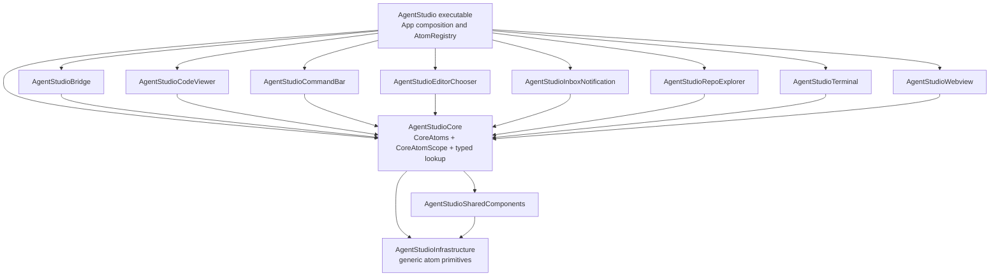
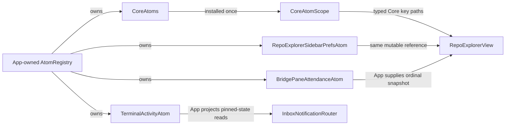
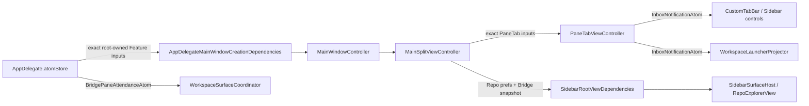
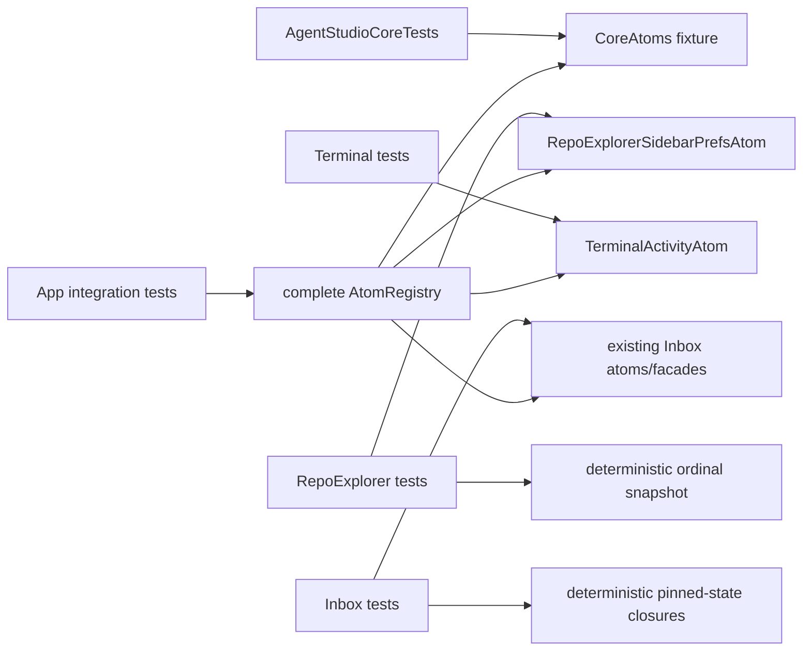

# AgentStudio Core Atom Scope and Explicit Feature State

Date: 2026-07-25
Updated: 2026-07-26
Status: reviewed; planning-ready
Source version: `fix-tests` at `5a7bd64690a3566dcb57fdf4d5a6dd34f9ed056c`

## Decision

Preserve AgentStudio's current atom semantics while changing only the ownership
and access that prevent a SwiftPM target DAG:

- `AgentStudioCore` owns one concrete `CoreAtoms` graph and the typed ambient
  lookup rooted in that graph.
- Each Feature continues to own its existing atom and facade types. A Feature
  does not gain a mandatory aggregate, registry, scope, or universal entry-point
  abstraction.
- The `AgentStudio` executable retains one concrete App-owned `AtomRegistry`.
  It constructs one `CoreAtoms` and the existing concrete Feature atoms and
  facades directly.
- App code does not gain another ambient accessor. `AppDelegate` uses its
  existing root property, and App-owned controllers, coordinators, projectors,
  and views receive the exact Feature atoms or facades they use.
- Feature code receives its own mutable atom or facade through an ordinary
  required initializer when it currently resolves that state ambiently.
- When one Feature needs a fact from another Feature, App supplies the smallest
  read-only closure contract owned by the consumer.
- App owns persistence, validation, and UI composition that span concrete
  Features.

This is a hard cutover. Lower targets do not retain
`KeyPath<AtomRegistry, Value>`, and no compatibility lookup remains.

The design introduces no runtime registration table, resolver key, sealing
operation, dynamic atom discovery, service locator, general dependency-injection
framework, Feature-specific ambient scope, or `*FeatureState` convention.

## Review Map

Read this specification top-down through four questions:

```text
1. Semantics   Do atoms remain canonical observable references with controlled mutation?
      |
      v
2. Boundary    Does only shared Core state remain ambient and statically keyed?
      |
      v
3. Wiring      Does App connect concrete Feature state without a resolver or sibling import?
      |
      v
4. Proof       Can module tests construct only their real state dependencies?
```

At a glance:

```text
changes
  KeyPath<AtomRegistry, Value> in lower code
    -> KeyPath<CoreAtoms, Value> for shared Core state

  two ambient Feature-state reads
    -> required concrete Feature input + one read-only cross-Feature snapshot

  one Core-to-Feature state read
    -> seven-file App-owned concrete pane-hosting cluster

  27 App ambient Feature-state reads
    -> existing App root access or explicit App-owned inputs

preserves
  @Observable push invalidation
  canonical mutable reference identity
  private(set) state and controlled mutation methods
  one production state graph
  MainActor isolation
  task-local Core overrides
  persistence schemas and product behavior

rejects
  runtime atom registration
  a mandatory state aggregate for each Feature
  a universal Feature entry point
  a second ambient scope
  a sibling Feature import
```

## Intent and Success

The current source already has useful atom ownership:

- Core owns shared workspace and shell state.
- Features own capability-specific state.
- App creates the complete graph.
- Swift Observation pushes state changes to interested UI.
- canonical atom state exposes no external setter: stored mutable properties
  are `private(set)` or `private` and change only through named owner methods
  or coordinators.

The modularization problem is not the atom behavior. It is that the generic
access helper and scope in `Infrastructure/AtomLib` name the complete App-owned
`AtomRegistry`. That makes a proposed bottom target depend conceptually on the
executable and allows every source area to reach every Feature atom through the
same ambient root.

Success means:

- lower targets no longer name the App-owned `AtomRegistry`;
- Core key paths remain compiler-checked stored-property access;
- production Core scope has the same setup and task-local behavior as today;
- every Feature retains the same canonical mutable atom instances and mutation
  APIs;
- no caller assigns canonical atom state directly or through a writable
  binding; callers invoke named mutation methods or coordinators;
- a Feature with no registry-owned state receives no new state type;
- a Feature with one atom receives that atom, not an aggregate created for
  symmetry;
- a facade remains only where the existing code has a real multi-atom
  composition, such as `EditorChooserState` and `InboxSidebarState`;
- no Feature imports a sibling Feature to read or mutate state;
- App remains the only owner that can see and connect all concrete Features;
- App-owned subcomponents receive Feature state explicitly and do not resolve
  it through a second ambient scope, singleton, or static registry accessor;
- Feature tests can construct only their actual Feature state plus permitted
  Core fixtures;
- App integration tests can construct and verify the complete graph;
- the resulting state subgraph is acyclic and compatible with the later coarse
  SwiftPM target split;
- the cutover adds no unmeasured build, test, or runtime performance claim.

## Current-State Evidence

All observations below are from the source version in the header.

### Concrete registry and lookup

`Sources/AgentStudio/AtomRegistry.swift` currently contains:

- 44 stored `let` Core and Feature state properties;
- one stored lazy Core-derived reader, `attendedPane`;
- nine Core-derived computed readers;
- same-backing construction and preconditions for composed Core atoms;
- direct construction of the existing `EditorChooserState`,
  `InboxSidebarState`, `WorkspaceSidebarState`, `SidebarCacheState`, and other
  facades.

The concrete root appears in:

- `Infrastructure/AtomLib/Atom.swift`;
- `Infrastructure/AtomLib/AtomScope.swift`;
- `Infrastructure/AtomLib/AtomReader.swift`.

Each uses `AtomRegistry` directly. Targeted source search finds:

- no production use of `@Atom`;
- no direct production or test use of `AtomReader`;
- no production or test construction of `Derived<...>` or
  `DerivedSelector<...>`;
- no production construction of `DerivedValue`, but dedicated memoization
  tests, two compile-failure fixtures, and an architecture-lint contract for
  that generic primitive.

### Ambient call-site inventory

Production contains 198 `atom(\.foo)` calls:

| Source area | Total | Shared Core properties | Feature properties |
| --- | ---: | ---: | ---: |
| App | 118 | 91 | 27 |
| Core | 51 | 50 | 1 |
| Features | 29 | 27 | 2 |

Tests contain another 172 function calls and two `@Atom` uses. `@Atom` has no
production consumer.

App also contains 83 direct `atomStore.property` reads:

- 49 read Feature-owned properties and remain direct root-property access;
- 34 read Core-owned properties and become `atomStore.core.property`.

The 27 App ambient Feature-state reads are not all in code that can reach
`AppDelegate.atomStore`. Their explicit cutover is:

| App owner | Calls | Feature state used | Cutover |
| --- | ---: | --- | --- |
| `AppDelegate` extensions | 9 | Inbox notification, preferences, and sidebar state | use the existing `atomStore` property directly |
| `PaneTabViewController` | 12 | Bridge attendance, EditorChooser facade, Inbox notification | require those three exact references |
| `MainSplitViewController` | 2 | Inbox preferences and pane-inbox presentation | use its existing preferences input and require the presentation atom |
| `WorkspaceSurfaceCoordinator` | 2 | Bridge attendance | require the attendance atom |
| `WorkspaceLauncherProjector` | 1 | Inbox notification | require the atom as a function input |
| `SidebarSurfaceTabBarControls` | 1 | Inbox notification | receive the atom through `CustomTabBar` |

`MainSplitViewController` is the production constructor of
`PaneTabViewController` and also assembles `SidebarSurfaceHost`. The cutover
therefore passes through the existing App construction chain:

```text
AppDelegate.atomStore
  -> AppDelegateMainWindowCreationDependencies
       -> MainWindowController
            -> MainSplitViewController
                 -> PaneTabViewController
                 -> SidebarRootViewDependencies
                      -> SidebarSurfaceHost
```

Those owners receive and forward the PaneTab controller's Bridge attendance,
EditorChooser, and existing Inbox inputs, plus
`RepoExplorerSidebarPrefsAtom` and a Bridge attendance snapshot through
`SidebarRootViewDependencies`. These forwarding hops are part of the explicit
implementation cost even though they do not add ambient call sites.

This is explicit App-internal wiring, not a new dependency framework.
`AtomRegistry` is never static, globally discoverable, or installed in a
second scope.

The 29 Feature calls are decisive:

- 27 read shared Core state;
- one RepoExplorer call reads its own
  `RepoExplorerSidebarPrefsAtom`;
- one RepoExplorer call reads Bridge's
  `BridgePaneAttendanceAtom`.

The one Core Feature-state call is
`Core/Views/Panes/PaneLeafContainer.swift` reading `EditorChooserState`.
That same view downcasts `TerminalPaneMountView` and invokes the App-owned
`DrawerEditorChooserFactory`, so the problem is concrete pane composition,
not a need for Core to own Feature state.

### Existing Feature-state shapes

| Feature | Existing registry-owned state | Current shape | Required design change |
| --- | --- | --- | --- |
| Bridge | `BridgePaneAttendanceAtom` | one atom; mutated by App, read by App and RepoExplorer | retain atom; App supplies RepoExplorer one ordinal snapshot |
| CodeViewer | none | no canonical registry state | none |
| CommandBar | none | local controller/view state plus shared Core reads | none |
| EditorChooser | `EditorPreferenceAtom`, `EditorChooserRuntimeAtom`, `EditorChooserState` | existing facade over two backing atoms | retain existing facade and exact backing identity |
| InboxNotification | notification, preference, sidebar backing/facade, pane-presentation atoms | views, stores, and routers already accept concrete references | retain existing types and direct inputs |
| RepoExplorer | `RepoExplorerSidebarPrefsAtom` | one atom; root view resolves it ambiently | require the atom in `RepoExplorerView.init` |
| Terminal | `TerminalActivityAtom` | router already accepts the concrete atom | retain existing direct input |
| Webview | none | no canonical registry state | none |

There is no current uniform Feature state shape to preserve. Creating five
uniform aggregates would add a new architecture rather than expose the existing
one.

### Mutation-boundary audit

Targeted inspection of the registry-owned Core and Feature atom types found no
externally writable canonical stored state:

- mutation-bearing stored properties are `private(set)` or `private`;
- facade projections are read-only computed properties;
- mutation occurs through named atom methods or Core coordinators;
- mutable fields on snapshot and graph value types are copies used to construct
  or replace owner state, not externally writable canonical storage.

This finding is scoped to the concrete atom graph governed by this
specification. It does not claim that every observable controller or local UI
state type in the application already follows the same rule.
`Features/CommandBar/CommandBarState.swift`, for example, exposes directly
writable local properties such as `rawInput` and `selectedIndex`, and production
code supplies a writable `rawInput` binding or assigns it directly. That is a
pre-existing violation of the broader app-wide encapsulation rule. It must not
be used as precedent, but correcting all non-atom UI/controller state is outside
this target-DAG precursor and requires a separately scoped cleanup.

### Concrete reverse edges

| Current edge | Source anchor | Required correction |
| --- | --- | --- |
| Infrastructure helpers name App registry | `Infrastructure/AtomLib/{Atom,AtomScope,AtomReader}.swift` | move product lookup and scope to Core; keep generic primitives in Infrastructure |
| RepoExplorer reads own preferences ambiently | `Features/RepoExplorer/RepoExplorerView.swift` | required `RepoExplorerSidebarPrefsAtom` initializer input |
| RepoExplorer reads Bridge attendance ambiently | `Features/RepoExplorer/RepoExplorerView+ProjectionHelpers.swift` | required consumer-owned ordinal-snapshot closure supplied by App |
| InboxNotification types a Terminal atom | `Features/InboxNotification/Routing/InboxNotificationRouter.swift` | required consumer-owned pinned-state closures supplied by App |
| Core persists three Feature preferences | `Core/State/MainActor/Persistence/WorkspaceSettingsStore.swift` | App-owned cross-Feature persistence coordinator |
| Core accepts an ignored EditorChooser input | `Core/State/MainActor/Persistence/UIStateStore.swift` | delete the stale input |
| Core pane views compose App, Terminal, and EditorChooser UI | `Core/Views/Panes/{PaneLeafContainer,FlatPaneStripContent,FlatTabStripContainer,SingleTabContent,ActiveTabContent}.swift` and `Core/Views/Drawer/{DrawerPanel,DrawerPanelOverlay}.swift` | move the seven concrete hosting views to App; retain reusable payloads, drawer preference key, and divider in Core |

## Boundary and Separability Map

In the compile-time graph, an arrow means "depends on." The diagram shows the
state-relevant dependency spine. Permitted direct Feature dependencies on
SharedComponents, Infrastructure, external products, and the existing IPC
targets remain governed by the parent modularization specification and are
omitted here for legibility:



State ownership is separate from runtime wiring:



Permitted state edges:

```text
App -> Core state
App -> every concrete Feature state
Feature -> shared Core reads and controlled mutation methods
Feature -> its own explicitly supplied state
Feature -> consumer-owned read-only fact supplied by App
```

Forbidden state edges:

```text
Infrastructure -> Core or Feature product state
Core -> Feature state
Feature -> sibling Feature state
Feature -> App-owned AtomRegistry
App subcomponent -> static/global/ambient AtomRegistry
any lower target -> runtime registration/resolver
```

## Contract 1: Core-Owned Atom Graph

`AgentStudioCore` owns one concrete `@MainActor` reference type named
`CoreAtoms`.

Conceptual shape:

```swift
@MainActor
package final class CoreAtoms {
    package let activeWorkspaceSelection: ActiveWorkspaceSelectionAtom
    package let workspaceIdentity: WorkspaceIdentityAtom
    package let workspacePane: WorkspacePaneAtom
    package let workspaceTabLayout: WorkspaceTabLayoutAtom
    package let repoCache: RepoCacheAtom
    package let managementLayer: ManagementLayerAtom
    package let workspaceFocusOwner: WorkspaceFocusOwnerAtom
    package lazy var attendedPane: AttendedPaneDerived = /* existing backing atoms */
    // Remaining Core-owned atoms, facades, coordinators, and derived readers.

    package init(/* typed Core inputs with existing defaults */) {
        // Concrete initialization and existing same-backing validation.
    }
}
```

`CoreAtoms` owns:

- every current `AtomRegistry` stored property whose concrete type is
  Core-owned;
- Core-owned composition facades backed by those atoms;
- Core-owned derived readers;
- existing Core state coordinators that are part of the canonical workspace
  graph;
- the current same-instance preconditions for pane, drawer, tab, arrangement,
  cursor, presentation, repository, and derived state composition.

`CoreAtoms` does not own:

- a Feature atom, Feature facade, Feature persistence coordinator, or
  Feature-specific derived reader;
- an App lifecycle or concrete UI-hosting owner merely because it needs state;
- persistence backends, network clients, clocks, process executors, routers,
  resource loaders, or arbitrary services;
- a runtime lookup table or type-erased registration.

Every stored state property is non-optional unless absence is part of the
existing domain model. Adding and reading a new Core property requires a real
stored or computed property on `CoreAtoms`; a missing property or wrong value
type is a compile error.

The current lazy `attendedPane` derived reader remains lazy in `CoreAtoms`.
The cutover does not silently convert it to a new computed instance or omit it
from the Core graph.

Swift cannot prove that every atom type in the package appears in `CoreAtoms`.
Completeness is the explicitly declared Core state surface, which is the same
compile-time guarantee the current concrete registry provides.

## Contract 2: Core-Owned Typed Access

The product-specific access layer moves from Infrastructure to Core and is
rooted in `CoreAtoms`:

```swift
@MainActor
package func atom<Value>(
    _ keyPath: KeyPath<CoreAtoms, Value>
) -> Value
```

`@Atom`, `AtomReader`, `Derived`, and `DerivedSelector` are deleted rather than
moved. They have no production consumers, and retaining them would create
unused product API solely for compatibility. The free `atom(_:)` function is
the live access surface and remains.

`CoreAtomScope` stores:

- one production `CoreAtoms`;
- one task-local `CoreAtoms` override.

The existing scope behavior remains:

- production setup succeeds exactly once;
- access before setup fails immediately;
- task-local overrides win within their scope;
- structured child tasks inherit the override;
- unrelated sibling tasks do not see it;
- detached tasks do not inherit it;
- an escaped callback resolves the scope active when invoked.

This retains one existing runtime invariant: App must install the production
Core graph before ambient access. It does not add per-property registration,
missing-key, duplicate-key, sealing, or resolver failures.

Feature code may use this Core access surface for genuinely shared Core state,
including the existing controlled mutation methods exposed by Core atoms.
This specification changes target ownership, not Core mutation authority.
Feature-to-Core mutation remains constrained by concrete atom APIs,
`private(set)` storage, MainActor isolation, and existing validation—not by a
new read-only wrapper. Existing direct Core inputs remain valid.

Every canonical mutable property owned by a Core atom is externally read-only.
The owning atom or coordinator is the only mutation boundary:

- stored state uses `private(set)` or `private`;
- callers use a named method whose name communicates the state transition;
- views do not receive a writable binding to canonical stored state;
- tests exercise the same named mutation API rather than bypassing it;
- mutable value snapshots may be assembled locally, but become canonical only
  through an owner method that validates and installs them.

## Contract 3: Infrastructure Atom Primitives

`AgentStudioInfrastructure` retains only domain-agnostic atom mechanics,
including:

- `AtomValue`;
- `AtomEntityMap`;
- `AtomRevision`;
- `DerivedValue`;
- generic mutation contexts and performance hooks that name no product state.

Infrastructure must not reference:

- `AtomRegistry`;
- `CoreAtoms` or `CoreAtomScope`;
- the product `atom(_:)` helper;
- a Core or Feature atom type.

`@Atom`, `AtomReader`, `Derived`, and `DerivedSelector` are removed in the hard
cutover rather than moved or generalized. `DerivedValue` remains
Infrastructure-owned. It has no production consumer today; it is retained
because it is a standalone generic revision-based memoization primitive with
dedicated behavior tests, compile-failure fixtures, and an architecture-lint
contract, and because it creates no product-state dependency. Deleting that
independent primitive is unrelated to the target-DAG boundary.

## Contract 4: App-Owned Concrete Composition

The executable retains the existing name `AtomRegistry` for its concrete
composition root. It is no longer an ambient key-path root.

Conceptual shape:

```swift
@MainActor
final class AtomRegistry {
    let core: CoreAtoms

    let repoExplorerSidebarPrefs: RepoExplorerSidebarPrefsAtom
    let terminalActivity: TerminalActivityAtom
    let bridgePaneAttendance: BridgePaneAttendanceAtom

    let editorPreference: EditorPreferenceAtom
    let editorChooserRuntime: EditorChooserRuntimeAtom
    let editorChooser: EditorChooserState

    let inboxNotification: InboxNotificationAtom
    let inboxNotificationPrefs: InboxNotificationPrefsAtom
    let inboxSidebarMemory: InboxSidebarMemoryAtom
    let inboxSidebarRuntime: InboxSidebarRuntimeAtom
    let inboxSidebarState: InboxSidebarState
    let paneInboxPresentationState: PaneInboxPresentationAtom
}
```

This is a concrete stored-property graph, not a resolver:

- there is no unordered registration list;
- every production state property has a declared Swift type;
- the initializer constructs all non-optional state;
- the compiler rejects a missing property or wrong initializer type;
- App can pass a concrete property directly to a view, store, router, or
  controller;
- module tests can construct Feature atoms without constructing this root.

The single App-owned root retains its existing defaulted initializer inputs.
Calling `AtomRegistry()` intentionally constructs the complete canonical App
graph, while a test may replace one typed input and retain defaults for the
rest. The no-production-default rule applies to Feature consumers, which must
not fabricate a second canonical Feature atom; it does not apply to the
composition root whose responsibility is to create the graph.

The App root composes existing facades from the exact backing instances it
stores:

- `EditorChooserState` uses the stored `EditorPreferenceAtom` and
  `EditorChooserRuntimeAtom`;
- `InboxSidebarState` uses the stored `InboxSidebarMemoryAtom` and
  `InboxSidebarRuntimeAtom`;
- Core facades and coordinators use the instances inside the one `CoreAtoms`.

No new `AgentStudioState`, `BridgeFeatureState`,
`EditorChooserFeatureState`, `InboxNotificationFeatureState`,
`RepoExplorerFeatureState`, or `TerminalFeatureState` type is created.

App installs only `atomStore.core` in `CoreAtomScope`.

### App-internal Feature-state access

The App root is a composition value, not an ambient service. Production access
follows two rules:

1. `AppDelegate` and its extensions use the existing `atomStore` property
   because they own root construction and application assembly.
2. Every other App-owned type receives the exact Feature state it uses through
   an initializer or function parameter.

The current cutover is fully named:

| App type | Required explicit Feature input |
| --- | --- |
| `AppDelegateMainWindowCreationDependencies` | carries the root-owned Feature inputs required for main-window construction |
| `MainWindowController` | forwards the exact main-split and sidebar Feature inputs from its creation dependencies |
| `PaneTabViewController` | `BridgePaneAttendanceAtom`, `EditorChooserState`, `InboxNotificationAtom` |
| `MainSplitViewController` | existing Inbox atoms/facades, `PaneInboxPresentationAtom`, `RepoExplorerSidebarPrefsAtom`, and the Bridge attendance / EditorChooser values it forwards to owned children |
| `SidebarRootViewDependencies` | `RepoExplorerSidebarPrefsAtom` and `BridgeAttendanceSnapshot` |
| `SidebarSurfaceHost` | `RepoExplorerSidebarPrefsAtom` and `BridgeAttendanceSnapshot`, passed directly to `RepoExplorerView` |
| `WorkspaceSurfaceCoordinator` | `BridgePaneAttendanceAtom` |
| `WorkspaceLauncherProjector.project` | `InboxNotificationAtom` |
| `CustomTabBar` / `SidebarSurfaceTabBarControls` | `InboxNotificationAtom` passed through to the leaf control |



These are concrete typed values already owned by the root. No App-owned
subcomponent receives a lookup closure, type-indexed container, service
locator, `AtomRegistry.shared`, global accessor, or App-wide task-local scope.
Tests and previews may construct a complete root when they are explicitly
testing App assembly, but production subcomponents do not discover it.

## Contract 5: Feature-Owned State Access

A Feature owns the atom and facade types whose behavior has a
Feature-specific reason to change. Ownership does not require a uniform
container.

Feature-owned canonical atoms and facades follow the same mutation boundary as
Core: stored mutable state is externally read-only, and callers use named owner
methods. Explicit injection supplies the canonical reference; it does not grant
direct property-setter access.

The default rule is:

```text
no canonical Feature state
  -> no state type

one independent atom
  -> pass that atom

several independent atoms
  -> pass the exact atoms used

existing same-backing facade or multi-atom invariant
  -> retain that facade

sibling Feature fact
  -> pass a consumer-owned read-only closure from App
```

There is no required Feature "entry point." The initializer boundary is the
first existing view, store, router, or controller that needs the concrete
state. Child code receives only what it uses.

Production must not silently create a second canonical Feature atom at a call
site. Required state-producing inputs have no production default. Tests may
construct their owner atom or facade directly.

### RepoExplorer preferences

`RepoExplorerSidebarPrefsAtom` already provides the desired semantics:

- `@Observable`;
- `private(set)` grouping, sorting, and visibility state;
- named setters, toggle, hydrate, and reset methods.

`RepoExplorerView` changes from ambient resolution:

```swift
private var repoExplorerPrefs: RepoExplorerSidebarPrefsAtom {
    atom(\.repoExplorerSidebarPrefs)
}
```

to a required stored reference:

```swift
@MainActor
package struct RepoExplorerView: View {
    package let store: WorkspaceStore
    package let repoExplorerPrefs: RepoExplorerSidebarPrefsAtom
    package let bridgeAttendanceSnapshot: @MainActor () -> [UUID: UInt64]

    package init(
        store: WorkspaceStore,
        repoExplorerPrefs: RepoExplorerSidebarPrefsAtom,
        bridgeAttendanceSnapshot: @escaping @MainActor () -> [UUID: UInt64],
        /* existing inputs */
    ) {
        self.store = store
        self.repoExplorerPrefs = repoExplorerPrefs
        self.bridgeAttendanceSnapshot = bridgeAttendanceSnapshot
    }
}
```

RepoExplorer continues to mutate the actual reference:

```swift
repoExplorerPrefs.setGroupingMode(.tab)
repoExplorerPrefs.toggleSortOrder()
repoExplorerPrefs.setRepoVisibilityMode(.favoritesOnly)
```

Observation reads still occur against the canonical `@Observable` object.
There is no copied state snapshot between UI and mutation owner.

### Existing explicit Feature inputs

The design preserves nearby code that already has the intended shape:

- `TerminalActivityRouter` requires `TerminalActivityAtom`;
- `InboxNotificationStore` requires its notification, preference, and sidebar
  state references;
- `InboxNotificationSidebarView` requires the concrete atoms and Core values it
  renders;
- `DrawerEditorChooserFactory` requires `EditorChooserState`;
- App boot code already passes concrete Inbox and Terminal references.

These are ordinary typed initializers, not a new dependency framework.

## Contract 6: Cross-Feature Read-Only Facts

A Feature must not import, resolve, store, or mutate a sibling Feature's atom or
state facade.

When consumer Feature B needs a fact from producer Feature A:

1. Feature B owns the smallest value or closure shape it consumes.
2. App closes over Feature A's concrete state and supplies that input.
3. Feature B tests supply deterministic values or closures.
4. App integration tests prove the real connection and same-instance source.

The closure must be invoked on the same actor as the state it reads. It exposes
no mutation capability and no producer-specific type.

### Bridge attendance to RepoExplorer

RepoExplorer needs only the immutable pane-id-to-attendance-ordinal facts.

Consumer-owned input:

```swift
package typealias BridgeAttendanceSnapshot =
    @MainActor () -> [UUID: UInt64]
```

Bridge exposes one package-visible value method while keeping its dictionary
setter private:

```swift
package func ordinalSnapshot() -> [UUID: UInt64] {
    ordinalByPaneId
}
```

App wiring:

```swift
SidebarSurfaceHost(
    repoExplorerPrefs: repoExplorerSidebarPrefs,
    bridgeAttendanceSnapshot: {
        bridgePaneAttendance.ordinalSnapshot()
    },
    /* existing inputs */
)

// SidebarSurfaceHost passes both values to RepoExplorerView.
```

RepoExplorer invokes the closure once before its nested projection loops:

```swift
let attendanceOrdinalByPaneId = bridgeAttendanceSnapshot()
// ...
attendanceOrdinal: attendanceOrdinalByPaneId[pane.id]
```

RepoExplorer neither imports Bridge nor receives the mutable
`BridgePaneAttendanceAtom`. This deliberately changes the observable read
shape. Current code hoists the atom reference but calls `ordinal(for:)` inside
the pane loop, producing one observable dictionary read per pane. The proposed
snapshot performs one observable dictionary read per sidebar projection,
followed by ordinary value-dictionary lookup for each pane. The performance
contract must measure this change rather than describe it as preservation.

### Terminal pinned state to InboxNotification

`InboxNotificationRouter` currently accepts `TerminalActivityAtom?` but reads
only:

- the current pinned-to-bottom fact for one pane;
- a pinned-to-bottom snapshot by pane id.

Replace that producer type with two required consumer-owned closures:

```swift
terminalIsPinnedToBottom: @MainActor (UUID) -> Bool
terminalPinnedStateSnapshot: @MainActor () -> [UUID: Bool]
```

App supplies both from the same `TerminalActivityAtom`:

```swift
terminalIsPinnedToBottom: { paneId in
    atomStore.terminalActivity.snapshot(for: paneId)?.isPinnedToBottom == true
},
terminalPinnedStateSnapshot: {
    atomStore.terminalActivity.snapshotsByPaneId.mapValues(\.isPinnedToBottom)
}
```

InboxNotification neither imports Terminal nor receives a mutable Terminal
atom. The closures are required so production composition cannot silently omit
the connection.

## Contract 7: Cross-Feature Coordination

Code that observes, persists, validates, or mutates concrete state from multiple
Features belongs in App.

### Workspace settings persistence

`WorkspaceSettingsStore` currently coordinates:

- `EditorPreferenceAtom`;
- `RepoExplorerSidebarPrefsAtom`;
- `InboxNotificationPrefsAtom`;
- the Core-owned `WorkspaceSQLiteDatastore`.

That responsibility remains valid, but its source ownership becomes App.
Core continues to own the SQLite datastore, migrations, persisted record
vocabulary, repository operations, and Feature-neutral persistence contracts.

`UIStateStore` currently accepts and ignores
`EditorChooserState?`. The stale input is deleted without replacement.

Validation ownership follows the invariant:

| Invariant | Owner |
| --- | --- |
| one Feature's state only | owning Feature |
| Core workspace state | Core |
| relationship between concrete Features | App |
| complete production graph and backing identity | App |

Core must not import Feature state merely to validate a cross-Feature
relationship.

## Contract 8: Pane Hosting and Feature UI Composition

Core owns:

- stable pane and layout models;
- persisted pane descriptors;
- Feature-neutral split/drawer metrics, drag payloads, geometry, drop, resize,
  and interaction policies;
- shared pane contracts implemented by multiple Features.

App owns concrete pane hosting and Feature UI composition.

`PaneLeafContainer` currently:

- stores `PaneHostView`;
- downcasts to `TerminalPaneMountView`;
- invokes `DrawerEditorChooserFactory`;
- reads `EditorChooserState`;
- performs pane-level App interactions.

It cannot remain in a Core target. The verified constructor closure is seven
files:

```text
App/Panes/PaneTabViewController
  -> SingleTabContent
       -> FlatTabStripContainer
            -> FlatPaneStripContent
                 -> PaneLeafContainer
            -> DrawerPanelOverlay
                 -> DrawerPanel
                      -> FlatPaneStripContent

ActiveTabContent -> FlatTabStripContainer   (deprecated diagnostic/test shim)
```

The following concrete SwiftUI hosting files therefore become App-owned:

```text
Core/Views/Panes/PaneLeafContainer.swift
Core/Views/Panes/FlatPaneStripContent.swift
Core/Views/Panes/FlatTabStripContainer.swift
Core/Views/Panes/SingleTabContent.swift
Core/Views/Panes/ActiveTabContent.swift
Core/Views/Drawer/DrawerPanel.swift
Core/Views/Drawer/DrawerPanelOverlay.swift
```

This closure is bounded. Remaining Core files may be rendered or called by
these App views because dependency direction is App to Core; no remaining Core
file constructs one of the seven App-owned views.

`PaneTabViewController` passes its required `EditorChooserState` into
`SingleTabContent`. The exact reference is threaded through
`FlatTabStripContainer`, `FlatPaneStripContent`, and the drawer branch until
`PaneLeafContainer` supplies it to `DrawerEditorChooserFactory`.
`ActiveTabContent` requires the same input for its diagnostic/test path.
Intermediate views do not resolve the root, create another state object, or
gain a general dependency container.

Four declarations currently colocated in the moved files remain Core-owned and
must be extracted into responsibility-named Core files:

- `TabDragPayload` and `PaneDragPayload`, used by
  `SplitDropPayloadDecoding` and `DragAutoDismissDecision`;
- `DrawerIconBarFrameKey`, used by the Core-owned `DrawerIconBar`.
- `FlatPaneDivider` has no remaining Core production consumer after
  `FlatPaneStripContent` moves. It nevertheless remains Core-owned because its
  resize gesture, `computeResizeRatio`, and `resizeCommand` are
  Feature-neutral pure interaction logic with existing Core unit tests.

They move into small responsibility-named Core files during the semantic
cutover. `NewTabDragPayload` and hosting-only SwiftUI/AppKit declarations move
with the App cluster. The later implementation plan must preserve the required
move-only commit before these semantic extractions and edits.

No new pane-composition protocol, renderer service, `AnyView` closure, or
type-erased hosting interface is introduced. Moving seven already concrete
composition views is more mechanical and preserves SwiftUI identity and
performance better than threading a new abstraction through the strip and
drawer hierarchy.

## Contract 9: Access Control and Enforcement

Cross-target declarations use Swift `package` access by default. `public` is
reserved for APIs intentionally consumed outside this package.

Compiler-visible SwiftPM dependencies are the primary boundary. Architecture
lint covers constraints the package graph alone cannot express:

- Infrastructure atom primitives name no product state;
- Core names no Feature atom or facade;
- a Feature names no sibling Feature atom or facade;
- the App registry is not used as a lower-target key-path root;
- only Core state is accessible through the product ambient scope;
- canonical Core and Feature atom state exposes no externally writable stored
  property or writable binding;
- App defines no static/global registry accessor and no second App scope;
- no runtime atom registration, resolver, or compatibility overload exists;
- `@Atom`, `AtomReader`, `Derived`, and `DerivedSelector` do not remain or move
  as compatibility APIs.

Lint must inspect type syntax and expressions, including key-path root types,
property wrappers, constructor types, and generic constraints.

The canonical-mutation rule has a narrow decidable syntax domain:

- inspect class declarations under `**/State/MainActor/Atoms/**`;
- flag externally writable stored properties on canonical atom and facade owner
  classes;
- exempt value-type snapshots, graphs, and cursors plus derived reader types;
- treat observable controllers and local UI state outside that path as outside
  this precursor;
- add good and bad architecture-lint fixtures proving the discriminator.

The source split will require a substantial `package` access annotation
inventory. This is an explicit mechanical cost, not incidental cleanup.
Blanket `public` promotion is forbidden.

## Contract 10: Test Ownership

Future module tests follow the real state dependency:



Module-test rules:

- Core tests construct `CoreAtoms` or a scoped Core fixture.
- Feature tests construct only their Feature-owned state and permitted Core
  fixtures.
- the test process installs one default `CoreAtoms` production fallback before
  applying per-test task-local overrides, preserving Core access from escaped
  Observation, AppKit, WebKit, and other framework callbacks;
- synchronous calls, structured child tasks, and inheriting `Task` work see the
  exact task-local fixture during its dynamic scope;
- an escaping or framework callback invoked outside that scope sees the
  process fallback, not the per-test fixture; a test that asserts exact state
  through such a callback must keep the scope alive through callback completion
  or inject the tested dependency explicitly;
- RepoExplorer tests do not need Bridge state; they supply an ordinal snapshot.
- InboxNotification tests do not need Terminal state; they supply pinned-state
  closures.
- CodeViewer, CommandBar, and Webview receive no ceremonial state fixture.
- a module test does not import App, the complete `AtomRegistry`, or a sibling
  Feature.

The existing
`Tests/AgentStudioTests/Helpers/TestAtomRegistry.swift` is the migration seam,
not a compatibility API:

- during this precursor's current monolithic test product, one shared Core test
  helper lazily installs a default `CoreAtoms` fallback on first helper use and
  provides synchronous and asynchronous task-local override helpers;
- fallback installation must not occur from a global initializer,
  package-wide suite trait, or process-startup hook, so an exit-test child
  begins without production scope;
- App integration tests retain a separate App-root factory that constructs the
  complete `AtomRegistry`; tests of exact App production installation run in a
  fresh exit-test child process before any fallback installation;
- the later target split must not copy independent installation guards into
  multiple test modules while SwiftPM links them into one default package test
  product. The parent modularization specification assigns that ownership to
  the test-only `AgentStudioTestSupport` regular target;
- this precursor does not introduce `AgentStudioTestSupport` because its
  current monolithic test helper remains the one process-wide owner until the
  target split;
- existing `installTestAtomRegistryIfNeeded`,
  `makeInstalledTestAtomRegistry`, `withTestAtomRegistry`,
  `withAsyncTestAtomRegistry`, and direct `AtomScope.$override` call sites are
  migrated to one of those two owners;
- the two `@Atom` declarations in `AtomScopeTests` and their wrapper-specific
  test are reshaped into free-`atom(_:)` same-instance proof before the wrapper
  is deleted;
- no replacement helper permits module tests to resolve Feature state
  ambiently.

Outside the helper definition itself, 112 current test files call at least one
of the shared registry installation/override helpers. The implementation plan
must treat their owner partition as a substantial mechanical migration, not a
single fixture rename. The current partition is 54 App, 18 Core, 36 Feature,
and four integration files.

App integration rules:

- construct the complete `AtomRegistry`;
- use one Swift Testing 6.2 exit test to prove that access before production
  setup fails in a fresh child process;
- use a separate exit test to install the complete App root's exact
  `CoreAtoms`, prove same-instance access, and prove that a second setup fails
  in that child process;
- do not add a `#if DEBUG` test hook, custom subprocess harness, serialized
  suite assumption, or reset API for production scope;
- prove real Bridge attendance is visible through RepoExplorer's ordinal
  snapshot input;
- prove real Terminal pinned state is visible through InboxNotification inputs;
- prove cross-Feature settings persistence uses the root's exact atoms;
- prove pane hosting uses the root's exact EditorChooser state;
- retain executable integration proof for assembled behavior.

The current monolithic test target may keep ownership folders until the parent
SwiftPM target split. This precursor must leave tests movable without another
state-access redesign.

No test may weaken a product path, replace required App integration with only a
fake, or silently stop selecting an existing suite.

## Requirements

| ID | Requirement |
| --- | --- |
| AS-01 | `AgentStudioCore` must own one concrete `CoreAtoms` graph containing only Core-owned state, facades, coordinators, and derived readers. |
| AS-02 | Core product access helpers must use `KeyPath<CoreAtoms, Value>`; lower targets must contain no `KeyPath<AtomRegistry, Value>`. |
| AS-03 | `CoreAtomScope` must preserve the current production setup, one test-process fallback, and task-local override semantics without adding per-property runtime failure modes; isolated Swift Testing exit tests prove access-before-setup and setup-exactly-once. |
| AS-04 | Infrastructure must own only generic atom primitives and must not reference `AtomRegistry`, `CoreAtoms`, `CoreAtomScope`, or a product atom. |
| AS-05 | The production-unused `@Atom` wrapper and unused `AtomReader`, `Derived`, and `DerivedSelector` APIs must be removed; the two wrapper test uses must be reshaped, while `DerivedValue` remains Infrastructure-owned. |
| AS-06 | The executable must retain one concrete App-owned `AtomRegistry` containing one `CoreAtoms` plus the existing concrete Feature atoms and facades directly; its typed initializer retains the existing production defaults used to construct the canonical graph. |
| AS-06A | Production App subcomponents outside `AppDelegate` must receive the exact Feature atoms or facades listed in Contract 4; no static, global, ambient, or lookup-based App registry access may be introduced. |
| AS-07 | No `AgentStudioState`, mandatory `*FeatureState`, Feature registry, Feature ambient scope, or universal Feature entry-point abstraction may be introduced. |
| AS-08 | Existing canonical atom references, `@Observable` invalidation, MainActor ownership, and same-backing facade identity must remain unchanged; all canonical stored mutable atom state must be `private(set)` or `private`, and every external mutation must use a named owner method or coordinator rather than direct assignment or a writable binding. |
| AS-09 | `RepoExplorerView` must require its concrete `RepoExplorerSidebarPrefsAtom`; no production default or ambient Feature lookup may create or resolve it. |
| AS-10 | A Feature must not import, resolve, store, or mutate a sibling Feature's atom or facade. |
| AS-11 | Bridge-to-RepoExplorer and Terminal-to-InboxNotification state facts must use required consumer-owned read-only snapshot/query closures supplied by App. |
| AS-12 | Cross-Feature persistence, validation, and orchestration must be App-owned; Core must not import Feature state. |
| AS-13 | The seven concrete pane-hosting files named in Contract 8 must be App-owned; `TabDragPayload`, `PaneDragPayload`, `DrawerIconBarFrameKey`, `FlatPaneDivider`, and pure pane models, metrics, geometry, and Feature-neutral policies remain Core-owned. |
| AS-14 | This precursor may apply `package` only to declarations required by its concrete state boundary and must add no blanket `public` promotion. The later SwiftPM target split owns compiler-driven `package` exposure for Feature, UI, runtime, and transitive signature APIs once those targets exist. |
| AS-15 | Module tests must construct only owner state and permitted lower fixtures, using one process-wide Core fallback plus task-local overrides; App integration tests must prove the complete root, exact production installation in isolated exit tests, and real cross-Feature wiring. |
| AS-16 | The hard cutover must leave no runtime atom resolver, registration API, compatibility key-path overload, or second production scope. |
| AS-17 | Architecture lint and documentation must enforce the same state owners and dependency directions as SwiftPM. |
| AS-18 | Product behavior, persistence schemas, resources, IPC, vendors, debug/beta identity, signing, notarization, and release behavior must remain unchanged. |
| AS-19 | Representative hot state-read and product-path performance must not regress beyond the repository's accepted comparator threshold under equivalent configuration and workload. |
| AS-20 | No build, test, or runtime performance improvement may be claimed without equivalent before/after measurement. |

## Performance Contract

The current Core access path is a direct key path into a concrete registry. The
replacement remains a direct key path into a concrete `CoreAtoms`; it must not
add a heterogeneous dictionary, type erasure, dynamic cast, or registration
lookup to hot reads.

Feature state access becomes:

- a direct stored reference to the same `@Observable` atom or facade; or
- a direct MainActor closure for a narrow sibling Feature fact.

The Bridge-to-RepoExplorer closure is invoked once per sidebar snapshot and
returns a value dictionary. This changes the current once-per-pane observable
dictionary read into one observable read per projection followed by per-pane
value lookup. The comparator must verify that deliberate read-shape change; it
must not become a per-row root traversal.

Under the explicit debug-only runtime constraint for this precursor, before and
after measurements must use equivalent detached-debug configuration, workload
identity, trace selection, and sample requirements. They are product-path
non-regression evidence, not release-configuration or release-performance
proof. The current AtomLib comparator's no-regression surfaces remain
applicable:

```text
performance.commandbar.items
performance.commandbar.filter
performance.tabbar.refresh
performance.sidebar.projection
performance.sidebar.row_index
performance.topology.repo_and_worktree
performance.coordinator.write
```

For each accepted surface, count, p95 when available, and max must regress by no
more than the repository's existing 10-percent threshold. Marker-scoped
Victoria metrics remain the product-path source of truth.

A local microbenchmark may diagnose key-path or closure overhead but cannot
replace product-path proof. This specification does not add telemetry solely to
time two direct in-memory closure calls.

The later SwiftPM target split must repeat representative measurements across
real module boundaries. This specification makes no speedup claim.

## Tradeoffs

Gain:

- preserves compile-time stored-property composition;
- preserves current push-based Observation and controlled mutation;
- removes the executable registry type from lower targets;
- prevents ambient sibling-Feature mutable-state access;
- makes the two real cross-Feature state reads visible in App composition;
- lets Feature tests construct only their actual state;
- avoids a Feature-state target or aggregate convention;
- retains direct Core access and limits semantic churn.

Cost:

- Core access helpers move from Infrastructure into Core;
- the App root gains a nested `core` graph instead of one flat ambient graph;
- 34 direct App reads of Core properties gain the explicit `.core` path;
- 27 App Feature-state ambient reads become the explicit App access map in
  Contract 4;
- two Feature ambient Feature-state reads become required inputs;
- one Core Feature-state read moves with concrete pane hosting to App;
- cross-Feature settings persistence relocates to App;
- access annotations and the shared test-registry fixture split across 112
  current caller files by owner;
- seven concrete pane-hosting files move to App, with four Core declarations
  extracted from the moved files.

Accepted debt:

- Core remains one high-fan-out shared target and one ambient state graph.
- Features retain ambient access to shared Core mutation APIs; authority
  remains enforced by concrete Core atom methods and `private(set)`, not by a
  read-only capability layer.
- App retains one broad concrete composition root.
- ordinary same-package filtered testing may still compile the aggregate test
  product until the later target split.

Revisit signals:

- measurements show Core dominates downstream rebuilds;
- a Feature accumulates several independent explicit state dependencies that
  are always constructed and passed together;
- a real Feature-local invariant requires a new facade;
- another consumer needs the same cross-Feature read contract;
- the App registry itself develops unrelated non-state service responsibilities.

None of those signals authorizes speculative decomposition in this cutover.

## Alternatives Rejected

### Runtime type-indexed atom resolver

Rejected because missing or duplicate registration becomes a runtime invariant,
lookup becomes service location, and a heterogeneous lookup can add hot-path
cost. Sealing and composition tests mitigate but do not restore concrete
stored-property completeness.

### Mandatory state aggregate per Feature

Rejected because the current Features are not uniform:

- some have no canonical state;
- RepoExplorer and Terminal each need one independent atom;
- EditorChooser and InboxNotification already have justified facades;
- Bridge state is mostly used by App.

An aggregate for structural symmetry adds constructors, access surfaces,
identity rules, and test ceremony without satisfying an additional
requirement.

### One shared state target below all Features

Rejected because it pulls Feature vocabulary into a horizontal dependency,
recreates broad rebuild fan-out, and makes every Feature indirectly aware of
all Feature state.

### One state target per Feature

Rejected for the initial split because it doubles target and test-target
ceremony without evidence that a Feature's state and behavior need independent
compilation.

### Ambient scope per Feature

Rejected because multiple production scopes add setup and inheritance failure
modes while retaining ambient state reach.

### Explicit injection of every Core atom

Rejected because 27 of 29 Feature ambient calls and 50 of 51 Core ambient calls
read genuinely shared Core state. One typed Core scope preserves the accepted
shared-state model and avoids broad unrelated initializer churn.

### Move Feature state into Core

Rejected because Bridge, EditorChooser, InboxNotification, RepoExplorer, and
Terminal state have Feature-specific reasons to change. Access convenience does
not transfer ownership.

### General pane-composition protocol

Rejected for this cutover. The complete seven-file constructor closure is
source-verified and can move coherently while its two drag payload types, one
shared drawer preference key, and Feature-neutral divider remain in Core. A new
protocol, renderer service, generic view family, or `AnyView` closure would add
an abstraction and runtime/UI identity risk without improving the target DAG.

## Security and Runtime Invariants

This design adds no authentication, authorization, untrusted parsing,
filesystem, network, subprocess, secret, plugin, or external-service surface.
A separate threat model is not required.

Existing IPC authority, zmx isolation, executable resource integrity,
workspace persistence recovery, debug/beta identity, signing, notarization, and
release-channel separation remain invariants.

Cross-Feature closures:

- are MainActor-isolated;
- expose only UUID-keyed boolean or ordinal facts;
- expose no mutation;
- must not capture or export paths, prompts, errors, payload text, tool output,
  secrets, or external handles.

## Proof Expectations

The implementation plan must operationalize proof for:

- compile/static evidence that Infrastructure references no product state;
- compile/static evidence that Core references no Feature state;
- compile/static evidence that Features reference no sibling Feature state;
- compile/static evidence that lower targets contain no
  `KeyPath<AtomRegistry, Value>`;
- direct key-path typing and same-instance behavior for `CoreAtoms`;
- production setup and every current task-local scope behavior;
- new permanent failure-path coverage for access before production setup and a
  second production setup after the first succeeds;
- complete concrete initialization of the App-owned `AtomRegistry`;
- exact App-internal Feature-state inputs from Contract 4, with no static,
  global, ambient, or lookup-based App registry accessor;
- exact backing identity for existing Core and Feature facades;
- static evidence that canonical Core and Feature atom storage has no externally
  writable setter, plus representative behavior proof through named mutation
  methods rather than direct assignment or writable bindings;
- retention of the lazy `attendedPane` reader against the root's exact Core
  backing atoms;
- RepoExplorer mutation and Observation behavior with a directly supplied
  preferences atom;
- RepoExplorer behavior with deterministic attendance ordinals;
- real Bridge-to-RepoExplorer App integration;
- InboxNotification behavior with deterministic pinned-state closures;
- real Terminal-to-InboxNotification App integration;
- cross-Feature settings persistence round trip, debounce, and recovery;
- pane-hosting behavior and SwiftUI identity after the seven concrete
  composition files become App-owned;
- exact `EditorChooserState` identity from `PaneTabViewController` through both
  main-pane and drawer-pane hosting paths;
- Core ownership of `TabDragPayload`, `PaneDragPayload`, and
  `DrawerIconBarFrameKey` plus the Core-tested `FlatPaneDivider` after their
  extraction from moved files;
- architecture fixtures for forbidden imports, root types, resolver APIs, and
  compatibility overloads;
- removal of `@Atom`, `AtomReader`, `Derived`, and `DerivedSelector`, including
  reshaped free-function same-instance proof for the two wrapper test uses,
  with retained `DerivedValue` coverage;
- migration of the shared test-registry helper into one process-wide Core
  fallback plus task-local Core overrides, and a separate App-root factory
  without ambient Feature access;
- isolated Swift Testing exit-test proof for access-before-setup, exact App-root
  installation, and duplicate-setup failure, without reset hooks or a custom
  subprocess harness;
- representative hot-read and product-path performance non-regression;
- unchanged relevant executable integration behavior.

The later target-modularization plan must additionally prove:

- target and paired test-target builds;
- test-lane selection parity;
- per-target Swift 6 language settings;
- executable resources and packaged product layout;
- Ghostty, zmx, BridgeWeb, signing, and release invariants;
- measured build and test behavior of the realized target graph.

No proof layer may be weakened, relabeled, or silently skipped to land the
state boundary.

## Relationship to Coarse SwiftPM Modularization

This specification is the state precursor to
`docs/specs/2026-07-23-swiftpm-target-modularization/2026-07-23-swiftpm-target-modularization.md`.

This specification owns:

- Core atom composition and ambient access;
- App ownership of concrete Core and Feature state;
- explicit Feature-state injection;
- cross-Feature state facts;
- state-driven persistence and pane-hosting ownership corrections;
- state test ownership and proof expectations.

The parent modularization specification continues to own:

- `Package.swift` target and test-target declarations;
- the complete source/test relocation inventory;
- command and shortcut ownership;
- non-state sibling Feature capability edges;
- telemetry ownership;
- persisted pane descriptor ownership;
- resources and bundle discovery;
- test-lane script parity;
- vendors, packaging, signing, and release proof;
- measurements of the realized target graph.

The parent modularization specification was synchronized with this Core-owned
contract on 2026-07-26 and no longer assigns product lookup ownership to
Infrastructure. This bounded precursor has landed on the stacked base, and the
parent now resolves the remaining non-state ownership decisions required to
plan the full SwiftPM target split.

## Explicit Non-Goals

- Splitting Core into additional targets.
- Creating App or Feature state subtargets.
- Creating multiple packages or repositories.
- Creating `AgentStudioState` or mandatory `*FeatureState` aggregates.
- Creating a runtime resolver, registration API, service locator, plugin
  system, or dynamic Feature registry.
- Creating a universal Feature entry-point abstraction.
- Refactoring every non-atom observable controller or local UI state type;
  broader direct-write cleanup such as `CommandBarState` is a separate concern.
- Resolving non-state sibling Feature dependencies.
- Relocating persisted pane descriptor types beyond the ownership already
  established by the parent modularization spec.
- Changing atom mutation semantics, Swift Observation, actor ownership, or
  persistence schemas.
- Changing product behavior or user-facing workflows.
- Moving resources into Feature bundles.
- Redesigning IPC, Ghostty, zmx, BridgeWeb, telemetry, signing, notarization, or
  release assembly.
- Claiming faster builds, tests, or runtime reads before measurement.
- Defining implementation task order or worker assignment beyond the required
  move-only/semantic commit boundary, or exact validation commands.

## Planning Inputs, Not Open Architecture

The architecture decisions in this specification are complete.

The implementation plan must determine without redefining them:

- the exact `package` annotation inventory;
- the destinations for the seven named App-owned pane-hosting files and four
  named Core extractions;
- the mechanical source moves, while preserving the required pure `git mv`
  commit before semantic edits and their separate follow-up commit;
- the exact permanent tests and proof commands;
- the target-manifest declarations owned by the parent modularization spec.
