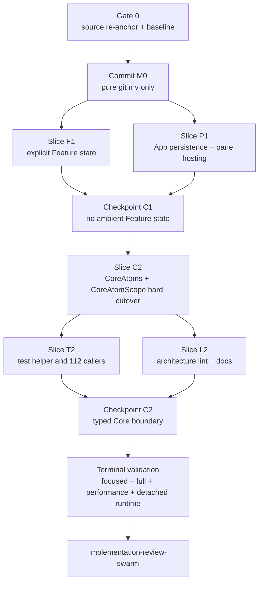

# Core Atom Boundary Implementation Plan

Date: 2026-07-26

Status: reviewed; owner-clarified; implementation-ready

Source HEAD: `5a7bd64690a3566dcb57fdf4d5a6dd34f9ed056c`

Accepted source:
`docs/specs/2026-07-25-core-atom-scope-feature-injection/2026-07-25-core-atom-scope-feature-injection.md`

Parent context:
`docs/specs/2026-07-23-swiftpm-target-modularization/2026-07-23-swiftpm-target-modularization.md`

## Outcome

Make the accepted atom precursor real without performing the SwiftPM target
split:

- Core owns `CoreAtoms`, `CoreAtomScope`, and the typed
  `atom(KeyPath<CoreAtoms, Value>)` access path.
- App owns a non-ambient `AtomRegistry` containing one `CoreAtoms` plus the
  existing concrete Feature atoms and facades.
- Feature-owned mutable state is passed explicitly.
- Cross-Feature reads are consumer-owned read-only closures supplied by App.
- Cross-Feature persistence and concrete pane hosting are App-owned.
- Tests use one lazy package-test-process Core fallback plus task-local Core
  overrides.
- Architecture lint enforces the resulting boundary and controlled mutation.

The plan preserves one canonical observable state graph, MainActor ownership,
named mutation methods, typed initializer defaults at the App composition
root, and existing product behavior.

It does not add a resolver, registration table, service locator, Feature
ambient scope, mandatory Feature aggregate, universal entry point, or
compatibility overload.

## Scope Guard

In scope:

- the atom/state boundary in requirements AS-01 through AS-20;
- the exact ownership moves and four Core declaration extractions named below;
- permanent focused tests, architecture-lint rules and fixtures;
- the existing test-helper caller migration;
- architecture documentation directly describing these owners;
- minimal before/after regression evidence from the existing sidebar and
  git-refresh performance workloads.

Out of scope:

- `Package.swift` source/test target changes;
- the full target DAG and broad `package` annotation cutover;
- non-state sibling Feature dependencies;
- commands/shortcuts, telemetry, resources, IPC, vendors, signing, release,
  or test-lane redistribution;
- general controller/local-UI mutation cleanup;
- PR, push, merge, beta app, release app, or foreground debug launch.

Runtime constraint from the user:

- every live candidate launch is the worktree-scoped debug app;
- every debug launch is detached/background-only;
- no beta, release, installed stable, or foreground app is launched;
- no release-performance claim is made from debug evidence.

## Source Coverage and Current Evidence

The parent read:

- accepted atom spec: 1,400/1,400 lines;
- parent modularization spec: 504/504 lines;
- exact-model review reduction v5: 69/69 lines;
- current `AtomRegistry`, atom access/scope, shared test helper, construction
  spine, architecture tool, performance scripts, and named move sources.

Verified current facts:

- `AtomRegistry` is the current flat concrete root.
- `Infrastructure/AtomLib/Atom.swift` and `AtomScope.swift` type the product
  access path on `AtomRegistry`.
- the shared helper owns one fallback and task-local complete-root overrides.
- the unique helper-caller union is 113 files including the helper definition,
  hence 112 caller files.
- the seven concrete pane-hosting files remain under Core.
- `WorkspaceSettingsStore` remains under Core.
- `scripts/compare-atomlib-v2-performance.py` enforces the required 10%
  regression ceiling but also enforces unrelated 50% improvement obligations.
- `scripts/verify-sidebar-performance-workload.sh` is the existing
  marker-scoped changed-path workload, but its own broad latency threshold is
  not the AS-19 10% comparator.
- The owner explicitly rejected expanding the performance harness for this
  precursor. The existing comparator, verifier schemas, telemetry, and script
  test matrix remain unchanged.

Security context: not applicable. This change introduces no new authentication,
authorization, secret, parsing, network, filesystem, subprocess, plugin, or
external-service boundary. Existing debug-observability scripts remain
operational proof infrastructure rather than product code.

## Dependency and Execution DAG



The conceptual Feature and App lanes may be developed independently, but their
shared App construction files have one integration owner. The initial
implementation should therefore be parent-controlled and serial at those
files. Test caller migration may parallelize only after the helper API is
frozen and only by disjoint owner directories. C2 and T2 are one atomic
compile cutover: the aggregate test product cannot pass between them, and no
compatibility surface may manufacture an intermediate green state.

## Requirements and Proof Matrix

| Requirement | Owning slice | Permanent proof | Gate and layer | Evidence source | Freshness guard | Red/green |
| --- | --- | --- | --- | --- | --- | --- |
| AS-01 Core graph | C2 | `CoreAtomsTests` proves complete typed Core composition, same-backing facades, and lazy `attendedPane` identity | focused unit + build | parent-run tests and source inventory | final scoped diff | yes |
| AS-02 typed lookup | C2/L2 | free `atom(_:)` same-instance test, bad key-path fixture, source audit | unit + static | parent-run tests/lint/`rg` | final scoped diff | yes |
| AS-03 scope semantics | C2/T2 | `CoreAtomScopeTests` plus isolated exit tests | unit + process integration | parent-run Swift Testing suite | fresh exit-test children | yes |
| AS-04 Infrastructure generic only | C2/L2 | product-state boundary fixtures and zero-reference audit | static | architecture tool + `rg` | final scoped diff | yes |
| AS-05 remove unused APIs | C2 | wrapper test reshaped; `DerivedValueMemoizationTests` retained; absence audit | unit + static | parent-run tests/search | final scoped diff | yes |
| AS-06 typed App root | C2 | `AtomRegistryTests` checks default/injected graph and backing identities | unit/integration + build | parent-run tests/build | final scoped diff | yes |
| AS-06A explicit App inputs | F1/P1/L2 | App construction and cross-Feature wiring tests; global/static registry bad fixtures | integration + static | parent-run tests/lint | final scoped diff | yes |
| AS-07 no uniform Feature state system | L2 | forbidden-name/type fixtures and source audit | static | architecture tool + `rg` | final scoped diff | yes |
| AS-08 canonical mutation | F1/C2/L2 | good/bad mutation fixtures plus representative named-mutation Observation tests | unit + static | parent-run tests/lint | final scoped diff | yes |
| AS-09 RepoExplorer prefs | F1 | exact injected reference, mutation, and Observation behavior | Feature unit | `RepoExplorerViewTests` | final candidate | yes |
| AS-10 no sibling state types | F1/L2 | Feature import/type fixtures and source audit | static | architecture tool | final candidate | yes |
| AS-11 read-only facts | F1 | deterministic Feature tests plus real App Bridge/Terminal wiring integration | unit + integration | parent-run tests | exact root instances | yes |
| AS-12 App coordination | P1/L2 | moved settings tests: round trip, debounce, defaults, recovery, exact root identity | integration + static | parent-run tests/lint | final candidate | yes |
| AS-13 App pane hosts | M0/P1 | pure rename receipt, Core extraction tests, main/drawer EditorChooser identity | rename + unit + integration | git evidence and parent tests | exact commits/final diff | yes |
| AS-14 package access discipline | C2/review | scoped access-control diff contains only the concrete state boundary, adds no `public`, and defers compiler-driven Feature/UI/runtime promotion | build + implementation review | parent build/review | final diff | no behavior change |
| AS-15 test ownership | T2 | 112-caller partition, fallback/override suites, App integration | unit + integration + full test | parent-run count/tests | final caller union | yes |
| AS-16 no compatibility system | C2/L2 | resolver/registration/second-scope fixtures and search | static | architecture tool + `rg` | final diff | yes |
| AS-17 docs/lint match | L2 | rule inventory/parity, good/bad corpus, architecture docs | tool unit + lint | parent-run tool tests/lint | final diff | yes |
| AS-18 behavior unchanged | F1/P1/C2 | relevant integration suites, schema/resource/vendor/IPC diff audit, build, detached debug proof | integration + smoke | parent-run checks | final candidate marker | yes where behavior changes |
| AS-19 no >10% regression | Gate 0/V | equivalent detached-debug sidebar comparison plus a parent-produced side-by-side reading of the seven existing Victoria summary surfaces | product-path performance | existing workload artifacts and parent calculation | baseline from pre-semantic source; candidate from final HEAD; equivalent existing configuration fields | baseline/candidate |
| AS-20 no unsupported speed claim | V/review | plan, commits, review, and report make no speedup claim | review | parent/reviewer audit | final report | not applicable |

AS-19 proof interpretation follows the user's later runtime restriction: the
before/after product workload uses equivalent detached debug configuration.
This proves regression behavior for the runnable proof surface but is not
reported as release-configuration or release-performance proof.

## Gate 0 — Re-anchor and Capture Baseline

Before any source move:

1. Confirm HEAD, branch, worktree, dirty state, and all source/destination
   paths.
2. Confirm only the accepted spec directories are untracked and do not stage
   unrelated files.
3. Confirm Xcode 26.3 and the repo setup path are usable.
4. Start the shared observability stack.
5. Capture the changed-path sidebar baseline from the exact source HEAD. The
   mise task hardcodes `--sidebar-proof`, so baseline mode must call the script
   directly:

   ```bash
   mise run observability:up
   /bin/bash scripts/verify-sidebar-performance-workload.sh --baseline
   ```

6. Capture one marker-scoped summary containing all seven AtomLib
   no-regression surfaces:

   ```bash
   AGENTSTUDIO_PERF_PROOF_ROOT="$PWD/tmp/performance-proofs/core-atom-boundary-baseline" \
     mise run verify-git-refresh-performance-workload
   ```

7. Record the emitted sidebar baseline file, git-refresh `summary.txt`, marker,
   source HEAD, executable/state-file identity, worktree/fixture identity,
   trace selection, sample counts, and both exit codes in the controller proof
   ledger. The emitted git-refresh artifact path becomes
   `<baseline-summary>` in terminal comparison commands.

Do not continue if another process already owns this worktree's debug identity,
the baseline is stale/mismatched, or a move source/destination has changed.

## Commit M0 — Pure Ownership Moves

Create destinations, then use only `git mv`. Do not format, rename declarations,
change imports/access, extract declarations, or edit content.

Production moves:

```text
Infrastructure/AtomLib/Atom.swift
  -> Core/State/MainActor/Atoms/CoreAtomAccess.swift

Infrastructure/AtomLib/AtomScope.swift
  -> Core/State/MainActor/Atoms/CoreAtomScope.swift

Core/State/MainActor/Persistence/WorkspaceSettingsStore.swift
  -> App/Coordination/WorkspaceSettingsStore.swift

Core/Views/Panes/PaneLeafContainer.swift
Core/Views/Panes/FlatPaneStripContent.swift
Core/Views/Panes/FlatTabStripContainer.swift
Core/Views/Panes/SingleTabContent.swift
Core/Views/Panes/ActiveTabContent.swift
Core/Views/Drawer/DrawerPanel.swift
Core/Views/Drawer/DrawerPanelOverlay.swift
  -> App/Panes/Hosting/<same basename>
```

Ownership-following test moves:

```text
App/State/AtomScopeTests.swift
  -> Core/State/MainActor/Atoms/CoreAtomScopeTests.swift

Core/Stores/WorkspaceSettingsStoreTests.swift
  -> App/Coordination/WorkspaceSettingsStoreTests.swift

Core/Views/Panes/FlatTabStripContainerDragOwnershipTests.swift
Core/Views/Panes/PaneLeafContainerInactiveDimmingTests.swift
Core/Views/Panes/PaneLeafContainerPaneInboxTests.swift
Core/Views/Drawer/DrawerPanelOverlayStateTests.swift
  -> App/Panes/Hosting/<same basename>
```

Keep `FlatPaneDividerResizeTests`, `MinimizedPaneDividerResizeTests`,
drag-payload/split-drop tests, and `DragAutoDismissDecisionTests` under Core.

Proof before commit:

```bash
git diff --cached --summary
git diff --cached --numstat
mise run build
```

The staged diff must contain only renames; every moved blob must be
byte-identical. Commit this checkpoint separately. If the build requires a
semantic edit, do not mix it into M0: stop and re-check the move inventory.

## Slice F1 — Explicit Feature State and Cross-Feature Facts

Add failing permanent tests first.

### RepoExplorer and Bridge

- Add consumer-owned:

  ```swift
  package typealias BridgeAttendanceSnapshot =
      @MainActor () -> [UUID: UInt64]
  ```

- Add package-visible `ordinalSnapshot()` to
  `BridgePaneAttendanceAtom`; keep mutation private.
- Make `RepoExplorerView` require:
  `RepoExplorerSidebarPrefsAtom` and `BridgeAttendanceSnapshot`.
- Remove both Feature ambient reads.
- Invoke the attendance closure exactly once before nested projection loops.
- Thread both values through `SidebarRootViewDependencies` and
  `SidebarSurfaceHost`.

Red/green proof:

- injected preferences preserve exact reference identity and Observation;
- named preference mutations update the view model;
- deterministic attendance snapshots drive projection;
- a read-counting closure proves one call per projection;
- App integration closes over the root's exact Bridge atom.

### InboxNotification and Terminal

- Replace `TerminalActivityAtom?` in `InboxNotificationRouter` with two
  required consumer-owned closures:

  ```swift
  @MainActor (UUID) -> Bool
  @MainActor () -> [UUID: Bool]
  ```

- Supply both from the exact root-owned `TerminalActivityAtom` in
  `AppDelegate+InboxNotificationBoot`.
- Update Feature tests to deterministic closures.
- Keep real-root connection proof in executable integration tests.

### App construction spine

One owner edits these shared files:

- `AppDelegate+MainWindowCreation.swift`;
- `MainWindowController.swift`;
- `MainSplitViewController.swift`;
- `SidebarSurfaceHost.swift`;
- `PaneTabViewController.swift`;
- `WorkspaceSurfaceCoordinator.swift` and its two Bridge extensions;
- `WorkspaceLauncherProjector.swift`;
- `CustomTabBar.swift`;
- `ShellTabBarControls.swift`.

Pass only the exact Feature references named in Contract 4. Never pass the
whole `AtomRegistry`, a lookup closure, or a dependency container.

F1 gate:

```bash
mise run test -- --filter RepoExplorerViewTests
mise run test -- --filter InboxNotificationRouterObservedPaneTests
mise run test -- --filter InboxNotificationRouterTests
mise run test -- --filter DerivedActivityNotificationIntegrationTests
mise run build
```

Search proof must show zero production ambient Feature key paths and no sibling
Feature atom/facade type in the consumers. Each focused command must report a
non-zero selected-test count.

## Slice P1 — App Persistence and Pane Hosting

Add or adapt the failing integration tests before semantic edits.

### Workspace settings

- Keep the moved store's persistence behavior and SQLite contracts unchanged.
- Delete only the ignored `EditorChooserState?` input from `UIStateStore`.
- Update boot construction and the moved/store tests.
- Prove settings round trip, debounce, defaults, recovery, and use of the exact
  App root Feature atoms.
- Add
  `Tests/AgentStudioTests/App/Coordination/WorkspaceSettingsStoreRootIdentityTests.swift`
  to prove the App-created store observes the exact root-owned EditorChooser,
  RepoExplorer, and Inbox preference atoms.

### Pane hosting

- Thread required `EditorChooserState` from `PaneTabViewController` through
  `SingleTabContent`, `FlatTabStripContainer`, `FlatPaneStripContent`, both
  drawer branches, and `PaneLeafContainer`.
- Require the same input in diagnostic `ActiveTabContent`.
- Do not add a renderer protocol, `AnyView` closure, type erasure, or state
  container.
- Add
  `Tests/AgentStudioTests/App/Panes/Hosting/PaneHostingEditorChooserIdentityTests.swift`.
  Its permanent suite proves that the exact `AtomRegistry.editorChooser`
  reference reaches `DrawerEditorChooserFactory` through both the main-pane
  and drawer-pane construction paths.

After M0, extract:

```text
TabDragPayload + PaneDragPayload
  -> Core/Views/Panes/PaneDragPayloads.swift

FlatPaneDivider
  -> Core/Views/Panes/FlatPaneDivider.swift

DrawerIconBarFrameKey
  -> Core/Views/Drawer/DrawerIconBarFrameKey.swift
```

Keep `NewTabDragPayload` and hosting-only declarations with App.

P1 gate:

```bash
mise run test -- --filter WorkspaceSettingsStoreTests
mise run test -- --filter WorkspaceSettingsStoreRootIdentityTests
mise run test -- --filter UIStateStoreTests
mise run test -- --filter PaneLeafContainerPaneInboxTests
mise run test -- --filter PaneLeafContainerInactiveDimmingTests
mise run test -- --filter PaneCloseTransitionCoordinatorTests
mise run test -- --filter PaneHostingEditorChooserIdentityTests
mise run test -- --filter DrawerPanelOverlayStateTests
mise run test -- --filter FlatPaneDividerResizeTests
mise run test -- --filter FlatTabStripContainerDragOwnershipTests
mise run build
```

The new identity suite must first fail against the unthreaded constructors and
then pass for both branches. Each focused command must report a non-zero
selected-test count.

Checkpoint C1 only when F1 and P1 are green, production has no ambient Feature
lookup, Core names no Feature state, and the moved ownership matches the spec.
Commit the complete semantic slice separately from M0.

## Slice C2 — Core Graph and Typed Scope Hard Cutover

Add failing composition/scope tests first.

### CoreAtoms

- Create `Core/State/MainActor/Atoms/CoreAtoms.swift`.
- Move every Core-owned stored property, derived reader, coordinator, default,
  construction rule, and same-backing precondition out of `AtomRegistry`.
- Preserve lazy `attendedPane` identity.
- Use `package` only on the concrete cross-target surface; do not promote
  unrelated members or use blanket `public`.

### CoreAtomScope and access

- Change the moved access function to
  `KeyPath<CoreAtoms, Value>`.
- Change the moved scope to store one production `CoreAtoms` and one task-local
  `CoreAtoms` override.
- Preserve access-before-setup, setup-exactly-once, inheritance, sibling
  isolation, detached fallback, and escaped-callback semantics.
- Remove the `@Atom` wrapper.
- Delete `AtomReader.swift`, `Derived.swift`, and `DerivedSelector.swift`.
- Retain Infrastructure `DerivedValue` and its real tests.

### App AtomRegistry

- Add `let core: CoreAtoms`.
- Leave only the concrete Feature atoms/facades named in the spec directly on
  the App root.
- Retain the current typed initializer defaults.
- Compose Feature facades from the exact stored backing atoms.
- Install only `atomStore.core` during production boot.
- Change the 34 direct App Core-root reads to `atomStore.core.<property>`.
- Do not add a second App scope or ambient App accessor.

C2 intermediate evidence is deliberately product/source-only because the
aggregate test product still contains the old helper and callers until T2:

```bash
mise run build
rg -n 'KeyPath<AtomRegistry|struct Atom<' Sources/AgentStudio
```

Do not call C2 green or commit it here. Proceed directly into T2 as the same
atomic cutover.

## Slice T2 — Test Process Semantics and Caller Migration

Freeze the shared helper API before migrating callers.

The helper must provide:

- one lazy process-wide default `CoreAtoms` fallback;
- synchronous and asynchronous task-local Core override helpers;
- a separate complete App-root factory for App integration tests.

It must not provide:

- ambient Feature access to module-style tests;
- global initialization, a package-wide suite trait, or startup hook;
- a reset API, `#if DEBUG` hook, custom subprocess harness, or serialization
  assumption.

Add permanent Swift Testing 6.2 exit tests under
`Tests/AgentStudioTests/App/State/AppAtomRegistryInstallationExitTests.swift`.
Use the shipped process-exit expectation and observe stderr so the test
distinguishes the intended precondition:

```swift
try await #require(
    processExitsWith: .failure,
    observing: [\.standardErrorContent]
)
```

Prove:

- access before setup fails;
- a child-created App root installs its exact `core`;
- a second setup fails after the identity assertion succeeds.

Migrate the 112 caller files in compiling batches:

1. Core: 18;
2. Features: 36;
3. App: 54;
4. Integration: 4.

Recompute the unique union after every batch. The helper definition plus the
caller union must remain 113 files until old helper names are removed; the
final audit records the new helper union and owner partition.

The helper union is not the complete App-root dependency audit. Four additional
Core-owned tests construct `AtomRegistry` directly and must move to `CoreAtoms`
fixtures:

```text
Core/State/WorkspaceTabBoundaryTests.swift
Core/Stores/WorkspaceSQLiteStoreBridgeTests.swift
Core/State/MainActor/Atoms/RepositoryTopologyAtomTests.swift
Core/State/MainActor/Atoms/ActiveWorkspaceSelectionAtomTests.swift
```

After migration, Core and Feature test folders must contain no direct
`AtomRegistry` construction or type reference. App and Integration tests may
use the separate complete-root factory only when they prove App composition.

T2 gate:

```bash
mise run test -- --filter CoreAtomsTests
mise run test -- --filter CoreAtomScopeTests
mise run test -- --filter AppAtomRegistryInstallationExitTests
mise run test -- --filter AtomRegistryTests
mise run test -- --filter DerivedValueMemoizationTests
mise run test
```

If the migration ceases to be mechanical or reveals a second fallback owner,
preserve the diagnostic diff, treat committed C1 as the last known-good point,
and return to plan creation. Do not introduce compatibility state access or
claim a green state between C2 and T2.

## Precursor Access-Control Boundary

This precursor applies `package` only to the state boundary it makes concrete:

- `CoreAtoms`, the Core state declarations exposed through that graph, its
  typed initializer and readers;
- `atom(_:)`;
- `CoreAtomScope.store`, `CoreAtomScope.override`, and
  `CoreAtomScope.setUp(_:)`;
- the Bridge attendance snapshot seam already required by explicit
  RepoExplorer composition.

It does not pre-promote the complete RepoExplorer, InboxNotification,
Terminal, EditorChooser, pane-hosting, Core UI, runtime, or transitive
signature surface. Those declarations still compile in the executable target
in this precursor, so an exhaustive list here would be speculative and would
hide the real compiler-driven cost of the later split.

The stacked SwiftPM target-split changeset owns that broader inventory. It
creates the targets first, follows compiler diagnostics through each real
cross-target signature, and promotes only the declarations actually required
to `package`. It must record the resulting inventory in that changeset and may
not use blanket `public`, compatibility shims, or pre-emptive package-wide
promotion to make the graph compile.

App-only `AtomRegistry`, App constructors, and App-owned stores/views remain
internal in both changesets.

## Slice L2 — Architecture Enforcement and Documentation

Implement two SwiftSyntax-owned rules:

- `ProductAtomBoundaryRule.swift`;
- `CanonicalAtomMutationRule.swift`.

Register stable rule identifiers in `ArchitectureRule.swift` and update:

- `ArchitectureLintCommandTests`;
- `RuleInventoryTests`;
- `RuleParityTests`;
- relevant old AtomLib/SharedComponents rules and allowlists.

Good/bad fixtures must cover:

- Infrastructure naming product state;
- Core naming Feature state;
- Feature naming sibling Feature state;
- lower `KeyPath<AtomRegistry, ...>`;
- static/global App registry access and a second App scope;
- resolver, registration, and compatibility API vocabulary;
- externally writable stored state or writable bindings on owner classes under
  `**/State/MainActor/Atoms/**`;
- allowed private/private(set) atom storage;
- allowed value snapshots/graphs/cursors and derived readers.

Do not use the excluded `AtomLibCompileFailures` fixture directory as proof.

Synchronize:

- `AGENTS.md` atom ownership text if the final names/paths differ;
- `docs/architecture/directory_structure.md`;
- other directly contradicted atom/pane ownership paragraphs found by the
  final reference audit.

L2 gate:

```bash
swift test --package-path Tools/AgentStudioArchitectureLint
mise run lint
```

## Performance Proof

Before semantic work, capture both artifacts named in Gate 0:

- the direct sidebar baseline file for the changed projection shape;
- one `verify-git-refresh-performance-workload` `summary.txt` containing all
  seven accepted surfaces.

After the final implementation, rerun both workloads with the same worktree
identity, trace selection, fixture identity, sample requirements, activation
mode, and detached debug configuration:

```bash
/bin/bash scripts/verify-sidebar-performance-workload.sh --compare
AGENTSTUDIO_PERF_PROOF_ROOT="$PWD/tmp/performance-proofs/core-atom-boundary-candidate" \
  mise run verify-git-refresh-performance-workload
```

The candidate git-refresh artifact path becomes `<candidate-summary>`. Using
only fields already emitted by the two summaries, the parent records a
side-by-side table for the seven accepted surfaces and calculates count, p95
when available, and max deltas. A delta above the existing 10% regression
ceiling fails AS-19.

This precursor does not modify the AtomLib comparator, either workload
verifier, telemetry, summary schema, or performance script tests. The
historical comparator's unrelated 50% improvement contract is not invoked.
Existing artifact fields and the execution ledger must establish equivalent
worktree identity, fixture shape, trace selection, sample requirements,
activation mode, and detached debug configuration. If they cannot, report
AS-19 as unproven and reconverge instead of expanding performance
infrastructure.

The sidebar workload is mandatory because it exercises the changed
Bridge-to-RepoExplorer one-snapshot-per-projection read shape. If the available
summaries cannot satisfy the accepted metric set without broad performance
framework changes, stop and replan rather than weaken the threshold.

No result is described as a build, test, runtime, or release speedup.

## Terminal Validation

Run in this order against the final scoped diff:

1. focused Core, Feature, persistence, pane, and App integration suites;
2. architecture-tool tests;
3. `mise run lint`;
4. `mise run test`;
5. `mise run build`;
6. equivalent candidate performance workload and no-regression comparison;
7. implementation review;
8. detached live runtime proof only:

   ```bash
   mise run observability:up
   mise run run-debug-observability -- --detach
   mise run verify-debug-observability
   ```

The verifier must consume the marker emitted by the same final candidate
launch, reject `already_running`/`launch_failed`, and match the worktree-scoped
PID and executable identity. Quit/cleanup is performed through the established
debug-runner mechanism after proof; do not launch a foreground app.

Final source audits:

```bash
rg -n 'KeyPath<AtomRegistry|AtomScope|AtomReader|DerivedSelector|struct Atom<' Sources/AgentStudio
rg -n 'AtomRegistry|CoreAtoms|CoreAtomScope' Sources/AgentStudio/Infrastructure
rg -n 'Features/' Sources/AgentStudio/Core
rg -n 'AtomRegistry' Tests/AgentStudioTests/Core Tests/AgentStudioTests/Features
git diff --check
git diff --stat <move-commit>..HEAD
```

Interpret search results by syntax and ownership; comments and same-feature
paths are not failures by themselves.

## Commit and Recovery Strategy

Required history:

1. reviewed spec and plan checkpoint;
2. M0: pure byte-identical `git mv` checkpoint;
3. C1: explicit Feature state, App persistence, and pane ownership;
4. C2: Core graph/scope plus the complete helper/direct-root test migration,
   committed only after the product build and full test product compile green;
5. L2: architecture lint, docs, and proof tooling after their focused tests;
6. review-finding fixes only if needed.

Never amend M0 with semantic changes.

Do not reset, clean, force-push, or add compatibility APIs. If C2's migration
reveals unrelated behavior before a green C2 commit exists, preserve the
uncommitted diagnostic diff, treat the committed C1 checkpoint as the last
known-good recovery point, and return to planning. Do not claim the current
working tree is green or manufacture a partial C2 commit. Any rollback is a
separately reviewed ordinary revert or explicit inverse patch after the owner
chooses it.

## Split and Reconvergence Triggers

Stop implementation and return to the shared model if:

- a Core file outside the named seven-file closure constructs an App host;
- Core still needs a Feature state type after the named moves;
- a Feature still needs a sibling atom/facade instead of the accepted fact;
- App wiring requires a container, lookup, static root, or second scope;
- the exit-test macro cannot prove the exact preconditions;
- more than one test-process fallback owner is required;
- mutation lint cannot distinguish owner classes from accepted value/derived
  types within the path domain;
- a required proof needs Package.swift target changes, resource/release/vendor
  changes, or test-lane under-selection;
- performance comparison cannot enforce the 10% contract without broad
  framework changes;
- a validation failure belongs outside the accepted atom boundary.

## Lane Reduction

Planning lanes used high reasoning because this is proof-heavy and
cross-module:

- codebase boundary and compile-safety: accepted exact move inventory, write
  surfaces, access-control boundary, and test ownership;
- validation/proof: accepted exit-test API, proof matrix, and comparator
  mismatch; rejected excluded compile-failure fixtures as authoritative proof;
- vertical slices/execution/scope fit: accepted M0 -> C1 -> C2 sequencing and
  the C1 recovery boundary.

The parent rejected Core-first semantic sequencing because it would break all
remaining Feature key paths at once. Explicit Feature-state cutover first
preserves a real green checkpoint before the Core hard cutover.

## Completion Condition

This plan is complete only when every AS-01 through AS-20 row has fresh
evidence, M0 remains a pure move commit, C1 and C2 are reviewed, all required
commands pass, the no-regression comparison passes, and the final detached
debug app is verified live.

PR, push, merge, foreground UI, beta/release app launch, and the full SwiftPM
target split are not part of completion.
