# Deprecated Agent Studio Review Comments Specification

> Source material only. This document is not current requirements,
> Specification, acceptance authority, or implementation authority. The
> current design entry point is
> `../2026-08-06-worktree-annotations/README.md`.

Status: deprecated source snapshot; no current authority
Date: 2026-07-31
Target classification: general-domain
Scope: observable File View and Review View comment behavior for files, Markdown plans/specs, and diff items
Sibling program design: [2026-07-30-review-comments.md](2026-07-30-review-comments.md)

## Read this first

This document is the authoritative Why/What contract. It has two layers:

1. The diagrams explain the consumer journeys and independent product states.
2. The numbered requirements define observable pass/fail behavior and proof obligations.

If a diagram and a numbered requirement disagree, the numbered requirement is authoritative. `must` states a required pass/fail obligation; `may` leaves a permitted choice. This document avoids normative `should`. Internal components, storage layout, call graphs, protocol registries, and recovery mechanisms belong to the sibling program design.

### The human/agent review loop

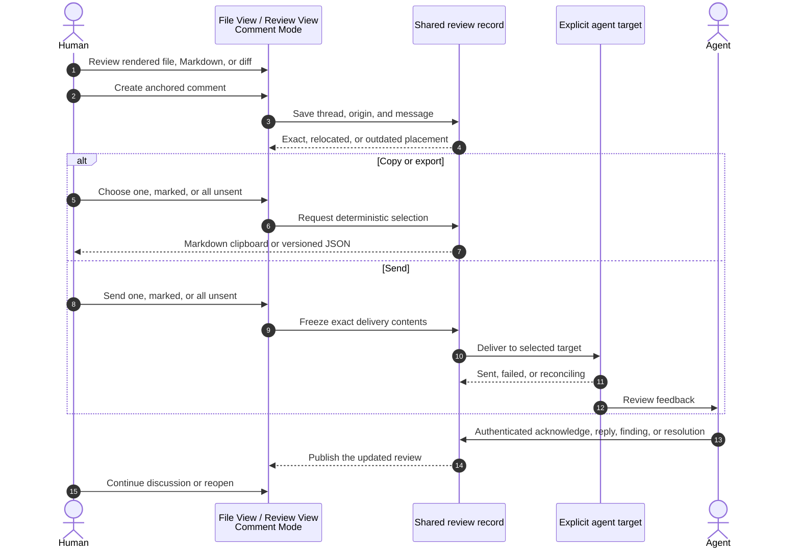

The loop has one durable review record. File View and Review View project that same record; an authorized agent receives the permitted subset—accepted human feedback plus all agent-authored work and the shared thread/resolution facts of threads already visible to agents in the authorized review—without seeing human drafts, wholly undelivered human bodies, or the existence of human-only threads before one of their human messages is accepted. Current placement may change as the viewed worktree or commit changes, but the origin never moves. Copy/export use the complete ordered selection; direct Send preserves that order while visibly excluding versions that are not eligible for a new delivery. Only proven target acceptance becomes sent.

### What must survive and what may be rebuilt

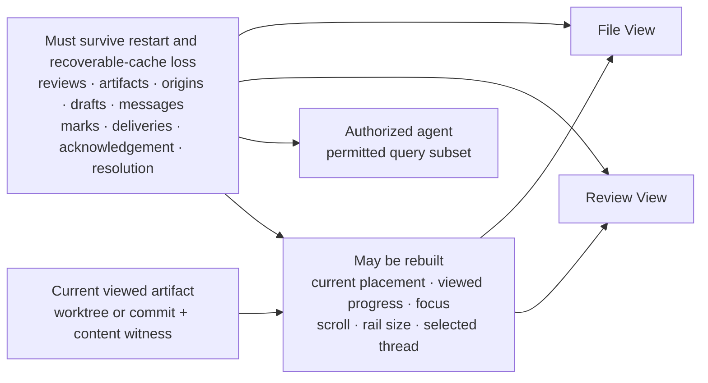

Reviewer-authored work must survive restart and loss of recoverable caches. Current placement and view progress may be rebuilt from the durable origin and current artifact. File View, Review View, and agent integrations must not create independent copies of the review record.

### How a view discovers existing comments

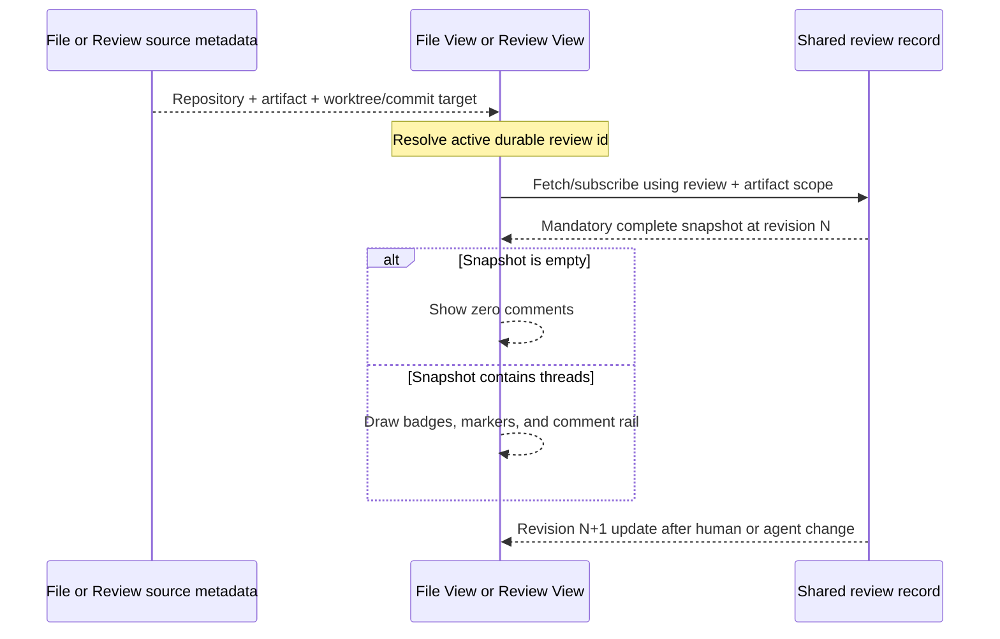

Source context identifies the artifact and bytes being viewed; it does not contain comment truth. The active durable review id selects the review scope. The first review fetch/subscription result is always complete, including an explicit empty result when no comments exist. Later human or agent changes update that same projection without requiring the artifact itself to refresh.

### States that must remain independent

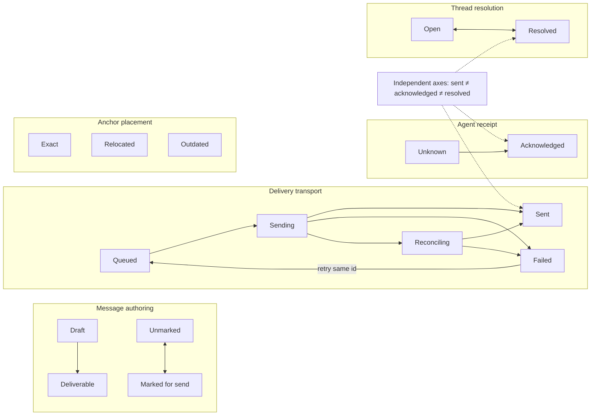

The critical rule is negative: transport acceptance never resolves a thread. An agent acknowledgement still does not resolve it. Resolution is an explicit human or agent transition, and anchor placement is computed separately against the current artifact.

### How a file anchor follows a worktree or commit

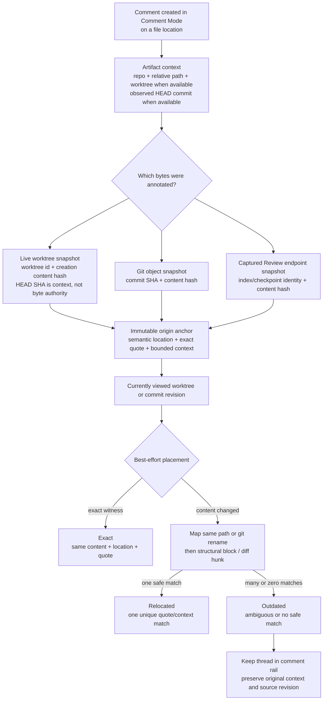

The anchor origin never moves. Artifact context and content provenance are separate: the current File View is worktree-backed and may have an observed HEAD commit, but dirty, staged, or untracked bytes are not identified by that commit. A live-worktree origin therefore freezes the displayed file's content hash and records the creation-time HEAD SHA only when one exists. A Git-object origin means the displayed bytes came from the recorded commit and remains exact there while that object is available. A Review diff may instead show index or checkpoint bytes that are neither the live worktree nor a Git commit; that origin freezes the displayed endpoint kind, endpoint identity, path, side, and content hash without pretending those bytes came from a worktree or commit. Current placement still targets an explicitly viewed worktree or commit. Agent Studio derives that placement using path/rename information, structure, and quote context. A derived placement can change as the target revision changes; it must never overwrite the origin anchor.

### Where to look next

| If you need to understand… | Read… |
| --- | --- |
| The complete user-visible behavior | Section 4, Functional requirements |
| How File View or Review View discovers comments | The discovery sequence above and Section 4.2 |
| How file anchors survive worktree/commit drift | This diagram and Section 4.4 |
| What review work must survive and what may be rebuilt | Section 5 |
| Agent Studio ↔ agent observable behavior | Section 6 |
| Failure and recovery behavior | Section 7 |
| What proves the complete loop | Section 8, End-to-end acceptance scenarios |

## 1. Problem and outcome

Agent Studio can render review packages, but it does not yet provide a durable loop for a person and an agent to discuss the reviewed artifact. The required outcome is a focused review surface where a person can read the actual artifact, attach precise comments, collate or send those comments to the working agent, and continue the thread through replies and resolution without losing what was sent or what it referred to.

### 1.1 Consumers

- A **human reviewer** reads work produced by an agent and records precise feedback without leaving the artifact.
- A **working agent** receives correlated feedback, replies or adds findings, and explicitly resolves or reopens threads.
- A **File View user** reviews one repository artifact in worktree or commit context.
- A **Review View user** reviews a multi-artifact package using Normal, Guided, or Plans/Specs workflow.
- An **agent integration** relies on a bounded authenticated review contract rather than scraping UI state, terminal text, or files.

### 1.2 Current observable reality

- File View and Review View can present review artifacts, but neither offers the complete durable comment loop defined here.
- Plans/Specs Markdown rendering does not yet provide the required combination of Shiki-highlighted code, actual Mermaid diagrams, and durable source selection mapping.
- Review View names Normal, Guided, and Plans/Specs workflows, but the latter workflows are not yet complete user journeys.
- Pane Zoom can retain a File companion, but Review is not yet an equivalent companion for side-by-side feedback delivery.
- Existing terminal command acceptance can prove local input execution, not that an agent received, acknowledged, or resolved feedback.

If the feature only drew temporary markers or copied prose to a terminal, the problem would remain: reviewer work could be lost, comments could drift to the wrong bytes, the agent could not correlate replies, and sent/acknowledged/resolved state would still be ambiguous.

### 1.3 Load-bearing product decisions

- File View and Review View both support **Comment Mode**; Comment Mode is not a third viewer.
- Normal, Guided, and Plans/Specs remain durable per-review workflow choices over the same review and comments; every Review View of that review reflects the same choice.
- A review is an explicit human-identifiable round; standalone File View never chooses one from path alone.
- One active review context prevents comments from unrelated review rounds from merging by path.
- Filesystem path alone never proves repository identity; a different repository later occupying the same path must not inherit the prior review automatically.
- Human and agent messages share one thread model; both may resolve and reopen threads.
- Copy, JSON export, individual send, marked send, and all-unsent send use the same deterministic selection membership/order; Send visibly partitions that selection by new-delivery eligibility.
- Delivery, acknowledgement, resolution, and current anchor placement remain independent facts.
- The review's zero-or-one active authorization binding and per-delivery target selection are separate; transport delivery never grants review mutation authority.
- Codex App Server is the first rich agent integration, but observable review identity and payloads remain provider-neutral.
- The existing authenticated Agent Studio control boundary is reused; this scope does not authorize a new authentication system.

Success means all of the following are true:

- Files, Markdown plans/specs, and code diffs are readable in File View and Review View.
- Both surfaces expose the same canonical comments with surface-appropriate inline placement.
- A reviewer can attach a comment to a document selection, diff range, whole artifact, or whole review.
- Comments can be marked, sent individually, sent as a selected batch, copied as deterministic Markdown, or exported as versioned JSON.
- The UI distinguishes authoring, delivery, acknowledgement, and resolution instead of collapsing them into one status.
- Agents can read the review, add findings or replies, acknowledge delivered feedback, and resolve or reopen threads through the same comment system.
- Pane Zoom keeps the reviewed artifact and its source terminal together and targets the source terminal explicitly.
- Codex App Server is the first rich agent integration, while review identities and observable payloads remain provider-neutral.

## 2. Scope boundaries

### 2.1 In scope for the first complete loop

- Markdown documents, especially plans and specs.
- Current File View and Review View file, Markdown, and diff items.
- Rich Markdown rendering with Shiki code highlighting and actual Mermaid diagram rendering.
- Human-authored and agent-authored review threads and messages.
- Individual, marked, and all-unsent delivery.
- Markdown clipboard output and machine-readable JSON export.
- Side-by-side Pane Zoom delivery to the source terminal or its bound agent session.
- Codex App Server delivery and authenticated Agent Studio IPC review operations.
- Agent review participation in which an agent can inspect artifacts and correlate its findings with durable thread and delivery identifiers.

### 2.2 Out of scope for this requirements slice

- Arbitrary comments on the full session transcript or every terminal message.
- Patch application, source mutation, or an agent editing the reviewed artifact through the review-comment API.
- Multi-user collaboration, mentions, reactions, assignment, CRDTs, or cross-machine sync.
- Runtime-loaded third-party plugins or a provider marketplace. Provider extensibility is limited to first-party integrations with declared capabilities.
- A generic chat system, issue tracker, or collaboration platform.
- Review archive/delete, retention expiry, and cross-review search. V1 reviews accumulate until a later lifecycle feature; they never silently expire.
- Durable copies of complete git blobs or document revision history.
- Spatial annotations on individual nodes inside rendered Mermaid SVG. A Mermaid comment anchors to the source block or a source selection.
- A new authentication system or broad security design. Review operations reuse the existing authenticated Agent Studio control boundary.

## 3. Product vocabulary

- **File View** is the focused single-artifact surface opened in repository/worktree context. The displayed bytes may be a live worktree snapshot or, for a historical/diff endpoint, a Git-object snapshot.
- **Review View** is the multi-artifact review canvas for files, Markdown, and diffs.
- **Comment system** is the shared durable thread/message/delivery capability used by both surfaces.
- **Comment Mode** is the shared interaction mode available in File View and Review View for creating, navigating, replying to, sending, resolving, and reopening comments.
- **Review workflow** is the durable per-review choice Normal, Guided, or Plans/Specs. It changes how every Review View of that review guides the work, not whether comments exist or where they are stored.
- **Agent review participation** is the provider-neutral ability to query a review, add findings or replies, acknowledge delivery, and resolve or reopen threads. Guided workflow may coordinate these capabilities but does not own them.
- **Review** is one durable, human-identifiable review round over one or more artifacts. It has a visible title, creation/update time, workflow, repository plus worktree/commit context when available, and a stable id. A Review View opens an existing review only from an explicit durable review id; without one, it asks the user to select an applicable round or deliberately create a new round. Standalone File View also creates a new review only through an explicit user action.
- **Active review context** is the durable review id a File View or Review View currently projects. It selects a review; worktree, commit, and path alone do not.
- **Artifact** is a Markdown document, file, or diff item presented in that review.
- **Thread** is one of three discussion kinds: a located thread anchored to source, an artifact-level thread about an artifact as a whole, or a review-level thread about the review as a whole. Only located threads have current placement.
- **Anchor origin** separates the view's artifact context from the immutable provenance of the bytes annotated: a captured live-worktree snapshot, a Git-object snapshot at a commit SHA, or a captured non-live Review endpoint snapshot such as index/checkpoint bytes.
- **Anchor placement** is the derived exact, relocated, or outdated position of that origin in the revision currently being viewed.
- **Message** is a human or agent contribution to a thread.
- **Agent actor identity** is an Agent Studio-minted review identity with a safe visible label and provider/target kind. It is distinct from the authorization binding id captured with the action. Provider-native session, thread, turn, or event ids may correlate transport but never become the author identity shown in the review domain.
- **Delivery** is one immutable request to send an exact ordered set of message versions to one Agent Studio delivery target; retries preserve that request and its idempotency identity.

## 4. Functional requirements

Each group starts with a compact behavior map. The numbered requirements remain authoritative. ASCII layouts show required relationships and affordances, not fixed control placement or pixel layout.

### 4.1 Rich review rendering

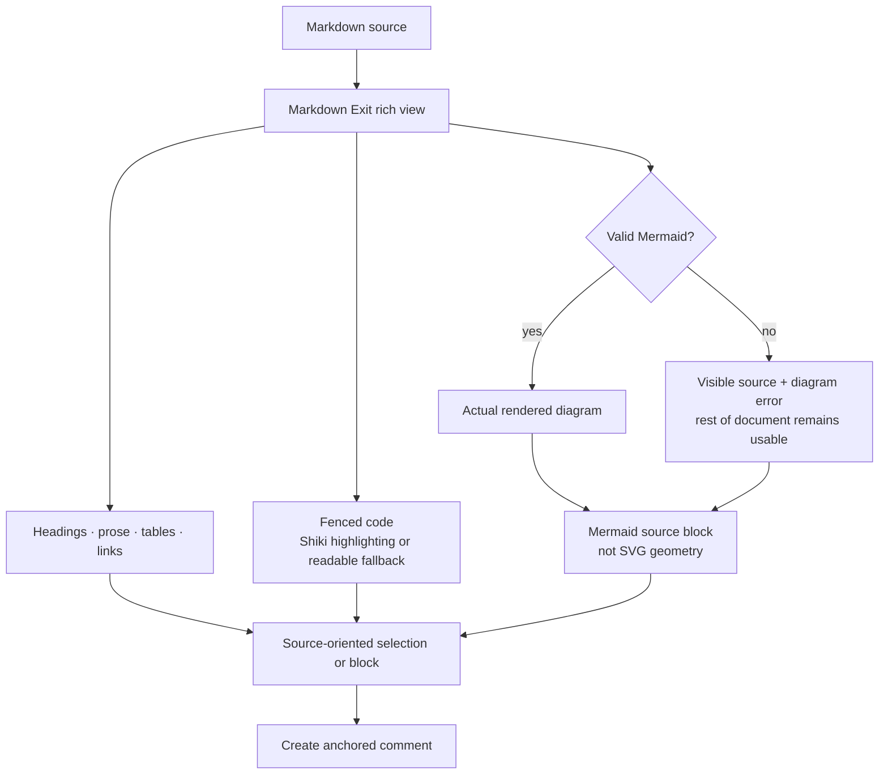

R-RDR-001 — File View and Review View must render supported artifacts as readable file, Markdown, or diff presentations rather than treating raw source as the only review surface.

R-RDR-002 — Markdown review must use Markdown Exit as one coherent rich document experience: ordinary Markdown remains readable, fenced code uses Shiki highlighting where supported, and supported `mermaid` fences render as actual diagrams rather than raw fence text.

R-RDR-003 — Supported fenced-code languages must be syntax highlighted with Shiki. Unsupported languages must remain readable as plain code, and Mermaid support must not change the rendering of non-Mermaid fences.

R-RDR-004 — V1 Mermaid support must include labelled flowchart/graph, sequence, state, class, and entity-relationship diagrams. A valid fence in those families must display an actual readable diagram in the rich Markdown view. A syntactically valid but unsupported family, an invalid diagram, or a diagram that cannot retain readable labels after required content restrictions must preserve its source, show a visible unsupported/rendering error, and leave the rest of the document readable and commentable.

R-RDR-005 — Adding Mermaid rendering must not make document-provided scripts or executable viewer markup trusted. The existing rich-view content restrictions remain observable: unsafe document content stays blocked, while valid Mermaid diagrams still render. This requirement does not create a broader security system.

R-RDR-006 — A reviewer must be able to comment on stable source-oriented blocks or selections in rendered Markdown. Mermaid comments anchor to the fenced source block or a source selection, never to generated SVG geometry; changing the diagram layout must not move the comment origin.

R-RDR-007 — Normal, Guided, and Plans/Specs are Review View workflow choices over the same review and comments. Changing workflow must not create a separate set of comments or determine whether File View supports comments.

R-RDR-008 — Guided Review and Plans/Specs must become usable Review View workflows rather than disabled vocabulary. Changing workflow must change review guidance/presentation without changing the durable identity of existing reviews, artifacts, or threads.

R-RDR-009 — Guided Review must present the review's artifacts in persisted canonical artifact order as one deterministic guided sequence with visible current position and viewed/not-viewed progress, plus next/previous navigation. Current position is the currently displayed member's index in that sequence; it is runtime navigation state and need not survive view recreation. An artifact becomes viewed only through the reviewer's explicit advance or viewed action. The guided pass is complete when every in-scope artifact is viewed; open or resolved comment state, including a newly arriving agent finding, must not reorder the sequence, change current position, or redefine viewed progress. A participating agent adds correlated findings to this same review rather than a separate guided-review record.

R-RDR-010 — Plans/Specs Review must open its in-scope documents in a Markdown-first presentation with document/heading navigation, rich rendered content, and source fallback. In V1, the document pass is the review's persisted artifact members whose persisted artifact kind is Markdown, in canonical artifact order; ordinary file/diff members remain accessible but do not count toward this pass. Opening a document or navigating its headings does not mark it viewed. Explicitly advancing past it or choosing Mark Viewed does. An unavailable Markdown member remains in the pass and may be explicitly marked viewed. The pass is complete exactly when every in-scope Markdown member is viewed; zero members show an explicit `0/0` no-documents state. Finishing the pass does not resolve, send, or otherwise change comments. Leaving or changing workflow preserves the same review, comments, and viewed facts.

R-RDR-011 — One review round must retain an explicit durable artifact membership and canonical artifact order. Refreshing or reopening the underlying Review package may refresh the bytes or validated locator of an existing member, but it must not silently add, remove, or reorder review artifacts. Newly discovered package artifacts must appear as explicit add choices. A member absent from the current package remains in the review at its existing order with a visible source-unavailable state, preserving its comments and export position. Guided completion uses this persisted membership; an unavailable member remains visible and may be explicitly marked viewed rather than disappearing from the pass.

R-RDR-012 — Workflow is one durable fact of a review, not per-pane preference. Changing a review between Normal, Guided, and Plans/Specs must update every open or later-reopened Review View of that review without changing its review, artifact, thread, message, delivery, or resolution identities.

### 4.2 Comment discovery and active review context

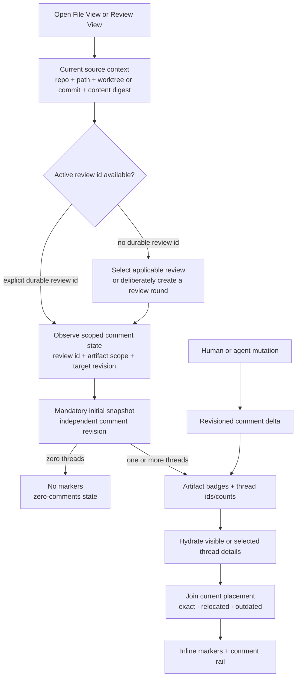

R-DSC-001 — File View and Review View must have an explicit active review context before querying or creating review comments. A Review View opening intent, durable link, or persisted pane may supply its durable review id. File View opened from an existing review context inherits that review id. A Zoom companion receives an explicitly selected review id from its owning context and must not infer one from pane identity alone. A view with no active review must let the user select an applicable review or explicitly create a review scope; it must not silently combine comments from every historical review of the same path.

R-DSC-002 — Comment discovery must be scoped by the active durable review id and current artifact context: canonical repository id, durable artifact/source locator, repo-relative path when applicable, and the viewed worktree snapshot or commit snapshot with its content digest. The review id selects canonical comment ownership; the current artifact context selects the artifact and supplies the target bytes for placement.

R-DSC-003 — When a view has an active review context, it must receive and continue observing the scoped comment state. The first result must be complete at a named comment revision, including an explicit empty result when the scoped review/artifact has no threads.

R-DSC-004 — File View and Review View must determine whether comments exist from the scoped comment result and its later changes, not from artifact source metadata. A zero thread count means no comments; nonzero counts and stable thread identities drive badges, navigation, and rail availability. Comment discovery must not depend on Comment Mode being enabled.

R-DSC-005 — The scoped comment result must identify the active review by its visible title, creation/update time, workflow, repository/worktree/commit context, and stable id. It must also provide stable artifact/thread ids, the review's displayed artifact order, per-artifact and review-level thread counts, open/resolved summaries, message mark facts and per-delivery/acknowledgement summaries needed by visible actions, current placement summaries, and the independent comment revision.

R-DSC-006 — The comment result must combine the saved thread/origin with placement against the currently viewed worktree or commit so each surface can draw badges, inline markers, and rail entries without showing stale placement as current.

R-DSC-007 — For a multi-artifact review, artifact badges and aggregate counts must become usable without waiting for every message body to render. Selecting or revealing a thread must make its complete messages and timeline available without changing the comment revision or thread identity.

R-DSC-008 — Human changes from either viewer and authenticated agent changes must update the same ordered review history. After renderer replacement, source replacement, restart, or uncertain continuity, the view must reconverge from a complete current result rather than infer that missing changes did not exist.

R-DSC-009 — An existing review is directly applicable to standalone File View when it belongs to the same canonical repository and already contains the current artifact by exact locator or one validated rename. Canonical repository identity must include a Git-history witness when one is available; the same filesystem path alone is insufficient after repository loss or replacement. Reviews in the same repository that do not yet contain the artifact may be shown separately as “add this artifact” choices, but selecting them must require an explicit add action rather than silently creating or rebinding membership.

R-DSC-010 — Review selection must show enough context to distinguish two rounds over the same path: visible title, workflow, creation/update time, originating worktree or commit when available, and whether the current artifact already matches or would be added. Exact current-artifact matches appear before add choices; opaque ids alone are not a usable picker.

R-DSC-011 — When Review View opens without a durable review id, it must show applicable existing rounds plus a deliberate Create New action before comment discovery or creation. It must never infer or reopen a review from an ephemeral package id, path, current worktree, active pane, or “most recent review” heuristic. Selecting an existing round and creating a new round are visibly distinct actions.

### 4.3 Comment creation and navigation

```text
File View — Comment Mode on
┌──────────────────────────────────────┬──────────────────────┐
│ file.md          [Comment Mode: On]  │ Comment rail         │
│                                      │                      │
│ selected source text  [1]            │ 1 open · exact · sent│
│ more rendered content…               │    Reply…            │
│                                      │    Send · Resolve    │
└──────────────────────────────────────┴──────────────────────┘

Review View — Comment Mode on
┌──────────────┬──────────────────────────────┬───────────────┐
│ Artifacts    │ Workflow: Guided             │ Comment rail  │
│ plan.md      │ Comment Mode: On             │ 1 open        │
│ src/app.ts   │ selected source text  [1]    │ 2 relocated   │
└──────────────┴──────────────────────────────┴───────────────┘

Same thread ids and comment data; each surface chooses its own layout.
```

R-CMT-001 — A reviewer must be able to create:

- a Markdown selection or block comment;
- a diff line or range comment on the old or new side;
- an artifact-level comment; and
- a review-level general comment.

When File View is bound to a review but its current artifact is not a member, the surface must show a distinct not-in-review state. Located and artifact-level creation require explicit **Add to Review**, but review-level general-comment creation remains available because it does not claim artifact membership or source placement.

R-CMT-002 — For a valid selected anchor or general-comment scope, the first non-empty composer text must create a durable draft thread and first draft message without depending on the lifetime of a view renderer or pane-local review package. Merely opening an empty composer need not create durable state.

R-CMT-003 — Draft bodies and marked-for-send choices on deliverable messages must survive app restart. Drafts are reviewer work, but they are not deliverable: they must not appear in mark, copy, export, send, all-unsent, or agent-query selections. Explicitly cancelling a never-delivered draft may discard its message and otherwise empty thread.

R-CMT-004 — An unsent human message may be edited or deleted when its current version is not frozen in a queued, sending, or reconciling delivery. Once a message version has been included in a successful delivery, its delivered body must remain reproducible; corrections are new follow-up messages.

R-CMT-005 — File View and Review View must show threads inline at their resolved placements and in a comment rail. Review View groups them in artifact order; File View scopes them to its focused artifact. Selecting either representation must select and reveal the other.

R-CMT-006 — Each thread must visibly show author, creation time, delivery and acknowledgement facts for its messages, current resolution state, and, for located threads, whether its anchor is exact, relocated, or outdated.

R-CMT-007 — The UI must not use one enum as the source of truth for both viewing progress and thread state. `unreviewed/viewed` is recoverable review progress; annotated/open/resolved state is derived from durable threads.

R-CMT-008 — The existing file-navigation rail and the comment rail must coexist as coordinated views, for example as rail modes. Switching between them must retain the selected artifact/thread and must not recreate comment state.

R-CMT-009 — Creating, editing, replying to, resolving, or reopening a thread in File View must update the same canonical thread seen in Review View, and vice versa. Switching surfaces must not clone or re-key a thread.

R-CMT-010 — Surface-specific inline markers, selection gestures, and rails are projections over the shared comment system. File View and Review View must not persist independent comment bodies, resolution, or delivery state.

R-CMT-011 — File View and Review View must each expose Comment Mode. Entering it enables comment-creation gestures, the composer, comment-focused navigation, and comment actions appropriate to that surface.

R-CMT-012 — Comment Mode is presentation and interaction state, not canonical thread state. Leaving Comment Mode may hide creation affordances, but it must not delete, fork, or re-key durable threads, messages, marks, deliveries, or resolution.

R-CMT-013 — Review View workflow selection is independent from Comment Mode. Normal, Guided, and Plans/Specs workflows use the same comments; changing workflow must not create another comment namespace.

R-CMT-014 — Completing the composer must atomically move a non-empty draft to `deliverable`. Deliverable means eligible for marking, copy/export, or send; it does not mean sent or submitted to an agent. Before successful delivery, the human message remains editable or deletable under R-CMT-004 except while its exact current version is frozen in a queued, sending, or reconciling delivery. Failed completion leaves the durable draft unchanged and excluded from selection.

R-CMT-015 — While a message version is queued, sending, or reconciling, edit and delete actions for that version must be visibly unavailable so late acceptance cannot be mistaken for acceptance of different text. If non-acceptance becomes known, the human may retry the frozen version, edit into a new unsent version, or delete it. Editing creates a new unsent version and makes every failed delivery containing an older version of that message non-retryable while retaining its frozen payload for history. Deleting has the same retry-cancellation effect. The same `messageId` must not later deliver two divergent bodies; a correction after successful delivery is a new follow-up message.

R-CMT-016 — Deleting the only unsent human message deletes its thread when the thread has no replies or delivery history. If replies or delivery history exist, deletion leaves a visible identity/timestamp tombstone so correlation and history remain intact. Delivered, agent-authored, queued, sending, or reconciling messages cannot be deleted.

### 4.4 Anchor requirements

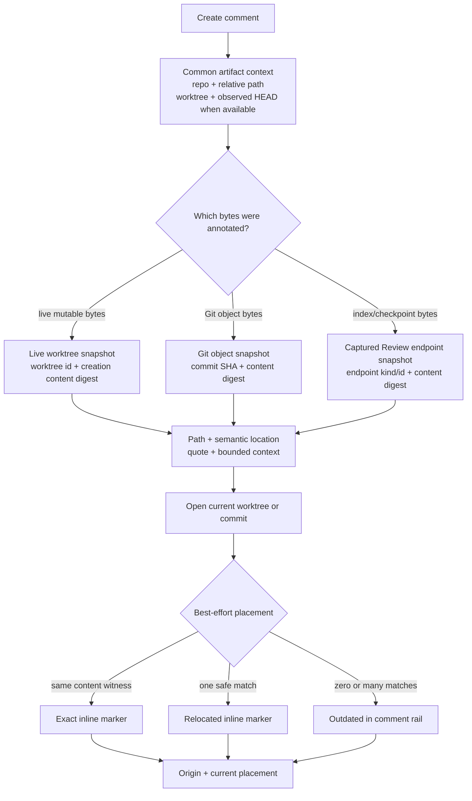

R-ANC-001 — Every located thread must carry a hybrid, source-oriented anchor with:

- durable review and artifact identity;
- repository identity and repo-relative file path;
- artifact view context, including worktree id and the full observed HEAD commit SHA when available;
- annotated-byte provenance discriminated as a captured `liveWorktreeSnapshot`, immutable `commitSnapshot`, or captured non-live `reviewEndpointSnapshot`;
- origin content digest and source locator;
- a semantic location appropriate to the artifact kind;
- exact selected/quoted source text;
- bounded prefix and suffix context; and
- enough ordering data to render and export deterministically.

R-ANC-002 — A `liveWorktreeSnapshot` origin must include canonical repository id, worktree id, repo-relative path, and the file content digest captured when the comment was created. It must also record the full creation-time HEAD commit SHA when the worktree has one, but that SHA is correlation context rather than authority for dirty, staged, or untracked bytes. The captured content digest remains the byte witness.

R-ANC-003 — A `commitSnapshot` origin must include canonical repository id, full commit SHA, repo-relative path at that commit, and content digest. It may retain the worktree from which the view was opened as artifact context, but the commit identifies the annotated bytes. Opening that original commit must resolve exactly without best-effort relocation when the git object remains available.

R-ANC-004 — Markdown anchors must use source block identity or source offsets plus the quote/context witness. DOM parent indexes may assist rendering but must not be the durable authority.

R-ANC-005 — Diff anchors must identify each displayed side's byte provenance independently as `liveWorktreeSnapshot`, `commitSnapshot`, or `reviewEndpointSnapshot`, rather than assuming both sides are commits or share one provenance kind. The annotated side must include file path, old/new side, start/end line, the relevant side's content digest, and original code/context. Line numbers alone are insufficient.

R-ANC-006 — Placement against the currently viewed worktree or commit must follow this ordered best-effort process:

1. Resolve `exact` when origin and target content digests match and the semantic location plus quote still agree.
2. Otherwise map the origin path to the target using the same repo-relative path or available git rename/path information.
3. Within that mapped file, try the recorded Markdown block or diff hunk before broader text matching.
4. Report `relocated` only when the exact quote plus bounded context identifies one safe location.
5. Report `outdated` with reason `ambiguous` or `missing` when there are multiple candidates or no safe candidate.

R-ANC-007 — The origin anchor is immutable. Exact/relocated/outdated placement, target revision identity, matched location, match reason, and candidate count are derived read facts and must not overwrite origin identity.

R-ANC-008 — An outdated thread remains readable and sendable with its original quote, path, and worktree/commit origin. The system must never silently move it to an ambiguous location.

R-ANC-009 — Inline UI must distinguish an exact origin placement from a best-effort relocated placement. The comment rail must retain outdated threads even when no inline marker can be placed.

R-ANC-010 — Copy, JSON export, and agent delivery must include the immutable origin. When the active placement is relocated or outdated, the packet must also include that status and any safe derived target location so the agent does not interpret origin line numbers against the wrong revision.

R-ANC-011 — Runtime `packageId`, `reviewGeneration`, `revision`, `itemId`, `handleId`, cache keys, DOM indexes, and the ephemeral Zoom companion pane id may be projection join keys, but none may be the sole durable anchor.

R-ANC-012 — An artifact-level thread carries durable review/artifact identity but no source anchor or placement state. A review-level thread carries durable review identity but no artifact, source anchor, or placement state. Content changes must not label either kind relocated or outdated.

R-ANC-013 — A `reviewEndpointSnapshot` origin is permitted only when Review View displays non-live bytes such as an index or checkpoint endpoint that cannot truthfully be identified as a worktree or commit. It must include canonical repository/worktree context, endpoint kind and captured endpoint identity, repo-relative path, content role/side, endpoint content-set witness when available, and the displayed content digest. It stores source evidence and quoted context, not a complete historical blob or a promise that the endpoint can be reopened forever. Placement against a later worktree or commit is best effort and never claims that the original bytes came from that target.

R-ANC-014 — When Review View is still displaying the exact non-live endpoint bytes captured by a `reviewEndpointSnapshot`, a newly created thread must remain inline at its exact origin in that view. This is an exact-origin presentation bound to the displayed endpoint identity and content digest, not a claim that index/checkpoint provenance is a generally reopenable placement target. Once the displayed endpoint identity or bytes change, the marker becomes pending/unavailable until placement against an eligible current worktree or commit can be derived.

R-ANC-015 — After restart or view recreation, a `reviewEndpointSnapshot` thread may return to exact-origin inline presentation only when the reopened endpoint kind, captured endpoint identity, content role/side, and displayed content digest all revalidate against the immutable origin. Identity or digest mismatch must produce pending/unavailable rather than reusing old inline coordinates or pretending the endpoint is a worktree/commit placement target.

### 4.5 Placement engine and UI projection

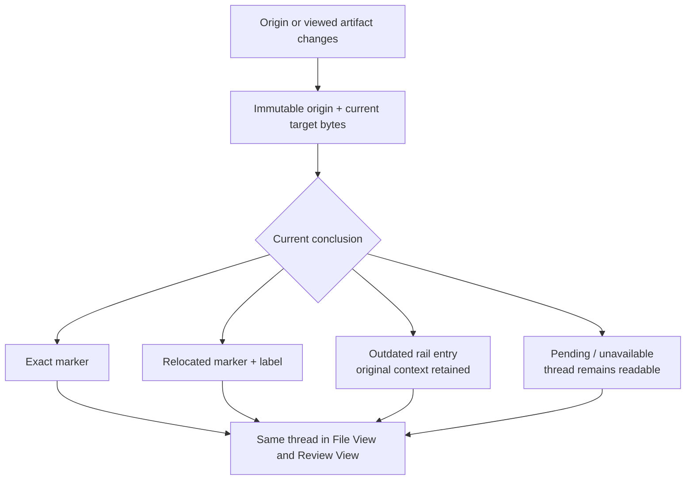

R-PLC-001 — For the same origin and target artifact, File View and Review View must reach the same placement conclusion and preserve the same thread identity.

R-PLC-002 — Placement input must contain the immutable origin anchor plus a target artifact whose view context and byte provenance are explicit: repository, repo-relative path or git path mapping, worktree and observed HEAD when available, `liveWorktreeSnapshot` or `commitSnapshot`, and target content digest.

R-PLC-003 — Current placement presented to either surface must contain:

- anchor and target revision identity;
- `exact`, `relocated`, or `outdated` state;
- resolved target path and content role/side;
- semantic block/hunk identity when available;
- source range or line range sufficient to draw an inline marker;
- match reason and candidate count; and
- the target content identity to which the result applies.

R-PLC-004 — File View and Review View may present a placement differently, but renderer DOM nodes, diff-component identity, or SVG geometry must never become the saved origin.

R-PLC-005 — When the target artifact identity or content changes, the visible placement must become pending or recompute before it is presented as current. Artifact rendering must remain usable while changed-content placement completes.

R-PLC-006 — Best-effort matching must be bounded to the origin file path or one git-mapped rename in the target revision. It must not scan unrelated repository files to manufacture a match.

R-PLC-007 — Placement work must not block the reviewed artifact from rendering. While placement is not yet safe to present, the thread remains readable in the rail with a visible pending or unavailable state.

R-PLC-008 — A prior placement must never be presented as current against different target content. If the product cannot establish that the prior result applies to the current bytes, it must show pending/unavailable until a safe current conclusion exists.

### 4.6 Marking, export, and delivery

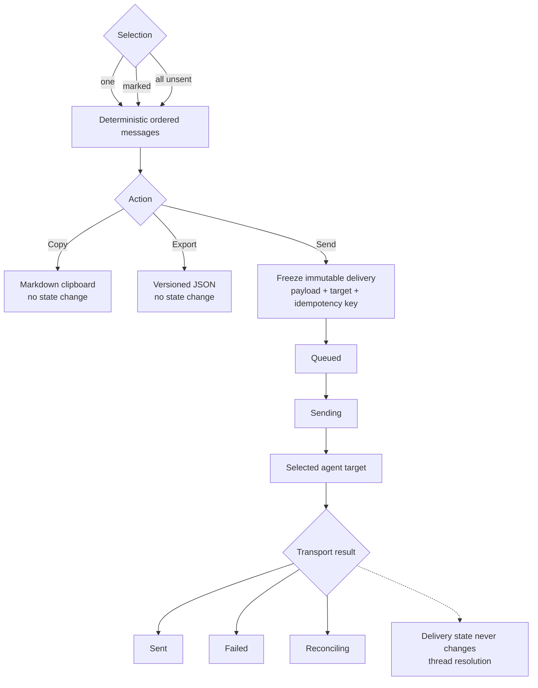

R-DLV-001 — Every eligible unsent human message must support an explicit marked-for-send flag.

R-DLV-002 — File View and Review View must provide three intentional send actions:

- send this message;
- send marked messages; and
- send all currently unsent human messages in the review.

Already delivered messages must not be included again by default.

R-DLV-003 — Each send action must create an immutable delivery payload before invoking a provider. The payload records the exact ordered message versions, anchors, review/artifact identity, target binding, format version, and an app-minted idempotency key. Across restart or pane/session recreation, that binding may resolve only to the same logical Agent Studio target that the reviewer selected; a replaced, missing, or ambiguously reconstructed target remains unavailable and must never receive the historical payload through silent rebinding.

R-DLV-004 — Delivery state must be independent from thread resolution:

- queued;
- sending;
- reconciling, when transport acceptance is indeterminate;
- sent, meaning the target transport accepted the exact payload; or
- failed, with a user-readable retryable/non-retryable classification.

Provider or agent acknowledgement is a separate fact and may be unavailable for a transport. `sent` must never imply `resolved`.

R-DLV-005 — A failed send must retain the original message selection and immutable payload for retry. Retrying the same delivery uses the same idempotency key. Retry is available only when non-acceptance is known or the selected adapter can deduplicate or reconcile that key; an indeterminate non-reconcilable transport remains `reconciling` and must not blindly resend or claim exactly-once delivery. Editing or deleting an included unsent message after known non-acceptance preserves the failed payload for inspection but cancels that delivery's retry eligibility.

R-DLV-006 — Copy Markdown and Export JSON must support the same individual, marked-subset, and all-unsent selections and remain available when no live agent target exists. Their clipboard/file output must not alter review state or mark messages sent.

R-DLV-007 — Markdown output must be deterministic and readable by a terminal agent. Review-level threads come first in thread creation order. Artifacts then follow the review's persisted canonical artifact order, which Review View must expose even when a workflow adds transient grouping, scoring, or navigation order. Transient workflow presentation must not silently change export order. Within each artifact, artifact-level threads come before located threads; located threads sort by their immutable origin source byte position for files/Markdown and by immutable origin old side then new side plus line/range for diffs. Current exact/relocated/unavailable placement never participates in ordering. Thread creation time and stable thread id break ties, then messages sort by creation time and stable message id. Each entry includes its stable thread/message id, artifact/path when applicable, location/quoted context when applicable, and comment body.

R-DLV-008 — JSON export must have a schema version and represent the same ordered selection as Markdown. It must preserve ids, authors, timestamps, anchors, message bodies, delivery eligibility, and resolution state without exposing provider-native session identifiers as domain identity.

R-DLV-009 — Individual send and collated send use the same delivery pipeline and receipt semantics; individual send is a one-message batch, not a separate transport path.

R-DLV-010 — If a target cannot reconcile an indeterminate delivery, the UI must keep the original delivery visibly `reconciling`, preserve its exact payload, and disable ordinary retry. The reviewer may still copy/export that payload or explicitly choose “send again; may duplicate,” which creates a new delivery and requires confirmation of the duplicate risk. The original unknown outcome is never rewritten as failed or sent without evidence.

R-DLV-011 — Outside Pane Zoom, exactly one eligible bound target may be preselected; with zero eligible targets, send is unavailable, and with multiple eligible targets the reviewer must explicitly choose one. The selected target's Agent Studio label and capability limits are visible before confirmation. Target selection for one delivery does not silently change review authorization or the default for unrelated reviews.

R-DLV-012 — Selection membership and new-delivery eligibility are separate. Individual, marked, and all-unsent selection identify current deliverable human-authored message versions; drafts are never members. “All unsent” means deliverable versions not present in an accepted delivery. Copy/export include those selected versions even when a queued, sending, failed, or reconciling delivery currently claims them, and must label their delivery/retry status. Ordinary Send visibly partitions a mixed selection: it freezes all and only the currently unclaimed eligible versions in canonical order and reports every excluded selected version with its current delivery-specific action/status; exclusion must not be silent. If no selected version is eligible, ordinary Send is unavailable and creates no delivery. A claimed version is not eligible for a second ordinary delivery: failed-retryable versions use their original delivery, queued/sending versions remain in flight, and reconciling versions use frozen-payload copy/export, reconciliation, or the confirmed duplicate-risk action. Accepted current versions are not unsent.

R-DLV-013 — A zero-member marked or all-unsent selection has an explicit empty state. Its Copy, Export, and Send actions are unavailable. If a stale or concurrent intent reaches the service after the selection becomes empty, it returns an explicit empty-selection result and must not change the clipboard, create an export artifact or delivery, invoke a provider, or advance review state.

R-DLV-014 — One frozen message version may belong to multiple delivery ids only through confirmed duplicate-risk actions; ordinary retry preserves the original delivery id. Every delivery keeps its own stable delivery id, version, state, target, acknowledgement, and predecessor/successor relationship. A message is sent when at least one membership is accepted, but the UI, JSON, Markdown, and agent query must not collapse multiple memberships into one scalar delivery status or acknowledgement.

R-DLV-015 — A review-wide marked or all-unsent packet initiated from artifact-scoped File View still uses the review's canonical artifact order. For selected messages on artifacts whose current bytes were not supplied and validated by that File View, copy/export/send must include immutable origin plus explicitly unavailable current placement; it must not reuse the focused file's target context or fabricate placement for other artifacts.

### 4.7 Replies, resolution, and agent review participation

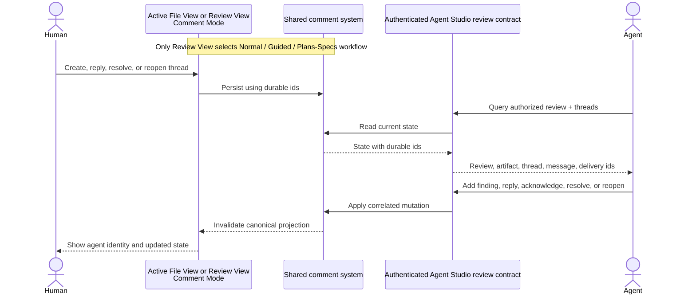

R-COL-001 — Human and agent replies are messages in the same durable thread. A reply must identify its thread and, when applicable, the message or delivery it answers.

R-COL-002 — Both an authorized human and the bound agent may resolve or reopen a thread. The current state must record actor kind, actor identity, and transition time, and the thread timeline must show the transition.

R-COL-003 — Resolution, reopening, delivery, and acknowledgement are independent. No transport event may automatically resolve a thread.

R-COL-004 — Inbound agent events must carry a provider-stable event id or an Agent Studio idempotency key so reconnect/replay does not duplicate replies or state transitions.

R-COL-005 — Agent review participation must let the bound agent:

- query the review, artifact identities, and current agent-visible threads it is authorized to work with;
- create an anchored finding or review-level finding;
- reply to an existing thread;
- acknowledge a delivered batch; and
- resolve or reopen a thread.

R-COL-006 — Correlation must use durable review, thread, message, delivery, and artifact ids supplied by Agent Studio. The agent must not be expected to recover correlation by matching prose, line numbers, or prompt order.

R-COL-007 — If an agent finding supplies an explicit thread id, it appends there. If it supplies a valid artifact anchor without a thread id, it creates a new thread. The system must not fuzzy-merge separate findings merely because their text or line range looks similar.

R-COL-008 — Agent-created messages and state changes must display their origin distinctly from human-authored work while otherwise using the same thread model.

R-COL-009 — Acknowledgement is recorded at delivery granularity. Each delivered message shows every containing delivery and whether that delivery was acknowledged and by which Agent Studio agent actor identity. A thread summary reports acknowledged accepted delivery memberships out of all accepted delivery memberships; it must not collapse partial or duplicate-risk delivery history into one ambiguous boolean.

R-COL-010 — An authorized agent query must expose accepted human message versions with every containing delivery id and delivery version needed to acknowledge or correlate them. It must not expose human drafts, wholly undelivered human message bodies, marked-for-send intent, or the existence or resolution facts of a human-only thread before at least one of its human message versions is accepted. Once a thread contains an accepted human version or any agent-authored message, the review's active authorized binding sees its shared thread/resolution facts and all agent-authored messages, including historical agent work whose author binding was later revoked or replaced; author snapshots must still distinguish which agent created each fact. Revocation blocks that binding's future access. A later explicitly authorized replacement binding sees the same agent-visible history. V1 has no binding-private agent notes or transitive thread-participation visibility rule.

### 4.8 Pane Zoom and target selection

```text
Pane Zoom
┌─────────────────────────────┬────────────────────────────────────┐
│ Source terminal             │ File View or Review View           │
│                             │ Comment Mode                       │
│ agent working…              │                                    │
│                             │ selected source  [1]               │
│                             │ comment rail                       │
├─────────────────────────────┴────────────────────────────────────┤
│ Target: source terminal / bound session                          │
│ [Send this] [Marked] [All unsent] [Copy] [Export]                │
│ Result: sent / failed shown in this surface                      │
└──────────────────────────────────────────────────────────────────┘

The companion may be recreated; the source target and comments stay stable.

Eligible source   → preselected target; send actions enabled
Ineligible source → choose a target; send disabled; copy/export enabled
```

R-ZOM-001 — Review must be a valid retained Pane Zoom companion surface. The current File Viewer-only companion is not sufficient for the requested review loop.

R-ZOM-002 — In side-by-side Pane Zoom, the review companion and delivery actions must retain the source pane identity.

R-ZOM-003 — When the source pane is an eligible terminal or has a bound agent session, it is the default delivery target. Delivery must not infer a target from the transient viewer companion or a generic active pane.

R-ZOM-004 — If the source pane is not an eligible target, direct send is unavailable until the user explicitly chooses a compatible target. Copy Markdown and Export JSON remain available.

R-ZOM-005 — Leaving Zoom, recreating the companion, or changing its transient split ratio must not delete or re-key the review, threads, drafts, marked state, or deliveries.

R-ZOM-006 — Direct send must show the selected target and final sent/failed result without forcing the reviewer to leave File View or Review View.

R-ZOM-007 — The Pane Zoom affordance must let the user choose File or Review as the companion surface. Choosing Review must visibly require selecting an existing review round or deliberately creating one before the companion opens; an owning File/Review context may visibly preselect its current review, but terminal identity, source-pane identity, worktree, path, recency, or the prior companion must not silently choose a review.

## 5. Data durability and lifecycle requirements

Reviewer work has no external rebuild authority. The product must therefore preserve the review record while allowing current placement and local viewing convenience to be rebuilt.

R-DAT-001 — Reviews, artifacts, immutable origins, drafts, message bodies, marked-for-send intent, delivery records, acknowledgements, and resolution history must survive app restart and recovery of any loss-tolerable cache.

R-DAT-002 — The saved review and artifact identity must be sufficient to reopen the same repository/artifact within one review across content refresh, safe topology reconciliation, and one validated rename. Automatic repository re-association after topology-row replacement requires the canonical path identity and successful validation of the recorded Git commit/history witness. When a review was created before any commit witness existed, the continuously present observed topology identity may preserve the current association, but loss or replacement of that topology row must make the source unavailable; path or path-derived stable key alone must never re-associate it. A different repository at the same path, a repository whose recorded witness cannot be validated, or a witness-less review whose observed topology identity was lost must remain source-unavailable until the user explicitly validates a rebind. Reuse of a renamed-away path must be able to represent a distinct artifact; historical path evidence alone must never silently merge or rebind it.

R-DAT-003 — A durable File View or Review View must restore its active review context without making the review owned by that pane. Closing a pane, removing a workspace presentation, or recreating a Zoom companion must not delete the review.

R-DAT-004 — The product must retain enough immutable origin evidence to recompute current placement without retaining complete historical file blobs. If recomputation is not currently possible, the thread remains readable with its origin and a visible unavailable state.

R-DAT-005 — Focus, scroll position, rail dimensions, selected thread, current placement, and Guided viewed progress may be lost or rebuilt without changing reviews, messages, marks, deliveries, acknowledgement, or resolution.

R-DAT-006 — A delivery accepted by a target must remain reproducible as the exact ordered message versions and context that were sent, even after later messages are edited or added.

R-DAT-007 — Acknowledgement cannot exist without an accepted delivery. Acknowledgement, delivery acceptance, resolution, and placement remain independently changeable facts except for that prerequisite.

R-DAT-008 — Whether a current message version is sent must be derived from its membership in an accepted immutable delivery. A second independently writable sent flag must not be able to disagree with delivery history.

R-DAT-009 — V1 must not silently expire, archive, or delete a review. Review-level archive/delete, retention expiry, and cross-review search remain out of scope, so durable reviews accumulate until a later lifecycle contract explicitly defines removal.

### 5.1 Independent product states

The user-visible model must preserve these independent axes:

```text
Message authoring    draft -> deliverable
Selection            unmarked <-> marked (until included successfully)
Delivery             queued -> sending -> sent | failed | reconciling; reconciling -> sent | failed
Acknowledgement      unknown -> acknowledged
Thread resolution    open <-> resolved
Anchor placement     exact | relocated | outdated (computed against current content)
```

Required observable invariants:

- A sent payload is immutable.
- Acknowledgement cannot exist without an accepted delivery.
- A failed delivery may retry with the same delivery id.
- Delivery never changes thread resolution.
- A thread may resolve without being sent and may remain open after acknowledgement.
- `sent` on a message is derived from successful delivery membership, not a second independently writable boolean.
- Loss of derived placement never loses or changes an origin anchor; it only causes recomputation or a visible unavailable state.

## 6. Agent interaction and provider requirements

R-IPC-001 — File View, Review View, and authorized agent operations must converge on the same review record while exposing only the capabilities each consumer needs. Environment-only notification/report ingress is not sufficient for this bidirectional content-bearing loop.

R-IPC-002 — The authenticated agent-facing contract must be provider-neutral and limited to review operations: query review/thread state, create a thread or message, change resolution, acknowledge a delivery, and observe relevant review changes. It must not grant raw database, arbitrary filesystem, source-editing, or patch-application authority.

R-IPC-003 — Review access must reuse the existing authenticated Agent Studio control boundary and explicitly bind an agent target to the reviews it may read or change. Authentication alone must not authorize guessed review, artifact, thread, message, or delivery identifiers. No new authentication system is required.

R-IPC-004 — Review changes must carry durable review/artifact identities and an ordering witness independent from artifact rendering/source revisions. Comment truth must not be embedded in artifact metadata or copied into separate File and Review stores.

R-IPC-005 — A view observing comments must supply its active durable review plus artifact scope, receive a mandatory complete initial state, and then receive ordered changes or a complete replacement when continuity is uncertain. Selected thread details may become available after the complete summary, but empty, unsupported, unavailable, and failed results must remain distinguishable.

R-IPC-006 — If the current app/view integration cannot provide comments, it must return an explicit unsupported state rather than presenting an empty result as “no comments.”

R-IPC-007 — Given an authorized durable review id and optional artifact, thread, or delivery ids, the agent-facing query must return current visible review/thread/delivery state at a named revision with the durable ids and entity versions required for correlated replies, acknowledgement, and mutations. Visibility follows R-COL-010. Agents must not fetch comments by scraping File/Review metadata, terminal output, or raw storage.

R-IPC-008 — Review authorization and delivery target choice are separate. A review may have zero or one active explicitly authorized agent binding with a visible Agent Studio actor label and capabilities; a single delivery chooses exactly one eligible target. Authorizing a different agent requires an explicit rebind that revokes the prior binding and creates a new binding/actor identity. Delivering to a transport-only target does not grant it review query/mutation authority. Revoking or rebinding an agent affects future access and events but preserves prior messages, acknowledgements, deliveries, and actor labels; a replacement binding may query the prior agent-visible history.

R-IPC-009 — File View or Review View must expose an explicit human control for listing eligible agent targets and authorizing, rebinding, or revoking a review binding. The control must show the safe Agent Studio actor label and capabilities, require an intentional action, and remain separate from Send; receiving a delivery must never create authorization implicitly.

R-IPC-010 — For each authorized artifact that can accept an agent-created located finding, the agent-facing query must expose a bounded source reference containing the artifact locator version, available content role/side, endpoint identity/provenance kind, digest algorithm and digest, and typed unavailable/unsupported reason when applicable. The reference identifies the exact review source the agent must already possess through its authorized workspace or provider context; it does not grant arbitrary filesystem access or transport source bytes. A located mutation must bind the reference version, content role, digest, and source range, and must fail atomically if they no longer identify the same bytes. An agent that cannot obtain the referenced bytes may still create an artifact-level or review-level finding but must not fabricate a located origin.

R-ADP-001 — Each supported agent target must declare its available capabilities independently, including delivery, active-turn steering, replies, acknowledgement, agent-authored review operations, and whether its authorized workspace/provider context can obtain the exact bytes named by a source reference for located findings.

R-ADP-002 — Codex App Server is the first rich agent target. It must support delivery to an eligible idle or active Codex conversation without making Codex thread/turn ids or JSON-RPC objects review-domain identity.

R-ADP-003 — Capability absence must be visible. A target without reply or acknowledgement support may still accept delivery, while the UI shows those capabilities as unavailable rather than simulating them.

R-ADP-004 — Optional provider-native tools may expose the same review actions, but the first complete loop must not depend exclusively on an experimental provider API. The authenticated Agent Studio review contract remains available independently.

R-ADP-005 — Terminal injection, Codex App Server, and future supported targets may transport feedback differently, but users must see the same message selection, delivery state meanings, acknowledgement distinction, and correlation identifiers.

R-ADP-006 — When the selected Codex conversation has an active turn and declares active-turn steering, send must append the review packet to that active turn rather than start a second concurrent turn. The UI must identify that active conversation before confirmation and show sending until steering acceptance is proven; rejection is failed and an indeterminate result is reconciling. If active-turn steering is unavailable, that busy target is ineligible until it becomes idle or another target is selected.

## 7. Failure and recovery requirements

R-FLR-001 — App or renderer restart must restore reviews, drafts, marks, messages, resolution, and prior delivery receipts from durable review state.

R-FLR-002 — A view renderer crash or refresh must not own or lose comment truth. Reopening the view must reconverge on the current review.

R-FLR-003 — Provider disconnect before acceptance leaves the delivery failed or queued, never sent. Reconnect/retry must be idempotent.

R-FLR-004 — Provider disconnect after acceptance but before local confirmation must surface an indeterminate/reconciling condition rather than silently resending. Where the provider can query by idempotency key, the adapter must reconcile before retry.

R-FLR-005 — Artifact refresh or switching the viewed worktree/commit must preserve origin anchors and threads. Threads that cannot be placed safely remain in the rail as outdated with their original context and origin revision.

R-FLR-006 — Invalid or oversized inbound agent operations must fail atomically with a bounded, actionable error. Partial batches must not create half-correlated threads.

R-FLR-007 — An invalid or unsupported Mermaid diagram, or one whose readable labels cannot survive required content restrictions, falls back to source/error UI and does not block comments on other blocks or delivery of existing comments.

R-FLR-008 — Missing or invalid derived placement must fall back to bounded recomputation from the saved origin and current artifact. It must not hide a thread, block File View/Review View startup, or mutate the origin anchor.

R-FLR-009 — When refreshed source becomes available while the current File View or Review View has a source selection or non-empty comment draft, automatic source replacement must pause for explicit confirmation. Cancelling keeps the current rendered source and draft. Confirming may replace the viewed bytes, but must preserve the draft and immutable origin and show placement pending/unavailable until recomputed; refresh must never discard or silently retarget draft text. With neither a source selection nor a non-empty draft, refresh may replace the source automatically.

## 8. End-to-end acceptance scenarios

AC-001 — A user opens a Markdown plan in Review View, sees headings, tables, Shiki-highlighted code, and a rendered Mermaid diagram; selects text, writes a comment, restarts Agent Studio, and sees the draft at the same exact anchor.

AC-002 — A user comments on old and new sides of two diff files, marks two of three messages, copies the marked Markdown, and exports JSON. Both outputs contain the same two messages in deterministic artifact/anchor order, and neither operation changes delivery state.

AC-003 — In Pane Zoom with a terminal source and Review companion, the user sends one comment. The delivery targets the source terminal/session, not the companion pane; the UI shows sending then sent when terminal acceptance is proven, or reconciling when a queued disposition has no correlated completion witness, and the thread remains open.

AC-004 — A collated delivery fails before provider acceptance. All selected messages remain marked, the delivery is failed, retry reuses its id, and the agent receives the batch once.

AC-005 — An agent acknowledges a delivery, replies to one thread, creates a new anchored finding, and resolves another. Replaying the same provider events creates no duplicate messages or transitions; the human can reopen the resolved thread.

AC-006 — A comment is anchored to live file bytes in a worktree with its creation content digest and the then-current full HEAD SHA when one exists. After the file changes, one comment relocates uniquely and is labelled relocated; one duplicate match remains outdated/ambiguous in the rail. Both retain their immutable live-worktree snapshot, original quote, and creation-time context; HEAD is not treated as the authority for dirty or untracked bytes.

AC-007 — A comment is anchored to bytes loaded from a commit SHA, even when the view was opened from a worktree context. It resolves exactly when that commit is opened. Against a newer commit or live worktree, git path/rename information and quote context produce either one labelled relocated placement or an outdated result; the Git-object snapshot never changes.

AC-008 — The user chooses Review from the Pane Zoom companion affordance and explicitly selects a review round. After the companion is destroyed and recreated, the same visible selection remains bound to that review; the review and its threads remain keyed to the review/artifact and the source target binding, not to the old companion pane id. Choosing Review without a selected round presents review selection/creation rather than inferring one.

AC-009 — Codex App Server is unavailable. Review authoring, restart recovery, Markdown copy, and JSON export continue to work; direct send clearly reports target unavailability.

AC-010 — A target supports delivery but not replies or acknowledgement. The comment becomes sent after transport acceptance, while reply/acknowledgement affordances remain unavailable and resolution stays unchanged.

AC-011 — A user creates a file comment in File View, opens the same artifact/revision in Review View, and sees the same thread and resolution state at the same placement. Replying or resolving in either surface updates the other without creating a second thread.

AC-012 — When a safe current placement conclusion is already available for the initial snapshot's exact target identity and content digest, the initial snapshot presents it as ready rather than entering pending first. Otherwise the product presents pending/unavailable, derives placement from the saved origin plus current artifact, and returns the same safe placement without losing the thread.

AC-013 — File View opens with an active review id and receives an explicit empty scoped-comment result, so it shows zero comments. An agent then creates an anchored finding through the authenticated review contract; the open view receives the next review change and adds the badge, marker, and rail entry without refreshing file metadata.

AC-014 — The same file path participates in two durable reviews. Standalone File View does not merge their comments: it requires one active review context, shows only that review's threads, and changes to the other review do not appear until the user switches review context.

AC-015 — In Guided Review, the user sees the persisted canonical artifact order as a deterministic sequence, advances through every artifact, and reaches a visible completed pass. An agent finding created during the pass appears in the same review without reordering that sequence or moving the current position. Switching to Plans/Specs filters that same persisted membership to its canonical-order Markdown documents, leaves ordinary source/diff members outside the document pass, and shows Markdown-first document/heading navigation with the same threads. Opening a document or moving among its headings does not mark it viewed; explicit advance or Mark Viewed does. An unavailable Markdown member remains in the pass and may be explicitly marked viewed. The pass completes only when every persisted Markdown member is viewed; a review with none shows an explicit `0/0` no-documents state. Viewed progress changes, but no comment is sent or resolved by either workflow transition. When the underlying package refreshes from artifacts A/B to B/C, A remains a visible unavailable member with its comments and export position, B keeps its identity, and C appears as an explicit add choice; membership and order do not change until the reviewer adds C or starts another review round.

AC-016 — A message is frozen in a delivery whose acceptance becomes indeterminate. Edit and delete are unavailable while it is reconciling. If acceptance is later proven, the exact frozen version is visibly sent. If non-acceptance is proven, the user edits to a new unsent version; the old failed delivery becomes non-retryable while its frozen payload remains inspectable, and the new version remains eligible for a later send under the same `messageId` without ever delivering the divergent older body.

AC-017 — A review has one authorized agent binding and one transport-only terminal target. Outside Zoom, the authorized agent may be preselected while the terminal remains a separate explicit delivery choice; sending to the terminal does not grant review access. Rebinding the review to a second agent atomically revokes the first binding and creates a new actor/binding identity. The first binding then loses future query/mutation/events, while the replacement binding can query the same agent-visible history; historical messages, deliveries, and author snapshots remain unchanged and distinct, and neither agent sees unsent human bodies.

AC-018 — Standalone File View opens a path shared by two review rounds. The picker shows distinguishable titles, times, workflow, source context, and exact-match/add status. Selecting an exact member opens that review; adding the artifact to another review requires a separate explicit action; opaque ids and path-only auto-selection are not offered.

AC-019 — An artifact-level comment and a review-level comment remain visible after the artifact bytes change. Neither gains exact/relocated/outdated placement. Deleting the sole unsent message removes an otherwise empty thread; a thread with history retains a visible tombstone.

AC-020 — A mixed selection containing a review-level thread, two artifacts, an artifact-level thread, file/Markdown locations, and old/new diff sides produces the exact comparator order defined by R-DLV-007 in both Markdown and JSON.

AC-021 — A selected Codex conversation has an active turn and supports steering. The UI identifies it before send, keeps the delivery sending until steering acceptance, and appends the packet to that turn without starting another. Its later delivery acknowledgement appears on each included message and in the thread's acknowledged/total summary.

AC-022 — A review's topology rows are pruned, and an unrelated repository is later cloned at the identical filesystem path. Because the recorded Git-history witness does not validate, the review remains readable/copyable/exportable but source placement and picker applicability stay unavailable until an explicit validated rebind; coincidentally matching text in the foreign repository is never shown as relocated. The same fail-closed result applies when the original review had no commit witness and its observed topology identity was lost: the path-derived stable key alone cannot prove continuity.

AC-023 — Review View compares a commit against an index or checkpoint. Comments on the two diff sides retain independently discriminated origins; the non-live side is recorded as a `reviewEndpointSnapshot`, not mislabeled as worktree or commit bytes. The new non-live-side comment remains inline while those exact endpoint bytes are displayed. Opening a later worktree or commit produces exact, relocated, or outdated placement without changing either origin.

AC-024 — Current message versions in queued, sending, failed-retryable, and reconciling states remain visible to applicable individual, marked, and all-unsent copy/export selection with their delivery status. When a marked or all-unsent selection contains one claimed version and two unclaimed eligible versions, ordinary Send visibly excludes the claimed version with its delivery-specific action/status and freezes the two eligible versions in canonical order; it never rejects the unrelated eligible versions or silently omits the excluded one. If the selection contains no eligible version, ordinary Send is unavailable and creates no delivery. Retry/duplicate-risk actions remain delivery-specific. After acceptance, mark clearing and accepted membership remove that current version from marked/all-unsent selection. An empty selection causes no clipboard, export, delivery, provider, or revision side effect.

AC-025 — Review View opens once from an explicit durable review link and reopens that exact round. The same source opens later without a review id and shows two applicable rounds plus Create New; it does not choose either round from package id, path, worktree, active pane, or recency. Choosing one round binds it, while Create New produces a distinct review id.

AC-026 — A human types the first non-empty comment text, restarts, and recovers the durable draft at its origin; the draft is absent from mark/copy/export/send and from the authorized agent query. Completion atomically makes it deliverable for the human workflow, but the human-only thread and body remain absent from the agent query while wholly undelivered. The first delivery's acceptance becomes indeterminate, and a confirmed duplicate-risk action creates a second delivery that is accepted, making the version sent and the thread agent-visible. Agent query then exposes the accepted human version with both delivery ids/versions, and the UI/JSON/Markdown retain independent state and acknowledgement for both deliveries rather than collapsing them.

AC-027 — File View has a selected source range and non-empty comment draft when refreshed bytes arrive. The view pauses before replacement. Cancelling retains the current rendered source and draft; confirming preserves the draft and immutable origin, replaces the target bytes, and shows placement pending until recomputed. With selection cleared and draft empty, the next source refresh may replace automatically.

AC-028 — File View is bound to review R and navigates to a file that is not a member of R. The view shows a distinct not-in-review state, keeps review-level general-comment creation available, and disables located or artifact-level creation until the user explicitly adds the file. Creating a review-level comment does not add the file, create an artifact, or infer membership.

## 9. Requirement and proof-obligation inventory

| Requirement group | Consumer / outcome | Authority basis | Required evidence class |
| --- | --- | --- | --- |
| R-RDR-001–012 | Human reviewer can read and annotate rich plans/specs/files/diffs through usable Normal, Guided, and Plans/Specs workflows with explicit review-round membership and one per-review workflow | User rendering and workflow decisions; mandated Markdown Exit + Shiki + Mermaid behavior | Automated renderer/workflow/membership behavior plus manual/visual proof and hostile-input misuse cases |
| R-DSC-001–011 | File/Review user can identify and explicitly select or create the correct review and see its current comments | User decision for explicit active review and metadata-independent comment discovery | Integration state inspection plus picker, restart, link, and replacement behavior |
| R-CMT-001–016 | Human can create, navigate, edit, delete, mark, reply, and change workflow without forking truth | User comment-loop and Comment Mode decisions | Automated state/persistence behavior plus manual cross-surface and in-flight interaction |
| R-ANC-001–015 | Located comments retain immutable origin across worktree/commit drift and truthful non-live Review endpoints; whole-artifact/review comments remain unplaced | User origin/placement decision and best-effort agreement | State/data inspection across exact, relocated, ambiguous, missing, restarted non-live endpoint, and unplaced thread kinds |
| R-PLC-001–008 | Both surfaces show the same safe current placement | Anchor requirements and no-silent-relocation decision | Deterministic placement behavior plus visual marker/rail evidence |
| R-DLV-001–015 | Human can collate/copy/export/send exact deliverable feedback, preserve per-delivery facts, choose its target, and recover from empty selection or unknown outcome without hidden duplication | User delivery/export decisions | Data/export comparison, selection-state/comparator cases, multi-delivery membership, transport fault cases, and visible lifecycle proof |
| R-COL-001–010 | Human and agent continue one correlated discussion while unsent human work stays private and acknowledgement remains unambiguous | User decision for replies, findings, acknowledgement, resolve, reopen, and agent-visible feedback | Authenticated agent transcript plus UI/state inspection, visibility, replay, and rollup cases |
| R-ZOM-001–007 | Side-by-side reviewer explicitly chooses a File or Review companion and sends to the explicit source target | User Pane Zoom decision | Native UI interaction plus companion/review selection and target/result inspection |
| R-DAT-001–009 | Reviewer work and independent sent/acknowledged/resolved truth survive while placement/view convenience may rebuild; V1 never silently expires reviews | User durability, lifecycle boundary, and independent-state decisions | Restart/recovery state inspection, invariant cases, accumulation behavior, and exact-delivery reproduction |
| R-IPC-001–010 | Authorized agents query/change reviews and bind located findings to exact source references without scraping, arbitrary source access, or conflating delivery target with authority | User decision to reuse the authenticated Agent Studio boundary | Human binding administration, allowed/denied binding, source-reference/located-mutation binding, revocation, malformed/oversized, and change-observation cases |
| R-ADP-001–006 | Provider differences and active-turn behavior remain visible without changing review meaning | User Codex-first/provider-neutral decision | Capability matrix, active/idle send, and provider fault/reconciliation behavior |
| R-FLR-001–009 | Failures and source refresh contain damage and preserve review truth/drafts | User recovery expectations | Fault injection, restart, unavailable target, cache loss, draft-safe refresh, and renderer failure evidence |
| AC-001–028 | Complete reviewer/agent loop works in the product | All requirements above | Packaged end-to-end and manual/visual product journeys |

No exact test file, command, task order, or harness implementation is selected here. The program design must expose seams capable of producing these evidence classes; the implementation plan later chooses commands and capture procedure.

## 10. Governing-source and decision inventory

| Source identity | Version / digest | Authority status | Freshness and applicability | Scoped-completeness basis |
| --- | --- | --- | --- | --- |
| Superseded predecessor requirements formerly at this path | Reported SHA-256 `ce0e121df6ecb06bed7929905c915638f314371f05ed3f7c43ba52bc27499563`; predecessor bytes are no longer retrievable | Non-retrievable predecessor evidence; not independently normative | 2026-07-30 provenance only | Explains the lineage of the captured comment-loop decisions, but a reviewer cannot reopen it; this Specification is the sole durable normative capture |
| User corrections from the design conversation | Through 2026-07-31; conversation has no durable repository identity or digest | Non-retrievable decision provenance; captured normatively only in this Specification | Current for this design pass, but not independently reopenable by a fresh reviewer | The durable decisions are reproduced here: use Comment Mode; support both File View and Review View; retain worktree/commit/index/checkpoint origin; place best effort when content changes; reuse the existing Bridge and authenticated App IPC transports; avoid a new security or generic collaboration system |
| This Review Comments Specification | This path; exact SHA-256 is supplied by the completion/review packet rather than embedded recursively | Sole durable normative Why/What capture for downstream design | Current revision; any edit invalidates the packet digest | Contains every consumer, user-visible requirement, failure obligation, non-goal, acceptance scenario, and proof modality in scope; downstream work must bind the exact current digest |
| Agent Studio repository | HEAD `8a563d94c7231dc8f7122895bad5c9b856fb86bc` | Observational for current behavior and constraints | Current checkout inspected 2026-07-31 | Covers File/Review models, Markdown worker/sanitizer, Pane Zoom, persistence boundaries, Bridge carrier, and authenticated agent-control boundary |
| Prior technical design sibling | SHA-256 `93cb6c21aac1fb34ee41f5c305551080e6c3939f77721b07dbb47a6a872f571d` | Advisory structural input only | 2026-07-30; must be rebound to this specification | Contains candidate storage, ownership, transport, state, failure, and proof realization; it cannot authorize product meaning |
| [Plannotator](https://github.com/backnotprop/plannotator/tree/a54b46bbee71d7b3f9bf511c9e74db05d21531c2) | Commit `a54b46bbee71d7b3f9bf511c9e74db05d21531c2` | Advisory prior art | Pinned research snapshot | Covers annotation/export interaction and anchor evidence; does not govern durability or agent lifecycle |
| [Markdown Exit plugin contract](https://github.com/serkodev/markdown-exit/blob/1c1c7cb7bd0c3200a705475296d44b33b9e043b8/docs/guide/plugins.md), [Shiki adapter](https://github.com/shikijs/shiki/blob/v4.2.0/packages/markdown-exit/src/index.ts), and [`markdown-exit-mermaid`](https://github.com/Efterklang/markdown-exit-mermaid/blob/b9be431aee47542fa331e8ad1b351258d79c32c2/src/index.ts) | Pinned commits; installed Markdown Exit `1.1.0-beta.2` and Shiki adapter `4.2.0`; Mermaid plugin prior art `2.2.3` is not installed | Platform evidence for the user-mandated rendering contract | Installed sources checked where present; Mermaid plugin inspected only at its pinned upstream commit | Covers composition feasibility and sanitizer conflict; does not select internal ownership beyond observable requirements |
| [Codex App Server](https://learn.chatgpt.com/docs/app-server.md) | Documentation snapshot consulted 2026-07-29 | External platform authority for Codex capabilities; advisory for product choices | Current for this design pass | Covers threads, turns, active-turn steering, events, review output, and experimental tools needed by the first provider |
| Sessions-sidebar backend research | SHA-256 `2a3ad7245213f361c7ded3d61318dd027841f547793dce0058363b1edb876d55` | Advisory comparison | 2026-07-26 snapshot | Covers why report-only notification ingress and rebuildable provider indexes do not settle review-comment authority |

Together these sources cover every governing class in scope: authorized product decisions, current Agent Studio behavior, required rendering/provider platforms, and selected prior art. No unresolved source conflict changes observable product meaning.

## 11. Author self-check and remaining gaps

- Problem → outcome → requirement → observable consequence → proof-modality coverage is present for every numbered group.
- File View, Review View, human reviewer, working agent, and agent-integration consumers are explicit.
- Normal, boundary, failure, unsupported, restart, foreign-repository replacement, and indeterminate-delivery behavior are defined where material.
- Internal storage tables, component owners, dependency direction, call graphs, protocol registries, and recovery mechanisms are intentionally deferred to the sibling program design.
- Cross-machine collaboration, generic chat/issue tracking, patch application, runtime provider plugins, Mermaid SVG-node comments, review removal/search, and a new authentication system remain explicit non-goals.
- No open product decision remains. V1 deliberately accumulates reviews with no silent expiry; concrete accessibility key bindings/layout and performance thresholds remain undefined rather than promised. Existing Agent Studio conventions continue to constrain implementation where this feature introduces no new observable requirement.

This self-check is author evidence bound to the next recorded artifact digest. It is not independent review, pair acceptance, or permission to begin implementation planning.
