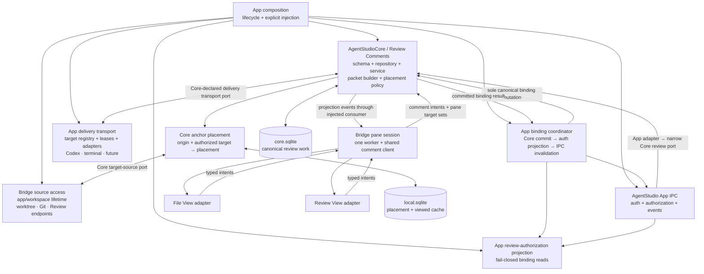
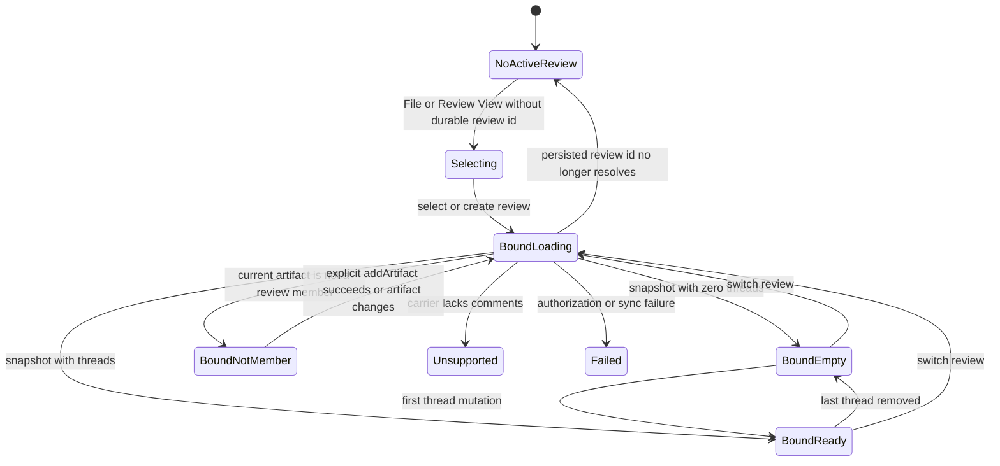
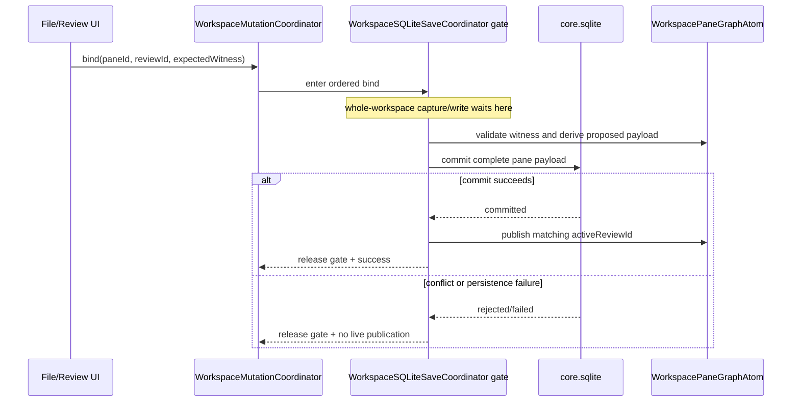
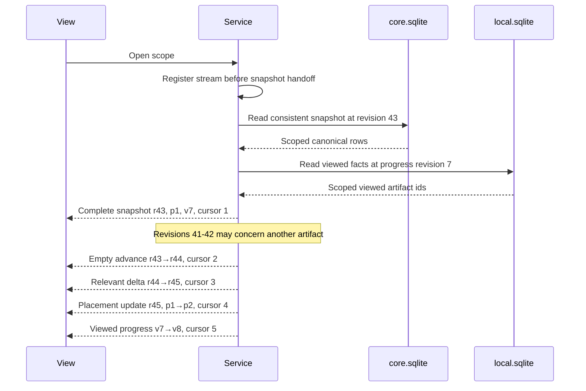
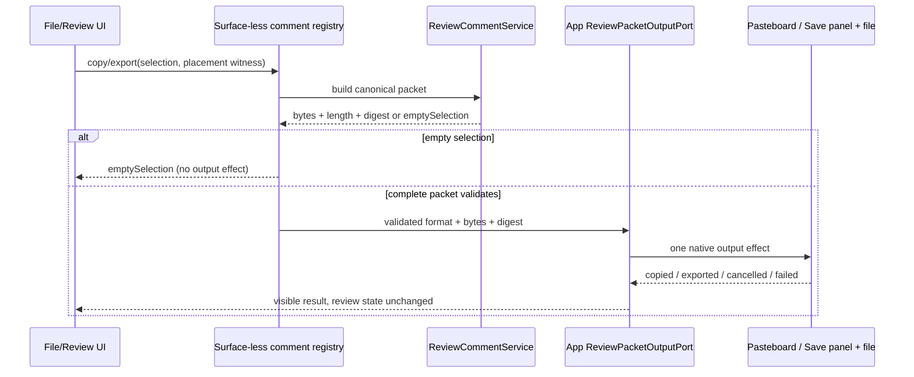
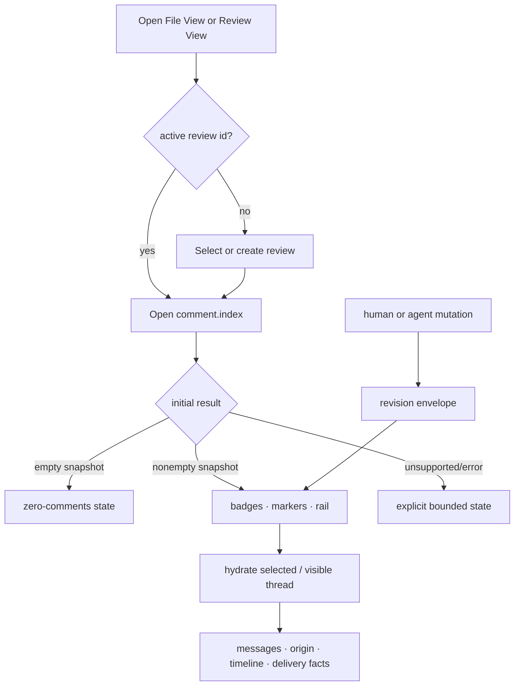
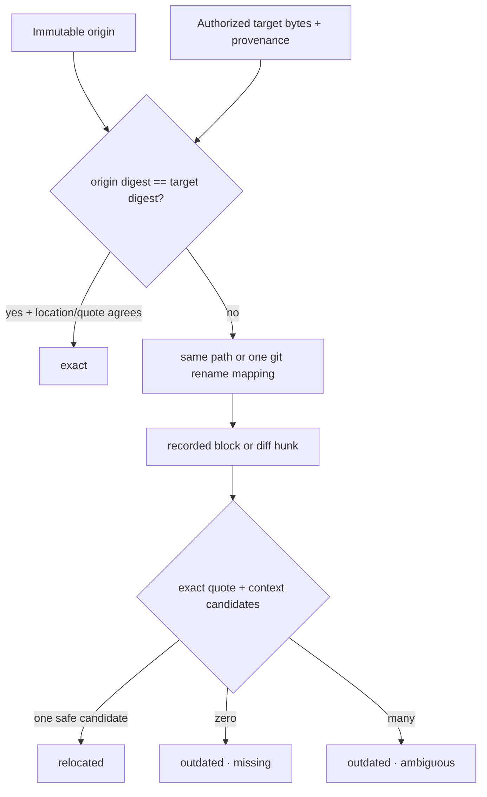
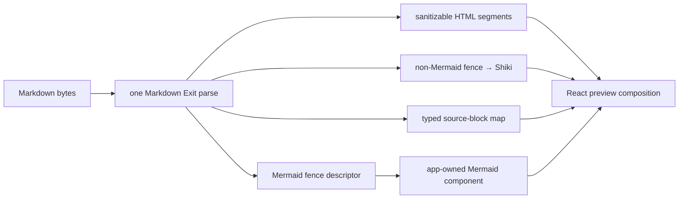
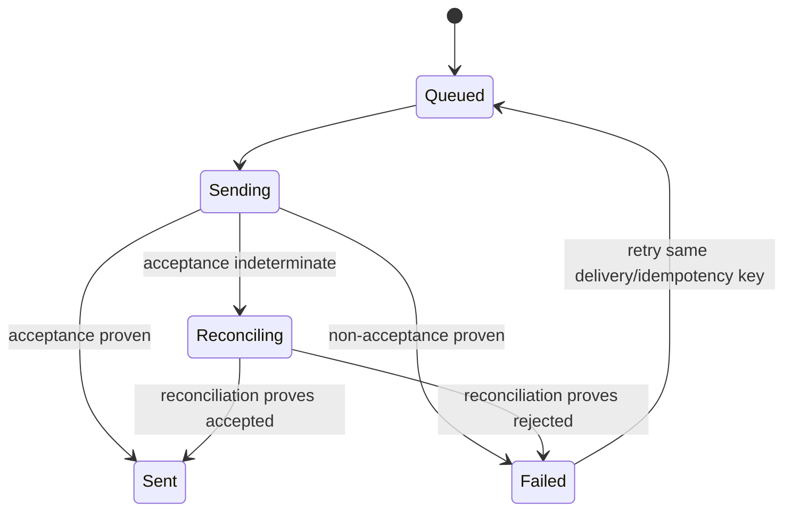
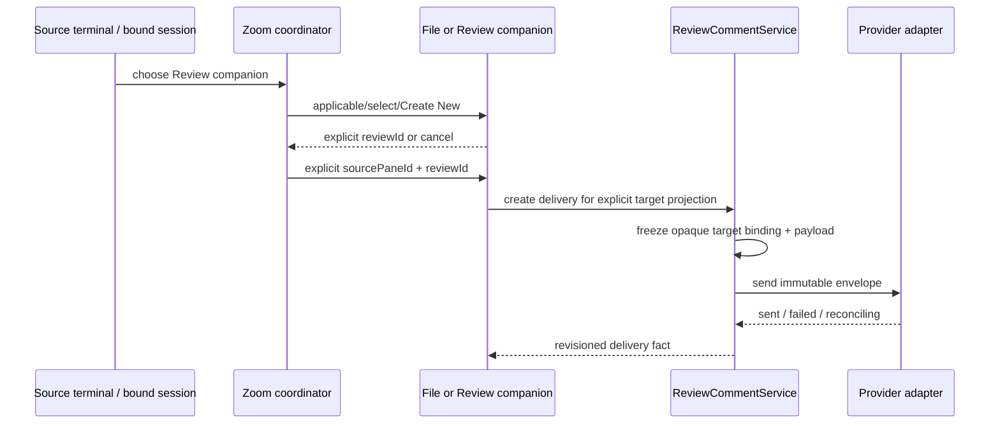

# Deprecated Agent Studio Review Comments Program Design

> Source material only. This document is not current Program Design,
> acceptance authority, or implementation authority. The current design entry
> point is `../2026-08-06-worktree-annotations/README.md`.

Status: deprecated source snapshot; no current authority
Date: 2026-07-31
Target classification: general-domain
Historical governing specification: [2026-07-29-review-comments-requirements.md](2026-07-29-review-comments-requirements.md), same deprecated snapshot
Scope: the shared File View and Review View comment loop; no implementation sequencing

## 1. Contract and product intent

The governing Specification is the product contract. This program design defines the smallest structural How that can satisfy it without turning review comments into a generic chat system, a third-party plugin platform, or a second copy of File/Review state.

The system has one application-global, durable review-comment domain in `AgentStudioCore`. File View and Review View project it through one pane-scoped Bridge client. App-composed agent operations enter the same Core service through a narrow App IPC port. Human and agent operations therefore converge on the same identifiers, revision stream, and SQLite rows. Anchor placement is derived against the currently viewed bytes and never changes the immutable origin. Delivery, acknowledgement, resolution, and placement remain independent facts.

Success means a later implementation plan can assign every requirement to one owner and proof modality without choosing new storage, transport, identity, authorization, rendering, or recovery semantics.

### 1.1 Non-goals

This design does not add:

- comments on terminal transcripts or arbitrary session messages;
- source editing, patch application, or filesystem mutation through review APIs;
- multi-user collaboration, CRDTs, mentions, reactions, assignment, or sync;
- a new SwiftPM product, new SQLite database, generic message bus, or durable event log;
- runtime-loaded providers, a plugin marketplace, or provider wire types in domain rows;
- a new authentication/token system, encryption design, or broad security program;
- historical review snapshots or full origin file blobs;
- review archive/delete, retention expiry, or cross-review search; V1 review rows accumulate and never silently expire;
- SVG-node annotations or generated Mermaid geometry as anchor identity.

### 1.2 Current-system model and constraint degree

This is a compatibility- and platform-bound extension, not greenfield replacement:

- `Package.swift` makes `AgentStudioCore` the coarse shared-domain target with GRDB and `AgentStudioGit`; `AgentStudioBridge` already depends on Core and has no GRDB dependency. Features cannot import sibling Features, while App is the cross-feature composition root.
- `WorkspaceCoreMigrations` and `WorkspaceLocalMigrations` are the current schema authorities for `core.sqlite` and application-root `local.sqlite`. Core opens and prepares those stores; a Feature does not open either database by path.
- `BridgeProductSurface` is exhaustively `file | review`. `BridgeProductWireContract.version` governs worker/native transport, while `BRIDGE_WORKER_WIRE_VERSION` independently governs main/worker messages. Existing session framing already supplies capability admission, body ceilings, sequence acknowledgement, explicit unsupported results, and replacement/resync behavior.
- Current File metadata includes fail-closed `includeComments`/`includeAgentComms` placeholders, but `BridgeWorktreeFileSourceProvider` rejects them. There is no canonical review-comment store or comment discovery path today.
- Current Review workflows name Normal, Guided, and Plans/Specs, but only Normal is a complete journey. The Markdown preview uses Markdown Exit/Shiki and sanitizes HTML; actual Mermaid component rendering plus stable source-span selection are absent.
- App IPC already owns authenticated JSON-RPC, principals, in-memory grants, permission policy, contributions, and filtered events. It intentionally imports neither Core nor Bridge implementations; concrete feature adapters belong in App composition.
- Pane Zoom currently creates a retained File companion from App-owned source-pane context. Review must join that existing composition path rather than create a second window/session coordinator.
- `WorkspaceSQLiteSaveCoordinator` is the current whole-workspace save entry point, but it has no capture-through-commit non-reentrancy primitive; its async save can interleave across suspension points. Making it the shared save/bind ordering gate is new behavior applied to that existing path, not an existing guarantee the design can merely reuse.

Representative current call paths and proof observations:

```text
File/Review surface request
  → App WorkspaceSurfaceCoordinator / PaneTabViewController
  → BridgePaneController
  → BridgeProductSession (worker/native framing and resync)
  → BridgeWeb main/worker projection
  ← typed surface snapshot/error/unsupported result

authenticated app method
  → AgentStudioAppIPCServer
  → registry authorization + in-memory GrantLedger
  → App-owned contribution adapter
  → injected product owner
  ← typed result/event or bounded authorization failure
```

The target keeps those carriers and authority boundaries. It changes canonical review state, adds the missing comment transport lane, and expands the two viewer projections. No current comment data requires migration.

## 2. Decisions at a glance

| Decision | Contract |
| --- | --- |
| Domain owner | `AgentStudioCore` owns review identities, five-family storage, `ReviewCommentService`, revisions/idempotency, packet selection, and placement contracts. It imports no Bridge or App IPC implementation. |
| Composition | Core constructs one application-lifetime `ReviewCommentService` from the prepared database; App injects narrow Core ports into Bridge panes, App IPC composition, provider adapters, and native packet output. App also owns the rebuildable delivery-target registry and a fail-closed authorization projection over canonical review bindings. No ambient Feature scope is added. |
| Durable authority | Five record families in prepared `core.sqlite`: `review`, `review_artifact`, `review_thread`, `review_message`, and `review_delivery`. |
| Rebuildable state | `local.sqlite` may cache placement plus per-review/artifact viewed progress. Runtime owns hot projections, hydration, pending placement, and Comment Mode presentation. Initial projection validates applicable cache entries before publication. |
| UI transport | The existing main/worker pane client plus one new surface-less worker/native comment control registry carry one pane-scoped shared comment client. The registry shares the session's one control sequence, owns bounded packet streams, and has its own worker-generation reset fence. File and Review remain the only visible viewer modes. |
| Agent transport | Authenticated semantic App IPC exposes provider-neutral `review.query`, `review.apply`, and `review.changed`; App owns the Core-revision-to-IPC publisher adapter, and the contract exposes neither Bridge transport nor SQLite. |
| Change ordering | One durable monotonic `review.comment_revision`, rebuildable per-target placement revision, and ephemeral per-subscription stream cursor. Every attach/gap receives a complete canonical snapshot; target-byte churn resets only placement. V1 has no replay ring. |
| Anchors | Immutable hybrid origins; one deterministic placement service returns exact, relocated, or outdated against explicit target bytes. |
| Markdown | One Markdown Exit instance with sibling Shiki and Mermaid integrations; typed Mermaid/source-block descriptors cross outside sanitized HTML. |
| Providers | Static capability adapters consume immutable delivery envelopes. Codex App Server is first; terminal injection is capability-limited. |

## 3. Boundary and separability map



### 3.1 Ownership and dependency direction

`AgentStudioCore/ReviewComments` owns:

- review, artifact, thread, message, delivery, anchor, placement, packet, and provider-neutral target models;
- the sole mutation/revision service;
- the typed SQLite repository, schema codecs, and Core-owned construction factory;
- deterministic selection and packet construction;
- anchor placement and placement-cache policy;
- loss-tolerable per-review/artifact viewed-progress semantics, revision, and projection through the existing pane comment capability;
- provider-neutral delivery/receipt contracts consumed by App-owned adapters.
- the Core-declared `ReviewDeliveryTransportPort` used by the service for target restoration readiness, availability, serialized invocation, and reconciliation without importing App/provider implementations; and
- the Core-declared provider-neutral `ReviewDeliveryTargetProjectionPort` used by Bridge panes to read App-owned delivery-target choices without importing App/provider implementations; and
- the canonical binding-mutation contract consumed by App's binding coordinator.

`AgentStudioCore` owns:

- `core.sqlite` and `local.sqlite` opening, migration assembly, preparation, quarantine, and recovery;
- review table DDL, typed repository construction, and the only access to the prepared GRDB writer;
- an optional Core-owned local placement/viewed cache repository; local loss remains fail-open;
- persisted `BridgePaneState.activeReviewId` as an opaque Core pane-content reference; Bridge reads and supplies it but does not own the field;
- `WorkspaceSQLiteSaveCoordinator` as the single capture/write ordering gate shared by whole-workspace saves and awaited targeted review binds;
- the Core-declared target-source accessor port used by placement and agent-origin derivation; App composes one application/workspace-lifetime Bridge-owned provider without Core importing a Feature type; and
- runtime Zoom presentation truth in `WorkspacePanePresentationAtom`, including the source-keyed companion binding needed to recreate a review companion.

`AgentStudio App` owns:

- requesting the one Core service after successful database preparation;
- injecting it into Bridge pane composition and App IPC ports;
- composing a new application/workspace-lifetime Bridge `ReviewTargetSourceAccess` provider over repository/worktree identity, bounded filesystem reads, the shared `BridgeGitReadScheduler`, and available Review endpoint authorities so agent operations do not depend on an open File/Review pane;
- Zoom source/companion lifecycle over Core-owned presentation state;
- the rebuildable `ReviewDeliveryTargetRegistry` that resolves an opaque app-minted target binding to one current adapter/provider locator; and
- the App implementation of `ReviewDeliveryTargetProjectionPort`, including safe target snapshots and runtime invalidation when eligibility, availability, or capabilities change; and
- the rebuildable `ReviewAuthorizationProjection` that provides fail-closed, nonblocking pane-target/review binding reads for App IPC permission and event checks; and
- `ReviewAgentBindingCoordinator`, the sole cross-boundary owner for human authorize/rebind/revoke sequencing from target prevalidation through Core commit, authorization-projection replacement, App IPC invalidation, and reply/publication completion; and
- the implementation of Core's `ReviewDeliveryTransportPort`, including the restoration barrier, per-target leases, adapter deadlines/quarantine, and typed invocation/reconciliation results; and
- `ReviewPacketOutputPort`, the native pasteboard and save-panel/file-write effect boundary for validated Markdown/JSON packet bytes; and
- registering the finite first-party provider adapters.

`AgentStudioAppIPC` and `AgentStudioProgrammaticControl` own semantic contracts, authentication, authorization vocabulary, event routing, and feature-neutral ports. They must not import Core/Bridge implementations or read the review repository; App composition supplies the concrete adapter.

`AgentStudioBridge` owns pane transport, the new pane-independent implementation of the app/workspace-lifetime Core-declared target-source accessor, pane-specific target projections, placement-to-renderer translation, and File/Review UI adapters. It reads the Core-owned `BridgePaneState.activeReviewId` as an opaque continuation reference. BridgeWeb owns surface presentation and interaction state. Both receive projections and send intents; neither owns canonical bodies, resolution, delivery, anchor origins, persisted pane binding, native clipboard/filesystem effects, or the only path by which an agent can resolve target bytes.

### 3.2 Allowed and forbidden edges

Allowed:

```text
App → Core Review Comments
App → App IPC composition
Bridge → Core review service port
Bridge → Core-declared target-source accessor port
Bridge → Core-declared delivery-target projection port ← App implementation
App composition → Bridge-owned application/workspace target-source provider → Core port
Bridge → App-injected review-binding administration port
Bridge → App-injected review-packet output port
Core Review Comments → AgentStudioGit
Core Review Comments → Core-declared delivery transport port ← App implementation
BridgeWeb File/Review adapters → pane shared comment client
App IPC contribution → injected review port → ReviewCommentService
Provider adapter → immutable envelope / provider-neutral result
App review-binding coordinator → Core binding mutation + authorization projection + App IPC invalidation
```

Forbidden:

```text
Core → Bridge feature types
AgentStudioAppIPC → Bridge implementation
AgentStudioAppIPC → Core implementation
Bridge → GRDB, raw SQLite, or review repository
BridgeWeb → SQLite, App IPC server, filesystem, or provider wire protocol
File state ↔ copied Review comment state
Provider identifiers → review/artifact/thread/message identity
Placement or DOM/SVG coordinates → origin anchor mutation
```

The Core-declared target-source, delivery-transport, and delivery-target-projection contracts preserve dependency direction. Runtime calls and projection publication may flow through those ports, while App composes their Bridge/App implementations behind Core interfaces; Core never imports a Bridge implementation.

The domain stays inside the existing coarse Core target because canonical state has three consumers: Bridge UI, App-composed agent/provider operations, and persistence/recovery. This does not create a new target or resume deferred Core decomposition. A separate ReviewComments target is justified only if the domain later gains an independent build/lifecycle boundary whose benefit exceeds the extra API surface.

## 4. Domain identity and active context

### 4.1 Durable identity rules

- `reviewId` creates one comment namespace. Two reviews of the same path never merge.
- `artifactId` is stable within one review across target refresh, target content changes, and safe path/rename mapping. A changed digest changes placement input, not artifact identity.
- Review repository and originating-worktree identity is a versioned durable value containing the topology row UUID observed at creation, the current path-derived `stable_key`, and a full Git commit witness taken from the creation HEAD or Git-object source when one exists. The observed UUID is continuity evidence only while that topology row remains present. Automatic re-association after row replacement always requires the same stable key plus proof that the current Git object database contains the recorded witness. A review created before any commit exists may remain associated while its observed topology identity is continuously present, but loss or replacement of that row makes the source unavailable; stable-key equality alone never re-associates it. A mismatched stable key, missing recorded witness object, or lost witness-less topology identity requires explicit validated human rebind.
- Each artifact stores two orthogonal persisted discriminants. `sourceKind` describes its locator shape: `liveFile` uses canonical repo/worktree plus a current path, creation path, and historical aliases learned only from an exact open or one safe Git rename; `commitFile` uses full commit SHA plus path; `diffItem` is one composite artifact with independently discriminated `baseEndpoint` and `headEndpoint`, comparison semantics, base/head paths, and side digests. `presentationKind` is `markdownDocument | sourceFile | diff` and is derived once by one Bridge-owned membership classifier from the accepted File/Review source descriptor: a `diffItem` maps to `diff`; a non-diff item whose canonical lowercased extension is `.md` or `.mdx` maps to `markdownDocument`; every other non-diff item maps to `sourceFile`. This shared classifier replaces the current divergent source metadata behavior, where File recognizes `.md` while Review recognizes `.md` and `.mdx`; it does not claim that a pre-existing Markdown-kind field exists. Core persists the resulting discriminant and rejects `sourceKind == diffItem` with any value other than `diff`. A validated rename never changes it, renderer success never changes it, and changing classification requires a new review round. A `diffItem` always has `presentationKind == diff`, even when one side's path ends in `.md`, so it never enters the V1 Plans/Specs document denominator. Each endpoint is `liveWorktree`, `gitObject`, `indexSnapshot`, or `checkpointSnapshot`; the two endpoints need not share a kind. Index/checkpoint locators retain their endpoint kind, captured endpoint identity, worktree context, and content-set witness rather than being mislabeled as commits or promised permanent reopenability. Within a review, `sourceKind` plus the complete canonical locator key is unique.
- The review-comment protocol defines one endpoint discriminant vocabulary: `ReviewCommentContentRole = file | base | head`. A `liveFile` or `commitFile` artifact has exactly the `file` role; a `diffItem` has the ordered `base`, then `head` roles. Diff selection retains the human-facing `side = old | new` discriminator and validates the only legal pairs `old + base` and `new + head`. The existing Bridge `diff` content role represents rendered comparison material and is not a review-comment source endpoint, source reference, target-set member, or located-anchor role. Any other role or side/role pair is rejected before digesting a target set or reading bytes.
- An existing `artifactId` remains authoritative during refresh. A unique validated rename changes a `liveFile` canonical locator key to the new current path in the same transaction and retains the prior path only as a historical alias. Exact current-path lookup always wins; an alias is relocation evidence, never an automatic discovery key. If the renamed-away path is later reused, it may create a distinct artifact with a distinct `artifactId`. Conflicting current-path, alias, or Git-rename evidence requires explicit selection and must never silently create, merge, or rebind an artifact.
- `threadId`, `messageId`, and `deliveryId` are app-minted and stable across surfaces, panes, workers, and providers. Authorization creates distinct app-minted `actorId` and `bindingId` values; rebind creates a new pair rather than treating a binding as author identity. Historical actor snapshots retain the original pair and safe label.
- Provider session/thread/turn IDs are opaque adapter correlation only.
- Package, generation, handle, DOM, cache, and companion-pane IDs are projection joins only.

### 4.2 Active review binding

The Core-owned `BridgePaneState` gains `activeReviewId: UUID?`. Durable File or Review panes persist only this reference in their existing `pane_content_payload`; review rows do not belong to or cascade with the pane. Bridge may read or request changes to the opaque value through Core-owned pane state, but it does not add a parallel Feature-owned binding.

An older or unbound pane decodes to `activeReviewId == nil` and enters `noActiveReview`. A persisted non-null id whose review row cannot be resolved is cleared through the same durable pane-bind path and also enters `noActiveReview` with the picker visible; it is not a hard carrier failure and must not recreate or infer the missing review. The system must never infer a review by path, worktree, package, active pane, or “most recent” data.



Review View receives a review binding only from an explicit durable review id carried by its opening intent, link, or persisted pane. Without one, it enters the same explicit selection/create state as standalone File View. File View opened from Review/Zoom inherits the id explicitly. Neither surface may infer a review from package id, path, worktree, active pane, recency, or a transient package instance. A bound File View that navigates to an artifact outside the review enters `boundNotMember`: the comment rail shows a distinct not-in-review state; located and artifact-level creation are unavailable; review-level general-comment creation remains available; and an explicit Add to Review action invokes `comment.review.addArtifact`. It is neither an empty comment result nor an unsupported carrier, review-level creation does not create membership, and navigation never adds membership silently.

The picker queries Core by canonical repository and returns two groups. Direct matches already contain the artifact by exact canonical locator or one validated rename and sort by most recently updated, then stable review id. Add choices are same-repository reviews without that artifact and require a separate `addArtifact` mutation before binding. Each row projects title, workflow, created/updated time, originating worktree or commit summary, and match/add status; path aliases never choose a review by themselves. Review View and File View both mint a new round only from their dedicated Create New action. A Review package without a durable review id is source context for applicability and initial membership, never review identity.

The pane comment port exposes the complete active-context lifecycle rather than relying on subscription metadata:

```text
comment.review.applicable
  current artifact locator + repository identity witness
  → current binding + direct matches + explicit add choices

comment.review.create
  visible title + workflow + repository context + ordered initial artifacts[1...limit]
  → new review id + ordered artifact ids

comment.review.addArtifact
  review id + current artifact locator + expected review revision
  → existing or newly added artifact id

comment.review.refreshArtifacts
  review id + accepted package/source-generation witness
  + complete existing-member refresh set with expected locator versions
  + expected review revision
  → refreshed locator/source states or incompatibleArtifacts/conflict

comment.review.rebindRepository
  review id + source-unavailable identity + candidate current repository/worktree
  + expected review revision + explicit human confirmation
  → validated review-wide identity/locator versions or incompatibleArtifacts/conflict

comment.review.bind
  pane id + review id | none + expected pane-content witness
  → persisted activeReviewId binding
```

`applicable` is side-effect-free and never binds by path alone. `create` atomically creates the review and its one-or-more ordered initial artifacts; File View supplies one and Review View may supply the deliberately confirmed package membership. `addArtifact` is explicit, validates same-repository identity and exact/rename conflicts, and does not bind the pane by itself. `rebindRepository` is available only from the human UI when the saved source is unavailable; App derives the candidate from the active view, revalidates its canonical repository/worktree identity, and requires explicit confirmation.

The rebind is one review-wide Core transaction. Before writing, it validates every materializable current artifact locator against the candidate repository/worktree: live-file and live-worktree endpoint locators require an exact path or one safe rename in the candidate worktree; commit-file and Git-object endpoints require their full commit objects in the candidate repository. A captured index/checkpoint endpoint uses an exact current resolver witness when one exists. Without that resolver, the historical member is rebind-neutral: its immutable origin and captured endpoint evidence remain unchanged, its current source stays `unavailable(unsupportedEndpoint)`, and it neither validates nor blocks the candidate association. The explicit human confirmation plus the review identity predicate and every materializable member still validate the candidate; any member that can be materialized but cannot be represented consistently returns `incompatibleArtifacts(artifactIds)` and changes nothing. On success, the transaction updates the review repository/originating-worktree identity and current commit witness, rewrites only applicable current locator repository/worktree facts, advances every affected artifact locator version and the review comment revision once, and retains artifact IDs, immutable comment origins, captured endpoint provenance, and historical path aliases unchanged. It never claims that an unresolved index/checkpoint endpoint became reopenable. The locator-version advance immediately invalidates prior App IPC source references, accepted pane target sets, and placement-cache keys; subscribers receive replacement target sets/snapshots, and local cache deletion is unnecessary for correctness. A witness-less rebind retains its newly observed topology identity and again fails closed if that identity is later lost. `bind` is the sole durable pane-binding mutation and never creates review or artifact membership implicitly. Review View package opening uses the same create/reopen/add semantics through App composition; it is not a second lifecycle path.

A review round's artifact membership and canonical order are durable. A new Review package generation invokes `comment.review.refreshArtifacts` with one complete entry for every persisted member: a validated current locator/source proposal or a bounded unavailable reason. Core validates the package/source-generation witness, same-repository scope, expected review and locator versions, exact/unique rename facts, and the complete persisted-member set. One transaction updates only existing members' current locator/display/source-availability facts, advances every changed locator version and `commentRevision` once, and invalidates old source references, accepted target sets, and placement-cache evidence. It never adds, removes, or reorders membership. An invalid, incomplete, ambiguous, or stale proposal rejects the whole refresh with no canonical change. Newly discovered package artifacts remain explicit `addArtifact` choices; members missing from the current package become source unavailable in their existing order with comments/export history intact. The accepted Review package/source publication is the caller; pane target replacement remains placement-only and cannot substitute for this mutation. Guided progress includes persisted unavailable members and lets the reviewer explicitly mark one viewed. A materially different package may instead create a new review round.

`WorkspaceMutationCoordinator` becomes the sole sequencing owner for `comment.review.bind`; this is a new coordinator operation, not a claim that the current coordinator already owns general pane-content writes. `WorkspacePaneGraphAtom` remains the live pane-content owner. The pane projection supplies a Core-minted `PaneContentWitness`: pane id, content discriminator, and a digest of the canonical encoded current `PaneContent` value. This is the optimistic-concurrency witness for binding. `PaneContent.currentVersion` remains only the serialized shape version; adding `activeReviewId` requires a schema-version bump, but that constant is never compared as an entity revision.

`WorkspaceSQLiteSaveCoordinator` becomes the one non-reentrant capture/write ordering gate for both existing whole-workspace saves and the awaited targeted bind. A whole-workspace save enters the gate before it captures atom state and holds the gate through preparation and database commit. A bind enters the same gate, asks `ReviewCommentService` only to validate the review and repository/artifact relationship, revalidates the expected witness against the current live pane, and persists the complete proposed pane-content payload with the updated `activeReviewId`. `WorkspaceMutationCoordinator` pins that pane witness until the bind finishes, so an overlapping pane-content mutation waits and cannot be overwritten by the later live publication. After the database commit, the bind publishes exactly that proposed value to `WorkspacePaneGraphAtom` before releasing the gate. A whole-workspace save captured before the bind must finish first; a save after it must capture the published binding. No older captured snapshot can commit afterward and restore the previous payload.

The existing direct default-workspace write in `WorkspaceStore.initializeAndApplyDefaultWorkspace` is the narrow boot-only exception to that runtime gate. It runs only after load has selected default-workspace initialization and before live pane state, autosave, or review binding is exposed, so there is no concurrent capture or targeted bind to order. After that boot transition, every whole-workspace save and targeted review bind uses `WorkspaceSQLiteSaveCoordinator`; the exception cannot be called as a runtime save path.



A witness conflict, removed pane, unavailable review, or persistence failure publishes nothing and changes neither live nor durable pane content. Binding does not rely on debounced autosave, changes pane state rather than review rows, and therefore does not advance `commentRevision`; the subsequent subscription snapshot establishes canonical review state. `ReviewCommentService` never writes pane SQL or mutates the pane atom directly.

### 4.3 Comment Mode and Review workflows

Comment Mode is per-surface runtime presentation state. It enables creation gestures, composer, comment-focused navigation, and mutations. Turning it off leaves existing counts, markers, thread selection, and readable rail content discoverable.

Normal, Guided, and Plans/Specs are Review View workflow projections over the same `reviewId`. Workflow selection is canonical per review in the `review.workflow` column; every open Review View projects that value and a workflow change is one ordinary review mutation. It never changes comment identity or availability. Guided Review coordinates agent participation through the same App IPC operations rather than creating a second collaboration system.

Their minimum V1 semantics are:

- Normal presents the existing artifact/file navigation with optional comment-focused rail mode.
- Guided uses the persisted canonical artifact order as its stable sequence. The currently displayed member supplies the runtime current-position index; the cursor is not persisted and view recreation may start from the existing surface's ordinary selection/default behavior. Advancing past an artifact records loss-tolerable `viewed` progress in local UX state; the workflow is complete when every in-scope artifact is viewed. Open/unresolved threads and newly arriving findings remain separate canonical summaries and never reorder the sequence, move current position, or redefine viewed progress. A bound agent queries the same review and correlates findings by artifact/thread ID.
- Plans/Specs selects a Markdown-first presentation with rendered sections, code, and supported Mermaid diagrams while retaining source/diff fallback. Its in-scope review set is exactly the review artifacts whose persisted `presentationKind == markdownDocument`, in canonical artifact order; `sourceFile` and `diff` members remain available but do not enter this workflow's progress denominator. Classification is fixed when membership is added and survives path rename or source unavailability. The document/heading navigator consumes the parser-derived heading projection from Section 10. BridgeWeb owns only runtime navigator selection; heading identity, title, level, order, and source range come from parser-issued block descriptors rather than DOM queries. Duplicate headings remain distinct by block identity, and refresh retains selection only when that source block still validates, otherwise selecting the first surviving heading or document start visibly. Opening a document or navigating headings does not mark it viewed. Explicit advance or **Mark Viewed** records loss-tolerable local progress; an unavailable Markdown member remains in canonical order and can still be explicitly marked viewed. Completion means every in-scope Markdown member is viewed, independent of open threads; an empty set visibly reports `0/0` rather than inferring completion from ordinary artifacts.

These workflows may change ordering, defaults, and guidance only. They do not fork artifacts, comments, placement, packets, or delivery.

## 5. Durable schema and storage

This is a light schema contract. Exact SQL spelling belongs to planning, but ownership, relations, uniqueness, and indexes are fixed here.

### 5.1 Core tables

| Record | Required columns and constraints |
| --- | --- |
| `review` | `id` PK; scalar `repo_stable_key`, optional full `repo_identity_commit_sha`, and observed repository topology UUID; optional scalar `originating_worktree_stable_key` plus observed worktree UUID; automatic re-association requires stable-key equality plus containment of the commit witness when present, while observed UUIDs remain provenance without cascading FKs; workflow; title/source description; `comment_revision >= 0`; optional versioned `active_agent_binding_json`; created/updated timestamps. |
| `review_artifact` | `id` PK; `review_id` FK cascade; persisted `source_kind` and `presentation_kind (markdownDocument | sourceFile | diff)`; versioned durable source locator and canonical locator key; current display path/path aliases; view/provenance JSON and digests; stable artifact order; unique `(review_id, canonical_locator_key)` and deterministic order uniqueness. |
| `review_thread` | `id` PK; `review_id` FK; `version >= 1`, incremented by every thread-state mutation; kind `located | artifact | review`; optional `artifact_id` FK constrained by kind; nullable versioned `anchor_json` present only for `located` and immutable after creation in V1; optional creation-operation id plus versioned receipt; open/resolved state; versioned `resolution_history_json`; latest transition actor snapshot/time; created/updated timestamps. |
| `review_message` | `id` PK; `review_id` and `thread_id` FKs; current `version >= 1`; immutable author kind plus versioned actor snapshot; body or deleted tombstone; draft/deliverable state; marked flag valid only for deliverable human messages; created/updated/deleted timestamps; optional discriminated reply target `message(message_id) | delivery(delivery_id)`; optional creation/provider operation id plus versioned receipt; versioned derived membership references `(messageVersion, deliveryId)` for indexed projection; optional current-version active ordinary-delivery claim used only to prevent overlapping ordinary sends, never as delivery history or status projection. |
| `review_delivery` | `id` PK; `review_id` FK; `version >= 1`, incremented by every delivery-state/acknowledgement mutation; unique idempotency key; opaque Agent Studio target binding and optional authorization-binding id; immutable safe target label plus provider-neutral target-kind snapshot frozen at creation; immutable versioned payload JSON and digest containing ordered message-version memberships; queued/sending/reconciling/sent/failed state; nullable `provider_invocation_started_at`; optional uncertain-predecessor delivery id plus unique duplicate-risk action id and confirmation time; zero or more successor deliveries may reference one predecessor through distinct confirmed actions; acknowledgement fact/time and immutable acknowledging Agent Studio actor snapshot plus inbound operation id and versioned receipt; bounded failure classification; timestamps. |

`review_thread.review_id` and `review_message.review_id` are intentionally redundant relational guards. Foreign keys or transaction validation must prove referenced artifact/thread/message rows belong to the same review; caller-supplied IDs never establish scope.

Repository and worktree topology are rediscoverable application state, while a review is not. Topology reconciliation may therefore delete or recreate `repo`/`worktree` rows without deleting or rebinding a review. When the same canonical path returns, its deterministic topology `stable_key` is only the first lookup key; automatic re-association also proves the current Git object database contains the recorded full commit witness. The old row UUID need not recur when that witness proves continuity. When no witness was recorded, the observed row identity is usable only while continuously present; after its loss or replacement, the path-derived stable key cannot re-associate the review. A foreign repository at the same path, a missing recorded witness, or a lost witness-less topology identity leaves the review queryable by `reviewId`, readable, copyable, and exportable while source-dependent placement and delivery targets stay unavailable until the explicit validated human rebind in Section 4.2. The standalone picker lists it for a current repository only after that durable identity predicate passes.

A versioned actor snapshot is discriminated as `human(localReviewer, "Reviewer")` or `agent(app-minted actor id, safe visible label, provider/target kind, binding id)`. The V1 human identity is the stable local-reviewer semantic identity, not an account, process, or ephemeral UI identity. Messages, acknowledgement facts, and resolution-history transitions copy the appropriate immutable snapshot when the act commits. Historical rendering therefore never depends on a live binding, process identity, or provider-native identifier. `review.active_agent_binding_json` is only the zero-or-one current authorization association; revocation clears it and rebind replaces it. Historical actor labels and binding ids survive only in the immutable facts that need them, so Core does not retain a second binding-history collection.

Agent/provider exact replay uses one common versioned operation receipt embedded in the canonical outcome owner rather than a sixth table. Every receipt contains the namespaced `operationId`, app-minted `batchId`, operation index/count, operation kind, canonical request digest, applied review revision, and ordered affected IDs. `createThread` stores its receipt on the created thread, `addMessage` on the created message, acknowledgement on the delivery, and resolution/reopen inside the appended resolution-history entry. Provider ingress uses the same shape with a single-operation batch when no larger batch exists. Operation-id lookup uses scalar indexed fields where present; the bounded thread-owned resolution history remains the accepted decode-cost exception.

### 5.2 Required indexes

- `review(repo_stable_key, updated_at DESC)` and `review(repo_stable_key, originating_worktree_stable_key, updated_at DESC)` for standalone selection and topology-row re-association;
- unique `review_artifact(review_id, canonical_locator_key)` and lookup by current display path/path alias for scoped discovery;
- `review_artifact(review_id, sort_index)` for deterministic projection/export;
- `review_thread(review_id, artifact_id, resolution_state, created_at)` for index snapshots;
- `review_message(thread_id, created_at, id)` and partial marked/deliverable lookup for deterministic selection; derived membership references provide delivery ids for batched indexed delivery lookup without decoding every frozen payload;
- unique scalar namespaced operation ids on thread/message/delivery outcome owners when non-null; cross-family uniqueness, including resolution-history receipts, is enforced by the service transaction;
- `review_delivery(review_id, state, created_at)`, unique idempotency key, and unique non-null duplicate-risk action id.

No discovery query may scan or decode `anchor_json` or every delivery payload. Delivery creation/duplicate-risk transactions append the compact `(messageVersion, deliveryId)` reference to each member message in the same commit; message edit never deletes historical references. Query then batch-loads indexed delivery rows by those ids. The immutable delivery payload remains membership authority, and repair/proof must be able to rebuild and compare the derived references from it.

### 5.3 Message versions and immutable delivery membership

For a valid selected anchor or general-comment scope, the first non-empty human composer update atomically creates a thread plus first `draft` message; opening an empty composer creates no durable row. Later composer updates replace that draft body under its expected message version. `completeDraft` validates a non-empty body and atomically changes only that message to `deliverable`; failure leaves the draft unchanged. `discardDraft` may delete a never-delivered draft and its otherwise empty thread. Draft rows survive restart but selectors, marks, packets, deliveries, and agent queries reject or omit them.

Editing an unsent message increments `review_message.version`. A delivery member is the identity tuple:

```text
messageId + messageVersion + bodyDigest + frozen body
```

Each ordered delivery-payload item stores that tuple together with the frozen packet context used for provider invocation: review, artifact, and thread identity; immutable origin; the explicit target-context-validated placement status and safe target location, including pending/unavailable when no ready placement was witnessed; author/timestamp; reply target; and payload format version. Delivery membership, sent derivation, claim exclusion, and derived membership references still key only on the identity tuple. The contextual fields make retry, reconciliation, duplicate-risk resend, and `comment.delivery.packet.build` reproduce the exact original agent input instead of joining mutable live rows or placement state.

A reply target is either `message(messageId)` or `delivery(deliveryId)`; an untyped UUID is invalid. Both targets must belong to the same review. A message target must belong to the reply's thread. A delivery target is valid for that thread only when the immutable delivery contains at least one message version from it; a multi-thread delivery may therefore be referenced independently by replies in each included thread. The discriminator and target survive persistence, query projection, Markdown/JSON export, and agent DTO translation.

The delivery payload stores those contextual items in identity-tuple order. A successful delivery marks that exact version as delivered; it does not imply that a later live version was sent.

Creating a delivery freezes its payload before provider invocation. Editing or deleting a message version referenced by a queued, sending, reconciling, or sent delivery is rejected. After a known failed delivery, the user may retry the immutable version, edit the live message into a new version, or delete the unsent human message. Retry must happen before edit: editing creates a new unsent version and atomically makes every failed delivery containing an older version of that `messageId` failed-non-retryable `supersededByAuthor`. When a failed delivery becomes non-retryable for any member, the same transaction releases its claim from every other member whose current version is unchanged and has no other active claim; the frozen payload and all historical membership remain intact. This prevents one edited member from stranding unrelated unsent members. Once a version is sent, corrections use a new follow-up message with a new `messageId`, not an edit of the delivered body.

Delivery creation atomically claims every current message version in the selector's witnessed eligible Send subset; selected ineligible versions remain unclaimed by that new delivery and are returned as visible exclusions. A version claimed by a queued, sending, reconciling, sent, or failed-retryable delivery is not eligible for a second new delivery. Retry keeps the same delivery, frozen membership, and idempotency key. Editing after known failure creates a new live version, clears the live-version claim, and cancels retry for every older failed delivery containing that message. This prevents one `messageId` from reaching a target with divergent bodies while preserving exact failed history.

The one exception is the Specification's explicit duplicate-risk action for a permanently non-reconcilable delivery. It does not run the ordinary selector. After confirmation, the service clones the original frozen payload into a new delivery with a new idempotency key, records the reconciling predecessor and confirmation time, and leaves the predecessor unchanged. This makes possible duplication explicit and auditable without pretending the original outcome is known.

Deleting an unsent human message is a semantic delete, not delivery-history erasure. In the same transaction, every failed-retryable delivery containing any version of that message becomes failed-non-retryable with bounded `cancelledByAuthor` classification, releases still-current claims for its other members under the rule above, and retains its frozen payload. If the message has no delivery history and is the sole message with no reply, the service deletes the thread atomically. Otherwise it retains an identity/timestamp tombstone, clears the body and mark, and preserves replies and delivery correlation. A delivered, queued, sending, reconciling, or agent-authored message cannot be deleted; corrections to delivered content are follow-up messages with new identities.

“Sent” is derived by matching the current message version/digest to membership in at least one accepted delivery. It is not a mutable message boolean. A version may have multiple delivery ids after confirmed duplicate-risk actions; ordinary retry keeps one id. Query, UI, Markdown, and JSON use the derived membership references to enumerate each delivery's id, version, state, frozen safe target label/target kind, acknowledgement, and predecessor relationship, then validate against its payload at mutation/proof boundaries. Historical target presentation always reads the frozen delivery snapshot; live availability and capabilities remain registry-owned and never rewrite history. The optional active claim is only an ordinary-send exclusion guard and is cleared or replaced by the lifecycle rules; it is never used as the sole projection of membership or acknowledgement. Delivery payload membership remains the authority.

Acceptance clears `markedForSend` in the same transaction only when the live current message version and digest are the accepted frozen member. Queued, sending, failed, and reconciling outcomes retain the mark. The edit rule above makes acceptance of an older frozen version after a newer live version impossible through ordinary retry; indeterminate deliveries remain edit-locked until their outcome is known.

### 5.4 Resolution history within five families

`review_thread.resolution_history_json` is a versioned ordered array of:

```text
transitionId, fromState, toState, actorSnapshot,
occurredAt, clientOperationId or providerEventId, optional operationReceipt
```

Every resolve/reopen transaction appends exactly one transition and updates the thread's current state/latest fields. The history is canonical, survives restart, and powers the visible timeline. The same namespaced operation id cannot appear twice in a review across thread creation, message creation, delivery acknowledgement, or resolution outcomes. This avoids a sixth event table in V1. A separate transition table becomes justified only if measured history size or query requirements make the row-owned array unsuitable; V1 does not reject a valid resolve/reopen merely because the history has grown.

### 5.5 Core preparation and zero-workspace state

Core remains the only database opener, migration owner, and review-repository constructor. After preparation, a Core-owned factory binds the typed repository to the retained core writer and optional Core-owned local cache repository, then returns the sole `ReviewCommentService` capability. App injects only that semantic service/ports into Bridge and App IPC; neither consumer receives `DatabaseWriter`, constructs another pool, opens a database by path, or bypasses the service. Review transactions touch only review tables and are independent of workspace snapshot commit sequencing; the shared GRDB writer still serializes physical writes. Local unavailability is fail-open for canonical review behavior.

Application-global review rows must survive workspace removal. During strict preparation, Core's storage repository classifies a migrated database with zero workspaces and at least one structurally valid `review` row as `reviewOnly`; checking row presence is a storage/schema invariant, not Bridge product behavior. `PreparedCoreDatabase.reviewOnly` keeps the review writer available and presents workspace loading as uninitialized, so existing workspace boot creates its normal default workspace without deleting reviews. The resulting default-workspace initialization may use the existing direct datastore write only as the pre-exposure boot exception defined in Section 4.2; it completes before pane/bind/autosave runtime owners become available. A pre-existing database with neither a valid workspace nor a review row retains the current strict rejection, which continues to distinguish an unexpectedly empty pre-existing database from a newly created one.

V1 defines no review archive/delete/expiry mutation, retention job, or cross-review search index. Canonical review rows accumulate and survive ordinary workspace/pane removal; no cache cleanup or topology reconciliation may delete them. A later lifecycle design must own removal semantics and migration explicitly rather than treating age or invisibility as deletion authority.

### 5.6 Local and runtime state

`local.sqlite` may contain two loss-tolerable review lanes:

- placement-cache rows keyed by:

```text
threadId + target identity/content digest + algorithmVersion
```

- per-review/artifact `viewed` progress.

`ReviewCommentService` is the semantic owner of viewed progress even though the optional Core local repository stores it. Each review has a local `progressRevision` and a set of viewed artifact IDs constrained to current durable membership. `comment.progress.markViewed(reviewId, artifactId, expectedProgressRevision)` is the only V1 mutation: explicit Guided/Plans advance and **Mark Viewed** invoke it; ordinary open, selection, file navigation, heading navigation, or workflow change never does. The local write commits before the in-memory projection advances. An already-viewed artifact is an idempotent `alreadyViewed` result with the current progress revision; otherwise a stale expected revision returns the current progress revision and changes nothing, and an unknown or non-member artifact is rejected. Successful writes increment only `progressRevision`, publish the new scoped viewed facts to every open pane subscription for that review, and never change `commentRevision` or canonical rows.

The initial pane comment snapshot joins canonical state at `commentRevision`, placement at `placementRevision`, and viewed facts at `progressRevision`; these are independent witnesses and do not claim one cross-database transaction. A new or reattached pane always receives the complete current viewed set for its scope. A local write failure leaves the prior projection visible and returns a typed retryable failure. Local cache quarantine or loss resets viewed progress to empty, closes/resets affected subscriptions, and supplies a replacement snapshot; canonical review/comment state remains unchanged. This is the cross-pane/restart reconvergence path and does not add another durable record family, queue, or replay log.

Focus, scroll, rail dimensions, selected thread, hydration state, and Comment Mode are runtime or recoverable local UX state. Cache quarantine or loss cannot remove, alter, resolve, or hide a canonical thread.

## 6. Service, transaction, revision, and replay contract

### 6.1 Sole mutation owner

One application-lifetime `ReviewCommentService` actor is the only semantic mutation/revision owner. Bridge intents, App IPC operations, provider results, and delivery state transitions all enter it through typed methods. The actor delegates SQL to the repository, placement to the placement service, and transport to adapters; it is not a single giant implementation type.

Every accepted canonical mutation transaction:

1. validates authorization scope, entity versions, state transition, and operation id;
2. changes all required rows atomically, including acceptance-conditioned mark clearing when applicable;
3. advances `review.comment_revision` exactly once in the same transaction;
4. records each namespaced agent/provider operation receipt on its one durable outcome owner: created thread, created message, resolution-history entry, or delivery acknowledgement;
5. hands a compact delta to service-owned publication work created as part of the commit completion path.

The Section 5.6 local viewed-progress mutation is the bounded exception to canonical steps 2–4: the same service owns it, but it writes only the Core local repository, advances only `progressRevision`, and publishes only a progress frame. It never allocates a canonical operation receipt or advances `commentRevision`.

The commit-to-publication handoff is cancellation-independent. Once the repository transaction succeeds, caller cancellation cannot discard the publication obligation: the service-owned work either enqueues the committed revision to every affected subscriber or closes/resets that subscriber so it obtains a complete snapshot. A binding mutation is an ordinary canonical revision for human Bridge subscribers: File/Review comment snapshots, deltas, placement frames, and `streamCursor` assignment do not wait for App authorization projection replacement and are not reset merely because an agent is authorized, rebound, or revoked. Agent-facing completion remains ordered separately by `ReviewAgentBindingCoordinator`: the human administration call does not report success, and App IPC access/event visibility does not admit the new binding state, until authorization projection replacement and required App IPC invalidation complete. Step failure runs fail-closed projection reconciliation and closes affected agent connections, while the committed Core state remains visible to human review surfaces. No second binding-event queue, durable log, or coordinator is introduced. App termination needs no durable event log because restart rebuilds authorization projection and every view obtains a replacement snapshot.

Invalid, stale, duplicate, or no-op requests do not allocate a new revision. An agent batch contains at least one operation; an empty `operations` array is `invalidRequest` and creates no receipt, row, revision, or replay identity. For a previously unseen operation id, “already in the requested state” is a typed `alreadySatisfied` rejection of the whole non-empty batch, not a partially accepted operation: the service performs scope, entity-version, transition, and no-op validation for every member before applying any member. Therefore no receipt is needed for a new no-op and no other member can commit beside it. Exact replay is detected from existing receipts before current-state validation and still returns the original accepted result. Every agent-facing `review.apply` carries an app-minted `batchId` plus stable operation ids namespaced by its agent binding; provider ingress carries its provider event or Agent Studio operation id. Before mutation the service canonicalizes the complete request—protocol version, review id, original base revision, ordered operation ids/kinds/payloads and entity preconditions—and computes one request digest. Each accepted operation writes the common receipt from Section 5.1 to its one canonical outcome owner in the same transaction and revision.

On replay the service loads all supplied operation ids across the five outcome-bearing families in one transaction. Exact replay requires every receipt to share the supplied batch id, request digest, operation count/index, and original applied revision; it returns the stored ordered affected IDs and that original revision even if the live entities changed later. No match proceeds as new work. Any partial match, regrouping, changed kind/payload/base revision, duplicate index, or disagreement between receipts is one atomic idempotency conflict. Current mutable entity fields are never treated as replay evidence.

Bridge human mutations carry a client operation id for live request correlation and app-minted entity IDs for creates, but they do not promise durable reconstruction of an earlier receipt after later state changes. A retried create whose entity ID already exists, or a repeated edit, delete, mark, or workflow mutation, returns conflict/current state and reconverges through the canonical projection. Durable exact replay is limited to agent-facing `review.apply` and provider ingress operations whose immutable or append-only outcomes have an explicit home in the five families. V1 does not add row-owned UI receipt arrays or a generic durable operation-log table.

### 6.2 Optimistic concurrency

`baseReviewRevision` is a stream/snapshot witness, not a universal whole-review write lock. Whole-review mutations such as workflow change require the current `baseReviewRevision`. Selection-derived packet/delivery creation instead uses a selector-specific witness: scope, selector kind, ordered candidate `messageId + version + bodyDigest` tuples, and a digest of the eligible candidate universe at the displayed revision. The transaction recomputes that universe and rejects only when membership or an included version/claim changed; unrelated agent replies, resolution, placement, or another artifact's activity may advance `commentRevision` without invalidating the selection. Entity-scoped edit, delete, mark, acknowledgement, and resolution operations carry and validate the named entity version plus required current state. Agent `setResolution` carries `expectedThreadVersion` and expected current resolution state; `acknowledgeDelivery` carries `expectedDeliveryVersion` and requires accepted/unacknowledged state. Append operations with app-minted IDs validate their parent identity, scope, and state but do not fail merely because an unrelated artifact advanced the review revision. A stale entity or required whole-review/selection witness returns the current revision/entity version and changes nothing; the service never fuzzy-merges. A bounded batch is one transaction, validates every member before writes, uses the strongest applicable preconditions of its members, and one invalid, already-satisfied, or cross-review operation rejects the whole batch.

### 6.3 Review revision, placement projection, and stream cursor

`commentRevision` names canonical review state. `placementRevision` names rebuildable placement results for one subscription target set. `progressRevision` names loss-tolerable viewed facts for one review. `streamCursor` names delivery order for one live filtered subscription. They are not interchangeable.



Canonical and viewed-progress stream registration occurs before their respective snapshot reads are handed off; no accepted mutation on either axis may fall between registration and its captured revision unseen. Because an update may appear both in a snapshot and in a queued frame, `BridgePaneCommentClient` is the single overlap-discard owner, with a predicate per frame discriminant: it discards a canonical advance whose `toCommentRevision` is less than or equal to the handed-off/current canonical revision, a placement reset/update for the same `targetSetDigest` whose `toPlacementRevision` is less than or equal to the handed-off/current placement revision, or a progress advance whose `toProgressRevision` is less than or equal to the handed-off/current progress revision. Those duplicates are not gaps and never reapply operations. A placement frame's equal `commentRevision` does not make it a canonical duplicate, and a progress frame does not participate in canonical or placement overlap checks. An artifact-scoped subscriber receives an envelope for every later review revision, including an empty operation list when the revision changed only outside its scope. Therefore its canonical revision witness advances contiguously.

Each target-set entry is one artifact plus its Section 4.1 ordered `ReviewCommentContentRole` endpoints: `file` for file/Markdown or `base`, then `head` for a diff. Every endpoint is discriminated as `available(contentRole, endpointIdentity, liveWorktree | gitObject | indexSnapshot | checkpointSnapshot provenance, contentDigest)` or `unavailable(contentRole, boundedReason)`. Placement admission uses only live-worktree or Git-object endpoints. Index/checkpoint endpoints may validate exact-origin display for a matching `reviewEndpointSnapshot`, but are never generalized into worktree/commit placement targets. For an artifact-scoped subscription, the target set contains one artifact entry; for a review-scoped subscription, it follows deterministic artifact order and ordered content roles. Hashing all ordered discriminants and fields produces one `targetSetDigest`. Unavailable endpoints never prevent the complete canonical comment snapshot: affected threads are rail-visible with placement unavailable. The subscription has one aggregate `placementRevision` fenced by that digest.

Target-byte changes do not reread or resend unchanged canonical comments. `BridgePaneCommentClient` owns pane target-set admission: it coalesces repeated source publications per artifact/content role to the latest generation, keeps at most one pending update per role, and submits one ordered target-set replacement through `comment.targets.replace`. The service validates refresh, fencing, exact-origin display, and cache applicability independently per endpoint role, then immediately publishes a placement-only reset at the same `commentRevision` for unresolved roles while retaining the canonical index. Placement work is bounded and latest-generation-wins. Before cache write, `streamCursor` assignment, or frame construction, each completion revalidates both the current target-set digest and the scheduled thread's continued existence. A retired target set or deleted thread suppresses that work before any cursor is allocated. Validated cache results for unchanged endpoints may be reused only after the same thread-existence check. A worker/session replacement or canonical stream gap still requires a complete canonical snapshot because continuity, not target content, was lost.

Placement completion does not mutate canonical rows or bump `commentRevision`. It advances the subscription's aggregate `placementRevision` and emits a `targetSetDigest`-fenced placement update at the next `streamCursor`. The accessor-returned content role, endpoint identity, provenance, and digest must equal the declared endpoint before matching or exact-origin validation begins; disagreement completes that role as `targetChanged`, suppresses inline placement, and waits for the Bridge owner to publish the latest endpoint. A canonical delta or target replacement may leave placement pending and a later same-comment-revision placement update may make it ready.

V1 does not keep a replay ring. Every new or reattached subscription receives a complete logical snapshot, and any cursor/revision gap, worker replacement, app restart, or uncertain canonical continuity requests another complete snapshot. Target replacement uses the placement-only reset above. This deliberately chooses deterministic reconvergence over replay machinery. There is no durable event table or historical revision query.

Event publication failure never rolls back committed state. The publisher terminates the affected comment subscription with `snapshotRequired(publicationFailed)` after any post-commit enqueue/frame failure. If even that terminal frame cannot be delivered, it resets the pane comment-control registration so the worker observes closure rather than a healthy silent stream. `BridgePaneCommentClient` then reattaches and obtains a complete snapshot even when no later mutation occurs. Other subscription keys remain live.

## 7. Bridge UI transport

### 7.1 One worker, one shared client, two viewer adapters

File and Review remain the only selectable `BridgeProductSurface` viewer modes. Comments are a pane capability carried by the existing worker/session, not a third visible mode.

The pane runtime gains one `BridgePaneCommentClient` and one worker-owned comment projection. It can hold multiple explicit subscription keys; it must not own a single implicit active review that can cross-wire File and Review.

```text
CommentSubscriptionKey =
  reviewId + artifactScope
```

File and Review adapters select a key, subscribe to its keyed canonical projection, and translate surface-neutral placement ranges from the current target-set generation into their own markers/rails. Changing target bytes updates placement under the same subscription key. Sharing means one carrier/domain projection, not one shared UI selection or one copied surface store.

On the main/worker boundary, the pane comment client extends the existing `surface: 'pane'` RPC lane. On the worker/native boundary, the existing control envelope already admits some surface-less lifecycle requests, while current product call/subscription kinds still map exhaustively to File or Review. The cutover adds paired Swift/TypeScript `BridgePaneCommentControl` variants within that existing surface-less control family. A distinct comment registry is selected because keyed review subscriptions have an independent worker generation and lifecycle, not because surface-less control is otherwise impossible. The registry owns comment call, subscribe, cancel/reset, snapshot, and update discriminants keyed by `CommentSubscriptionKey`; it is not part of `BridgeProductCallRequest`, `BridgeProductSubscriptionRegistry`, or either visible surface's derivation epoch.

The new registry reuses the existing session connection, capability admission, framing, frame ceilings, sequence acknowledgement, resync barrier, and declared unsupported-call/subscription result vocabulary. The cutover must also add the missing production emitter: the native `BridgePaneCommentControl` dispatcher returns `unsupportedCall` or `unsupportedSubscription` when the negotiated session lacks the requested comment capability, and the worker projects that outcome without converting it to empty or generic invalid-request state. Its request/result mapping is exhaustive in Swift and TypeScript. A peer without the registry fails the wire-version handshake; a compatible peer without the requested capability returns the explicit unsupported outcome. `BridgeProductSurface` remains exactly File/Review, and no comment frame is labelled `file` or `review`.

The registry shares the session's existing strict request sequence and single in-flight admission through the TypeScript `BridgeProductControlMux`, plus the native session's existing byte-exact `BridgeProductControlReplayCache`; it does not introduce a second sequence domain or connection. Calls are serialized in issue order. Large packet/query results release control admission after returning a bounded stream/continuation descriptor, so payload transfer does not hold the control lane. This accepts bounded head-of-line coupling in exchange for one proven sequence/retry mechanism; a second control lane is a revisit only if measured comment traffic starves visible File/Review control.

Because comment controls are surface-less, they use an independent `commentWorkerGeneration` carried by every comment call, subscription, snapshot, and update. Worker replacement advances that generation and resets every comment subscription/assembly for the pane in the same session-resync transaction that advances File/Review surface floors. A late comment response or frame from a retired generation is discarded. Resync reports active comment subscriptions separately from surface subscriptions and requires them to reopen with a complete snapshot. This closes stale-worker recovery without adding a third `BridgeProductSurface`.

Large Markdown/JSON packet bytes use a packet-stream subprotocol owned by the same surface-less comment registry, not `file.content`, `review.content`, or a third product surface. The control result returns `{streamId, commentWorkerGeneration, format, byteLength, sha256Digest}`. Transfer then uses `packet.begin`, ordered bounded `packet.chunk {ordinal, byteOffset, bytes}`, and `packet.commit`; `packet.error`, `packet.cancel`, and generation-wide `packet.reset` are terminal alternatives. Ordinals and offsets must be contiguous, total bytes must equal `byteLength`, and commit publishes the completed bytes only after digest validation. Duplicate identical chunks are tolerated only as replay of the same stream identity; overlap, gap, conflicting duplicate, length overflow, digest mismatch, cancellation, or worker replacement discards the complete partial assembly and reports a typed failure. The registry bounds active streams and buffered bytes, applies the existing session backpressure, and releases producer/consumer storage on every terminal path. A frame from a retired `commentWorkerGeneration` is discarded even when its `streamId` matches a current stream.

This is two explicit Bridge wire cutovers. The main-thread/worker `BRIDGE_WORKER_WIRE_VERSION` advances because comment commands and keyed projection messages cross that boundary. The worker/native `BridgeProductWireContract.version` also advances because `BridgePaneCommentControl` adds surface-less comment request, snapshot, and update schemas to that session. Each boundary updates all of its producers, consumers, registries, and fixtures together. The Markdown render worker response independently advances from schema version 1 to version 2 when Section 10's typed segments/descriptors replace the single HTML response.

### 7.2 Typed subscription

`comment.index` opens with this request:

```text
reviewId
artifactScope: review | artifactIds[]
```

`artifactScope` narrows only artifact and located threads plus their target projections. Review-level threads belong to every subscription for that review and are ordered before the selected artifacts. A `boundNotMember` File View therefore opens `artifactIds[]` with an empty artifact set: it receives the review identity and review-level threads, no artifact/located threads or target projections, and retains only review-level creation until **Add to Review** succeeds. Review-scoped subscription includes every persisted artifact. Neither scope treats review-level threads as members of an artifact.

The open request deliberately carries no pane-derived target projections. Its first snapshot enumerates every in-scope persisted artifact in canonical order with `artifactId`, `sourceKind`, `presentationKind`, `canonicalOrder`, `displayPath`, current locator and locator version, and a discriminated source-availability state. This is the pane's authoritative read path for reopening membership, computing Guided or Plans/Specs progress, matching current File/Review sources without adding membership, preparing `refreshArtifacts` expected locator versions, and constructing the subsequent placement-only target replacement. BridgeWeb must not reclassify presentation kind or derive durable membership from the current package/path.

After that snapshot, the pane may call `comment.targets.replace` with the accepted `CommentSubscriptionKey` and target projections in deterministic artifact order:

```text
artifactId + source locator version + ordered content-role endpoints:
  available: contentRole + endpoint identity + provenance/digest
  unavailable: contentRole + bounded reason
```

Until the replacement is accepted, the subscription uses the explicit empty target-set digest and publishes placement unavailable; canonical membership and comments remain readable. File View may replace only its selected member's endpoint, while review scope may replace any or all current package members. A missing persisted member remains in the index with its saved display/source facts and unavailable target state rather than disappearing from progress or export order.

It returns exactly one initial result:

- a complete logical `snapshot`, possibly explicitly empty; or
- explicit unsupported, unauthorized, unavailable, or invalid-scope failure.

Before publishing that initial snapshot, the Core placement-projection owner looks up each applicable placement cache entry and validates current thread existence/identity, endpoint role, endpoint identity, content digest, and algorithm version. A valid entry is published `ready` in the initial snapshot without an artificial pending transition. Missing, invalid, or unavailable cache evidence is published `pending` or `unavailable` in the initial snapshot and scheduled for bounded recomputation; cache validation never delays canonical index publication beyond the bounded lookup path or causes an old placement to appear current.

The native side may frame a large logical snapshot as `snapshot.begin`, bounded ordered chunks, and `snapshot.commit` under the existing carrier ceiling. The worker validates one review/`commentRevision`/`progressRevision`/`targetSetDigest` plus the ordered artifact membership records, any discriminated per-artifact/per-content-role target entries, and scoped viewed facts across all chunks and publishes nothing to File/Review projections until commit; interruption discards the partial assembly and requests a fresh snapshot. An absent or unavailable endpoint still carries the complete canonical index and placement-unavailable summaries. There is no silent truncation.

Later frames are discriminated as canonical advances `{reviewId, fromCommentRevision, toCommentRevision, streamCursor, operations}`, placement resets/updates `{reviewId, commentRevision, fromPlacementRevision, toPlacementRevision, targetSetDigest, streamCursor, operations}`, or viewed-progress advances `{reviewId, commentRevision, fromProgressRevision, toProgressRevision, streamCursor, viewedArtifactIdsInScope}`. A cursor or same-axis revision gap, or stale comment-worker generation, causes a complete replacement snapshot. A source/target replacement keeps canonical state and emits a placement-only reset followed by fenced placement updates. Local viewed-cache loss keeps canonical state and resets the affected subscriptions before replacement snapshots with an empty viewed set. Retired-digest results are suppressed before frame creation as specified in Section 6.3; receiving a cursor-bearing frame with an impossible digest/order mismatch is continuity failure and requests replacement rather than advancing an unseen cursor.

The index identifies the active review with stable review id, visible title, workflow, created/updated time, repository identity, and originating worktree/commit context. Each in-scope artifact record contains `artifactId`, `sourceKind`, persisted `presentationKind`, `canonicalOrder`, `displayPath`, current locator and locator version, and source availability. The index also contains stable thread IDs, counts, open/resolved and marked summaries, per-delivery membership/status/acknowledgement summaries, immutable origin summaries, placement availability/summary, and the independent `progressRevision` plus viewed artifact IDs in scope. It does not contain full message bodies.

### 7.3 Typed calls

The pane client exposes:

- `comment.review.applicable`, `comment.review.create`, `comment.review.addArtifact`, `comment.review.rebindRepository`, and `comment.review.bind` with the lifecycle semantics in Section 4.2;
- `comment.thread.query` for selected/visible detail hydration with a continuation bound to review/thread scope and named `commentRevision`;
- `comment.progress.markViewed(reviewId, artifactId, expectedProgressRevision)` with the explicit-action, idempotency, persistence, publication, and cache-loss semantics in Section 5.6;
- `comment.apply` with bounded discriminated human operations: upsert non-empty draft (creating thread/message on first write), complete/discard draft, add/edit/delete deliverable message (including optional `message | delivery` reply target), set mark, set resolution, and set Review workflow;
- `comment.packet.build` for side-effect-free Markdown or JSON output at a named revision plus explicit subscription target context (`CommentSubscriptionKey`, `targetSetDigest`, `placementRevision`), returned through a bounded digest/length-checked content stream when it exceeds one frame;
- `comment.packet.copy` and `comment.packet.export` for native output of the same validated packet through App's injected `ReviewPacketOutputPort`;
- `comment.delivery.create` for individual, marked, or all-unsent selection plus explicit target binding and the same placement witness;
- `comment.delivery.retry(deliveryId)` for a known retryable immutable delivery;
- `comment.delivery.packet.build(deliveryId, format)` to copy/export the exact frozen payload of a failed or reconciling delivery without rebuilding from live selection;
- `comment.delivery.resendConfirmed(deliveryId, confirmation, duplicateRiskActionId)` to create at most one successor for that app-minted action identity and return the same successor after response-loss replay; distinct confirmed actions may create distinct successors for the same predecessor;
- `comment.targets.replace` for the coalesced placement-only target-set update in Section 6.3, using artifact IDs and locator versions from the latest committed index snapshot; and
- `comment.agentBinding.listEligible` plus `comment.agentBinding.apply(authorize | revoke | rebind)` for explicit human binding administration.

Human located-comment creation has a pane-bound evidence path distinct from agent creation. BridgeWeb submits only the non-empty draft body plus a parser-issued selection: an exact source range or the supported source-block descriptor from Section 10. It cannot submit repository/worktree/commit provenance, endpoint identity, target-set facts, quote/context, or completed `anchor_json`. `BridgePaneCommentClient` binds that selection to the pane's currently accepted `CommentSubscriptionKey`, `targetSetDigest`, artifact/content role, and bounded displayed endpoint bytes. This native `DisplayedOriginEvidence` carries the accepted endpoint identity, discriminated provenance, content digest, and exact displayed bytes under the viewer content ceiling; it is evidence for Core validation, not canonical origin authored by Bridge.

Outside the write transaction, Core validates the active review/artifact scope, subscription key, target-set digest, endpoint role, endpoint identity, provenance, content digest, displayed bytes, and UTF-8 range or block descriptor, then constructs the immutable quote/context and origin itself. Inside the draft-creation transaction it revalidates the review/artifact and accepted subscription target witness before inserting the thread/message. A target replacement, role change, digest change, or retired subscription before commit returns `targetChanged` and writes nothing. This path permits a human to comment on exact index/checkpoint bytes already accepted and displayed by Review View without claiming those bytes are reopenable from a commit or worktree.

Agent `review.apply.createThread` has no pane or displayed-source authority and therefore uses the durable artifact locator through `ReviewTargetSourceAccess.deriveOrigin` as specified in Sections 9.2 and 13. A pane-independent index origin is supported only when the application/workspace provider has an explicit index resolver that proves endpoint identity, content role, digest, and content-set witness. Headless checkpoint origin creation remains typed `targetUnavailable(unsupportedEndpoint)` until an equally durable checkpoint resolver exists.

Binding calls are human UI operations, not agent-facing `review.apply` operations. Bridge invokes an App-injected binding-administration port owned by `ReviewAgentBindingCoordinator`, not `ReviewCommentService` directly. Each call carries two distinct pane roles: the invoking File/Review pane must have the active durable review id being administered; the selected agent pane target must exist, be eligible, and be intentionally chosen, but it need not be a File/Review pane or carry `BridgePaneState.activeReviewId`. The coordinator validates the review, invoking pane association, target-registry entry, selected agent pane target, visible actor label, and expected review revision. `authorize` is valid only when the review has no active binding and mints distinct actor and binding ids for the selected target; `revoke` ends future access/events and target eligibility without rewriting history; `rebind` is one atomic revoke-plus-authorize with a new actor id and new binding id and never transfers authorship or receipts to the new actor, although the replacement binding can query the same agent-visible review history. Sending to a transport-only target never calls this interface.

`comment.agentBinding.listEligible` returns the current eligible-target and active-binding summaries used by the open administration control. A successful `comment.agentBinding.apply` returns the same post-mutation summary only after the coordinator gate above has completed; failure returns no optimistic binding state and the control refreshes through `listEligible`. Binding summaries are call-fetched administration state, not part of `comment.index` or its delta payload.

Every mutating call carries a client operation ID and expected revision/version. Calls return accepted/conflict/rejected facts; canonical projection truth still reconverges through the index stream.

The canonical selector may return zero candidates; the call result is `emptySelection`, never an empty content stream or delivery. For Send only, nonzero selection membership with zero eligible members returns `noEligibleMessages` plus the exclusions and creates no delivery. Bridge disables or explains the action from those results and performs no clipboard/file/provider side effect. Packet/delivery creation accepts a current ready, pending, or unavailable placement witness: ready placement is frozen only after target digest/revision validation; pending/unavailable freezes that explicit status plus immutable origin. A retired digest/revision returns `placementChanged` with the latest witness and never exports stale placement.

`ReviewPacketOutputPort` is an App-owned native effect boundary. `copy` accepts only a complete Markdown packet whose declared length and digest have been validated, prepares the native pasteboard item, then performs one pasteboard replacement and returns a visible typed failure if the native operation refuses it. `export` presents the native save panel, writes a validated JSON packet to a sibling temporary file, and atomically replaces the chosen destination only after the complete write succeeds. Cancellation creates or replaces no artifact. A write/rename failure is visible, removes its temporary artifact, and changes no review, selection, mark, delivery, acknowledgement, or resolution state. BridgeWeb supplies intent and displays `copied | exported | cancelled | failed`; it never receives filesystem authority or calls browser download/clipboard APIs.



Continuation tokens are opaque, scoped to the authorized review/query, and invalid after the named revision changes. Page/window boundaries never change deterministic ordering. Limits have three fixed classes:

- Core semantic admission limits cover bodies, quotes/context, anchors, one mutation batch, and one newly constructed delivery payload. V1 separately enforces at most one active agent binding per review. Exceeding a semantic limit rejects that operation atomically with the typed bounded error; exact shared numeric values are planning inputs.
- Bridge/App IPC frame, page, chunk, and buffered-stream limits are carrier ceilings. Valid larger reads and packet outputs continue through the defined pagination/chunking contracts and are never silently truncated or reclassified as invalid canonical state.
- Canonical resolution history and confirmed duplicate-risk delivery memberships are append-only histories with no product-level count cap in V1. A valid resolve/reopen or confirmed resend is not rejected because prior history grew; measured row/query pressure triggers the normalization revisit already defined in Sections 5.4 and 15.

Bridge may expose equal or tighter carrier ceilings and keeps its TypeScript mirror in strict parity with the native Bridge contract. App IPC retains its own generic request/frame ceilings; App composition translates accepted DTOs into Core operations, where Core semantic limits remain authoritative. No lower-level AppIPC/ProgrammaticControl target imports Core to share constants.

### 7.4 Superseded File placeholders

The reserved comment/agent-communications contract in `worktree-file-surface-protocol.md` is superseded. The implemented `includeComments` and `includeAgentComms` fields currently fail closed and are not a compatibility path. `commentThreadWindow` and `agentCommsWindow` are document-only reservations and have no current code field or producer.

The later implementation must remove the two implemented fields as one paired contract cutover across `BridgeWorktreeFileSurfaceFrame`, `BridgePaneProductFileMetadataEncoding`, both Swift/BridgeWeb fixture trees, existing provider tests, and retire all four names in the adjacent protocol document. The same cutover removes `BridgeAnnotationSummary` / required `annotationSummary` and their hard-coded-zero producers so artifact source metadata cannot remain a second comment-count authority. In `Sources/AgentStudio/Features/Bridge/State/BridgeDomainState.swift`, it removes the dead `ReviewState` comment-thread cluster—`threads`, `setThreads`, `upsertThread`, `removeThread`, and `ReviewThread`—and replaces pane-local `viewedFiles`/`markFileViewed`/`unmarkFileViewed` with the Section 5.6 review/artifact progress projection. The existing selection-triggered `review.markFileViewed` path in `bridge-app-review-selection-controller.ts`, `bridge-app-review-render-snapshot-controller.ts`, `BridgeProductCallContracts.swift`, and `BridgePaneController+Bootstrap.swift` is removed; explicit advance and **Mark Viewed** invoke only `comment.progress.markViewed`.

The placeholder constant and isolated policy in `BridgeWeb/src/file-viewer/bridge-file-viewer-stale-refresh-policy.ts`, together with its unit-test-only placeholder assertion, are replaced by one live pane-composer projection shared by File and Review. With no source selection or non-empty draft, source replacement may proceed automatically. With a selected origin or non-empty draft, automatic replacement pauses and the view asks for confirmation; cancel retains the current rendered source, while confirm refreshes target bytes but preserves the durable draft and frozen origin, then shows placement pending until recomputed. A refresh may never discard or silently retarget draft text. Useful File source identity remains, but all comment discovery uses `comment.index`; generic agent communications remain out of scope.

The existing mixed File/Review `reviewState` vocabulary is a hard cutover, not a compatibility layer. Navigation/progress state retains only recoverable `unreviewed | viewed`; `annotated` and `resolved` are removed from that owner. Open/resolved/annotated counts, filters, grouping, badges, and facets derive exclusively from durable thread/message state, but they never replace or reorder Guided's persisted canonical sequence. No adapter translates durable thread state back into the old navigation enum, and no dual-read period is designed.

The Bridge-owned membership classifier also replaces both current extension decisions, not merely their output vocabulary: `BridgePaneProductFileContentSource.language(for:)` and `AgentStudioGitBridgeReviewDataClient.language(for:)` stop independently deciding Markdown eligibility. File and Review source descriptors both consume the one canonical-lowercase `.md | .mdx` membership classification before Core persists `presentationKind`; no third classifier or dual-read period remains.

## 8. UI projection and functional flows

### 8.1 Discovery and hydration



Index/detail hydration states are explicit. A detail failure retains index counts, marker summary, and rail entry. Multi-artifact Review does not hydrate every body; focused File may hydrate its one artifact immediately.

### 8.2 Placement availability and conclusion

Placement has two axes:

```text
availability: pending | ready | unavailable | failed
conclusion when ready: exact | relocated | outdated(ambiguous | missing)
```

`outdated` is a valid completed placement, not a service failure. Pending/unavailable/failed placement keeps the canonical thread readable in the rail with original context.

### 8.3 Surface coordination

- The same `threadId` selects the rail and inline marker in either surface.
- File scopes its rail to the focused artifact; Review groups by deterministic artifact order.
- File-navigation and comment rails may be modes of coordinated chrome; switching does not recreate state.
- Viewing progress remains recoverable presentation state. Open/resolved/annotated summaries derive from durable threads.
- File View gains the same rich Markdown presentation contract where artifact kind requires it; it does not gain a File-specific comment store.

## 9. Anchor origin and placement

### 9.1 Versioned origin

`anchor_json` is a discriminated, versioned value containing common repository/artifact identity, semantic location, exact quote, bounded prefix/suffix, and deterministic ordering plus one provenance case:

```text
liveWorktreeSnapshot
  durable repository/worktree identities (stable keys + observed row ids),
  repo-relative path,
  creation content digest, observed full HEAD SHA when available

commitSnapshot
  durable repository identity (stable key + observed row id), full commit SHA,
  repo-relative path at commit, content digest

reviewEndpointSnapshot
  durable repository/worktree context, endpoint kind + captured endpoint identity,
  repo-relative path + content role/side, endpoint content-set witness when available,
  displayed content digest
```

Observed topology row ids and HEAD are context, not durable re-association or byte authority. The path-derived stable keys plus Git commit witness from Section 4.1 survive safe topology-row re-minting; dirty/staged/untracked bytes remain witnessed by their content digest. A `reviewEndpointSnapshot` is used only for displayed index/checkpoint bytes and never pretends they are live worktree or commit bytes. Diff anchors record each side's independently discriminated endpoint provenance, old/new side, Section 4.1 `base`/`head` content role, line range, side digest, and original code/context; only `old + base` and `new + head` are valid. Markdown/file anchors use the `file` role, and Markdown anchors additionally record parser-issued source block identity and source byte range. General review/artifact comments have no placement anchor.

### 9.2 Deterministic placement service

The placement service accepts immutable origin plus an explicit Core-declared `ReviewTargetSourceAccess` port. The current Bridge worktree and Review source objects are pane/package keyed and cannot directly satisfy that port. Bridge therefore adds one pane-independent `BridgeReviewTargetSourceProvider` with application/workspace lifetime; App constructs it after repository/source restoration and injects its Core-facing port. The provider accepts only canonical repository/worktree identity plus a durable artifact locator and content role. It is available even when no File/Review pane, Review package instance, or Bridge worker is open, so authorized agent `createThread` can derive a trustworthy origin from durable review state.

The provider reuses existing authorities rather than existing pane lifetimes: bounded live-worktree file reads validate the canonical root/worktree identity; Git-object and Review reads use the shared `BridgeGitReadScheduler` and `AgentStudioGit` data client with a dedicated bounded `commentSource` operation class. The current scheduler gives operation classes disjoint slot pools and queue caps, so the new class likewise has its own non-overlapping slots and bounded admission; comment reads cannot consume `reviewMetadata` or `selectedVisibleContent` capacity, and sustained visible-read load cannot starve the class. V1 deliberately does not add cross-class priority or a new global Git concurrency layer. Queue saturation, a blocking/non-cooperative read, provider failure, or the operation deadline still returns typed unavailable/failed state while canonical comments remain readable. Every request retains its canonical worktree key, so scheduling within the disjoint `commentSource` class keeps the current worktree-activity rank, then least-recently-started worktree order, then enqueue order; a pane-independent caller does not force an otherwise active worktree to be unranked. The port remains an off-product-actor concurrent boundary: filesystem/Git reads do not inherit the `ReviewCommentService`, MainActor, or Bridge product actor executor. Each request declares one purpose: `deriveOrigin` validates a durable artifact locator, hashes the complete referenced source, and returns only the bounded selected bytes/context needed to construct an origin; `placeAgainstCurrentTarget` derives current placement; or `resolveSourceReference` validates one durable locator/content role and returns endpoint identity, provenance, availability, and a streaming content digest without returning source bytes. All three use the same `commentSource` operation class and typed unavailable/cancelled/failed vocabulary; they cannot open arbitrary files or create a second Git/content authority.

After canonical record pagination selects one `review.query` page, that page owns one bounded source-reference resolution job only for artifact records present on the page. It schedules `resolveSourceReference` calls through the same bounded `commentSource` class with policy-bounded concurrent fan-out and one page deadline; it never creates one unbounded task per review or filter scope. Before returning the page, each included source reference reaches one terminal available/unavailable fact. Deadline, queue saturation, provider failure, unsupported endpoint, concurrent target change, and policy source-size rejection map per source to typed `unavailable(deadlineExceeded | sourceBusy | providerFailed | targetChanged | unsupportedEndpoint | sourceTooLarge)` facts, so canonical comment/thread records still return and an actively changing worktree cannot stall or invalidate pagination. Exact numeric fan-out, byte-work, and deadline values remain `AppPolicies` planning inputs. Streaming hashing avoids retaining whole-file blobs, and `deriveOrigin` still returns only a policy-bounded selected range plus context.

Live-worktree and full-commit locators materialize without an open pane. A pane-bound human operation may instead derive an origin from the exact index/checkpoint endpoint bytes currently accepted by `BridgePaneCommentClient` through the `DisplayedOriginEvidence` path in Section 7.3. Pane-independent agent `deriveOrigin` for index requires an explicitly implemented resolver in this application/workspace provider that proves the exact endpoint identity, content role, digest, and content-set witness; index support is unavailable until that resolver exists. No durable production checkpoint resolver exists today, so a headless checkpoint request returns typed `unavailable(unsupportedEndpoint)` and creates no located thread. This preserves index/checkpoint provenance without pretending current pane-keyed package bytes are reopenable. `placeAgainstCurrentTarget` always rejects index/checkpoint provenance. Review View exact-origin presentation validates the same fields independently per displayed endpoint role. A matching endpoint may draw inline from immutable origin ranges after restart; a changed or unavailable endpoint retires that presentation and enters pending/unavailable until an eligible worktree/commit placement exists.

Source-system teardown, workspace/repository loss, unsupported checkpoint materialization, or cooperative cancellation maps to `unavailable`; closing one pane or worker does not revoke the application/workspace provider. Deadline expiry, bounded-read failure, Git/provider failure, or parser/placement failure maps to `failed`; a returned locator/provenance/digest that differs from the declared request maps to `targetChanged` and is never matched. The placement coordinator holds one policy-bounded outstanding-request budget shared across a subscription, coalesces duplicate reads for the same endpoint identity, and schedules visible/selected artifact roles before background review placement.

The placement service owns a bounded deadline from `AppPolicies` around every target-source request; the implementation plan selects the exact value, not whether a deadline exists. Subscription cancellation, workspace/source-provider teardown, authorization revocation for agent-origin work, or deadline expiry cancels the affected request. Pane close or worker replacement cancels only pane projection work, not independent agent-origin access. Every terminal result leaves canonical state intact, releases request references, and prevents a permanently pending request even when blocking filesystem work does not observe cooperative cancellation promptly.



Matching is bounded to the mapped file. Placement output includes target identity/digest, resolved path/role, source/line range, semantic block/hunk identity when available, match reason, candidate count, and algorithm version.

Inline placement is displayed only when the placement target digest matches the surface's currently accepted artifact digest. Otherwise the thread is rail-only/pending until recomputed. A result never overwrites origin.

## 10. Markdown Exit, Shiki, and Mermaid

The Markdown render worker creates one Markdown Exit instance per render pipeline and installs two sibling integrations:

1. Shiki installs the async highlighter used by ordinary fenced code.
2. The Mermaid extension wraps the fence renderer, intercepts only `mermaid`, and delegates every other fence to the previous renderer.

There is no second Markdown parser and Mermaid never calls Shiki.



The render response is typed, not a single identity-bearing HTML string:

```text
ordered top-level segments:
  segmentId, blockId, sanitized-html candidate or Mermaid descriptor
ordered source-block descriptors:
  blockId, blockKind, source byte range, source digest,
  ordered rendered-text to source-range spans
ordered heading descriptors:
  blockId, source byte range, level, rendered plain-text title
Mermaid descriptors:
  blockId, source range, source text
```

One segment corresponds to one parser-issued top-level source block, preserving document order across prose, code, and Mermaid. Block identity is issued from parser token position plus target content identity; identical Mermaid source blocks and duplicate heading titles remain distinct. Heading descriptors are derived from heading tokens before sanitization and form the only Plans/Specs heading-navigation index; DOM queries never mint heading identity. The descriptor table travels outside HTML. After sanitization, React mounts each segment in an app-owned wrapper keyed by `segmentId`; identity never depends on a `data-*` attribute surviving inside the sanitized HTML.

An app-owned source-span compiler builds the descriptor table from the original Markdown bytes and the Markdown Exit token tree before HTML sanitization. Markdown Exit block `token.map` supplies line ranges, not inline byte offsets, so a precomputed UTF-8 line-start table converts block ranges to source byte ranges. Each supported inline renderer rule emits its rendered-text span together with the exact source-lexeme range inside that enclosing block. Inline alignment is monotonic from the previous accepted source cursor; a lexeme is accepted only when its rule identifies one source occurrence in the remaining bounded block range. Entities or other rendered transformations must have a rule that maps rendered text back to their source lexeme. Ambiguous, synthesized, or otherwise unmappable text is marked non-anchorable rather than matched after the fact from DOM text.

The source-span compiler also owns explicit `fence` and indented `code_block` rules before Shiki rendering. From the token line map and original UTF-8 bytes, those rules derive ordered code-text spans while reproducing Markdown Exit's delimiter exclusion, info-string exclusion, indentation removal, line-ending handling, and trailing-newline semantics. Repeated identical code lines remain distinct because each span retains its original byte range. Shiki supplies presentation only: selections across its nested rendered spans resolve through this pre-render descriptor table, never by matching sanitized DOM text. If a code transformation cannot map exactly, that text is non-anchorable and Comment Mode offers the enclosing source-block fallback instead of guessing offsets.

A rendered text selection is mapped through the selected segment's ordered source spans to an exact source byte range and quote. A selection crossing segment boundaries becomes one explicit multi-block range only when every covered span maps contiguously; otherwise creation is rejected with a narrow-selection prompt. When inline text is not anchorable, Comment Mode may offer the enclosing source-block comment required by R-ANC-004, using block identity plus quote/context, but must not invent inline offsets. The anchor stores the resulting source range/quote or source-block identity/quote, never rendered DOM offsets.

The Mermaid component renders a real diagram and owns block-local loading/error/source fallback. V1 pins runtime behavior to Mermaid `11.16.0`. Before calling `mermaid.render`, the component performs app-owned, version-pinned admission: it identifies the diagram family, admits only flowchart/graph, sequence, state, class, and entity-relationship input, and rejects URL/resource-bearing Mermaid constructs—including image or icon resources—before renderer code can create an `Image`, assign a URL, or attempt any external fetch. Unsupported family, ambiguous resource syntax, or failed admission goes directly to preserved source plus the block-local error without invoking the renderer. This is a bounded Mermaid-input policy inside the existing component, not a general network or document-security subsystem.

Initialization sets `securityLevel: "strict"`, root-level `htmlLabels: false`, and `suppressErrorRendering: true`, and replaces Mermaid's `secure` list only with the complete 11.16.0 default list—`secure`, `securityLevel`, `startOnLoad`, `maxTextSize`, `suppressErrorRendering`, and `maxEdges`—plus `htmlLabels`. Mermaid 11.16.0 recursively removes a secure key from directive configuration, so this also blocks deprecated nested `flowchart.htmlLabels`; the app does not rely on or set that deprecated key. Document directives or frontmatter therefore cannot override these locked values, and Mermaid does not insert its own syntax-error diagram beside the app's fallback. Generated SVG then passes through a dedicated app-owned SVG allowlist that removes scripts, event attributes, `foreignObject`, external-resource URLs, and unsupported elements before block-local mounting as defense in depth. After sanitization the component verifies that expected visible text labels remain and that no `foreignObject` survived; residual active structure or unreadable/lost labels reject the rendered result. Invalid syntax or rejected/unreadable output preserves the Mermaid source and shows a visible block-local error/source fallback while the rest of the document continues. The existing prose/Shiki sanitizer is unchanged, and unsanitized generated SVG is never inserted. Selection/comment callbacks return `blockId` and source range, never SVG geometry. A content refresh relocates the durable origin through the placement service rather than reusing old DOM order.

The app-owned `MermaidPreRenderAdmission` wrapper is the only pre-render policy owner. For Mermaid 11.16.0 it wraps the pinned internal `getDiagramFromText` diagram loader, which parses without invoking `mermaid.render`, and exposes five small family adapters for flowchart/graph, sequence, state, class, and entity-relationship parser databases. Each adapter returns only the admitted family plus a structural list of image/icon/external-resource nodes; it does not become a second Markdown or Mermaid parser. Any loader/API shape change is a hard version-cutover failure, and a family whose parsed database cannot expose resource-bearing nodes unambiguously is rejected before render. Regex and substring matching are never admission evidence.

## 11. Selection, packet, and delivery contract

### 11.1 One canonical selector

Individual, marked, and all-unsent scopes resolve through one Core service selector at `commentRevision`. Alongside the ordered value it returns the selector-specific witness from Section 6.2 so delivery can detect relevant membership drift without turning unrelated review activity into a global write conflict. It returns one total order matching R-DLV-007: review-level threads by creation/id; then artifacts by persisted canonical review order (independent of transient workflow grouping/scoring); within each artifact, artifact-level threads before located threads; immutable-origin source positions by UTF-8 source offset for files/Markdown and immutable-origin old-side then new-side plus line/range for diffs; current placement never participates; thread creation/id breaks ties; message creation/id is final. JSON and Markdown consume the identical ordered value.

The selector requires `authoringState == deliverable` and a present non-tombstone body, and returns selection membership separately from an ordered `eligibleSendSubset` plus ordered exclusions carrying current delivery-specific actions/status. Drafts and deleted tombstones are rejected from individual scope and absent from marked/all-unsent universes; tombstones remain visible only where historical thread/delivery correlation requires them, and frozen historical delivery packets remain inspectable through their delivery identity. Individual/marked membership includes the requested current deliverable human versions; all-unsent membership includes deliverable current versions absent from an accepted delivery. Claimed queued, sending, failed, or reconciling versions therefore remain copy/export-visible with their complete per-delivery/retry facts but appear as explicit Send exclusions. The eligible subset contains all and only unclaimed eligible versions in canonical selection order: a failed-retryable version points to retry of its original delivery, queued/sending stays in flight, and reconciling points to frozen-payload/reconciliation/confirmed-duplicate actions. Delivery creation revalidates and claims that whole eligible subset in the same transaction as the immutable payload. Relevant version/claim drift after selection returns the typed current status rather than silently shrinking the witnessed subset or creating overlapping membership. A stable mixed selection creates one delivery for the eligible subset and returns the exclusions; zero eligible members returns `noEligibleMessages` and creates no delivery.

Copy Markdown, Export JSON, and Send consume that same selection result. Copy and Export consume full membership; Send consumes the witnessed `eligibleSendSubset` and returns the non-silent exclusions for UI presentation. Zero membership returns `emptySelection`; nonzero membership with zero eligible members returns `noEligibleMessages`; neither creates output or delivery for Send. Packet construction is side-effect-free; Copy and Export perform only the native output effect through `ReviewPacketOutputPort` after complete length/digest validation and never mutate review state. JSON is schema-versioned. Both formats include durable IDs, authors, timestamps, immutable origins, target-context-validated placement status/safe target location, bodies, delivery/retry eligibility, reply targets, resolution, and an ordered delivery-membership list containing each delivery id/version/state, target label, acknowledgement, and predecessor relation. From artifact-scoped File View, review-wide selection still follows canonical review order; artifacts lacking validated target witnesses use immutable origin plus placement unavailable rather than borrowing the focused artifact's target context.

The V1 JSON export has one canonical external envelope:

```text
{
  schemaVersion: 1,
  review: { id, title, workflow, commentRevision, canonicalArtifactOrder[] },
  selection: { kind: individual | marked | allUnsent, messageCount },
  messages: [
    {
      ordinal,
      artifact: null | { id, kind, canonicalOrder, displayPath },
      thread: { id, kind: review | artifact | located, resolutionState },
      message: {
        id, version, authorSnapshot, createdAt, body,
        markedForSend, sent,
        newDeliveryEligibility:
          eligible |
          retryOriginal(deliveryId) |
          inFlight(deliveryId, queued | sending) |
          duplicateRiskOnly(deliveryId) |
          alreadyAccepted(deliveryIds[]),
        deliveries: [{ id, version, state, targetLabel, retryEligibility,
                       predecessorDeliveryId,
                       acknowledgement: null |
                         { acknowledgedAt, actorSnapshot } }],
        replyTarget: null | { kind: message | delivery, id }
      },
      origin: null | liveWorktreeSnapshot | commitSnapshot | reviewEndpointSnapshot,
      placement: null | { availability, conclusion, targetIdentity, safeTargetLocation }
    }
  ]
}
```

`messages` is already in the canonical comparator order and `ordinal` is contiguous from zero. Thread/artifact facts repeat per selected message so a streaming decoder never needs a second join structure. `sent` is true when at least one listed delivery membership is accepted; it does not collapse the array. Markdown renders the same memberships as a stable per-delivery ledger. Each origin discriminator carries the required case fields from Section 9.1; each author snapshot uses the human/agent discriminator from Section 5.1; timestamps are RFC 3339 UTC strings and durable IDs are UUID strings. `placement.conclusion` exists only when availability is ready and is `exact | relocated | outdated`, with outdated reason and safe location fields carried as applicable. Unknown `schemaVersion`, union discriminator, or required field fails the export decoder as unsupported rather than being partially interpreted. Additive fields require a later schema version; internal SQLite/Bridge codecs do not define this external DTO.

### 11.2 Delivery lifecycle



`sent`, `acknowledged`, and `resolved` remain independent. Acceptance updates delivery/member facts plus only the version-matched mark transition in Section 5.3; it never changes resolution. Acknowledgement requires an accepted delivery. Resolution is an explicit thread transition by human or authorized agent.

`ReviewCommentService` owns the delivery executor tasks and every durable delivery transition. It reaches App-owned targets only through the Core-declared `ReviewDeliveryTransportPort`. That async capability exposes restoration readiness, target availability/capabilities, `invoke(targetBindingId, envelope, attemptWitness)`, and `reconcile(targetBindingId, deliveryId, idempotencyKey)`; every operation is an off-product-actor concurrent boundary and must not inherit the `ReviewCommentService` executor. The service owns task lifetime, attempt fencing, and durable finalization, while registry lease waits and provider invocation/reconciliation run outside the service actor. The opaque target binding is required because App cannot read Core delivery rows to recover it. App's `ReviewDeliveryTargetRegistry` implements the port, acquires the per-target lease, resolves provider-native locators, and returns only provider-neutral accepted/rejected/indeterminate/unavailable facts. Core never imports App/provider implementations, and App never writes delivery rows or advances `commentRevision`.

The service owns one bounded delivery scheduler shared by live and restart recovery. It scans eligible durable delivery rows in pages, admits at most a policy-bounded number of active attempts, and never creates one task per queued row. Within one target binding it preserves delivery creation/id order and admits at most one attempt; across ready target bindings it advances round-robin so one blocked or backlogged target cannot starve another. New live deliveries enter the same scheduler rather than bypassing restart work. Shutdown/cancellation stops further admission, while every admitted attempt still follows the invocation-witness finalization rules below. Numeric page and active-attempt limits remain `AppPolicies` planning inputs; this is an in-process executor over authoritative delivery rows, not a second queue or replay system.

Acknowledgement remains delivery-owned. The query projection joins every immutable accepted-delivery membership back to each exact message version and returns each delivery id/version/state plus its acknowledging Agent Studio actor identity. A thread summary must report `acknowledgedAcceptedDeliveryMembershipCount / acceptedDeliveryMembershipCount`. The denominator counts each accepted delivery membership independently, so one message version accepted in two deliveries contributes two memberships; the numerator counts only those memberships whose delivery is acknowledged. The underlying per-delivery facts remain available, and the system never persists or exposes one ambiguous thread-level acknowledgement boolean.

Failed known-nonaccepted deliveries can retry the identical payload and idempotency key while their exact message versions remain intact. Editing an included message atomically converts every older failed-retryable delivery containing that `messageId` to failed-non-retryable `supersededByAuthor`; deleting it uses `cancelledByAuthor`. Either classification retains the frozen payload, removes retry, and releases unaffected current member claims under Section 5.3. For an indeterminate delivery, ordinary retry is allowed only when the adapter's declared `idempotentAcceptance` can deduplicate the same idempotency key or `reconciliation` first proves non-acceptance; otherwise it remains `reconciling` and exactly-once input cannot be proven. That claim freezes edit/delete only for the exact included message version, not the thread: either actor may append a clearly correlated follow-up while the predecessor remains unknown. The explicit duplicate-risk action uses a unique `duplicateRiskActionId`; one action identity creates at most one successor and replay returns that same successor while never changing the predecessor's unknown outcome. The model does not impose one successor overall: another deliberate confirmation with a distinct action id creates another independently tracked delivery membership.

`ReviewDeliveryTargetRegistry` owns one startup rehydration barrier per app launch. App completes it only after workspace/pane/session restoration has reached its terminal boot result and every statically configured adapter has either registered its currently resolvable target bindings or reported them unavailable. The barrier is not a timeout guess. An adapter that becomes available later may register normally; matching `targetUnavailable` deliveries become visibly retry-eligible but never auto-send after the user has already seen failure.

At `ReviewCommentService` startup, delivery scheduling waits for that barrier. Persisted `queued` rows with a resolved target may schedule; a queued row whose exact target binding is unavailable after the barrier becomes failed-retryable `targetUnavailable`, retaining its payload/idempotency key. The same transition applies if a queued target disappears before invocation.

The delivery executor first persists `sending` with `providerInvocationStartedAt == nil`, then asks the transport port to obtain the per-target invocation lease. Immediately before crossing the adapter boundary it persists `providerInvocationStartedAt` plus an app-minted `attemptWitness`; only then may the adapter be called. Every adapter invocation is bounded by an `AppPolicies` transport deadline and must return or terminate its underlying operation when cancelled. Deadline/cancellation before the invocation witness becomes failed-retryable `notInvoked`; deadline/cancellation after the witness becomes `reconciling` unless acceptance or non-acceptance was proven. A first-party adapter that cannot prove its underlying call terminated after cancellation quarantines that target binding before releasing the lease: later sends become visibly target-unavailable rather than running concurrently with the unknown call. Quarantine is rebuildable transport state but lasts for the rest of the process by default; timeout, retry, target rediscovery, or an unrelated adapter registration cannot clear it. The transport owner may clear it in-process only after it proves the underlying operation terminated and safely re-registers the target under a new registry generation before any lease is granted. Process restart discards the quarantine and then classifies the witnessed delivery through normal reconciliation before that target can send again. Any late callback is accepted only when delivery id, attempt witness, and current delivery version still match; otherwise it is ignored and may trigger reconciliation.

Every executor exit is finalized through service-owned cleanup, independent of the initiating UI/request task. The same classification runs live and at restart, so lease wait, task cancellation, adapter await, or a non-returning provider cannot orphan `sending`. Existing reconciling rows remain unchanged. The service asks a rehydrated adapter to reconcile when supported; otherwise the row exposes copy/export or explicit duplicate-risk resend. Adapter absence never leaves a row permanently sending/queued and never causes blind retry.

### 11.3 Provider capabilities

Each static adapter declares independently:

```text
delivery
idempotentAcceptance
reconciliation
activeTurnSteering
replyIngress
acknowledgementIngress
agentAuthoredReviewOperations
locatedFindingSourceAccess
```

App's `ReviewDeliveryTargetRegistry` maps an opaque app-minted target-binding id to the current adapter plus provider-native locator. It also owns an async mutex/serial executor per opaque target binding. Every live and restart-scheduled delivery acquires that lease before rechecking current availability plus idle/active state and beginning invocation; delivery creation may be concurrent, provider invocation to one target may not. Different target bindings remain independent.

The first-party pane/session source that establishes a logical delivery target owns one persisted app-minted `deliveryTargetBindingId` alongside its existing durable provider-neutral source identity; the review and delivery rows only copy that opaque id. Pane/Zoom recreation that preserves the same source record preserves the id. Replacing the terminal session or Codex conversation in the same pane creates a new source generation and a new binding id; pane id alone is never target continuity. Provider-native thread/session/turn ids remain only in adapter-owned rebuildable state or the provider/session source that can re-register them and never enter Core review rows or become actor identity. After restart, an adapter may re-register an old binding id only when the restored source record and provider locator prove that same logical target. Missing records, changed generations, ambiguous provider restoration, or provider disagreement leave the old binding unavailable; a newly minted binding is a different selectable target and can never receive an old delivery implicitly.

Capability absence is visible and never simulated. `locatedFindingSourceAccess` means the bound agent context can obtain and hash the exact bytes named by the query's source reference; it does not grant those bytes through the review API. Without it, review/artifact findings remain available and located creation is capability-unavailable. Inside the per-target lease, Codex App Server re-reads the conversation: idle maps to `turn/start`, matching active maps to `turn/steer`, and busy without steering must not start a second turn. If that busy state is discovered before the invocation witness, the service finalizes the delivery as failed-retryable `targetBusy`, preserves its frozen payload and idempotency key, releases the lease, and projects the target as busy. Retry becomes available when the same target is idle or steering-capable, but the transition never auto-sends. The target projection still tells the UI the pre-confirmation state, while invocation-time state remains authoritative. A started delivery remains sending until start/steer acceptance is proven, and streamed facts become provider-neutral receipts. Dynamic tools may call the canonical App IPC operations but are optional.

In V1, `replyIngress` is satisfied only through authenticated `review.apply.addMessage` for a binding that advertises agent-authored review operations. Delivery adapters may submit only delivery/receipt callbacks bound to their immutable delivery; they cannot mutate arbitrary review state and declare `replyIngress` unavailable by themselves. A later provider-native reply ingress requires an explicit authorized contract before that capability may be advertised.

Each binding declares one authoritative acknowledgement ingress. When `acknowledgementIngress` belongs to the adapter, provider receipts alone may record acknowledgement and agent `acknowledgeDelivery` is absent from that binding's advertised operation capabilities; when it belongs to authenticated agent operations, the adapter cannot write the fact. A second observation through the authoritative ingress with the same provider-stable operation identity is exact replay. An operation from a non-authoritative ingress is rejected during capability validation before batch execution, so ordinary provider operation never races two writers for the acknowledgement fact.

Terminal injection consumes the same envelope but does not claim acknowledgement/reply/reconciliation support it lacks. Its actual `terminal.send` disposition is authoritative: `accepted` maps to sent; `queued` has no production completion identity that can correlate a later Ghostty command-finished event to this payload, so V1 immediately records `reconciling(completionUncorrelated)` rather than leaving `sending` or claiming success. Explicit rejection maps to failed. The generic `.applied` registry label and uncorrelated runtime completion are never acceptance evidence. A crash before the invocation-start witness becomes failed-retryable; a crash after it follows the reconciling rule. Adding end-to-end Terminal `commandId` propagation is a future revisit, not an implied V1 dependency.

## 12. Pane Zoom and delivery target

Review becomes a retained Zoom companion option alongside File. The existing Pane Zoom entry remains the command surface; its App-owned viewer action presents a local File/Review companion choice rather than adding another `AppCommand` or command-bar verb. Choosing File follows the current path. Choosing Review invokes the Section 4.2 applicable/select/Create New flow before opening the companion. An owning durable File/Review context may visibly preselect its current `activeReviewId`, but a terminal/source pane, worktree, path, recency, or prior companion never silently supplies one; cancellation leaves the current companion and review state unchanged.

Existing Core `WorkspacePanePresentationAtom` remains the single runtime owner, with its present keying preserved: `zoomPresentationsByTabId` is tab-keyed, while `zoomCompanionsBySourcePaneId` and split-ratio memory are source-pane-keyed. After explicit selection, the source-pane-keyed companion metadata gains only the requested companion surface and explicit `activeReviewId` needed to recreate that companion; the tab-keyed presentation continues to point at the active source pane and viewer presentation. App's Zoom coordinator drives lifecycle but does not create a second metadata store. A destroyed companion inherits the binding from the source-pane-keyed metadata and is never the sole owner during its runtime lifetime. Only `activeReviewId` on a durable File/Review pane is persisted. A Zoom companion sourced from a terminal is intentionally reselected after a cold app restart; R-ZOM-005 requires runtime companion recreation, not persistence of transient Zoom presentation.



The source terminal or bound session is preselected only when eligible. The selected target projection comes from `ReviewDeliveryTargetRegistry` and shows a safe label, target kind, eligibility/unavailable reason, opaque binding, and capabilities. It never exposes provider-native session IDs as domain identity.

`ReviewDeliveryTargetProjectionPort` is the legal UI read path to that App-owned registry. App injects its implementation into the pane comment composition; Bridge never reads the registry or provider adapters directly. A snapshot request carries the review id, invoking pane/source context, and optional Zoom source pane and returns one runtime projection revision plus ordered provider-neutral target DTOs: opaque binding, safe label, target kind, authorization/transport-only classification, capabilities, eligibility, and bounded unavailable reason. The port publishes only runtime invalidation for an open snapshot—no durable log or replay system—so `BridgePaneCommentClient` refetches after invalidation and immediately before confirmation. Zoom source defaulting and outside-Zoom preselection are derived from this snapshot, while `comment.delivery.create` and the transport registry revalidate the chosen binding at invocation time.

Outside Zoom, delivery target resolution lists the zero-or-one eligible active binding plus explicitly available transport-only targets. The active bound target may be preselected; with no eligible target Send is disabled, and selecting a transport-only target remains explicit. The service freezes one target per delivery. Choosing that target does not create/revoke authorization, and transport-only targets remain delivery-only.

The companion/active pane is never inferred as target. Companion recreation preserves review and source binding. If the source becomes ineligible, new sends are disabled until explicit target selection; copy/export remain available. Existing delivery correlation remains frozen even if the source later closes or rebinds.

## 13. Authenticated App IPC agent contract

### 13.1 Static semantic surface

`AgentStudioProgrammaticControl` adds provider-neutral DTOs. App composition registers a closed `review.*` namespace and injects one narrow port. The contribution validator is widened only for this enumerated namespace and execution owner; it does not become a generic runtime mutation plugin system.

```text
review.query
  target(selfPane | pane), reviewId, optional artifactIds/threadIds/deliveryIds,
  knownRevision?, continuation?
  → current(page at commentRevision + nextContinuation?) |
    unchanged(commentRevision)

review.apply
  target, reviewId, baseReviewRevision, app-minted batchId,
  bounded operations[1...limit]:
    each with namespaced operationId:
    createThread(threadId + kind/anchor intent + initial messageId/body) |
    addMessage(messageId + threadId + body + expectedThreadVersion
               + optional replyTarget(message | delivery)) |
    acknowledgeDelivery(deliveryId + expectedDeliveryVersion + unacknowledged) |
    setResolution(threadId + expectedThreadVersion + expected/current target state)
  → applied(batchId, commentRevision, replayed, ordered operation results) |
    rejected(typed atomic error + current witnesses where safe)

events.subscribe(review.changed)
  existing event subscription method + review event name
  → reviewId + latest commentRevision only
```

`review.query` has one revision-consistent page shape:

```text
current {
  commentRevision,
  records: review summary first, then artifact/thread/message/delivery timeline records
           in the same canonical artifact/thread/message order as Section 11.1,
  nextContinuation: opaque | null
}
| unchanged { commentRevision }
| continuationInvalid { latestCommentRevision }
```

The page unit is the ordered record, never an implementation-selected mixture of unrelated arrays. Record discriminators and required fields are:

```text
reviewRecord
  reviewId, title, workflow, commentRevision, createdAt, updatedAt,
  canonicalArtifactOrder
artifactRecord
  artifactId, sourceKind, presentationKind, canonicalOrder, displayPath,
  sourceReference:
    available(locatorVersion, contentRole, endpointIdentity, provenanceKind,
              digestAlgorithm, contentDigest)[] |
    unavailable(contentRole?, reason)
threadRecord
  threadId, kind, artifactId?, version, resolutionState, origin?
messageRecord
  messageId, threadId, version, authorSnapshot, createdAt, body,
  replyTarget?, containingDeliveries[{ deliveryId, deliveryVersion }]
deliveryRecord
  deliveryId, version, state, safeTargetLabel, retryEligibility,
  failureClassification?, member(messageId/version)[],
  predecessorDeliveryId?, acknowledgement?
```

App IPC query has no viewed target set or placement witness, so it never reports current placement. `origin` is the immutable creation fact; target-context-validated placement remains available only in pane projections and in packet/export/delivery records that carry an explicit target-set witness. `sourceReference` is not placement or a content service. It exposes only the authorized artifact's durable locator version and bounded endpoint discriminants needed to bind a located mutation. V1 uses `sha256` content digests. The caller must already possess the referenced bytes through its authorized workspace/provider context; query never returns bytes, repository roots, or an arbitrary read handle. Live-worktree and Git-object roles may be available without an open pane; index availability requires the explicit resolver from Section 9.2, and headless checkpoint remains typed unavailable.

Each `available` source reference is its own freshness witness through locator version, endpoint identity, digest algorithm, and content digest. No aggregate source-reference witness participates in query pagination or `unchanged`: continuations bind authorization, review, canonical `commentRevision`, filters, and the next canonical record position only. Each page resolves its currently emitted artifact references, so live writes neither invalidate the continuation nor force earlier files to be rehashed. A located mutation revalidates its supplied source reference transactionally. If it returns `targetChanged`, the client re-runs `review.query` without `knownRevision` before retrying. Source-only drift need not emit `review.changed`; failure-directed refetch and an explicit query without `knownRevision` are the bounded recovery paths. This avoids a source-change event/replay subsystem and keeps comment retrieval independent from live file churn.

Records are deterministic: review first; review-level threads; then each artifact record followed by its artifact/located threads; each thread is followed by eligible messages; each delivery referenced by an eligible message is emitted once immediately after its first eligible member, ordered by delivery creation time/id when several first appear together. A referenced delivery record exposes state, acknowledgement, predecessor relation, and only its agent-visible member identities; it never reveals another hidden human message. With no filters, query returns the complete agent-visible review stream. `artifactIds` selects those artifacts plus eligible threads/messages/deliveries; `threadIds` selects those threads/messages plus owning artifact summaries and containing deliveries; `deliveryIds` selects only an authorized delivery with at least one eligible message, its eligible message/thread context, and owning artifact summaries. Multiple filter classes intersect at the message/thread membership boundary; a review-level thread cannot satisfy an artifact filter. Cross-review or unknown IDs reject the complete query rather than disappearing.

Human drafts, marks, wholly undelivered human bodies, and human-only threads with no accepted message are omitted, including their resolution facts. A human `messageRecord` appears only after at least one containing delivery is accepted, at which point it includes every containing delivery id/version for that same frozen version so duplicate-risk history remains correlatable; each named delivery record is emitted even when that delivery itself is still reconciling or failed, but it exposes only agent-visible member identities and an unaccepted delivery remains ineligible for acknowledgement. The review's active authorized binding receives all agent-authored messages and the shared thread/resolution facts of agent-visible threads, including historical work whose author binding was revoked or replaced; immutable `authorSnapshot` keeps those actors distinct. Revocation denies that binding's future queries. A later explicitly authorized replacement binding receives the same agent-visible history. There is no binding-private or transitive-participation filter in V1. Exhaustion is `nextContinuation == null`. A continuation used after its bound canonical revision changes returns `continuationInvalid` and no records; source-reference-only change does not invalidate it.

The same visibility boundary governs mutation by guessed identifiers. `addMessage` and `setResolution` admit an existing thread only when it contains at least one accepted human message version or any agent-authored message in the bound review. A draft-only thread or a thread containing only wholly undelivered human work returns the same non-disclosing `notFound` result as an unknown or out-of-scope id; the response includes no current entity version and the attempted agent operation cannot make the hidden thread visible. `createThread` remains allowed within the authorized review/artifact/source scope because its initial agent message creates review-visible agent work atomically. `acknowledgeDelivery` additionally requires an accepted delivery exposed to that binding and the acknowledgement capability; a guessed, unaccepted, hidden, cross-review, or capability-ineligible delivery receives the same non-disclosing rejection. These predicates run again inside the mutation transaction after App authorization and binding-witness checks.

`createThread` is a discriminated input. `review` carries no artifact or anchor. `artifact` carries one review-scoped `artifactId` and no anchor. `located` carries one review-scoped `artifactId`, expected source-reference locator version, content role, digest algorithm/digest, and the exact untrusted selection-intent variant below. Those values must match one `available` source reference returned by `review.query`. It does not accept caller-authored repository/worktree/commit provenance, quote/context, or a completed `anchor_json`.

The untrusted located selection is discriminated by artifact kind and uses half-open UTF-8 byte ranges `[startByte, endByte)`: `fileOrMarkdown { contentRole: file, startByte, endByte, semanticHint? }` or `diff { side: old, contentRole: base, ... } | diff { side: new, contentRole: head, ... }`. `startByte < endByte`, both bounds must fall on UTF-8 scalar boundaries, and `endByte` may equal byte length. The side/content-role pair is mandatory and selects one independently witnessed endpoint; any other `ReviewCommentContentRole`, mismatched pair, or vague artifact-kind hint is rejected before source access.

Located creation is a two-step operation because GRDB writes cannot suspend for Bridge/Git I/O:

1. The service matches the supplied locator version/content role/digest witness to the artifact, obtains bytes/provenance through a `ReviewTargetSourceAccess.deriveOrigin` request outside the write transaction, validates digest/range/UTF-8 boundaries, and derives the candidate immutable origin, quote, and bounded context.
2. Inside the one batch write transaction, it revalidates review scope, artifact id, locator key/version, endpoint identity, and target digest before inserting anything. Any rename, endpoint replacement, or digest change rejects the whole batch as `targetChanged`.

Digest mismatch, invalid range, or unavailable target bytes rejects the located operation atomically with `targetChanged`, `invalidAnchor`, or `targetUnavailable`; the caller may deliberately submit an artifact- or review-level finding instead, but the service never silently degrades the requested kind. The operation creates the thread and its required initial agent message together, and its receipt records both affected IDs.

Agent-authored messages are never drafts. `createThread.initialMessage` and `addMessage.body` are required non-empty bounded strings; omission, empty text, or overflow rejects the whole batch. The exact operation DTOs are:

```text
createThread {
  operationId, threadId,
  kind: review | artifact(artifactId) |
        located(artifactId, sourceReferenceLocatorVersion, contentRole,
                digestAlgorithm, targetContentDigest, selectionIntent),
  initialMessage: { messageId, body }
}
addMessage {
  operationId, messageId, threadId, body, expectedThreadVersion,
  replyTarget?: message(messageId) | delivery(deliveryId)
}
acknowledgeDelivery {
  operationId, deliveryId, expectedDeliveryVersion
}
setResolution {
  operationId, threadId, expectedThreadVersion,
  expectedState: open | resolved, targetState: open | resolved
}

applied {
  batchId, commentRevision, replayed,
  operationResults[]:
    threadCreated(threadId, messageId) |
    messageAdded(messageId, threadId) |
    deliveryAcknowledged(deliveryId, deliveryVersion) |
    resolutionChanged(threadId, threadVersion, resolutionState)
}
rejected {
  batchId,
  code: unauthorized | capabilityUnavailable | invalidRequest | invalidBody |
        invalidAnchor | targetUnavailable | targetChanged | notFound |
        scopeMismatch | versionConflict | alreadySatisfied |
        idempotencyConflict | tooLarge,
  operationId?, latestCommentRevision?,
  currentEntityVersion?, boundedMessage
}
```

`applied.operationResults` preserves request order. `rejected` is atomic: it contains no affected ids and no operation in the batch commits. Current-version witnesses are returned only for entities already authorized within the requested review; errors never disclose cross-review existence. Exact replay returns the original `applied` result including delivery version/ids needed for later acknowledgement.

`knownRevision` means canonical unchanged/current reconciliation, not historical snapshot access or a claim that worktree bytes are unchanged. Equality returns `unchanged` with no page/continuation. Omission returns `current`; a stale revision also returns `current`, while a future/invalid revision is `invalidRequest`. A client preparing a located mutation may omit `knownRevision` to refresh the relevant source references, and the mutation still revalidates the supplied reference. Query continuations are opaque, authorization-scoped, and bound to one review/canonical revision/filter/record position. Canonical revision change invalidates them; source-reference-only change does not. Event bodies carry no comment content; clients re-query through authorized `review.query`.

`review.changed` is an invalidation hint, not a durable event stream. App owns a concrete `ReviewChangedPublisherAdapter` injected as the consumer of committed Core review-revision invalidations; it translates only `{reviewId, latestCommentRevision}` into the App IPC broker and consumes the broker failure receipt. Core does not import the broker and Bridge publication is not the agent event source. Review-event subscriptions are connection-bound. The one production socket subscriber is cut over globally for every existing event name to own an idempotent connection-termination capability and a bounded ordered outbound-event queue; there is no review-only second delivery path. `deliver` enqueues without blocking the broker, returns backpressure when that queue is full, and its writer drains through the existing serialized connection writer. Encoding failure, queue backpressure, or writer/delivery failure removes the subscription and invokes that subscriber's termination capability, closing exactly its owning authenticated connection. Every publisher, including the existing bridge-event publisher, consumes and records broker failure receipts instead of discarding them. The client must reconnect, reauthenticate when required, resubscribe, and call `review.query(knownRevision)` before continuity is restored. Silent subscription loss is forbidden, and no replay ring is added.

### 13.2 Minimal authorization extension

The existing authentication and target scopes remain. The contract adds:

- `reviewRead` and `reviewMutate` privilege classes;
- `reviewComments` data scope;
- a review contribution execution owner and dispatch port;
- `review.changed` event payload/visibility projection.

No new public review target-handle kind is required. `review.active_agent_binding_json` is absent or stores one versioned current binding: app-minted actor id and binding id, safe visible Agent Studio actor label, explicit authorized agent pane target, opaque Agent Studio delivery-target binding, adapter kind, creation time, and safe capability facts. It never stores a token or provider-native session/thread/turn id. Review authorization binding is an explicit action separate from send. Revocation clears the current binding; rebind atomically replaces it with a newly minted actor/binding pair. Neither operation changes historical actor snapshots, messages, acknowledgements, or deliveries. The replacement binding sees prior agent-visible history, while historical labels and ids render from immutable snapshots stored with each fact rather than from a retained binding ledger. A transport-only delivery target may remain unbound and gains no query/mutation/event authority from receiving a packet.

The authorization matrix is exact; privileges do not imply one another:

| Surface | Required generic privilege | Required review privilege/scope | Additional check |
| --- | --- | --- | --- |
| `review.query` | none beyond authenticated method admission | `reviewRead` + `reviewComments` | selected agent pane target has a canonical active binding to the requested review; it need not be a File/Review pane or carry `activeReviewId` |
| `review.apply` | none beyond authenticated method admission | `reviewMutate` + `reviewComments` | selected agent pane target has a canonical active binding to the requested review; every entity remains in that review |
| subscribe to `review.changed` | `eventsRead` | `reviewRead` + `reviewComments` | target has at least one active review binding at subscription time; delivery is filtered per review |
| deliver `review.changed` | `eventsRead` | `reviewRead` + `reviewComments` | grant plus binding to the event's review rechecked immediately before enqueue |
| human binding administration | not an App IPC agent method | none | local pane UI through `ReviewAgentBindingCoordinator` |

A mutate-only principal may apply authorized changes but cannot query or receive review events; normal participating agents request both review privileges. Binding administration never becomes an agent privilege.

Human binding administration enters through the typed pane calls in Section 7.3 and is sequenced only by App-owned `ReviewAgentBindingCoordinator`. The invoking File/Review pane proves which active review the human is administering; the separately selected agent pane supplies the future principal target and is not required to have `BridgePaneState.activeReviewId`. Agent-facing `review.apply`, provider callbacks, and delivery completion cannot create, rebind, or revoke authorization. The coordinator prevalidates App-owned target facts, invokes the sole Core binding mutation, receives its new binding revision, atomically replaces the affected `(agentPaneTarget, reviewId)` entry in `ReviewAuthorizationProjection`, invalidates subscriptions/connections that lost that review scope, and only then completes the UI call or admits App IPC access/events under the new binding state. The committed canonical change publishes to human Bridge subscribers through the normal Core path without waiting on this App-only sequence. The projection update is the App IPC authorization linearization point: publications whose check completed earlier may finish or be cut off by invalidation; checks begun after it must deny the old binding.

After Core commit, that coordinator sequence is cancellation-shielded from the initiating pane request. Projection replacement and required invalidation either complete from service-owned work, or the coordinator immediately removes the affected target/review projection entries, closes or filters their affected review subscriptions fail-closed, and rebuilds the exact projection from canonical Core bindings before reporting an administrative failure. A target's bindings to other reviews remain independent. Authorize/revoke/rebind cannot leave a stale permissive projection or require app restart to converge.

`ReviewAuthorizationProjection` is an App-owned lock-protected synchronous read model keyed by `(explicit authorized pane target, reviewId)` with that review's binding revision. A pane target may hold concurrent bindings to multiple reviews; each review still has at most one active binding. It contains only safe binding identity/capability facts required for permission and event visibility; no comment bodies, grants, tokens, or provider-native IDs. App rebuilds it directly from the durable pane targets in canonical Core bindings after pane restoration, omitting missing/mismatched panes and failing closed until the barrier completes. Delivery-target registry rehydration is not an authorization join and cannot create an entry. The projection atomically swaps a new immutable snapshot in the completion path of every committed bind/rebind/revoke mutation, so existing synchronous App IPC policy and event-visibility protocols need not become async and never await `ReviewCommentService`.

V1 review query/mutation requests use existing authenticated App IPC principal kinds, an explicit request-local target `selfPane`/`pane`, and the explicit request `reviewId`; they do not add an app-composed provider principal kind or envelope-level implicit target. App composition resolves the composite `(target, requestedReviewId)` to that review's active binding, then the review port validates every supplied artifact/thread/message/delivery ID belongs to the same requested review. It never chooses one review from the target alone. `reviewRead` and `reviewMutate` are not baseline self-pane privileges: existing authentication plus the requested review's active binding and an explicit existing-ledger grant are all required. Binding is durable review scope; the existing grant ledger remains the authorization decision and may be reissued after restart.

A V1 binding that advertises query/mutation capability must therefore resolve to an explicit pane target. A Codex or future provider target that has delivery capability but no safely associated pane principal remains transport-only for this contract; delivery does not upgrade it. This keeps provider targeting generic without inventing a second authentication identity.

For pane-launched agents, the existing one-time token bootstrap authenticates the helper/client while environment variables carry non-secret socket/runtime routing. The App-owned Codex delivery adapter is not an App IPC principal: it may submit only delivery/receipt callbacks already bound to an immutable delivery and registry target, never arbitrary review query/mutation. Optional provider-native tools must connect through an existing authenticated App IPC client path and the same review port; adding a non-pane provider principal is a future contract change, not V1. Tokens never enter review content or provider payloads.

After App IPC restart, durable bindings restore only pane-target-to-review associations; they never restore or imply principal authority. A newly minted principal starts without `reviewRead` or `reviewMutate`, receives no `review.changed` event, and must reacquire privileges through the existing permission request/policy path. For these two review privileges, the pane agent requests the review-comments scope through `.appPolicy`; App injects a review-aware synchronous `ApprovalPolicyStore` into the existing server. The policy reads the current immutable `ReviewAuthorizationProjection` snapshot and approves only when the requested pane target has at least one explicit active review binding and the requested privilege/data scope is exactly `reviewRead|reviewMutate` plus `reviewComments`; it denies a missing/revoked/unhydrated target and leaves all unrelated privilege policy unchanged. Each subsequent query, mutation, and event still requires the composite target/requested-review binding check, so a generic review privilege grant never crosses review scope. This explicit request is the production decision path after restart—no pending prompt or delegated approver is required, and App composition must not synthesize a grant directly from `active_agent_binding_json`. The current principal ID remains the in-memory grant-ledger key even when App composition maps its stable pane target to restored bindings. Delivery-target rehydration is separately owned by `ReviewDeliveryTargetRegistry` and cannot confer review authority.

Mixed-review batches fail atomically. The broker retains its synchronous visibility predicate and delegates review visibility to one App-composed authorization port that checks the synchronous grant ledger plus the current `ReviewAuthorizationProjection` snapshot immediately before enqueue. That completed check is the publication linearization point: a grant/binding revocation completed before it must deny delivery; a publication whose check completed first may finish or be cut off by connection invalidation. Binding revocation also invalidates affected review subscriptions after the Core mutation commits and before the revocation action returns. Subscription-time authorization alone is insufficient.

Query and mutation carry the authorized `bindingId + bindingRevision` witness from that same projection. `ReviewCommentService` revalidates it against canonical bindings at the query snapshot boundary or inside the mutation transaction. A request whose service boundary linearized before revocation may finish; one reaching that boundary after revocation/rebind is denied even if an earlier App check passed. Rebinding or revoking a target therefore affects future query, mutation, event visibility, and delivery selection without silently transferring an existing review or delivery.

## 14. Failure containment and trust boundary

Comment bodies, Markdown, anchors, Mermaid source, provider replies, and errors are untrusted content. They are data, never authority. They must not enter authorization decisions, telemetry bodies, or unsanitized active HTML.

```text
SQLite mutation failure      → no row changes and no revision advance
event publication failure    → query/snapshot recovers committed truth
App IPC event delivery loss  → observable subscription invalidation; resubscribe + authorized query
worker/stream gap            → replacement snapshot
packet stream corruption     → discard complete assembly; no copy/export effect
export cancellation/failure  → no destination replacement; review state unchanged
local cache failure          → thread remains; pending/recompute placement
viewed-progress write failure → prior progress remains visible; retryable failure
target bytes unavailable     → rail-visible placement unavailable state
workspace source teardown   → cancel affected placement/origin reads; canonical review remains
renderer/Mermaid failure     → block-local source/error; other content works
provider non-acceptance      → failed/queued delivery only
provider uncertainty         → reconciling; no blind resend
restart after invocation     → witnessed sending row becomes reconciling before reinvocation
restart before invocation    → nil invocation witness becomes failed-retryable notInvoked
repo/worktree topology prune → review retained; path key + Git witness required to re-associate
foreign repo at same path    → source unavailable until explicit validated rebind
rebind-incompatible artifact → whole rebind rejected; review remains unavailable
queued target unavailable    → failed-retryable targetUnavailable; no invocation
busy target before witness  → failed-retryable targetBusy; frozen payload retained; no auto-send
late target registration     → retry becomes available; never auto-send
placement deadline/error     → failed placement; canonical thread remains visible
placement target drift       → targetChanged; discard result and await latest target
invalid mixed-scope request  → whole request rejected
new already-satisfied batch  → whole batch rejected before any member writes
stale expected version       → explicit conflict; no overwrite
stale pane bind witness       → no durable or live pane-content change
guessed hidden thread id      → non-disclosing notFound; no mutation
unknown JSON schema version  → bounded error; no partial mutation/data loss
oversized body/query/page     → bounded error or continuation; never truncation
```

Bridge comment calls retain current pane capability, route, body-budget, session, sequence, admission, and revocation checks. The native owner additionally validates the requested review against the pane's explicit binding.

Core applies the semantic-admission limits classified in Section 7.3. Bridge and App IPC independently apply their existing carrier/frame ceilings before Core, and BridgeWeb mirrors the native Bridge carrier values. Exact values are selected during planning against current ceilings. A semantic admission boundary may reject an oversized operation atomically; valid large reads and outputs use the carrier chunk/continuation contracts and are never silently truncated. Canonical append-only resolution and duplicate-risk delivery histories do not become invalid merely because their prior entry count grew.

App IPC requests retain same-UID transport, subject-token authentication, principal and grant authorization. Authentication alone never authorizes guessed durable IDs.

Telemetry may include safe counts, states, durations, algorithm version, capability names, and deterministic repo/worktree hashes. It excludes bodies, quoted source, raw paths, anchors, payloads, provider output, raw UUIDs, and tokens.

Security non-goals remain: no new authentication, token format, encryption, plugin sandbox, arbitrary filesystem authority, or general security redesign.

## 15. Alternatives and tradeoffs

The structural crux is singular authority without inventing a new platform: canonical comments must outlive panes and serve both Bridge UI and authenticated agent operations, while current dependency rules forbid Core→Feature and AppIPC→product implementation edges. The chosen design therefore places domain truth in existing Core, leaves App as cross-boundary composition, and reuses Bridge/App IPC only as carriers. The strongest inverse would be a Bridge-owned domain; it becomes preferable only if comments cease to have non-Bridge consumers and no longer require application-global persistence.

| Alternative | Gain | Cost / verdict |
| --- | --- | --- |
| Core-owned comment domain | One shared authority already permitted to own GRDB/Git state and consumed by Bridge plus App composition. | Selected: no new target, no writer leakage, and App IPC/Bridge converge on one semantic service. |
| Bridge-owned comment domain | Keeps UI and domain in one Feature. | Rejected: App IPC/provider consumers become indirect Feature clients, Bridge would need raw writer authority, and canonical state would be coupled to a renderer/transport lifecycle. |
| New ReviewComments target | Strong compile boundary. | Deferred: no non-Bridge consumer or independent lifecycle justifies it. Internal import discipline preserves a later lift. |
| `local.sqlite` authority | Simple recoverable feature repository precedent. | Rejected: quarantine can erase the only reviewer work. |
| New `review.sqlite` | Failure isolation. | Rejected: third preparation/recovery/backup lane for one domain. |
| One JSON review blob | Few tables. | Rejected: coarse rewrites and poor thread/delivery queries. |
| Fully normalized events/revisions/attempts | Maximum audit/query power. | Rejected for V1: generic collaboration/event-sourcing complexity. |
| Comments in `file.metadata`/`review.metadata` | Fewer contract kinds. | Rejected: wrong revision/identity, duplicate stores, and ambiguous empty/unsupported behavior. |
| Third visible Comments surface | Simple exhaustive carrier enum addition. | Rejected: comments are a pane capability consumed by File and Review, not a viewer mode. |
| Polling or `hasComments` | Simple discovery. | Rejected: mandatory initial snapshot already answers existence and supports changes/recovery. |
| Line/DOM-only anchors | Small payloads. | Rejected: cannot safely follow worktree/commit changes. |
| Stock Mermaid runtime HTML | Faster integration. | Rejected: conflicts with sanitizer/source identity and injects active markup. |
| Runtime provider plugins | Maximum extensibility. | Rejected: static adapters are sufficient and testable for V1. |

Accepted costs:

- Core gains one review repository/service family inside the existing coarse target; Core build/test coupling pays this cost until an independent lifecycle justifies a target split.
- Core startup must recognize valid review-only state with zero workspaces.
- App IPC gains explicit review privileges/data scope/dispatch/event vocabulary. Its one production socket subscriber also gains bounded queued delivery, failure receipts, and owning-connection termination for every event name; existing bridge-event behavior pays this shared hard-cutover cost and must be regression-proved.
- The Bridge pane worker gains a pane-level comment protocol lane separate from visible File/Review epochs.
- Whole-workspace saves now serialize capture through commit with targeted review binds; persistence latency pays this narrow ordering cost, and measured autosave contention is the revisit signal rather than correctness weakening.
- Bridge gains one pane-independent source provider and bounded scheduler operation class with disjoint slots; the class pays a bounded independent capacity cost so comment work cannot consume visible Review/File read capacity.
- App gains one narrow native packet-output port; pasteboard/save-panel effects stay out of BridgeWeb and do not create a generic filesystem service.
- App gains one rebuildable delivery-target registry plus a lightweight authorization projection; unresolved provider mappings/bindings fail closed without adding durable provider identity or another canonical store.
- Five-family storage uses thread-owned resolution-history JSON; Core query/update cost pays this debt, and measured row growth/query pressure is the normalization trigger.
- Each review's zero-or-one active agent binding uses one versioned JSON value on `review`; App IPC authorization projection pays constant bounded decode cost per binding without a separate history table.
- V1 chooses complete replacement snapshots on attach/gap; Bridge bandwidth/latency pays the cost, and measured snapshot pressure is the replay-ring revisit signal.
- Review-scoped target-set placement uses one aggregate revision; target changes reset placement without resending canonical comments, and measured multi-artifact placement churn is the per-artifact revision revisit signal.

## 16. Proof expectations

The implementation plan must turn these modalities into exact commands and a requirement/proof matrix. This program design defines the evidence bar, not task order.

### 16.1 Schema and model proof

- dependency enforcement proves Core imports no Bridge/AppIPC implementation, Bridge imports no GRDB/raw SQLite review writer, and AppIPC imports no Core/Bridge implementation; the current SwiftPM graph makes allowed target edges compiler-visible but does not prevent a future manifest dependency from widening them, so architecture lint explicitly forbids Bridge's target declaration/import of GRDB or raw SQLite and also rejects raw-writer exposure/call patterns that the compiler cannot enforce;
- independent main/worker and worker/native Bridge wire-version hard cutovers, exhaustive surface-less `BridgePaneCommentControl` parity, removal of `annotationSummary`, the `BridgeDomainState.swift` thread cluster, and the stale-refresh placeholder/policy assertion, Markdown worker schema-version hard cutover, strict producer/consumer fixture parity, and a production-emitted distinguishable unsupported call/subscription outcome;
- foreign-key/same-review validation, located/artifact/review thread-kind constraints, required indexes, JSON schema versions;
- non-cascading review repository/worktree identity under prune-then-rediscover, including same-path/same-witness re-association, same-path foreign-repository rejection, continuously present witness-less identity, fail-closed witness-less topology loss, missing-recorded-witness failure, and atomic explicit validated human rebind across live, commit, diff, index, and checkpoint locators; materializable incompatible members reject the whole transaction, unresolved index/checkpoint members remain source-unavailable and rebind-neutral without becoming falsely reopenable, successful rebind advances every affected locator version, old source references/target sets/cache evidence fail closed, and immutable origins/aliases remain unchanged;
- first-non-empty durable draft creation/update, complete-to-deliverable, discard, restart recovery, and exclusion from mark/packet/delivery/agent query;
- message-version multi-delivery membership and claim release after mixed-batch supersession, transactionally maintained/rebuildable derived membership references, contextual frozen delivery payload items reproduce immutable origin plus witnessed placement without live-row joins, per-delivery state/acknowledgement/predecessor projection, frozen provider-neutral target label/kind that survives missing/renamed/rebound live targets, accepted-delivery-membership acknowledgement numerator/denominator under duplicate-risk delivery, common operation-receipt schema/owners, discriminated reply-target validation, tombstone exclusion from every live selector with frozen delivery-history access retained, and resolution-history reproduction;
- immutable human/Agent Studio actor snapshots preserve distinct actor/binding ids and safe historical labels on messages, acknowledgements, and resolution transitions after revoke/rebind;
- state-axis invariants, acceptance-conditioned mark clearing, and entity-versus-whole-review conditional mutation conflicts;
- old pane payload and a persisted missing review id to `noActiveReview`, explicit Review View link/reopen versus picker/Create New behavior, new payload round trip and required `PaneContent.currentVersion` schema-shape bump, plus the distinct canonical `PaneContentWitness` used by coordinator-owned awaited bind success/conflict/stale-pane/persistence-failure behavior;
- independent persisted source/presentation classification with one File/Review membership classifier replacing both current extension decisions, Markdown-member denominator stability across rename/unavailability, one `file | base | head` comment content-role vocabulary with `old + base`/`new + head` validation and rendered `diff` exclusion, composite diff-locator uniqueness with independently discriminated worktree/Git/index/checkpoint endpoints, rename plus renamed-away-path reuse behavior, failed-retryable edit/delete cancellation with frozen-history retention, sent-version edit rejection, message tombstones, and exact delivery claims;
- review-only core startup predicate/outcome/default-workspace preservation, strict invalid-empty rejection, and proof that the direct default-workspace datastore write is reachable only during pre-exposure boot and cannot overlap the runtime save/bind gate.

### 16.2 Service and persistence proof

- atomic rows plus one revision bump under human/agent/provider races, including a human append that succeeds while unrelated agent work advances the same review and a new already-satisfied mixed batch that writes nothing;
- idempotent client/provider replay and atomic mixed-scope rejection, including exact mixed-batch replay after later entity mutation plus regrouped/changed/partial receipt conflicts;
- snapshot/stream loss and client-owned overlap race closure with separate canonical, placement, and progress predicates, cancellation-independent commit-to-publication handoff, post-commit publication failure with no later mutation forcing affected-subscription replacement, binding changes publishing normally to human Bridge subscribers while App IPC authorization completion remains coordinator-ordered and fail-closed, atomic multi-frame snapshot assembly, filtered empty advances, available/unavailable target entries, aggregate target-set fencing, coalesced two-artifact placement-only target replacement with late retired-digest work plus completion after thread deletion suppressed before cache write/cursor assignment, impossible framed mismatch forcing replacement, same-comment-revision placement updates, and gap/restart canonical replacement;
- app restart restores drafts, marks, messages, history, multiple delivery memberships, and bindings; no cleanup/topology/cache path silently expires review rows;
- the shared save-coordinator gate enters before every whole-workspace capture, serializes targeted bind against already captured/queued and later saves, commits durable pane content before publishing the matching atom, and prevents an older delete/reinsert snapshot from restoring the previous `activeReviewId`; overlapping same-pane content mutation waits on the pinned witness, while conflict/failure changes neither live nor durable pane content;
- exact replay of mixed agent batches from embedded outcome receipts and conflicting/regrouped/partial idempotency reuse, while repeated Bridge human create/edit/delete/mark/workflow requests conflict and reconverge without a sixth-family receipt log;
- selector-specific membership witnesses allow unrelated agent/review activity to advance the review without starving delivery, while relevant candidate/version/claim drift conflicts; copy/export retains claimed current unsent members with status, stable mixed Send freezes all eligible members and visibly returns claimed exclusions, zero eligible membership creates no delivery, and zero selection membership has no output/delivery/revision side effect;
- valid initial cache evidence is published ready in the first snapshot without pending; missing/invalid cache evidence publishes pending/unavailable and recomputes; explicit advance/Mark Viewed writes review/artifact progress once, publishes it across two panes without bumping `commentRevision`, survives restart, rejects non-members, and never fires on ordinary navigation; local write failure retains prior progress, while cache loss leaves threads visible and resets viewed progress through replacement snapshots;
- explicit duplicate-risk resend clones the frozen payload into one successor per action identity, response-loss replay returns that successor, and the reconciling predecessor remains unchanged;
- Core-declared/App-implemented delivery-transport port passes the opaque target binding to invoke/reconcile, registry-owned restoration-completion barrier, persisted source-owned binding identity with same/replaced/missing/ambiguous restart cases, late target registration without auto-send, paged and bounded shared live/restart admission with per-target creation order and cross-target progress, unresolved queued bindings to failed-retryable `targetUnavailable`, invocation-time busy targets before the witness to failed-retryable `targetBusy` with no auto-send, live cancellation before/after the invocation witness, non-returning-adapter deadline/quarantine, late attempt-witness fencing, restart classification to `notInvoked`/`reconciling`, and no permanently frozen sending/queued row or one-task-per-row recovery spike.

### 16.3 Placement and rendering proof

- exact, unique relocation, ambiguous/missing outdated, rename, target-unavailable/drifted, application/workspace-lifetime pane-independent target-source-provider restoration/teardown, live/commit agent origin derivation without an open pane, `resolveSourceReference` streaming digests without returning bytes, dedicated disjoint-slot `commentSource` capacity that cannot consume visible-read slots and cannot be starved by visible-read load, page-scoped bounded fan-out plus deadline with typed per-source terminal unavailability while comment records still return, per-reference digest binding without an aggregate pagination witness, actively changing source bytes that neither stall nor invalidate canonical pagination, deadline-bounded typed failure for queue saturation/non-cooperative/provider failure, pane-bound human index/checkpoint origin creation from accepted displayed evidence, pane-independent index resolver validation when implemented, headless checkpoint materialization as typed unavailable, bounded fan-out/read failure, non-cooperative read cases, and rejection of index/checkpoint provenance as a current placement target while still permitting independently validated per-role exact-origin inline presentation after restart;
- same placement vocabulary and thread identity in File and Review;
- mixed prose/Shiki/Mermaid through one Markdown Exit instance plus parser-derived duplicate-safe heading descriptors and Plans/Specs navigation without DOM identity;
- duplicate Mermaid blocks retain distinct source identities;
- supported flowchart/graph, sequence, state, class, and entity-relationship Mermaid families pass version-pinned structural parser/tokenizer admission without regex/substring matching and render under Mermaid 11.16.0 with `securityLevel`, root `htmlLabels`, and `suppressErrorRendering` protected by the complete default `secure` list plus `htmlLabels`; unsupported families, ambiguous structural input, and URL/resource-bearing image/icon constructs fall back before `mermaid.render`, with an observed zero external request attempt; top-level and deprecated nested override probes cannot weaken locked settings; hostile, invalid, unsupported, or document-configuration override input cannot execute; dedicated post-render SVG sanitization blocks active/external content and residual `foreignObject`; expected visible labels survive sanitization or the block visibly falls back to preserved source/error while other content continues;
- block line maps convert to UTF-8 byte ranges, supported inline rules emit monotonic exact source spans, and fenced/indented code rules preserve exact ranges across delimiter and indentation removal, tab-straddling indentation that synthesizes spaces, CRLF/LF input, repeated lines, Shiki nested spans, and trailing-newline normalization; ambiguous/unmappable text rejects inline anchoring, and rendered prose/code selections round-trip to exact source ranges rather than SVG/DOM identity.

### 16.4 Bridge, App IPC, and provider proof

- mandatory empty/nonempty initial snapshot even with unavailable target endpoints, pane reopen from `activeReviewId` through complete persisted artifact metadata before target replacement, artifact-scoped and empty `boundNotMember` subscriptions retaining review-level threads while excluding unselected artifact/located threads, frame-boundary chunking, revision-bound discriminated review/artifact/thread/message/delivery record pagination, artifact/thread/delivery filter intersection, stale-continuation recovery, page-local source-reference freshness, source-reference-only drift and `targetChanged` refetch without a new event stream, accepted-human versus draft/undelivered-human visibility, agent-visible history across revoke/rebind with at most one active binding per review and concurrent bindings from one pane target to multiple reviews, agent query returning immutable origin without unwitnessed placement and a bounded no-bytes source reference for located mutations, packet streaming with per-role target-set/placement witness validation, per-delivery Markdown/JSON export encode/decode, File View review-wide unavailable-placement asymmetry, and detail hydration failure retention;
- one worker/shared comment client across File/Review, explicit main/worker pane and surface-less worker/native comment registries, one shared strict control sequence, bounded head-of-line behavior, independent comment-worker generation, source replacement, stale epoch, and worker replacement;
- surface-less packet stream begin/chunk/commit/error/cancel/reset parity, contiguous order/offset, exact length/digest validation, duplicate replay versus conflicting overlap, bounded active assemblies/backpressure, cancellation cleanup, and stale-generation discard without a third `BridgeProductSurface`;
- App-owned packet output proves Markdown copy only after full validation, JSON save-panel success, cancellation with no artifact, atomic file replacement/write failure cleanup, visible results, no BridgeWeb filesystem/browser clipboard authority, and no review-state mutation;
- applicable/create/add/existing-member-refresh/source-rebind/bind active-review lifecycle, including membership-preserving atomic package refresh, stale/ambiguous refresh rejection, absent-member unavailable state, explicit new-artifact add choices, and the bound-but-current-artifact-not-a-member state where review-level creation remains available while located/artifact creation requires explicit add; explicit non-automatic Review-package membership across add/remove/reorder pressure; pre-delivery human authorize/rebind/revoke ingress through `ReviewAgentBindingCoordinator`; restart denial/event suppression before grant reacquisition; durable explicit pane-target association; restored binding without synthesized grant; fail-closed authorization-projection hydration; synchronous app-policy approval and exact method/event privilege matrix for bound review scopes; post-policy-flow access; cancellation-safe projection reconciliation plus Core binding-witness query/mutation/revoke linearization; non-baseline grants; explicit self-pane/pane targets on query/apply; cross-review denial; synchronous per-event filtering; and observable broker-delivery-loss recovery by exact owning-connection closure plus resubscribe/query;
- the shared bounded outbound event queue preserves existing event ordering; backpressure/writer failure closes only the owning authenticated connection, every publisher consumes failure receipts, and existing bridge-event subscribers remain regression-covered;
- complete `review.apply` discriminated request/result/error parity and atomic rejection; agent `createThread`/`addMessage` body validation plus review/artifact/located anchor validation, source-reference locator/version/`file | base | head` role/digest binding, half-open UTF-8 ranges, mandatory `old + base` or `new + head` diff pairing, cross-review artifacts, invalid scalar boundaries, caller-forged provenance, prefetch-then-transaction locator/version races, digest mismatch, unavailable target bytes, and Core-derived immutable origin; human located creation proves BridgeWeb cannot author provenance/`anchor_json`, native displayed-origin evidence is bound to the accepted subscription target, stale/forged endpoint evidence writes nothing, and Core constructs origin for currently displayed worktree/commit/index/checkpoint bytes; guessed draft-only/wholly-undelivered thread ids reject `addMessage`/`setResolution` without disclosure, while accepted-human and review-visible agent-authored threads remain mutable and acknowledgement requires an accepted visible delivery plus capability;
- App-owned delivery-target projection snapshot/invalidation through the Core-declared port, including zero/one/multiple targets, transport-only inclusion, Zoom source defaulting, busy/unavailable changes while confirmation is open, and invocation-time revalidation; App-owned delivery-target rehydration keeps provider-native ids out of Core rows and adds no App IPC provider principal, while unresolved mappings remain unavailable and historical deliveries retain their frozen safe target label/kind;
- per-target serialized Codex idle/active re-evaluation, pre-witness busy-to-`targetBusy` retry without auto-send, capability absence, authenticated `review.apply.addMessage` as the V1 reply ingress with delivery adapters unable to mutate arbitrary review state, concurrent queued deliveries, provider replay, before/after-acceptance faults, reconciliation/no-reconciliation, process-lifetime quarantine, and the only permitted in-process release after proven termination plus new-generation re-registration;
- terminal accepted mapping, queued-to-reconciling `completionUncorrelated`, crash/rejection, and proof that uncorrelated command completion never fabricates acceptance;
- frozen delivery-id copy/export and confirmed duplicate-risk resend without live-selection rebuild;
- App-owned Core-revision-to-`review.changed` publisher emits only invalidation metadata and consumes broker failure receipts;
- invoking File/Review pane review association is distinct from the selected agent pane binding; transport-only delivery grants no review authority, selected agent panes need no `activeReviewId`, at most one binding is active per review, and revoke/rebind preserves historical actor/binding snapshots;
- one authoritative acknowledgement ingress per binding, exact ingress replay, sent/acknowledged/resolved/placement independence, and message/thread acknowledgement rollup.

### 16.5 Manual product proof

- Comment Mode in File and Review with coordinated marker/rail selection;
- File and Review selection versus explicit durable-link reopen, picker/Create New, empty/unsupported/error states, plus first-non-empty durable draft recovery, draft-safe source refresh, and review-package membership refresh;
- review picker identity and exact-match/add grouping across two rounds sharing one path;
- Guided deterministic progress/completion and Plans/Specs Markdown-first navigation over canonical Markdown members, including explicit advance/Mark Viewed transitions, unavailable-member handling, ordinary-artifact exclusion, all-members completion, and visible `0/0` empty state over the same comments;
- deterministic individual/marked/all copy, export, and send, including visible mixed-selection exclusions, eligible-subset membership, and zero-eligible no-delivery behavior;
- mixed thread-kind total ordering, artifact/review-level unplaced comments, and delete-versus-tombstone behavior;
- concurrent send selectors cannot claim the same message version; unrelated agent appends do not starve a valid selection; retry-before-edit remains explicit and edit cancels every older failed retry for that message;
- a permanently reconciling message version remains immutable while the same thread accepts a correlated follow-up;
- active-turn Codex steering, duplicate-risk multi-delivery history with independent acknowledgement, message-level acknowledgement, and acknowledged/total thread summary;
- Pane Zoom visibly chooses File or Review; Review requires explicit round selection/Create New, cancel leaves state unchanged, no terminal/path/recency inference occurs, the selected Review companion targets the source, survives runtime recreation, and shows result without leaving the view; Core's tab-keyed presentation plus source-pane-keyed companion metadata/ratio remain the single runtime owner while App owns lifecycle;
- the strict packaged product journey demonstrates create, restart, cross-surface update, agent reply/resolve/reopen, and delivery reconvergence;
- source-scrubbed observability is verified through the shared Victoria path.

## 17. Requirements traceability

The requirements remain authoritative. This table maps every numbered group and acceptance scenario to its technical owner.

| Requirements | Program-design contract |
| --- | --- |
| R-RDR-001–012 | Sections 4.2–4.3, 8, 10 |
| R-DSC-001–011 | Sections 4.2, 6.3, 7.1–7.2, 8.1 |
| R-CMT-001–016 | Sections 4.3, 5.3, 7.3, 8 |
| R-ANC-001–015 | Sections 4.1, 5.1, 6.3, 9, 10 |
| R-PLC-001–008 | Sections 5.6, 8.2, 9.2 |
| R-DLV-001–015 | Sections 5.1, 5.3, 7.3, 11, 12 |
| R-COL-001–010 | Sections 5.1, 5.4, 6.1–6.2, 11.2, 13 |
| R-ZOM-001–007 | Section 12 |
| R-DAT-001–009 | Sections 4.2, 5.1–5.6, 6, 11 |
| R-IPC-001–010 | Sections 3, 6, 7, 9.2, 12, 13 |
| R-ADP-001–006 | Sections 11.3, 12, 13 |
| R-FLR-001–009 | Sections 6.3, 7.4, 8.2, 11.2–11.3, 14 |
| AC-001–028 | Sections 16.1–16.5; each scenario remains an end-to-end proof gate |

## 18. Planning inputs and revisit triggers

No product decision remains open for implementation planning. The plan may choose concrete file splits, SQL spelling, exact numeric values within the semantic-admission and carrier-limit classes in Section 7.3, chunk/page sizes, and test commands only within these contracts. It may not cap append-only canonical resolution or confirmed duplicate-risk history, reintroduce a replay ring, infer review bindings, silently truncate payloads, add a sixth record family, or invent review expiry/archive/delete/search behavior.

Revisit this program design if:

- a non-Bridge surface needs to own/render comments;
- review comments require cross-process authority independent of Agent Studio;
- resolution-history row size or query needs justify a sixth normalized table;
- replacement snapshots become operationally expensive enough to justify durable delta history;
- placement expands beyond Git/file/Markdown/diff media;
- static provider registration becomes unmanageable;
- a non-pane provider must query or mutate reviews directly and therefore requires a new authenticated principal contract;
- a transport must support exactly-once indeterminate retry but cannot reconcile or deduplicate.

## 19. Immutable source inventory

| Source identity | Version / digest | Authority | Freshness / applicability | Scoped-completeness basis |
| --- | --- | --- | --- | --- |
| Governing Review Comments Specification | Current same-folder artifact | Normative Why/What | Current 2026-07-31 revision | Contains every consumer, requirement, observable failure, non-goal, and proof modality realized here |
| Agent Studio repository | HEAD `8a563d94c7231dc8f7122895bad5c9b856fb86bc` | Observational current-system authority | Current checkout inspected 2026-07-31 | `Package.swift`, directory/IPC architecture, whole-workspace save/replacement path, pane content codec, Bridge pane-keyed sources/shared Git scheduler/session contracts, File placeholders, Markdown preview, App IPC auth/grants, native AppKit effects, and Zoom composition cover every changed owner/boundary |
| Prior Review Comments technical draft | SHA-256 `93cb6c21aac1fb34ee41f5c305551080e6c3939f77721b07dbb47a6a872f571d` | Advisory design input | 2026-07-30 snapshot; superseded by this revision | Supplied candidate schema, revision, Bridge, rendering, provider, and failure models; all selections were rechecked against the governing Specification and current source |
| Markdown Exit and Shiki | Pinned identities recorded in governing Specification §10 | Platform evidence | Current for this design pass | Covers one-parser composition and Shiki fence behavior |
| Mermaid runtime/config source | `mermaid@11.16.0`, commit `7c0cafcf42e76bfaf79d0cbbd12edb986612f014` | External platform authority for the selected renderer mechanism | Tag source inspected 2026-07-31 | `config.ts` recursive secure-key sanitization and `config.schema.yaml` default `secure` list/global `htmlLabels` deprecation establish the locked configuration contract; `imageSquare.ts` proves that URL-bearing image input assigns `Image.src` before generated SVG exists, requiring pre-render admission while SVG allowlisting remains defense in depth |
| Codex App Server documentation | Snapshot classification recorded in governing Specification §10 | External platform authority for Codex operations; advisory for product choices | Consulted 2026-07-29 | Covers idle turn start, active-turn steering, events, and optional tool exposure used by the first adapter |
| Plannotator and sessions-sidebar research | Pinned identities recorded in governing Specification §10 | Advisory prior art | Applicable snapshots | Covers annotation/export ergonomics and why report-only/provider indexes are not canonical review state |

The inventory covers authoritative product meaning, every current module/storage/transport/auth/render boundary changed by this design, and the two external platform families whose behavior constrains feasibility. No unresolved source conflict changes the selected structure.

## 20. Author integration self-check

- The complete governing Specification was read and bound before structural selection; no Why/What gap is knowingly decided here.
- Canonical review truth, mutation/revision policy, schema, packet ordering, and placement policy have one owner in Core. Bridge owns carrier/UI adaptation plus the pane-independent Core target-source implementation; App owns composition, native packet output, delivery-target resolution, and providers; App IPC owns generic auth/routing contracts.
- Allowed and forbidden dependency edges agree with the current target graph; the proof contract explicitly requires new architecture-lint enforcement for the Bridge-to-GRDB prohibition that current lint does not yet encode. No Feature receives a raw database writer.
- Active review lifecycle includes explicit durable-id reopen or picker/Create New for both views, including a missing persisted id returning to the picker; one runtime save-coordinator gate prevents older whole-workspace captures from overwriting an awaited durable-before-live bind, with the direct default-workspace write confined to pre-exposure boot, and `PaneContentWitness` is distinct from the serialization schema version. Independently typed diff endpoints, thread kinds, first-non-empty durable drafts, message versions, retry-cancelling edits, marks, multiple delivery memberships, acknowledgement, resolution, and placement lifecycles agree across schema, service, UI, failure, and proof sections.
- Normal, Guided, Plans/Specs, standalone selection, one active binding per review with explicit rebind, active-turn steering, unknown-outcome resend, and artifact/review-level comments realize the revised observable contract without a second state path. Plans/Specs progress is defined over a shared File/Review `.md`/`.mdx` membership classifier and persisted `markdownDocument` presentation members rather than divergent source metadata, later path/renderer inference, or navigation side effects.
- Failure, restart, gap/overlap, initial-cache validation/loss, foreign-repository replacement, pane-independent application/workspace target-source access, pane-bound displayed index/checkpoint evidence, unsupported headless checkpoint materialization, bounded independent comment-source capacity/deadlines, packet stream/output, process-lifetime target quarantine, hidden-thread mutation admission, pre-render Mermaid admission plus post-render sanitization, off-service-actor provider invocation, App IPC authorization ordering without blocking human Bridge publication, App-owned review-change publication, event-subscription, and mixed-scope paths recover from canonical state or remain explicitly degraded.
- Every requirement group maps to a design section and proof seam; exact files, task order, commands, and rollout mechanics remain planning-owned.
- Pruned mechanisms remain pruned: no third database, sixth event/receipt family, durable replay ring, generic message bus, new authentication system, third Comments surface, runtime provider marketplace, or review archive/delete/search subsystem.

This author check covers the current same-folder Specification and Program Design revisions. It is not independent review, pair acceptance, or permission to begin implementation.
