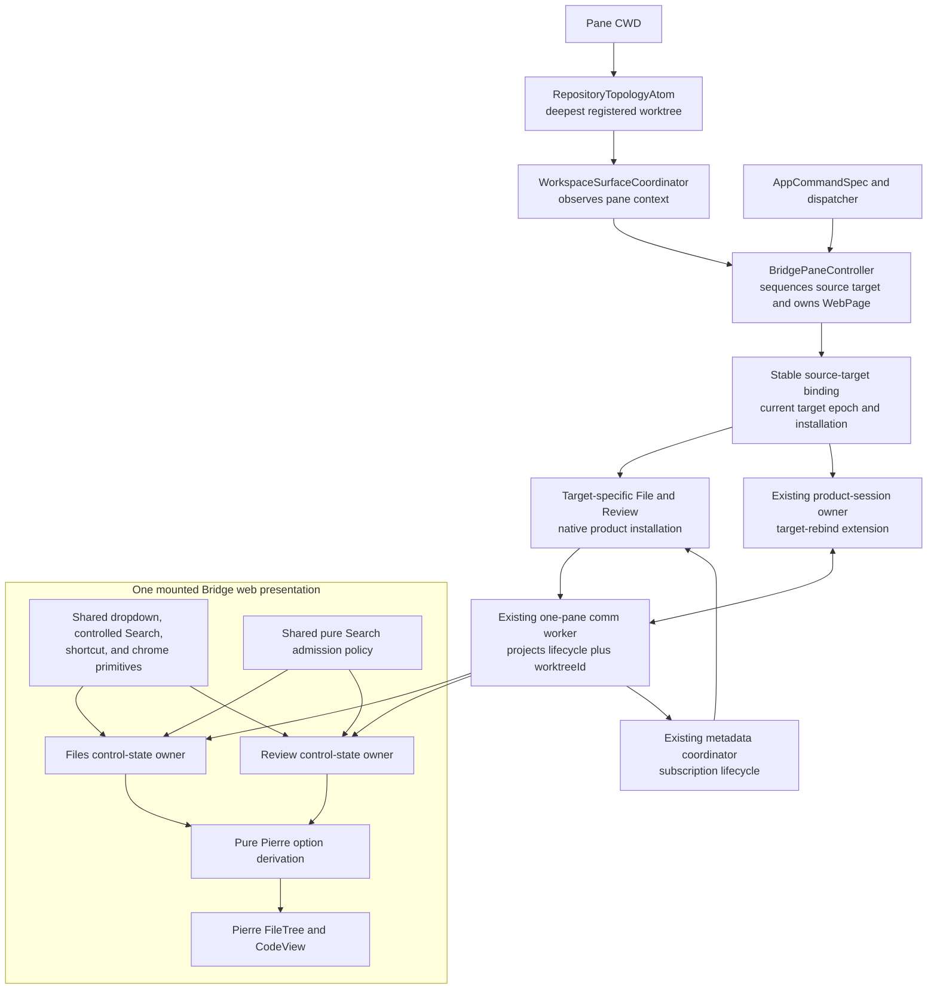
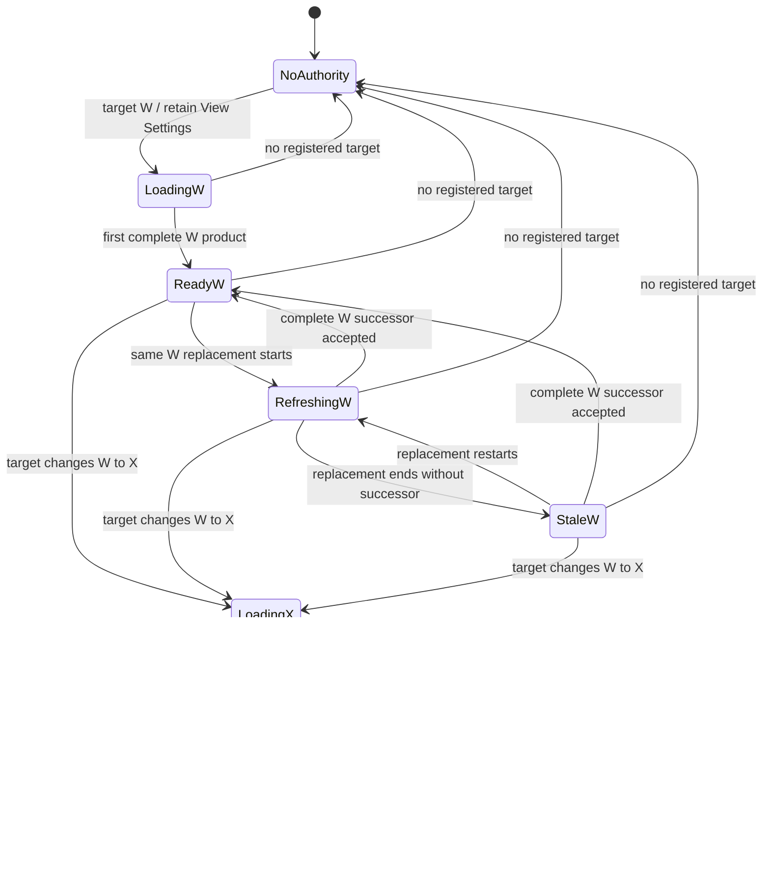
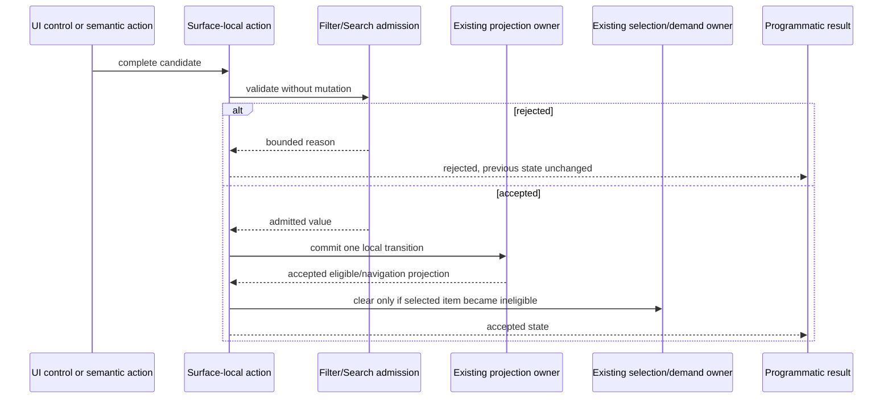

# Bridge Files and Review Controls — Program Design

Date: 2026-07-31
Target classification: general-domain
Governing requirements:
`2026-07-31-bridge-files-review-view-settings-requirements.md`
Governing requirements SHA-256:
`fd16f89e4e3772d53cb5ec9706d60bd8ac3e9c8a33b6e1a7c46852e68d671682`

Status: candidate Program Design. It defines structural How for the governing
requirements. It does not authorize implementation, choose task order, or claim
pair acceptance.

## Design boundary

This design changes the Files and Review presentation controls, their
browser-local state transitions, the existing programmatic Filter contract, the
projection of already-authoritative source identity, and the deliberate Web
View Reload entry point.

The following owners remain authoritative:

- `RepositoryTopologyAtom` resolves the deepest registered worktree containing
  a pane CWD.
- Swift and `agentstudio-git` own packaged filesystem and Git facts.
- `BridgePaneController` owns one pane's `WebPage`, product-session integration,
  and pane-local native sequencing.
- One stable Bridge-internal source-target binding supplies the controller's
  current target-specific File/Review installation to construction-bound native
  consumers. It owns ordering state, not source authority or product meaning.
- One Bridge comm worker per pane owns heavy preparation and product-derived
  projections.
- Files and Review own separate browser-local presentation values.
- Pierre/Shiki remain the production renderers.
- `AppCommand` and `AppCommandSpec` remain the singular command identity and
  command-presentation vocabulary.

This design does not add a controller replacement path, a Reload lifecycle, a
shared Files/Review mutable store, a new source identity, durable preferences, a
native context-menu action set, or TypeScript Git/filesystem authority.

## Integrated design

The implementation extends existing owners rather than adding a parallel
control or source system.



The existing scheme provider, product-session provider, and page remain stable
and consume binding-backed File/Review façades. Controller Review operations
obtain the current target-specific pipeline/cache/construction members through
the same binding. The binding swaps one target-specific installation; it does
not mutate construction-bound authority in place. Browser-local owners share
pure interaction mechanics and visual primitives, not mutable values. A source
target update is projected before its first Loading state so both surfaces can
apply the required reset or retention rule even while one surface is inactive.

## Current-system model

The design is compatibility-bound rather than greenfield.

### Current owners and constraints

| Concern | Current observation | Constraint on the target |
| --- | --- | --- |
| Web presentation | `BridgePaneController` constructs one non-persistent `WebPage`; `BridgePaneContentView` renders it. | Reload must use that page and must not replace the controller or host. |
| Page Reload | The existing bootstrap distinguishes `.pageReload` and replaces the product session behind the same page/controller. | The command invokes ordinary WebKit page Reload and reuses this bootstrap behavior; no new Reload state machine. |
| Native source | Controller/runtime metadata, File authority, Review provider/pipeline/cache/binder, scheme provider, and the product-session provider are currently construction-bound. Session rotation reuses the same provider. | Do not pretend these values retarget themselves. Insert one stable binding consumed at construction and swap a complete target-specific installation behind it. |
| Worktree resolution | `RepositoryTopologyAtom.repoAndWorktree(containing:)` uses a longest-path-first registered-worktree index. | Reuse it; do not add a second resolver or nearest-repository fallback. |
| Opening and restoration | Bridge opening can prefer stale pane identity or invent a sole-worktree fallback; restored metadata repair performs a manual path scan and recreates the mounted surface. | Hard-cut every implicit source resolution to the topology atom's CWD-first result. Restoration applies the result to the existing controller/binding and never recreates the page. |
| Files state | `bridge-file-viewer-store.ts` owns one small root snapshot for Search and one file-class filter; selection and transient menu state are component-local. | Extend this Files-local owner; do not move it into Review or a global store. |
| Review state | `bridge-app-review-viewer-mode.tsx` owns Search and filter values in local React state. | Consolidate atomic Review control transitions locally; do not create a cross-surface store. |
| Shared controls | Shared filter, Search, button, and shadcn dropdown primitives already exist. | Extend this shared primitive layer for matching controls and focus behavior. |
| Filter ingress | `bridge.fileTree.setFilter` currently models Git status plus the full exclusive file-class enum, allowing Binary/Large to masquerade as categories. | Hard-cut the public action to the same category/status/visibility model as the UI. |
| Search | Files uses the worker query schema; Review compiles the same path pattern on the main thread; visible and programmatic mutation paths can admit values before the worker bound. | One pure admission policy must run before every mutation; the worker schema retains a matching defensive bound. |
| Source projection | Native File and Review identities already carry `worktreeId`, but the Files display source and Review source display slice drop it. | Project the existing identity; do not invent another source ID. |
| View rendering | Both surfaces derive CodeView configuration from `bridgeCodeViewOptions`; Review and Files pass options into mounted CodeView components. | Derive immutable per-render options from surface-local settings and let the mounted CodeView apply them. |
| Context menu | `BridgePaneContentView` currently applies no context-menu replacement to the SwiftUI `WebView`. | Use the supported `webViewContextMenu` replacement builder with empty content. |
| Commands | App commands route through typed specs and pane-aware dispatch. | Add one no-shortcut command row and resolve the active mounted Bridge controller through the existing pane command owner. |

### Representative current call paths

```text
Files visible query
  BridgeFileViewerApp
    -> Files store action
    -> dispatchFileViewQueryFact
    -> comm-worker File query projection
    -> main File display snapshot
    -> Files tree / selected CodeView

Review visible filter
  BridgeReviewViewerMode local state
    -> updateReviewDisplayProjection
    -> Review presentation snapshot
    -> Review tree and continuous CodeView

Programmatic Filter
  native semantic control event
    -> bridgeAppControlCommandSchema
    -> active surface control listener
    -> current local filter setters
    -> probe result

Existing page Reload
  WebKit page navigation
    -> document bootstrap request reason pageReload
    -> BridgePaneController product-session candidate/retirement/activation
    -> new browser runtime bootstrap on the same WebPage

Current Bridge construction and restoration
  createBridgePaneView
    -> source provider / Git context derived once from state and pane metadata
    -> BridgePaneController initializer
    -> immutable File authority, Review provider/pipeline/cache/binder,
       scheme provider, and product-session provider
  restored metadata repair
    -> manual registered-worktree scan
    -> recreateSurface when identity is missing
```

Current source and tests establish these static paths. The target adds the
missing source-retarget entry path and preserves the other call chains.

## Structural crux and alternatives

The crux is how to make controls and source transitions consistent without
creating a second application architecture inside Bridge.

### Selected direction — extend existing owners

- Resolve source target changes in the existing App composition owner.
- Sequence target application and teardown in the existing
  `BridgePaneController`.
- Construct one stable source-target binding and swap one complete
  target-specific File/Review installation behind the construction-bound native
  consumers.
- Project the accepted target's existing `worktreeId` before Loading; keep the
  binding's target epoch private to native admission.
- Use the topology atom's CWD-first result for initial opening, restoration, and
  later CWD changes; apply restoration in place.
- Keep Files and Review control values in separate browser-local owners.
- Share only pure policy and interaction/render primitives.
- Route Reload to the existing `WebPage` and existing page-reload bootstrap.

Gain: one authority path, continuity across same-page source changes, and no
parallel control state. Cost: one Bridge-internal indirection plus an internal
epoch fence at every target-sensitive native publication boundary. The
Bridge runtime bears that cost because it already owns product source admission.
Construction-bound producers remain honest: target-specific instances are
retired and replaced as a bundle rather than mutated piecemeal.

The product session may still rotate behind the same `WebPage` through its
existing owner, including ordinary page Reload. Rotation continues to consume
the same stable binding and therefore cannot recover an obsolete target. The
page, controller, browser presentation, and surface-local View Settings remain.
A controller/host replacement is not an allowed fallback.

### Rejected — shared mutable Files/Review control store

This would make switching easy but would couple products whose filter
vocabularies, Search semantics, selection behavior, and lifetimes differ. It
also creates synchronization and reset ambiguity. Shared pure helpers provide
the required consistency without shared mutable truth.

### Rejected — recreate the Bridge controller on CWD change

Recreation reuses existing mounting code but destroys browser-local View
Settings and conflates a source transition with page/session replacement. That
violates UR-11 and makes same-worktree retention impossible.

### Rejected — native host replacement or custom Reload coordinator

WebKit already owns page Reload and the controller already owns page bootstrap.
A replacement controller, candidate host, Reloading state, retry policy, or
single-flight owner adds lifecycle without serving an observable requirement.

### Rejected — move source/filter computation into Vite or TypeScript Git

That makes development fixtures an authority unavailable in the packaged app
and violates the native production boundary.

## Target components and ownership

Component names below describe semantic owners. They do not require one new
file or type per row.

| Component / existing owner | Owns after this change | Consumers | Reason to change |
| --- | --- | --- | --- |
| `RepositoryTopologyAtom` | Registered-worktree lookup and canonical deepest-containing result | Workspace coordinator | Registry or lookup rules change |
| `WorkspaceSurfaceCoordinator` | Resolving initial, restored, and changed pane CWD through `RepositoryTopologyAtom`; applying the optional canonical target to the mounted controller | Pane graph and mounted controller | App composition or pane-context routing changes |
| `BridgePaneController` | Ordering source-target application and teardown; existing `WebPage`; direct deliberate page Reload effect | Source-target binding, App command route | Pane-local native sequencing or WebKit behavior changes |
| `BridgeRuntime` metadata | Post-commit diagnostic projection of the binding's current target snapshot | Pane metadata readers; never target-sensitive product decisions | Current native pane context projection changes |
| Stable Bridge source-target binding | Current optional target snapshot and installation; monotonic internal target epoch; sealed-to-open admission; predecessor drains | Existing scheme/session provider façades and controller Review operations | Construction-bound native target composition changes |
| Target-specific File/Review installation | Canonical repo/worktree/CWD snapshot, Review comparison policy, File/Review providers, Git context, construction, cache/publication work, and leases for one epoch | Stable binding and existing product paths | Native source/product behavior for one target changes |
| `BridgePaneProductSessionOwner` target-rebind extension | Latest private target revision for the current/next session; ordered target edge, sealed/open signal, subscription retirement/replay, and File rediscovery | Stable binding, comm worker, metadata coordinator | The mounted pane changes canonical target |
| File/Review worker projections | Current target `worktreeId`, lifecycle, Review transactional generations, and Files accepted/candidate generations | Both surface-specific display stores | Product projection contract changes |
| Files control-state owner | Files category; entered and accepted Search criteria; mode/error; focus-return identity; View Settings; source reset | Files shell and semantic control listener | Files interaction semantics change |
| Review control-state owner | Review filters; entered and accepted Search criteria; mode/error; focus-return identity; View Settings; source reset | Review shell and semantic control listener | Review interaction semantics change |
| Shared BridgeViewer UI primitives | Dropdown rows/groups/toggles, gear trigger, controlled Search intent/focus mechanics, icon scale, tooltip/keycap presentation | Files and Review owners | Matching interaction language changes |
| Shared pure Search admission policy | Current maximum-length policy and mutation admission result | Both visible and programmatic Search paths; worker defensive schema | Search safety policy changes |
| Pure CodeView option derivation | Immutable Pierre options from one surface's settings plus compatibility defaults | Files and Review CodeView frames | Renderer option mapping changes |
| `AppCommandSpec` plus pane-aware dispatcher | Reload command identity, discoverability, active-Bridge eligibility, and target resolution | Command Bar and controller | Command contract changes |
| `BridgePaneContentView` | Empty native context-menu replacement on the existing WebView | Native Bridge view | Supported WebKit host behavior changes |

### Dependency direction

Allowed:

```text
App composition -> Bridge controller -> stable source-target binding
stable binding -> target-specific native installation
stable binding -> existing scheme/session and Review consumer interfaces
stable binding -> existing product session -> metadata coordinator / comm worker rebind
target-specific installation -> comm-worker contract -> surface display stores
surface state owners -> shared pure policy/UI primitives -> Pierre adapters
AppCommandSpec -> App dispatcher -> pane-aware resolver -> Bridge controller
```

Forbidden:

- Files reading or mutating Review control state, or the reverse;
- shared UI primitives reading the comm worker, native state, or global atoms;
- TypeScript resolving registered worktrees or reading production Git;
- opening/restoration consulting stored pane identity before current CWD or
  inventing a sole-worktree fallback;
- restoration replacing the mounted Bridge controller or `WebPage`;
- construction-bound providers being partially mutated across targets;
- the binding owning a second subscription registry beside the metadata
  coordinator and comm worker;
- target-sensitive product or Review decisions consulting `BridgeRuntime`
  metadata or initial `BridgePaneState.source` after binding installation;
- programmatic controls writing a legacy filter/search state beside visible
  control state;
- View Settings mutating source, demand policy, selection, or product session;
- Reload calling native source refresh or replacing the controller/host; and
- the native context menu adding Bridge actions in this scope.

Static type boundaries, strict schemas, source-structure tests, and behavior
tests enforce these edges.

## Behavioral interfaces

### Apply authoritative Bridge source target

Owner: `BridgePaneController`
Caller: `WorkspaceSurfaceCoordinator`

Input is either no authoritative target or a complete immutable target snapshot:
the canonical registered repo/worktree/CWD returned by
`RepositoryTopologyAtom`, the fixed pane `BridgePanelKind`, and the
`WorkspaceBaseline` produced by the existing opening policy for that panel kind
evaluated against the target repo. A target change recomputes that snapshot;
Review requests capture it with the binding epoch and never reuse the retired
target's resolved baseline.

Guarantees:

1. Calls are sequenced with existing pane-local transition work; an older call
   cannot commit after a newer target.
2. The controller asks the stable binding to prepare a complete sealed
   File/Review installation for the canonical target or no-authority tombstone,
   advance its target epoch, and revoke the predecessor.
3. The existing product session performs one whole-target rebind: retire old
   File/Review subscriptions, clear cached File-source discovery, and project
   the target edge to both surface owners before reopening work.
4. After that edge is accepted, the binding opens successor admission and the
   metadata coordinator replays active subscriptions against the new
   installation. The binding owns no subscription registry.
5. Runtime metadata is a post-commit diagnostic projection. Target-sensitive
   product and Review operations capture the binding snapshot rather than
   reading runtime metadata or initial pane state.
6. A new target's `worktreeId` becomes visible in both surface lifecycle
   projections before that target's Loading state.
7. Same-worktree rebuilds retain browser-local controls; different-worktree or
   no-authority transitions publish the target edge needed for the mandated
   resets.
8. Old publications may remain only under the same-worktree Refreshing/Stale
   contract. They are retired immediately for a different or absent target.
9. Cancellation and supersession release old construction/publication leases
   through existing terminal paths.
10. The `WebPage`, product-session provider, scheme handler/provider, and browser
   presentation remain mounted.

The interface is idempotent for the same canonical target facts. It introduces
no durable source ID. The target epoch is private pane-local admission state and
is combined with registered `worktreeId` plus existing product
generation/identity fencing. It is not projected into public semantic controls,
browser presentation state, persistence, telemetry, or user-visible read-back.

### Stable source-target binding

The binding is constructed once with the controller. Construction-bound native
consumers receive stable protocol façades from it instead of a target-specific
provider directly. One private installation contains every value whose meaning
depends on the canonical target: canonical repo/worktree/CWD; the pane's Review
comparison policy resolved for that repo; File authority/source and
construction access; Review provider, Git context, pipeline, cache,
publication work, and leases. Initial `BridgePaneState.source` is bootstrap
input only and is not current authority after the first installation.

Applying a target uses one inert aggregate and one binding transaction:

1. compare canonical target facts with the current installation;
2. construct the complete target-specific aggregate with non-suspending,
   non-fallible initializers; missing capabilities select the existing
   unavailable implementations rather than creating partial state;
3. advance the target epoch, revoke predecessor admission, and hold the
   successor aggregate or tombstone sealed from façade calls;
4. run the existing product session's whole-target rebind through the comm
   worker and metadata coordinator, including target-edge delivery to both
   surfaces and retirement of old subscriptions;
5. after target-edge acknowledgement, atomically install and open successor
   admission, then replay current File/Review interests so Loading and
   construction use only the new epoch; and
6. asynchronously drain the revoked predecessor through its existing close and
   lease-release handles.

Stable façades capture the current installation and epoch at request start.
Every emission, publication commit, cache fulfillment, and File
`sourceAccepted` frame revalidates that admission before crossing into the
stable product/session path. Revoked or superseded work may clean itself up but
cannot mutate visible state. Same-worktree product refresh does not advance the
target epoch; Files accepted/candidate projection and Review transactional
publication ordering handle that case.

The whole-target rebind is a new narrow interface on the existing
`BridgePaneProductSessionOwner`, not another coordinator or source authority.
`applyTargetRevision(snapshot, epoch, phase)` records only the newest private
revision and routes it to the current session; if no session is active, the next
session receives that revision before product start. `sealed` makes the comm
worker retire File/Review subscriptions, clear one-shot File discovery, apply
the target edge to both projections, and preserve only target-independent
Review interest. Acknowledgement means the active session installed that
revision, or the owner recorded it for the next session. Supersession replaces
the pending revision and stale acknowledgements are ignored.

During `sealed`, provider calls fail target admission immediately as cancelled;
they never wait while holding session or subscription work. `opened` triggers
worker resync for the latest revision: File source is rediscovered and current
File/Review interests reopen through `BridgePaneProductMetadataCoordinator`,
which remains the sole native subscription-lifecycle owner. A Reload-created
session joins the same rule: before `opened` it receives the sealed revision and
does no target work; after `opened` the owner resyncs whichever session is
current. Session rotation therefore cannot miss the edge or require a Reload
lifecycle, target wait, or second subscription registry.

The binding retains every predecessor close receipt until it finishes. Binding
close revokes the current epoch, starts its close receipt, and joins all current
and predecessor receipts before controller teardown completes. Rapid W→X→Y
cannot orphan cache loads, publication leases, construction work, or artifact
pins even though the drains run concurrently during normal operation.

The controller serializes binding application and teardown initiation through
one pane-local ordering boundary. Long-running product work remains asynchronous
under the captured target epoch. Deliberate Reload is not part of this boundary:
it immediately invokes ordinary Reload on the existing `WebPage`. The rotated
browser product session uses the same binding-backed provider, and each later
call captures whichever target epoch is current. Teardown closes the binding,
revokes its current epoch, then joins its retained existing drain receipts. No
Reload lifecycle or source-transaction barrier is added.

### Source lifecycle projection

Files and Review display lifecycle payloads expose:

```text
targetWorktreeId: registered worktree identity or null
generation / existing product identity
status: loading | ready | refreshing/stale | unavailable | failed
bounded reason when required
```

`targetWorktreeId` is copied from existing native product/source authority. It
is not inferred from path text in React. A target edge is emitted to both
surfaces even when one is inactive and when no complete product exists, because
reset-before-Loading depends on it. Native target-epoch admission and existing
ordered worker streams prevent a retired edge from being applied later.

For Files, the worker projection owns separate accepted and candidate
generation slots. On a same-worktree `sourceAccepted`, it labels the accepted
slot Refreshing and stages candidate tree/descriptors/status off-display.
Progressive candidate windows cannot clear or partially replace the accepted
tree. A final window with every fact required by the available Filters
atomically replaces the accepted slot. Failure, cancellation, or supersession
discards only the candidate and leaves the predecessor Stale or Refreshing as
required. A different/null target edge clears both slots before Loading. Review
continues using its existing transactional publication commit.

### Surface-local source transition

Each surface state owner tracks its last accepted target worktree. Existing
ordered stream admission prevents obsolete target edges; worktree identity
chooses reset versus retention.

- same non-null `worktreeId`: retain Filter, Search, and View Settings; reconcile
  selection only through the surface's authoritative logical item identity;
- different non-null `worktreeId`: reset Filter and Search once before showing
  Loading; close transient menus; clear selection, selected content, and
  selection demand; retain View Settings;
- transition to null: reset Filter and Search once, close transient Filters and
  Search controls, clear selection, selected content, and selection demand;
  retain View Settings;
- null to any worktree: start from reset Filter/Search and retained View
  Settings.

Edits made after the different-worktree target edge survive that target's first
complete product. Acceptance of a product never repeats the reset.
Never-activated surfaces receive the same target edge, begin from their defaults,
and cannot reveal selection or controls retained from an earlier target when
first activated.

### Filter candidate transaction

The existing semantic action hard-cuts to one surface-discriminated candidate:

```text
Files candidate
  category: All or one Files-supported exclusive category

Review candidate
  gitStatus: All | Added | Modified | Renamed | Deleted | Copied
  category: All or one supported exclusive category
  showBinary: Bool
  showLarge: Bool
```

The active target surface validates the entire candidate before mutation.
Success commits one surface-local state transition and then reconciles
selection against the resulting accepted projection. Failure changes no
filter, selection, content, projection, focus, or menu state and returns a
bounded reason. Visible controls dispatch through the same surface action as
programmatic control.

Files rejects Review candidates and any Binary/Large/category or Git value it
cannot represent. Review never stores Binary or Large in its category slot.
There is no decoding path for the legacy combined model after cutover.

### Search admission and lifecycle

The existing path matcher remains the evaluator. A shared pure admission
policy first accepts or rejects a proposed string according to the current
4,096 UTF-16-code-unit compatibility bound. The bound is internal policy, not
user-facing product copy.

All visible and programmatic Search mutations call admission before writing
field state. The comm-worker schema retains the same maximum as a defensive
boundary; it is not the first mutation guard.

Each surface state owner owns Search open/closed state, the entered candidate,
last accepted query/mode, current mode/error, the most recent semantic
focus-return identity, and the atomic close/reset transaction. Invalid regex
changes only entered/error state; accepted criteria continue driving the
projection. The shared Search primitive is controlled and stateless with
respect to product state; it owns only reusable interaction mechanics:

- open/focus/select existing text;
- Clear text while non-empty, or close while empty;
- close through trigger, `⌘⇧F`, or foreground-owned Escape;
- clear query/error on close;
- request focus return through ordered candidates resolved by the surface owner;
  and
- preserve open state across blur, selection, and scroll.

Ordinary close clears entered and accepted query/error, preserves the current
text/regex mode, closes the control, updates projection, and requests focus
restoration. A different/null target reset also restores text mode. The surface
owner resolves its recorded item identity against the current eligible tree and
active surface; if invalid it supplies the Search trigger and then surface root.
The shared primitive reports intent and focuses the first supplied valid target;
it retains no focus history and cannot mutate a second Search state. Files and
Review retain separate validation and projection semantics.

### View Settings and Pierre options

Files state:

```text
lineNumbers
wordWrap
```

Review state:

```text
lineNumbers
wordWrap
changeBackgrounds
diffLayout: split | unified
changeIndicators: bars | classic | none
```

Initial and Reset values are derived from the current compatibility options,
not a new preference store. The derivation produces a new immutable
`CodeViewOptions` value from `bridgeCodeViewOptions` plus the surface-local
settings:

- line numbers map to Pierre `disableLineNumbers`;
- word wrap maps to `overflow: 'wrap' | 'scroll'`;
- change backgrounds map to `disableBackground`;
- layout maps to `diffStyle: 'split' | 'unified'`; and
- indicators map to `diffIndicators: 'bars' | 'classic' | 'none'`.

The mounted CodeView receives the derived options. The option change may cause
Pierre's ordinary relayout, but does not replace the CodeView owner, resync the
source, mutate demand, or change selection.

### Reload Bridge Web View command

The command system adds one no-shortcut `AppCommandSpec` visible only when the
resolved active pane is Bridge. The pane-aware command route resolves the
mounted `BridgePaneController` and invokes WebKit Reload on its existing
`WebPage`.

```text
⌘P -> Reload Bridge Web View
   -> AppCommand dispatcher
   -> PaneTabViewController active-pane resolution
   -> mounted BridgePaneController
   -> existing WebPage Reload
   -> existing pageReload bootstrap path
```

The command reports whether dispatch was accepted. WebKit navigation and the
existing bootstrap own subsequent success/failure behavior. No Reloading state,
retry UI, duplicate-attempt policy, native source refresh, or controller/host
replacement is added.

### Native context-menu suppression

`BridgePaneContentView` applies the supported SwiftUI WebKit context-menu
replacement builder to the existing `WebView` and returns empty content. This
removes the default Reload and every other native page action for Bridge. It
does not install custom actions or affect typed key routing such as Management
Layer `⌘R`.

## State and lifecycle

### Binding state

| State | Owned value | Legal transition | Guard and consequence |
| --- | --- | --- | --- |
| `noAuthority(epoch)` | No target installation | canonical target arrives | Construct successor, advance epoch into sealed transition, rebind target edge, then open admission |
| `sealed(target, epoch)` | Revoked predecessor, complete successor, no successor façade admission | target edge acknowledged | Install/open successor and replay subscriptions; cancellation may drain but cannot restore predecessor |
| `installed(worktreeId, epoch)` | One complete target-specific installation and live admissions | same canonical worktree | Keep epoch; Files candidate and Review publication generations own replacement |
| `installed(worktreeId, epoch)` | One complete target-specific installation and live admissions | different worktree or no target | Construct successor, enter sealed transition, rebind, open, and retain predecessor drain receipt |
| any live state | Current epoch and installation | teardown | Close permanently, revoke admission, retire installation, reject later target applications |

Only the binding writes this state. The product-session owner may rotate
sessions without transitioning binding state.

### Source and control state



The source lifecycle is product state owned by the current target installation
under binding admission. The Filter/Search/selection reset is a surface-local
reaction to the authoritative target edge and occurs for inactive surfaces as
well. View Settings are neither source state nor persisted state.

### Search state

```text
Closed(empty, retained mode, no error)
  -> Open(entered candidate = accepted query, retained mode)
  -> Open(invalid entered regex, accepted criteria still projected)
  -> Closed(empty, retained mode, no error)

Different/null target or page Reload
  -> Closed(empty, text mode, no error)
```

Oversized input does not transition. A valid edit atomically replaces accepted
query/mode and clears error; switching invalid regex to text is one such edit.
Same-worktree replacement re-evaluates accepted criteria against the new
accepted generation;
a different/null target has already closed and reset Search at its target edge.

### Filter projection and selection

Filter state commits first within the local control transaction. The existing
surface projection owner computes eligible items. When the accepted projection
no longer contains the selected item, the surface owner clears selection and
selected-content demand and requests focus for the eligible tree or surface
root. It never auto-selects a replacement.

Files Search uses the same reconciliation. Review Search is navigation-only and
does not participate in Review content selection or demand.

## End-to-end flows

### CWD to authoritative source

```mermaid
sequenceDiagram
    participant Pane as Pane graph / CWD
    participant Topology as RepositoryTopologyAtom
    participant Coord as WorkspaceSurfaceCoordinator
    participant Controller as BridgePaneController
    participant Binding as Stable source-target binding
    participant Session as Product-session owner
    participant Native as Target-specific installation
    participant Worker as Comm worker projection
    participant Surface as Files and Review owners

    Pane->>Coord: pane context changed
    Coord->>Topology: deepest registered worktree containing CWD
    Topology-->>Coord: registered target or none
    Coord->>Controller: apply authoritative source target
    Controller->>Binding: sequence canonical target transaction
    Binding->>Native: construct inert complete aggregate
    Binding->>Binding: advance epoch, revoke W, seal successor
    Binding->>Session: apply sealed target revision
    Session->>Worker: whole-target rebind / target edge
    Worker->>Surface: target edge to both surfaces
    Surface->>Surface: retain or atomically reset controls/selection once
    Worker-->>Session: edge accepted; old subscriptions retired
    Session-->>Binding: current-or-next session acknowledgement
    Binding->>Binding: install and open successor admission
    Binding->>Session: apply opened target revision
    Session->>Worker: resync current session
    Worker->>Native: rediscover/replay File and Review subscriptions
    Native-->>Worker: Loading and product work under current epoch
    Binding->>Native: asynchronously drain revoked predecessor
    Native-->>Worker: epoch-fenced product or bounded failure
    Worker-->>Surface: generation/lifecycle and display projection
```

Late frames from the retired target, including File `sourceAccepted`, fail the
binding epoch admission before existing source/generation checks and cannot
restore rows, selection, content, demand, or constraints from that target.

Initial opening and topology replay use the same path. An explicit worktree
opening first establishes pane CWD at that registered root, then canonical
resolution derives the target. Restoration applies the replayed topology result
to the already mounted controller; it does not invoke surface recreation.

### Visible or programmatic control mutation



Visible controls do not need a separate probe consumer, but use the same local
action and therefore the same validation and state transition.

### View Setting mutation

```text
gear dropdown
  -> surface-local View Settings action
  -> immutable CodeViewOptions derivation
  -> mounted Pierre CodeView option update / ordinary relayout
  -> selection and product identities unchanged
```

### Explicit Reload

```text
command row
  -> typed pane-aware dispatch
  -> existing Bridge controller and WebPage
  -> WebKit page Reload
  -> old browser-local state disappears with the page
  -> existing pageReload bootstrap installs the page's product session
     using the same stable source-target binding
  -> ordinary initial Files/Review state and selection behavior
```

Native registered-worktree authority is not refreshed or re-resolved merely
because this command ran. Reload does not wait for target application or drain.
The replacement product session consumes the same stable provider, and each
provider call captures the binding's current target epoch; a concurrent target
swap revokes calls captured from its predecessor.

## Failure, recovery, and concurrency

| Failure or interleaving | Owner and behavior | Invariant / proof seam |
| --- | --- | --- |
| Unsupported Filter candidate | Surface-local admission rejects before any setter/reducer commit and returns a bounded reason. | Filter, projection, selection, content, focus, and menu state are byte-for-byte/identity unchanged. |
| Oversized Search candidate | Shared admission rejects before field mutation; worker bound remains defensive. | Previous query, error, projection, and focus remain. |
| Invalid regex | Surface owner retains entered/error separately from accepted query/mode; accepted criteria remain projected against the current generation. | Invalid is not no-match; a valid edit atomically replaces accepted criteria. |
| W replacement overlaps another W replacement | Files stages candidates off-display and accepts only the newest complete candidate; Review retains transactional publication ordering. | No mixed generations, partial Files replacement, or repeated control reset. |
| W target is superseded by X | Binding constructs inert X, advances epoch/revokes W, seals X, completes whole-target rebind and X edge, then installs/opens X and drains W. | X Loading follows its edge; late W `sourceAccepted`, cache fulfillment, and publication commits are rejected. |
| Target becomes unavailable | Binding advances to a no-authority tombstone, retires source-dependent work, and publishes the null target edge. | Both surfaces reset Filter/Search and clear selection/content/demand once; no prior-worktree content can reappear. |
| User edits while X is Loading | Reset already occurred at target edge; local edits are newer surface state. | Product acceptance does not overwrite those edits. |
| Inactive surface receives W→X | Worker projects the target edge to both surface owners, not only the selected mode. | First activation cannot reveal W controls, selection, content, or demand. |
| Selected content fails | Existing content availability lane reports bounded failure without replacing navigation/source state. | Navigation remains usable. |
| View Setting changes during render work | Options are a render input; source/generation and fulfillment identities remain unchanged. | No metadata resync or selection mutation. |
| Reload overlaps target change | Reload proceeds immediately. The replacement product session consumes the same stable binding, and each provider call captures current target epoch. | Reload cannot reinstall an obsolete provider or alter source authority; calls from a revoked epoch cannot commit. |
| Page Reload navigation/bootstrap fails | Existing WebKit/bootstrap/product-session failure behavior applies while the binding remains at its current target. | No custom lifecycle or controller replacement appears. Another deliberate Reload remains ordinary WebKit behavior. |
| Pane closes during source work | Controller closes the binding, revokes current admission, starts the current close receipt, and joins every retained predecessor receipt. | No late commit, surviving installation, cache load, lease, construction task, or artifact pin after teardown. |
| Restoration after topology replay | Coordinator resolves current CWD through the topology atom and applies the target to the mounted controller. | No manual resolver, stale facet preference, sole-worktree fallback, controller recreation, or page replacement. |

Target application and teardown are serialized at the existing pane-local
controller boundary. Reload remains outside that boundary. The binding actor
owns only complete-installation/epoch atomicity and target-scoped admission. Browser
control events remain main-thread/local-owner transitions. Worker projection
and render work retain current generation, epoch, cancellation, and
bounded-apply rules. No new lock, retry loop, recovery coordinator, queue, or
persistence boundary is introduced.

## Hard cutover and compatibility

This is a one-pass cutover:

- the old public Filter payload is replaced rather than accepted beside the new
  category/status/visibility model;
- all Swift DTOs, BridgeWeb schemas, listeners, probes, fixtures, and public
  read-back move together;
- the old ability to store Binary/Large in `fileClassFilter` is removed;
- Bridge initial opening, restoration, and CWD changes use only the topology
  atom's canonical CWD containment result; stale identity-first, manual path
  scans, and sole-worktree fallbacks are removed;
- construction-bound File/Review dependencies are supplied through the stable
  binding in one pass; there is no legacy fixed-source path beside it;
- the mounted product session uses one internal whole-target rebind; cached File
  discovery and File/Review subscriptions cannot stay fixed to the original
  target;
- target-sensitive Review endpoints and product calls capture the binding
  snapshot; initial pane state and runtime metadata are not competing current
  target authorities;
- Files uses one accepted/candidate generation boundary rather than clearing
  accepted display on same-worktree `sourceAccepted`;
- Files and Review visible controls dispatch the same surface-local actions as
  semantic controls; and
- current renderer defaults remain the source of initial/Reset View Settings.

There is no migration or persisted-data phase because these values are
browser-session-local and the WebKit data store is non-persistent. Version skew
between native and bundled BridgeWeb is not supported inside one app artifact;
strict schema rejection exposes an incomplete cutover during development.

## Cross-cutting realization

### Accessibility

- Shared icon triggers supply accessible names independent of tooltip text.
- Dropdown radio/checkbox semantics expose selected groups and visibility
  toggles through the owned shadcn primitives.
- The controlled Search primitive owns deterministic focus restoration and
  foreground Escape precedence.
- Search rejection/validation uses one polite status lane and preserves the
  entered or previous value according to the requirement.
- Typed shortcut descriptors supply `⌘⌥F` and `⌘⇧F` labels/keycaps from the
  same local shortcut vocabulary used by the handler.

### Reliability

- Source target and accepted product generation are separate facts; React never
  guesses source continuity from a relative path.
- Construction-bound producers consume one stable binding, and the binding's
  target epoch rejects late target-scoped work before existing
  generation/publication checks.
- Complete candidate validation precedes multi-field Filter mutation.
- Existing product generation/epoch fencing contains stale native and worker
  results.
- Reload delegates to WebKit and existing bootstrap instead of creating a
  second recovery owner.

### Security and privacy

- Native registered-worktree containment remains the filesystem trust boundary.
- Strict schemas reject unsupported semantic control values.
- No control adds raw paths, queries, provider errors, or content to telemetry.
- The empty native context menu removes unowned WebKit actions rather than
  exposing a broader browser surface.

### Performance

- Filter/Search actions reuse existing projections and demand paths.
- View Settings change options on the mounted renderer through Pierre's existing
  in-place `setOptions` path and do not reconstruct source data.
- Review visibility may admit newly visible content through existing demand,
  but adds no new demand scheduler.
- Source changes reuse existing shared construction, generation fencing, and
  one-worker topology.

### Observability

No new user data is recorded. Existing lifecycle and command execution
read-back may expose safe state names, generation/worktree identities through
existing scrubbed identity projection, accepted/rejected outcome, and bounded
reason classes. Raw query/path/error text remains excluded.

### Platform compatibility

The context-menu requirement is platform-bound to the installed macOS 26
SwiftUI WebKit `webViewContextMenu` replacement API. An empty replacement must
be proven in the packaged WKWebView host; browser DOM tests cannot establish it.

## Proof architecture

The proof design follows the real owner boundary rather than treating a Vite
fixture as product proof.

| Requirement group | Structural seam | Cheapest authoritative evidence | Higher-layer evidence |
| --- | --- | --- | --- |
| UR-01–UR-03 | Shared control props, dropdown primitives, controlled Search primitive | Pure/component state and accessibility behavior | Browser geometry/screenshot plus packaged keyboard/focus interaction |
| UR-04–UR-08 | Surface filter candidate types, native classifier projection, shared local action | Pure filter algebra and atomic rejection; strict Swift/TS fixture parity | Packaged registered-worktree Filters including exclusive-class counterexamples and semantic action read-back |
| UR-09–UR-12 | Surface-local View Settings plus pure CodeView options derivation | Pure option mapping and mounted CodeView option-update observation | Browser visual proof and packaged selection/source continuity |
| UR-13–UR-18 | Shared admission plus surface-owned entered/accepted Search criteria and semantic focus-return identity | State-transition tests for every ingress, invalid→generation replacement, and focus-target invalidation | Packaged WKWebView shortcuts, Escape/menu precedence, focus restoration, invalid/oversized input |
| UR-19–UR-22 | Topology resolver, controller ordering, stable binding, whole-target rebind, native target epoch, Files accepted/candidate and Review transactional generations | Native binding/subscription transition tests and real worker projection interleavings | Packaged source projection/reset/reload overlap; native integration separately proves same controller/page identity |
| UR-23 | `BridgePaneContentView` empty context-menu replacement and existing shortcut routing | Swift host composition inspection | Packaged right-click absence plus Management Layer `⌘R` executes once |
| UR-24 | `AppCommandSpec` to pane-aware resolver to existing `WebPage` Reload | Command visibility/routing and controller invocation tests | Packaged `⌘P` execution/read-back; browser-local reset with native pane/source identity retained |
| UR-25 | Ownership and dependency boundaries | Diff/source-structure/static inspection | Packaged read-only interaction smoke |

### Real and replaceable boundaries

- Pure reducers, option derivation, matching, and admission may use in-process
  fixtures.
- Worker projection tests use real strict contracts and display stores; native
  Git may be replaced by deterministic product fixtures at that seam.
- Source authority proof requires the real native resolver/binding/product path
  over disposable registered worktrees; fixed-source fakes do not prove swap or
  epoch fencing.
- Existing packaged controls prove projected source and browser behavior. Native
  integration proof owns in-place A→B/null triggering plus stable
  controller/`WebPage` identity; no public CWD mutation or private-epoch
  read-back is added solely for proof.
- Context-menu, shortcut/focus, and Web View Reload proof require the packaged
  SwiftUI/WKWebView host.
- No test-only Vite Git route may satisfy packaged source-authority evidence.

### Structural enforcement classes

| Invariant | Enforcement |
| --- | --- |
| Files/Review mutable state remains separate | Type/component ownership plus source-structure tests |
| Public Filter and visible Filter share one model | Discriminated strict schema, shared local action, contract fixtures |
| Unsupported or oversized mutation is atomic | Pure reducer/admission tests plus programmatic read-back |
| Source reset precedes Loading on both surfaces | Worktree lifecycle schema plus transition/interleaving tests |
| Old source cannot publish into new target | Sealed binding admission, whole-target subscription rebind, File `sourceAccepted`, Review cache/publication, and existing generation/source guards plus integration tests |
| Same-worktree Files refresh never exposes a partial candidate | Worker accepted/candidate slots plus atomic complete-candidate commit and interleaving tests |
| View Settings do not reload/remount | Mounted renderer observation and source/session identity assertions |
| Reload uses existing page/controller and current binding target | Typed dispatch tests plus packaged controller/page/worktree identity under overlap; no public epoch read-back |
| Native context menu is empty | Packaged AppKit/WebKit interaction proof |
| No persistent preferences or TS production Git | Static ownership/scope inspection |

## Requirement realization inventory

| Requirements | Primary owner | Realization |
| --- | --- | --- |
| UR-01–UR-03 | Shared BridgeViewer primitives | Separate Filter/View/Search controls using one dropdown/chrome/focus language |
| UR-04–UR-08 | Native product facts plus surface-local filter actions | Exclusive categories, Review gates, atomic visible/programmatic candidate model |
| UR-09–UR-12 | Files and Review control-state owners | Separate session-local settings and immutable Pierre option derivation |
| UR-13–UR-18 | Shared Search admission plus surface-owned Search/focus state and projections | Open/close/focus, accepted-query retention under invalid input, path matching, oversized handling, typed shortcuts |
| UR-19–UR-20 | Topology atom, workspace coordinator, controller ordering, stable binding, whole-target product-session rebind | CWD-only deepest registered target; in-place target-edge reset/retention without page replacement or stale subscriptions |
| UR-21–UR-22 | Binding admission, Files accepted/candidate projection, and existing Review/content owners | Private target epoch plus separate source, projection, validation, and content lanes with complete-generation truth |
| UR-23 | Bridge pane SwiftUI host | Empty default context menu while typed app commands retain routing |
| UR-24 | App command pipeline and existing controller/page | Deliberate command-surface WebKit Reload with browser-local reset only |
| UR-25 | Existing native/BridgeWeb authority boundaries | Read-only behavior and explicit excluded edges |

## Immutable source inventory

All current-system sources below were inspected at Git HEAD
`d935f50b872722cdc8f2ddfa0861f684b1aeecb5`. They are observational or
compatibility evidence; the governing requirements remain normative.

| Source | SHA-256 | Authority and applicability |
| --- | --- | --- |
| `docs/architecture/bridge_viewer_architecture.md` | `7c4127009a64b5a11990ca6b7a1e60ac9f60947ae867f9c9d86eee06d94ff4d1` | Current end-to-end Bridge ownership and product boundary |
| `docs/architecture/bridge_native_runtime_architecture.md` | `52a1196988455bafe4f54421fa4989fb506ad392a726899cd3218b03129eb144` | Current native authority, lifecycle, transport, and failure boundary |
| `docs/architecture/bridge_web_runtime_architecture.md` | `668ab0869643e875e719da8e896cc8a522cd03ca6c5cee0bf73380661e0525d2` | Current one-worker, state, demand, and render boundary |
| `docs/architecture/commands_and_shortcuts.md` | `a4aa431f9059f86a368da1d720c53f81e97b6b0549b341fc33fadc7bda865f84` | Current command identity, presentation, and pane-routing contract |
| `BridgeWeb/AGENTS.md` | `4d2850211e33f2bea083cdacff79dd53e4fdb8137e519d663f12b5b9352c1914` | Current BridgeWeb UI/render/Git constraints |
| `RepositoryTopologyAtom.swift` | `de394fcaa7cf81d980fa20e99b360e98b86edaa0fd855ba17a1e0312a5e79f9d` | Current deepest registered-worktree lookup |
| `WorkspaceSurfaceCoordinator+ViewHelpers.swift` | `b50921189c7122709324594b2f6b5371a541b137fa366fc19b4667f5c2bf758a` | Current identity-first pane worktree helper that must not own Bridge target resolution |
| `WorkspaceSurfaceCoordinator+BridgeViewLifecycle.swift` | `3cb5fd5b446e0aca638d97023fdd08096dd4f92aee4c4eacaabc3b486784a79e` | Current controller construction and initial fixed-source injection path |
| `WorkspaceSurfaceCoordinator+BridgeReviewSourceProvider.swift` | `f826fecf3bcc102963b7652b10d0a89b241cf975c92b1eaaec849585079cef07` | Current construction-bound Review provider and Git context resolution |
| `WorkspaceSurfaceCoordinator+BridgeReviewOpening.swift` | `20fe4f5797b65198011761acc5833e1dc29ad0afbffd2c12bd7ac1d2c06f7624` | Current opening resolver, including identity preference and sole-worktree fallback |
| `WorkspaceSurfaceCoordinator+BridgeMetadataRepair.swift` | `0680a72a53e7d7a4c424d143d77ba46f87e4214502ae649a0c4eef7b3f2e8812` | Current App-owned Bridge metadata repair and mounted-controller composition evidence |
| `WorkspaceSurfaceCoordinator+FilesystemSource.swift` | `5f9cf66a485bdc33bb46a191d3be354f06f5970090d96111057a1ade88f53cdd` | Current pane CWD/worktree projection and Bridge invalidation evidence |
| `BridgeRuntime.swift` | `6883aa03d85ed023983802c9b580eddfa440aa60ab73dc9af111bb0f2ed2b24f` | Current pane metadata and runtime lifecycle owner |
| `BridgePaneController.swift` | `8c2a8ad7ee1ae545312df93966db3ef003fedfdcb20e09569d9f574c7d04a98c` | Current `WebPage`, controller, and teardown owner |
| `BridgePaneController+Bootstrap.swift` | `4a862020b6d1ed8a90e5a060ff17e6c673deb924b5ad81bfce45ceb43e887368` | Existing pageReload product-session path |
| `BridgePaneController+DiffCommands.swift` | `88e4dcd8b1db76d4141c82f247ad3bee4f99b647ae8af8b141f0aba8be46d5b9` | Current Review pipeline, binder, refresh, publication, and source-sensitive controller call path |
| `BridgePaneProductSessionOwner.swift` | `765e0d20edaeac5198f21557ce8a708e73679a2dc6f910bb8eebab2c8557ccbc` | Current product-session owner captures one immutable provider across rotations |
| `BridgePaneProductSchemeProvider.swift` | `db90db4435025a694836b7c4729a56d80ab71607e534f36751ce558062215618` | Existing product/session source and metadata coordination boundary |
| `BridgePaneProductMetadataCoordinator.swift` | `e78136e86ebbad31b6a82238c564d0801a70b4315a2e0a6ed3270c06413a7598` | Current fixed File/Review source consumers and metadata stream lifecycle |
| `BridgePaneProductFileMetadataSource.swift` | `8293e61a9b5130ecb173c495b892a9b0911472933beb74c2c87b1f3fe4e3f8bb` | Current immutable File authority, subscription, construction, and `sourceAccepted` path |
| `BridgePaneProductFileMetadataSource+Contracts.swift` | `ce87555566d581804a5b49c88ddb148038ae8b0ad9827b70a4ccc5530c0cba87` | Current construction-bound File authority contract |
| `BridgeReviewPipeline.swift` | `a62e388cf89036244350743ae3a4234bbc3deea8d43c22af27de7dfa008665cf` | Current Review pipeline captures one provider at construction |
| `BridgeReviewContentLoaderCache.swift` | `3c7b44f0a639054293315245514b442aaf4c28a80cba1cf98bae1e4e7592be42` | Current Review provider/cache lifetime and in-flight fulfillment evidence |
| `BridgePaneProductReviewContentSource.swift` | `dd5b8f66afb2b7b03a9bcc58022bdff627958849e583fae5df62857094d53368` | Current scheme content source captures one Review cache and publication lease path |
| `BridgePaneReviewSharedConstructionBinder.swift` | `3345ca3064f17206992704002bcdc7063023cbf44ffeda09ceb635ed1555c94d` | Current fixed Review repository path, pipeline, construction lease, and artifact pin binding |
| `BridgeReviewPublicationCoordinator.swift` | `73dd8d84296ddb6c2e505861e778e091db0029b976036aa41891c75cd142abd4` | Current pane Review publication, content lease, retirement, and close authority |
| `BridgeProductSubscriptionContracts.swift` | `aa86624851dcdaac1d4ba5a2a02ffc91822d1d3a391ce79e5f88a2c68587fc76` | Existing File source `worktreeId` and subscription contract |
| `BridgePaneContentView.swift` | `9926c26265b78b4a5401192a34041fbe7d6e8755a9d3bcab403c9f7ca61f3023` | Current SwiftUI WebView host |
| `bridge-app-file-viewer-mode.tsx` | `f59582dfe6139fc9ab480aea1ff819a752560dc7a886e8534af75ea74af61a61` | Current Files mode integration |
| `bridge-app-review-viewer-mode.tsx` | `51434d33880845426fd782113b62e6b42990556c10b0c827ff23f7c07d0412a5` | Current Review local control owner |
| `bridge-file-viewer-store.ts` | `9b1cc80068e47ea5fba0e6e65771eddf9a7d2779eb687c932a2c8798d7174e24` | Current Files Search/filter state owner |
| `bridge-viewer-filter-menu.tsx` | `82861612254e136fab3afa38f759a77e47f0cb62a026b6d5be7215868d935870` | Existing shared dropdown/filter primitives |
| `bridge-viewer-search-field.tsx` | `8f1b9968b0e09a7710f3f681b35a4de07d5622597e908bd255ce007e3ae56c1b` | Existing shared Search field/chrome |
| `bridge-app-control.ts` | `4620c469c24f97aa7ecad246eb9c05d79a2525a9a9d61121c5e8a5c5a10e0f9e` | Current semantic control schema |
| `use-bridge-review-control-event-listeners.ts` | `10654a076b168c45dc4ce65b4e301f106db4bf596e58b0ff49ef4220be274748` | Current Review semantic mutation path |
| `bridge-file-tree-search.ts` | `dafbd452205732c0ce8ea369a61ec306245732f4eb254ff56c57010f784a2929` | Existing shared path compiler |
| `bridge-worker-file-query-contracts.ts` | `58c0eed1129c36d4a67e5ea3b9bf8d98e483319e5d8e64ecebe869c19a3b50f7` | Current 4,096-unit worker boundary |
| `bridge-product-file-contracts.ts` | `bfe45d3ef0c2be0cf0ac81ad2c05ea023be95ccd723c8422140c901a42ce80e1` | Existing File source `worktreeId` on the web side |
| `bridge-worker-review-display-patch-contracts.ts` | `ce330b171b180ebd1aa65d3e59274690af995cb7392468f66782787a86c0ecf5` | Review display lifecycle currently missing projected worktree identity |
| `bridge-comm-worker-file-metadata-projection.ts` | `47e47dc11677963879f2bc750d6cec2887170a3d86f2b993082469ceedf20c8f` | File display lifecycle currently drops existing worktree identity |
| `bridge-app-review-presentation-adapter.ts` | `34ecd6342a051f153e3f9abfc75f98b7f4c6763e7a7ef49988d6ad2a3e28fa43` | Current Review presentation reconstruction and placeholder IDs |
| `bridge-code-view-options.ts` | `43402ee5e9dffebaea9abc13185913e0561e962cc5753259245aa831eafb565b` | Current shared Pierre compatibility defaults |
| `IPCBridgeContracts.swift` | `c38bcf3c6e7605f03524f7eda609dd340e7bd569d9faf7e2b6355cba4560de73` | Current public Filter/Search semantic DTOs |

External platform evidence: the installed Xcode 26.3 `_WebKit_SwiftUI`
interface exposes `webViewContextMenu` as a replacement builder for the default
menu. Empty-builder behavior remains a packaged feasibility/proof obligation,
not an assumed browser-DOM property.

Advisory prior art: DiffsHub at Pierre HEAD
`0e50e399f82ac788d63df8835d64e87f5aa1690c` demonstrates the desired compact
View Settings vocabulary. Pierre's current options used here are established by
local installed source and current Bridge compilation: `disableLineNumbers`,
`overflow`, `disableBackground`, `diffStyle`, and `diffIndicators`.

The inventory is scoped complete for the selected design because it covers the
registered-source resolver and conflicting opening/restoration fallbacks, App
composition edge, every construction-bound native target consumer, controller,
session/provider, target subscriptions/cache/publication/lease boundaries,
product identities and projections, surface state owners, shared controls,
programmatic ingress, renderer options, command route, and packaged WebKit host.

## Simplification and deletion check

The following proposed structure was deliberately removed or not introduced:

- no native controller/host replacement for Reload;
- no Reloading state, retry policy, candidate page, duplicate-attempt owner, or
  custom recovery UI;
- no native Bridge context-menu action model;
- no shared mutable Files/Review control store;
- no durable setting/query/filter persistence;
- no new source identifier or browser-side registered-worktree resolver;
- no alternate opening/restoration resolver or surface recreation path;
- no product-session/provider replacement solely to change source target;
- no TypeScript production Git/data adapter;
- no multi-axis classifier redesign;
- no new demand scheduler for visibility filters; and
- no exact viewport-anchor subsystem.

The remaining new seams earn their cost:

- the one stable source-target binding is required because current native
  target consumers are construction-bound while the mounted browser must remain;
- the whole-target rebind is required because the existing worker caches File
  discovery and subscriptions while the metadata coordinator remains their
  singular native lifecycle owner;
- Files accepted/candidate slots are required because current progressive
  source acceptance clears visible state before a complete successor exists;
- projected `worktreeId` plus internal target epoch is required to reset
  before Loading and reject late target work without guessing;
- shared Search admission is required for atomic behavior across every ingress;
  and
- per-surface atomic actions are required to prevent partial multi-field Filter
  mutation while keeping mutable state separate.

## Debt, falsifiers, and remaining gaps

Accepted debt: the exclusive native classifier remains single-axis. Binary or
Large precedence can keep a file out of a category a person might also associate
with it. The requirements disclose this limitation; a future multi-axis model
would reopen the Filter contract and native product schema.

Revisit signals:

- Pierre stops applying option updates to a mounted CodeView without remounting;
- the supported WebKit host does not suppress the default menu with an empty
  replacement builder;
- the stable binding cannot replace a complete target-specific installation
  while preserving existing product/session interfaces; or
- a second product surface needs the exact same mutable control state rather
  than only the same mechanics.

Pierre 1.2.10 source confirms mounted option updates through `setOptions`; that
is no longer a pre-planning gap. The binding design resolves the previously
unspecified native retarget mechanism structurally. Empty-menu suppression and
the complete binding behavior remain implementation proof gates in the packaged
host and native integration suite, not reasons to invent a replacement host,
controller, or Reload lifecycle in this design. A failed proof reopens Program
Design rather than silently adding controller replacement, persistence, or
another source authority.

## Author integration self-check

This candidate must be reread and digest-bound before local readiness. The
integration check must confirm:

- the overview, ownership table, interfaces, state model, flows, and proof map
  describe one composition;
- source authority and browser-local control ownership remain singular;
- construction-bound native consumers all read through the one stable binding;
- initial opening, restoration, and CWD changes share the topology atom's
  CWD-first resolution path and never recreate the surface;
- the target edge precedes Loading and product acceptance never repeats reset;
- both active and inactive surfaces clear selection/content/demand on a
  different/null target before Loading;
- private target epoch fences File `sourceAccepted`, Review cache/publication,
  Reload overlap, and teardown without becoming durable source identity;
- Filter/Search failure paths preserve atomicity;
- View Settings affect only derived renderer options;
- Reload and context-menu behavior do not create hidden lifecycle or action
  owners;
- every UR-01 through UR-25 group has a realization and proof seam;
- no task order, exact test file, command invocation, or implementation plan has
  leaked into the design; and
- a planner would not need to invent an owner, interface, state transition,
  failure policy, or proof boundary.

Independent `program-only` review and then exact-digest pair review remain
required. Until those reviews are reduced, this artifact is not locally ready
or accepted.
