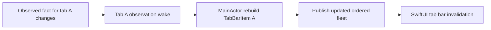
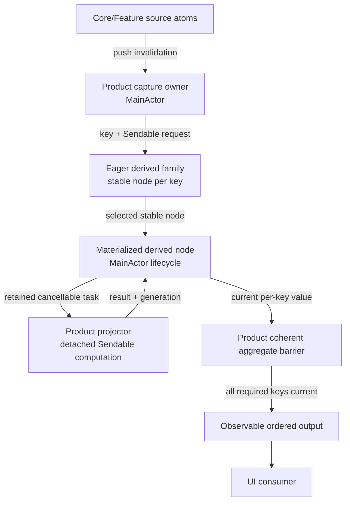
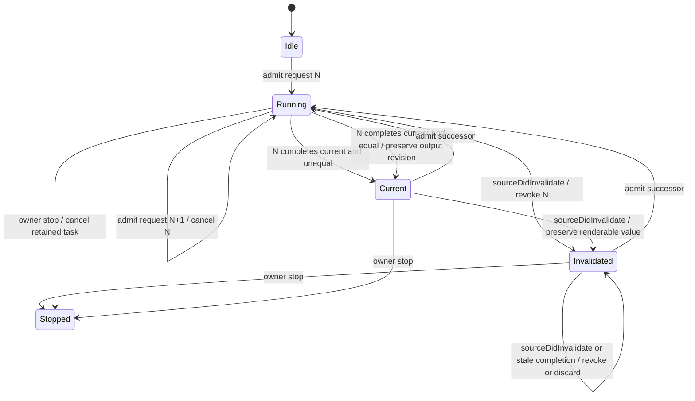

# Off-Main Materialization and Lifecycle — Program Design

Governing Requirements:
[Reactive State System Requirements](2026-07-31-reactive-state-system-requirements.md)

Governing Specification:
[Reactive State System Specification](2026-07-31-reactive-state-system-specification.md)

## Implementation Boundary

This document governs PR 2 only:

```text
total cancellation-only eager/off-main derivation
  ├── EagerDerivedAtom — one latest-wins derived identity
  ├── EagerDerivedAtomFamily — one node per independently invalidated key
  └── keyed per-tab projection + coherent Tab Bar publication
```

In scope are the total cancellation-only eager node, its keyed family,
synchronous per-key source revocation, immutable per-tab request capture, pure
Core/Inbox projection policies, off-main tab-item reconstruction and equality,
coherent current-result admission across ordered tabs, the selected tab-scoped
source-family corrections required for unrelated-tab isolation, the existing
one-time typed host, explicit shutdown, and the smallest static, semantic,
native, and performance proof required by this slice.

This PR does not migrate Repo Explorer or Inbox workers, add a fallible eager
branch, change pane-title or persistence authority, perform a broad pane/tab
source-family migration, change Command Bar, split targets, or add a scheduler,
worker pool, retry system, second projection path, or parallel proof framework.

Later sections retain family-wide lifecycle and measurement context. For this
goal, descriptions of existing workers, one-shot preparation, future fallible
adopters, Command Bar, or unrelated infrastructure are non-governing. Only
measurement corrections required to prove this Tab Bar slice may change, and
they remain part of PR 2 rather than a separate implementation slice.

## 1. Decision Summary

AgentStudio will use one narrow reusable lifecycle for replaceable,
CPU-oriented eager derivations, plus one keyed owner when independently
invalidated entities need that lifecycle:

```text
keyed MainActor source capture
  -> EagerDerivedAtomFamily selects one stable node for the key
  -> immutable Sendable request with bounded freshness identity
  -> one retained latest-wins task for that key
  -> detached cancellable computation
  -> MainActor per-key freshness admission
  -> equality-gated per-key output
  -> product-owned coherent aggregate publication
```

Each reusable node owns only one current request, one task, stale-result
rejection, and one materialized output. The family owns stable key-to-node
identity, departed-key shutdown, and per-key admission/readiness. Neither is a
task runtime: there is no queue, worker pool, retries, priority policy,
dependency discovery, polling, service lookup, or persistence behavior.

Product code remains responsible for:

- declaring which source reads form the request;
- constructing an immutable `Sendable` request plus a compact bounded identity;
- implementing pure cancellable projection logic;
- defining the semantic output comparator;
- selecting telemetry through the existing trace tags.

The selected primitive is total apart from cooperative cancellation. A future
fallible product migration must return to Program Design with its product-owned
failure policy before the generic contract gains failed or stale-result states.

One-shot preparation remains structured work owned by its caller and does not
use the latest-wins primitive.

The generic primitives are named
`EagerDerivedAtom<Request, RequestIdentity, Value>` and
`EagerDerivedAtomFamily<Key, Request, RequestIdentity, Value>`. Together with
the sibling lazy `DerivedAtom<Value>`, the type names make execution mode and
keyed derived identity visible at construction and review.

## 2. Structural Crux

The crux is how to guarantee that variable-cost work leaves `MainActor`
without turning every asynchronous operation into a generic orchestration
system.

Current Repo Explorer and Inbox implementations correctly separate capture,
worker execution, cancellation, generation admission, and publication. They
repeat that lifecycle locally. Tab Bar has keyed observations, but still
performs variable-cost tab-item reconstruction on `MainActor`.

The selected design extracts only the repeated replaceable-projection
mechanics and the keyed node lifecycle already required by Tab Bar. Existing
correct feature-local workers do not migrate merely for uniformity.

### 2.1 Alternatives considered

| Alternative | Benefit | Cost and failure mode | Disposition |
|---|---|---|---|
| Leave every feature to hand-roll task and generation lifecycle | No shared abstraction | Repeated cancellation/admission mistakes remain easy | Rejected for new replaceable projections |
| Build a general task scheduler/runtime | Central policy and queues | New lifecycle authority, complexity, target coupling | Rejected |
| Put variable computation on an actor | Serialization | Does not prove work leaves `MainActor` or provide latest-wins admission | Rejected as the execution guarantee |
| Use unretained detached tasks | Off-main execution | No lifecycle, shutdown, or stale-result ownership | Rejected |
| One fleet-wide materialized node | One task and one output | Unrelated tab changes recapture and reproject the fleet, violating key isolation | Rejected |
| Product-owned parallel maps of eager nodes and generations | Preserves key isolation | Reimplements membership, readiness, stale-callback, and shutdown semantics | Rejected |
| One constrained node plus keyed eager family | Reuses the exact common semantics while product workers stay explicit | Supports only keyed replaceable CPU projection | Selected |

The constrained primitive should be replaced or widened only if a second
proven workload needs a different ordering policy. It must not accumulate
generic queues, retries, backoff, persistence, or arbitrary job features.

## 3. Current-System Model

### 3.1 Repo Explorer

Current control flow:

```text
observed source or debounced query changes
  -> build RepoExplorerProjectionRequest on MainActor
  -> compare semantic request
  -> cancel and replace retained orchestration task
  -> actor worker creates detached CPU task
  -> forward cancellation
  -> check generation and request facts on MainActor
  -> publish projection and row index
```

This is a valid replaceable-live-projection model. Its source-capture
observation gap is handled by the sibling reactive-atoms design.

### 3.2 Inbox

Inbox uses the same broad lifecycle shape for notification grouping, sorting,
filtering, row indexing, and repo presentation. It already rejects superseded
results by generation and complete key.

### 3.3 Tab Bar

`TabBarAdapter` observes tab membership globally and tab content through
tab-scoped observations. A relevant per-tab change still reconstructs display
titles, arrangements, pane visibility, minimized counts, zoom state, and
notification color on `MainActor`. A fleet-wide eager node would undo the
key-isolation benefit by observing and reprojecting every tab together.



The exact runtime severity is unproven, but the variable-cardinality
MainActor topology directly conflicts with the governing execution boundary.

### 3.4 One-shot preparation

Workspace restore uses structured `async let` preparation and one atomic
MainActor admission. No newer request supersedes it. It must remain separate
from the replaceable latest-wins model.

### 3.5 Current-to-target Tab Bar call-path delta

| Status | Entrypoint-to-effect edge | State/result/error behavior | Evidence or obligation |
|---|---|---|---|
| Removed | Relevant tab change -> synchronous owning-item reconstruction on `MainActor` | Variable-cost reconstruction and output equality leave the interaction actor. | Current `TabBarAdapter.swift`; RS-09, RS-12 |
| Added | Relevant tab-key change -> bounded `Sendable` request capture -> matching `EagerDerivedAtomFamily` member -> detached projector | One successor replaces work only for that tab; unrelated family members remain current. | C3, RS-05, RS-09–RS-12 |
| Added | Per-key completion -> node freshness admission -> family readiness -> aggregate barrier | Superseded or departed-key completion is discarded; equal completion makes that key current without changing output revision. | C3, RS-09, RS-13 |
| Changed | Adapter-owned synchronous items -> family-owned materialized tab items plus one adapter-owned coherent aggregate | Ordered items and active identity publish only when every retained key is current for its admitted request. | RS-03, RS-14, RS-28 |
| Intentionally unchanged | Controller constructs one `CustomTabBar` and one typed `DraggableTabBarHostingView` | Before first current output, the existing view observes an absent projection and presents no authoritative tab items or active selection; normal Observation publication updates the same host. | Current `PaneTabViewController.makeTabBarHostingView()`; RS-14, RS-28 |
| Intentionally unchanged | Materialized output -> `CustomTabBar`; overflow and drag/drop geometry remain adapter-owned | Existing UI interaction and bounded geometry work stay on `MainActor`. | Current `CustomTabBar`/adapter boundary; RS-28 |

## 4. Target Components and Ownership

| Component | Owner | Responsibility |
|---|---|---|
| Product source observer/capture | Product surface owner on `MainActor` | Observe declared source facts and build the current immutable request plus bounded identity |
| Product request | Product module | Carry only `Sendable` source facts plus a compact bounded semantic or freshness identity |
| `EagerDerivedAtom<Request, RequestIdentity, Value>` | Generic Infrastructure primitive, instantiated and retained by product owner | Own current generation, retained task, output cache/revision, cancellation, and freshness admission |
| `EagerDerivedAtomFamily<Key, Request, RequestIdentity, Value>` | Generic Infrastructure primitive retained by product owner | Own stable keyed nodes, per-key admitted/current readiness, keyed completion routing, removal shutdown, and stop-all |
| Product projector | Product module, nonisolated pure computation | Transform a request into a result with cooperative cancellation |
| Coherent aggregate publication | Product adapter on owning actor | Validate and publish ordered values only when every required family member is current |
| Product UI adapter/view | App or Feature | Observe the coherent materialized output and own ephemeral UI state only |



## 5. Dependency Direction

Infrastructure owns generic lifecycle mechanics and may not name product
requests, results, atoms, UI types, `CoreAtoms`, `AtomRegistry`, or Feature
state.

Core and Features may define requests and pure projectors using Infrastructure.
App may compose Core and Feature facts into an App-owned materialized result,
such as Tab Bar presentation.

The generic node does not observe `CoreAtomScope` and cannot discover its own
dependencies. The product capture owner supplies every request explicitly.

## 6. `EagerDerivedAtom` Contract

The reusable node is a stable `@MainActor` object parameterized by a
`Sendable` request, compact request identity, and output. Its package interface
has this structural shape:

```text
EagerDerivedAtom<
  Request: Sendable,
  RequestIdentity: Equatable & Sendable,
  Value: Sendable
>
  init(
    requestIdentity: @Sendable (Request) -> RequestIdentity,
    isValueEqual: @Sendable (Value, Value) -> Bool,
    project: @Sendable (Request) throws(CancellationError) -> Value
  )
  nonisolated sourceDidInvalidate()
  admit(request)
  stop()
  value: Value?
  freshness: idle | running(RequestIdentity) | invalidated(RequestIdentity) | current(RequestIdentity) | stopped
  revision: Int
```

The node uses one fixed user-interaction execution priority rather than
exposing scheduling policy. Product code cannot configure queues, retries, or
parallelism through this interface.

`sourceDidInvalidate()` is the one synchronous bridge from a leading-edge
Observation callback. It advances a small lock-protected revocation epoch and
is safe to call before the callback schedules post-mutation MainActor capture.
It neither captures product state nor starts work. This closes the interval in
which source state has changed but the successor request cannot yet be built.

### 6.1 Admission

The product owner submits:

- an immutable request;
- a compact fixed-cardinality semantic or freshness identity;
- a `@Sendable` CPU projection closure over that request;
- semantic output equality.

The projector accepts only cooperative `CancellationError` as an early exit and
has no failure-policy argument or failed state.

The owning actor compares only the compact identity, never the
variable-cardinality request or output. Submitting an equal request is a no-op
while that request and its revocation epoch are still running or current. After
`sourceDidInvalidate()`, the next admission is a successor even if a product
mistakenly reuses its compact identity. Submitting a successor:

1. advances the generation;
2. marks any previous output as non-current for the new request;
3. cancels the retained prior task;
4. retains one replacement task.

Admission associates the request with the current revocation epoch. A source
invalidation after admission makes that association stale immediately, even
before a successor reaches `admit(request)`.

### 6.2 Execution

The generic node executes the synchronous CPU projector inside one internally
owned detached task. Request, result, and closure transfer must satisfy Swift
6 concurrency checking.

The task also receives the previously published `Sendable` value, when one
exists. It computes the candidate and performs any variable-cardinality
semantic output comparison off-main. The completion returned to `MainActor`
contains the candidate, its compact request identity and generation, and the
already-computed equality outcome. No MainActor comparison scales with tabs,
panes, rows, files, or result count.

The projector:

- cannot capture `MainActor` product state;
- receives all input through the request;
- performs no UI or atom mutation;
- checks cancellation at bounded intervals in variable-cardinality loops;
- returns one complete `Sendable` result or throws.

This structure makes off-main execution a property of the paved path rather
than a convention at every call site. Async I/O workflows do not use this
primitive; their owning subsystem retains explicit structured or actor-owned
lifecycle.

### 6.3 Publication

Completion returns to the owning actor. The node publishes only if:

- the task was not cancelled;
- its generation and semantic/freshness request identity are still current;
- its admitted revocation epoch still matches the current source epoch;
- the result is complete;
- the off-main semantic comparison reports that the result differs.

A stale or equal result may update aggregate-safe telemetry but does not change
the output revision or wake output-only consumers.

For an equal current result, lifecycle freshness advances to the admitted
request identity without replacing or republishing the equal value. Freshness
bookkeeping is separate from output-only observation.

Lifecycle status and output observation are separate. A UI that reads only the
materialized output does not wake merely because task bookkeeping changed.

### 6.4 `EagerDerivedAtomFamily` Contract

The keyed family is a stable `@MainActor` owner of eager nodes. It is not an
observable product collection and owns no ordering or aggregate semantics. Its
package interface has this structural shape:

```text
EagerDerivedAtomFamily<
  Key: Hashable & Sendable,
  Request: Sendable,
  RequestIdentity: Equatable & Sendable,
  Value: Sendable
>
  materialize(for key) -> EagerDerivedAtom?
  atom(for key) -> EagerDerivedAtom?
  admit(request, for key)
  currentValue(for key) -> Value?
  remove(key)
  stop()
```

For each live key, `materialize` returns one stable child node. Admission clears
that key's ready identity. Only the child's current `.published` or `.equal`
completion marks the admitted identity ready; superseded and cancelled
completion do not. `currentValue(for:)` returns a value only when the child's
ready identity matches its latest admitted identity.

Removal stops the child before erasing it. A later materialization of the same
key creates a new child identity, and completion from the departed child cannot
be routed into the replacement. A stopped child remains retained until every
projection task admitted through that child has delivered its terminal
completion; this includes cancelled predecessors still unwinding behind the
latest retained task. Family `stop()` is idempotent and irreversible: it stops
every child and rejects later materialization and admission.

The family forwards accepted completion with its key. It does not own source
observation, ordered membership, Tab Bar item validation, aggregate snapshots,
telemetry, scheduling policy, or coherent publication. Those remain with the
product adapter.

## 7. Lifecycle State



The state records the request identity associated with every retained output.
A prior value may remain renderable while a successor runs, but it is never
represented internally as current for that successor.

Cancellation caused by a newer request does not become a terminal failure.
Cancellation with no successor during owner shutdown publishes nothing.
`stop()` is idempotent and irreversible: it cancels retained work, rejects
future admissions, and prevents every later completion from publishing.
Successor admission owns ordinary task cancellation; there is no public
reusable `cancel()` operation whose terminal meaning callers must guess.

## 8. Total Projection Boundary

The Tab Bar projector is total over an accepted per-tab
`TabBarProjectionRequest`; its only early exit is cooperative cancellation.
Existing tolerant title, arrangement, and active-tab fallbacks are part of that
total projector.

While a successor runs, that family member keeps its previous
`TabBarProjection` renderable with its original request identity, while the
adapter retains the previous coherent aggregate so navigation does not blank.
That is successor continuity required by RS-28, not a policy for retaining a
failed result. A future genuinely fallible surface must obtain a product failure
decision and a focused Program Design before the generic primitive gains a
fallible constructor or failed/stale lifecycle states.

Repo Explorer and Inbox retain their current product behavior until separately
migrated. Their current output/request-key relationship must be made explicit
before adopting the generic node.

## 9. Target Tab Bar Flow

### 9.1 Title semantics remain unchanged

The first Tab Bar slice changes where display projection runs. It does not
change title authority, precedence, events, or durability. The pure Core
projector and the current actor-bound readers must produce the same title for
the same captured facts:

1. accepted terminal `.titleChanged` and `.tabTitleChanged` events continue to
   update runtime metadata, remain available to replay, and satisfy the current
   IPC title-change wait behavior;
2. a normalized user-defined tab name continues to override pane runtime
   titles;
3. a worktree-backed pane continues to use its repository/worktree label ahead
   of terminal metadata;
4. a pane without either override continues to use its trimmed runtime title
   or the existing `Terminal` fallback; and
5. pane-title metadata continues through the current workspace-persistence
   behavior.

This slice does not decide whether runtime titles should remain durable pane
metadata or whether inactive-arrangement ownership should change. Either change
would alter observable compatibility and persistence behavior and therefore
requires a separate Requirements and Specification decision before Program
Design. Title parity is a hard cutover gate, not an invitation to preserve two
projection implementations.

### 9.2 Request capture

`TabBarAdapter` is the window-scoped App bridge, materialization owner, and
ephemeral UI owner. The App window factory constructs one adapter for each
`MainWindowController` from process-owned Core, Feature, and action
dependencies; it does not retain one observing adapter across controller
replacement. The adapter observes ordered tab IDs and active selection as one
bounded collection concern, then installs one source-observation closure per
tab. Each tab closure captures a `TabBarProjectionRequest` containing:

- the selected tab shell, tab graph, and arrangement cursors;
- only that tab's pane graph and drawer facts required for display;
- topology and repo-enrichment source facts read inside the registered
  Observation boundary and copied into immutable snapshots;
- that tab's zoom presentation facts;
- the Feature-owned Inbox attention lane for that tab's pane IDs;
- one adapter-owned monotonic `TabBarProjectionGeneration`.

The request crosses ownership through three concrete product interfaces:

```text
CoreTabBarProjectionRequest: Sendable
  captured facts for one tab, its panes, arrangements, topology,
  enrichment, and zoom state

CoreTabBarProjector.project(CoreTabBarProjectionRequest)
  -> CoreTabBarProjection: Sendable
     one tab identity, titles, arrangement labels/badges, pane visibility,
     minimized count, and zoom facts

InboxAttentionProjector.project(
  InboxAttentionFactSnapshot,
  groups: [OpaqueGroupID: Set<PaneID>]
) -> [OpaqueGroupID: InboxAttentionLane]
```

Core owns the title, pane-display, arrangement, and zoom policies currently
reached through `TabDisplayDerived`, `PaneDisplayDerived`, and
`ArrangementDerived`. Their reusable policy operations become pure
`nonisolated` functions over the captured Core request; existing MainActor
readers may call the same functions for other surfaces. App does not copy those
rules. Inbox owns attention eligibility and precedence behind its snapshot and
pure projector. App owns only capture, opaque tab grouping, mapping Inbox lanes
to `TabNotificationDotColor`, and assembly of the final `TabBarProjection`.

MainActor capture reads the selected tab's keyed values and stored copy-on-write
snapshots without reconstructing `TabBarItem`. Appending or changing tab B does
not wake or recapture retained tab A. Any selected-tab request-building step
whose work grows through that tab's pane or arrangement cardinality is moved
into the projector unless it is unavoidable bounded snapshot capture.

`TabBarProjectionGeneration` is the compact admitted-request identity for this
slice. The adapter advances it for each initial or successor per-tab admission.
The matching tab callback first calls that family's child
`sourceDidInvalidate()` synchronously, then schedules the post-mutation
MainActor capture required by Observation's leading-edge semantics. Source
owners suppress equal writes; the adapter does not hash or structurally compare
tab snapshots on `MainActor`. Several publications for the same key before
callback handling revoke only that key's old request and produce one capture of
its latest state. Re-admitting the same generation is a no-op.

The adapter materializes and observes one family child for every initial tab
during construction. `PaneTabViewController`
keeps the current one-time construction of `CustomTabBar` and its typed
`DraggableTabBarHostingView`. Before first current output, the adapter exposes
an absent renderable projection, and the existing view presents no authoritative
tab items or active selection. Normal Observation publication updates that same
host when current output arrives; no callback, root replacement, type erasure,
or second hosting boundary is introduced. The rest of window composition need
not wait. The first coherent publication occurs only when every retained family
member is current. Because the projector is total, each child ends only in
current output, supersession by a newer admission, removal, or owner shutdown.
There is no synchronous reconstruction bootstrap fallback.

### 9.3 Projection and publication

```mermaid
sequenceDiagram
    participant Sources as Core/Feature atoms
    participant Adapter as TabBarAdapter
    participant Family as EagerDerivedAtomFamily
    participant Node as EagerDerivedAtom
    participant Worker as Tab bar projector
    participant UI as CustomTabBar

    Adapter->>Family: materialize tab A
    Family-->>Adapter: stable node A
    Adapter->>Adapter: capture Sendable request A.N
    Adapter->>Family: admit A.N for tab A
    Family->>Node: admit A.N
    Node-->>Worker: detached projection A.N
    Sources->>Adapter: push tab A leading-edge invalidation
    Adapter->>Node: sourceDidInvalidate() synchronously
    Adapter->>Adapter: post-mutation capture A.N+1
    Adapter->>Family: admit A.N+1 for tab A
    Node-->>Worker: cancel A.N; project A.N+1
    Worker-->>Node: stale completion A.N rejected
    Worker-->>Node: result A.N+1
    Worker->>Worker: compare with prior Sendable projection
    Node->>Family: tab A current
    Family->>Adapter: keyed completion A
    Adapter->>Adapter: require every retained tab current
    Adapter->>UI: publish coherent ordered projection
```

Each worker constructs one complete per-tab `TabBarProjection` off-main:

```text
TabBarProjection
  items: [TabBarItem]  // exactly one matching item
  activeTabID: UUID?   // selected tab identity inside the per-tab request
```

The family is the sole stored authority for per-tab materialized values and
readiness. The adapter validates each current value contains its matching tab,
orders those values using the separately observed tab order, combines them with
the requested active tab, and publishes one coherent aggregate. It retains the
previous aggregate while any required family member is not current. Overflow
calculation and ephemeral drag/drop state remain on `MainActor` because they
depend on current view geometry and are bounded.

### 9.4 Notification facts

App injects the concrete Inbox atom into the Tab Bar capture boundary. Each
tab's registered observation reads the Feature-owned keyed
`attentionLane(forPaneIds:)` projection for that tab's pane IDs and copies only
the resulting `Sendable` lane into the request. App does not inspect raw
notifications or interpret notification policy during capture.

Inbox owns the canonical keyed lane projection and the pure `Sendable`
`InboxAttentionProjector` used to derive it. The off-main App projector maps the
already-captured lane to `TabNotificationDotColor`. Feature owns notification
eligibility and precedence; App owns only tab grouping and color presentation.

The Feature remains the canonical notification owner. App is allowed to depend
downward on the Feature and compose it with Core; neither Core nor the generic
eager primitive names Inbox. No Feature registry or ambient sibling lookup is
introduced.

## 10. Existing Feature Workers

Repo Explorer and Inbox already meet most lifecycle obligations through local
code. They remain authoritative during the first materialization slice.

They return to Program Design before any later adoption. The generic node gains
fallible behavior only if:

- behavior and failure policy are frozen;
- the generic contract removes more lifecycle code than it introduces;
- cancellation and stale-admission tests remain equivalent or stronger;
- the migration does not force cross-feature request/result types into
  Infrastructure.

There is no compatibility adapter or dual worker path. A later adoption is a
hard cut for one feature.

## 11. One-Shot Preparation

One-shot restore and persistence preparation use structured caller-owned
lifetime:

```text
caller captures immutable input
  -> async let or direct awaited @concurrent preparation
  -> await all required results
  -> validate complete candidate
  -> one atomic MainActor admission
```

No generic latest-wins node is introduced because:

- no successor request can supersede the work;
- there is no renderable intermediate output;
- the caller already owns completion and failure;
- structured child cancellation provides the correct lifetime.

This boundary prevents the materialization primitive from becoming a general
task framework.

## 12. Concurrency and Ordering

| Interleaving | Required result |
|---|---|
| Source changes after N admission but before N+1 admission | The synchronous revocation epoch rejects N; the prior accepted value may remain renderable but is not current |
| N completes before any source invalidation | N may publish |
| N+1 admitted before N completes | N completion is discarded regardless of cancellation cooperation |
| N completes current and equal to the prior output | N becomes the current request identity; output revision and output-only observation remain unchanged |
| Cancellation arrives during a long loop | Projector detects it at a bounded checkpoint and exits |
| Projector ignores cancellation and completes | Generation admission still rejects stale output |
| Tab A is running when tab B changes | B admits independently; A is neither revoked nor recomputed |
| A tab is removed while its projector runs | The family stops that child and rejects its later completion |
| One retained tab is current while another is running | The adapter preserves the previous coherent aggregate until every required key is current |
| Owner shuts down with work running | Retained task is cancelled and no later completion publishes |
| Telemetry exporter blocks or fails | State lifecycle continues unchanged; telemetry is dropped/fail-open |

Generation/request identity and the synchronously advanced revocation epoch are
the final correctness guards. Cancellation is a resource optimization, not the
stale-result guarantee.

For the first product slice, window close, controller replacement, and
application termination invoke `MainWindowController.shutdown()`. It calls
`MainSplitViewController.shutdown()` -> `PaneTabViewController.shutdown()` ->
`TabBarAdapter.stop()` before releasing the host. That idempotently stops the
family and every retained node and rejects every later admission. Adapter deinitialization
performs the same stop defensively, but deinitialization is not the primary
lifecycle trigger.

Canonical Core and Feature state survives window replacement. The stopped
adapter's materialized cache and transient drag, overflow, and geometry state
do not. Reopening constructs a fresh adapter and family through the App window
factory and starts fresh per-tab admissions. A headless process does not retain
or run a process-owned Tab Bar adapter observation.

## 13. Telemetry and Capacity

Selected materialized nodes report through the existing trace-tag system:

- admission count;
- request-identity no-op count;
- MainActor capture duration;
- worker duration;
- MainActor publication duration;
- cancellation count;
- stale-discard count;
- semantic output-change count;
- input and output cardinality.

No request identity, key, UUID, path, title, terminal content, notification
body, or error payload is exported. Attributes are allowlisted and bounded.

Each family member retains one current task handle. Successor admission cancels
that handle before replacing it, although cancelled predecessors may remain
temporarily unsettled while cooperative cancellation unwinds. Removal and
family shutdown keep a stopped child alive only until all of those terminal
completions arrive, so none are lost and none can publish. Rapid changes to one
key cancel and replace only that key rather than intentionally queueing work.
Equal identities remain no-ops while running or current.

## 14. First Migration Slice and Workload

Tab Bar is the first eager-materialization slice because:

- the current callback performs variable-cost tab-item reconstruction on
  `MainActor`;
- the output is already a compact value array;
- the adapter already owns observation and UI publication;
- existing `performance.tabbar.refresh` telemetry provides a direct-work
  baseline, but not an end-to-end visible-latency seam;
- it composes App, Core, and Feature facts without moving their ownership.

The current measurement boundary is insufficient for RS-24–RS-26 acceptance:
`performance.tabbar.refresh` ends after adapter refresh work rather than after
visible presentation or focused-input readiness; hot telemetry attributes can
construct rich values before an enabled-tag rejection; and the bounded trace
queue does not report dropped records or a high-water mark. A matched
distribution from those records can therefore omit pressure or measure the
wrong boundary.

Within PR 2, the following measurement corrections must land before Tab Bar
performance acceptance:

```text
Lazy hot attributes; disabled tags do no rich work ─────────┐
Trace-queue drop and high-water accounting ─────────────────┤
Capture, worker, and publication durations ─────────────────┼──> Tab Bar
Interaction to visible/current-result boundary ─────────────┤    acceptance
Source, executable, workload, and event provenance ─────────┘
```

This proof work extends the existing trace queue, Victoria workload, and
comparator. It is not a new telemetry framework or a third implementation
slice. Correctness implementation may proceed before it, but no performance
acceptance or improvement claim may pass without it.

Before candidate results exist, the slice freezes:

- tab activation and navigation;
- pane-title and repo-enrichment changes;
- notification-dot changes;
- zoom/arrangement changes;
- typing and scrolling continuity while those updates occur;
- tab-bar invalidation/admission count;
- MainActor capture and publication duration;
- end-to-end tab-bar refresh/visible-update latency;
- tab, pane, repo, and worktree cardinality;
- event-continuity and final rendered-state oracles.

After these measurement corrections exist, the event hard cut preserves an
exact comparison mapping:

- the existing `performance.tabbar.refresh` baseline event maps to one
  terminal record for every candidate request admission, including
  `published`, `equal`, `superseded`, and `cancelled` outcomes;
- separate bounded phase events record capture, worker, and publication
  duration, correlated by a non-sensitive run-local sequence rather than a
  product identifier;
- successful-publication count is never used as the issued-work denominator;
- the controlled driver records issued interactions independently and reads
  back final tab/active-tab state independently of performance telemetry.

The existing performance comparator remains the one admission authority. It is
extended to require exact source/executable/workload/trace-tag provenance,
the frozen event set, terminal outcome completeness, issued-interaction
continuity, and final-state equivalence before comparing distributions. The
existing OTLP allowlist and fail-open tests cover the new bounded fields; no
parallel benchmark or telemetry framework is introduced.

The large watched-folder/open-source workload is reused so topology and
enrichment pressure occur while Tab Bar remains interactive. The existing
comparison rule that requires an arbitrary fixed fraction or universal 50%
improvement is not authoritative for this slice. Regression boundaries come
from the frozen provenance-matched baseline variability or an already
governing budget.

Command Bar remains outside the first slice. Its demand cache and scope
behavior require independent workload evidence before deciding between lazy
cached composition and eager materialization.

## 15. Cutover

The Tab Bar cutover has one coherent output authority at every point:

- before cutover, `TabBarAdapter.refresh()` owns materialized items;
- after cutover, `EagerDerivedAtomFamily` owns per-tab materialized values and
  readiness while `TabBarAdapter` alone owns their ordered coherent aggregate;
- the synchronous tab-item reconstruction path is removed in the same slice.

No feature flag, dual computation, or fallback-to-old-refresh path remains.
Rollback is source rollback before dependent work builds on the new contract,
not a permanent runtime compatibility branch.

## 16. Cross-Cutting Realization

| Obligation | Structural realization | Failure/degradation |
|---|---|---|
| Responsiveness | Per-tab variable-cardinality projector and output equality run in internally detached tasks | Previous coherent aggregate remains renderable while a required successor runs |
| Freshness | Per-key admission plus synchronous source-revocation epoch and an all-current aggregate barrier | Source change rejects old work before deferred successor capture; unrelated keys remain current; cancellation failure cannot publish stale output |
| Reliability | One retained task per live key, bounded family membership, explicit removal and irreversible shutdown | Tab Bar has no failure branch beyond cancellation, removal, or shutdown; fallible adoption is deferred |
| Target readiness | Generic node owns no product type; App owns cross-feature composition | No reverse target edge or ambient registry |
| Privacy | Allowlisted aggregate telemetry only | Exporter failure is fail-open |
| Operability | Existing performance trace tags and debug identity | Missing event continuity invalidates comparison |
| Platform safety | `Sendable` request/result/closure and strict Swift 6 checks | Compile-negative proof distinguishes compiler claims from lint |

## 17. Proof Architecture

| Requirement set | Structural seam | Proof class |
|---|---|---|
| RS-05, RS-09–RS-10 | Keyed family identity, admission, retained task, request readiness, output revision | Stable child identity, unrelated-key isolation, deterministic latest-wins, equal-result currentness, and push-admission tests |
| RS-11–RS-12 | Sendable request/result and internally detached projector | Compiler harness plus source/behavior proof that variable work is outside `MainActor` |
| RS-13–RS-14 | Per-key generation admission, synchronous source revocation, removal, aggregate barrier, and owner shutdown | Controlled cancellation, pre-successor stale completion, out-of-order cohort completion, removal, overlap, and cleanup tests without wall-clock sleeps |
| RS-21–RS-23 | Narrow generic interface and product-owned request/projector | Architecture rules and target-build proof |
| RS-24–RS-26 | PR 2 measurement corrections plus trace events and controlled Tab Bar workload | Lazy disabled-path attributes, trace-queue completeness, phase and interaction-to-visible boundaries, provenance equality, independent continuity oracle, distributions, and frozen regression boundary |
| RS-27–RS-28 | Real adapter and isolated debug app | Unit/integration/runtime pyramid plus launch, tab navigation, typing, scrolling, animation, and state-change proof |

The cancellation harness uses explicit gates or continuations to hold N,
admit N+1, and release completions in either order. It never sleeps for an
assumed scheduler interval.

A separate leading-edge harness holds N, mutates one observed source, confirms
the callback revokes N while successor capture is still gated, then releases N
before admitting N+1. N must not publish or become current. Releasing the gate
admits N+1 from post-mutation state, and only N+1 may become current. This proof
uses callbacks and continuations, not scheduler timing.

The native gate uses the existing authenticated debug IPC path for semantic
Tab Bar actions and independent state read-back, plus the existing native UI
inspection path for rendered interaction evidence. It sets
`AGENTSTUDIO_REQUIRE_LAUNCHSERVICES=1`; the debug runner's
`direct_executable` fallback is telemetry-only and cannot satisfy native
interaction or visible-performance acceptance.

Core projection parity feeds identical captured facts through the current
`TabDisplayDerived`, `PaneDisplayDerived`, and `ArrangementDerived` policies and
the pure Core projector, then compares every title, arrangement label/badge,
pane visibility, minimized count, zoom fact, and active-tab result. A
first-materialization integration gate holds one or more keyed projectors and proves the one
existing host/view presents no authoritative tab items or active selection,
then releases the complete current cohort and observes that same host render it.
Shutdown before release must suppress every later result without replacing the
host or resetting its view state.

Title parity additionally covers runtime and tab-title events, custom-tab-name
precedence, worktree-label precedence, empty-title fallback, IPC/replay
behavior, and save/relaunch behavior. It proves compatibility through the one
new projector; it does not retain the synchronous fleet projector as a second
authority.

Inbox projection parity tests feed identical immutable facts and pane groups to
the keyed `attentionLane(forPaneIds:)` behavior and the pure projector.
They cover every lane, dismissed/non-contributing facts, mixed groups, and
precedence. The keyed reader remains the per-tab capture boundary.

## 18. Source Inventory

| Source | Identity | Authority and applicability |
|---|---|---|
| Governing Requirements | [Reactive State System Requirements](2026-07-31-reactive-state-system-requirements.md) | Normative Why and authorized boundary |
| Governing Specification | [Reactive State System Specification](2026-07-31-reactive-state-system-specification.md) | Normative eager execution, lifecycle, proof, and scope obligations |
| Integrated main baseline | Git `ca4cb95c47bb4603659cbf350e9160dac2192650` | Keyed Tab Bar observation and source-family baseline integrated by PR 2 |
| [`RepoExplorerProjectionWorker.swift`](../../../Sources/AgentStudio/Features/RepoExplorer/Models/RepoExplorerProjectionWorker.swift) and [`RepoExplorerView.swift`](../../../Sources/AgentStudio/Features/RepoExplorer/RepoExplorerView.swift) | Current source at repository identity above | Existing correct replaceable worker pattern and source-capture boundary |
| [`InboxNotificationListProjectionWorker.swift`](../../../Sources/AgentStudio/Features/InboxNotification/Models/InboxNotificationListProjectionWorker.swift) and Inbox sidebar view | Current source at repository identity above | Existing second replaceable worker pattern |
| [`TabBarAdapter.swift`](../../../Sources/AgentStudio/App/Panes/TabBar/TabBarAdapter.swift) | Current source at repository identity above | Selected variable-cardinality MainActor path |
| [`TabDisplayDerived.swift`](../../../Sources/AgentStudio/Core/State/MainActor/Atoms/TabDisplayDerived.swift), [`WorkspacePaneGraphAtom.swift`](../../../Sources/AgentStudio/Core/State/MainActor/Atoms/WorkspacePaneGraphAtom.swift), [`TerminalRuntime.swift`](../../../Sources/AgentStudio/Features/Terminal/Runtime/TerminalRuntime.swift), and [`AgentStudioIPCRuntimeAdapter.swift`](../../../Sources/AgentStudio/App/IPCComposition/AgentStudioIPCRuntimeAdapter.swift) | Current source at repository identity above | Title authority, precedence, replay, IPC, and compatibility behavior preserved by the first Tab Bar slice |
| [`InboxNotificationAtom.swift`](../../../Sources/AgentStudio/Features/InboxNotification/State/MainActor/Atoms/InboxNotificationAtom.swift) | Current source at repository identity above | Feature-owned contribution and attention-lane policy preserved behind the pure projection seam |
| [`WorkspaceSQLiteSaveCoordinator.swift`](../../../Sources/AgentStudio/Core/State/MainActor/Persistence/WorkspaceSQLiteSaveCoordinator.swift) and restore preparation | Current source at repository identity above | Existing one-shot `@concurrent`/structured counterexample |
| [`AgentStudioPerformanceTraceRecorder.swift`](../../../Sources/AgentStudio/Infrastructure/Diagnostics/AgentStudioPerformanceTraceRecorder.swift) and existing workload scripts | Current source at repository identity above | Existing telemetry and controlled debug proof seams |
| [MainActor runtime pressure investigation](https://github.com/ShravanSunder/agentstudio/blob/aa0a1de06963089a7ec449f6a382dac89dac46cd/docs/wip/debugging/2026-08-05-mainactor-runtime-pressure.md) | Git `aa0a1de06963089a7ec449f6a382dac89dac46cd` observational report over release `0.0.72` | Measurement-boundary defects and ranked MainActor paths; observational, not normative |
| SE-0461, SE-0466, and SE-0430 | Accepted Swift proposals applicable to Swift 6.2.4 | Executor isolation and checked-transfer feasibility |

Scoped completeness covers all production `Task.detached` and `@concurrent`
sites through the governing inventory, the two mature live-projection paths,
the selected Tab Bar path, one-shot preparation, relevant telemetry, and the
debug/performance harness. Exact runtime improvement remains unclaimed.

## 19. Accepted Debt and Revisit Signals

- Repo Explorer and Inbox retain feature-local lifecycle until a separate
  hard-cut migration proves the generic node simplifies them.
- MainActor per-tab capture must still read stored keyed values and bounded
  snapshots. If measured capture grows beyond the frozen budget, the source
  owner needs a more compact revisioned snapshot; neither the node nor family
  becomes a background state reader.
- The primitives support keyed replaceable CPU projection only. A second ordering
  policy or async I/O use case requires a new design decision rather than
  silent generalization.

## 20. Negative Space

This design does not:

- create a scheduler, task pool, job queue, retry system, or actor framework;
- prebuild a fallible eager API before a selected fallible product migration;
- make `Task.detached` itself the correctness guarantee;
- run SQLite, filesystem I/O, or network work through the materialized node;
- discover dependencies ambiently;
- put product ordering, aggregate publication, item validation, telemetry, or
  source observation inside the generic eager family;
- persist materialized results as new authority;
- move ephemeral view geometry off `MainActor`;
- migrate all current workers in one change;
- assert a performance win from static code shape.
