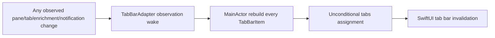
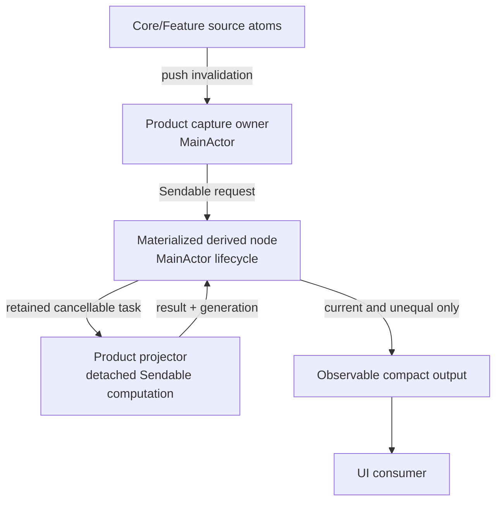
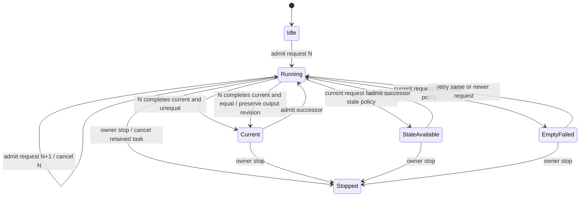
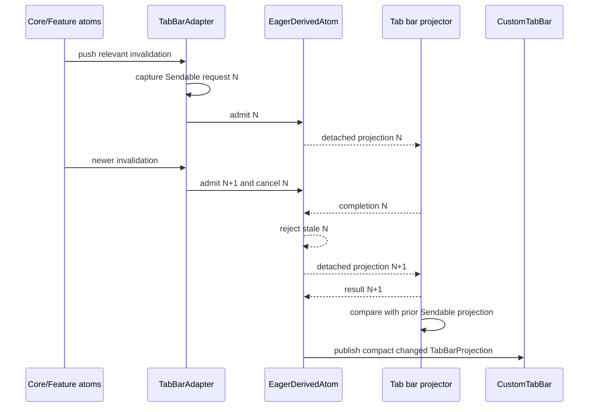

# Off-Main Materialization and Lifecycle — Program Design

Artifact type: program design — structural How
Target classification: general-domain
Governing specification:
[Reactive State System Requirements](2026-07-31-reactive-state-system-requirements.md)
Governing specification SHA-256:
`1aee657052b6e475767215bf613765c5056465f4920b0e178e5e0fb008809a39`
Source version: `50d0b0ac360af8b1fe2f62a56e35b5cd2cd8e515`

## 1. Decision Summary

AgentStudio will use one narrow reusable lifecycle for replaceable,
CPU-oriented eager derivations:

```text
MainActor source capture
  -> immutable Sendable request with bounded freshness identity
  -> one retained latest-wins task
  -> detached cancellable computation
  -> MainActor freshness admission
  -> equality-gated observable output
```

The reusable primitive owns only one current request, one task, stale-result
rejection, and one materialized output. It is not a task runtime: it has no
queue, worker pool, retries, priority policy, dependency discovery, polling,
service lookup, or persistence behavior.

Product code remains responsible for:

- declaring which source reads form the request;
- constructing an immutable `Sendable` request plus a compact bounded identity;
- implementing pure cancellable projection logic;
- choosing clear-versus-explicitly-stale failure behavior;
- defining the semantic output comparator;
- selecting telemetry through the existing trace tags.

One-shot preparation remains structured work owned by its caller and does not
use the latest-wins primitive.

The generic primitive is named
`EagerDerivedAtom<Request, RequestIdentity, Value>`. Together with the sibling
lazy `DerivedAtom<Value>`, the type name makes execution mode visible at
construction and review.

## 2. Structural Crux

The crux is how to guarantee that variable-cost work leaves `MainActor`
without turning every asynchronous operation into a generic orchestration
system.

Current Repo Explorer and Inbox implementations correctly separate capture,
worker execution, cancellation, generation admission, and publication. They
repeat that lifecycle locally. Tab Bar still performs variable-cardinality
fleet reconstruction on `MainActor`.

The selected design extracts only the repeated replaceable-projection
mechanics, then proves it first on Tab Bar. Existing correct feature-local
workers do not migrate merely for uniformity.

### 2.1 Alternatives considered

| Alternative | Benefit | Cost and failure mode | Disposition |
|---|---|---|---|
| Leave every feature to hand-roll task and generation lifecycle | No shared abstraction | Repeated cancellation/admission mistakes remain easy | Rejected for new replaceable projections |
| Build a general task scheduler/runtime | Central policy and queues | New lifecycle authority, complexity, target coupling | Rejected |
| Put variable computation on an actor | Serialization | Does not prove work leaves `MainActor` or provide latest-wins admission | Rejected as the execution guarantee |
| Use unretained detached tasks | Off-main execution | No lifecycle, shutdown, or stale-result ownership | Rejected |
| One constrained latest-wins materialized node | Reuses the exact common semantics while product workers stay explicit | Supports only replaceable CPU projection | Selected |

The constrained primitive should be replaced or widened only if a second
proven workload needs a different ordering policy. It must not accumulate
generic queues, retries, backoff, persistence, or arbitrary job features.

## 3. Current-System Model

### 3.1 Repo Explorer

Current control flow:

```text
observed source or debounced query changes
  -> build RepoExplorerProjectionRequest on MainActor
  -> compare semantic request
  -> cancel and replace retained orchestration task
  -> actor worker creates detached CPU task
  -> forward cancellation
  -> check generation and request facts on MainActor
  -> publish projection and row index
```

This is a valid replaceable-live-projection model. Its source-capture
observation gap is handled by the sibling reactive-atoms design.

### 3.2 Inbox

Inbox uses the same broad lifecycle shape for notification grouping, sorting,
filtering, row indexing, and repo presentation. It already rejects superseded
results by generation and complete key.

### 3.3 Tab Bar

`TabBarAdapter.observeStore()` watches broad pane, tab, zoom, enrichment, and
notification inputs. Every admitted change calls `refresh()`, which maps all
tabs and reconstructs display titles, arrangements, pane visibility,
minimized counts, zoom state, and notification colors on `MainActor`, then
assigns the complete `tabs` array.



The exact runtime severity is unproven, but the variable-cardinality
MainActor topology directly conflicts with the governing execution boundary.

### 3.4 One-shot preparation

Workspace restore uses structured `async let` preparation and one atomic
MainActor admission. No newer request supersedes it. It must remain separate
from the replaceable latest-wins model.

## 4. Target Components and Ownership

| Component | Owner | Responsibility |
|---|---|---|
| Product source observer/capture | Product surface owner on `MainActor` | Observe declared source facts and build the current immutable request plus bounded identity |
| Product request | Product module | Carry only `Sendable` source facts plus a compact bounded semantic or freshness identity |
| `EagerDerivedAtom<Request, RequestIdentity, Value>` | Generic Infrastructure primitive, instantiated and retained by product owner | Own current generation, retained task, output cache/revision, cancellation, and freshness admission |
| Product projector | Product module, nonisolated pure computation | Transform a request into a result with cooperative cancellation |
| Product failure policy | Product surface owner | Choose clear output or retain explicitly stale prior output |
| Observable publication | Materialized node on owning actor | Publish only current, semantically changed bounded output |
| Product UI adapter/view | App or Feature | Observe already materialized output and own ephemeral UI state only |



## 5. Dependency Direction

Infrastructure owns generic lifecycle mechanics and may not name product
requests, results, atoms, UI types, `CoreAtoms`, `AtomRegistry`, or Feature
state.

Core and Features may define requests and pure projectors using Infrastructure.
App may compose Core and Feature facts into an App-owned materialized result,
such as Tab Bar presentation.

The generic node does not observe `CoreAtomScope` and cannot discover its own
dependencies. The product capture owner supplies every request explicitly.

## 6. `EagerDerivedAtom` Contract

The reusable node is a stable `@MainActor` object parameterized by a
`Sendable` request, compact request identity, and output. Its package interface
has this structural shape:

```text
EagerDerivedAtom<
  Request: Sendable,
  RequestIdentity: Equatable & Sendable,
  Value: Sendable
>
  initTotal(
    requestIdentity: @Sendable (Request) -> RequestIdentity,
    isValueEqual: @Sendable (Value, Value) -> Bool,
    project: @Sendable (Request) throws(CancellationError) -> Value
  )
  initFallible(
    failurePolicy: clear | retainExplicitlyStale,
    requestIdentity: @Sendable (Request) -> RequestIdentity,
    isValueEqual: @Sendable (Value, Value) -> Bool,
    project: @Sendable (Request) throws -> Value
  )
  admit(request)
  stop()
  value: Value?
  freshness: idle | running | current | stale | failed | stopped
  revision: Int
```

The node uses one fixed user-interaction execution priority rather than
exposing scheduling policy. Product code cannot configure queues, retries, or
parallelism through this interface.

### 6.1 Admission

The product owner submits:

- an immutable request;
- a compact fixed-cardinality semantic or freshness identity;
- a `@Sendable` CPU projection closure over that request;
- semantic output equality;
- for a fallible projector only, the surface's preselected failure policy.

`initTotal` accepts only cooperative `CancellationError` as an early exit and
has no failure-policy argument or failed state. `initFallible` requires the
authority-owned policy. Tab Bar uses `initTotal`; it cannot accidentally encode
an unreachable clear-versus-stale decision merely to satisfy construction.

The owning actor compares only the compact identity, never the
variable-cardinality request or output. Submitting an equal request is a no-op
only while that request is running or current. The same identity is admissible
again after failure so product-owned retry is not accidentally suppressed.
Submitting a newer request:

1. advances the generation;
2. marks any previous output as non-current for the new request;
3. cancels the retained prior task;
4. retains one replacement task.

### 6.2 Execution

The generic node executes the synchronous CPU projector inside one internally
owned detached task. Request, result, and closure transfer must satisfy Swift
6 concurrency checking.

The task also receives the previously published `Sendable` value, when one
exists. It computes the candidate and performs any variable-cardinality
semantic output comparison off-main. The completion returned to `MainActor`
contains the candidate, its compact request identity and generation, and the
already-computed equality outcome. No MainActor comparison scales with tabs,
panes, rows, files, or result count.

The projector:

- cannot capture `MainActor` product state;
- receives all input through the request;
- performs no UI or atom mutation;
- checks cancellation at bounded intervals in variable-cardinality loops;
- returns one complete `Sendable` result or throws.

This structure makes off-main execution a property of the paved path rather
than a convention at every call site. Async I/O workflows do not use this
primitive; their owning subsystem retains explicit structured or actor-owned
lifecycle.

### 6.3 Publication

Completion returns to the owning actor. The node publishes only if:

- the task was not cancelled;
- its generation and semantic/freshness request identity are still current;
- the result is complete;
- the off-main semantic comparison reports that the result differs.

A stale or equal result may update aggregate-safe telemetry but does not change
the output revision or wake output-only consumers.

For an equal current result, lifecycle freshness advances to the admitted
request identity without replacing or republishing the equal value. Freshness
bookkeeping is separate from output-only observation.

Lifecycle status and output observation are separate. A UI that reads only the
materialized output does not wake merely because task bookkeeping changed.

## 7. Lifecycle State



The state records the request identity associated with every retained output.
A prior value may remain renderable while a successor runs, but it is never
represented internally as current for that successor.

Cancellation caused by a newer request does not become a terminal failure.
Cancellation with no successor during owner shutdown publishes nothing.
`stop()` is idempotent and irreversible: it cancels retained work, rejects
future admissions, and prevents every later completion from publishing.
Successor admission owns ordinary task cancellation; there is no public
reusable `cancel()` operation whose terminal meaning callers must guess.

## 8. Failure Policy

Every migrated product surface chooses one of these policies before
implementation:

| Policy | While successor runs | If current successor fails without replacement | Appropriate when |
|---|---|---|---|
| Clear | No current output for new request | Remain empty/failed | Old output would be actively misleading or unsafe |
| Retain explicitly stale | Previous output remains tagged with its original request | Remain renderable but non-current, with failure state | Temporary blanking is worse and old content is safe as visibly/internal stale |

The first Tab Bar projector is total over an accepted
`TabBarProjectionRequest`; its only early exit is cooperative cancellation.
Existing tolerant title, arrangement, and active-tab fallbacks are part of that
total projector. Tab Bar therefore makes no clear-versus-retain-stale failure
selection in this slice.

While a successor runs, the node keeps the previous `TabBarProjection`
renderable with its original request identity so navigation does not blank.
That is successor continuity required by RS-28, not a policy for retaining a
failed result. If a future genuinely fallible Tab Bar source is introduced, the
surface owner must obtain and document a product failure decision rather than
silently choosing one in this generic design.

Repo Explorer and Inbox retain their current product behavior until separately
migrated. Their current output/request-key relationship must be made explicit
before adopting the generic node.

## 9. Target Tab Bar Flow

### 9.1 Request capture

`TabBarAdapter` remains the App-owned bridge and ephemeral UI owner. Its
source-observation closure captures a `TabBarProjectionRequest` containing:

- tab shells, tab graph, arrangement cursors, and active-tab identity;
- pane graph and drawer facts required for display;
- topology and repo-enrichment source facts read inside the registered
  Observation boundary and copied into immutable snapshots;
- zoom presentation facts;
- a Feature-owned immutable Inbox attention-fact snapshot;
- one adapter-owned monotonic `TabBarProjectionGeneration`.

MainActor capture reads stored value collections using copy-on-write snapshots
and does not reconstruct `TabBarItem` values. Any request-building step whose
work grows through the input fleet is moved into the projector unless it is the
unavoidable bounded capture of a stored collection reference.

`TabBarProjectionGeneration` is the compact freshness identity for this slice.
The adapter advances it once for the initial admission and once for each
coalesced `withObservationTracking` callback before capturing the newest source
facts. Source owners already suppress equal writes; the adapter does not hash
or structurally compare fleet snapshots on `MainActor`. Several source
publications that arrive before callback handling produce one new capture of
the latest state and one generation. Re-admitting the same captured generation
is a no-op. This identity is owned entirely by the first Tab Bar slice and does
not require the deferred pane/tab family migrations or new source-owner
revisions.

The adapter starts the first admission during construction, but
`CustomTabBar` is installed as a projection consumer only after the first
current `TabBarProjection` exists. The rest of window composition need not
wait, and no empty array is presented as authoritative tab state. Because the
projector is total, first materialization ends only in current output,
supersession by a newer admission, or owner shutdown. This preserves one
projection path and does not reintroduce synchronous fleet reconstruction as a
bootstrap fallback.

### 9.2 Projection and publication



The worker constructs one complete `TabBarProjection` off-main:

```text
TabBarProjection
  items: [TabBarItem]
  activeTabID: UUID?
```

The retained `EagerDerivedAtom` is the sole stored authority for both fields.
The adapter's `tabs` and `activeTabId` accessors forward the node's current
renderable projection; they are not independently stored observable copies.
Publication therefore changes items and active identity together. Overflow
calculation and ephemeral drag/drop state remain on `MainActor` because they
depend on current view geometry and are bounded.

### 9.3 Notification facts

App injects the concrete Inbox atom into the Tab Bar capture boundary. Capture
reads one Feature-owned immutable `InboxAttentionFactSnapshot`; it does not call
a per-tab MainActor color provider and App does not interpret notification
policy.

Inbox owns a pure `Sendable` `InboxAttentionProjector`. It accepts the fact
snapshot plus App-supplied opaque group IDs and pane-ID sets, then applies the
same contribution filtering and attention-lane precedence as today's
`attentionLane(forPaneIds:)`. The off-main App projector supplies one group per
tab, invokes that Feature-owned pure projection, and maps the returned
`InboxAttentionLane` values to `TabNotificationDotColor`. Feature owns
notification eligibility and precedence; App owns only tab grouping and color
presentation.

The Feature remains the canonical notification owner. App is allowed to depend
downward on the Feature and compose it with Core; neither Core nor the generic
eager primitive names Inbox. No Feature registry or ambient sibling lookup is
introduced.

## 10. Existing Feature Workers

Repo Explorer and Inbox already meet most lifecycle obligations through local
code. They remain authoritative during the first materialization slice.

They adopt the generic node later only if:

- behavior and failure policy are frozen;
- the generic contract removes more lifecycle code than it introduces;
- cancellation and stale-admission tests remain equivalent or stronger;
- the migration does not force cross-feature request/result types into
  Infrastructure.

There is no compatibility adapter or dual worker path. A later adoption is a
hard cut for one feature.

## 11. One-Shot Preparation

One-shot restore and persistence preparation use structured caller-owned
lifetime:

```text
caller captures immutable input
  -> async let or direct awaited @concurrent preparation
  -> await all required results
  -> validate complete candidate
  -> one atomic MainActor admission
```

No generic latest-wins node is introduced because:

- no successor request can supersede the work;
- there is no renderable intermediate output;
- the caller already owns completion and failure;
- structured child cancellation provides the correct lifetime.

This boundary prevents the materialization primitive from becoming a general
task framework.

## 12. Concurrency and Ordering

| Interleaving | Required result |
|---|---|
| N completes before N+1 is admitted | N may publish; N+1 later marks it non-current |
| N+1 admitted before N completes | N completion is discarded regardless of cancellation cooperation |
| N completes equal to current output | Output revision and output-only observation remain unchanged |
| Cancellation arrives during a long loop | Projector detects it at a bounded checkpoint and exits |
| Projector ignores cancellation and completes | Generation admission still rejects stale output |
| Owner shuts down with work running | Retained task is cancelled and no later completion publishes |
| Telemetry exporter blocks or fails | State lifecycle continues unchanged; telemetry is dropped/fail-open |

The generation comparison on the owning actor is the final correctness guard.
Cancellation is a resource optimization, not the stale-result guarantee.

For the first product slice, `PaneTabViewController.shutdown()` calls
`TabBarAdapter.stop()`, which idempotently stops the retained node before the
controller releases its tab-bar consumer. Adapter deinitialization performs the
same stop defensively, but deinitialization is not the primary lifecycle
trigger. Workspace/controller replacement uses that same explicit shutdown
path. A stopped node rejects every later admission.

## 13. Telemetry and Capacity

Selected materialized nodes report through the existing trace-tag system:

- admission count;
- request-identity no-op count;
- MainActor capture duration;
- worker duration;
- MainActor publication duration;
- cancellation count;
- stale-discard count;
- semantic output-change count;
- input and output cardinality.

No request identity, key, UUID, path, title, terminal content, notification
body, or error payload is exported. Attributes are allowlisted and bounded.

The node admits at most one retained running task per product instance.
Rapid input changes cancel and replace rather than queue an unbounded backlog.
No retry occurs without a product-owned admission. An equal identity after
failure is a valid retry; equal identities remain no-ops only while running or
current.

## 14. First Migration Slice and Workload

Tab Bar is the first eager-materialization slice because:

- the current callback performs fleet reconstruction on `MainActor`;
- the output is already a compact value array;
- the adapter already owns observation and UI publication;
- existing `performance.tabbar.refresh` telemetry and the debug workload
  provide a measurement seam;
- it composes App, Core, and Feature facts without moving their ownership.

Before candidate results exist, the slice freezes:

- tab activation and navigation;
- pane-title and repo-enrichment changes;
- notification-dot changes;
- zoom/arrangement changes;
- typing and scrolling continuity while those updates occur;
- tab-bar invalidation/admission count;
- MainActor capture and publication duration;
- end-to-end tab-bar refresh/visible-update latency;
- tab, pane, repo, and worktree cardinality;
- event-continuity and final rendered-state oracles.

The event hard cut preserves an exact comparison mapping:

- the existing `performance.tabbar.refresh` baseline event maps to one
  terminal record for every candidate request admission, including
  `published`, `equal`, `superseded`, and `cancelled` outcomes;
- separate bounded phase events record capture, worker, and publication
  duration, correlated by a non-sensitive run-local sequence rather than a
  product identifier;
- successful-publication count is never used as the issued-work denominator;
- the controlled driver records issued interactions independently and reads
  back final tab/active-tab state independently of performance telemetry.

The existing performance comparator remains the one admission authority. It is
extended to require exact source/executable/workload/trace-tag provenance,
the frozen event set, terminal outcome completeness, issued-interaction
continuity, and final-state equivalence before comparing distributions. The
existing OTLP allowlist and fail-open tests cover the new bounded fields; no
parallel benchmark or telemetry framework is introduced.

The large watched-folder/open-source workload is reused so topology and
enrichment pressure occur while Tab Bar remains interactive. The existing
comparison rule that requires an arbitrary fixed fraction or universal 50%
improvement is not authoritative for this slice. Regression boundaries come
from the frozen provenance-matched baseline variability or an already
governing budget.

Command Bar remains outside the first slice. Its demand cache and scope
behavior require independent workload evidence before deciding between lazy
cached composition and eager materialization.

## 15. Cutover

The Tab Bar cutover has one output authority at every point:

- before cutover, `TabBarAdapter.refresh()` owns materialized items;
- after cutover, the retained `EagerDerivedAtom` owns the complete current or
  successor-pending `TabBarProjection`, and the adapter only forwards it;
- the synchronous fleet-reconstruction path is removed in the same slice.

No feature flag, dual computation, or fallback-to-old-refresh path remains.
Rollback is source rollback before dependent work builds on the new contract,
not a permanent runtime compatibility branch.

## 16. Cross-Cutting Realization

| Obligation | Structural realization | Failure/degradation |
|---|---|---|
| Responsiveness | Variable-cardinality projector and output equality run in internally detached task | Previous projection remains renderable while a successor runs |
| Freshness | MainActor generation and request-identity admission | Cancellation failure cannot publish stale output |
| Reliability | One retained task, bounded output, explicit irreversible shutdown | Failed generic results follow a separately authority-owned product policy; Tab Bar projection is total |
| Target readiness | Generic node owns no product type; App owns cross-feature composition | No reverse target edge or ambient registry |
| Privacy | Allowlisted aggregate telemetry only | Exporter failure is fail-open |
| Operability | Existing performance trace tags and debug identity | Missing event continuity invalidates comparison |
| Platform safety | `Sendable` request/result/closure and strict Swift 6 checks | Compile-negative proof distinguishes compiler claims from lint |

## 17. Proof Architecture

| Requirement set | Structural seam | Proof class |
|---|---|---|
| RS-09–RS-10 | Admission, retained task, output revision | Deterministic latest-wins, equality, and push-admission tests |
| RS-11–RS-12 | Sendable request/result and internally detached projector | Compiler harness plus source/behavior proof that variable work is outside `MainActor` |
| RS-13–RS-14 | Generation admission and owner shutdown | Controlled cancellation, stale completion, overlap, and cleanup tests without wall-clock sleeps |
| RS-21–RS-23 | Narrow generic interface and product-owned request/projector | Architecture rules and target-build proof |
| RS-24–RS-26 | Trace events and controlled Tab Bar workload | Provenance equality, independent continuity oracle, distributions, and frozen regression boundary |
| RS-27–RS-28 | Real adapter and isolated debug app | Unit/integration/runtime pyramid plus launch, tab navigation, typing, scrolling, animation, and state-change proof |

The cancellation harness uses explicit gates or continuations to hold N,
admit N+1, and release completions in either order. It never sleeps for an
assumed scheduler interval.

The native gate uses the existing authenticated debug IPC path for semantic
Tab Bar actions and independent state read-back, plus the existing native UI
inspection path for rendered interaction evidence. It sets
`AGENTSTUDIO_REQUIRE_LAUNCHSERVICES=1`; the debug runner's
`direct_executable` fallback is telemetry-only and cannot satisfy native
interaction or visible-performance acceptance.

Inbox projection parity tests feed identical immutable facts and pane groups to
the current `attentionLane(forPaneIds:)` behavior and the new pure projector.
They cover every lane, dismissed/non-contributing facts, mixed groups, and
precedence before the current per-tab MainActor provider is removed.

## 18. Source Inventory

| Source | Identity | Authority and applicability |
|---|---|---|
| Governing requirements | SHA-256 `1aee657052b6e475767215bf613765c5056465f4920b0e178e5e0fb008809a39` | Normative execution, lifecycle, proof, and scope obligations |
| Current repository | Git `50d0b0ac360af8b1fe2f62a56e35b5cd2cd8e515` | Exact current implementation and workload baseline |
| Reactive-state research ledger | SHA-256 `b6613ec2e0dbea5d1c04a04455587a8eeed47e129669c7278b152f8fcd6a9935` | Exact-HEAD concurrency and hot-path inventory |
| [`RepoExplorerProjectionWorker.swift`](../../../Sources/AgentStudio/Features/RepoExplorer/Models/RepoExplorerProjectionWorker.swift) and [`RepoExplorerView.swift`](../../../Sources/AgentStudio/Features/RepoExplorer/RepoExplorerView.swift) | Current source at repository identity above | Existing correct replaceable worker pattern and source-capture boundary |
| [`InboxNotificationListProjectionWorker.swift`](../../../Sources/AgentStudio/Features/InboxNotification/Models/InboxNotificationListProjectionWorker.swift) and Inbox sidebar view | Current source at repository identity above | Existing second replaceable worker pattern |
| [`TabBarAdapter.swift`](../../../Sources/AgentStudio/App/Panes/TabBar/TabBarAdapter.swift) | Current source at repository identity above | Selected variable-cardinality MainActor path |
| [`InboxNotificationAtom.swift`](../../../Sources/AgentStudio/Features/InboxNotification/State/MainActor/Atoms/InboxNotificationAtom.swift) | Current source at repository identity above | Feature-owned contribution and attention-lane policy preserved behind the pure projection seam |
| [`WorkspaceSQLiteSaveCoordinator.swift`](../../../Sources/AgentStudio/Core/State/MainActor/Persistence/WorkspaceSQLiteSaveCoordinator.swift) and restore preparation | Current source at repository identity above | Existing one-shot `@concurrent`/structured counterexample |
| [`AgentStudioPerformanceTraceRecorder.swift`](../../../Sources/AgentStudio/Infrastructure/Diagnostics/AgentStudioPerformanceTraceRecorder.swift) and existing workload scripts | Current source at repository identity above | Existing telemetry and controlled debug proof seams |
| SE-0461, SE-0466, and SE-0430 | Accepted Swift proposals applicable to Swift 6.2.4 | Executor isolation and checked-transfer feasibility |

Scoped completeness covers all production `Task.detached` and `@concurrent`
sites through the governing inventory, the two mature live-projection paths,
the selected Tab Bar path, one-shot preparation, relevant telemetry, and the
debug/performance harness. Exact runtime improvement remains unclaimed.

## 19. Accepted Debt and Revisit Signals

- Repo Explorer and Inbox retain feature-local lifecycle until a separate
  hard-cut migration proves the generic node simplifies them.
- MainActor capture must still read stored collection references. If measured
  capture grows beyond the frozen budget, the source owner needs a more
  compact revisioned snapshot; the node is not widened into a background
  state reader.
- The primitive supports replaceable CPU projection only. A second ordering
  policy or async I/O use case requires a new design decision rather than
  silent generalization.

## 20. Negative Space

This design does not:

- create a scheduler, task pool, job queue, retry system, or actor framework;
- make `Task.detached` itself the correctness guarantee;
- run SQLite, filesystem I/O, or network work through the materialized node;
- discover dependencies ambiently;
- persist materialized results as new authority;
- move ephemeral view geometry off `MainActor`;
- migrate all current workers in one change;
- assert a performance win from static code shape.
