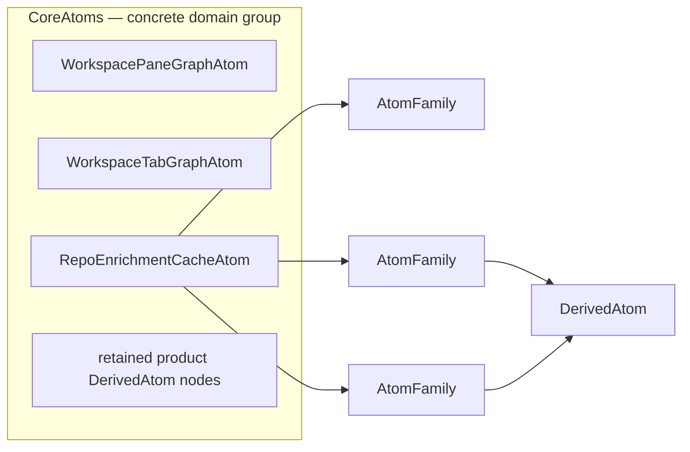
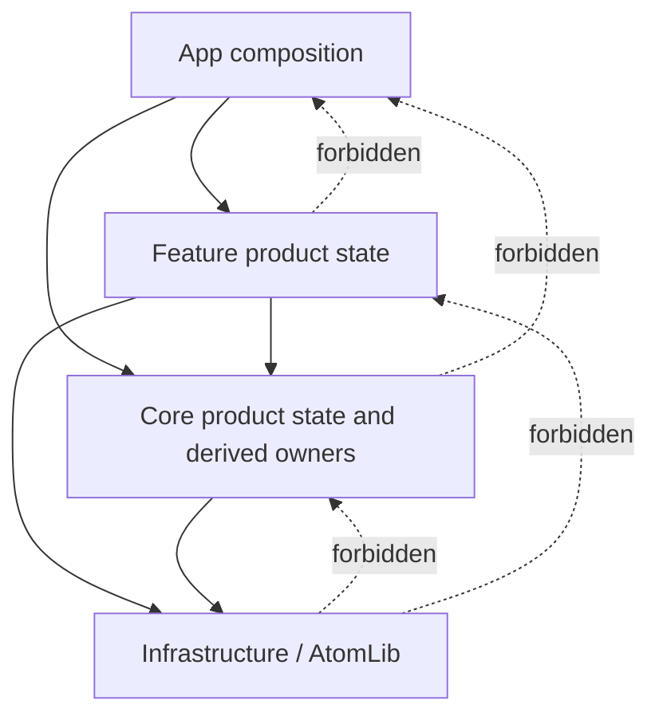
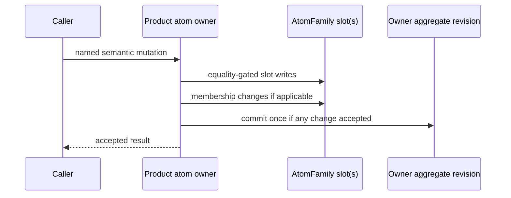
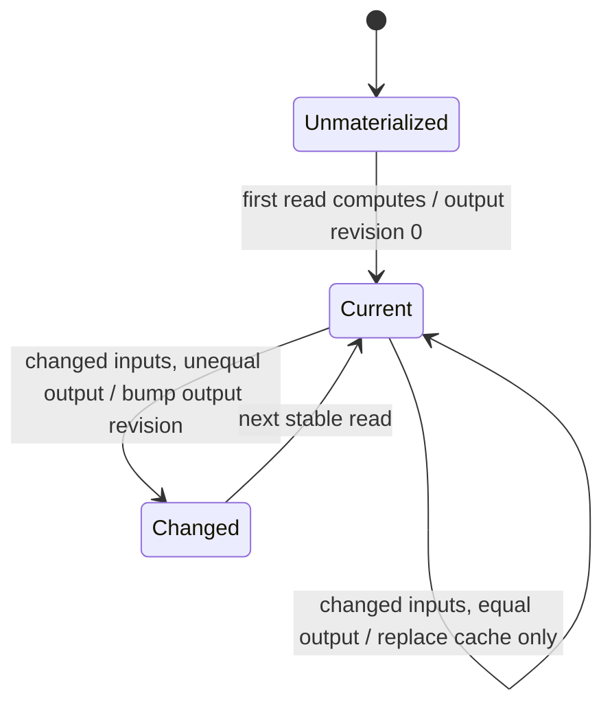
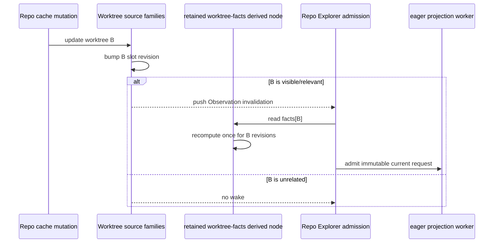

# Reactive Atoms and Derived Values — Program Design

Governing Requirements:
[Reactive State System Requirements](2026-07-31-reactive-state-system-requirements.md)

Governing Specification:
[Reactive State System Specification](2026-07-31-reactive-state-system-specification.md)

## Implementation Boundary

This document governs PR 1 only:

```text
AtomFamily + lazy DerivedAtom
  └── Repo Explorer keyed worktree-facts admission
```

In scope are the hard primitive renames, stable/tombstoned keyed slots,
revision-keyed lazy caching, the retained worktree-facts derived nodes, removal
of nil-slot pruning while preserving stale-value cleanup, Repo Explorer's keyed
request admission, and the smallest static/semantic/runtime/performance proof
required by this slice.

This PR does not implement `EagerDerivedAtom`, Tab Bar materialization,
persistence changes, other source-family migrations, Repo Explorer or Inbox
worker migrations, a generic `DerivedAtomFamily`, Command Bar work, target
splitting, or a new reactive, benchmark, telemetry, debug, lint, or test
framework.

Later sections retain family-wide design context. For this goal, descriptions
of pane, tab, topology, session, terminal-activity, Inbox, or Command Bar
surfaces are non-governing and create no implementation task or proof
obligation. This PR 1 boundary controls if later context is broader.

## 1. Decision Summary

AgentStudio keeps Swift Observation and its bottom-up product atom graph.
The target model has three independent relationships:

1. `AtomGroup` describes domain ownership and organization. It is vocabulary,
   not a generic runtime type.
2. `AtomFamily<Key, Value>` is the reusable source primitive for the same
   independently observable value shape repeated by key.
3. `DerivedAtom<Value>` is a stored, stable, lazy computation node over
   declared source revisions.

The current `AtomEntityMap` becomes `AtomFamily` through a hard rename. The
current `DerivedValue` becomes the basis of `DerivedAtom`, but product owners
must retain derived nodes instead of reconstructing them through computed
properties.

Keyed state is not automatically a family. A family is selected only when one
key changes independently and a consumer has a legitimate key-scoped read.
Cross-entity invariants remain under one coherent domain owner, which may
combine keyed member slots with an aggregate membership or topology revision.



## 2. Structural Crux

The crux is not whether AgentStudio should have smaller state. It is where an
observation boundary belongs:

- at one independently changing key;
- at one coherent aggregate whose invariants cross keys; or
- at one derived computation whose output has its own stable cache identity.

Treating every collection as one observable value causes unrelated consumers
to wake. Treating every property as an atom makes coherent mutations and
persistence harder to reason about. The selected structure uses entity-sized
family members for independently hot facts while preserving aggregate owners
for membership, ordering, and cross-entity invariants.

### 2.1 Alternatives considered

| Alternative | Benefit | Cost and failure mode | Disposition |
|---|---|---|---|
| Keep collection-backed atoms and uncached readers | No migration | Broad invalidation and repeated reconstruction remain implicit | Rejected for selected hot surfaces |
| Make every property an independent atom | Maximum theoretical precision | Explodes mutation, lifecycle, and invariant coordination | Rejected |
| Replace Swift Observation with a new graph runtime | One framework could own all semantics | Large migration, new runtime authority, target risk | Rejected |
| Use entity-sized source families plus retained derived nodes | Precise keyed reads with coherent owners and explicit computation | Owners must expose semantic revisions and retain tombstoned keyed identities for the owner's lifetime | Selected |

The choice should be revisited only if measurement shows an entity-sized slot is
still too broad for a specific independently hot fact. That evidence would
justify a second family for that fact, not a universal property-atom rule.

## 3. Current-System Model

### 3.1 Current source family

`AtomEntityMap<Key, Value>` already owns:

- one private observable slot per key;
- missing-key observation;
- equality-gated writes;
- a separate membership revision;
- cold snapshot reads;
- slot removal and pruning.

Its defining behavior is therefore an atom family, not a dictionary snapshot.
The three production instances are repo enrichment, worktree enrichment, and
pull-request counts in `RepoEnrichmentCacheAtom`.

### 3.2 Current derived readers

`CoreAtoms` exposes ten product `*Derived` types plus one
`WorkspaceFocusedPaneResolver`: eleven read-model accessors in total. Most are
computed properties, so reconstructing the lightweight reader does not retain a
cache identity. That does not mean all eleven should become cached nodes.

| Current reader | Target mode in this design | Reason |
|---|---|---|
| `PaneDisplayDerived`, `TabDisplayDerived`, `ArrangementDerived` | Stateless on-demand product policy; selected reusable policy functions also become pure inputs to the separate Tab Bar projector | They project one selected pane/tab/arrangement context. The off-main slice moves fleet work without creating lazy caches for every caller. |
| `WorkspaceFocusedPaneResolver`, `CommandContextDerived`, `WorkspaceArrangementViewDerived` | Intentionally uncached on-demand resolver | They answer current focus/command/view questions from caller-supplied or active-workspace state. A retained cache adds identity and invalidation cost without a proven hot reusable output. |
| `AttendedPaneDerived` | Retained ordinary read model, not a `DerivedAtom` | `CoreAtoms` already retains it as one lazy property; its O(1) current-attention read needs stable wiring but no output cache or revision. |
| `WorkspacePaneDerived`, `WorkspaceTabLayoutDerived`, `WorkspaceLookupDerived` | Deferred aggregate-reader debt | They reconstruct pane/tab collections or indexes. Current uncached behavior is preserved until the separately scoped pane/tab family migrations can declare keyed and coherent aggregate revisions; they are not treated as compliant hot snapshot APIs. |
| `DynamicViewDerived` | Pure explicit-input batch projector | It has no ambient state read and already receives complete snapshots explicitly. Its callers, not a retained lazy node, own when that cold or off-main projection runs. |

The first retained cached production adoption remains the worktree-facts
`DerivedAtom` family selected below. New or changed reusable readers still pass
RS-07 classification; this table is an inventory, not a permanent exemption
from measured evidence.

`DerivedValue` already demonstrates revision-keyed lazy caching, but it has no
production construction and is not currently a usable Core-facing package
contract.

### 3.3 Current hot boundary

Repo Explorer builds an eager projection request from a cold
`worktreeFactsSnapshot()`. The snapshot carries the right values but registers
no per-key or aggregate observation. This is the narrowest current call path
that needs both family and derived semantics:

```text
RepoExplorer observed request construction
  -> RepoCacheAtom.worktreeFactsSnapshot()
  -> AtomEntityMap.snapshot()
  -> no observation registration
  -> off-main projection may retain old worktree facts until another input wakes it
```

The target replaces this with explicit relevant-key reads; unrelated keys do
not re-admit the projection.

### 3.4 Current-to-target call-path delta

| Status | Entrypoint-to-effect edge | State/result behavior | Evidence or obligation |
|---|---|---|---|
| Intentionally unchanged | Repo Explorer observed request admission -> existing projection worker -> result/error admission | The Feature retains its current replaceable worker lifecycle and visible projection contract. | Current `RepoExplorerView` worker path; RS-28 |
| Removed | `projectionRequest` -> `worktreeFactsSnapshot()` -> whole-map snapshot filtering | A cold snapshot no longer masquerades as the observed source for a hot request. | Current `RepoExplorerView.swift`; RS-04–RS-06 |
| Intentionally unchanged | Boot `pruneStaleCache` -> `removeRepo` / `removeWorktree` -> explicit repo-cache persistence flush | Stale enrichment values for topology entities that no longer exist are still removed and durably flushed. | Current `AppDelegate+WorkspaceBoot.swift`; U3, RS-28 |
| Removed | Boot `pruneStaleCache` -> product `pruneNilSlots` -> generic family-slot deletion | Boot cleanup no longer detaches missing-key observation identities; tombstoned slots remain until family release. | Current `AppDelegate+WorkspaceBoot.swift`, `RepoCacheAtom.swift`, and `AtomEntityMap.swift`; RS-05, RS-08 |
| Added | Relevant worktree ID -> retained worktree-facts `DerivedAtom` -> keyed family slots | Missing, changed, and removed relevant keys invalidate only their consumers; downstream-only reads materialize upstream state first. | Current `RepoCacheAtom.swift` and `AtomEntityMap.swift`; RS-05, RS-08 |
| Changed | Any later broad wake -> request refresh becomes relevant-key or membership invalidation -> request refresh | Unrelated enrichment changes no longer admit a new projection; current worker result/error handling is preserved. | C1, C2, V2, V3 |

## 4. Target Components and Ownership

| Component | Kind | Owns | Does not own |
|---|---|---|---|
| Concrete product group such as `CoreAtoms` | Organizational concept embodied by a product type | Named atom and derived-node composition | Observation, cache, or task semantics |
| Product source atom | Concrete product type | One canonical mutable value or coherent aggregate and its named mutations | Cross-feature registry lookup |
| `AtomFamily<Key, Value>` | Generic Infrastructure primitive | Stable keyed source slots, per-key revision, membership revision, equality gating, tombstoning | Product meaning, ordering policy, persistence |
| Product aggregate owner | Concrete Core or Feature type | Membership, ordering, indexes, and cross-key invariants | Per-property atom explosion |
| `DerivedAtom<Value>` | Generic Infrastructure primitive | Stable lazy cache, declared revision tuple, output revision, output equality | Source mutation, off-main work, retries |
| Product derived family | Product-owned keyed collection of retained `DerivedAtom` nodes | Key-specific computation identity and lifecycle | Canonical source values |

`AtomGroup` has no protocol, base class, marker conformance, or generic
container. `CoreAtoms` is a concrete group because it organizes heterogeneous
state; no runtime behavior follows from that label.

A product derived family initially remains an owner-held keyed collection of
`DerivedAtom` nodes. A generic `DerivedAtomFamily` is extracted only if a
second product use demonstrates the same creation, retained-identity, and
missing-key lifecycle. This avoids adding an abstraction merely to complete a
naming grid.

## 5. Dependency Direction



Infrastructure may define generic family, revision, mutation, and lazy-derived
mechanics. It may not name `CoreAtoms`, `CoreAtomScope`, `AtomRegistry`, product
atoms, product keys, or product persistence.

Product derived nodes live with the product owner whose state they describe.
Feature-owned state remains explicitly injected; this design adds no ambient
Feature registry or resolver.

## 6. `AtomFamily` Behavioral Contract

### 6.1 Identity and observation

For a given live family and key, the first read or write creates one stable
slot that the family retains for the rest of its own lifetime. The slot owns:

- optional current value;
- semantic value revision;
- removal invalidation state.

`value(for:)` observes only that slot. A read of a missing key creates an empty
slot so later insertion wakes the reader. Changing key B does not wake a
key-A-only reader.

Removal tombstones the existing slot; reinsertion reuses that same identity.
Per-key revisions therefore advance monotonically on one retained slot during
the family lifetime. The family may allocate revision numbers from a
family-local monotonic sequence, but consumers observe only the selected slot's
revision. This lets key A receive a new revision after remove/reinsert without
making a key-B change invalidate A.

Physical slot cleanup occurs only when the owning family is released after
product observation has ended. The primitive does not count observers, defer
pruning, or schedule callbacks to decide whether a slot is safe to detach.

Removing a key that is already absent is a semantic no-op. It retains the
existing missing/tombstoned slot identity and changes no value, membership,
per-key revision, aggregate revision, or observation callback. A later insert
uses that same slot and produces the one required wake.

The family separately exposes:

- membership revision for insertion and removal;
- per-key semantic revision for declared derivation inputs;
- explicitly cold snapshot reads for persistence, serialization, diagnostics,
  and eager capture.

The product owner, not the generic family, owns any coherent aggregate
revision spanning multiple slots or families.

Cold APIs must be named and documented as unobserved snapshots. They never
pretend to provide keyed reactivity.

### 6.2 Mutation

All writes occur through a named product-owner method. The owner supplies an
`AtomMutationContext` when multiple family or scalar changes form one semantic
mutation.



An equal write changes neither the slot revision nor the owner aggregate
revision. Removal invalidates and tombstones the retained slot without
detaching it. A multi-key mutation updates every affected slot before committing
the aggregate revision.

`AtomMutationContext` batches the owner's semantic completion revision. It does
not batch Swift Observation notifications from individual stored slots, and
this design does not add registrar-level transaction machinery.

That distinction creates two supported observation contracts:

- a consumer whose semantic boundary is one slot observes that slot and may
  wake independently when it changes;
- a consumer whose invariant spans slots observes only the owner's final
  aggregate commit revision, then reads a named cold coherent snapshot after
  that commit boundary.

A cross-slot consumer must not observe the participating slots directly and
then infer atomic publication. Swift Observation's leading-edge callback is
safe for the aggregate contract because the owner changes the aggregate
revision only after every constituent slot and index has reached a valid state.
The callback re-registers against the aggregate revision and reads the
post-commit snapshot. Direct slot callbacks carry no cross-slot coherence
promise.

### 6.3 Membership and snapshots

Membership consumers observe insertion and removal, not content-only changes.
Ordered membership remains a product-owner concern because a dictionary key set
does not describe display order or topology.

Snapshots are legitimate only at named cold boundaries. An eager projection
capture that uses a snapshot must separately observe the source revision that
admits new work.

## 7. `DerivedAtom` Behavioral Contract

`DerivedAtom<Value>` is a long-lived `@MainActor` node stored by its product
owner. Construction declares:

- input revision readers;
- semantic output comparator;
- bounded synchronous computation;
- an optional telemetry identity from the existing allowlisted trace system.

Its smallest reusable package interface is:

```text
DerivedAtom<Value>
  init(
    inputRevisions: @MainActor () -> [Int],
    isContentEqual: (Value, Value) -> Bool,
    compute: @MainActor () -> Value
  )
  value: Value
  revision: Int  // materializes this node before returning output revision
```

`AtomFamily<Key, Value>` supplies `value(for:)`, `revision(for:)`, membership
revision, named mutations requiring the owner's mutation context, and
explicitly cold snapshot reads. Product owners expose only the subset their
consumers need.

The computation may read only the values represented by the declared revision
tuple. Static tooling rejects ambient `atom(...)`, `CoreAtomScope`, or hidden
same-file wrapper reads in the computation closure where syntax can establish
them. Product observation tests prove semantic dependency completeness.

Retained derived dependencies form an explicit acyclic graph. Product owners
construct those edges; the primitive does not discover dependencies or add a
runtime cycle detector. A cycle is a product composition violation covered by
the selected graph's construction and behavior tests.



The read algorithm is:

1. read the declared input revision tuple, registering Observation; a derived
   input's public revision accessor materializes that input first;
2. return the cache if the tuple matches;
3. compute once if the tuple differs;
4. replace the cache;
5. bump output revision only when a previously materialized output changes
   semantically.

The unmaterialized node and first successful materialization use output
revision zero. The backing output-revision atom is private. The public
`revision` accessor first reads `value`, then returns the backing revision. A
derived node therefore declares an upstream node through
`inputRevisions: { [upstream.revision] }`; callers cannot observe the upstream
revision without first admitting its current source tuple. The downstream
compute may then read `upstream.value` as a cache hit. If the upstream semantic
output is equal, its revision remains stable and the downstream cache may be
reused; if unequal, the revision advances and the downstream recomputes.

`value` reads its declared input revisions inside the caller's Swift
Observation tracking scope. A relevant input revision therefore wakes a direct
`value` consumer even when recomputation later proves the output semantically
equal. Equality preserves the cached output revision and prevents a second
output-revision publication; it cannot retract the source invalidation that
already woke the caller. A surface that requires equality-gated publication
with no initial input wake uses eager materialization and observes only its
materialized output.

Variable-cardinality or blocking computation is not permitted in
`DerivedAtom`. It belongs to the eager materialization design.

## 8. Surface Granularity Decisions

| Current surface | Target observation structure | Rationale |
|---|---|---|
| Repo/worktree enrichment and PR counts | `AtomFamily` immediately | Already independently keyed and equality-gated |
| Repository topology entities | Repo, worktree, and watched-path families plus ordered membership/topology aggregate | Rows change independently; ordering and topology validity remain coherent |
| Pane graph | One pane-state family member per pane plus coherent pane/drawer membership and index revision | Pane UI needs key isolation; drawer ownership and multi-pane deletion remain one invariant |
| Tab shell and tab graph | One tab member per tab plus coherent ordering and pane/arrangement ownership indexes | Tab UI needs key isolation; moves and uniqueness span tabs |
| Session runtime | Family keyed by pane | Status changes independently and can be frequent |
| Terminal activity | Feature family keyed by pane | Activity lifecycle is independently hot per terminal |
| Inbox notification log | Retain coherent bounded ordered aggregate | Coalescing, retention, ordering, and persistence are log-wide |
| Inbox badge/list presentations | Derived or eagerly materialized projections | They compute from the canonical log; they are not new canonical sources |
| Sidebar settings, cursor state, recency lists | Retain bounded scalar or coherent aggregate atoms | Their mutations and consumers intentionally use the whole value |
| App `ViewRegistry` | Remains App-owned runtime slots | View lifetime is not Core/Feature product atom state |

Pane and tab families are entity-sized. Titles, metadata, content, and
residency do not each become separate families. A measured independently hot
fact may move to its own family later; terminal activity already satisfies that
criterion.

## 9. Representative Target Flow: Repo Explorer



Repo Explorer determines relevant worktree IDs from its observed topology
membership, then reads `worktreeFacts(for:)` for exactly those IDs. It no longer
filters a complete cold facts snapshot inside an Observation registration.

The worktree-facts composition is the first product use of retained lazy
derived semantics because it has:

- two existing keyed sources;
- a clear per-key output;
- semantic `Equatable` output;
- existing key-isolation tests;
- a real consumer currently using an unobserved bulk snapshot.

`RepoEnrichmentCacheAtom` owns the complete lifecycle of the retained
worktree-facts derived family:

- `worktreeFacts(for:)` creates one internal `DerivedAtom` on first access and
  returns its value rather than exposing the node;
- a missing worktree still declares the relevant family-slot revisions and
  computes `nil`, so later hydration or insertion wakes the consumer;
- hydration uses the ordinary family mutations and revision path;
- removal invalidates and tombstones the source slot while retaining both that
  slot and the per-key derived node;
- the retained derived node recomputes to `nil`, and reinsertion reuses the same
  source-slot and derived-node identities so a synchronously re-registered
  observer remains attached;
- owner shutdown clears the internal node collection after product observation
  has stopped.

Callers never retain a derived node directly. The owner retains it across
removal and reinsertion and releases the collection only when the owner itself
shuts down after observation has ended.

## 10. Coherent Pane and Tab Mutations

Moving pane and tab members into families does not weaken graph invariants.
The owning atom still performs the complete named operation.

For example, moving a pane between tabs:

```text
WorkspaceMutationCoordinator
  -> begin one semantic mutation context
  -> update source tab family member
  -> update destination tab family member
  -> update pane-to-tab ownership index
  -> commit one tab-graph aggregate revision
  -> cross-slot observers read the coherent graph from that commit boundary
```

Key-only consumers may wake for their changed member and must not infer a
cross-slot transaction. Aggregate consumers observe only the final graph
revision and then read the cold coherent graph snapshot after the owner has
restored every invariant. No caller receives mutable family storage or
coordinates slots directly.

## 11. Failure and Lifecycle

| Condition | Owner response |
|---|---|
| Equal source write | No slot or aggregate revision change |
| Missing key read | Retain an empty observable slot for the live family lifetime |
| Key removal | Invalidate and tombstone the retained slot, update membership, and reuse that slot on reinsertion |
| Redundant removal of an absent key | Preserve the missing/tombstoned slot and every revision; publish no wake |
| Boot stale-cache cleanup | Remove stale cached values through existing product mutations and preserve the explicit persistence flush; do not delete nil family slots |
| Derived computation throws or is partial | Not supported by lazy `DerivedAtom`; the product computation must be total over accepted source state |
| Downstream reads an upstream derived revision | Public revision access materializes the upstream value first; the raw backing revision is inaccessible |
| Derived dependency cycle | Product composition violation; reject the selected graph in construction/behavior proof rather than adding runtime dependency discovery |
| Undeclared source dependency | Contract failure detected through static rules where possible and positive/negative observation tests |
| Derived node recreated on every read | Architecture violation; product composition must retain stable identity |
| Snapshot used in hot observed path | Architecture violation unless paired with an explicit observed aggregate revision and classified eager/cold boundary |

No lazy derivation starts tasks, retries, or performs I/O. Its actor and
lifecycle are the owning product graph's actor and lifetime.

## 12. Cutover Model

The cutover is hard at each migrated surface:

1. The generic source primitive is renamed without an alias.
2. A product owner introduces the target family or retained derived node.
3. Every hot consumer of that surface moves to the declared keyed, aggregate,
   or cold API.
4. Old broad or unobserved accessors are removed when their slice inventory
   reaches zero.

For the repo-cache slice, the hard cut also removes the generic
`pruneNilSlots` API, its product wrapper, and the boot call to that wrapper.
Boot still removes stale cached repo/worktree values through `removeRepo` and
`removeWorktree`, and still explicitly flushes those accepted value changes.
This separates compatibility-critical cache cleanup from the obsolete physical
slot-deletion mechanism.

There is no runtime dual authority. During a slice, a compatibility snapshot
may remain as a cold read over the new canonical family for persistence or
serialization, but it is never a second store and never a hot observation API.

## 13. First Migration Slices

### 13.1 Primitive and Repo Explorer slice

The first reactive slice is:

- hard-rename the three existing repo-cache families;
- establish slot revisions and the retained lazy-derived contract;
- retain worktree-facts derived nodes by worktree ID;
- remove generic and product nil-slot pruning while preserving boot stale-value
  cleanup and its persistence flush;
- make Repo Explorer request admission read only relevant keyed facts;
- preserve the cold full snapshots for persistence and explicitly classified
  bulk capture.

Its controlled product workload uses a large open-source directory as the
watched-folder input and exercises:

- initial repo projection;
- search/filter changes;
- one visible worktree enrichment change;
- one unrelated worktree enrichment change;
- removal and reinsertion of a previously missing relevant key.

### 13.2 Deferred source-family slices

Pane, tab, session-runtime, terminal-activity, and topology-family migrations
remain separate slices because each changes a product owner and its mutation
inventory. Their target boundary is settled here, but they are not bundled into
the primitive/Repo Explorer cutover.

Command Bar is not a first migration slice. Its demand cache is a real
mitigation, and current source does not prove enough runtime severity to justify
changing its ownership or execution model before a controlled workload does.

## 14. Cross-Cutting Realization

| Obligation | Structural realization | Degradation/failure behavior |
|---|---|---|
| Performance | Per-key source slots; cached derived outputs; cold snapshots excluded from hot reads | Equal and unrelated changes are no-ops |
| Reliability | Singular product owners and coherent aggregate commit boundaries | Cross-slot consumers cannot treat independent slot wakes as a coherent graph |
| Target readiness | Generic primitives remain in Infrastructure; product nodes stay in Core/Feature | Static target edges reject reverse dependencies |
| Privacy | Telemetry records operation kind, counts, and duration only | Raw keys, paths, UUIDs, or values are never exported |
| Operability | Existing trace tags select atom/derived metrics | Export failure is fail-open and non-authoritative |
| Compatibility | Canonical persisted representations remain unchanged in this design | Existing data loads through current migration lineages |

## 15. Proof Architecture

| Requirement set | Structural seam | Required proof class |
|---|---|---|
| RS-01–RS-03 | Product owner mutation and aggregate commit | Access-control/static enforcement plus coherent Observation tests |
| RS-04–RS-06 | Family slot, membership revision, cold snapshot boundary | Unit and product observation tests for relevant, unrelated, missing, removal, membership, and snapshot cases |
| RS-07–RS-10 | Retained `DerivedAtom` value and materializing output revision | Cache-hit, one-recompute, equality, downstream-only chained reads, and push-invalidation tests |
| RS-21–RS-23 | Infrastructure/Core boundary and architecture rules | Architecture-lint fixtures and executable compile-negative harness where compiler rejection is claimed |
| RS-24–RS-26 | Existing atom/derived telemetry and watched-folder workload | Provenance-matched distributions, continuity oracle, and frozen interaction budgets |
| RS-27–RS-28 | Slice inventory and isolated debug app | Unit/integration/runtime pyramid plus behavior-preserving interaction proof |

The primitive harness must prove key isolation and nil-then-insert wakeup using
real Swift Observation. It must also synchronously re-register from a removal
callback, then insert the same key and observe a second wake on the retained
slot. The product harness must include an unrelated-key control; call-count
reduction without that control is insufficient.

The same harness observes a missing key, redundantly removes it, and proves no
callback or revision change before insertion produces exactly one wake on the
retained slot.

The repo-cache boot harness must prove both sides of the cut: stale cached
repo/worktree values are still removed and explicitly flushed, while missing-key
family slots are not physically deleted. Existing tests whose asserted contract
is slot-count reduction are replaced by retained-identity tests; they are not
kept as compatibility requirements.

The coherent-mutation harness observes only a representative owner's aggregate
commit revision, synchronously re-registers, and reads the named cold graph
snapshot on every callback. It must see only the complete before or after
invariant. A separate direct-slot test proves that slot consumers retain
independent wake behavior without promising cross-slot atomicity.

The existing `AgentStudioArchitectureLint` slice inventory is extended for the
hard-cut rename and retained-node rules. The proof does not introduce a second
inventory framework.

## 16. Source Inventory

| Source | Identity | Authority and applicability |
|---|---|---|
| Governing Requirements | [Reactive State System Requirements](2026-07-31-reactive-state-system-requirements.md) | Normative Why and authorized boundary |
| Governing Specification | [Reactive State System Specification](2026-07-31-reactive-state-system-specification.md) | Normative observable source, derivation, proof, and scope obligations |
| Current repository | Git `f7a01132f9ac5d02981e00856750936f80acb61f` (`origin/main`) | Current implementation and test evidence baseline |
| [`Infrastructure/AtomLib/AtomEntityMap.swift`](../../../Sources/AgentStudio/Infrastructure/AtomLib/AtomEntityMap.swift) | Current source at repository identity above | Current keyed-slot semantics |
| [`Infrastructure/AtomLib/DerivedValue.swift`](../../../Sources/AgentStudio/Infrastructure/AtomLib/DerivedValue.swift) | Current source at repository identity above | Current unused lazy-cache semantics |
| [`Core/State/MainActor/Atoms/RepoCacheAtom.swift`](../../../Sources/AgentStudio/Core/State/MainActor/Atoms/RepoCacheAtom.swift) | Current source at repository identity above | Existing product family owner and worktree-facts composition |
| [`Core/State/MainActor/Atoms/CoreAtoms.swift`](../../../Sources/AgentStudio/Core/State/MainActor/Atoms/CoreAtoms.swift) | Current source at repository identity above | Current concrete atom group and reconstructed derived readers |
| [`Features/RepoExplorer/RepoExplorerView.swift`](../../../Sources/AgentStudio/Features/RepoExplorer/RepoExplorerView.swift) | Current source at repository identity above | Current cold-snapshot admission path |
| [`App/Boot/AppDelegate+WorkspaceBoot.swift`](../../../Sources/AgentStudio/App/Boot/AppDelegate+WorkspaceBoot.swift) | Current source at repository identity above | Boot stale-value cleanup, obsolete nil-slot pruning edge, and explicit persistence flush |
| AtomLib and repo-cache observation tests | Current tests at repository identity above | Existing semantic proof floor |
| Swift Observation and Swift 6.2 compiler | Xcode 26.3 / Swift 6.2.4 applicability established by governing research | Platform observation and isolation boundary |

Scoped completeness covers the generic primitives, all current product
constructions, all eleven current Core read-model accessors, representative hot consumers,
architecture rules, semantic tests, and existing workload telemetry. Numeric
runtime severity remains deliberately unclaimed until the frozen workload runs.

## 17. Accepted Debt and Revisit Signals

- Whole-graph pane and tab snapshots remain available for persistence and cold
  bulk work. They are debt only if a hot consumer continues to use them.
- A generic `DerivedAtomFamily` is deferred until repeated product lifecycle
  code proves the abstraction.
- Tombstoned source slots and per-key derived nodes accumulate until their
  owning family or product owner shuts down. Revisit this only if controlled
  measurement shows family-lifetime key churn makes the retained memory
  material.
- Some bounded `*Derived` readers remain ordinary uncached readers. They
  migrate only when reuse, cost, or consumer-boundary semantics require a
  first-class node.
- Property-level families are deferred unless measurement isolates one fact as
  independently hot within an entity-sized member.

## 18. Negative Space

This design does not:

- create an `AtomGroup` type;
- introduce a resolver, service locator, or ambient Feature registry;
- replace Swift Observation;
- move every property into its own atom;
- convert every collection into a family;
- make lazy derivations asynchronous;
- add observer counting, deferred slot pruning, or callback scheduling;
- persist derived caches;
- split SwiftPM targets;
- claim a performance improvement before controlled proof.
