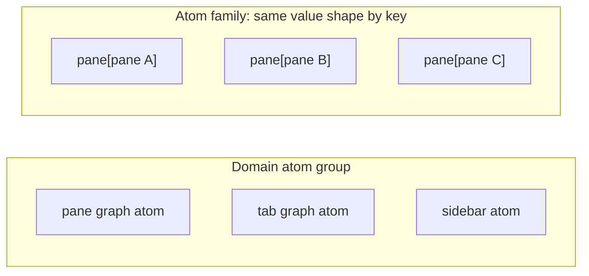
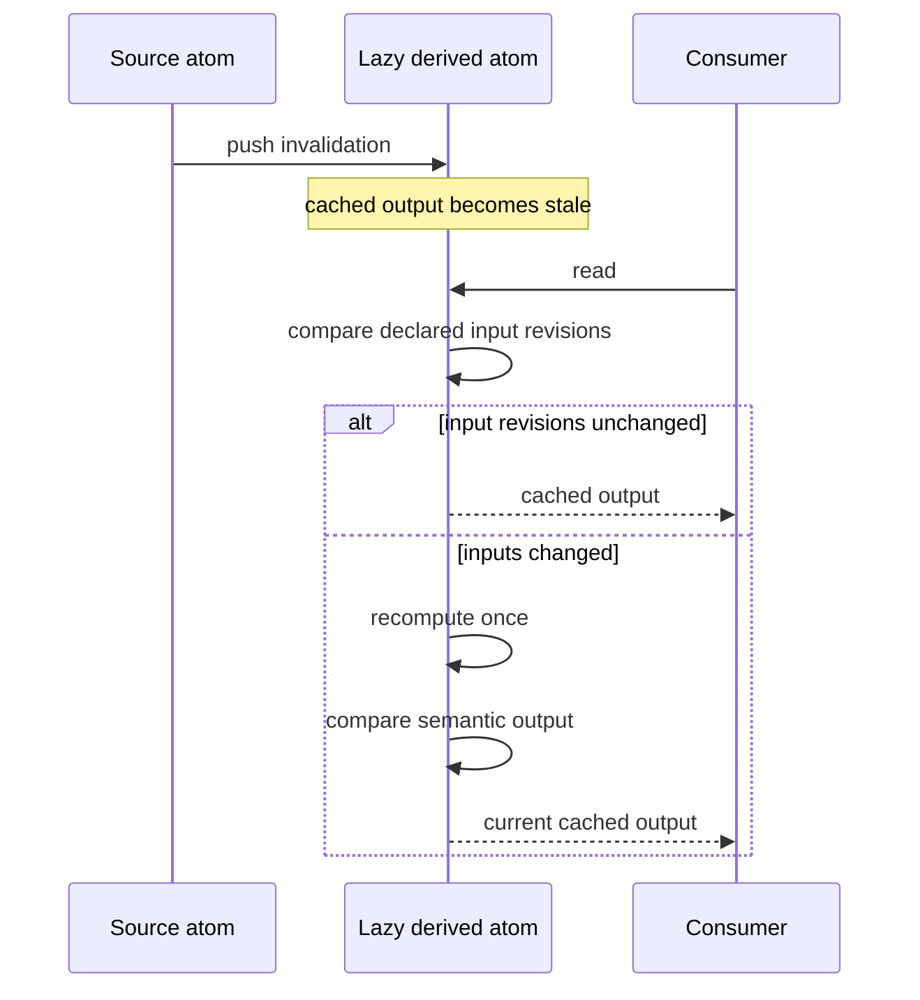
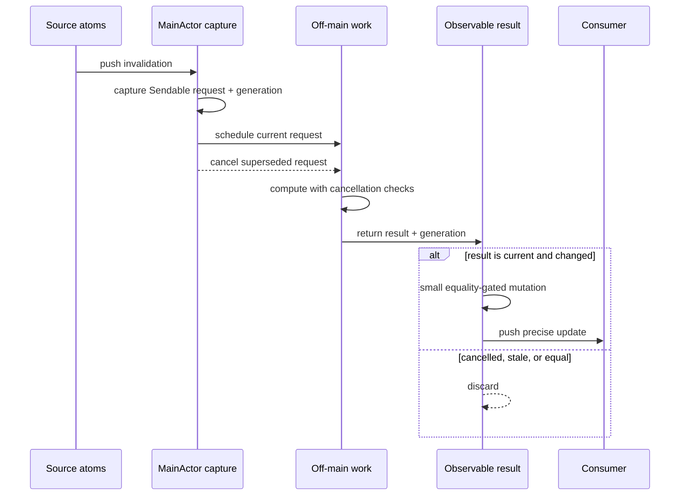

# AgentStudio Reactive State System Requirements

Status: ready for implementation planning
Artifact type: specification — authoritative Why/What
Target classification: general-domain
Source version: `50d0b0ac360af8b1fe2f62a56e35b5cd2cd8e515`

## 1. Decision Summary

AgentStudio will keep its bottom-up atom model and Swift Observation integration.
It will make the missing semantics explicit:

1. source atoms push precise invalidation;
2. keyed source state uses independently observable `AtomFamily<Key, Value>`
   slots;
3. reusable composed state declares whether it is a lazy cached derivation or
   an eager materialized derivation;
4. variable-cost computation leaves `MainActor` through compile-checked
   `Sendable` boundaries;
5. replaceable live projections publish only small, current results and treat
   semantically equal output as a publication no-op;
6. SQLite remains authority-specific persistence, not a universal state bus;
7. guardrails and proof distinguish compiler guarantees, semantic tests,
   integration tests, runtime interaction proof, and performance measurement.

This specification does not select a new reactive framework. It defines the
behavior AgentStudio's existing primitives and product state must provide.

## 2. The Problem

AgentStudio already has useful pieces:

- Swift Observation pushes source-state invalidation;
- the currently named `AtomEntityMap` provides independently observable state
  per key;
- `DerivedValue` demonstrates revision-cached lazy derivation;
- Repo Explorer and Inbox demonstrate off-main materialization with guarded
  publication;
- state owners normally expose `private(set)` state and named mutations;
- persistence is separated into Core, local UX, cache, and Feature-owned lanes.

Those pieces do not yet form one consistent developer contract.

Ten production `*Derived` readers recompute on access and none owns a cached
output revision. `DerivedValue` has no production construction and is not
currently exposed across the Infrastructure/Core target boundary. Most
collection-backed atoms observe an entire dictionary or array even when a
consumer asks for one entity. Several UI bridges rebuild rich fleets on
`MainActor`. Off-main materialization is repeated as feature-local lifecycle
code. Snapshot APIs can carry full state without registering any observation.

This creates two observable risks:

- End users can pay for work caused by state changes unrelated to what they are
  viewing or editing.
- Developers cannot consistently tell, from a state API, what wakes it, whether
  it caches, where it computes, whether stale work may publish, or how it
  persists.

Static source proves that these scaling risks exist. It does not, by itself,
prove the current exact build has a user-visible performance regression.
Runtime severity must be measured.

## 3. Consumers

### 3.1 End users

Users interacting with terminals, tabs, panes, sidebars, Command Bar, Bridge,
and Inbox must not experience unrelated state work as typing, scrolling,
animation, focus, or navigation stutter.

### 3.2 Feature developers

A developer adding state or a derived view must have one consistent vocabulary
for:

- ownership and mutation;
- singleton versus keyed-family state;
- source versus derived state;
- dependency and invalidation granularity;
- lazy versus eager computation;
- actor and cancellation behavior;
- persistence authority;
- required proof.

### 3.3 Reviewers and maintainers

A reviewer must be able to reject unsafe state composition using types,
architecture rules, focused tests, and measurable proof rather than reconstructing
hidden observation and task behavior manually.

### 3.4 Runtime and release operators

Performance comparisons must bind to the exact build, workload, instrumentation
selection, and interaction sequence so missing telemetry or mismatched binaries
cannot appear as an improvement.

## 4. Observable Outcomes

| ID | Outcome | Observable success |
|---|---|---|
| O1 | Precise reactive updates | An unrelated source property or family key does not wake a consumer of another value. |
| O2 | Predictable composed state | Every reusable non-trivial derivation declares inputs, caching mode, equality, and execution policy. |
| O3 | Responsive UI | Variable-cardinality or otherwise expensive derivation does not execute on `MainActor`; UI publication remains small. |
| O4 | Fresh results | Cancelled or superseded computation cannot publish as current state. |
| O5 | Coherent mutation | State changes occur through named owner methods and observers do not receive an invalid semantic intermediate state. |
| O6 | Explicit persistence | Each state value has a declared authority and durability class; SQLite is not used as a high-frequency UI read model. |
| O7 | Safe evolution | Existing state, persistence, and user behavior survive migration with automated, integration, runtime, and performance proof. |
| O8 | Target readiness | The contract does not introduce reverse dependency edges, an App registry dependency, or a runtime resolver. |

## 5. Canonical Vocabulary

The state model has two independent axes:

| | One value | Values repeated by key |
|---|---|---|
| Stored source | source atom | source atom family |
| Computed | derived atom | derived atom family |

Within the Core/Feature product atom graph, AgentStudio's current generic
source-family primitive is named `AtomEntityMap<Key, Value>`. Its canonical
developer-facing name will be `AtomFamily<Key, Value>` because values are not
always entities and whole-map access is not its defining behavior. App also has
runtime-owned keyed observable slots for pane views; those are not Core/Feature
atom state.

An **atom group** is different. It is a domain owner containing different,
named atoms. A family contains the same kind of independently observable state
repeated by key. A group is organizational composition; it is not automatically
an atom or a computation. A **derived atom** is computational composition over
source atoms, family members, or other derived atoms.

A **derived reader** is an ordinary computed access path. It may correctly
participate in Swift Observation while recomputing on every access.

A **derived atom** is a first-class graph node with:

- stable identity;
- declared source dependencies;
- an invalidation boundary;
- a cache or materialized output;
- semantic output equality;
- an execution policy;
- observable revision/publication semantics.

## 6. Derived Modes

AgentStudio recognizes two legitimate derived modes.

### 6.1 Lazy cached derivation

Use this mode when computation is bounded, synchronous, and safe on the owning
actor.

The source mutation pushes invalidation. The next read pulls the value.
Unchanged input revisions reuse the cache. Changed inputs recompute once.
Output-equivalent recomputation does not propagate another semantic change.

### 6.2 Eager materialized derivation

Use this mode when computation is variable-cardinality or otherwise
inappropriate for `MainActor`. Replaceable live projections require
cancellation/coalescing and freshness admission. One-shot preparation may use a
structured lifetime and one atomic admission instead.

This mode is push-driven at admission and publication. Consumers read already
materialized observable output; they do not trigger expensive computation.

## 7. Normative Requirements

### 7.1 Source state and mutation

**RS-01 — Singular canonical-atom ownership**

Every canonical mutable value owned by a Core or Feature atom MUST have one
authoritative owner. Its mutable stored properties MUST be private or
`private(set)` and MUST change through named owner methods or an explicitly
owned cross-slice coordinator.

This requirement does not turn ephemeral SwiftUI view state or AppKit
controller bookkeeping into canonical atoms.

Success: callers cannot directly assign canonical state, and mutation names
describe the semantic change.

Failure expectation: an unauthorized direct mutation fails compilation or
architecture validation.

**RS-02 — Accepted canonical changes**

A canonical atom mutation MUST publish only accepted semantic changes.
Assigning a value that is equal under the owner's declared semantic comparator
MUST NOT wake dependent consumers or advance the semantic revision.

**RS-03 — Coherent semantic mutations**

When one named atom or coordinator mutation changes multiple canonical fields
or atom owners, dependent consumers MUST observe a valid before or after
semantic state, not an invalid intermediate composition. The in-memory mutation
MUST expose one completion/revision boundary suitable for derived invalidation.
Persistence admission uses its own authority-specific revision under RS-18.

This requirement does not make unrelated owners globally transactional.

### 7.2 Dependency and invalidation precision

**RS-04 — Declared observation boundary**

Every observable state API MUST declare whether its invalidation boundary is:

- one scalar/property;
- one entity key;
- family membership;
- a coherent aggregate;
- an explicitly cold snapshot.

A keyed-looking method over a whole observed dictionary MUST NOT be documented
or tested as per-key isolation.

**RS-05 — Atom-family isolation**

For keyed source state:

- reading key A MUST register interest in key A;
- changing key B MUST NOT wake a key-A-only consumer;
- reading a missing key MUST wake if that key is later inserted;
- membership observers MUST wake on insertion/removal, not content-only change;
- removing or pruning a slot MUST invalidate any observer that could otherwise
  remain stale.

**RS-06 — Hot snapshot prohibition**

A dictionary- or array-shaped snapshot MAY be used for persistence,
serialization, diagnostics, explicitly cold bulk bridges, or measured coherent
aggregate work.

A hot observed UI path MUST NOT rely on a snapshot that registers no
invalidation. It MUST instead read relevant keys, an explicit aggregate
revision, or a first-class derived/materialized node.

### 7.3 Composed and derived state

**RS-07 — Derivation declaration**

A reusable composition that crosses a consumer boundary, performs
variable-cardinality reconstruction, or is measured as a hot path MUST declare:

- source dependencies;
- lazy cached or eager materialized mode;
- semantic output comparator;
- invalidation/publication granularity;
- execution isolation;
- cancellation and stale-result policy when asynchronous.

A trivial bounded local reader MAY remain uncached when its recomputation cost
and coherent invalidation boundary are intentional.

**RS-08 — Lazy cached semantics**

A lazy derived atom MUST:

- retain stable identity;
- use declared input revisions;
- return the cached output when revisions are unchanged;
- recompute at most once for a new revision tuple before reuse;
- advance its output revision only when semantic output changes;
- never hide an undeclared source read inside computation.

**RS-09 — Eager materialized semantics**

An eager materialized derivation MUST:

- capture an immutable `Sendable` request while reading actor-owned source
  state;
- perform variable-cost computation outside `MainActor`;
- retain task ownership for its required lifetime;
- publish only a bounded result through the owning actor;
- expose the request identity or equivalent freshness state needed to prevent
  an old result from being represented as current.

A replaceable live projection MUST additionally cooperate with cancellation or
coalescing, reject superseded results, and treat semantically equal output as a
semantic publication no-op. Task bookkeeping and telemetry MAY still record the
completed attempt without advancing the output revision or waking output-only
consumers.

Before a replaceable surface is migrated, its authority-owned slice contract
MUST choose what consumers observe while a successor is running and if the
current successor fails or is cancelled without another successor. A previous
result MAY remain available only with its original freshness identity and an
explicit non-current state; it MUST NOT appear to satisfy the newer request.
Program design supplies the mechanism but MUST NOT invent whether that surface
clears output or retains explicitly stale output.

A one-shot preparation MUST instead have a structured lifetime and one atomic
admission boundary; it does not require a latest-wins lifecycle when no newer
request can supersede it.

**RS-10 — Push-driven graph**

Source mutation MUST drive derivation invalidation or eager admission.
Consumers MUST NOT poll for source changes. A lazy cache may recompute on the
next read after pushed invalidation; an eager node computes before publication.

### 7.4 Concurrency and responsiveness

**RS-11 — Compile-checked transfer**

State captured for off-main computation MUST cross an isolation boundary through
types that satisfy Swift's concurrency checks. New code MUST NOT depend on
unchecked access to `MainActor` state from background work.

**RS-12 — MainActor work boundary**

`MainActor` work in a derived path MUST be limited to bounded source capture,
task lifecycle bookkeeping, freshness admission, and small observable
publication.

Any computation whose cost grows with repositories, worktrees, panes, tabs,
notifications, files, rows, or result count MUST be explicitly classified and
MUST execute off-main. A measured exception may justify bounded source capture
or publication, but it does not reclassify variable-cardinality reusable
computation as lazy or uncached.

**RS-13 — Freshness admission**

When a newer semantic request can supersede computation or persistence already
in flight, completion of the older operation MUST NOT:

- publish stale output as current;
- clear a newer dirty/save-needed state;
- suppress scheduling of the newer generation;
- overwrite a newer materialized result.

**RS-14 — Lifecycle completeness**

Every asynchronous derived or persistence operation MUST define:

- owner;
- start trigger;
- retained lifetime;
- cancellation trigger;
- stale-result check;
- shutdown cleanup;
- failure behavior.

An actor or `Task.detached` spelling alone does not satisfy this requirement.

### 7.5 SQLite and state authority

**RS-15 — Persistence classification**

Every persisted or persistence-adjacent state slice MUST be classified as one
of:

- authoritative durable state;
- workspace- or application-local UX memory;
- rebuildable cache/materialization;
- runtime-only state;
- derived state that is never independently persisted.

The classification MUST determine save, restore, failure, defaulting, and
retention behavior.

**RS-16 — Authority-specific persistence**

SQLite repositories MAY be written directly by their owning stores or
repositories. Not every database mutation must pass through an atom.

SQLite MUST NOT become a high-frequency UI observation source when live atoms
own the interaction state. Repository methods MUST represent explicit
transaction or sanitation boundaries rather than a second hidden product-state
authority.

**RS-17 — Logical-save consistency**

Within one persistence authority, an API that reports one logical save outcome
MUST commit all values in one transaction and one generation. The existing
combined workspace-settings save is one logical local save and MUST NOT perform
three independently committed writes behind one success/failure result.

Calls spanning genuinely independent authorities MAY commit independently, but
an aggregate caller MUST expose the outcome of each authority and MUST NOT claim
distributed atomicity. This does not authorize a distributed transaction,
completion receipt, or replay system.

**RS-18 — Save revision admission**

Completion of persistence for revision N MUST clear dirty state only if no
newer semantic revision remains unsaved. A mutation that occurs while revision
N is being prepared or written MUST remain eligible for persistence.

**RS-19 — Hydration before publication**

Persisted state MUST be decoded, validated, and prepared before live mutation.
If authoritative preparation fails, existing live state MUST remain unchanged.
A malformed, stale, or invalid non-authoritative local row MUST default or
disappear only within its owning lane; other valid local lanes remain loaded. If
the entire local database is missing, corrupt, or unavailable, all local lanes
use their deterministic defaults without changing the accepted Core result.

**RS-20 — Cross-authority operations**

Composition and global topology are both authoritative Core state. One
authoritative Core mutation spanning them MUST commit in one `core.sqlite`
transaction, and a crash MUST expose the previous or new Core generation, never
a partial Core generation.

An operation spanning genuinely independent authorities, such as Core and local
state, MUST preserve each authority's transaction contract and MUST declare the
valid restart state after a crash between commits. Independent authority does
not imply distributed atomicity.

### 7.6 Developer guardrails

**RS-21 — Paved APIs**

The ordinary developer path MUST make the correct choice easier than ad hoc
observation, caching, detached-task, or save-lifecycle code.

The canonical developer vocabulary MUST distinguish:

- source `Atom`;
- keyed source `AtomFamily<Key, Value>`;
- organizational `AtomGroup`;
- computational `DerivedAtom`, classified as lazy cached or eager materialized.

`AtomEntityMap` MUST cut over to `AtomFamily` without a compatibility alias.
`AtomGroup` is vocabulary for domain ownership, not a required generic runtime
container. Derived construction MUST make dependencies, semantic equality,
execution isolation, and relevant lifecycle policy explicit without introducing
a resolver or task runtime.

**RS-22 — Layer and target readiness**

Generic reactive primitives MUST remain product-neutral and usable across
SwiftPM targets. Product state and derivations MUST NOT introduce:

- a dependency on App composition roots from Core or Features;
- a runtime atom resolver or service locator;
- another ambient Feature registry;
- a universal Feature state aggregate;
- a reverse target edge.

**RS-23 — Enforceable boundaries**

The compiler or architecture tooling MUST reject mechanically detectable
violations, including unauthorized mutation, product types in generic
primitives, illegal target dependencies, hidden ambient reads in declared
derivations, and unclassified hot snapshot use where syntax can establish it.

Semantic dependency completeness, algorithmic cost, cancellation correctness,
and latency MUST be proven by tests and runtime evidence; they MUST NOT be
misrepresented as compiler guarantees.

Each implementation slice MUST freeze an exact inventory of its new or migrated
state APIs, derived nodes, asynchronous operations, and persistence-adjacent
slices. Proof MUST fail when a reachable item in that inventory lacks its
required observation, mode, lifecycle, or authority classification. This is
slice-local exhaustiveness; it does not require migrating the entire existing
state graph.

### 7.7 Observability and proof

**RS-24 — Derivation telemetry**

Selected derived hot paths MUST expose enough telemetry to distinguish:

- admission/invalidation count;
- cache hit and recomputation count;
- MainActor capture and publication duration;
- off-main work duration;
- cancellation and stale-discard count;
- semantic output-change count;
- relevant input/output cardinality.

Telemetry MUST remain selectable through the existing trace-tag system and MUST
not create a new per-emitter configuration surface.

Reactive-state telemetry MUST remain aggregate-safe, explicitly allowlisted,
bounded in cardinality and synchronous cost, fail-open, and separate from
product correctness. Raw keys, UUIDs, paths, prompts, payloads, errors, terminal
content, tokens, or tool output MUST NOT become exported dimensions. Exporter
absence, backpressure, or failure MUST NOT change state behavior.

**RS-25 — Proof provenance**

Before/after performance evidence MUST bind:

- source commit;
- executable/build identity;
- workload and fixture fingerprint;
- trace-tag/instrumentation selection;
- launch and activation mode;
- controlled interaction sequence;
- required event-count continuity.

Comparison admission MUST reject missing or unequal provenance fields before
evaluating performance. Missing or partial instrumentation MUST fail rather
than appear as reduced work. Required event continuity MUST be reconciled
against an independent issued-interaction or final-state oracle, not inferred
only from the same reduced telemetry being compared.

**RS-26 — Performance acceptance**

Before implementation, each migrated hot-surface slice MUST freeze:

- the affected user interactions;
- at least one direct invalidation or `MainActor` work metric;
- every affected end-to-end latency metric;
- workload and cardinality;
- required event-continuity or final-state oracles;
- a regression boundary derived from the provenance-matched baseline's
  variability or an already governing numeric budget.

The metric set and regression boundary MUST NOT change after candidate results
are observed. No affected interaction may exceed its predeclared boundary.
There is no universal quota requiring a fixed fraction of internal metrics to
improve. An improvement claim requires a provenance-matched distribution that
actually improves. Typing, scrolling, animation, focus, and navigation MUST
remain functional in the isolated debug app.

Static call-count reduction alone is not performance proof.

**RS-27 — Test pyramid**

The proof set MUST include:

- fast unit tests for equality, revisions, cache behavior, cancellation, and
  stale-result admission;
- product-level observation tests with relevant-change and unrelated-change
  controls, including a representative coherent multi-field mutation that
  re-reads the full invariant from the observer;
- integration tests for real SQLite transactions, rollback, hydration,
  corruption/defaulting, and save revision admission;
- exact slice-inventory coverage that fails on an omitted classification;
- focused smoke/runtime proof for the real debug app;
- controlled performance workloads for selected hot surfaces.

No wall-clock sleep may be used as an asynchronous correctness contract.

**RS-28 — Upgrade and compatibility**

The migration MUST preserve existing user-visible state, command behavior,
focus/navigation behavior, and supported persisted data unless a separate
explicit product decision changes them.

Supported persisted data means Core and application-local SQLite schema
generations reachable through the current registered GRDB migrations, plus
`preferences.global.json`. It excludes retired per-workspace local databases,
removed JSON/cache sidecars, and malformed non-authoritative rows that the
governing persistence hard cut explicitly defaults or discards.

A persistence representation change MUST prove current-schema operation,
upgrade, rollback/partial-failure behavior, save/reload, and real relaunch.

## 8. Observable Contracts

### 8.1 Source atom or source family

Inputs:
named owner mutation with a semantically valid value.

Outputs:
the current value, relevant observation invalidation, and semantic revision
when the accepted value changes.

Failure:
invalid mutation is rejected before publication. Equal mutation is a no-op.

### 8.2 Lazy derived atom

Inputs:
declared source revisions.

Outputs:
one cached semantic value and an output revision.

Boundary behavior:
the first read computes; unchanged revisions return the cache; changed
revisions recompute once; equal output does not propagate a semantic change.
The unmaterialized and first successfully materialized value use output revision
zero; only a later unequal output advances the revision. A chained derivation
reads the upstream value before reading its revision.

Failure:
an undeclared dependency is a contract violation. Computation cannot publish a
partially formed output.

### 8.3 Eager materialized derivation

Inputs:
one immutable request. Replaceable live projections also carry a freshness
identity.

Outputs:
one successfully admitted semantic result. For replaceable live projections,
only the newest current result may publish. A semantically equal result does not
advance the output revision or wake output-only consumers.

Cancellation/partial behavior:
replaceable work is cancelled or coalesced when possible, and superseded output
is always rejected at publication. One-shot preparation has a structured
lifetime and one atomic admission. A replaceable surface declares, before
implementation, whether current-request failure clears output or retains a
previous result as explicitly stale. A previous result is never relabeled as
current for the failed or cancelled request.

### 8.4 Persistence owner

Inputs:
one classified semantic snapshot and its revision.

Outputs:
one-authority atomic commit; failure while remaining dirty; or explicit
per-authority outcomes for an operation that genuinely spans independent
authorities.

Compatibility:
supported databases are the registered GRDB migration lineages named by RS-28
and restore according to their authority class.
Runtime-only and derived state is not accidentally promoted to durable
authority.

## 9. Negative Space

This work does not require:

- adopting Jotai or another external reactive runtime;
- replacing Swift Observation;
- building a generic dependency-injection or service-locator system;
- making every property its own atom;
- converting every collection into an atom family;
- making every derived reader cached;
- routing every SQLite write through atoms;
- making all persistence lanes globally transactional;
- splitting Core or Features into SwiftPM targets in this change;
- fixing every current MainActor or detached-task path;
- claiming a performance improvement without a provenance-matched workload.

The first implementation slices must be selected from measured or
correctness-proven paths rather than migrating the entire state graph at once.

## 10. Requirement-to-Proof Map

| Proof ID | Requirements | Required evidence class |
|---|---|---|
| V1 | RS-01–RS-03 | Compiler/architecture enforcement, automated mutation/revision behavior, and real Observation proof of one valid composite before/after state |
| V2 | RS-04–RS-06 | Slice-inventory coverage plus automated observation tests with relevant key, unrelated key, missing-key insertion, membership, and snapshot cases |
| V3 | RS-07–RS-10 | Slice-inventory coverage, automated cache/derivation behavior, and product-level composed observation |
| V4 | RS-11–RS-14 | Executable checked-transfer proof, structural proof that variable-cost work is behind the off-main boundary, bounded capture/publication evidence, and cancellation/freshness/lifecycle tests |
| V5 | RS-15–RS-20 | Slice-inventory coverage plus real SQLite integration, failure injection, restore, rollback, and relaunch state inspection |
| V6 | RS-21–RS-23 | Architecture-lint fixtures plus executable compile-negative proof where compiler rejection is claimed |
| V7 | RS-24–RS-26 | Safe-projection and exporter-failure evidence, strict provenance/completeness admission, independent continuity oracle, and controlled before/after performance measurement |
| V8 | RS-27–RS-28 | Full proof pyramid plus isolated debug interaction and upgrade/relaunch evidence |

## 11. Source and Decision Basis

| Source | Identity | Class | Applicability |
|---|---|---|---|
| Current repository | Git commit `50d0b0ac360af8b1fe2f62a56e35b5cd2cd8e515` | observational/normative for current behavior and repo constraints | Exact source baseline for this specification |
| `atom_persistence_boundaries.md` | SHA-256 `5075a93928f6492fda6954f33755e15a0b5e00ab65f0952947cbc15b9a81020d` | normative for state-role boundaries; superseded by the persistence hard cut where they conflict | Existing source/family/derived and state-role vocabulary |
| Performance boundaries spec | SHA-256 `e5cb90a3c4b9df05ce1e59ba9b9f5fc4a20d2c660a440b84f974b6dfcc907046` | normative | Existing performance evidence discipline |
| Persistence ownership hard cut | SHA-256 `41d430167881afc7b7217397de6323244fc54907ef832613548e411e3eec75c7` | normative for R3–R7, startup/save behavior, and compatibility exclusions; historical file locations are observational only | Persistence authority, transaction, failure, validation, and migration constraints |
| Core atom scope/Feature injection spec | SHA-256 `e21aad7aa609d99bcb5cb3a4625fc5b80cbc4c77215aef38d1af675704406410` | normative | Ambient Core scope and explicit Feature-state boundary |
| Reactive-state research ledger | SHA-256 `b6613ec2e0dbea5d1c04a04455587a8eeed47e129669c7278b152f8fcd6a9935` | observational | Exact-HEAD taxonomy, concurrency, SQLite, guardrail, proof, and countercheck evidence |
| Swift Evolution SE-0461/0466/0430 | Current accepted proposal text as of 2026-07-31 | normative platform contract | Swift 6.2 isolation and transfer feasibility |
| Accepted reactive-state requirements | Current accepted product/developer intent | normative | Push-driven atoms, cached composed derivation, compile-safe off-main DX, sensible SQLite boundaries, sufficient tests, and upgrade safety |
| Accepted developer vocabulary | Current accepted terminology | normative | Rename the family primitive to `AtomFamily`; keep atom groups organizational and derived atoms computational |
| Accepted performance scope | Current accepted scope constraint | normative | Minimal performance comparison and guardrails; no extra performance subsystem |

Scoped completeness:

The inventory covers the current generic primitives, Core/Feature atom owners,
all production Observation bridges, representative hot UI consumers, current
SQLite owners and transaction groups, relevant architecture enforcement,
semantic/integration tests, and local workload/proof scripts. Live runtime
performance was intentionally not treated as established evidence because no
fresh exact-HEAD workload has yet run.

## 12. Program Design Closure

The sibling program designs settle the structural questions needed for
implementation planning:

1. keyed families are adopted first for repo/worktree enrichment; pane, tab,
   topology, session-runtime, and terminal-activity migrations remain separate
   measured slices;
2. retained `DerivedAtom<Value>` supplies the bounded lazy-cache contract;
3. `EagerDerivedAtom<Request, RequestIdentity, Value>` supplies only the
   latest-wins CPU-materialization lifecycle, with Tab Bar as its first slice;
4. workspace settings use one local transaction, while `WorkspaceStore` uses
   separate composition, topology, and local-continuation dirty lanes under one
   serialized drain;
5. the first implementation slices and their existing proof systems are named
   in this folder's README and owning program designs.

Planning proceeds one slice at a time. This design family does not authorize a
whole-state-system migration.
