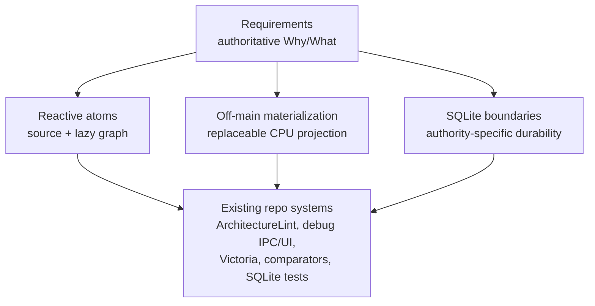

# Reactive State System

This folder is one design family. Start with the requirements, then open only
the program design that owns the implementation question.

## Entry Point

[Reactive State System Requirements](2026-07-31-reactive-state-system-requirements.md)
is the authoritative Why/What: user and developer outcomes, canonical
vocabulary, constraints, requirements RS-01–RS-28, and proof obligations.

## Program Designs

| Design | Primary ownership | Read when deciding |
|---|---|---|
| [Reactive Atoms and Derived Values](2026-07-31-reactive-atoms-and-derived-values-program-design.md) | RS-01–RS-08, RS-10, and atom-specific RS-21–RS-23 realization | Source ownership, `AtomFamily`, lazy `DerivedAtom`, keyed observation, coherent aggregate reads, or Repo Explorer's first reactive slice |
| [Off-Main Materialization and Lifecycle](2026-07-31-off-main-materialization-and-lifecycle-program-design.md) | RS-09–RS-14 and eager/performance RS-24–RS-28 realization | `EagerDerivedAtom`, checked transfer, latest-wins lifecycle, Tab Bar projection, native interaction proof, or performance continuity |
| [SQLite Authority and Update Boundaries](2026-07-31-sqlite-authority-and-update-boundaries-program-design.md) | RS-15–RS-20 and persistence-specific RS-24–RS-28 realization | Core/local authority, dirty lanes, settings transactions, restore freshness, rollback/crash proof, or upgrade/relaunch behavior |

RS-21–RS-28 are cross-cutting. Each design owns only the guardrail,
observability, and proof realization for its slice; none introduces a parallel
lint, telemetry, benchmark, debug-launch, or SQLite test framework.

## System Map

## First Slices and Dependencies

The first slices are intentionally separable:

1. `AtomFamily` hard rename plus retained worktree-facts `DerivedAtom` and Repo
   Explorer keyed admission. It does not depend on eager materialization or
   persistence changes.
2. Tab Bar `EagerDerivedAtom` and one `TabBarProjection` authority. It depends
   on the generic eager primitive and current Core/Feature source contracts,
   not on the SQLite design or deferred pane/tab family migrations.
3. Combined workspace-settings transaction. It is persistence-only and does
   not depend on either reactive runtime slice.
4. `WorkspaceStore` lane-aware Core/local drain. It follows the settings slice
   operationally but is a separate ownership cut with separate proof.

Deferred pane, tab, topology, session, terminal-activity, Repo Explorer-worker,
Inbox-worker, and Command Bar migrations require their own measured or
correctness-proven slices. This family does not authorize a whole-state-system
rewrite.

## Shared Proof Boundaries

| Concern | Existing proof system to extend |
|---|---|
| Source/derived declaration and target direction | Existing `Tools/AgentStudioArchitectureLint`; add the required executable compile-negative driver because the current excluded fixtures alone are not proof |
| Semantic observation | Swift Testing suites using real Swift Observation |
| Native behavior | Worktree-isolated LaunchServices debug app, authenticated debug IPC, and native UI inspection |
| Performance | Existing Victoria workload summaries and provenance-enforcing comparator |
| SQLite rollback/crash/restore | Current file-backed GRDB suites and disposable subprocess/probe pattern |
| Telemetry safety | Existing OTLP allowlist and fail-open suites |

Program designs define seams and obligations. A later implementation plan owns
exact tasks, commands, ordering, and evidence locations.
