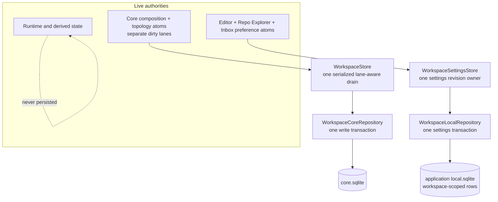
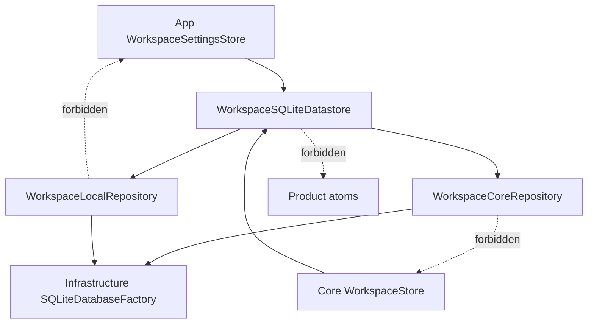
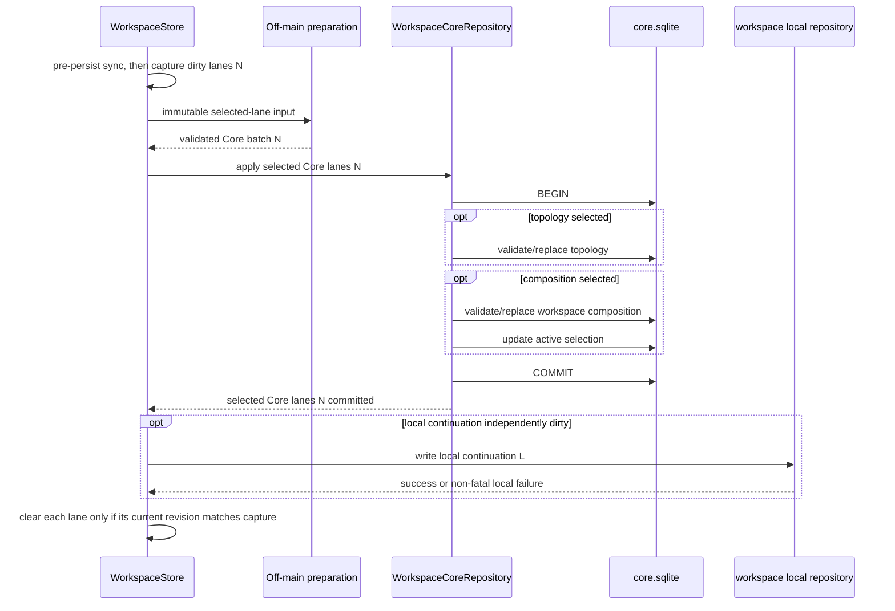
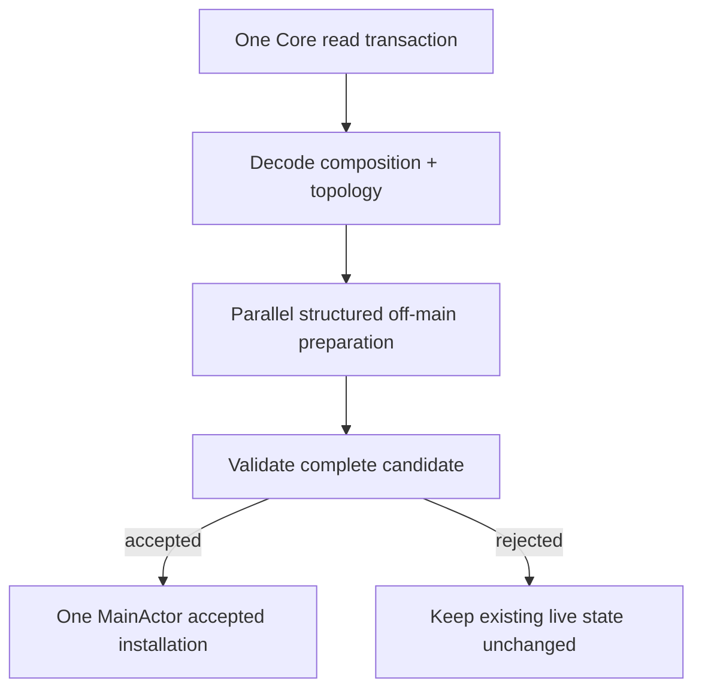

# SQLite Authority and Update Boundaries — Program Design

Governing Requirements:
[Reactive State System Requirements](../2026-07-31-reactive-state-system-requirements.md)

Governing Specification:
[Reactive State System Specification](../2026-07-31-reactive-state-system-specification.md)

## Follow-Up Boundary

This document is retained for a separately authorized persistence follow-up. It
is not a governing input, dependency, task source, or proof obligation for the
two active atom pull requests in the parent [Program Design](../README.md).

## 1. Decision Summary

SQLite remains a set of authority-specific repository boundaries. It does not
become an atom bus, and not every database mutation routes through an atom.

The target makes two consistency corrections:

1. `WorkspaceStore` owns one serialized Core drain with separate
   `.composition` and `.topology` dirty lanes. A composition-only save never
   carries or replaces application-global topology, and a topology-only save
   never rewrites workspace composition. One semantic mutation that genuinely
   changes both lanes captures both and commits them in one `core.sqlite`
   transaction. `WorkspaceStore` already owns both live atom references and
   absorbs topology autosave responsibility; no new persistence store or
   coordinator layer is added.
2. Editor, Repo Explorer, and Inbox preferences are one logical workspace
   settings save. `WorkspaceLocalRepository` writes all three inside one
   local-database transaction and reads them from one consistent read
   snapshot, while preserving lane-local decode/default behavior.

Every asynchronous persistence lane tracks the semantic revision captured by a
save. Completion clears only the captured lane whose current revision still
matches. Workspace-local continuation has its own revision and drain lane; a
local-only mutation never forces a Core write.



## 2. Structural Crux

The crux is transaction scope, not whether SQLite access is centralized.

One logical success/failure result must correspond to one authority and one
atomic commit. A transaction touches only the dirty lanes captured for that
commit. Separate authorities may commit independently, but callers must not
report distributed atomicity. Within each lane, save completion must not clear
a newer mutation.

### 2.1 Alternatives considered

| Alternative | Benefit | Cost and failure mode | Disposition |
|---|---|---|---|
| Route all SQLite writes through one global coordinator | One apparent entrypoint | Conflates unrelated authorities and invents distributed lifecycle | Rejected |
| Keep three settings transactions behind one API result | No repository change | Durable mixed settings generation after mid-batch failure | Rejected |
| Keep composition and topology in separately observed Core stores | Narrow writes | Cross-slice semantic changes can persist in different Core generations | Rejected |
| Carry topology in every composition snapshot | Simple whole-Core replacement | Composition saves can overwrite newer application-global topology and violate its authority | Rejected |
| One store/drain with separate dirty lanes and a combined batch only for combined mutations | Preserves authority while allowing true cross-lane atomicity | Store must track per-lane revisions and captured lane sets | Selected |

The selected design retains one persistence lifecycle while preserving the
existing composition/topology authority boundary. Dirty lanes are not a later
write-amplification optimization; they are required for correctness.

## 3. Current-System Model

### 3.1 Core restore

`WorkspaceCoreRepository.fetchAuthoritativeSnapshot()` already reads active
workspace composition and repository topology in one database read
transaction. `WorkspaceStore` prepares both off-main and applies the accepted
composition and topology during one initial live-state installation boundary.

The read side already prepares composition and topology in one coherent restore
snapshot. That does not authorize composition writes to carry topology; the
write lanes retain their distinct authority unless one semantic mutation owns
both.

### 3.2 Core save

`WorkspaceStore` observes composition atoms and uses
`WorkspaceSQLiteSaveCoordinator` to prepare and commit a workspace snapshot.
`RepositoryTopologyStore` separately observes `RepositoryTopologyAtom`,
prepares another snapshot, and commits through
`saveRepositoryTopologySnapshot`.

```text
one live semantic action
  -> composition observation -> WorkspaceStore save -> core transaction A
  -> topology observation    -> RepositoryTopologyStore save -> core transaction B
```

The database serializes writer transactions, but serialization does not make
the two commits atomic as one Core generation.

`WorkspaceStore` already retains `repositoryTopologyAtom`, so one existing
owner can replace the split lifecycle without another store.

### 3.3 Workspace settings

`WorkspaceSettingsStore.persistNow()` captures editor, Repo Explorer, and Inbox
preferences and calls one datastore API. That API currently performs:

```text
replaceEditorPreferences        -> transaction 1
replaceRepoExplorerPreferences  -> transaction 2
replaceInboxPreferences         -> transaction 3
```

A failure in transaction 2 or 3 leaves a durable prefix even though the caller
receives one failed logical-save result.

The corresponding load calls three repository reads. A concurrent writer can
therefore expose different read generations even though the store presents one
settings payload.

### 3.4 Save admission

`WorkspaceStore.isDirty` is a Boolean. After save completion it clears the flag
without comparing the captured state to the current state. Preparation occurs
before datastore arrival, so serialized database arrival alone does not prove
that an older capture cannot clear or overwrite a newer semantic generation.

No lost-save defect is asserted here; the revision admission contract and its
focused interleaving proof are missing.

### 3.5 Current-to-target persistence call-path delta

| Status | Entrypoint-to-effect edge | State/result/error behavior | Evidence or obligation |
|---|---|---|---|
| Removed | Composition observation -> `WorkspaceStore` transaction A and topology observation -> `RepositoryTopologyStore` transaction B | One semantic Core mutation can no longer be split across independently owned save lifecycles. | Current boot/store paths; RS-17, RS-20 |
| Added | Composition/topology mutation -> `WorkspaceStore` lane revisions -> selected-lane batch -> one Core repository transaction | Only captured lanes are written; a genuine cross-lane mutation commits both or neither. | C4, RS-17–RS-20 |
| Changed | Boolean dirty completion -> per-lane captured/current revision admission | Older completion clears only a still-current captured lane; newer state remains dirty. | Current `WorkspaceStore.isDirty`; RS-18 |
| Removed | One settings API -> three repository writes -> three transactions | A failed second or third write can no longer leave a durable prefix behind one failed result. | Current datastore/local repository path; RS-17 |
| Added | One settings snapshot -> one combined repository write/read transaction | Write failure rolls back all settings lanes; reads share one generation while malformed rows still default lane-locally. | C4, RS-17, RS-19 |
| Intentionally unchanged | Workspace switch -> cancel unadmitted settings debounce -> begin new restore | An already-admitted old-workspace save remains retained to completion under its captured identity but cannot hydrate or clear the new workspace. | Current `WorkspaceSettingsStore` and workspace-switch test; RS-14, RS-18, RS-28 |
| Changed | Boot starts and force-flushes `RepositoryTopologyStore` before advancing the topology barrier -> boot marks the `WorkspaceStore` topology lane normalization-pending and advances the same barrier only after that lane commits | Hydrated/repaired topology is persisted even without a later user mutation; failure retains the pending lane and blocks the deferred topology lane as today. | Current `completeBootPersistenceObservation()`; RS-20, RS-28 |
| Changed | Termination separately flushes `RepositoryTopologyStore` and later calls Boolean-like `WorkspaceStore.flushAsync()` -> one termination drain returns authority-separated Core/local outcomes | Callers can distinguish Core failure, Core success/local failure, local-only failure, and full success. | Current `AppDelegate+Termination.swift`; C4, RS-17–RS-20 |
| Intentionally unchanged | Core commit -> independent local-continuation commit | Core success plus local failure remains explicit partial success; no distributed transaction is introduced. | RS-17, RS-20 and persistence authority boundary |

## 4. Authority Model

| State class | Live authority | SQLite authority | Transaction boundary | Failure/default behavior |
|---|---|---|---|---|
| Core workspace identity, pane graph, tab graph, active selection, global topology | Core atoms under `WorkspaceStore` persistence ownership | `WorkspaceCoreRepository` | One Core snapshot transaction | Core failure stops acceptance or leaves prior Core generation |
| Workspace-local cursor/window continuation | Corresponding Core atoms, non-authoritative durability | `WorkspaceLocalRepository` | Local continuation transaction after Core commit | Failure is non-fatal; deterministic defaults on restart |
| Workspace settings | Three concrete Feature/Core preference atoms under `WorkspaceSettingsStore` save ownership | `WorkspaceLocalRepository` | One combined settings transaction | Whole DB unavailable defaults all lanes; malformed row defaults only its lane |
| Sidebar/UI/recency local lanes | Their existing owning stores | Authority-specific local repository method | One logical lane transaction | Lane-specific failure and retry |
| Repo enrichment cache | `RepoEnrichmentCacheAtom` | Cache repository lane | Rebuildable cache transaction | Missing/corrupt cache rebuilds |
| Inbox history and collapsed groups | Inbox atoms and Feature store | `InboxNotificationSQLiteRepository` | Feature-owned logical transaction | Local failure/default rules only |
| Runtime and derived state | Runtime/derived owner | None | None | Recreated from live/runtime sources |

Sharing one physical local database does not merge the logical authorities in
this table. `local.sqlite` is one application-root file; workspace scope is a
row key and repository-operation boundary, never part of the database filename
or path selection.

## 5. Target Components and Ownership

### 5.1 Core persistence

`WorkspaceStore` owns:

- observation of all Core-persisted composition and topology sources;
- separate monotonic `.composition` and `.topology` revisions and dirty state;
- one serialized drain and captured dirty-lane set;
- a separate local-continuation revision, dirty state, failure outcome, and
  drain lane;
- debounce, flush, and shutdown lifecycle;
- completion admission per captured lane;
- boot-normalization, ordinary autosave, manual, and termination drain entry
  semantics plus their authority-separated result;
- the existing App-owned pre-persist synchronization hook before manual or
  termination capture.

`WorkspaceSQLiteSaveCoordinator` owns:

- bounded MainActor capture of only the selected Core lanes and, independently,
  local continuation for their captured revisions;
- off-main transformation and validation;
- submission of one immutable lane-aware Core save batch and/or one local
  continuation snapshot.

`WorkspaceCoreRepository` owns:

- schema validation;
- one `databaseWriter.write` transaction applying exactly the selected
  `.composition`, `.topology`, or combined batch;
- active-workspace selection updates only when the composition lane owns them;
- rollback on any failed Core row operation.

The current `RepositoryTopologyStore` persistence lifecycle is removed.
Topology mutation remains owned by `RepositoryTopologyAtom` and domain
coordinators; only its separate autosave owner disappears.

### 5.2 Workspace settings persistence

`WorkspaceSettingsStore` owns:

- observation of the three settings lanes;
- one settings semantic revision;
- one captured settings payload;
- debounce, flush, and completion admission;
- lane-specific hydration into the concrete atoms.

`WorkspaceLocalRepository` owns:

- one combined settings write transaction;
- one consistent settings read transaction;
- transaction-internal row validation and storage helpers.

`WorkspaceSQLiteDatastore` remains the actor-facing database access boundary.
It delegates the combined operation; it does not sequence three transactions.

The repository-facing operations are structurally:

```text
WorkspaceCoreRepository.applyCoreSaveBatch(
  composition: PreparedComposition?,
  topology: PreparedRepositoryTopology?
)  // at least one lane; one transaction for the captured set

WorkspaceLocalRepository.replaceWorkspaceSettings(
  editor,
  repoExplorer,
  inboxNotification,
  updatedAt
)

WorkspaceLocalRepository.fetchWorkspaceSettings()
  -> one read-snapshot result with three lane outcomes
```

Names may follow local record naming, but these three operations and their
transaction/result semantics are not left for planning to decide.

The existing per-row settings functions become implementation details invoked
inside `replaceWorkspaceSettings`'s transaction. They are not supported
production entrypoints, and tests or fixtures must not present bypass calls as
an alternative writer contract.

## 6. Dependency and Call Direction



Repositories accept immutable validated records. They do not read live atoms.
Atoms do not execute SQL. Stores bridge live authority to repository records.

## 7. Core Save Contract

### 7.1 Capture

Every accepted persisted composition mutation advances
`CoreSaveRevision.composition`; every accepted topology mutation advances
`CoreSaveRevision.topology`. A named mutation spanning both marks and advances
both lanes before the owner's final semantic commit boundary. The save owner
captures:

- the exact dirty Core lane set;
- the revision for every captured lane;
- workspace identity and composition state only when `.composition` is
  selected;
- repository topology state only when `.topology` is selected;
- persisted timestamp.

Workspace-local cursor/window continuation is captured only when its independent
local revision is dirty. It is never implicitly carried by every Core capture.

Capture is immutable and `Sendable`. Off-main preparation produces:

- a validated optional composition replacement;
- a validated optional topology replacement;
- the captured per-lane revisions;
- an independently validated local continuation snapshot only when that lane
  was selected.

Manual and termination flush first invoke the existing App-owned pre-persist
synchronization hook, then inspect dirtiness and capture. The hook synchronizes
newer live Webview state into canonical atoms; mutations it accepts advance
their normal lane revisions. Flush must not skip this hook merely because the
store was clean before synchronization.

After authoritative Core hydration and topology repair, `WorkspaceStore`
records the current topology revision as normalization-pending. This state
selects a topology-only capture even when no user mutation has occurred. App
boot starts observation, invokes the boot-normalization drain, and advances the
existing topology persistence barrier only after that captured topology lane
commits. Failure leaves the lane normalization-pending and retains the current
barrier failure behavior; the deferred topology-dependent lane does not start.

### 7.2 Commit

The Core repository applies the captured lane set in one GRDB transaction:



If a combined batch contains both Core lanes and either operation fails, GRDB
rolls back both. A composition-only batch cannot read or replace topology; a
topology-only batch cannot read or replace composition.

Local continuation is an independent local authority. When one user operation
has both Core and local work, local commit is attempted after Core succeeds and
its failure is reported as local partial success. A local-only change can drain
without any Core transaction. Local failure never rolls back Core.

### 7.3 Save serialization and revision admission

`WorkspaceStore` retains one in-flight serialized drain. A newer mutation while
batch N is preparing or committing advances only its affected lane revisions
and those lanes remain dirty.

After N completes:

- each successfully committed captured lane becomes clean only if its current
  revision still equals the captured revision;
- a captured lane with a newer revision remains dirty and is admitted in the
  next batch;
- an uncaptured lane's dirty state is untouched;
- Core failure leaves every captured Core lane dirty;
- local continuation success or failure clears or preserves only its own lane
  under the same captured/current revision check.

Manual flush joins the current save and continues until the then-current
selected revisions are committed or a lane-specific failure is returned.
Debounce does not create parallel preparation tasks for the store.

This is one owner-local lane-aware drain lifecycle, not a completion-receipt or
replay system.

### 7.4 Drain entrypoints and caller-visible result

`WorkspaceStore` exposes the same owner-local drain through four reasons rather
than four persistence implementations:

| Drain reason | Admission rule | Caller behavior |
|---|---|---|
| Boot topology normalization | Force-capture the normalization-pending topology revision; do not imply composition or local work | App advances the existing topology barrier only when the returned Core outcome committed topology |
| Ordinary autosave | Capture the currently dirty Core lanes and independently dirty local continuation; no work is a no-op | Store schedules the next dirty revision after completion and reports failures through the existing recovery path |
| Manual flush | Run the pre-persist hook, then drain through the then-current selected revisions | Caller receives the complete authority-separated outcome |
| Termination flush | Run the pre-persist hook, join in-flight work, then drain through the then-current selected revisions | App logs each failed authority and never treats Core success/local failure as full success |

The result is one value with two authority fields, not a ledger:

```text
WorkspaceStoreDrainOutcome
  core:
    notRequested
    committed(lanes: composition | topology | both)
    failed(lanes, classifiedReason)
  localContinuation:
    notRequested
    committed
    failed(classifiedReason)
    deferredAfterCoreFailure
```

Valid combinations include no work, Core-only success/failure, local-only
success/failure, Core-plus-local success, Core success plus local failure, and
Core failure with local deferred. Full success means every requested authority
committed. The result carries bounded classified failure meaning, not raw
database payloads. Repository methods still return their existing typed errors;
`WorkspaceStore` performs the authority classification.

## 8. Workspace Settings Contract

### 8.1 Combined payload

The settings store captures one immutable value:

```text
WorkspaceSettingsSnapshot
  revision
  workspaceID
  editor preferences
  Repo Explorer preferences
  Inbox preferences
  updatedAt
```

Validation and vocabulary mapping finish before repository mutation. A mapping
failure writes nothing.

### 8.2 Atomic write

The local repository opens one `databaseWriter.write` and invokes
transaction-internal row replacement helpers for all three lanes. Any failure
rolls back all three. No production caller can invoke an individual settings
row writer outside the combined transaction.

### 8.3 Consistent read with lane-local defaults

The repository reads all three settings lanes inside one GRDB read snapshot.
Within that snapshot:

- each lane is decoded and validated independently;
- a malformed or unsupported row returns `.defaulted` for that lane only;
- other valid lanes remain loaded from the same snapshot;
- database open/read unavailability returns one whole-database unavailable
  result, causing all local lanes to use deterministic defaults.

Hydration applies the complete prepared settings result while autosave
observation is suppressed. Hydration never writes defaults back merely because
a row was absent or malformed.

### 8.4 Revision admission

The settings store advances its semantic revision on an accepted observed
settings change. Completion for revision N marks settings clean only if no
newer revision exists. A newer mutation schedules the current revision after N
completes.

Workspace switching cancels a pending debounce before it admits a save,
preserving the current behavior that an unadmitted workspace-A change is not
written merely because workspace B begins restore. A workspace-A save already
admitted to the datastore remains retained to terminal completion under its
captured workspace ID and revision. Its completion may affect only A's rows and
cannot clear, suppress, or hydrate B. Switching does not wait for that admitted
save before beginning B restore.

Restore admission is likewise bound to `(workspaceID, restoreGeneration)`.
Starting restore B advances the generation before its work begins. Restore A
may finish, but it cannot hydrate any lane after B becomes current, even when A
and B refer to the same workspace at different restore generations.

## 9. Cross-Authority Operations

Core and workspace-local state remain independent authorities:

```text
Core commit succeeds
  -> local continuation commit succeeds
       result: full success
  -> local continuation fails
       result: Core success + local failure/default-on-restart
```

The API and telemetry expose these outcomes separately. There is no distributed
transaction and no claim that a crash between Core and local commits is atomic.
The valid restart state after such a crash is:

- accepted new Core generation;
- deterministic local defaults or the previous local continuation generation.

Settings, sidebar memory, recency, cache, and inbox history are likewise not
folded into the Core transaction merely because they share a user action or
physical file.

## 10. Hydration and Publication

### 10.1 Core



Composition and topology are prepared before live mutation. If either
authoritative component rejects, the previous live state remains unchanged.

### 10.2 Local settings

Each local settings lane produces either loaded or defaulted prepared input.
The store then hydrates all lanes during one restore suppression window. A
malformed Inbox row cannot reset valid editor or Repo Explorer state.

Derived and runtime state is rebuilt from accepted live owners; it is not
restored as independent SQLite authority.

## 11. Failure and Recovery

| Failure | Detection | Containment and recovery owner |
|---|---|---|
| Core validation failure before SQL | Preparation result | `WorkspaceStore` leaves dirty/live state unchanged and reports failure |
| Core row write fails mid-transaction | GRDB throw | `WorkspaceCoreRepository` rollback; store remains dirty |
| New Core mutation during save N | A captured lane's current revision exceeds N | `WorkspaceStore` keeps only that lane dirty and admits its newest revision |
| Local continuation fails after Core commit | Local repository result | Core remains committed; local recovery reporter records non-fatal failure |
| Local-only continuation changes | Local revision/dirty lane | Drain local continuation without a Core write |
| Settings mapping fails | Pre-write validation | Settings store writes nothing and remains save-needed |
| Settings row write 2/3 fails | GRDB throw inside combined transaction | Local repository rolls back all three settings lanes |
| One settings row malformed on load | Lane decode result | Default that lane only |
| Whole local database unavailable | Open/read failure | Default every local lane; do not change accepted Core |
| Workspace changes while old settings save completes | Workspace identity/revision mismatch | Discard old completion for current dirty admission |
| Restore A completes after restore B starts | Workspace identity/restore-generation mismatch | Discard A without hydrating any settings lane |
| Process crash during transaction | SQLite atomicity/WAL | Previous or new transaction generation, never a transaction prefix |

Retry is owned by each existing store's debounce/flush policy. Repositories do
not retry product operations. An explicit later admission retries current
state; there is no replay log.

## 12. Concurrency and Consistency

| Boundary | Consistency mechanism |
|---|---|
| Multiple accepted in-memory fields in one atom mutation | Product owner or `WorkspaceMutationCoordinator` completes semantic mutation before revision boundary |
| Capture versus newer mutation | Monotonic revision per dirty lane |
| Two save attempts for the store | One retained in-flight lane-aware drain |
| Composition-only or topology-only Core save | One selected-lane batch that does not touch the other lane |
| One mutation spanning composition plus topology | Both lanes captured and one GRDB write transaction |
| Three workspace settings lanes | One settings snapshot and one GRDB write transaction |
| Core plus local continuation | Ordered independent commits with explicit partial-success result |
| Settings restore preparation | Structured child lifetime plus workspace ID and restore-generation admission |

Database writer serialization is treated as an implementation mechanism, not a
substitute for semantic revision or transaction scope.

## 13. Cutover

### 13.1 Core

The Core cutover is one ownership change:

- `WorkspaceStore` begins observing topology as a separate Core dirty lane;
- post-hydration topology is marked normalization-pending and the existing boot
  barrier is satisfied only by its committed topology outcome;
- Core save capture and repository replacement include only selected lanes;
- `RepositoryTopologyStore` autosave construction and boot requirement are
  removed in the same cut;
- App termination removes its separate topology flush and consumes the one
  authority-separated `WorkspaceStore` termination outcome;
- no process runs both persistence owners.

The SQLite schema need not change because the transaction groups existing Core
tables differently. Current registered migrations and stored rows remain
supported.

### 13.2 Settings

The settings cutover replaces the datastore's three sequential repository
calls with one combined repository transaction and consistent read. Row schema
and stored vocabulary remain unchanged. There is no dual write or data
migration.

### 13.3 Revision admission

Boolean-only dirty clearing is replaced per authority. Old and new admission
semantics do not coexist within one store.

## 14. First Persistence Slices

The first persistence slice is the combined workspace-settings transaction
because it is a proven partial-commit defect with no schema change and a narrow
repository boundary.

The next Core slice moves topology autosave into the lane-aware
`WorkspaceStore` drain and replaces Boolean dirty admission. It is separate
because it changes boot wiring, observation ownership, flush behavior, and
Core transaction proof without making every composition save carry topology.

Independent local UX, recency, cache, and Inbox repository operations do not
move unless their own revision-admission inventory proves a gap. This avoids a
repository-wide persistence rewrite.

The unchanged persistence owners are `UIStateStore`, `SidebarCacheStore`,
`EntityRecencyStore`, `RepoCacheStore`, and the Feature-owned Inbox
persistence store installed by App boot. They retain their current logical
lanes; their inclusion in the slice inventory is proof that they were
classified, not authorization to rewrite them.

## 15. Cross-Cutting Realization

| Obligation | Structural realization | Failure/degradation |
|---|---|---|
| Consistency | One store-owned revision per dirty lane and one transaction for each captured authority set | Failure preserves previous transaction generation |
| Reliability | Dirty clearing compares captured/current revision | Newer changes remain eligible after old completion |
| Responsiveness | Immutable capture and existing off-main preparation | MainActor performs bounded capture/admission only |
| Target readiness | Repositories accept product-neutral records through existing dependency direction | No App dependency from Core/Infrastructure |
| Operability | Authority, lane, phase, outcome, and revision-safe aggregate telemetry | Export failure does not affect commits |
| Privacy | Existing source-scrubbed telemetry; no row payloads | Errors are classified without raw content/path export |
| Compatibility | Existing schema/migration lineages and hard-cut runtime ownership | No dual schema or compatibility writer |

## 16. Proof Architecture

| Requirement set | Structural seam | Proof class |
|---|---|---|
| RS-15–RS-16 | Authority table and repository entrypoints | Existing ArchitectureLint slice inventory plus boundary tests |
| RS-17 | Combined settings transaction and selected/combined Core batch transaction | Real GRDB mid-operation failure injection and rollback inspection |
| RS-18 | Captured/current revision admission per dirty lane | Deterministic overlap harness holding preparation/commit without sleeps |
| RS-19 | Prepared Core install and generation-bound lane-local settings load | Real decode/corruption/default and overlapping-restore tests with unchanged-live-state assertions |
| RS-20 | Selected/combined Core batches and Core/local ordered outcomes | Existing SQLite subprocess/probe pattern extended for crash phases, plus rollback integration and explicit partial-success results |
| RS-24–RS-25 | Existing persistence telemetry and exact executable identity | Allowlist/fail-open tests and marker-bound runtime evidence |
| RS-27–RS-28 | Current migrations, save/reload, and real relaunch | Unit/integration/runtime pyramid with supported database fixtures |

The settings rollback harness injects failure after the editor row operation
inside the combined transaction and proves all three durable lanes remain at
the prior generation.

The revision harness gates save N after capture, mutates to N+1, completes N,
and proves only the affected lane remains dirty until N+1 commits. A
composition-only, topology-only, local-only, and genuinely combined case are
required. It does not use wall-clock sleep.

The boot harness hydrates topology that requires normalization without a later
user mutation, starts persistence observation, and proves the existing barrier
advances only after the target topology lane commits. Its failure case proves
the lane remains normalization-pending and the deferred topology-dependent lane
does not start.

The termination/manual harness exercises every requested-authority outcome:
Core failure, Core-only success, local-only success/failure, Core-plus-local
success, and Core success plus local failure. It proves callers never collapse
a partial result into full success and that the old separate topology flush is
absent.

The Core transaction harness proves:

- a composition-only batch does not touch topology;
- a topology-only batch does not touch composition;
- a combined batch injected to fail after topology replacement and before
  composition completion leaves both at the previous generation.

The crash gate is distinct from thrown-error rollback. It extends the existing
disposable SQLite subprocess/probe pattern with parent-controlled
pre-commit/post-commit phase gates, terminates the writer process uncleanly,
reopens the same file-backed database, and accepts only a complete previous or
complete new combined generation.

The restore harness gates restore A, starts restore B, releases A first, and
proves A cannot hydrate any lane after B owns the current
`(workspaceID, restoreGeneration)`. It uses continuations rather than sleeps.

The workspace-switch save harness preserves the existing pending-debounce
cancellation case. A second continuation-gated case admits save A, begins
workspace-B restore, completes A, and proves A affects only A's rows and cannot
hydrate or clear B; B then saves and both workspace-scoped rows are inspected.

The termination harness begins from a clean store, changes only a registered
live Webview, invokes manual/termination flush, and proves the pre-persist hook
creates and persists the new composition revision. A second overlap case proves
hook-produced N+1 cannot be cleared by completion of N.

Runtime proof launches the isolated debug app, mutates representative Core and
settings state, flushes, terminates, relaunches, and inspects restored
user-visible state through the real app path.

## 17. Source Inventory

| Source | Identity | Authority and applicability |
|---|---|---|
| Governing Requirements | [Reactive State System Requirements](../2026-07-31-reactive-state-system-requirements.md) | Normative Why and authorized boundary |
| Governing Specification | [Reactive State System Specification](../2026-07-31-reactive-state-system-specification.md) | Normative persistence authority, consistency, failure, and proof obligations |
| Current repository | Git `f7a01132f9ac5d02981e00856750936f80acb61f` (`origin/main`) | Current implementation and test evidence baseline |
| [`WorkspaceStore.swift`](../../../../Sources/AgentStudio/Core/State/MainActor/Persistence/WorkspaceStore.swift) | Current source at repository identity above | Current composition load/save owner that already retains topology |
| [`RepositoryTopologyStore.swift`](../../../../Sources/AgentStudio/Core/State/MainActor/Persistence/RepositoryTopologyStore.swift) | Current source at repository identity above | Current second Core autosave owner to remove |
| [`WorkspaceSQLiteSaveCoordinator.swift`](../../../../Sources/AgentStudio/Core/State/MainActor/Persistence/WorkspaceSQLiteSaveCoordinator.swift) | Current source at repository identity above | Current capture/off-main preparation boundary |
| [`WorkspaceSQLiteDatastore.swift`](../../../../Sources/AgentStudio/Core/State/SQLite/WorkspaceSQLiteDatastore.swift) | Current source at repository identity above | Current serialized workspace save and three-step settings call |
| [`WorkspaceCoreRepository.swift`](../../../../Sources/AgentStudio/Core/State/MainActor/Persistence/WorkspaceCoreRepository.swift) and topology extension | Current source at repository identity above | Existing separate Core transaction methods and one-read restore |
| [`WorkspaceLocalRepository.swift`](../../../../Sources/AgentStudio/Core/State/MainActor/Persistence/WorkspaceLocalRepository.swift) and storage helpers | Current source at repository identity above | Existing settings row functions and per-lane transactions |
| [`WorkspaceSettingsStore.swift`](../../../../Sources/AgentStudio/App/Coordination/WorkspaceSettingsStore.swift) | Current source at repository identity above | Current logical settings save/hydration owner |
| Current GRDB persistence suites | Current tests at repository identity above | Existing rollback, restore, strict-read, corruption, and save/reload floor |

Scoped completeness covers Core composition, topology, local continuation,
workspace settings, independent local UX/cache/Inbox lanes, all observed
persistence owners, current writer transaction groups, restore preparation,
and representative integration/runtime proof. No schema change is inferred.

## 18. Accepted Debt and Revisit Signals

- `WorkspaceStore` carries more per-lane admission state than the current
  Boolean dirty flag. That cost preserves composition/topology authority and is
  not deferred optimization.
- Local continuation can lag a committed Core generation after failure. That
  is an explicit independent-authority contract, not hidden distributed
  atomicity.
- Other persistence stores retain their current lifecycle until a slice-local
  revision inventory demonstrates a correctness gap.

## 19. Negative Space

This design does not:

- route every SQLite mutation through atoms;
- create a global persistence coordinator, receipt ledger, or replay system;
- make Core and local databases distributed-transactional;
- persist runtime or derived state;
- change SQLite schema merely to regroup transactions;
- make repository methods observe live product state;
- retry inside repositories;
- rewrite every local store in one slice.
