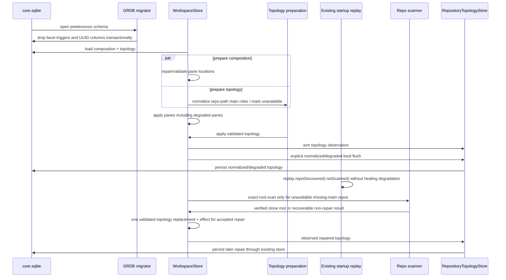

# Pane CWD-Derived Topology Association — Program Design

Status: candidate Program Design paired with
`2026-08-03-pane-cwd-derived-topology-association-requirements.md`.

## Governing requirements

The paired requirements define the authoritative Why/What. This document
defines only the structural How needed to realize PR-01 through PR-12.

The design is incident-constrained:

- generic panes durably own CWD, not repo/worktree UUIDs;
- topology owns repo/worktree identity and path containment;
- the existing deferred startup-topology lane invokes the existing `RepoScanner`
  only for degraded missing-main repos, while ordinary repo-discovery events
  retain their current reconciliation ownership;
- the existing GRDB migrator owns the schema hard cut; and
- no new delayed repair service, timer, coordinator, mapping store, or
  persistence format is introduced.

## Current system model

### Durable state and save path

```text
WorkspacePaneGraphAtom
  PaneGraphFacets { repoId?, worktreeId?, cwd? }
          │
          ▼
WorkspaceSQLiteStateBridge
  DurableFacetsRecord { repoId?, worktreeId?, cwd? }
          │
          ▼
WorkspaceCoreRepository
  resolvedPaneReferenceIds(database, pane)
          │ validates UUIDs against current repo/worktree rows
          ▼
pane(facet_repo_id, facet_worktree_id, cwd, ...)
```

`resolvedPaneReferenceIds` throws if a live facet UUID no longer exists. Because
the pane graph is replaced as one workspace transaction, one stale UUID rejects
every later pane, drawer, tab, and ordering update.

### Current topology mutation split

```text
scanned repo reconciliation
  → WorktreeTopologyDelta
  → topologyEffectHandler
  → orphanPanesForWorktree

direct worktreeUnregistered
  → reconciliation
  → delta discarded
  → cache prune only
```

The missed effect left stale pane UUID facets in memory. SQLite independently
null-normalized its already-committed pane foreign key after the topology row
was deleted, creating the observed live/committed split.

### Current startup sequence

```text
prepare databases / run migrations
  → load workspace composition and topology snapshot
  → prepare composition and topology concurrently
  → apply composition
  → apply topology
  → start runtime actors and WorkspaceCacheCoordinator
  → replay each stored repo path as repoDiscovered
  → arm persistence observation
```

The existing replay emits `.notScanned` discovery hints and therefore cannot
prove or reconstruct a missing main. The codebase already owns authoritative
`RepoScanner`/Git discovery and ordinary `.scanned` reconciliation, but the
current boot call path does not connect a zero-worktree stored repo to either.

### Current topology permissiveness

`RepositoryTopologyReplacement.prepare` validates IDs, stable keys, and
worktree ownership. It does not require an available repo to have a main
worktree at `repo.repoPath`. SQLite likewise permits a repo row with zero
worktree children and does not constrain main-worktree cardinality.

Production demonstrates the consequence: 12 repos have zero worktrees and 2
more have a repo-path worktree not marked main.

## Design crux

There are two separate consistency questions:

1. What filesystem fact does a pane own?
2. What repo/worktree identity currently contains that fact?

The old model persisted both answers and then required them to remain
synchronized across independently changing owners. The proposed model persists
only answer 1 and computes answer 2.

```text
pane owner                         topology owner
──────────                         ──────────────
CWD                         +      repo/worktree paths + IDs
                                      │
                                      ▼
                         derived repo/worktree projection
```

The topology main-worktree defect is related but has a different repair owner:
stored structure can normalize a path-matching row, while only Git discovery
can prove a missing primary checkout.

## Alternatives considered

### A. Keep UUID facets and clear them on every topology change — rejected

Gain: smallest incident-specific edit.

Cost: every topology mutation path, future import path, and restore path remains
responsible for synchronized pane rewrites. One missed path can wedge the full
workspace again. It also retains duplicate durable truth.

### B. Add a durable CWD-to-topology mapping table — rejected

Gain: explicit relational lookup.

Cost: creates a second cache that must be invalidated on path, identity, and
topology changes. CWD plus topology already contains the complete mapping
inputs.

### C. Repair missing main worktrees inside pane lookup — rejected

Gain: lookup always returns a pair.

Cost: a read becomes a filesystem/topology mutation, invents identity without
Git evidence, complicates reentrancy, and makes hot UI reads capable of writes.

### D. Add a delayed topology healer — rejected

Gain: separates startup latency from repair.

Cost: adds lifecycle, scheduling, persistence, and race semantics when the
existing deferred startup-topology lane can perform one bounded exact-root call
through the existing scanner for only the degraded repos.

### E. CWD-only panes plus restore containment and bounded startup scan repair — selected

Gain: removes the failure class, uses current owners, makes lookup read-only,
and keeps filesystem verification in the scanner.

Cost: CWD-dependent consumers and orphaning must cut over from stored UUIDs to
derived path association in one pass; legacy required-location panes need an
explicit degraded result.

## Proposed ownership and components

| Owner | Responsibility after cutover | Must not own |
| --- | --- | --- |
| `PaneMetadata` / `PaneGraphMetadata` | Pane identity, content metadata, launch directory, live CWD | durable repo/worktree identity |
| `PaneFilesystemLocationPolicy` (small pure Core policy) | Exhaustively classify current content as required/optional location and derive trustworthy repair candidates | topology lookup, filesystem scanning, persistence |
| `WorkspacePaneGraphAtom` | Store CWD-only pane location; accept valid new panes; retain explicit degraded restored panes | repo/worktree IDs or topology repair |
| `WorkspacePaneDerived` | Compose display/runtime `PaneContextFacets` from CWD plus current topology/cache | trusting caller-carried pane UUID facets |
| `RepositoryTopologyAtom` | Rebuildable path index and deterministic deepest containment for admitted worktrees | pane mutation or filesystem verification |
| `RepositoryTopologyReplacement` | Identity validation plus the available-repo main-worktree invariant backstop | repairing from filesystem guesses |
| `WorkspacePersistenceTransformer` | Normalize stored topology facts before admission; classify repaired/degraded repos | scanning Git or generating a missing main ID |
| `WorkspaceCacheCoordinator` | Existing repo discovery/reconciliation; route direct unregistration through one atomic topology operation; forward every accepted delta | delayed healing service |
| `WorkspaceMutationCoordinator` | Existing atomic topology mutations and scanned-main identity preservation | pane persistence coupling |
| `AppDelegate` deferred startup-topology lane | Run one exact-root `RepoScanner` validation for each unavailable repo missing a valid main, then compose the accepted topology delta with existing effect owners | scanner implementation or recurring repair lifecycle |
| `RepositoryTopologyStore` | Persist the normalized/reconciled topology snapshot, including one explicit boot flush | pane saves |
| `WorkspaceSQLiteStateBridge` | Encode/decode CWD-only pane metadata and content-derived location repair | repo/worktree facet transport |
| `WorkspaceCoreMigrations` | Transactional schema hard cut | table rebuild or compatibility mapping |
| `WorkspaceCoreRepository` | Persist pane CWD/content/layout without topology lookup | `resolvedPaneReferenceIds` or pane facet FK validation |
| `WorkspaceSurfaceCoordinator` | Existing topology effects and filesystem projection updates, re-keyed by CWD/path | association authority |

`PaneFilesystemLocationPolicy` is a pure exhaustive switch, not a new service or
lifecycle. Its output is a validation result such as valid, repaired, or
degraded-required. Pane content remains the durable discriminator; no second
location discriminator is stored.

## Pane location state model

```text
                    product creation
                           │
              ┌────────────┴────────────┐
              ▼                         ▼
     required-location           optional-location
        content                      content
              │                         │
      must provide CWD             CWD or none
              │                         │
              └────────────┬────────────┘
                           ▼
                     durable pane CWD
                           │
                    restore validation
                           │
          ┌────────────────┼────────────────┐
          ▼                ▼                ▼
       valid CWD     trusted repair      no trusted repair
                          source                  │
          │                │                     ▼
          │                ▼            degraded-required
          │          repaired CWD         pane retained
          └────────────────┴─────────────────────┘
```

The pure policy derives repair candidates as follows:

- Terminal: `cwd`, then persisted `launchDirectory`;
- Bridge Files/Review: `cwd`, then `.workspace(rootPath:...)` source;
- Code Viewer: `cwd`, then `filePath.deletingLastPathComponent()`;
- generic Webview: its optional `cwd` only; and
- unsupported/plugin: preserved CWD if present, otherwise none unless a future
  recognized content contract extends the exhaustive policy.

Context-free Terminal creation is resolved before pane admission by the App
composition owner: explicit directory, inherited valid pane directory, then the
user home directory. The policy does not create directories or select `/tmp`.

An invalid runtime CWD sample is represented as “no accepted update,” not as a
new nil value. Required panes retain the last accepted CWD. Optional panes do
not gain fabricated location.

### CWD admission and update call-path delta

`WorkspaceSurfaceCoordinator` remains the single App admission/update owner for
required Terminal locations. The hard cut changes what crosses the pane-state
boundary; it does not add a lifecycle owner:

```text
SurfaceManager.surfaceCWDChanges (async event)
  → WorkspaceSurfaceCoordinator.onSurfaceCWDChanged
  → shared updatePaneCWDAndResolvedContext admission
  → PaneFilesystemLocationPolicy accepts or rejects the sample
  → WorkspacePaneGraphAtom writes only the accepted CWD
  → WorkspacePaneDerived reads CWD + current RepositoryTopologyAtom

GhosttyEvent.cwdChanged (runtime event)
  → CWDNormalizer
  → the same WorkspaceSurfaceCoordinator admission path
  → the same CWD-only graph write and derived topology read
```

Before the cut, both event paths could refresh runtime repo/worktree context
that the pane graph retained as durable facets. After the cut, the event edges
and MainActor ordering are intentionally unchanged, invalid required-pane
samples are typed no-ops, and repo/worktree lookup is a read-only projection
that never enters the pane write.

All Terminal creation families converge before durable layout insertion:

```text
worktree tab or split creation ─┐
new split / explicit directory ├→ WorkspaceSurfaceCoordinator resolves CWD
floating/context-free Terminal ┘  → PaneFilesystemLocationPolicy admission
                                  → createPane(CWD-only durable facets)
                                  → insert pane into tab/layout
```

Worktree-backed creation uses the selected worktree path; explicit-directory
creation uses that directory; inherited creation uses the target pane's valid
location; and floating/context-free creation falls back to the user home
directory. Admission failure returns no pane before layout mutation. No creation
path writes repo/worktree identity into canonical pane state.

## Pane graph and derived association cutover

### Write model

`PaneGraphFacets` becomes CWD-only. Construction may continue accepting
`PaneContextFacets` at boundary call sites during the same hard cut, but the
graph extracts only `cwd`; repo/worktree IDs and display names never enter its
canonical state.

The combined mutation `updatePaneCWDAndResolvedContext` becomes a CWD-only
accepted-update operation. Its caller may still compute the derived context for
telemetry or immediate projection refresh, but the atom does not store it.

Any graph query keyed by `worktreeId` moves to `WorkspacePaneDerived`, where it
uses current CWD-derived panes. There is no durable-worktree query left on the
graph.

### Read model

`WorkspacePaneDerived.displayFacets` always begins with pane CWD and always asks
`RepositoryTopologyAtom` for current containment. It never tries stored IDs
first.

When a match exists, it fills runtime/display `PaneContextFacets` with the
current repo/worktree IDs, names, parent folder, and rebuildable enrichment.
When no match exists, those fields are nil while CWD remains intact.

`PaneContextFacets` may remain the shared runtime/envelope DTO because runtime
events can legitimately carry a current projection. Its repo/worktree fields
are explicitly non-durable and are not accepted as pane graph authority.

### Path index

The existing longest-path-first `RepositoryTopologyAtom` index remains the
owner. It changes only to:

- index worktrees belonging to available, invariant-valid repos;
- use normalized component-boundary containment;
- retain deterministic stable tie-breaking and bounded ambiguity telemetry; and
- make repo-root association work through the required main worktree at
  `repo.repoPath`, not through a separate repo-only index.

No SQLite access occurs during lookup.

## Topology normalization and scan repair

### Stage 1: stored topology normalization

`WorkspacePersistenceTransformer.prepareRepositoryTopology` performs a pure
normalization before `RepositoryTopologyReplacement.prepare`:

For each repo:

1. Compute the canonical stable identity for `repo.repoPath` and every stored
   worktree path using the existing `StableKey.fromPath` owner.
2. Select root candidates whose canonical stable identity equals the repo's.
3. For one candidate, preserve every worktree UUID and note, mark that row main,
   and demote other main flags.
4. For zero candidates, retain the repo and its linked-worktree rows but add the
   repo ID to the unavailable set.
5. For multiple candidates, discard every ambiguous root-identity row, preserve
   unrelated linked-worktree UUIDs and notes, and add the repo ID to the
   unavailable set.
6. Pass the normalized result through replacement validation, whose repository,
   worktree, and watched-path stable-key uniqueness checks remain global and
   strict regardless of repository availability.

This stage does not mutate the filesystem, perform Git discovery, or create a
worktree. It can repair only contradictions resolved by canonical identity from
stored paths. The existing topology store must persist the normalized/degraded
snapshot before Stage 2 may attempt authoritative exact-root repair.

`RepositoryTopologyReplacement.prepare` then rejects any available repo with:

- no main worktree;
- more than one main worktree; or
- a main worktree whose normalized path differs from `repo.repoPath`.

Unavailable repos may retain incomplete topology so they remain visible and
recoverable, but they receive no exception from global identity uniqueness and
their worktrees are excluded from pane association and activation.

### Stage 2: bounded degraded-repo validation in the existing startup lane

Current `replayBootTopology` emits `repoDiscovered` with `.notScanned`; it does
not invoke authoritative Git scanning, and `EventBus.post` acknowledges enqueue
rather than `WorkspaceCacheCoordinator` consumption. The design therefore does
not use replay as either a scan edge or a persistence barrier.

No boot step, actor, timer, or recurring healer is added. The existing deferred
startup-topology task, which already runs after window presentation, performs
one bounded pass over repos that are both unavailable and missing a valid main
at `repo.repoPath`:

1. Invoke existing `RepoScanner.scan(in: repo.repoPath, maxDepth: 0)` for the
   exact stored root. This uses the scanner's existing Git discovery client and
   accepts only a complete authoritative result containing a `.cloneRoot`
   entry whose canonical path equals `repo.repoPath`.
2. Partial, cancelled, unavailable, failed, linked-worktree, bare-repository,
   or path-mismatched results leave the repo unavailable. They never create a
   worktree.
3. For a verified clone root, call one existing-owner topology operation that
   preserves a repo-path worktree UUID when present or creates one UUIDv7 main
   when absent, demotes conflicting stored main flags, retains linked
   worktrees, clears unavailable, and returns an accepted
   `WorktreeTopologyDelta`.
4. App composition forwards that accepted delta to the existing topology effect
   handler. It does not translate the result into a synthetic `.scanned`
   linked-worktree inventory because the exact-root validation did not enumerate
   all linked worktrees.

Ordinary authoritative `.scanned` repo-discovery events continue using the
existing full main-plus-linked reconciliation path. `.notScanned` events may
register or refresh already-valid topology, but must not clear unavailable for
a repo that lacks a valid main.

Persistence has two truthful stages rather than one false “final scan” barrier:

1. The existing post-presentation step order changes from `trigger topology →
   arm persistence` to `arm canonical persistence → trigger topology`. The arm
   step synchronously starts `WorkspaceStore` and `RepositoryTopologyStore`
   observation, then awaits one explicit topology flush of the
   normalized/degraded snapshot before the topology task can begin.
2. Each later accepted verified-main or ordinary `.scanned` mutation is observed
   by the same store and persists through its existing debounce/termination
   flush path.

The explicit normalized/degraded flush is a real gate with a recoverable
failure branch. If `RepositoryTopologyStore.flushAsync()` throws, keep
`WorkspaceStore` and `RepositoryTopologyStore` observation armed, retain the
normalized/degraded topology as the in-memory authority, emit the bounded
`topology_boot_normalization_flush_failed` reason, and skip exact-root repair
for that boot pass. Do not claim or cross the persistence barrier. Continue the
independent cache/local observer-arm and cache-prune completion so one topology
write failure does not disable unrelated persistence, but do not represent
that completion as successful topology repair. The topology snapshot remains
eligible for the store's existing explicit lifecycle/termination flush; a
later topology mutation may also schedule the existing debounced save. This
adds no retry queue or alternate persistence path. The workspace stays usable
and pane autosave stays armed while the existing database failure reporting
remains authoritative.

After a successful normalized/degraded flush, the existing deferred topology
task runs and `completeBootPersistenceObservation` arms the remaining
cache/local observers and performs its existing explicit cache-prune flush.
If the initial normalized/degraded topology flush fails, exact-root validation
is skipped and the same independent observer/prune completion runs immediately
after failure classification.
Starting workspace and topology observation again is idempotent. This keeps
rebuildable cache observation quiet during replay, arms pane workspace autosave
before any bounded Git validation, and provides a real ordering barrier for
topology normalization. No new boot step or completion primitive is introduced.

Boot does not claim that enqueueing replay or completing the first flush means
all Git validation has finished. Scanner failure leaves a coherent persisted
unavailable repo and never delays workspace-save observation indefinitely.

The current/proposed boot edge delta is:

| Edge | Current | Proposed |
| --- | --- | --- |
| post-presentation order | trigger topology, then schedule persistence arm | synchronously arm workspace + topology stores and flush topology, then trigger topology |
| replay | enqueue `.notScanned`, then later arm every observer | enqueue `.notScanned`; it cannot heal or clear missing-main degradation |
| missing-main verification | no edge for an individually stored zero-worktree repo | deferred task → exact-root `RepoScanner.scan(maxDepth: 0)` → verified-main topology operation |
| later repair persistence | not applicable | topology observation sees the accepted replacement and uses existing debounce/termination flush |
| remaining observer arm | after topology task through a separate waiting task | cache/local observers after successful topology-task completion, or immediately after a classified initial-flush failure that skips that task, through the existing `completeBootPersistenceObservation` body; workspace/topology calls are idempotent |

### Live unregistration

`WorkspaceCacheCoordinator.handleWorktreeUnregistered` delegates to one changed
operation on the existing `WorkspaceMutationCoordinator`. That operation:

1. resolves the current repo and target worktree;
2. prepares the remaining worktree list;
3. unions the repo into unavailable membership when the removed target is main,
   or preserves current availability when it is linked;
4. validates the complete repositories + watched paths + unavailable set as one
   `RepositoryTopologyReplacement`;
5. applies exactly one replacement/index generation; and
6. returns the accepted delta or a recoverable typed rejection.

There is no intermediate available-zero-main state and no use of the existing
`performBatchedTopologyMutation` as an atomicity claim; that helper only defers
path-index rebuilding. `WorkspaceCacheCoordinator` prunes the accepted removed
IDs and forwards only the accepted delta. Unknown/mismatched input remains a
typed no-op/rejection rather than reaching `preconditionFailure`.

A linked removal preserves availability. A main removal atomically makes the
repo unavailable. A later verified startup root or ordinary authoritative
`.scanned` discovery repairs and re-enables it through the same replacement
backstop.

## Orphan lifecycle after UUID removal

`WorktreeTopologyDelta.RemovedWorktreeEntry` already carries both the removed
worktree UUID and path. The existing topology effect handler changes from
matching pane graph UUID facets to component-aware CWD containment under each
removed path.

Rules:

1. Snapshot the removed path facts from the accepted delta.
2. For each eligible active/backgrounded pane, compare its durable CWD to those
   paths.
3. If current topology now provides a different containing worktree, do not
   orphan it; its derived association has already moved.
4. Otherwise preserve the existing orphan residency and recorded missing-path
   behavior.
5. Restore orphan residency when a current admitted worktree again contains the
   pane CWD, rather than requiring the old worktree UUID to return.

The added call paths are explicit:

- after `WorkspaceStore` applies the initial prepared topology, the existing
  `WorkspaceMutationCoordinator` runs one CWD-based
  `restoreOrphanedPaneResidencyForCurrentTopology` pass against the already
  applied composition and topology;
- after every accepted live topology delta, `WorkspaceSurfaceCoordinator` first
  applies removal effects and then invokes the same coordinator operation using
  current admitted containment;
- `WorkspaceCacheCoordinator` forwards accepted deltas from scanned
  reconciliation, direct registration, direct unregistration, and repo
  reassociation instead of limiting effects to the current scanned-removal
  paths; and
- the UUID-based restoration inside `applyRepoReassociation` is removed so
  there is one restoration owner and ordinary re-addition participates.

The coordinator operation preserves the existing active/backgrounded decision:
an orphaned pane whose CWD is contained by current topology becomes active when
it belongs to the current layout and backgrounded otherwise. A re-added
worktree may have a new UUID; identity equality is neither required nor stored.

This preserves the existing lifecycle intent while allowing a deleted and
rediscovered checkout to receive a new UUID. Crucially, failure or omission of
this effect cannot invalidate pane persistence: the graph contains no topology
foreign key.

## SQLite schema hard cut

Add migration `015_drop_pane_topology_facets` after the current
`014_drop_shows_minimized_panes` migration:

```sql
DROP TRIGGER IF EXISTS pane_facet_repo_matches_workspace;
DROP TRIGGER IF EXISTS pane_facet_repo_update_matches_workspace;
DROP TRIGGER IF EXISTS pane_facet_worktree_matches_workspace;
DROP TRIGGER IF EXISTS pane_facet_worktree_update_matches_workspace;
ALTER TABLE pane DROP COLUMN facet_repo_id;
ALTER TABLE pane DROP COLUMN facet_worktree_id;
```

The deployed columns are nullable inline foreign keys. With the triggers gone,
current SQLite supports direct column drop under foreign-key enforcement. The
migration runs in GRDB's migration transaction.

The design deliberately does not rebuild `pane`: it is referenced by content,
tab, arrangement, drawer, and self-referential parent relationships. A rebuild
would create unnecessary ordering and foreign-key hazards.

Migration fixtures must cover every predecessor schema that current tests
construct. Schema assertions, expected trigger lists, row fixtures, bridge
records, and restoration snapshots cut over in the same change.

## Repository and bridge-codec cutover

`WorkspaceCoreRepository.DurableFacetsRecord` becomes a CWD-only record or is
folded into `PaneMetadataRecord.cwd`. The chosen spelling follows the smallest
existing convention; there is no repo/worktree field left.

Repository changes:

- `readPaneGraph` reads `cwd` only;
- `upsertPane` removes the two columns and arguments;
- `paneStatementArguments` no longer accepts `Database` merely for reference
  resolution;
- `resolvedPaneReferenceIds`, `fetchPaneReferenceWorktreeRepoId`, and
  `paneReferenceRepoExists` are deleted; and
- pane graph validation retains content/layout/placement checks but performs no
  topology reference validation.

State bridge changes:

- encode CWD only from `PaneMetadata`;
- restore content first, then apply `PaneFilesystemLocationPolicy` to accept,
  repair, or degrade location;
- construct `PaneMetadata` without durable repo/worktree fields; and
- preserve content-specific Bridge source JSON unchanged.

Bridge `.workspace(rootPath:baseline:)` remains the durable query source for
Files/Review and a trustworthy missing-CWD repair input. It does not become a
generic topology-ID authority.

## Startup/save sequence after cutover



Normal workspace save becomes:

```text
pane graph snapshot (CWD only)
  + tab/drawer/arrangement snapshots
  → structural composition preparation
  → state bridge
  → core transaction
```

There is no repo/worktree query in this path.

## Failure, recovery, and concurrency

### Migration failure

GRDB/SQLite rolls back the migration transaction. Existing database preparation
and quarantine ownership remains authoritative. The migration adds no manual
sidecar manipulation.

### Invalid required location

New product creation is rejected before durable layout insertion unless App has
resolved the Terminal home fallback. Restore never deletes the pane: it repairs
from a trustworthy content source or admits an explicit degraded-required
result that remains closable/saveable.

### Invalid topology

Stored path-resolvable main-role errors normalize off-main during existing
preparation. Missing or ambiguous canonical-root state becomes unavailable and
remains usable without association. Those scoped incident states do not call
`preconditionFailure`.

Residual global repository, worktree, or watched-path identity corruption is
not normalized or guessed by this feature. `RepositoryTopologyReplacement`
continues to reject it at the existing strict startup-invariant boundary, which
is outside PR-09's named recoverable incident states. Before that existing stop,
App records and flushes one bounded `topology_normalization_rejected` reason.
This cut neither adds core-database quarantine nor changes the startup outcome
for unrelated global identity corruption.

### Scan unavailable or slow

The normalized/degraded snapshot is flushed and workspace persistence is armed
before bounded exact-root repair runs in the deferred topology lane. The
workspace is usable with degraded repos excluded from association. A failed or
slow validation therefore cannot leave pane autosave unarmed. Failed scans
retain unavailable state and emit one bounded reason code. A later ordinary
authoritative `.scanned` event may still heal the repo.

### Normalized topology flush failure

The failure branch does not proceed into exact-root repair because doing so
would build a second topology mutation on a boot normalization that has not yet
crossed its required persistence gate. It retains the degraded in-memory
topology, keeps pane and topology persistence observation active, leaves the
independent cache/local observer completion intact, and reports
`topology_boot_normalization_flush_failed`. Existing explicit lifecycle or
termination flush is the retry seam; this design adds no retry loop or timer.

### Concurrent CWD and topology changes

Both canonical atom mutations remain MainActor-bound. A derived read observes
one current CWD and one current topology generation. No cross-owner write
transaction is necessary because association is recomputable. Memoized readers,
if retained, key by pane CWD plus `worktreePathIndexGeneration`.

### Topology effect failure

Orphan-residency effects remain best-effort product sequencing. They can no
longer poison persistence because no pane row refers to the removed topology
identity.

### Save failure

Structural graph or database failures can still reject an atomic snapshot.
Telemetry must classify them. A missing derived topology match is never a save
failure and never enters SQL arguments.

## Observability realization

Use existing trace runtime and recovery reporting. Add bounded enum-like reason
attributes, not raw errors:

- `topology_restore_main_role_repaired`
- `topology_restore_missing_main_degraded`
- `topology_normalization_rejected`
- `topology_scan_main_repaired`
- `topology_boot_normalization_flush_failed`
- `pane_location_restore_repaired`
- `pane_location_restore_degraded`
- `workspace_save_composition_rejected`
- `workspace_save_bridge_failed`
- `workspace_save_database_failed`

Lookup misses are ordinary and produce no per-read log. Ambiguous topology emits
once per preparation/reconciliation event. Existing OTLP scrubbing rules forbid
raw paths and UUIDs.

## Proof architecture

### Red-first incident reproduction

Before implementation, add one integration test using the real topology event,
pane graph, save coordinator, and SQLite repository:

```text
create repo/main worktree
  → create worktree-backed Terminal pane
  → persist baseline
  → dispatch direct worktreeUnregistered
  → add three panes and mutate drawer ordering
  → flush
```

Current code must fail for the observed `worktreeNotFound` reason. The green
version must commit and restore the complete later graph. A sibling scanned-
removal case proves save validity does not depend on topology-effect routing.

### Focused proof seams

| Requirements | Owner/seam | Automated proof | Manual/runtime proof |
| --- | --- | --- | --- |
| PR-01, PR-08 | Pane graph → state bridge → repository | RED/GREEN direct-unregistration save/restart; source/schema assertions | debug app mutate/remove/save/restart count/order comparison |
| PR-02, PR-03, PR-07 | `PaneFilesystemLocationPolicy`, creation, restore | exhaustive content table; invalid runtime sample; repair/degraded fixtures | Terminal from locationless Webview; Bridge/Code Viewer reopen; generic Webview remains locationless |
| PR-04, PR-06, PR-11 | topology path index + `WorkspacePaneDerived` | segment-boundary/deepest-match tables; cold/live equivalence; topology generation change | IPC/read-back before removal, after removal, and after re-registration |
| PR-05 | persistence normalization + exact-root startup validation + ordinary scanner reconciliation + atomic live unregistration | wrong-flag, zero-main, conflicting-main, `.notScanned` preservation, integrated degraded-flush → exact-root-repair → reload, main-removal, ordinary scan-heal fixtures | production-shaped copied topology boot and scan-heal observation |
| PR-09 | scoped validation paths | malformed raw legacy facet text migrates, loads, saves, and reloads; other negative cases prove recoverable results and source inspection for traps | clean boot with malformed copied fixtures |
| PR-10 | migration 015 | predecessor migration fixtures, row invariants, quick/FK checks, restore/save round trip | launch debug app twice against migrated copied fixture |
| PR-12 | recovery/trace reason enums | attribute scrubbing plus positive producer-delivery tests, including normalization rejection, restore degradation, and scan repair | marker-scoped VictoriaLogs verification requiring an exercised controlled reason |

### Production-shaped manual proof

Production remains read-only. Copy or synthesize its relevant schema shapes into
the isolated debug data root. The proof must compare before/after:

- pane IDs and count;
- drawer IDs, membership, and order;
- tab membership and arrangement order;
- terminal zmx anchors;
- CWD and launch directories;
- content payloads; and
- topology main-worktree cardinality and availability.

Then perform live IPC/debug actions, flush, terminate cleanly, restart, and
repeat the comparison. Marker-scoped VictoriaLogs must show startup completion,
classified repairs, successful saves, and no scoped persistence recovery
failure.

## Requirement realization matrix

| Requirement | Structural realization |
| --- | --- |
| PR-01 | CWD-only `PaneGraphFacets`, bridge record, repository row, and migration 015 |
| PR-02 | exhaustive pure content location policy plus App-owned Terminal fallback |
| PR-03 | accepted-update CWD ingress that ignores invalid required samples |
| PR-04 | available-worktree longest component-path index |
| PR-05 | restore normalization, replacement backstop, normalized/degraded boot flush, bounded exact-root validation, ordinary scan reconciliation, and atomic main-unregistration degradation |
| PR-06 | derived view recomputation; no pane rewrite on association change |
| PR-07 | content-owned repair candidates and retained degraded-required pane result |
| PR-08 | deletion of pane reference resolution from save path |
| PR-09 | recoverable scoped validation and existing database recovery boundary |
| PR-10 | transactional direct-column-drop migration and fixture cutover |
| PR-11 | topology-generation index only; no durable mapping |
| PR-12 | bounded scrubbed reason enums through existing trace/recovery owners |

## Cross-cutting realization checklist

- Security/privacy: no new authority or network path; OTLP remains scrubbed.
- Persistence: one forward migration, one canonical writer, no compatibility
  lane.
- Concurrency: existing off-main preparation and MainActor atom application are
  preserved.
- Performance: hot lookup remains an in-memory sorted index; no database or
  filesystem I/O enters pane reads.
- UI/accessibility: no new UI. Degraded panes retain existing close/manage
  affordances and must not silently disappear.
- Release safety: copied fixtures and isolated debug data root precede beta or
  stable promotion; production is never mutated during proof.

## Explicit non-goals and protected owners

- Do not add a topology repair actor, timer, startup phase, or durable repair
  queue.
- Do not move Git verification out of the existing scanner/discovery pipeline.
- Do not couple workspace pane saves to `RepositoryTopologyStore` transactions.
- Do not alter zmx lifecycle or delete terminal sessions.
- Do not remove atomic workspace composition validation.
- Do not make Webview CWD mandatory.
- Do not infer dormant nonlocal execution-backend requirements.
- Do not rebuild the `pane` table unless implementation-time SQLite proof
  disproves direct column drop; that would be a design break requiring renewed
  agreement.

## Focused PR boundary and follow-up work

The production-fix PR contains only the coupled cut required to remove this
failure class:

1. migration 015 plus CWD-only pane graph/repository/state-bridge codecs;
2. CWD-only derived association and path-based orphan/restore cutover;
3. exhaustive current-content CWD admission and legacy repair/degradation;
4. main-worktree restore normalization, normalized/degraded boot flush, bounded
   exact-root validation, ordinary scan-event healing, and atomic direct
   main-unregistration handling; and
5. the red/green incident regression, migration/restore proof, and minimum
   scrubbed reason codes needed to diagnose this path.

The following are follow-up candidates and must not expand the production-fix
PR:

- first-class bare-repository or nonlocal execution-backend product semantics;
- a new degraded-pane recovery UI beyond retaining existing manage/close
  affordances;
- generalized persistence-failure dashboards, alerting, or shutdown UX outside
  the minimum scoped reason codes;
- unrelated cleanup of historical unavailable repos, watched paths, caches, or
  enrichment state; and
- broader pane metadata or `PaneContextFacets` API redesign once the durable
  UUID fields are no longer authoritative.

If implementation reveals that any in-scope item requires a new actor,
coordinator, persistence store, compatibility lane, pane-table rebuild, or
public degraded-state contract, that is a design break. Stop rather than absorb
it into this PR.

## Design self-review

The design spends one small pure policy and one stronger topology invariant. It
does not spend a new runtime owner. Every repair is placed at an existing source
of truth:

- stored path contradictions: persistence transformer;
- Git checkout truth: scanner/reconciliation;
- pane association: derived topology lookup;
- schema: GRDB migrator; and
- boot persistence: existing topology store.

The riskiest edge is preserving orphan lifecycle after removing stored UUIDs.
The removed-worktree delta already carries the necessary path, and current
topology can determine whether a replacement contains the pane CWD. This avoids
new state while preserving rather than expanding lifecycle semantics.

The second risk is interpreting “no crash” too broadly. The design removes
recoverable traps and save failures for the scoped pane-location/topology states
without weakening unrelated composition corruption or database recovery gates.
