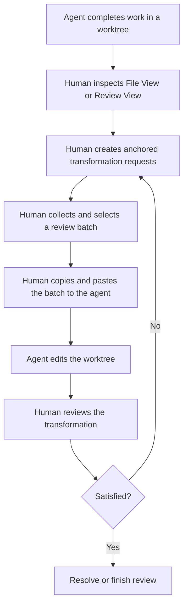

# Deprecated Worktree Annotations PR1 — User Requirements Draft

> Source material only. This document is not current requirements or design
> authority. The current design entry point is
> `../2026-08-06-worktree-annotations/README.md`.

## Purpose

PR1 establishes the first useful slice of Worktree Annotations: a human can
review completed work in a repository worktree, attach durable transformation
requests to the relevant material, collect a review pass, and hand selected
requests to the working agent through copy and paste. The agent edits the
worktree, and the human reviews the transformation in another pass.

The larger product direction is an agent-native evolution of editors. People
increasingly express editing intent in context while agents perform the direct
text or code manipulation. An annotation is the durable, anchored request and
coordination point; the complete human-agent round trip is the editing
interaction. PR1 proves that model through review without attempting to build
all future agent integration.

This record owns the required PR1 experience. It does not select database
tables, storage ownership, Bridge messages, IPC commands, renderer libraries,
anchor algorithms, or internal state machines. Those choices belong to the PR1
Specification and Program Design after this requirements boundary is
confirmed.

## Source and authority

- Decision owner: Agent Studio owner.
- Primary evidence: the owner's worktree-review workflow and PR1/PR2 boundary
  described in the 2026-08-03 design conversation.
- This document replaces the provisional combined
  `user-requirements.md` record in this folder.
- `pr2-user-requirements.md` owns later bidirectional agent participation.
- The files in `../2026-07-30-review-comments/` are deprecated evidence, not
  current authority.
- Current-code observations establish what Agent Studio already has; they do
  not authorize new product meaning.

## Affected classes

### Human reviewer

Reviews completed plans, specifications, files, and code changes in the
worktree where an agent worked. The reviewer anchors precise transformation
requests, preserves a coherent review pass, and verifies the resulting edits.

### Working agent

Receives a correlated, model-readable selection through the user's existing
agent interaction, edits the correct worktree material, and returns changed
work for another review pass. In PR1, Agent Studio does not programmatically
control or converse with the agent.

Multi-user collaboration, external code-host review, review administration,
and issue tracking are not affected classes for PR1.

## PR1 experience at a glance



```text
completed worktree
  → inspect rendered files or a chosen diff
  → leave durable, anchored transformation requests
  → select all or part of the review
  → copy and paste the selection to the working agent
  → agent edits the worktree
  → inspect the transformation
      → more work: continue the annotation session
      → satisfied: resolve the request or finish the session
```

## Where PR1 lives

```text
┌─ Zoomed worktree ────────────────────────────────────────────────┐
│ Working terminal             │ File View or Review View          │
│                              │                                   │
│ agent receives copied        │ [Annotate]  Session: current      │
│ requests and edits the       │                                   │
│ worktree                     │ rendered material or diff         │
│                              │   └─ anchored request              │
│                              │                                   │
│                              │ selected requests → Copy          │
└──────────────────────────────┴───────────────────────────────────┘
```

File View and Review View both expose Annotation Mode directly. Annotation
Mode is an interaction state within those views, not a third content view and
not a separate review application.

## Required user outcomes

### P1-U1 — Review completed work in its worktree

- Affected class: human reviewer.
- Need: After an agent finishes work, the reviewer can enter a review workflow
  tied to the repository worktree where that work happened.
- Why: The reviewer must know which mutable work and repository context the
  feedback applies to.
- Evidence: direct owner workflow description.
- Authority: authorized.
- Priority: must for PR1, assigned by the Agent Studio owner.

### P1-U2 — Keep the working terminal beside the review

- Affected class: human reviewer.
- Need: In Zoom, the worktree's terminal remains beside File View or Review
  View while the reviewer reads, annotates, and hands off requests.
- Why: Review and communication with the working agent should not lose the
  active worktree context.
- Evidence: direct owner workflow description and Zoom screenshot.
- Authority: authorized.
- Priority: must for PR1, assigned by the Agent Studio owner.

### P1-U3 — Find the plans and specifications worth reviewing

- Affected class: human reviewer.
- Need: The reviewer can use the existing file filters and selected worktree
  review scope to focus on plans and specifications changed by the work being
  reviewed.
- Why: The reviewer should not have to rediscover which design artifacts the
  agent changed.
- Evidence: direct owner plans/specifications workflow.
- Authority: authorized.
- Priority: must for PR1, assigned by the Agent Studio owner.
- Open product choice: how the selected review scope determines which changed
  plans and specifications the existing filters show.

### P1-U4 — Read plans and specifications as rendered documents

- Affected class: human reviewer.
- Need: File View preserves its supported Markdown rendering and additionally
  renders fenced code with syntax highlighting and Mermaid blocks as diagrams,
  while allowing annotations on the rendered material.
- Why: Raw or partially rendered Markdown makes design review harder and can
  hide the meaning of diagrams.
- Evidence: repeated owner corrections about rich Markdown, Shiki syntax
  highlighting, and actual Mermaid rendering.
- Authority: authorized.
- Priority: must for PR1, assigned by the Agent Studio owner.

### P1-U5 — Choose the code comparison being reviewed

- Affected class: human reviewer.
- Need: Review View lets the reviewer choose what the selected worktree is
  compared against and keeps that choice visible during review.
- Why: A diff and its annotations are ambiguous unless the reviewer can see and
  control the change set under review.
- Evidence: direct owner correction that the current fixed comparison is
  insufficient.
- Authority: authorized.
- Priority: must for PR1, assigned by the Agent Studio owner.
- Open product choice: the PR1 comparison choices and default.

### P1-U6 — Start or continue an identifiable annotation session

- Affected class: human reviewer.
- Need: Annotations belong to an identifiable, living annotation session for
  the selected review context, rather than to an ephemeral viewer instance or
  every historical annotation on the same path.
- Why: The reviewer must be able to leave, return, copy part of the feedback,
  and continue the same review without mixing unrelated rounds.
- Evidence: owner-selected annotation-session model.
- Authority: authorized.
- Priority: must for PR1, assigned by the Agent Studio owner.
- Confirmed interaction: File View and Review View expose an obvious in-view
  action to start or continue Annotation Mode. The active session is visible.
- Open product choice: how Review View proposes, opens, or creates an applicable
  session.

### P1-U7 — Annotate in File View and Review View

- Affected class: human reviewer.
- Need: File View and Review View can show and add annotations from the same
  selected session when they display material in that session's review
  context. The PR1 anchor-target decision defines which displayed material
  types admit annotation and at what visible granularity.
- Why: Plans, specifications, and implementation changes may be part of one
  review round; switching views must not make review work appear lost.
- Evidence: direct owner requirement that both views support annotation.
- Authority: authorized.
- Priority: must for PR1, assigned by the Agent Studio owner.

### P1-U8 — Anchor each annotation to what the reviewer meant

- Affected classes: human reviewer and working agent.
- Need: Each annotation retains enough reviewed-material context to identify
  its relevant file or document location, repository worktree, and source
  version or comparison at creation.
- Why: Persistent annotation text without origin context is not actionable
  transformation feedback.
- Evidence: direct owner requirement for file/worktree and commit/comparison
  anchoring.
- Authority: authorized.
- Priority: must for PR1, assigned by the Agent Studio owner.
- Open product choice: the minimum visible anchor granularity for code,
  rendered Markdown, Mermaid diagrams, diffs, and non-text material.

### P1-U9 — Never lose unfinished review work

- Affected class: human reviewer.
- Need: Sessions and annotations survive closing a view, leaving Zoom,
  recreating the pane, and restarting Agent Studio. Reopening a session restores
  its review work.
- Why: Annotations are reviewer work product and may exist before or after any
  handoff.
- Evidence: explicit owner durability requirement.
- Authority: authorized.
- Priority: must for PR1, assigned by the Agent Studio owner.

### P1-U10 — Accumulate and hand off a selected review batch

- Affected classes: human reviewer and working agent.
- Need: The reviewer can move through documents, files, and diffs, add many
  annotations, select all or some of them in the current UI, produce and copy
  that batch in a model-readable form, paste it to the agent, and continue the
  same session. Successful copy/export actions have durable batch history that
  remains separate from the annotations themselves.
- Why: Review is a coherent pass and may proceed in partial batches rather than
  forced one-at-a-time or all-at-once delivery. Durable history preserves what
  the reviewer prepared without turning copy/export into annotation status or
  claiming that an agent received it.
- Evidence: explicit owner clipboard MVP and partial-handoff workflow.
- Authority: authorized.
- Priority: must for PR1, assigned by the Agent Studio owner.
- Open product choice: the clipboard representation, the annotation and source
  facts it carries, how the reviewer revisits durable batch history, what
  observable result is successful enough to enter that history, and whether
  PR1 also exposes JSON export. PR1 does not define automated delivery or its
  tracking.

### P1-U11 — Keep review meaning separate from interaction state

- Affected class: human reviewer.
- Need: Resolution changes only through an explicit authorized action, and the
  reviewer can understand an annotation's resolution and current placement.
  Selecting annotations is UI state used to assemble a batch. Copy/export adds
  durable batch history but does not change annotation resolution or claim
  delivery to an agent.
- Why: UI selection, generated output, transfer to an agent, explicit
  resolution, and source placement answer different questions and must not be
  collapsed into one annotation status.
- Evidence: explicit owner requirement for annotation status and lifecycle.
- Authority: authorized for the outcome.
- Priority: must for PR1, assigned by the Agent Studio owner.
- Open product choice: who may perform the explicit resolve/reopen actions in
  PR1 and what happens when a session is completed with unresolved annotations.

### P1-U12 — Preserve meaning when the source changes

- Affected classes: human reviewer and working agent.
- Need: When reviewed material changes, the session preserves every annotation
  and makes a best effort to show its current location. The reviewer can tell
  whether placement is exact, relocated, outdated, or unavailable.
- Why: The agent edits a living worktree; source drift must not erase feedback
  or present uncertain placement as exact.
- Evidence: owner acceptance of best-effort replacement and explicit concern
  about out-of-sync anchors.
- Authority: authorized.
- Priority: must for PR1, assigned by the Agent Studio owner.
- Proof floor: successful relocation is not guaranteed. Annotation text and
  immutable origin context survive, and uncertain placement is never presented
  as exact.
- Open product choice: the observable meanings and transition triggers for
  exact, relocated, outdated, and unavailable.

### P1-U13 — Prevent annotations from attaching to unrelated source

- Affected class: human reviewer.
- Need: When Agent Studio proves that the current repository, worktree, or
  applicable review subject no longer belongs to the session, existing review
  remains readable and exportable but new annotations cannot be silently
  attached to unrelated material.
- Why: Durability must not create false source association after a repository,
  worktree, branch, or review subject is replaced.
- Evidence: direct owner source-continuity requirement.
- Authority: authorized.
- Priority: must for PR1, assigned by the Agent Studio owner.
- Confirmed behavior: anchor drift alone does not detach a session. A proven
  different branch, unrelated comparison or subject, replaced repository or
  worktree identity, or another proven source mismatch detaches it and makes it
  read-only until validated reattachment.
- Confirmed negative space: commits, rebases, rewrites of the same subject,
  branch rename, relocation failure, and inferred merge ancestry do not detach
  a session by themselves.

### P1-U14 — Distinguish a finished review from detached source

- Affected class: human reviewer.
- Need: The reviewer can explicitly finish a session. An exact bound branch or
  pull-request subject also completes when Agent Studio has an authoritative
  merged signal. Completed sessions are read-only; inferred merge ancestry only
  prompts the reviewer.
- Why: Finished review and unrelated source are different reasons to prevent
  further annotation.
- Evidence: owner-selected distinction between drift, detachment, and
  completion.
- Authority: authorized.
- Priority: must for PR1, assigned by the Agent Studio owner.
- Constraint: PR1 consumes an exact merge signal only when it already belongs
  to the session context; it does not add external code-host synchronization.

### P1-U15 — Complete the annotation-to-transformation loop

- Affected classes: human reviewer and working agent.
- Need: An annotation expresses the transformation the human wants. The human
  can hand the selected request to the agent, inspect the resulting worktree
  change, and resolve or continue the request in the same review cycle.
- Why: Worktree Annotations is not merely passive commenting; PR1 must prove the
  contextual intent → agent transformation → human verification loop.
- Evidence: owner clarification of the broader agent-native editor direction
  and review as its first workflow.
- Authority: authorized.
- Priority: must for PR1, assigned by the Agent Studio owner.
- Constraint: PR1 uses copy and paste. Automated agent delivery, agent-created
  threads, agent replies, and quick edit belong outside PR1.

## PR1 lifecycle boundary

```text
same review subject remains valid
  ├─ source unchanged or anchors relocated
  │    → session remains living and writable
  └─ placement uncertain
       → warn; preserve origin; session remains writable

source proven unrelated
  → detach; preserve reading/export; prevent new annotation
  → validated reattachment restores the living session

review explicitly finished or exact subject authoritatively merged
  → complete; preserve reading/export; remain read-only
```

`outdated`, `detached`, and `completed` are separate facts. PR1 must not collapse
them into one ambiguous frozen state.

## Confirmed interaction boundaries

- UI selection is presentation state used to assemble the current batch; it is
  not canonical annotation meaning.
- Copy/export is an intermediate output action. Its durable history is separate
  from annotation resolution and is not proof that an agent received anything.
- Resolution changes only through an explicit authorized action. An agent may
  request that the human resolve an annotation without changing its resolution.
- Original reference, current placement, review-subject applicability, session
  condition, and resolution are distinct facts.

## PR1 goal boundary

- Primary goal: a persistent annotation-to-transformation loop for completed
  work in one selected repository worktree.
- Affected outcomes: the human can perform and resume a coherent review; the
  working agent receives correlated transformation requests through the user's
  existing interaction.
- Existing foundation to reuse: worktree/repository context, panes and Zoom,
  File View, Review View, Git comparison support, file filters, rich Markdown
  capability, durability, and clipboard support.
- Missing experience: durable sessions; anchored annotations shared across File
  View and Review View; reviewer-controlled comparison; rich Markdown with
  syntax-highlighted code and Mermaid; best-effort placement; partial/all copy
  handoff; and visible lifecycle.
- Allowed surface: the existing selected worktree, viewers, Zoom presentation,
  comparison selection, annotation experience, durable local application data,
  and clipboard/export behavior.
- Non-goals: programmatic agent delivery or retrieval, IPC annotation commands,
  guided review, agent-authored threads or replies, thread forking, quick edit,
  multi-user collaboration, external code-host synchronization, issue tracking,
  a provider marketplace, and a new authentication or security system.
- Complexity budget: extend existing Agent Studio review, viewer, worktree,
  durability, and clipboard capabilities. A new service, collaboration
  platform, agent control plane, security system, or exactly-once delivery
  subsystem requires a new owner decision.
- PR1 stop line: the reviewer can complete the File View and Review View
  journeys, preserve and resume annotations, copy any selected batch with
  correlated context, paste it to the agent, inspect the resulting worktree
  transformation, and continue or finish the review.

## Decisions required before PR1 Specification authoring

1. Annotation resolution: the explicit PR1 resolve/reopen actions, their
   authority, and completion behavior when unresolved annotations remain.
2. Session applicability: which repository, worktree, review round,
   comparison, and file-source facts make a session applicable, and how Review
   View and File View behave when zero, one, or several sessions apply. This
   decision also defines who initiates validated reattachment and the visible
   result when reattachment cannot be validated.
3. Comparison scope: the PR1 comparison choices and default.
4. Batch and export contract: the clipboard representation, included annotation
   and source facts, the durable history the reviewer can revisit, what
   observable result enters the history, and whether JSON export is also PR1.
5. Plan/specification review scope: how review scope determines which recently
   changed design documents the existing filters expose.
6. Anchor targets: which File View and Review View material types admit PR1
   annotations, and the minimum visible granularity for code, rendered
   Markdown, Mermaid diagrams, diffs, and admitted non-text material.
7. Placement meaning: the observable meanings and transition triggers for
   exact, relocated, outdated, and unavailable.

Until these choices and this exact PR1 goal boundary are explicitly confirmed,
this record does not authorize a Specification.
