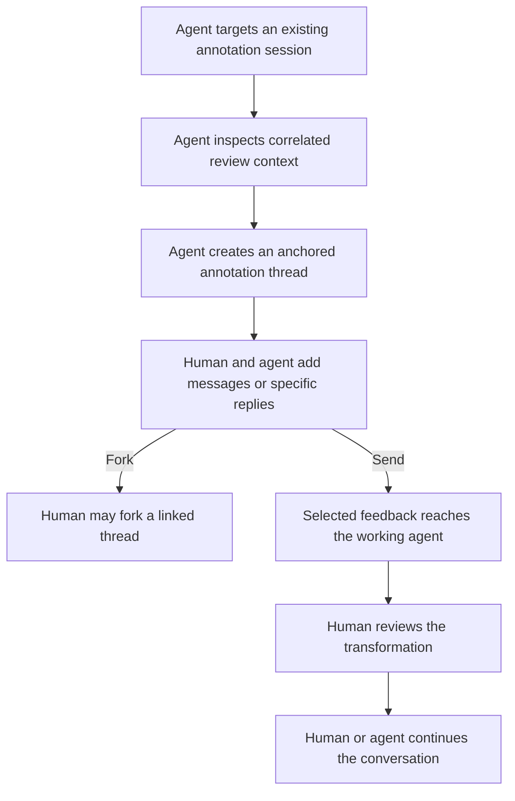

# Deprecated Worktree Annotations PR2 — User Requirements Draft

> Source material only. This document is not current requirements or design
> authority. The current design entry point is
> `../2026-08-06-worktree-annotations/README.md`.

## Purpose

PR2 extends the durable annotation sessions established by PR1 into a
bidirectional human-agent review system. A guided-review agent can target an
existing annotation session, inspect its correlated review context, create new
anchored threads, and participate in conversations. Agent Studio can also
deliver selected annotation data to a working agent without requiring the user
to copy and paste it manually.

PR2 adds threads and messages inside the sessions established by PR1. Human and
agent surfaces must share those PR2 conversations and the same PR1 anchors,
placement facts, and lifecycle; PR2 must not create a parallel agent-only
comment system. This record defines future required experience only. It does
not authorize a PR2 Specification, Program Design, implementation plan, or
implementation work.

## Source and authority

- Decision owner: Agent Studio owner.
- Primary evidence: the owner's guided-review, agent-reply, thread-creation,
  human-only-fork, and Priority 2 delivery decisions from the 2026-08-03 design
  conversation.
- PR1 foundation: `pr1-user-requirements.md`.
- The exact automated delivery mechanism is not selected. Terminal-pane or
  screen-control capabilities are candidates, not requirements.
- Current IPC and Bridge behavior is observational evidence to inspect before
  PR2 design; it does not dictate the product contract.

## Affected classes

### Human reviewer

Receives agent-authored findings in the same annotation session, discusses
them, deliberately forks conversations when the intent needs to split, and
retains final control over review organization.

### Guided-review agent

Targets an existing annotation session, reviews its worktree subject, creates
anchored findings, and participates in the resulting conversations through
Agent Studio's programmatic interface.

### Working agent

Receives selected annotation data through an automated delivery path and may
retrieve or reply to correlated annotation conversations.

Multi-user collaboration, external code-host review, review administration,
and issue tracking remain outside PR2.

## PR2 experience at a glance



```text
guided-review agent targets an annotation session
  → fetches the applicable source and conversation context
  → creates a new anchored thread
  → human or agent adds a thread-level message
  → human or agent replies to a specific message
  → only the human may fork an existing thread
  → selected feedback reaches the working agent automatically
  → human reviews the resulting transformation
```

## Conversation authority

```text
                                      human   guided-review   working
retrieve an existing session              —         yes           yes
create a thread in an existing session   yes        yes          open
add a thread-level message               yes        yes           yes
reply to a specific message              yes        yes           yes
fork an existing thread                  yes         no            no
```

Creating a thread introduces a new anchored observation or transformation
request. Forking takes an existing conversation and deliberately splits its
intent or resolution path into a separately managed, linked conversation.

## Required user outcomes

### P2-U1 — Target the correct annotation session

- Affected classes: guided-review agent and human reviewer.
- Need: A guided-review agent can target an existing annotation session and its
  reviewed worktree subject without relying on uncorrelated path or comment
  text.
- Why: Agent-authored review is useful only when both participants can identify
  the exact review context it belongs to.
- Evidence: direct owner guided-review requirement.
- Authority: authorized.
- Priority: must for PR2, assigned by the Agent Studio owner.
- Open product choice: who supplies or approves the target session and what
  happens when the target is detached, completed, missing, or no longer
  applicable.

### P2-U2 — Let the agent retrieve correlated review context

- Affected classes: guided-review agent and working agent.
- Need: Through Agent Studio's programmatic interface, either participating
  agent can retrieve the targeted session's applicable threads, messages,
  anchors, placement facts, and reviewed-source context.
- Why: The agent must understand what it is reviewing or answering instead of
  receiving isolated text.
- Evidence: owner request for fetching comments and guided-review correlation.
- Authority: authorized.
- Priority: must for PR2, assigned by the Agent Studio owner.
- Open product choice: whether a working agent may also create a new thread or
  only retrieve and participate in existing threads.

### P2-U3 — Let the agent create an anchored thread

- Affected classes: guided-review agent and human reviewer.
- Need: A guided-review agent can create a new annotation thread inside the
  targeted session and anchor it to the reviewed material it concerns.
- Why: Guided review must be able to point the human to a new finding rather
  than only respond to threads the human created.
- Evidence: explicit owner correction that agents can create threads.
- Authority: authorized.
- Priority: must for PR2, assigned by the Agent Studio owner.

### P2-U4 — Support thread-level messages from participants

- Affected classes: human reviewer, guided-review agent, and working agent.
- Need: The human or a participating agent can add a message to an annotation
  thread without claiming it is a reply to one particular prior message.
- Why: Some contributions advance the conversation as a whole.
- Evidence: explicit owner requirement to comment on a thread.
- Authority: authorized.
- Priority: must for PR2, assigned by the Agent Studio owner.

### P2-U5 — Support replies to a specific message

- Affected classes: human reviewer, guided-review agent, and working agent.
- Need: The human or a participating agent can reply to a specific message
  while preserving which message the response addresses.
- Why: A thread may contain multiple claims or questions, and a reply must not
  become ambiguous about its immediate context.
- Evidence: explicit owner requirement for message-specific replies.
- Authority: authorized.
- Priority: must for PR2, assigned by the Agent Studio owner.

### P2-U6 — Reserve thread forking for the human

- Affected classes: human reviewer, guided-review agent, and working agent.
- Need: The human can fork an existing thread into a separately managed thread
  linked to its source thread or message. An agent cannot perform this action.
- Why: Forking reorganizes review intent and its resolution path; that
  organizational decision belongs to the human reviewer.
- Evidence: explicit owner decision that thread forking is user-only.
- Authority: authorized.
- Priority: must for PR2, assigned by the Agent Studio owner.
- Open product choice: whether the fork begins at the whole thread or a selected
  message and which source context it initially inherits.

### P2-U7 — Make participant identity and message relationships visible

- Affected classes: human reviewer and agent.
- Need: Each thread and message exposes whether it came from the human, a
  guided-review agent, or a working agent, and specific replies and forks
  retain their visible source relationship.
- Why: The human must be able to interpret a mixed human-agent review without
  guessing who asserted what or why a new conversation exists.
- Evidence: derived requirement from mixed human-agent conversation and
  human-only fork authority.
- Authority: unresolved pending explicit owner confirmation.
- Priority: should for PR2, proposed by the requirements author; owner decision
  required.

### P2-U8 — Preserve one conversation across human and agent access

- Affected classes: human reviewer and agent.
- Need: File View, Review View, and programmatic agent access expose the same
  session, thread, message, anchor, placement, and lifecycle facts.
- Why: Separate UI and agent comment stores would lose replies, duplicate
  findings, and break review correlation.
- Evidence: owner requirement for one generic system usable by Agent Studio and
  guided-review agents.
- Authority: authorized.
- Priority: must for PR2, assigned by the Agent Studio owner.

### P2-U9 — Deliver selected annotation data to the working agent

- Affected classes: human reviewer and working agent.
- Need: The reviewer can send selected threads or messages to the working agent
  without manually copying and pasting them. Agent Studio tracks the resulting
  delivery independently from the selected transport so the reviewer can tell
  what happened without treating batch creation or clipboard copy as delivery.
- Why: Automated delivery shortens the review-to-transformation feedback loop
  after the durable PR1 workflow is proven. Delivery tracking must remain useful
  as transports evolve rather than binding review history to one mechanism.
- Evidence: owner designation of automated delivery as Priority 2.
- Authority: authorized.
- Priority: must for PR2, assigned by the Agent Studio owner.
- Open product choice: terminal-pane or screen control, another agent transport,
  or a combination. Requirements do not select the mechanism.

### P2-U10 — Continue the transformation review cycle

- Affected classes: human reviewer and working agent.
- Need: After automated delivery or guided-review discussion, the human can
  inspect the resulting worktree transformation, continue the relevant thread,
  or resolve the feedback without losing its session and source correlation.
- Why: Programmatic transport is useful only if it closes the same
  intent-to-transformation-to-verification loop established by PR1.
- Evidence: owner product direction and Priority 2 interaction decisions.
- Authority: authorized.
- Priority: must for PR2, assigned by the Agent Studio owner.

## PR2 goal boundary

- Primary goal: add bidirectional agent participation to the durable review
  sessions established by PR1.
- Affected outcomes: agents can retrieve context, create anchored findings, and
  converse; humans can understand and control the mixed review; selected data
  can reach a working agent without clipboard handoff.
- Existing foundation to reuse: the PR1 session, annotation, anchor, placement,
  lifecycle, File View, Review View, comparison, and persistence behavior; the
  existing Agent Studio programmatic-control and terminal capabilities are
  candidate foundations to inspect.
- Missing experience: session-targeted agent access, agent-created threads,
  shared thread messages and specific replies, human-only fork authority,
  visible participant relationships, automated delivery, and
  transport-independent delivery tracking.
- Allowed surface: Worktree Annotations UI and data, Agent Studio's existing
  programmatic-control boundary, and existing terminal/pane control capability.
- Non-goals: a parallel agent-only comment system, agent-created thread forks,
  multi-user collaboration, external code-host synchronization, issue tracking,
  a generic provider marketplace, and a new authentication or security system
  without separate owner approval.
- Complexity budget: extend the PR1 model and existing control surfaces. PR2
  does not authorize a new collaboration service, generalized message bus,
  exactly-once delivery system, or provider platform merely because more than
  one transport may eventually exist.

## Decisions required before any PR2 Specification

1. Session targeting and admission: who selects the session, how an agent proves
   which session it targets, and which session states admit agent writes.
2. Conversation lifecycle: human and agent resolution/reopening authority and
   how thread state relates to annotation state.
3. Participant identity: confirm whether PR2 must visibly distinguish the human,
   guided-review agent, and working agent on every thread and message.
4. Fork behavior: whether a human forks a whole thread or a selected message,
   what context the new thread inherits, and how the relationship is shown.
5. Automated delivery: the user-visible target selection, success/failure
   behavior, retry expectations, the delivery evidence exposed to the reviewer,
   and selected transport boundary. The transport may supply different evidence,
   but the requirement to track delivery does not depend on one mechanism.
6. Programmatic contracts: the minimum role-specific fetch, create-thread,
   add-message, reply-to-message, and read-back behavior, including whether a
   working agent may create threads or only a guided-review agent may do so.
7. Guided-review completion: what tells the human and agent that one guided
   review pass is complete without completing the whole annotation session.

PR2 requirements may inform PR1 compatibility decisions, but they must not
expand the PR1 Specification or Program Design. PR2 remains un-specified until
the owner explicitly starts that phase.
