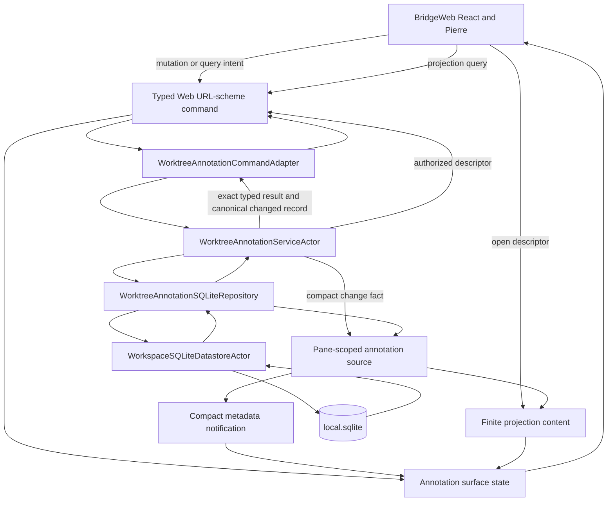
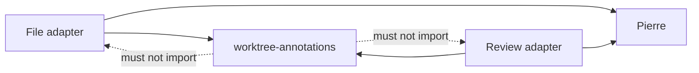
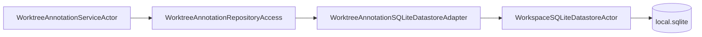
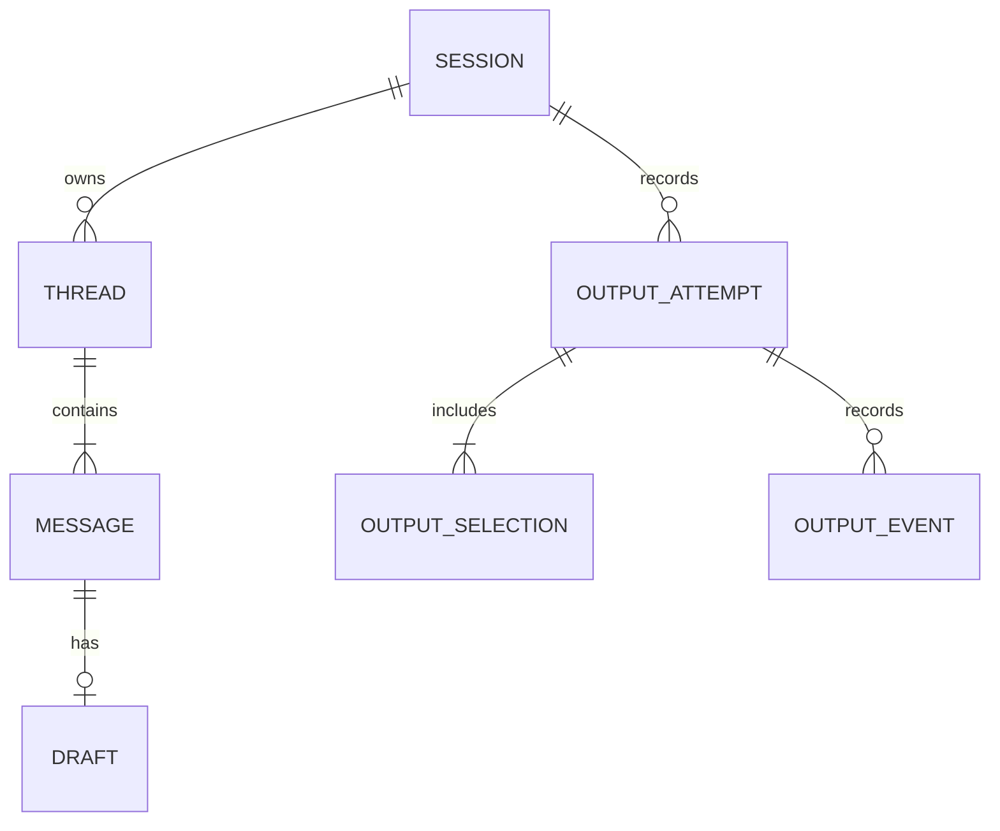
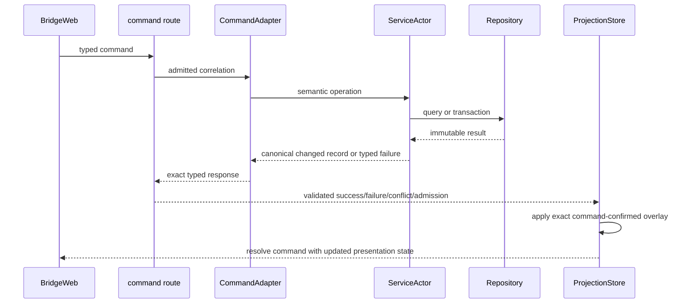
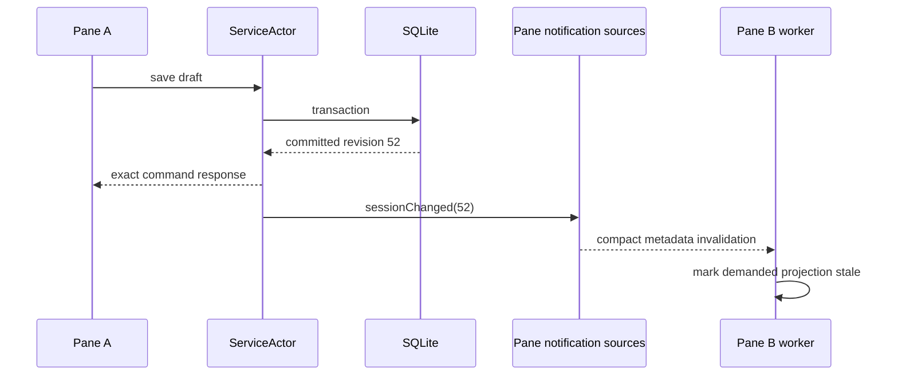
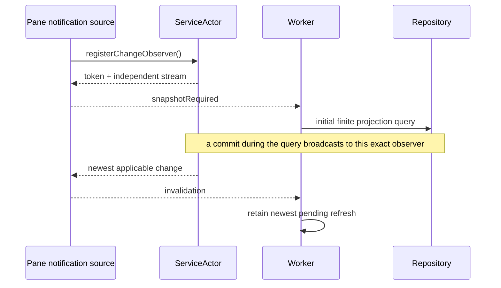
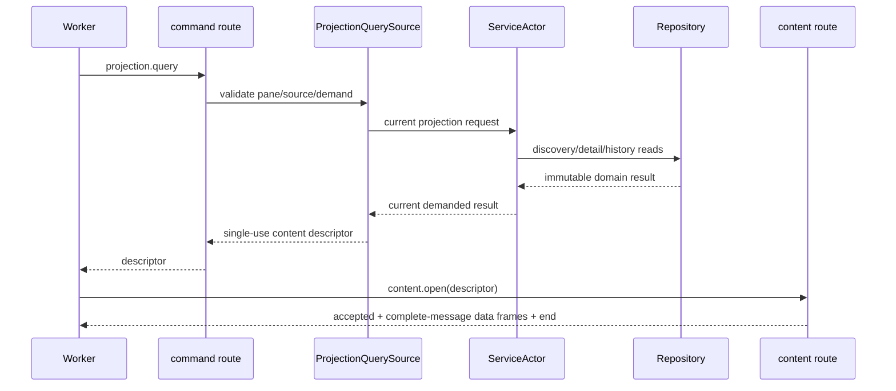
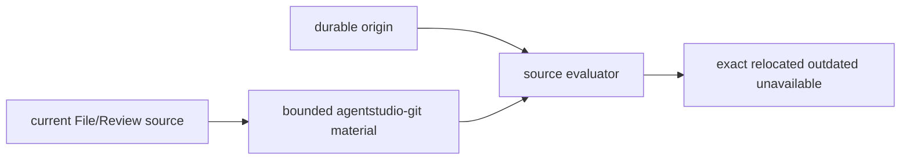

# Worktree Annotations PR1 — Program Design

This Program Design realizes
[`pr1-user-requirements.md`](pr1-user-requirements.md) and
[`pr1-specification.md`](pr1-specification.md). PR1 owns durable human-authored
worktree annotations, flat reply threads, source placement, and Copy/Export.
It does not add agents, delivery, App IPC, deletion, global/session/whole-file
comment UI, a side panel, or code mutation.

## Integrated architecture

Worktree annotations are a shared capability inside `AgentStudioBridge`.
File and Review are sibling presentation consumers. Neither owns annotation
truth. `local.sqlite` is authoritative; BridgeWeb is the only PR1 presentation
owner.

The load-bearing split is now explicit: SQLite owns durable truth, exact command
responses own initiating-view continuity, and finite projections own complete
cross-view convergence. A committed command is not forced to wait for the
projection route, and a projection route may not erase an exact committed
result while it catches up.



The three transport routes have separate jobs:

| Route | Direction | Annotation responsibility |
| --- | --- | --- |
| `agentstudio://rpc/command` | BridgeWeb to native and response | typed mutations, explicit queries, exact success/failure/conflict/admission result, content-descriptor issuance |
| `agentstudio://rpc/stream` | native to worker | compact snapshot-required, session-changed, discovery-changed, and recovery-changed notifications; no Markdown or message DTOs |
| `agentstudio://rpc/content` | native to worker | finite demanded annotation projections and exact output bytes |

The Swift development backend maps these same contracts to
`/__bridge-product/command`, `/__bridge-product/stream`, and
`/__bridge-product/content`. It is an adapter, not a second architecture.

The proof harness drives the same production React, comm-worker, HTTP adapter,
service, repository, and SQLite path. Direct HTTP tests remain a lower proof
layer because they do not exercise browser command correlation, subscription
consumption, projection installation, or React continuity.

## Structural choice

Four structures were credible:

| Structure | Gain | Cost | Decision |
| --- | --- | --- | --- |
| MainActor projection Atom between repository and Bridge | cached current snapshot and synchronous fan-out | duplicates SQLite/browser state, globalizes pane placement, routes command results through shared presentation, republishes complete data, has no SwiftUI consumer | rejected |
| Complete annotation bodies on metadata subscriptions | automatic push to every subscriber | lossless shared-queue admission, complete-revision assembly, annotation-specific resync, eager/streaming packing complexity | rejected |
| Receipt-only command response; UI waits for finite projection before presenting Save | smallest response | committed messages disappear or stay in editor when projection is delayed/unavailable; initial empty projection can masquerade as current truth | rejected |
| Direct actor service and repository; complete changed-message command receipt; compact invalidation; finite demanded projection | one durable authority, immediate exact initiating-view continuity, replaceable notifications, content backpressure isolated from metadata | surface-lifetime command-confirmed overlay and explicit reconciliation lifecycle | selected |

The selected design spends one application actor, one compact change stream,
one notification source, one finite projection query/content source, and one
surface-lifetime browser command-confirmation overlay inside the existing annotation
projection store. It deletes the annotation Atom, lossless ordinary-metadata
FIFO, metadata event cursor, browser multi-event subscription assembler, and
annotation-subscription reopen protocol. The overlay is not a second durable
truth or output-membership owner; it exists only until a complete server
projection reconciles the exact committed receipt.

The overlay coalesces to the newest receipt per message. It clears entries on
same/newer complete-projection reconciliation and clears all transient entries
when the surface is disposed; reopening reads SQLite through the normal finite
projection path. It owns no timer, persistence, background retry, or cross-pane
fan-out.

## Target and folder boundaries

PR1 remains inside the existing `AgentStudioBridge` Swift target. A separate
feature target would create a dependency cycle around Bridge surface,
transport, pane-admission, and source-generation types without adding an
independent consumer.

```text
Sources/AgentStudio/Features/Bridge/
├── Models/
│   ├── WorktreeAnnotations/
│   └── Transport/WorktreeAnnotations/
├── Runtime/WorktreeAnnotations/
├── State/SQLite/WorktreeAnnotations/
└── Transport/WorktreeAnnotations/
```

| Path | Job |
| --- | --- |
| `Models/WorktreeAnnotations/` | pure domain identities, policies, source evaluation, output snapshots/projectors |
| `Models/Transport/WorktreeAnnotations/` | strict command, notification, projection-query/content, and output wire DTOs |
| `Runtime/WorktreeAnnotations/` | `WorktreeAnnotationServiceActor`, change publication, edit ownership, source capture/evaluation orchestration, output coordination |
| `State/SQLite/WorktreeAnnotations/` | repository protocol, datastore adapter, typed GRDB operations, recovery witness writer |
| `Transport/WorktreeAnnotations/` | command adapter, pane notification source, projection query/content source, output content source, New/All scope assembler |

Native AppKit effects stay in App composition:

```text
Sources/AgentStudio/App/Coordination/
└── WorktreeAnnotationOutputEffects.swift
```

BridgeWeb shared product code stays outside File and Review:

`BridgeWeb/src/worktree-annotations/` remains the existing flat feature-neutral
owner. The projection store/surface client, composer/thread presentation, Share
mode, output projection, and test support remain separated by descriptive file
names rather than a folder migration. The new shared viewer action-toolbar
wrapper belongs in `BridgeWeb/src/app/` beside the existing BridgeViewer chrome
and button wrappers; it does not belong to File, Review, or annotations.

File and Review contain only thin Pierre/source-range adapters:



## Actor and persistence ownership

Actor types touched or introduced by this correction use the `Actor` suffix:

- `WorkspaceSQLiteDatastoreActor` owns retained core/local database handles,
  connection and commit sequencing, boot preparation, and recovery.
- `WorktreeAnnotationServiceActor` owns annotation behavior, mutation
  serialization, edit ownership, recovery admission, source-refresh fences,
  and compact change publication.
- `WorktreeAnnotationOutputCoordinatorActor` owns prepare/effect/finalize
  sequencing for Copy and Export.

Repositories are not actors and do not open independent databases:



`WorktreeAnnotationSQLiteRepository` contains typed SQL operations. The adapter
submits them to the one datastore actor. No `WorktreeAnnotationSQLiteActor`,
second connection owner, or compatibility wrapper exists.

`State/MainActor/Persistence` remains reserved for persistence wrappers around
MainActor state. Direct annotation SQL belongs under
`Features/Bridge/State/SQLite/WorktreeAnnotations/`.

## Owned truth

| Truth or effect | Sole owner |
| --- | --- |
| sessions, threads, messages, saved bodies, optional drafts, immutable origins, output attempts/events/exact bytes, reversible handled disposition for exact output membership, recovery provenance | `WorktreeAnnotationSQLiteRepository` through `WorkspaceSQLiteDatastoreActor` |
| semantic command admission, edit-token ownership, demand/query policy, recovery mutation gate, change publication | `WorktreeAnnotationServiceActor` |
| active notification subscription, pane/worktree/source authority, current placement evaluation, projection descriptor reservations | pane-scoped annotation transport sources |
| exact mutation/query correlation result and complete canonical changed-message receipt | typed command response |
| pending/newest invalidation and in-flight projection query | worker annotation query controller |
| initial unknown/read convergence state, last complete fetched projection, surface-lifetime exact command-confirmed message overlays, overlay reconciliation, confirmed output-membership readiness | `WorktreeAnnotationProjectionStore` |
| inline thread expansion, active editor, focus, unsent text, active New/All Share mode | BridgeWeb annotation presentation state |
| clipboard replacement and save-panel/file write | App implementation of output-effect contract |

There is no `WorktreeAnnotationProjectionAtom`, annotation `AtomRegistry`
field, MainActor annotation read model, or SwiftUI annotation presentation in
PR1. If native UI later needs an open-thread count or recovery badge, it may
consume a separate small native summary as a sibling; BridgeWeb never reads
through that summary.

The corrected slice has these change reasons:

| Component | One job and reason to change | Consumers |
| --- | --- | --- |
| `WorktreeAnnotationSQLiteRepository` | atomically apply message-local, thread-local, session-local, and output-scope invariants | service and output coordinator |
| `WorktreeAnnotationTransportAdapter` | translate strict operations into domain calls and return canonical changed-message/tombstone receipts | command routes |
| `WorktreeAnnotationSurfaceClient` | correlate worker/product requests and install exact receipts before resolving initiating commands | React annotation components |
| `WorktreeAnnotationProjectionStore` | own Unknown/last-complete/read status, command overlays, reconciliation, and confirmed Share-membership readiness | all File/Review annotation presentation |
| worker annotation query controller | own one subscription, current query, newest invalidation, stale-source callback, and terminal convergence publication | comm-worker runtime protocol |
| `BridgeViewerActionToolbar` | own reusable in-flow viewer-toolbar layout and shadcn control scale | File/Review Share composition and later equivalent viewer action rows |
| Share-comments feature composition | supply labels, counts, scope, output actions, and errors without restyling shared controls | File and Review headers |
| `WorktreeAnnotationOutputHistoryControl` | own the collapsed in-flow history disclosure, exact-byte inspection, eligible unhandle, and explicit unknown-byte repetition through shared viewer controls | the shared File/Review Share composition |
| development-browser proof harness | own real backend/Vite/Chrome lifecycle, isolated data, marker, and cross-boundary observations | PR1 proof only; never production runtime |

File and Review adapters may map Pierre ranges and pass callbacks. They may not
own projection state, command receipts, Share control geometry, or output
membership.

## Durable state

The existing normalized `local.sqlite` schema remains authoritative:



Domain state remains:

```text
Session.lifecycle       living | completed
Session.relationship    applicable | uncertain | detached
Thread.resolution       open | resolved
Thread.origin           located | wholeFile | session
Message.status          editable | locked
Message.savedBody       String?
Message.draft           WorktreeAnnotationDraft?
Message.handled         Bool, for the exact current saved revision
```

The pre-release message row gains `handled`, defaulting to false. Output
membership already records each attempt's message identity and expected saved
revision. Known-success finalization sets `handled = true` for the exact
membership while locking any editable members. `Mark as not handled` resolves
the attempt membership and sets `handled = false` only where the current saved
revision still matches; it never unlocks or edits output records. A later known
success may set the same current revision handled again. Known failure,
cancellation, recovered unknown, and partial success do not set handled. These
transactions advance the session semantic revision and publish the ordinary
session-changed invalidation, so two panes reduce commands in repository commit
order and converge through the existing last-complete projection path.

PR1 creates only `located` thread origins. Retained `wholeFile` and `session`
variants have no PR1 UI. `paused` is not lifecycle state; uncertain
applicability belongs to the independent source-relationship axis. SQLite
stores textual product values without product-enum `CHECK`
constraints. Swift strict decoding and domain policy own product vocabulary;
SQLite retains keys, relations, nonnegative revisions, and byte-length
integrity.

Workspace identity is provenance only. Session discovery and applicability are
worktree-lineage scoped. The first annotation creates a session when none is
applicable; explicit choice is required only when several apply.

## Command request/response boundary

Every browser operation is a strict typed Web URL-scheme command. Transport
acceptance and semantic completion remain distinct, but the exact command
response is the caller's terminal result.



Command outcomes do not create a second native publication. Save completes from
its exact response; it does not wait for another pane or a projection fetch.

Every committed message mutation returns one strict `message` receipt containing
the complete canonical changed message record plus its thread context and the
committed session, thread, message, draft, and saved revisions. A command that
removes a never-saved message returns a strict message tombstone. The response
contains no arbitrary SQL row, placement guess, sibling message body, or output
membership claim.

`WorktreeAnnotationSurfaceClient` applies that receipt to the surface-lifetime
command-confirmation overlay before resolving the initiating command Promise.
The composer can therefore end editing immediately and the normal saved row is
already present when React processes success. The overlay is reconciled only by
a complete server projection containing the same or newer message revision. If
a same/newer projection contradicts or omits the receipt, the store retains the
receipt, marks convergence unavailable, and exposes the discrepancy rather than
silently deleting committed work.

Message-scoped commands use the message/draft revision and edit token as their
compare-and-swap fence. They transactionally recheck that the containing
session remains living/applicable, but the session semantic revision is a
returned convergence/invalidation fence rather than a write precondition for an
independent message. Thread resolution uses the thread revision. Session
lifecycle/continuity and whole-scope output retain session-level fences. This
prevents an unrelated message commit from turning a valid Save into `conflict`
without weakening same-message or session-writeability conflict detection.

The hard-cut message-mutation request therefore carries `messageId`,
`expectedMessageRevision`, the applicable `expectedDraftRevision`, and the edit
token. It does not use `expectedSessionRevision` as its conflict fence. Thread
resolution analogously carries `expectedThreadRevision`; session-level commands
retain `expectedSessionRevision`.

Reply creation is thread-scoped rather than session-scoped. The hard-cut
`reply.create` request carries `sessionId`, `threadId`,
`expectedThreadRevision`, body, and edit token; it does not use
`expectedSessionRevision` as a conflict fence. One repository transaction:

1. verifies the thread belongs to the named session;
2. rechecks that the session is living/applicable and the thread is open;
3. compares the thread revision;
4. allocates the next message ordinal under the same transaction;
5. inserts the reply draft and edit token;
6. advances thread and session semantic revisions; and
7. returns the complete canonical reply receipt before commit publication.

Concurrent reply creation or thread resolution against the same expected
thread revision conflicts. A commit to another thread or message in the same
session does not. The transaction and the existing per-thread ordinal
uniqueness constraint together prevent duplicate ordinals without making the
whole session a reply mutex.

## Compact change stream and metadata notification

After a durable mutation, the service emits one compact application fact:

```text
WorktreeAnnotationChange =
  sessionChanged(worktreeID, sessionID, semanticRevision)
  discoveryChanged(worktreeID)
  recoveryChanged
```

The service owns an explicit multicast observer registry; it does not share one
competing-consumer `AsyncStream`. `registerChangeObserver` is one synchronous
actor operation that installs an exact observer token and continuation, then
returns that observer's independently buffered stream. Each pane notification
source immediately emits `snapshotRequired` before permitting its worker to
begin the initial projection query. Commit broadcasts the applicable compact
fact to every registered observer. Stream termination removes the exact token;
pane close also unregisters it idempotently.

Each observer retains one aggregate pending notification. `snapshotRequired`
supersedes all narrower pending facts. Otherwise the aggregate retains the
newest semantic revision per applicable session plus discovery/recovery flags;
the pane source bounds that map to its demanded sessions. This is an
`AsyncStream` owned by `WorktreeAnnotationServiceActor`, not Swift Observation
or an Atom. Each pane source maps its aggregate into strict metadata events:

```text
AnnotationNotification =
  snapshotRequired
  sessionChanged(sessionID, semanticRevision)
  discoveryChanged
  recoveryChanged
```

Notifications contain no message body, thread DTO, output bytes, local path,
or pane placement. A newer pending notification supersedes an older one for the
same session; `snapshotRequired` supersedes all narrower pending notifications.



On subscription open or metadata reset/reopen, native emits
`snapshotRequired`. Missing intermediate notifications is safe because the
next finite query reads current repository truth. The existing generic
metadata reset/replay contract is sufficient; PR1 adds no lossless ordinary
metadata FIFO.



## Finite projection query and content response

The worker requests only current demanded data. A strict projection query names
surface, demanded session identities, current worker/source generation, and an
optional bounded cursor. Native revalidates pane/worktree/source authority and
does not trust a client repository path or SQL predicate.



The projection contains recovery status, session summaries, demanded session
details, applicable threads, current placements, and an optional continuation
cursor. Cold output history remains an explicit query. Exact Copy/Export bytes
retain their separate output content kind.

The first query establishes one logical projection snapshot identity, durable
semantic revision set, source generation, expected record/thread/message
counts, and aggregate integrity value. If the logical projection exceeds one
content result's 2 MiB ceiling, native retains that one immutable snapshot
behind an ordered page reservation. Every continuation cursor is opaque,
single-use, snapshot-bound, pane/worker/surface/source-authority-bound, and
ordered. A continuation can issue only the next page for that exact snapshot.

Every page repeats the logical snapshot identity and page ordinal. The worker
accumulates pages privately and installs nothing until the final-page marker,
expected aggregate counts, and aggregate integrity validate. A page from
another snapshot, generation, or ordinal poisons only the private replacement.
A newer invalidation cancels or retires the old page sequence, retains the last
complete installed projection, and starts a new full logical snapshot; pages
from different repository revisions are never mixed.

The content descriptor is request-scoped, single-use, authority-bound, and
byte-bounded. Stale/replaced descriptors produce accepted plus terminal error,
never application data.

## Complete-message framing

Each authored body is at most 16 KiB UTF-8. Native projection content emits
typed complete-message records. It dynamically packs multiple records while
the encoded data frame remains at or below 128 KiB; a message record is never
split.

```text
repository snapshot
  └─ projection record cursor
       ├─ projection header
       ├─ frame 1: complete messages 1...N
       ├─ frame 2: complete messages N+1...M
       └─ terminal end + integrity
```

The cursor retains the immutable query result, traversal indices, and one
current encoded batch. It does not materialize a second whole event array.
Content-route observation pacing admits the next batch at the consumer's drain
rate. Annotation records do not compete with pane/File/Review metadata and do
not require shared metadata-capacity arbitration.

The worker stages one finite response privately and installs it only after
validated terminal completion. A partial or failed response never replaces the
last complete projection.

## No-gap bootstrap and query coalescing

A pane source registers its exact multicast observer before starting its
initial query. If a mutation commits while the query or any page is in flight,
the source/worker retains one newest aggregate invalidation, prevents the stale
logical snapshot from installing, and performs another current query after the
old request is cancelled or settles.

```mermaid
stateDiagram-v2
    [*] --> Unknown
    Unknown --> Refreshing: snapshotRequired or active demand
    Refreshing --> Ready: complete current response and no newer invalidation
    Refreshing --> Refreshing: newer invalidation cancels/replaces current query
    Ready --> Refreshing: applicable invalidation and live current query
    Refreshing --> Unavailable: real current-read failure; retain last complete
    Unavailable --> Refreshing: retry/new invalidation/reactivation
    Ready --> ReadyWithOverlay: exact committed message receipt
    Refreshing --> RefreshingWithOverlay: exact committed message receipt
    Unavailable --> UnavailableWithOverlay: exact committed message receipt
    ReadyWithOverlay --> Ready: complete projection reconciles receipt
    RefreshingWithOverlay --> Ready: complete projection reconciles receipt
    UnavailableWithOverlay --> Ready: retry completes and reconciles receipt
    Ready --> Inactive: surface inactive
    Inactive --> Refreshing: reactivate stale/unknown
```



One surface has at most one projection query in flight and one newest pending
invalidation. Draft revisions 11...15 may coalesce to 15 for presentation;
SQLite retains every completed transaction.

`Unknown`, `Ready`, `Refreshing`, and `Unavailable` are read-convergence states
owned by the browser projection store. `Unknown` has no server snapshot and is
not represented by the empty-ready singleton. A confirmed empty projection is
possible only after a complete query validates and installs it. Share counts
are unavailable while server membership is unknown; the UI renders an unknown
marker instead of zero and disables output destinations.

Read-convergence state never extends or reinterprets a mutation command. The
composer ends Save progress from the exact command response. The projection
store derives inline presentation from its last complete server snapshot plus
command-confirmed overlays while a replacement refreshes or fails.
Output membership derives only from a complete current server snapshot with no
unreconciled overlay affecting the selected scope.

Stale-source recovery is an explicit application edge, not a swallowed generic
request error. The annotation projection query result is a closed union:

```text
BridgeProductAnnotationProjectionQueryResult
  = { kind: "content"; descriptor }
  | { kind: "source_stale"; currentSourceGeneration }
```

On `source_stale`, `BridgeCommWorkerAnnotationProjectionQueryController`
publishes one typed
`BridgeCommWorkerAnnotationProjectionSourceAuthorityStalePublication` carrying
`surface`, `requestedSourceGeneration`, and `currentSourceGeneration` through
its `onSourceAuthorityStale` callback. It does not publish `Ready`, discard the
last complete projection, or leave an unowned `Refreshing` wait.

`BridgeCommWorkerProductController` receives that publication and calls
`reconcileAnnotationProjectionSourceAuthority` on the existing
`registerBridgeCommWorkerRuntimePortProtocol` owner. That owner performs the
normal source-authority reconciliation: File re-runs `file.source.current` and
replaces the File metadata subscription; Review reopens Review metadata and
waits for the next admitted review-source publication. Only those existing
File/Review owners may update pane presentation and the authoritative source
generation. Their accepted publication then calls
`setAnnotationProjectionSurfaceActive` for File or
`setReviewAnnotationProjectionGeneration` for Review, which republishes demand.

If the reconciled authoritative generation is strictly newer than the
requested generation, the query controller starts one query for that newer
generation. If reconciliation produces no newer authority, reports the same
generation unavailable, or its owning metadata source fails, the product
controller calls `sourceUnavailable` and the projection store receives
`Unavailable` while retaining last-complete plus command-confirmed state. No
timer, polling loop, annotation-owned source mutation, or same-generation retry
loop exists.

## Source origin and placement

The repository stores immutable source origin and accepted continuity evidence.
Current placement is pane/source derived and belongs to the pane query source,
not application-global state.



Located admission comes only from Pierre source/diff line presentation. Origin
captures repository-relative path, side/role, start/end line, selected excerpt,
and source identity. Production Git/source reads use Swift and
`agentstudio-git`; TypeScript Git remains Vite/test-only.

Continuity and placement remain independent:

- missing evidence produces uncertain relationship;
- different lineage produces detached relationship;
- exact/relocated/outdated/unavailable describes current placement;
- reviewer chooses uncertain continuity;
- resolve/reopen changes only whole-thread resolution.

## Draft and edit lifecycle

BridgeWeb owns unsent text after the last accepted flush. The service actor owns
one live edit token per message/owner generation and validates repository
revisions before mutation.

```text
empty composer
  └─ first non-whitespace edit
       └─ create durable draft
            ├─ debounce 1 second after latest edit
            ├─ max wait 5 seconds during continuous editing
            ├─ immediate flush on focus loss/Escape/outside close
            ├─ Save: flush then save current body and clear draft
            └─ Revert: clear draft; remove never-saved message when applicable
```

Each command receives an exact typed result. The local editor remains mounted
while an invalidation-triggered finite refresh runs. Equal or stale responses
cannot overwrite newer local text or release the edit token.

On Save, the scheduler flushes the current body, then issues one message-scoped
save command using the exact latest message/draft receipt. The complete saved
message returned by that command is installed before Save resolves, so the
editor can close without waiting for projection convergence. Another message's
session advancement cannot invalidate this message-scoped cursor. Same-message
revision drift, changed edit ownership, or a non-writable session still returns
an exact no-mutation conflict.

Session, thread, message, and draft transitions remain those defined by the
Specification. Messages become locked only through successful or recovered-
unknown output semantics. Once saved, a message is edited only through a new
draft; the saved message itself is never rewritten in place without the
validated Save transition.

## BridgeWeb and Pierre presentation

Shared annotation components live under `BridgeWeb/src/worktree-annotations/`
and compose owned shadcn primitives. File and Review supply thin Pierre range
adapters. No global/session/whole-file annotation panel or side panel exists.

File and Review content headers each compose the same shared Share-comments
control. The trigger is a `BridgeViewerButton`, not a route-local `Button`
recipe. Activating it inserts a shared `BridgeViewerActionToolbar` between the
content header and Pierre canvas. That feature-neutral wrapper owns the same
header background/border roles, 24 px control geometry, 11 px typography,
radius, spacing, focus, hover, selected, pressed, and disabled semantics used by
the existing BridgeViewer content header and context controls. File and Review
pass values and callbacks only; neither may restyle the toolbar.

The toolbar composes owned shadcn `ToggleGroup` and `Button` primitives through
the shared BridgeViewer wrappers. `New | All` uses the shared compact segmented
control. Copy Markdown and Export JSON use the same neutral action treatment;
neither is primary. Done uses the quiet exit treatment. The toolbar uses
viewer-header roles, never comment-card surface roles. It is `min-height: 36px`
and may grow in document flow at narrow width; it never floats, clips actions,
or creates a nested scroll surface.

BridgeWeb owns the transient `new | all` display choice; the
projection supplies authoritative counts and per-current-saved-body membership.
The selected choice filters inline comment presentation and is passed directly
to output preparation. There is no independent candidate list, checkbox state,
selected count, popover, dialog, nested scroll area, or thread-owned output
entry point.

One pure shared projection derives Share presentation from the last complete
annotation snapshot. It filters messages at message granularity, then derives
each surviving thread's one-message or multi-message compact/expanded shape
from only the participating messages. Exact and relocated threads flow through
the existing File/Review Pierre adapters. Outdated and unavailable messages
flow to `WorktreeAnnotationOtherSavedComments`, an in-layout sibling below the
Pierre canvas using original location and placement-warning data. Hidden
messages are absent from rendered, keyboard, and accessibility traversal.

```text
one-message thread
  inline = M1

multi-message thread
  inline = M-summary + M-last

expanded inline thread
  chronology = M-summary + M1 ... Mn exactly once
```

The compact surface owns one rounded boundary, avatar/timeline row, top-aligned
body, vertically stacked right command column, and separate timeline actions.
M-summary is derived presentation, never stored/selectable/exportable/replyable.

Core command ownership remains:

| Surface | Commands |
| --- | --- |
| single M1 right column | Reply, primary-tint Resolve/Reopen |
| multi-message right column | Reply, primary-tint Resolve/Reopen |
| composer right column | Revert, primary Save |
| timeline row | status plus quiet shadcn toolbar actions: Expand/Collapse when multi-message, immediately before More; no output entry, inclusion toggle, circular message chrome, or Edit/Reply/Resolve duplication |
| File/Review header | Share comments entry; in-flow New/All, Copy Markdown, Export JSON, Done, and collapsed History disclosure |
| expanded thread level | Resolve/Reopen once |
| expanded message | Reply; guarded body click or focused Enter edits |

Focus activates the thread and paints its complete stored range. Focus alone
does not expand the chronology. Expand/Edit/Reply expand the same Pierre
annotation row into one timeline containing M-summary followed by M1 through Mn
exactly once. The keyed M-last remains mounted while earlier messages are added.
Pierre remeasures the row and remains the sole scroll owner; the thread adds no
nested scrollbar or floating chronology layer. Escape exits editing first, then
collapses the thread; outside click flushes active work and collapses; final
focus returns to the invoking control. Sticky controls for threads taller than
the viewport are deferred until this basic inline interaction is accepted.
Expanded message nodes use a 4 px comment-owned gap and a neutral semantic rail;
they do not add an outer bordered surface.

Range state is a browser discriminated union: none, pending range, or saved
thread range. Only the active pending/thread range is painted. Selection,
another range, `+`, outside click, or Escape clears according to the
Specification.

While Share comments is active, body activation continues to paint the exact
saved Pierre range without using body click to begin Edit. Explicit Edit,
Reply, and Resolve/Reopen controls retain their normal admission; their command
results may invalidate and refresh New/All membership. Escape and Done close
Share comments without an effect. Pierre keeps selected source lines on its
selection paint and the full
annotation row on `--diffs-annotation-bg`. The active standalone thread frame
uses `--comment-active-surface`, a 14% translucent overlay derived from the
inherited `--diffs-selection-base`, and caps responsively at 48rem. The
discoverable Edit action remains inside More outside Share mode;
non-interactive body click and focused Enter also begin Edit outside Share mode.

When no complete server projection exists, Share shows unknown membership and
keeps Copy/Export disabled; it never derives `0` from the empty initialization
shape. When a last complete projection exists but a successor is refreshing or
unavailable, the toolbar labels counts as last-known and keeps the read-state
warning distinct from output command progress. Exact command-confirmed overlays
remain visible inline but cannot silently enter New/All until server projection
reconciliation establishes the fenced output membership.

The same `WorktreeAnnotationShareSurface` composes
`WorktreeAnnotationOutputHistoryControl` immediately after the Share action row
in both File and Review. The control uses the shared BridgeViewer action-toolbar
wrappers and viewer-header roles; it does not import raw `Button` geometry or
comment-card surface/border roles. When history is non-empty it renders one
collapsed `History (n)` disclosure in document flow. Reopening Share after a
toast expires exposes the disclosure again. Expansion shows compact attempt
rows with output kind, count, time, and state plus exact Inspect, eligible
`Mark as not handled`, and explicit Repeat only for unknown attempts.
Finalization-failed attempts remain inspectable but cannot repeat a known
external effect. Inspection may bound its preview region, but the Share/History
composition does not become a nested page scroll owner. Closing Share hides the
disclosure without deleting history.

## Output preparation and effects

Copy and Export use one immutable repository snapshot and record the exact
batch before invoking App effects. The prepared attempt plus its exact
membership is also the durable provisional write fence; PR1 adds no third
message status.

Current placement is not repository truth. Before output preparation, the
pane-scoped command adapter obtains or refreshes an authoritative placement
snapshot from the same pane/source-generation authority used by projection
queries. That immutable handoff contains the placement map, surface, source
generation/epoch, and source identity fence. The service passes it into the
output coordinator; the prepare transaction revalidates session/message
revisions and persists the exact placement-bearing batch before any external
effect. Browser paths or placement claims are never trusted.

```mermaid
sequenceDiagram
    participant UI as BridgeWeb
    participant Pane as Pane command/source adapter
    participant Service as ServiceActor
    participant Repo as Repository
    participant Coordinator as OutputCoordinatorActor
    participant Effect as App output effect

    UI->>Pane: output.scope.commit(scope, displayed projection/source fence)
    Pane->>Pane: obtain/refresh native placement snapshot and source fence
    Pane->>Service: fenced scope + immutable placement handoff
    Service->>Repo: atomically validate session/source fence
    Service->>Repo: transaction stores exact batch, membership, and provisional write fence
    Repo-->>Coordinator: immutable prepared output
    Coordinator->>Effect: clipboard or save-panel/file effect
    alt effect known success
        Coordinator->>Repo: finalize success, lock editable messages, mark exact membership handled
    else effect known failure or cancellation
        Coordinator->>Repo: cancel attempt and release provisional fence
    else effect known success and finalize fails
        Coordinator-->>UI: partial success; retain locks, handled remains false
    else result unknown after restart
        Coordinator->>Repo: mark unknown and lock editable messages
    end
```

Markdown and JSON project from the same immutable batch. Markdown has one H1
packet hierarchy, path/file headings, explicit line-numbered excerpts, authored
Markdown bodies, and `---` separators. Message Markdown admits H2-H6 but no H1,
raw HTML, or unsafe link destinations. JSON is versioned, strict, and preserves
the same message/order/origin/placement facts.

Clipboard and Export success show the shared Sonner toast and close Share
comments; neither resolves threads. Export uses the native save panel. Once
output succeeds or is recovered unknown, included editable messages are locked
but remain replyable and output-eligible. Known success marks the exact current
saved membership handled by default. The toast and durable history invoke the
same repository command to mark that exact membership not handled; this changes
New membership only and never unlocks messages or rewrites output history.
Output history stores exact bytes, membership, format, destination metadata
permitted by policy, status, handling disposition, and events. Unknown
repetition uses stored exact bytes and does not rerun current formatting.

Preparation inserts the attempt and membership in the same transaction that
validates the displayed scope. Every message-editing transaction consults that
membership and rejects mutation of the matching saved revision while its
attempt is `prepared`; this is the provisional write fence. The message remains
`editable` in durable domain status so a known no-effect failure can release the
fence without inventing an unlock transition. Reply creation remains allowed
because it creates a different message.

The outcome transition owns fence resolution:

| Attempt outcome | Durable transaction and message effect |
| --- | --- |
| known effect failure or save-panel cancellation | set attempt `cancelled`; the membership no longer blocks writes; do not lock or handle |
| effect success and finalization success | set attempt `succeeded`, create output event, change included editable messages to `locked`, and mark matching current saved revisions handled atomically |
| effect success but finalization cannot complete | retain the prepared membership as a write fence; when finalization-failed state can be recorded, lock matching messages and keep handled false |
| process exits while attempt remains prepared | boot recovery changes it to `unknown` and locks matching messages in one transaction; handled remains false |
| recovered unknown repetition | create a new prepared attempt from the stored exact bytes and membership; apply the same fence/outcome rules without rebuilding New/All |

Therefore no crash window exists in which a prepared saved revision may be
edited and later mistaken for the bytes already handed to the App effect. A
known no-effect outcome releases provisional immutability; success, partial
success, and crash-unknown preserve immutability. If the external effect is
known successful but the finalization-failed write itself cannot commit, the
still-durable `prepared` membership continues to block edits and boot recovery
classifies it as unknown.

The scope command carries the displayed annotation projection revision, active
session semantic revision, and File/Review source generation. The pane adapter
and repository validate those fences before preparation. A mismatch returns the
existing exact conflict outcome with no effect; BridgeWeb keeps Share comments
open and lets ordinary invalidation/query convergence install the successor.
The command never re-evaluates a newer repository scope behind an older visible
projection.

`output.handled.clear(attemptID, expectedSessionRevision)` is the one reversible
handling command used by both toast and history. It resolves stored attempt
membership, checks every current saved revision, clears handled atomically, and
returns an exact committed/conflict result. It does not reconstruct output or
repeat an external effect.

## Failure and recovery

| Failure/interleaving | Containment and recovery |
| --- | --- |
| command validation/conflict fails | exact typed failure response; SQLite and current browser projection unchanged; a different message's commit is never sufficient conflict evidence |
| repository commit succeeds before invalidation/projection | complete canonical changed-message response installs command-confirmed presentation; durable result remains authoritative; same-message stale retry conflicts; reconnect queries current truth |
| compact notification is superseded | newest applicable invalidation causes a current query; no durable data loss |
| metadata stream resets/reconnects | notification subscription reopens and emits `snapshotRequired` |
| query descriptor stale/replaced | accepted then terminal error; last complete browser projection retained |
| finite projection fails or ends incomplete | staged response discarded; last complete projection and editor retained; retry on new invalidation/reactivation/explicit retry |
| newer invalidation arrives during query | retain one newest pending invalidation; stale result is not installed as current |
| no complete projection has installed | state remains Unknown/Refreshing/Unavailable with unknown membership; never publish ready-empty or zero Share counts |
| projection returns stale source authority | request existing pane-presentation/source reconciliation; retry on newer generation or publish unavailable on same-generation source failure; never remain silently refreshing |
| surface becomes inactive | cancel foreground query, retain last complete projection, clear transient demand |
| pane/session closes | cancel notification/query/content tasks and release reservations/edit owner generation |
| source evaluation unavailable | durable origin remains; current placement is unavailable; no fabricated exact placement |
| local DB classified corrupt | quarantine DB/WAL/SHM, create fresh DB, write durable recovery witness, expose recovered-degraded, reject mutations until explicit acknowledgement |
| output prepare races message mutation | one repository transaction wins; a winning prepare installs the durable membership fence, while a winning mutation makes the displayed scope fence conflict with no effect |
| output effect is cancelled or fails before effect | cancel the prepared attempt and release its membership fence; leave message status and handled state unchanged |
| output effect succeeds but finalization fails | close Share comments with a partial-success warning; prepared membership remains a durable write fence, any recordable finalization-failed transition locks members, handled remains false/New, and no ordinary retry or Mark as not handled is offered; boot recovers an unfinalized prepared attempt as unknown |

Recovery provenance is written by `WorkspaceSQLiteDatastoreActor` during
quarantine-and-replace so “annotations lost in recovery” differs durably from
“annotations never existed.” Quarantined sidecars remain on disk. Existing
`PersistenceRecoveryReporter`/Inbox notification composition informs the
reviewer; PR1 adds no new global annotation panel.

## Concurrency and consistency

- `WorkspaceSQLiteDatastoreActor` serializes physical database access and owns
  retained connections.
- `WorktreeAnnotationServiceActor` serializes semantic commands, live edit
  ownership, recovery admission, and change publication.
- Repository transactions assign durable semantic revisions and validate the
  narrowest owning revision atomically: message/draft for message edits, thread
  for resolution, session for lifecycle/continuity and whole-session output.
  Every transaction also rechecks session writeability. Session revision is not
  a message-level mutex.
- Reply creation compares the owning thread revision, checks open-thread and
  writable-session state, allocates its ordinal, inserts the draft, and advances
  thread/session revisions in one transaction. Other threads/messages do not
  conflict; same-thread reply/resolution overlap does.
- One pane notification source observes the service stream; notifications are
  replaceable state-change facts, not durable events.
- One worker surface controller owns at most one finite query and one newest
  pending invalidation.
- Projection descriptors are single-use; content reservations settle on
  success, cancellation, error, replacement, or pane close.
- Browser installation is all-or-nothing after finite terminal validation.
- Exact committed message receipts install into a surface-lifetime overlay before the
  command Promise resolves; complete projections reconcile overlays by
  message revision and cannot silently replace a newer receipt.
- Output coordinator permits one in-flight output attempt per session and
  records prepare plus its provisional membership fence before external effect
  before finalize. Message mutations enforce that fence from SQLite state.

No timer, polling, queue-limit increase, durable pending-frame store, second
physical transport, or observation-pacing reuse is introduced for metadata.

## Trust, privacy, accessibility, and observability

The existing pane capability and product-session admission gates authorize all
three URL-scheme routes. Native validates worktree/source containment and never
accepts a client path as repository authority. Strict JSON rejects unknown
members and invalid discriminants. Generated output excludes absolute local
paths, credentials, provider-native identifiers, and secret material.

BridgeWeb rendering uses the existing safe Markdown posture. Icon-only controls
have canonical accessible names and tooltips. Keyboard order, two-stage Escape,
focus return, collapsed-content exclusion, narrow width, 200% text, and reduced
motion are proven in browser and packaged WKWebView.

Telemetry records bounded identifiers/hashes, operation class, result,
revision, frame/byte counts, query/cancellation/terminal disposition, and
latency. It never exports authored bodies, excerpts, exact output bytes, raw
paths, edit tokens, or SQL errors over OTLP.

The closest existing packaged-debug path is Review comparison-target query:
command authorization, descriptor reservation, `content.open`, native capture,
encoding, and terminal content response. Historical VictoriaLogs contain 20
complete scenario operations over 159 B...10.3 KiB payloads: median 10.32 ms,
19/20 at or below 19.33 ms, and one 89.80 ms scheduling outlier. Native
authorization and encoding were negligible; descriptor reservation age and
native capture dominated. This is feasibility evidence, not fresh annotation
proof or an ordinary-user latency guarantee.

PR1 adds one correlated marker-scoped measurement:

```text
annotation.projection.invalidate_to_ready_ms
  command response
  notification delivery
  query authorization
  SQLite read
  projection/placement construction
  descriptor reservation age
  content transfer
  worker validation
  browser installation
  Pierre paint fulfillment
```

Normal invalidation-to-Pierre paint targets below 50 ms, with below 100 ms as
the scheduling-variance diagnostic threshold. A threshold miss triggers phase
inspection; it does not authorize route merging, queue-limit changes, polling,
or proof weakening.

## Real development-browser proof boundary

The fastest complete product proof is one owned development harness, not a
manual pairing of independently launched processes:

```text
real Chrome page
  -> Vite-served production React composition
  -> production annotation surface client
  -> production comm worker and product transport
  -> Vite proxy
  -> real Swift development HTTP adapter
  -> WorktreeAnnotationServiceActor
  -> WorktreeAnnotationSQLiteRepository
  -> isolated local.sqlite

observations return through
  <- exact command response and command-confirmed overlay
  <- real metadata invalidation subscription
  <- real projection query + content frames + terminal
  <- React/Pierre DOM and read-state presentation
  <- marker-correlated worker/native telemetry and SQLite state inspection
```

This harness owns the Swift backend and Vite process lifetimes, isolated data
root, pane/worktree seed, ports, and one fresh proof marker. It launches the
Swift producer with the shared loopback OTLP configuration and records worker
telemetry through Vite's existing telemetry sink. Correlation includes bounded
operation class, request/outcome class, projection-state transition, source
generation, revision/count facts, and timing; it excludes authored bodies, raw
paths, edit tokens, exact output bytes, and SQL errors.

The required save/convergence scenario uses production UI interactions to:

1. begin from `Unknown`, reach the first complete `Ready` projection, and prove
   unknown membership was never rendered as confirmed zero;
2. create, flush repeatedly, and Save one message, proving the exact saved row
   remains continuously visible before finite projection reconciliation;
3. create and Save a second message in the same session, proving the first
   message's commit does not cause an unrelated conflict;
4. observe compact invalidation, query/content completion, overlay
   reconciliation, and return to `Ready`;
5. reset/reopen the metadata stream and prove a fresh current query converges;
6. restart the backend over the same isolated data root and prove both saved
   messages restore without a fabricated empty interval.

Direct repository/service tests prove transaction semantics. Direct Swift HTTP
tests prove adapter and carrier contracts. Mocked browser tests prove React and
worker state machines under controlled inputs. None crosses the complete
production seam above, so none may substitute for this development-browser
gate. Packaged WKWebView and native clipboard/save-panel proof remain the final
product boundary above it.

## Cutover

The output call path changes in place:

| Behavior | Current edge | Target edge | Status |
| --- | --- | --- | --- |
| initial browser state | ready-empty singleton before any annotation query | explicit Unknown with no server snapshot; Share membership unavailable until first complete query | changed |
| message command response | revision-only receipt; composer waits for projection to become a saved row | complete canonical changed-message/tombstone receipt installs command-confirmed overlay before Promise resolution | changed |
| message conflict fence | every message mutation compares whole-session revision | message/draft/edit-token CAS plus transactional session-writeability check; session revision remains convergence fence | changed |
| reply-create conflict fence | whole-session revision plus next-ordinal lookup | thread revision plus atomic open/writable check, ordinal allocation, insert, and complete reply receipt | changed |
| projection stale-source handling | stale-source error can settle without a new state publication | explicit source reconciliation request; newer generation retries, same-generation failure becomes unavailable | changed |
| output entry | thread More or rail handoff opens `WorktreeAnnotationOutputControls` Popover | shared File/Review content-header trigger opens in-flow Share comments | changed |
| Share chrome | route-local comment-surface row with direct primitive recipes and solid-primary Export | shared BridgeViewer trigger/action-toolbar wrappers, shared segmented control, viewer-header roles, peer-neutral Copy/Export, quiet Done | changed |
| presentation | candidate query feeds paged checkbox list and selected count | complete current projection derives message-filtered New/All inline threads plus Other saved comments; unknown never becomes zero | changed |
| membership command | `output.selection.begin/chunk/commit` transfers explicit/all-eligible selection | one `output.scope.commit` carries New/All plus displayed projection/session/source fence | changed |
| native preparation | adapter filters only editable saved messages and assembles current repository membership | adapter validates the displayed fence and assembles editable or locked saved messages in the displayed scope | changed |
| success | finalize locks members and records exact output | finalize also sets exact current members handled; UI toast dismisses Share comments | changed |
| unhandle | no predecessor | toast/history invoke `output.handled.clear` against exact attempt membership | added |
| history inspect/repeat | thread-rail history control using comment-card roles | shared File/Review Share surface owns an in-flow History disclosure using viewer-header wrappers; exact inspection/repetition remain and success adds durable unhandle | changed owner/presentation, preserved effects |
| failure/cancellation | typed output outcome keeps Popover open | typed outcome keeps Share comments open with no lock/handled transition | changed presentation, preserved effect semantics |
| partial success | effect occurred, finalization failed, Popover remains | Share comments closes; warning retains prepared/unknown inspection; locked members remain New | changed |

`WorktreeAnnotationOutputCandidateSelection`, output-candidate query routing,
temporary `outputSelection`, and thread-owned output composition are removed in
the same cutover. Output history inspection/repetition, immutable batch
projectors, App clipboard/save-panel effects, exact command settlement, compact
invalidations, and finite projection/content routes remain authoritative.

This is a hard cutover with no compatibility path:

```text
delete annotation projection Atom and AtomRegistry field
delete Store-to-Atom publications and command-outcome mailbox
move annotation repository to State/SQLite/WorktreeAnnotations
rename WorkspaceSQLiteDatastore to WorkspaceSQLiteDatastoreActor
rename application/output actor owners with Actor suffix
replace complete annotation metadata events with compact notifications
add projection query/content operation and worker controller
replace ready-empty initialization with explicit Unknown/no-snapshot state
return complete canonical changed-message receipts and reconcile command overlays
replace whole-session message CAS with message/draft/edit-token CAS plus session writeability
replace reply-create session CAS with thread CAS and atomic ordinal allocation
make projection-query stale source a typed generation-carrying result consumed by runtime source reconciliation
delete annotation metadata FIFO/cursor/resync machinery
add pre-release message handled storage and exact scope/unhandle operations
make prepared attempt membership the durable provisional message-write fence
replace candidate/selection UI and transport with header-owned New/All Share mode
compose Share and its in-flow History disclosure through shared BridgeViewer shadcn wrappers and viewer-header roles
retain domain identities, immutable output records, exact output formats, and three physical routes
```

The pre-release local schema cuts over in place with `handled = false` for every
existing message, so existing saved bodies initially appear under New. No dual
selection/scope path or compatibility shim remains. Product enum literals
remain Swift-owned; SQLite gains no product-enum checks.

## Requirement realization and proof seams

| Requirements | Realization | Required proof |
| --- | --- | --- |
| P1-U1/U8/U13; R-P1-001/008/009 | repository identities, service discovery/admission/lifecycle, worktree-lineage queries | zero/one/several session admission, restart, File/Review convergence, no persistent session UI |
| P1-U2/U3; R-P1-003/004/006 | draft scheduler, message-scoped CAS, thread-scoped reply creation with atomic ordinal allocation, complete canonical message receipts, command-confirmed overlays, service edit ownership, last-complete finite refresh | first-character red/green, debounce/max-wait clock tests, focus loss, immediate Save presentation, same-session different-message Save/reply without conflict, same-thread reply/resolution conflict, overlay reconciliation/failure, restart, multi-pane invalidation during active editor |
| P1-U4/U14; R-P1-005/016/017 | 16 KiB policy, complete-message finite-content record cursor, flat threads, compact/expanded inline UI | H2-H6/H1/raw HTML/unsafe link tests, 16/64/128 KiB framing, no split message, M1 vs summary+last, inline chronology and Pierre remeasurement |
| P1-U5/U6/U7; R-P1-002/007/008 | native source capture/evaluator, pane-scoped placement, reviewer continuity choice, Pierre adapters | File/Review range creation, exact/relocated/outdated/unavailable, same/uncertain/detached, active-only range paint |
| P1-U9/U10/U11/U12; R-P1-010/011/012/013 | shared BridgeViewer shadcn trigger/action toolbar and in-flow History disclosure, explicit membership readiness, projection/session/source-fenced New/All scope assembler, prepared-membership write fence, message handled column and attempt-membership reduction, filtered inline/Other presentation, immutable batch projectors, output coordinator actor, App effects, exact history | File/Review screenshot and geometry parity; unknown-not-zero; peer-neutral Copy/Export; History rediscovery after toast expiry; exact inspection/unhandle/unknown repetition; stale displayed scope conflicts with no effect; mixed-thread New/All matrix including locked/draft/unavailable placement; prepare-vs-edit fence, cancellation release, success lock+handled, partial success, restart unknown; exact Markdown/JSON; real clipboard/save file; success dismissal |
| R-P1-014 | service multicast observer registry, per-observer aggregate coalescence, pane notifications, explicit Unknown state, snapshot-consistent paged query, worker query fencing/stale-source transition, command overlay reconciliation, real development-browser harness | register-two-before-bootstrap, mutation during initial query reaches both, invalidation 11...15 coalesces, reset/reopen current query, >2 MiB page identity/ordering, stale query rejection, exact observer cleanup, last-complete/overlay retention, and real Chrome/Vite/comm-worker/Swift/SQLite create-flush-save-two-message-restart journey |
| R-P1-015 | no agent/delivery/App IPC/delete/global UI types or methods | architecture/source scans and complete diff review |

Proof must include focused unit tests, real repository/integration tests, Swift
development backend plus Vite browser journeys, complete `mise run test`, and
packaged WKWebView/App effects/accessibility/restart evidence. Browser fixtures
do not prove SQLite, NSPasteboard, NSSavePanel, or packaged focus behavior.

## Deliberate limits and revisit signals

- A native summary Atom is deferred until specified native UI needs one; it
  would be a sibling consumer, never the BridgeWeb data path.
- A separate annotation Swift target is deferred until a non-Bridge consumer
  requires the domain independently of Bridge transport/source types.
- Projection caching below pane sources is deferred until measured repository
  query cost justifies it.
- Delta projection responses are deferred until measured finite snapshot cost
  or latency requires them.
- Pierre upgrade is separate work; PR1 uses the repository's current pinned
  version.
- Side panel, global/session/whole-file UI, rendered-preview anchoring, deletion,
  agent replies, delivery, agent acknowledgement, and App IPC remain outside
  PR1.
