# Worktree Annotations PR1 — Program Design

This Program Design realizes
[`pr1-user-requirements.md`](pr1-user-requirements.md) and
[`pr1-specification.md`](pr1-specification.md). PR1 owns durable human-authored
worktree annotations, flat reply threads, source placement, and Copy/Export.
It does not add agents, delivery, App IPC, deletion, global/session/whole-file
comment UI, a side panel, or code mutation.

## Integrated architecture

Worktree annotations are a shared capability inside `AgentStudioBridge`.
File and Review are sibling presentation consumers. Neither owns annotation
truth. `local.sqlite` is authoritative; BridgeWeb is the only PR1 presentation
owner.

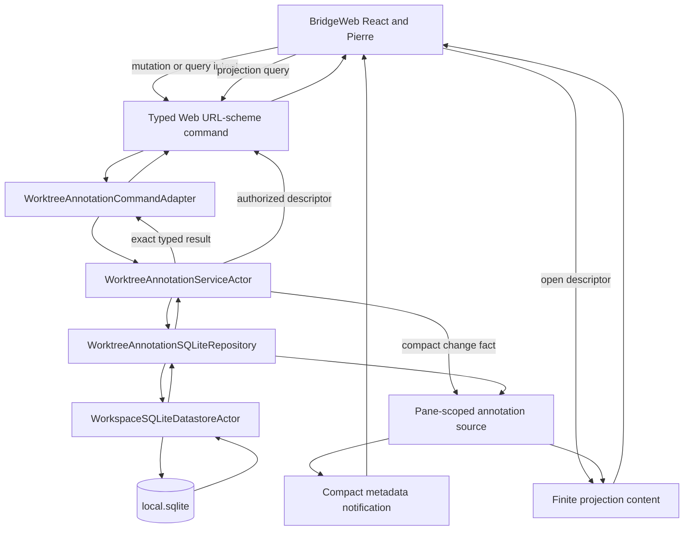

The three transport routes have separate jobs:

| Route | Direction | Annotation responsibility |
| --- | --- | --- |
| `agentstudio://rpc/command` | BridgeWeb to native and response | typed mutations, explicit queries, exact success/failure/conflict/admission result, content-descriptor issuance |
| `agentstudio://rpc/stream` | native to worker | compact snapshot-required, session-changed, discovery-changed, and recovery-changed notifications; no Markdown or message DTOs |
| `agentstudio://rpc/content` | native to worker | finite demanded annotation projections and exact output bytes |

The Swift development backend maps these same contracts to
`/__bridge-product/command`, `/__bridge-product/stream`, and
`/__bridge-product/content`. It is an adapter, not a second architecture.

## Structural choice

Three structures were credible:

| Structure | Gain | Cost | Decision |
| --- | --- | --- | --- |
| MainActor projection Atom between repository and Bridge | cached current snapshot and synchronous fan-out | duplicates SQLite/browser state, globalizes pane placement, routes command results through shared presentation, republishes complete data, has no SwiftUI consumer | rejected |
| Complete annotation bodies on metadata subscriptions | automatic push to every subscriber | lossless shared-queue admission, complete-revision assembly, annotation-specific resync, eager/streaming packing complexity | rejected |
| Direct actor service and repository; compact invalidation; finite demanded projection | one durable authority, exact command response, replaceable notifications, content backpressure isolated from metadata | explicit projection query and worker query lifecycle | selected |

The selected design spends one application actor, one compact change stream,
one notification source, and one finite projection query/content source. It
deletes the annotation Atom, lossless ordinary-metadata FIFO, metadata event
cursor, browser multi-event subscription assembler, and annotation-subscription
reopen protocol.

## Target and folder boundaries

PR1 remains inside the existing `AgentStudioBridge` Swift target. A separate
feature target would create a dependency cycle around Bridge surface,
transport, pane-admission, and source-generation types without adding an
independent consumer.

```text
Sources/AgentStudio/Features/Bridge/
├── Models/
│   ├── WorktreeAnnotations/
│   └── Transport/WorktreeAnnotations/
├── Runtime/WorktreeAnnotations/
├── State/SQLite/WorktreeAnnotations/
└── Transport/WorktreeAnnotations/
```

| Path | Job |
| --- | --- |
| `Models/WorktreeAnnotations/` | pure domain identities, policies, source evaluation, output snapshots/projectors |
| `Models/Transport/WorktreeAnnotations/` | strict command, notification, projection-query/content, and output wire DTOs |
| `Runtime/WorktreeAnnotations/` | `WorktreeAnnotationServiceActor`, change publication, edit ownership, source capture/evaluation orchestration, output coordination |
| `State/SQLite/WorktreeAnnotations/` | repository protocol, datastore adapter, typed GRDB operations, recovery witness writer |
| `Transport/WorktreeAnnotations/` | command adapter, pane notification source, projection query/content source, output content source, selection assembler |

Native AppKit effects stay in App composition:

```text
Sources/AgentStudio/App/Coordination/
└── WorktreeAnnotationOutputEffects.swift
```

BridgeWeb shared product code stays outside File and Review:

```text
BridgeWeb/src/worktree-annotations/
├── components/
├── models/
├── state/
├── transport/
├── worker/
└── test-support/
```

File and Review contain only thin Pierre/source-range adapters:

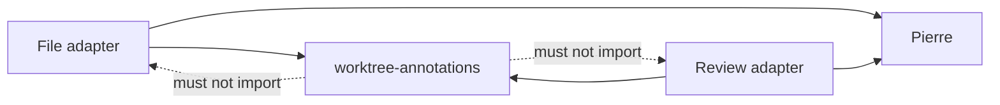

## Actor and persistence ownership

Actor types touched or introduced by this correction use the `Actor` suffix:

- `WorkspaceSQLiteDatastoreActor` owns retained core/local database handles,
  connection and commit sequencing, boot preparation, and recovery.
- `WorktreeAnnotationServiceActor` owns annotation behavior, mutation
  serialization, edit ownership, recovery admission, source-refresh fences,
  and compact change publication.
- `WorktreeAnnotationOutputCoordinatorActor` owns prepare/effect/finalize
  sequencing for Copy and Export.

Repositories are not actors and do not open independent databases:

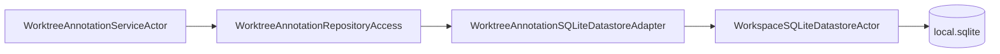

`WorktreeAnnotationSQLiteRepository` contains typed SQL operations. The adapter
submits them to the one datastore actor. No `WorktreeAnnotationSQLiteActor`,
second connection owner, or compatibility wrapper exists.

`State/MainActor/Persistence` remains reserved for persistence wrappers around
MainActor state. Direct annotation SQL belongs under
`Features/Bridge/State/SQLite/WorktreeAnnotations/`.

## Owned truth

| Truth or effect | Sole owner |
| --- | --- |
| sessions, threads, messages, saved bodies, optional drafts, immutable origins, output attempts/events/exact bytes, recovery provenance | `WorktreeAnnotationSQLiteRepository` through `WorkspaceSQLiteDatastoreActor` |
| semantic command admission, edit-token ownership, demand/query policy, recovery mutation gate, change publication | `WorktreeAnnotationServiceActor` |
| active notification subscription, pane/worktree/source authority, current placement evaluation, projection descriptor reservations | pane-scoped annotation transport sources |
| exact mutation/query correlation result | typed command response |
| pending/newest invalidation and in-flight projection query | worker annotation query controller |
| last complete fetched projection, inline thread expansion, active editor, focus, unsent text, temporary output selection | BridgeWeb annotation state |
| clipboard replacement and save-panel/file write | App implementation of output-effect contract |

There is no `WorktreeAnnotationProjectionAtom`, annotation `AtomRegistry`
field, MainActor annotation read model, or SwiftUI annotation presentation in
PR1. If native UI later needs an open-thread count or recovery badge, it may
consume a separate small native summary as a sibling; BridgeWeb never reads
through that summary.

## Durable state

The existing normalized `local.sqlite` schema remains authoritative:

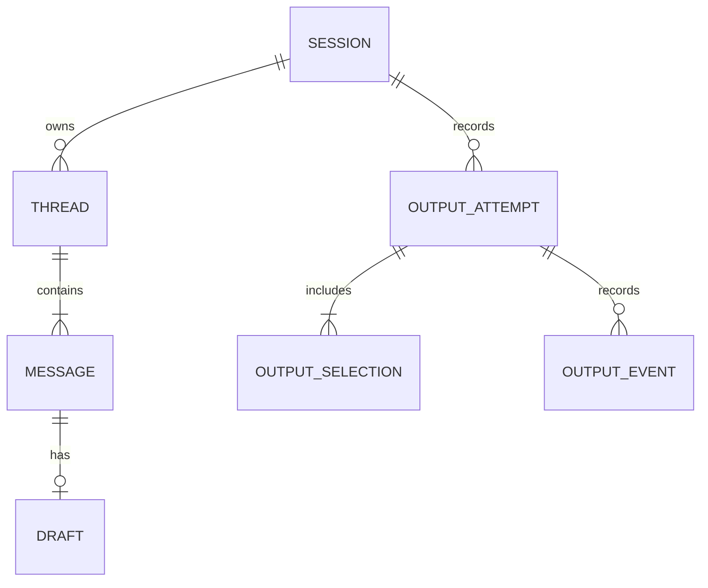

Domain state remains:

```text
Session.lifecycle       living | completed
Session.relationship    applicable | uncertain | detached
Thread.resolution       open | resolved
Thread.origin           located | wholeFile | session
Message.status          editable | locked
Message.savedBody       String?
Message.draft           WorktreeAnnotationDraft?
```

PR1 creates only `located` thread origins. Retained `wholeFile` and `session`
variants have no PR1 UI. `paused` is not lifecycle state; uncertain
applicability belongs to the independent source-relationship axis. SQLite
stores textual product values without product-enum `CHECK`
constraints. Swift strict decoding and domain policy own product vocabulary;
SQLite retains keys, relations, nonnegative revisions, and byte-length
integrity.

Workspace identity is provenance only. Session discovery and applicability are
worktree-lineage scoped. The first annotation creates a session when none is
applicable; explicit choice is required only when several apply.

## Command request/response boundary

Every browser operation is a strict typed Web URL-scheme command. Transport
acceptance and semantic completion remain distinct, but the exact command
response is the caller's terminal result.

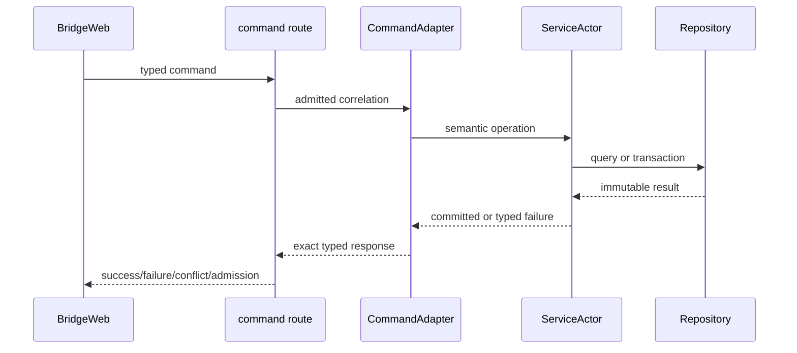

Command outcomes are not inserted into shared state and do not generate a
second projection publication. Save completes from its exact response; it does
not wait for another pane or a projection fetch.

Mutation responses name the committed session/message/thread identities and
revisions required for correlation. They do not return arbitrary SQL rows or
make BridgeWeb schema-aware.

## Compact change stream and metadata notification

After a durable mutation, the service emits one compact application fact:

```text
WorktreeAnnotationChange =
  sessionChanged(worktreeID, sessionID, semanticRevision)
  discoveryChanged(worktreeID)
  recoveryChanged
```

The service owns an explicit multicast observer registry; it does not share one
competing-consumer `AsyncStream`. `registerChangeObserver` is one synchronous
actor operation that installs an exact observer token and continuation, then
returns that observer's independently buffered stream. Each pane notification
source immediately emits `snapshotRequired` before permitting its worker to
begin the initial projection query. Commit broadcasts the applicable compact
fact to every registered observer. Stream termination removes the exact token;
pane close also unregisters it idempotently.

Each observer retains one aggregate pending notification. `snapshotRequired`
supersedes all narrower pending facts. Otherwise the aggregate retains the
newest semantic revision per applicable session plus discovery/recovery flags;
the pane source bounds that map to its demanded sessions. This is an
`AsyncStream` owned by `WorktreeAnnotationServiceActor`, not Swift Observation
or an Atom. Each pane source maps its aggregate into strict metadata events:

```text
AnnotationNotification =
  snapshotRequired
  sessionChanged(sessionID, semanticRevision)
  discoveryChanged
  recoveryChanged
```

Notifications contain no message body, thread DTO, output bytes, local path,
or pane placement. A newer pending notification supersedes an older one for the
same session; `snapshotRequired` supersedes all narrower pending notifications.

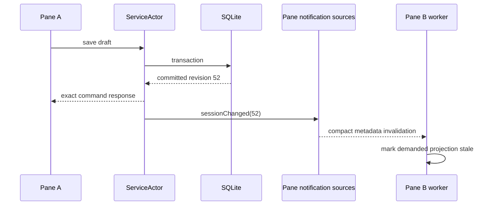

On subscription open or metadata reset/reopen, native emits
`snapshotRequired`. Missing intermediate notifications is safe because the
next finite query reads current repository truth. The existing generic
metadata reset/replay contract is sufficient; PR1 adds no lossless ordinary
metadata FIFO.

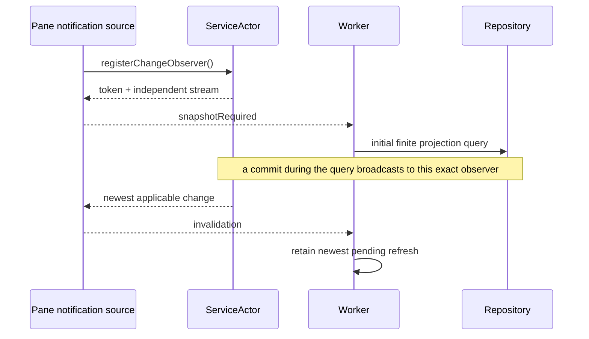

## Finite projection query and content response

The worker requests only current demanded data. A strict projection query names
surface, demanded session identities, current worker/source generation, and an
optional bounded cursor. Native revalidates pane/worktree/source authority and
does not trust a client repository path or SQL predicate.

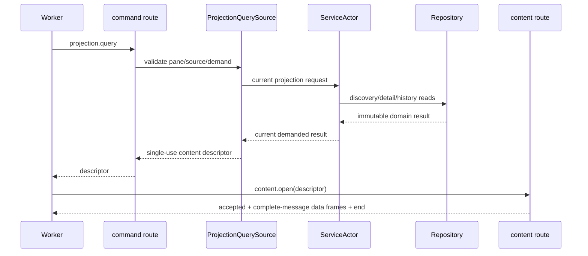

The projection contains recovery status, session summaries, demanded session
details, applicable threads, current placements, and an optional continuation
cursor. Cold output history remains an explicit query. Exact Copy/Export bytes
retain their separate output content kind.

The first query establishes one logical projection snapshot identity, durable
semantic revision set, source generation, expected record/thread/message
counts, and aggregate integrity value. If the logical projection exceeds one
content result's 2 MiB ceiling, native retains that one immutable snapshot
behind an ordered page reservation. Every continuation cursor is opaque,
single-use, snapshot-bound, pane/worker/surface/source-authority-bound, and
ordered. A continuation can issue only the next page for that exact snapshot.

Every page repeats the logical snapshot identity and page ordinal. The worker
accumulates pages privately and installs nothing until the final-page marker,
expected aggregate counts, and aggregate integrity validate. A page from
another snapshot, generation, or ordinal poisons only the private replacement.
A newer invalidation cancels or retires the old page sequence, retains the last
complete installed projection, and starts a new full logical snapshot; pages
from different repository revisions are never mixed.

The content descriptor is request-scoped, single-use, authority-bound, and
byte-bounded. Stale/replaced descriptors produce accepted plus terminal error,
never application data.

## Complete-message framing

Each authored body is at most 16 KiB UTF-8. Native projection content emits
typed complete-message records. It dynamically packs multiple records while
the encoded data frame remains at or below 128 KiB; a message record is never
split.

```text
repository snapshot
  └─ projection record cursor
       ├─ projection header
       ├─ frame 1: complete messages 1...N
       ├─ frame 2: complete messages N+1...M
       └─ terminal end + integrity
```

The cursor retains the immutable query result, traversal indices, and one
current encoded batch. It does not materialize a second whole event array.
Content-route observation pacing admits the next batch at the consumer's drain
rate. Annotation records do not compete with pane/File/Review metadata and do
not require shared metadata-capacity arbitration.

The worker stages one finite response privately and installs it only after
validated terminal completion. A partial or failed response never replaces the
last complete projection.

## No-gap bootstrap and query coalescing

A pane source registers its exact multicast observer before starting its
initial query. If a mutation commits while the query or any page is in flight,
the source/worker retains one newest aggregate invalidation, prevents the stale
logical snapshot from installing, and performs another current query after the
old request is cancelled or settles.

```mermaid
stateDiagram-v2
    [*] --> Unknown
    Unknown --> Refreshing: snapshotRequired or active demand
    Refreshing --> Ready: complete current response and no newer invalidation
    Refreshing --> Refreshing: newer invalidation cancels/replaces current query
    Ready --> Refreshing: applicable invalidation and live current query
    Refreshing --> Unavailable: real current-read failure; retain last complete
    Unavailable --> Refreshing: retry/new invalidation/reactivation
    Ready --> Inactive: surface inactive
    Inactive --> Refreshing: reactivate stale/unknown
```

One surface has at most one projection query in flight and one newest pending
invalidation. Draft revisions 11...15 may coalesce to 15 for presentation;
SQLite retains every completed transaction.

`Ready`, `Refreshing`, and `Unavailable` are read-convergence states owned by
the browser projection store. They never extend or reinterpret the lifecycle of
a mutation command. The composer ends Save progress from the exact command
response; the projection store retains its last complete snapshot while a
replacement refreshes or fails.

## Source origin and placement

The repository stores immutable source origin and accepted continuity evidence.
Current placement is pane/source derived and belongs to the pane query source,
not application-global state.

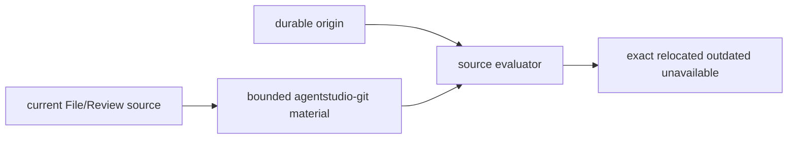

Located admission comes only from Pierre source/diff line presentation. Origin
captures repository-relative path, side/role, start/end line, selected excerpt,
and source identity. Production Git/source reads use Swift and
`agentstudio-git`; TypeScript Git remains Vite/test-only.

Continuity and placement remain independent:

- missing evidence produces uncertain relationship;
- different lineage produces detached relationship;
- exact/relocated/outdated/unavailable describes current placement;
- reviewer chooses uncertain continuity;
- resolve/reopen changes only whole-thread resolution.

## Draft and edit lifecycle

BridgeWeb owns unsent text after the last accepted flush. The service actor owns
one live edit token per message/owner generation and validates repository
revisions before mutation.

```text
empty composer
  └─ first non-whitespace edit
       └─ create durable draft
            ├─ debounce 1 second after latest edit
            ├─ max wait 5 seconds during continuous editing
            ├─ immediate flush on focus loss/Escape/outside close
            ├─ Save: flush then save current body and clear draft
            └─ Revert: clear draft; remove never-saved message when applicable
```

Each command receives an exact typed result. The local editor remains mounted
while an invalidation-triggered finite refresh runs. Equal or stale responses
cannot overwrite newer local text or release the edit token.

Session, thread, message, and draft transitions remain those defined by the
Specification. Messages become locked only through successful or recovered-
unknown output semantics. Once saved, a message is edited only through a new
draft; the saved message itself is never rewritten in place without the
validated Save transition.

## BridgeWeb and Pierre presentation

Shared annotation components live under `BridgeWeb/src/worktree-annotations/`
and compose owned shadcn primitives. File and Review supply thin Pierre range
adapters. No global/session/whole-file annotation panel or side panel exists.

```text
one-message thread
  inline = M1

multi-message thread
  inline = M-summary + M-last

expanded inline thread
  chronology = M-summary + M1 ... Mn exactly once
```

The compact surface owns one rounded boundary, avatar/timeline row, top-aligned
body, vertically stacked right command column, and separate timeline actions.
M-summary is derived presentation, never stored/selectable/exportable/replyable.

Core command ownership remains:

| Surface | Commands |
| --- | --- |
| single M1 right column | Edit when editable, Reply, Resolve/Reopen |
| multi-message right column | Edit latest when editable, Reply, Resolve/Reopen |
| composer right column | Revert, primary Save |
| timeline row | status plus quiet shadcn toolbar actions: contextual Include/Exclude, Expand immediately before More; no circular message chrome and no Edit/Reply/Resolve duplication |
| expanded thread level | Resolve/Reopen once |
| expanded message | Edit when editable, Reply |

Focus activates the thread and paints its complete stored range. Focus alone
does not expand the chronology. Expand/Edit/Reply expand the same Pierre
annotation row into one timeline containing M-summary followed by M1 through Mn
exactly once. The keyed M-last remains mounted while earlier messages are added.
Pierre remeasures the row and remains the sole scroll owner; the thread adds no
nested scrollbar or floating chronology layer. Escape exits editing first, then
collapses the thread; outside click flushes active work and collapses; final
focus returns to the invoking control. Sticky controls for threads taller than
the viewport are deferred until this basic inline interaction is accepted.
Expanded message nodes use a 4 px comment-owned gap and a neutral semantic rail;
they do not add an outer bordered surface.

Range state is a browser discriminated union: none, pending range, or saved
thread range. Only the active pending/thread range is painted. Selection,
another range, `+`, outside click, or Escape clears according to the
Specification.

Pierre keeps selected source lines on its selection paint. A selected annotation
row does not remix that yellow into comment chrome; the existing Pierre
`--diffs-annotation-bg` remains the annotation-row background so comment
metadata contrast is independent of range paint.

## Output preparation and effects

Copy and Export use one immutable repository snapshot and record the exact
batch before invoking App effects.

Current placement is not repository truth. Before output preparation, the
pane-scoped command adapter obtains or refreshes an authoritative placement
snapshot from the same pane/source-generation authority used by projection
queries. That immutable handoff contains the placement map, surface, source
generation/epoch, and source identity fence. The service passes it into the
output coordinator; the prepare transaction revalidates session/message
revisions and persists the exact placement-bearing batch before any external
effect. Browser paths or placement claims are never trusted.

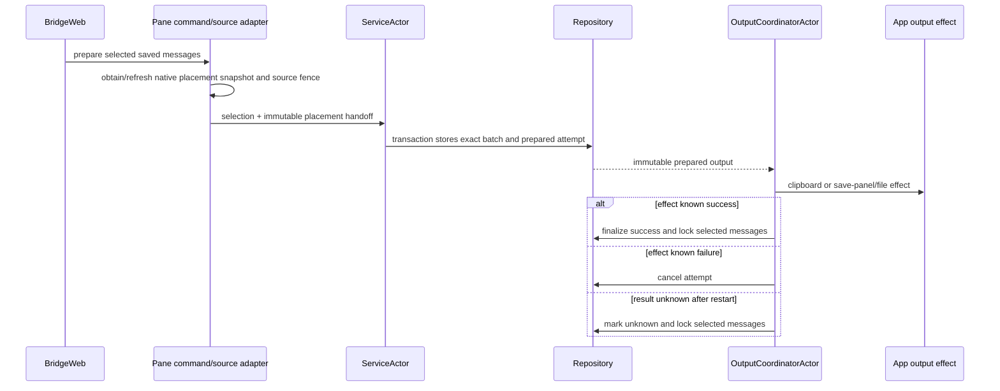

Markdown and JSON project from the same immutable batch. Markdown has one H1
packet hierarchy, path/file headings, explicit line-numbered excerpts, authored
Markdown bodies, and `---` separators. Message Markdown admits H2-H6 but no H1,
raw HTML, or unsafe link destinations. JSON is versioned, strict, and preserves
the same message/order/origin/placement facts.

Clipboard success shows the shared Sonner toast and closes Copy UI; it does not
resolve threads. Export uses the native save panel. Once output succeeds or is
recovered unknown, selected messages are locked but remain replyable. Output
history stores exact bytes, selection, format, destination metadata permitted
by policy, status, and events. Unknown repetition uses stored exact bytes and
does not rerun current formatting.

## Failure and recovery

| Failure/interleaving | Containment and recovery |
| --- | --- |
| command validation/conflict fails | exact typed failure response; SQLite and current browser projection unchanged |
| repository commit succeeds before response or invalidation | durable result remains authoritative; retry with old revision conflicts; reconnect queries current truth |
| compact notification is superseded | newest applicable invalidation causes a current query; no durable data loss |
| metadata stream resets/reconnects | notification subscription reopens and emits `snapshotRequired` |
| query descriptor stale/replaced | accepted then terminal error; last complete browser projection retained |
| finite projection fails or ends incomplete | staged response discarded; last complete projection and editor retained; retry on new invalidation/reactivation/explicit retry |
| newer invalidation arrives during query | retain one newest pending invalidation; stale result is not installed as current |
| surface becomes inactive | cancel foreground query, retain last complete projection, clear transient demand |
| pane/session closes | cancel notification/query/content tasks and release reservations/edit owner generation |
| source evaluation unavailable | durable origin remains; current placement is unavailable; no fabricated exact placement |
| local DB classified corrupt | quarantine DB/WAL/SHM, create fresh DB, write durable recovery witness, expose recovered-degraded, reject mutations until explicit acknowledgement |
| output effect succeeds but finalization fails | visible partial success; exact prepared attempt remains inspectable and becomes unknown on recovery |

Recovery provenance is written by `WorkspaceSQLiteDatastoreActor` during
quarantine-and-replace so “annotations lost in recovery” differs durably from
“annotations never existed.” Quarantined sidecars remain on disk. Existing
`PersistenceRecoveryReporter`/Inbox notification composition informs the
reviewer; PR1 adds no new global annotation panel.

## Concurrency and consistency

- `WorkspaceSQLiteDatastoreActor` serializes physical database access and owns
  retained connections.
- `WorktreeAnnotationServiceActor` serializes semantic commands, live edit
  ownership, recovery admission, and change publication.
- Repository transactions assign durable semantic revisions and validate
  expected revisions atomically.
- One pane notification source observes the service stream; notifications are
  replaceable state-change facts, not durable events.
- One worker surface controller owns at most one finite query and one newest
  pending invalidation.
- Projection descriptors are single-use; content reservations settle on
  success, cancellation, error, replacement, or pane close.
- Browser installation is all-or-nothing after finite terminal validation.
- Output coordinator permits one in-flight output attempt per session and
  records prepare before external effect before finalize.

No timer, polling, queue-limit increase, durable pending-frame store, second
physical transport, or observation-pacing reuse is introduced for metadata.

## Trust, privacy, accessibility, and observability

The existing pane capability and product-session admission gates authorize all
three URL-scheme routes. Native validates worktree/source containment and never
accepts a client path as repository authority. Strict JSON rejects unknown
members and invalid discriminants. Generated output excludes absolute local
paths, credentials, provider-native identifiers, and secret material.

BridgeWeb rendering uses the existing safe Markdown posture. Icon-only controls
have canonical accessible names and tooltips. Keyboard order, two-stage Escape,
focus return, collapsed-content exclusion, narrow width, 200% text, and reduced
motion are proven in browser and packaged WKWebView.

Telemetry records bounded identifiers/hashes, operation class, result,
revision, frame/byte counts, query/cancellation/terminal disposition, and
latency. It never exports authored bodies, excerpts, exact output bytes, raw
paths, edit tokens, or SQL errors over OTLP.

The closest existing packaged-debug path is Review comparison-target query:
command authorization, descriptor reservation, `content.open`, native capture,
encoding, and terminal content response. Historical VictoriaLogs contain 20
complete scenario operations over 159 B...10.3 KiB payloads: median 10.32 ms,
19/20 at or below 19.33 ms, and one 89.80 ms scheduling outlier. Native
authorization and encoding were negligible; descriptor reservation age and
native capture dominated. This is feasibility evidence, not fresh annotation
proof or an ordinary-user latency guarantee.

PR1 adds one correlated marker-scoped measurement:

```text
annotation.projection.invalidate_to_ready_ms
  command response
  notification delivery
  query authorization
  SQLite read
  projection/placement construction
  descriptor reservation age
  content transfer
  worker validation
  browser installation
  Pierre paint fulfillment
```

Normal invalidation-to-Pierre paint targets below 50 ms, with below 100 ms as
the scheduling-variance diagnostic threshold. A threshold miss triggers phase
inspection; it does not authorize route merging, queue-limit changes, polling,
or proof weakening.

## Cutover

This is a hard cutover with no compatibility path:

```text
delete annotation projection Atom and AtomRegistry field
delete Store-to-Atom publications and command-outcome mailbox
move annotation repository to State/SQLite/WorktreeAnnotations
rename WorkspaceSQLiteDatastore to WorkspaceSQLiteDatastoreActor
rename application/output actor owners with Actor suffix
replace complete annotation metadata events with compact notifications
add projection query/content operation and worker controller
delete annotation metadata FIFO/cursor/resync machinery
retain SQLite schema, domain identities, output records, UI behavior, and exact output formats
```

No migration changes stored annotation meaning. Existing PR1-created schema is
still pre-release and cuts over in place on this branch. Product enum literals
remain Swift-owned; SQLite gains no product-enum checks.

## Requirement realization and proof seams

| Requirements | Realization | Required proof |
| --- | --- | --- |
| P1-U1/U8/U13; R-P1-001/008/009 | repository identities, service discovery/admission/lifecycle, worktree-lineage queries | zero/one/several session admission, restart, File/Review convergence, no persistent session UI |
| P1-U2/U3; R-P1-003/004/006 | draft scheduler, service edit ownership, revision-checked repository transactions, exact command results, last-complete finite refresh | first-character red/green, debounce/max-wait clock tests, focus loss, Save/Revert, restart, multi-pane invalidation during active editor |
| P1-U4/U14; R-P1-005/016/017 | 16 KiB policy, complete-message finite-content record cursor, flat threads, compact/expanded inline UI | H2-H6/H1/raw HTML/unsafe link tests, 16/64/128 KiB framing, no split message, M1 vs summary+last, inline chronology and Pierre remeasurement |
| P1-U5/U6/U7; R-P1-002/007/008 | native source capture/evaluator, pane-scoped placement, reviewer continuity choice, Pierre adapters | File/Review range creation, exact/relocated/outdated/unavailable, same/uncertain/detached, active-only range paint |
| P1-U9/U10/U11/U12; R-P1-010/011/012/013 | arbitrary selection assembler, immutable batch projectors, output coordinator actor, App effects, exact history | 130 candidates, exact Markdown/JSON, real clipboard/save file, partial success, restart unknown, repetition exact bytes |
| R-P1-014 | service multicast observer registry, per-observer aggregate coalescence, pane notifications, snapshot-consistent paged query, worker query fencing, reconnect snapshot-required | register-two-before-bootstrap, mutation during initial query reaches both, invalidation 11...15 coalesces, reset/reopen current query, >2 MiB page identity/ordering, stale query rejection, exact observer cleanup, last-complete retention |
| R-P1-015 | no agent/delivery/App IPC/delete/global UI types or methods | architecture/source scans and complete diff review |

Proof must include focused unit tests, real repository/integration tests, Swift
development backend plus Vite browser journeys, complete `mise run test`, and
packaged WKWebView/App effects/accessibility/restart evidence. Browser fixtures
do not prove SQLite, NSPasteboard, NSSavePanel, or packaged focus behavior.

## Deliberate limits and revisit signals

- A native summary Atom is deferred until specified native UI needs one; it
  would be a sibling consumer, never the BridgeWeb data path.
- A separate annotation Swift target is deferred until a non-Bridge consumer
  requires the domain independently of Bridge transport/source types.
- Projection caching below pane sources is deferred until measured repository
  query cost justifies it.
- Delta projection responses are deferred until measured finite snapshot cost
  or latency requires them.
- Pierre upgrade is separate work; PR1 uses the repository's current pinned
  version.
- Side panel, global/session/whole-file UI, rendered-preview anchoring, deletion,
  agent replies, delivery, acknowledgement, and App IPC remain outside PR1.
