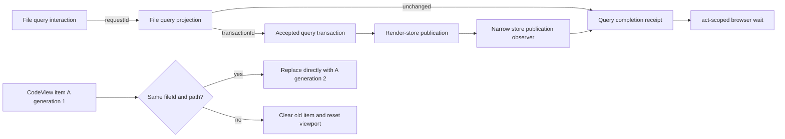

# BridgeWeb CI Reliability — Program Design

Governing inputs:

- [Requirements](user-requirements.md)
- [Specification](2026-08-09-bridgeweb-ci-reliability.md)

## Selected structural change

Two existing identities become the synchronization boundaries. No new scheduler or general harness service is introduced.



## Query completion ownership

The existing File query command owns `requestId`. The browser-test dispatcher already observes that outgoing command and records the request ID caused by the interaction. The worker projection owns whether that request is unchanged, superseded, or produces a transaction. The main render store owns transaction acceptance and publication. The browser harness observes completion; it does not decide it.

```text
CURRENT
interaction
  └─► worker setTimeout(0)
       └─► query transaction
            └─► one stream entry per rAF
                 └─► store publish

test waits: worker counters + guessed frames

TARGET
interaction(requestId)
  └─► worker outcome
       ├─► unchanged(requestId) ─────────────────► terminal receipt
       ├─► superseded(requestId) ────────────────► rejected receipt
       └─► projected(requestId, transactionId)
             └─► accepted transaction
                   └─► store publication
                         └─► completion(requestId)

test waits: exact requestId completion inside act
```

The narrow receipt is an internal worker-to-main lifecycle message:

```text
fileQueryOutcome {
  requestId
  outcome: unchanged | superseded | projected(transactionId)
}
```

It is not persisted, logged as a new product protocol, exposed to native code, or reused as a generic task primitive. The production dispatcher ignores the terminal testing observation after applying normal runtime behavior; the browser-test dispatcher correlates it with the exact command it observed.

The existing `renderStoreFactory` injection point supplies one optional, File-query-specific publication observer when constructing the browser-test render store. Production construction supplies no observer. The worker outcome records `requestId → transactionId`; successful `completeFileQueryTransaction(transactionId)` publishes the accepted snapshot and then invokes the observer synchronously with that transaction ID. The browser harness uses the correlation to resolve only the matching request waiter. This observer reports an already-owned store lifecycle edge; it does not create a test scheduler, expose store internals, or alter production ordering.

Ordering rules:

- Each receipt is keyed by the initiating request ID.
- `unchanged` completes without a display transaction when its outcome message is processed inside the interaction's `act` scope.
- `projected` first records the `requestId → transactionId` correlation. Its waiter remains pending while the tree stream stages the transaction. It completes only when `completeFileQueryTransaction(transactionId)` accepts the transaction, synchronously publishes the store snapshot, and invokes the store observer.
- The browser helper encloses both the interaction and its exact waiter in one `act` call. Resolving the waiter allows the `act` callback to finish; `act` then flushes the React commit before the helper returns to assertions or teardown.
- `superseded` rejects that request's wait and cannot complete any newer request.
- A superseded or rejected transaction cannot complete a newer request.
- Disposal rejects every outstanding harness wait. Disposal is never a successful completion. Browser teardown then awaits the existing worker-message publication queue before returning so no queued publication enters the next test.

```mermaid
sequenceDiagram
    participant Test
    participant UI
    participant Worker
    participant Store
    participant React

    Test->>Test: enter act
    Test->>UI: query interaction
    UI->>Worker: fileQueryUpdate(requestId)
    Worker-->>Test: projected(requestId, transactionId)
    Note over Test,Store: exact waiter remains pending
    Worker->>Store: staged query transaction
    Store->>Store: accept and publish transactionId
    Store-->>Test: publication observer(transactionId)
    Test->>Test: exact waiter resolves; act callback ends
    Store-->>React: observable snapshot update
    React-->>Test: commit flushed before act returns
```

## Same-file replacement ownership

The render-snapshot controller currently clears CodeView items during every source reset. It will instead distinguish navigation identity from content generation:

```text
logical identity = (fileId, displayPath)
content identity = cacheKey / version

same logical identity, new content identity
  retain A@1 ──► atomically expose A@2

different logical identity
  clear A ──► expose B at scroll zero
```

During a same-file reset, the current CodeView item becomes the temporary presentation authority. The render-snapshot controller classifies the reset against the current selection `(fileId, displayPath)` and the retained item's matching `(itemId, displayPath, content role)` metadata. It asks the existing snapshot store to clear all CodeView items except that exact selected item. A different selection or retained identity uses the existing clear-all path.

`rowPaint: reset` becomes single-purpose: it clears stale row-paint facts but no longer clears `codeViewItemsById` as a hidden side effect. The controller still clears content-availability facts. The explicit CodeView reset operation therefore remains the sole owner of whether CodeView items are cleared or one exact selected item is preserved. No second retained-item store or parallel presentation state is introduced.

Selection eligibility for the preserved item is checked directly against the current selection and the retained item's `(itemId, displayPath, content role)` metadata. Temporary absence from `fileItemById` does not make that same-file presentation null. `fileItemById` remains authoritative for tree and navigation data and for choosing a different file; it is not required to keep the already-selected same-file presentation mounted during replacement.

Pierre already reconciles a stable item ID when its version changes. Keeping the old item until the same-file replacement is ready lets Pierre own viewport continuity. App-owned animation-frame scroll repair is then deleted. No second retained-item store is introduced.

Failure and overlap:

- If replacement B fails, is cancelled, or is superseded, it never replaces A.
- Navigation to another file cancels same-file retention and follows the existing reset path.
- A retained item is eligible only while the current selection still matches its exact `(fileId, displayPath)`.
- A matching accepted replacement overwrites A in the same `codeViewItemsById` slot; no empty intermediate value is published.
- Selection clearing, a different selected identity, explicit content invalidation, or store disposal removes the retained item through the existing clear/dispose paths.
- User scroll remains authoritative; `onScroll(0)` is recorded normally and never treated as proof of a refresh reset.

Cost: the previous generation remains visible briefly during a same-file load. Loading/error presentation continues to communicate freshness. This is accepted to avoid destroying the viewport.

## Cruft disposition

| Existing mechanism | Disposition | Replacement |
| --- | --- | --- |
| Fixed frames in browser update settlement | Remove | Exact request/transaction completion |
| Stable-frame worker-drain inference for File queries | Stop treating as query completion; retain only if other owned work needs it | Query receipt |
| Same-file first and second rAF scroll retargets | Remove | Stable logical item replacement |
| Late-zero recovery rAF and pending restore cancellation | Remove | Stable logical item replacement; zero remains user-authoritative |
| Bounded DOM-condition polls | Classify individually; keep when they wait for a named condition | They do not claim global quiescence |
| Strict browser failure guard | Keep | It remains the escaped-update detector |

## Proof seams

- Query proof observes the exact request outcome, proves a projected waiter remains pending through worker outcome and transaction staging, and resolves it only from successful store acceptance/publication before `act` returns.
- Store-level same-file proof applies row-paint reset while `fileItemById` is temporarily absent and observes that only the exact selected CodeView item remains eligible.
- Browser same-file proof records real `CodeView.setItems` generations and the connected scroll-owner identity.
- Companion navigation proof observes reset-to-zero.
- Complete BridgeWeb validation proves the strict guard and surrounding runtime remain compatible.

## Explicitly unchanged

- Worker chunking and scheduling.
- Query semantics and filtering results.
- Native Bridge protocol and Swift code.
- Pierre as tree and CodeView renderer.
- Different-file navigation behavior.
- React console/error failure policy.
