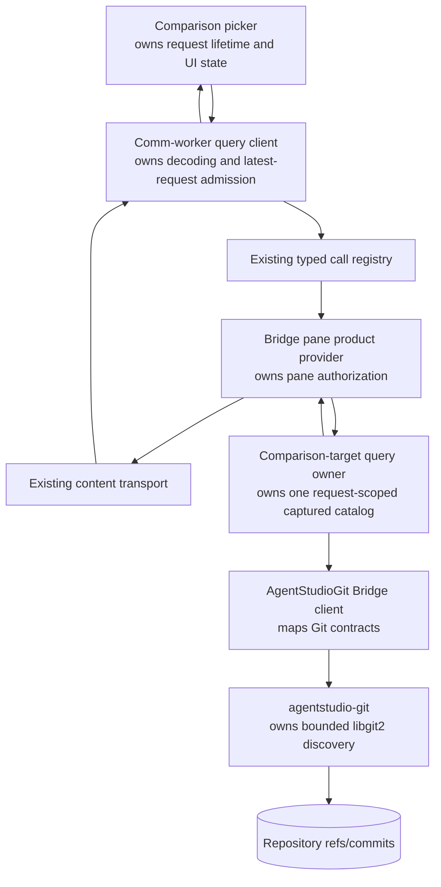

# Bridge Review Comparison Target Loading — Program Design

Requirements: [User Requirements](./user-requirements.md)

Specification: [Specification](./specification.md)

## Structural correction

The existing generic transport already has the required jobs:

```text
command route   accepts typed request and returns a typed result
metadata stream pushes compact continuously useful state
content route   returns finite requested application data
demand policy   schedules which content request runs first
```

The correction removes the catalog from pane presentation and composes one new
application call/content kind over those existing owners. No fourth transport,
new service, database state, cache, or subscription is introduced.

## Current and target ownership

```text
CURRENT

Review initialization
  → reviewComparisonTargets()
  → enumerate + peel + sort every branch
  → targetCatalog stored in reviewComparison presentation
  → pane.presentation over metadata stream
  → worker copies/freezes/stringifies every row
  → React branches.map(...)

TARGET

Review initialization
  → resolve designated default only when durable intent is absent
  → compact reviewComparison presentation, without targetCatalog

Picker opens
  → review.comparisonTargets.query
  → bounded agentstudio-git catalog capture
  → descriptor returned by command result
  → finite review.comparisonTargets content stream
  → RPC-owned decoder/materializer
  → virtualized Base UI Combobox
```

## Component and ownership map



| Owner | Owns | Does not own |
| --- | --- | --- |
| Pane comparison intent | durable selected target and basis | picker catalog or query lifecycle |
| Pane presentation | active target, attempt, displayed snapshot, activity | selectable catalog |
| Picker | open mode, focus, search text, loading/error/ready state | Git enumeration or durable target |
| Typed application RPC | `review.comparisonTargets.query` request/result shape | generic transport mechanics |
| Content transport | framing, bounds, cancellation, accepted/data/end/reset/error | branch semantics |
| Query owner | one immutable bounded catalog and its descriptor lifetime | cross-query cache |
| `agentstudio-git` | default-ref resolution and bounded branch discovery | Bridge UI or metadata publication |

Allowed dependencies point downward through this table. Pane metadata must not
depend on the catalog query, and the picker must not read Git or native state
outside the typed product call/content contracts.

## Separate default initialization from catalog discovery

The current `adoptInitialContributionTargetIfEligible` path uses the complete
catalog merely to find `origin/HEAD`. Split that responsibility:

1. `agentstudio-git` exposes a constant-scope default-target read that resolves
   the symbolic remote default and peels that one target.
2. Review initialization calls it only when the durable pane target is absent.
3. The initial target continues through the existing pane-intent mutation and
   comparison refresh path.
4. The picker query uses the separate bounded catalog operation.

This preserves automatic default selection without preloading choices.

## Application protocol composition

### Command result

Add `review.comparisonTargets.query` to the existing Swift and TypeScript call
registries. The request has no client-supplied repository path or target; pane
session authority supplies the current repository/worktree and active target.

The result is either the existing typed product-call error or a content
descriptor with:

```text
contentKind: review.comparisonTargets
descriptorId
capture identity
declared byte length
maximum byte length
expected digest under the existing content contract
```

The result descriptor authorizes exactly one immutable request-scoped catalog.
It does not contain catalog rows.

### Content kind

Add `review.comparisonTargets` to the existing content registries and switch
statements. It uses the same `content.open` request and
accepted/data/end/reset/error framing as File and Review content. The payload is
UTF-8 JSON decoded by an RPC-owned schema into the catalog contract from the
Specification.

This is an application-specific content kind over generic transport. Generic
route, framing, capability, sequence, checksum, backpressure, and cancellation
code remains branch-agnostic.

## Candidate production policy

One `agentstudio-git` operation opens the repository and captures candidates:

```text
resolve designated default ref
resolve current symbolic branch target when applicable
iterate local + remote-tracking refs
  → exclude symbolic remote HEAD rows
  → peel each candidate to its tip commit
  → retain mandatory default/current candidates
  → retain other candidates with tip time >= capture - 30 days
order mandatory rows first, then commit time descending, then ref name
apply row capacity
return value catalog to Bridge
```

The product policy owner supplies the 30-day window and maximum row/encoded-byte
budgets. `agentstudio-git` enforces the row limit during production; the Bridge
query owner encodes incrementally and stops before the content byte budget. Both
return explicit truncation. Mandatory rows reserve capacity rather than being
appended beyond the cap.

The selected target is resolved again by the existing comparison-update path.
Catalog OIDs are display evidence and query identity, not mutation authority.

No Git lock is introduced. A ref may move after catalog capture; selecting its
symbolic identity intentionally resolves current Git truth in the existing
correlated comparison operation.

## Control and data sequence

```mermaid
sequenceDiagram
    participant UI as Branch selector
    participant W as Comm worker
    participant P as Product call/content transport
    participant N as Native query owner
    participant G as agentstudio-git

    UI->>W: Branch mode becomes active
    W->>P: call(review.comparisonTargets.query, signal)
    P->>N: typed command request
    N->>G: bounded targets(cutoff, rowLimit, current)
    G-->>N: value catalog or error
    N->>N: encode within byte limit; retain request-scoped body
    N-->>P: content descriptor
    P-->>W: descriptor
    W->>P: openContent(descriptor, signal), foreground
    P->>N: content.open
    N-->>P: accepted → data* → end
    P-->>W: validated bytes + terminal
    W->>W: decode catalog; admit only current request
    W-->>UI: ready catalog
```

Changed edges:

- removed: Review initialization → complete catalog enumeration;
- removed: query result → `pane.presentation.targetCatalog` → metadata stream;
- added: picker → typed query call → descriptor;
- added: descriptor → existing content route → RPC decoder;
- intentionally unchanged: selection → `review.comparison.update` → durable
  pane intent → comparison refresh;
- intentionally unchanged: compact comparison attempt/snapshot state →
  `pane.presentation` metadata.

Current-source anchors:

- `BridgePaneController+ReviewContribution.swift`
- `BridgeProductStreamFrame.swift`
- `BridgePaneProductSchemeProvider.swift`
- `bridge-product-transport.ts`
- `bridge-product-call-contracts.ts`
- `bridge-product-content-contracts.ts`
- `LibGit2ReviewComparisonTargetReader.swift`

## Picker state and virtualization

Picker query state is ephemeral React/worker state, not pane data:

| State | Owner action | Exit |
| --- | --- | --- |
| idle | no request/body retained | Branch mode opens |
| loading | one abort scope covers call and content stream | ready, failed, close, supersede |
| ready | immutable decoded catalog; local search text filters it | refresh, select, close |
| failed | safe retryable presentation; current comparison unchanged | retry, close |

The selector keeps the owned `components/ui/combobox.tsx` primitives. Add the
standard Base UI virtualization composition:

- `virtualized` and the complete decoded `items` on `Combobox.Root`;
- `Combobox.useFilteredItems()` inside the list;
- `@tanstack/react-virtual` for the visible row window and bounded overscan;
- explicit item indices and `onItemHighlighted` scrolling for keyboard parity;
- the existing themed `ComboboxInput`, `ComboboxList`, and `ComboboxItem`.

The virtualization code stays comparison-selector-local unless a second owned
Bridge Combobox needs identical behavior. It does not create a new shared UI
abstraction pre-emptively.

## Failure, cancellation, and consistency

```text
query/capture error
  → typed call error
  → picker failed/retry state
  → current comparison untouched

content error/reset/oversize/decode error
  → discard request-scoped catalog
  → picker failed/retry state
  → current comparison untouched

close/switch/supersede/session replacement
  → abort call and content stream
  → release native request-scoped body
  → ignore late completion by request identity
```

There is one active picker query per pane. Existing product session identity,
worker derivation epoch, descriptor identity, content request identity, and
AbortSignal provide ordering and cancellation. No new global generation,
coordinator, lock, retry scheduler, or cache is needed.

## Hard cutover

- Remove `targetCatalog` from Swift and TypeScript pane-presentation contracts,
  strict JSON keys, worker snapshots, signatures, runtime projections, fixtures,
  and UI props.
- Replace the full-catalog default lookup with the single-target resolver.
- Add the typed call and content-kind cases across exhaustive registries.
- Move catalog materialization into request-scoped query state.
- Replace `branches.map(...)` with the Base UI supported virtualized list.
- Update the Swift development host by composing the same production query,
  call, content, and Git owners behind its existing HTTP route mapping.

No persisted schema changes or compatibility shim exist. Existing
`core.sqlite` target intent remains authoritative and unchanged.

## Requirement realization and proof seams

| Requirement | Realization owner | Proof seam |
| --- | --- | --- |
| CT-R1 | default-target resolver + pane presentation codec | initialization integration and metadata contract corpus |
| CT-R2 | call registry + query owner + content registry | production-backed command/content transcript |
| CT-R3 | `agentstudio-git` bounded reader + Bridge encoder | real repository fixtures with old/recent/default/current/oversize refs |
| CT-R4 | Base UI Combobox + external virtualizer | browser DOM-window, focus, keyboard, search, selection, visual proof |
| CT-R5 | picker abort scope + existing product identities | cancellation and late-result interaction tests |
| CT-R6 | unchanged pane intent and comparison update owners | process-restart SQLite, Swift dev backend, packaged app regression proof |

## Complexity and revisit signals

Complexity spent: one default-target Git read, one bounded catalog Git read,
one application call, one application content kind, request-scoped materialized
bytes, and one standard virtualized selector composition.

Deliberately not spent: cache invalidation, pagination, background warming,
catalog persistence, metadata lifecycle, new services, or new transports.

Revisit only if measured picker-open latency remains unacceptable after bounded
production, or product requirements expand from recent target selection to a
complete Git history browser.
