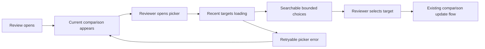
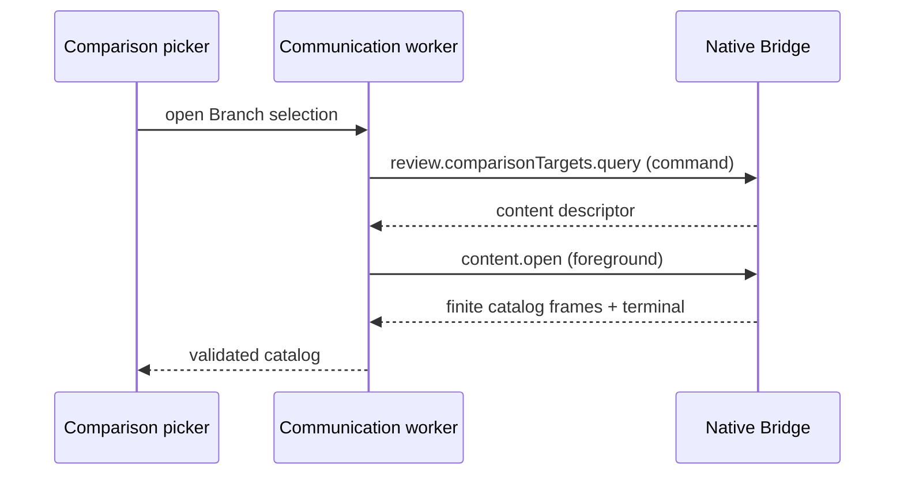
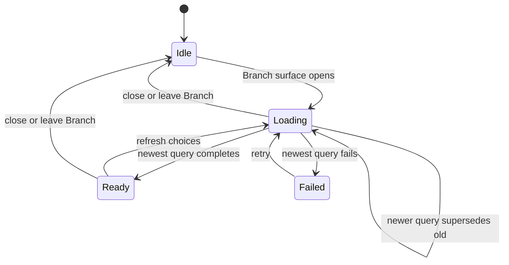

# Bridge Review Comparison Target Loading — Specification

Authority: [User Requirements](./user-requirements.md).

This Specification replaces the comparison-target catalog loading and
presentation obligations in the older PR0 design. It does not change the
selected-target, comparison-basis, durable SQLite, comparison calculation, or
comparison-origin contracts.

## Observable product model



Current comparison state and available comparison choices are independent:

| Information | Availability | Failure scope |
| --- | --- | --- |
| Active target, basis, attempt, displayed snapshot, stale/current state | pushed while Review is active | Review comparison lifecycle |
| Branch choices and repository default candidate | requested when the picker opens | that picker query only |

## CT-R1 — Review does not preload the branch catalog

Opening, restoring, refreshing, or changing the viewport of Review View MUST
NOT enumerate or transfer the selectable branch catalog unless a target query
is currently requested.

Automatic initial-target selection remains required. When no durable target
intent exists, Agent Studio MAY resolve only the repository-designated default
remote-tracking reference needed to initialize the comparison. That constant
scope lookup MUST NOT enumerate the branch catalog.

```text
Review initialization
  ├─ durable target exists → use it
  └─ no durable target     → resolve designated default only

No branch catalog is loaded on either path.
```

Traces to: CT-U1, CT-U4.

## CT-R2 — The picker requests choices through the on-demand product path

When the Branch selection surface opens, BridgeWeb MUST issue the typed product
call `review.comparisonTargets.query`. A successful call MUST return an
authorized descriptor for one finite `review.comparisonTargets` content
response. BridgeWeb MUST obtain the catalog by opening that descriptor through
the existing content route.

The catalog MUST NOT appear in `pane.presentation`, File metadata, Review
metadata, or any new metadata subscription. Packaged transport uses
`agentstudio://rpc/command` and `agentstudio://rpc/content`; the development
backend uses their existing HTTP equivalents.



Traces to: CT-U2, CT-U4, CT-U6.

## CT-R3 — Candidate production is recent and bounded

The returned catalog MUST include resolvable local and remote-tracking branches
whose tip commit time falls within the rolling 30 days preceding query capture.
It MUST also include, when resolvable:

1. the repository-designated default remote-tracking target; and
2. the current selected branch target.

Those two retained targets may be older than the cutoff but count toward the
hard result capacity. Symbolic remote `HEAD` aliases MUST NOT appear as choices.

The response MUST have deterministic ordering, a hard row limit, and a hard
encoded-byte limit no greater than the existing content-stream ceiling. If
eligible rows exceed either limit, the response MUST set `isTruncated: true`.
The default and current retained targets take precedence over ordinary recent
rows during truncation.

The catalog MUST report its capture time, cutoff time, and truncation state so
the UI can explain that it is a recent bounded list. No network fetch occurs.

```text
all local + remote-tracking refs
        │
        ├─ retain current target if resolvable
        ├─ retain default target if resolvable
        ├─ retain remaining tips from previous 30 days
        ├─ deterministic order
        └─ enforce rows + encoded bytes
```

Traces to: CT-U3.

## CT-R4 — The selector renders a bounded DOM window

The Branch selector MUST preserve the existing owned Combobox input, item, and
list primitives and their Agent Studio theme tokens. It MUST use Base UI's
external-virtualization contract so only the visible rows plus a bounded
overscan are mounted.

Filtering MUST operate over the complete returned catalog. Keyboard highlight,
selection, active-descendant semantics, and scrolling to the highlighted item
MUST continue to work across rows that are not currently mounted. Opening the
picker and switching to Branch or Commit MUST focus that mode's input.

An empty eligible set MUST be distinguishable from query failure. A truncated
result MUST explain that only recent choices are shown without presenting the
picker as a complete branch browser.

Traces to: CT-U2, CT-U3.

## CT-R5 — Queries are cancellable and latest-request-wins

Closing the picker, leaving Branch mode, replacing the pane session, losing
foreground work admission, or starting a newer query MUST cancel or supersede
the older request.

A cancelled or late result MUST NOT update picker state. Query failure MUST
leave the current comparison and durable target intent unchanged and MUST offer
a retry when the picker remains open. Selecting a returned target continues
through the existing `review.comparison.update` mutation; querying choices has
no mutation side effect.



Traces to: CT-U5.

## CT-R6 — Existing comparison behavior remains unchanged

Removing the catalog from metadata MUST NOT change:

- durable selected target and basis in `core.sqlite`;
- automatic default-target initialization;
- common-commit, branch-tip, or exact-commit comparison semantics;
- displayed target/attempt/snapshot status;
- comparison invalidation and stale-result behavior;
- File or Review metadata subscription behavior; or
- target selection through `review.comparison.update`.

Traces to: CT-U4, CT-U5, CT-U6.

## Catalog contract

One successful content response contains:

```text
capture time
cutoff time
isTruncated
default target, nullable
current branch target, nullable
ordered branch rows:
  kind: local | remoteTracking
  display/ref identity
  exact tip commit OID
  tip commit time
```

The catalog is request-scoped application data. It is not durable state, a
metadata snapshot, or authority for the comparison selected after the query.
The existing comparison-update operation resolves the selected symbolic target
again before producing a Review result.

## Failure and compatibility

- Invalid, oversized, stale-session, or unauthorized responses fail through the
  existing product transport error/reset contract.
- An unavailable repository/default/current branch may reduce the returned
  choices but must not silently fabricate a target.
- Existing saved pane data requires no migration because catalog data was never
  durable intent.
- The protocol changes as one hard cutover; no legacy catalog-in-metadata path
  remains.

## Proof obligations

| Obligation | Required evidence |
| --- | --- |
| CT-R1, CT-R6 | Native/integration evidence that Review initialization resolves at most the single default target and publishes current comparison without a catalog |
| CT-R2 | Contract and production-backed integration evidence for command descriptor followed by content frames; metadata corpus rejects `targetCatalog` |
| CT-R3 | Real-Git behavior evidence for cutoff, mandatory exceptions, deterministic truncation, row/byte bounds, and no fetch |
| CT-R4 | Browser interaction and manual visual evidence with a production-scale catalog, bounded mounted rows, search, focus, keyboard navigation, and selection |
| CT-R5 | Automated cancellation/latest-request evidence showing no comparison mutation or late-result application |
| CT-R6 | Durable SQLite restart evidence plus existing comparison behavior regression coverage in the Swift development backend and packaged app |

## Negative space

This change adds no cache, pagination protocol, background prefetch, metadata
subscription, database table, event history, transport route, service, watcher,
network fetch, or generalized Git browser.
