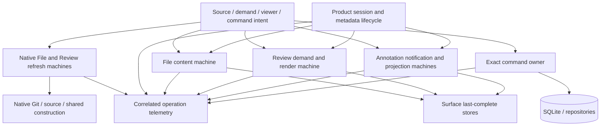
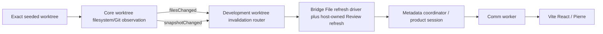
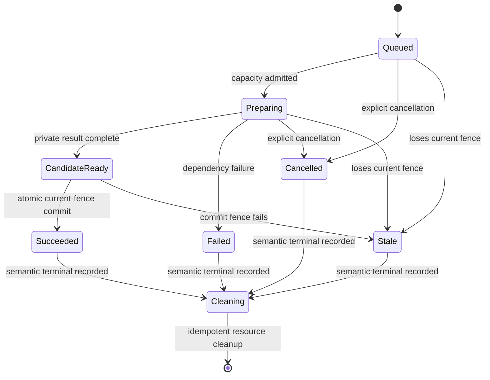
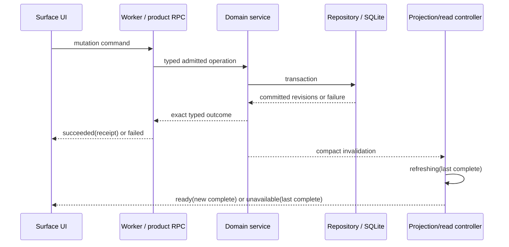
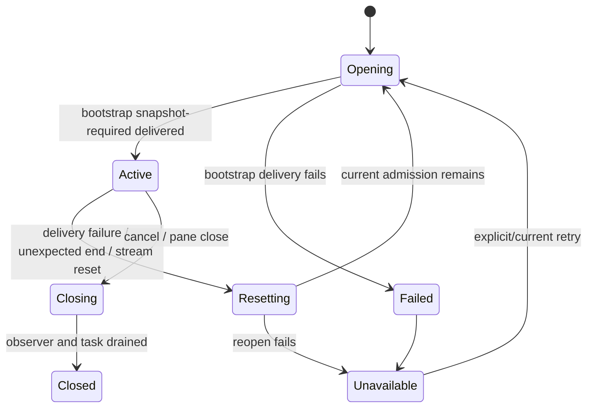
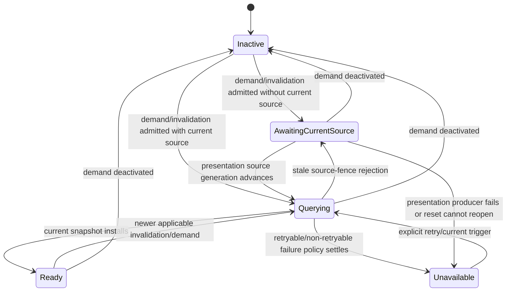
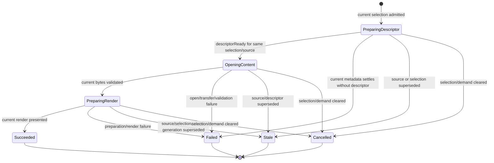
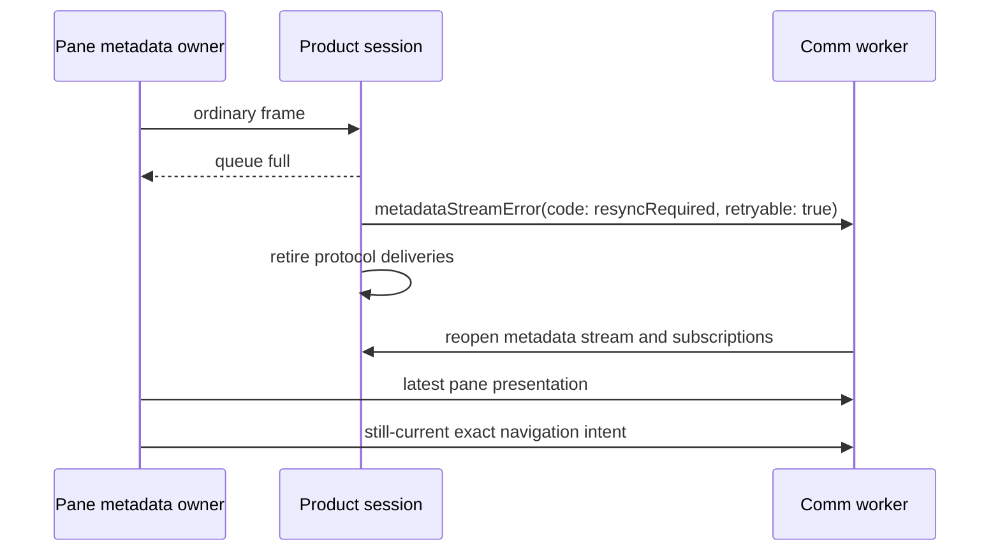
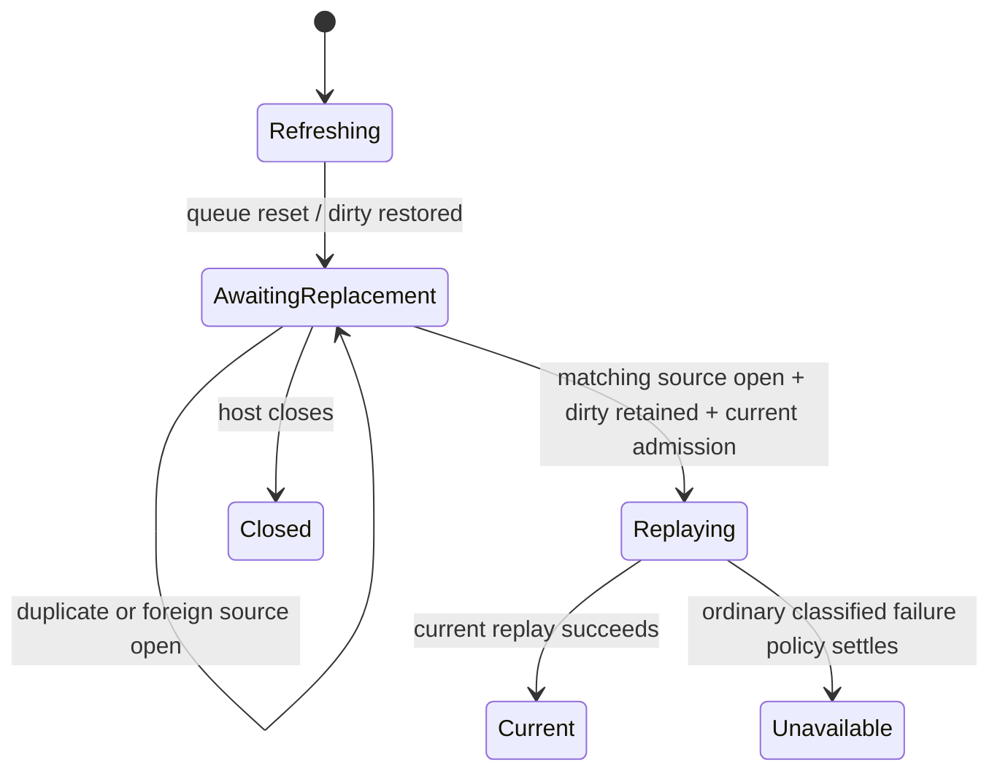

# Bridge Latest-Generation Operations — Program Design

Requirements:
[2026-08-18-requirements.md](./2026-08-18-requirements.md)

Specification:
[2026-08-18-specification.md](./2026-08-18-specification.md)

## Structural crux

Bridge already carries source generations, worker derivation epochs, admission
tokens, subscription identities, request sequences, descriptor identities, and
late-install guards. The missing structure is not another global counter.

The crux is that authority is split inconsistently:

```text
authority to be current
authority to start a successor
authority to cancel old physical work
authority to publish
authority to justify visible loading
authority to report terminal outcome
authority to release resources
```

Some owners fence stale publication but still wait for obsolete physical work;
some child producers terminate without supervisor settlement; some UI state
cannot represent failure separately from command completion. The correction
unifies the lifecycle contract without moving feature policy into one global
operation manager.

## Current system and constraints

### Current native refresh path

```text
filesystem/status invalidation
  → BridgePaneController.handleWorktreeProductInvalidation
  → BridgePaneRefreshAdmissionCoordinator.recordInvalidation
  → one combined File+Review activeRefreshPass
  → activeReviewRefreshTask gate permits only one task
  → publish File changes/status
  → construct and commit Review package
  → completeRefreshPass
  → publish pane.presentation with empty refreshingLanes
```

Current-source anchors are `BridgePaneController+RefreshAdmission.swift` and
`BridgePaneRefreshAdmissionCoordinator.swift`. A foreground successor is merged
into dirty state but cannot start while `activeReviewRefreshTask` exists. A
failed pass restores dirty state but does not immediately schedule another
catch-up. Stable 0.0.82 telemetry exposes construction capacity but not these
stage transitions.

### Current annotation convergence path

```text
exact command → SQLite/service commit → snapshot.required notification
  → one worker query loop → native single logical projection reservation
  → descriptor/content pages → private validation → atomic store apply
```

The worker fences late installs but does not abort an in-flight query on newer
invalidation. Same-demand reactivation can schedule a loop that fails its
generation predicate. Subscription failure and explicit retry/disposal are not
fully driven. Projection failure emits generic health without moving the
surface store to unavailable.

### Current counterexample that works

Once an authorized descriptor exists, selected File content already advances a
per-item preparation generation, aborts old work, and rejects late installs by
generation and selection. The target retains that pattern without a global
scheduler and extends it to the missing pre-descriptor interval, where current
Loading has no operation terminal today.

### Current development-backend gap

The Swift development backend currently resolves `--seed-worktree` into Core
topology, initial Git reads, and one `BridgeDevelopmentProductHost`. It starts
the HTTP application and persistence observation, but it does not compose the
Core `FilesystemActor`, `GitWorkingDirectoryProjector`, worktree registration,
or an event consumer that routes File/Review invalidations. Its host also owns
the refresh admission state but not the packaged controller's refresh task
scheduler. The result is a static request-serving harness rather than the
production-equivalent fast loop required by R-BLO-016.

### Degree of constraint

This is compatibility- and legacy-ownership-bound:

- the three physical product routes remain;
- native Git/source and construction owners remain;
- SQLite/repositories remain durable annotation authority;
- pane admission and worker derivation epochs remain safety fences;
- File, Review, annotation, content, and render owners remain separate;
- existing shared immutable construction and Git read capacity owners remain.

## Alternatives

| Direction | Gain | Cost and failure consequence | Falsifier |
| --- | --- | --- | --- |
| Keep serial task gates; add timeouts/watchdogs | smallest code delta | successor still depends on obsolete task lifetime; timeout reports failure but does not create safe current authority or late-publish fencing | any cancellation-ignoring operation strands a newer intent |
| One global Bridge operation framework | uniform state and telemetry | centralizes feature policy, duplicates existing epochs/leases, and becomes a shallow coordination layer every owner must bypass or overconfigure | File/Review/annotation owners still need distinct identity and recovery rules |
| Small common lifecycle contract plus feature-owned machines | consistent authority/terminal semantics while preserving owners | requires explicit state machines and current-to-proposed cutover in several owners | two features cannot express the contract without contradictory semantics |
| Copy app refresh/watcher loops into the development server | quick local parity | two lifecycle implementations drift; tests can prove the copy rather than production semantics | any app fix must be repeated in the development executable |

Selected direction: the small common contract plus feature-owned machines.

Accepted debt: physical cancellation remains cooperative. Existing capacity
owners remove logically cancelled queued admissions, allow obsolete running
work to drain, and apply their existing bounded wait to current queued work. A
current operation that cannot execute within that wait terminates with a
retryable capacity failure; its surface becomes unavailable with explicit
retry. The correction neither overcommits nor forcibly preempts running Git
work. Revisit only if measurements show that a shared generic controller removes
more policy than it duplicates.

## Integrated target topology



The shared relationship is behavioral: every owner exposes current identity,
terminal outcome, and cleanup. No ambient operation registry becomes a new
product authority.

## Common lifecycle vocabulary

The Bridge feature owns small value contracts used by telemetry, tests, and
owner interfaces:

```text
BridgeOperationID        UUIDv7 correlation, not authority by itself
BridgeOperationTerminal succeeded | failed | cancelled | stale
BridgeOperationStage    owner-defined bounded stage name
```

No shared component owns current-generation policy. Each feature owner defines
its fence from its existing authorities. The table below is the authoritative
cross-owner inventory; it does not imply one shared fence wrapper or type.
Telemetry projects only the safe owner-local fields required for correlation.

| Owner | Current fence |
| --- | --- |
| native File refresh | pane/product admission + File refresh generation + source identity |
| native Review refresh | pane/product admission + Review refresh generation + source fence + base publication identity |
| metadata producer | pane session + worker instance + stream lease/sequence + subscription identity |
| File content | worker derivation epoch + item/preparation generation + descriptor identity + selection |
| Review content/render | worker derivation epoch + publication/source identity + item/render generation + receipt identity |
| annotation projection | surface demand generation + File/Review source generation + snapshot ID + query generation |
| command | pane/session admission + request/correlation sequence + request ID + expected durable revisions |

## Production-equivalent development backend

### Shared Core worktree observation

The development-server composition directly composes the existing
package-visible Core `FilesystemActor` and `GitWorkingDirectoryProjector` on a
dedicated `EventBus<RuntimeEnvelope>`, using their production clients and
`AppPolicies`. It does not import or move the App-owned
`FilesystemGitPipeline`, whose additional Forge, fleet, and watched-folder
composition remains App-specific. Reuse is at the production actor and policy
boundary, so no watcher, coalescer, or Git projection behavior is copied.



`BridgeDevelopmentSeededWorktreeObservation` subscribes before registration
and accepts only envelopes whose repo/worktree identities match the configured
source. It routes `filesystem.filesChanged` and
`gitWorkingDirectory.snapshotChanged` to the host and ignores unrelated event
families. It has no repository discovery, watched-folder, Forge,
workspace-fleet, or App-shell role.

The FSEvent client and `FilesystemActor.register` gain a narrow typed
registration result. The development composition reports ready only after the
exact root is active; failed registration rolls back the actor root and fails
startup. Unexpected ingress completion or another detected observation
terminal is delivered to the observation service, which stops current claims
and drives explicit degraded/unavailable settlement rather than silent stale
state. No health polling or wall-clock watchdog is added.

Startup installs the critical event consumer before registration, starts the
Git projector before the filesystem actor, registers the exact identity, and
marks that worktree active and active-pane in both actors. This gives the
development pane the same foreground admission/cadence as the packaged pane;
registration alone is not treated as continuing demand.

For each admitted `filesChanged` or `snapshotChanged` envelope, the development
router first invalidates the exact `BridgeWorktreeProductConstructionCoordinator`
worktree epoch, then records the normalized File/Review invalidation. File work
runs through the shared driver; an affected Review lane is handed to the
development host. Advancing construction freshness before either preparation
starts prevents File and Review from reacquiring artifacts under the old epoch.

One development-runtime lifecycle owner replaces the current independent host
shutdown service. Shutdown stops event admission, unregisters the worktree,
cancels and awaits the routing task, closes and drains the refresh driver and
product host, shuts down the filesystem actor and Git projector, then flushes
Core persistence. Repeated shutdown is idempotent; no concurrently running
service may race a late observation callback against host retirement.

### Shared Bridge File refresh driver

`BridgePaneWorktreeRefreshDriver` becomes the feature-owned File effect and task
lifecycle owner used by both `BridgePaneController` and
`BridgeDevelopmentProductHost`. `BridgePaneRefreshAdmissionCoordinator`
remains the MainActor authority/dirty-state owner. The driver owns active and
retiring File refresh tasks, bounded retry execution, explicit File retry,
serialized presentation publication, and reset-recovery rendezvous. It records
the normalized File/Review dirty fact and returns the affected lanes; each host
retains its existing Review construction, comparison-generation, and commit
owner. This shares the duplicated File policy without forcing structurally
different Review implementations behind a shallow generic executor.

```text
BridgePaneController ───────┐
                            ├─► BridgePaneWorktreeRefreshDriver
BridgeDevelopmentProductHost┘       │
                                    ├─► refresh admission coordinator
                                    ├─► File metadata publication
                                    ├─► affected Review-lane fact to host
                                    └─► pane presentation publication
```

The runtime interface is behavioral:

- `record(invalidation)` advances lane authority, schedules File work, and
  returns affected lanes for host-owned Review scheduling;
- `applyActivity` suspends/resumes through the existing admission contract;
- `retryUnavailableFile` admits a new File attempt only from retained
  unavailable state;
- `recordStreamReset(operation, sourceAtReset)` parks restored dirty File facts without spending
  retry or publishing unavailable;
- `recordFileSourceAccepted(source)` records the latest exact File source;
  a strictly newer matching subscription generation joins reset with restored
  dirty state and schedules exactly one replay;
- `closeAndDrain` rejects new work, invalidates authority, and drains owned
  tasks.

No route, Atom, persistence record, polling loop, or global operation manager
is added.

### Development source-triggered Review continuation

The development host gains one worktree-invalidation Review operation alongside
its existing bootstrap and explicit comparison-update paths. When the shared
driver reports an affected Review lane, the host advances its Review authority
generation, retires the older Review task, resolves the current comparison
target, and prepares through the existing Review pipeline, shared-construction
binder, and publication coordinator. Commit requires the captured Review fence;
late predecessors clean only. Failure/stale settlement updates the admission
coordinator while retaining the last complete publication.

```mermaid
sequenceDiagram
    participant Route as Development invalidation router
    participant Driver as Shared File driver / admission
    participant Host as Development Review owner
    participant Build as Review pipeline / shared construction
    participant Commit as Publication coordinator

    Route->>Route: invalidate exact construction epoch
    Route->>Driver: normalized invalidation 10
    Driver-->>Host: Review lane affected at authority 10
    Host->>Build: prepare current target under fence 10
    Route->>Driver: normalized invalidation 11/12
    Driver-->>Host: Review lane affected at authority 12
    Host->>Host: retire 10; admit 12
    Host->>Build: prepare 12
    Build-->>Host: late candidate 10
    Host-->>Build: stale / cleanup only
    Build-->>Host: candidate 12
    Host->>Commit: commit if Review fence 12 remains current
```

## Replaceable finite-operation lifecycle



This state machine governs finite operations that prepare one candidate and
publish one terminal result. Progressive File metadata does not pass through
`CandidateReady`: each current-fenced emission advances coverage, and the File
operation succeeds only after its dirty aggregate is fully re-covered.

Rules:

1. The owner advances its authority generation/current identity before requesting
   cancellation.
2. `Succeeded`, `Failed`, `Cancelled`, and `Stale` are the only semantic
   terminals. `Cleaning` is resource state, not another outcome or visible
   current authority.
3. Exactly one terminal outcome is recorded. Cleanup can be repeated safely but
   cannot create another semantic terminal.
4. Loading is derived only from a current operation in `Queued`, `Preparing`, or
   `CandidateReady`.
5. Capacity delay is visible as current queued work, not attributed to old
   cleaning work. Cancelled queued work releases its queue admission. If the
   current operation exceeds the capacity owner's bounded wait behind running
   work, it fails with a retryable capacity terminal and its surface becomes
   unavailable with explicit retry.

## Native File and Review refresh ownership

### Split the combined pass into per-lane authority

`BridgePaneRefreshAdmissionCoordinator` remains the MainActor state owner but
tracks File and Review independently:

```text
FileRefreshState
  authorityGeneration
  dirty aggregate:
    earliestUnappliedGeneration
    paths/status/latest batch sequence
  current operation
  last terminal

ReviewRefreshState
  authorityGeneration
  dirty source fence / comparison intent
  current operation
  last terminal
```

One filesystem event may advance both authority generations, but File publication
does not wait for Review construction and Review loading does not justify File
chrome. Pane presentation projects per-lane state.

Initial Review package load, retained Review rebuild, comparison refresh, and
product resync are all Review-lane operations under this same authority. The
current pane-wide `activeReviewRefreshTask` gate is removed as File authority;
File work may start or queue while a Review-lane operation is active. Review
operations still serialize or supersede according to their Review generation.

`authorityGeneration` is the latest-intent supersession and commit fence. Each
operation captures it at admission and every publish/commit compares against
the current value. `earliestUnappliedGeneration` denotes the beginning of the
dirty invalidation interval; it is never a commit fence. Paths/status and
`latestBatchSequence` merge the newest content. Restoring a failed/stale
operation combines the minimum earliest-unapplied generation with the maximum
batch sequence and unioned current facts.

### Successor sequence

```mermaid
sequenceDiagram
    participant FS as Filesystem
    participant Coord as Refresh admission coordinator
    participant Old as Operation 10
    participant New as Operation 11
    participant Source as Git / construction capacity
    participant Publish as Pane publication owner

    FS->>Coord: invalidation 10
    Coord->>Old: prepare under fence 10
    Coord-->>Publish: File/Review current generation 10 refreshing

    FS->>Coord: invalidation 11
    Coord->>Coord: authority generation = 11; merge dirty aggregate
    Coord->>Old: cancel; authority 10 ends immediately
    Coord->>New: start/queue under fence 11
    New->>Source: prepare immutable candidate

    Old-->>Coord: late completion 10
    Coord-->>Old: stale; cleanup only

    Source-->>New: candidate 11
    New->>Coord: commit(fence 11)
    Coord->>Publish: current result 11; refreshing false
```

The existing Git scheduler and shared construction coordinator continue to own
physical capacity, joins, leases, and epoch invalidation. Obsolete operations
remain logically cancelled even if shared immutable construction is safely
joined or drains. If capacity cannot admit current work under policy, the lane
operation fails with a retryable capacity terminal and the lane surface becomes
unavailable instead of keeping old loading indefinitely.

### Private prepare and atomic commit

Review publication and finite logical File/Review products use immutable
candidate preparation and atomic current-fence commit. File metadata remains
progressive: current-fence changeset, status, descriptor, and tree emissions may
publish incrementally before Review construction finishes. Every incremental
File emission revalidates its File operation fence; stale File work may publish
nothing further. This preserves the current progressive File browsing contract
while keeping Review publication and finite content atomic.

File metadata is current only after the current operation has applied every
still-current fact from `earliestUnappliedGeneration` through the newest
`latestBatchSequence` and cleared its dirty aggregate. If supersession occurs
after a partial emission set, retained metadata remains usable but refreshing;
the successor inherits and re-covers the complete remaining aggregate before it
may publish current coverage.

Review comparison attempt presentation is derived from the current operation,
not mutated by an operation that has already lost authority. File invalidation
may mark previous File content stale immediately. Replacement File metadata may
advance progressively only from the current File operation.

### Failed current work with retained dirty state

Failure clears refreshing authority. A retryable failure with retained dirty
work performs at most one automatic retry of the latest retained facts:

```text
retryScheduled(attempt = 1)
  → succeeded
  | unavailable(retryable, explicitRetryAvailable)
```

Non-retryable failure becomes unavailable immediately. Retry policy belongs in
the feature owner; `AppPolicies` owns only the maximum automatic-attempt count
and existing capacity deadlines. Permanent or repeated failures do not loop.
Explicit retry, a new invalidation, or foreground return creates a new current
operation. The dirty aggregate remains until a current operation applies it.

Each feature maps its native/worker errors into one shared terminal vocabulary
before applying retry policy:

| Cause class | Terminal classification | Retry behavior |
| --- | --- | --- |
| existing capacity-owner timeout | failed, retryable | at most one automatic retry of newest retained facts |
| temporary current-source or projection-capture unavailability while authority remains current | failed, retryable | at most one automatic retry |
| source/demand/selection/publication fence mismatch | stale | never consumes retry; named current successor must run |
| descriptor pending while the current metadata producer can still supply it | preparing | event-driven continuation, not retry |
| current metadata settles without a usable descriptor | failed, non-retryable; surface unavailable | new source/demand or explicit retry required |
| descriptor/cursor/request-authority/page/digest/schema/integrity mismatch | failed, non-retryable | unchanged input is not retried |
| unsupported content or wire value | failed, non-retryable | unchanged input is not retried |

Queue reset is not a retryable File-refresh failure. It is a transport
replacement terminal: retained File dirty facts park under the captured source
identity, the replacement stream opens its File source, and the matching two-fact
rendezvous schedules one replay without consuming the automatic retry budget
or exposing unavailable.

## Exact command and read convergence

The current RPC/service/repository transaction path remains intentionally
unchanged in authority:



The command UI leaves in-flight state on exact receipt. A receipt may carry the
committed revisions needed to recognize convergence, but it does not contain
arbitrary projection rows. Projection failure never changes a successful
command into failure or in-flight.

## Protocol producer supervision

### Supervised protocol producers

The metadata coordinator and product session supervise every protocol producer;
no child task may represent itself as active after it ends. The lifecycle below
governs the pane-presentation producer, File metadata producer, Review metadata
producer, and File/Review annotation notification producers. Opening a stream or
subscription installs one producer operation whose task reports its terminal to
the supervising coordinator. Delivery failure, unexpected end, replacement,
foreground loss, and close are distinct terminals.



The producer task, observer token when present, protocol lease, and subscription
settle together. A task may not remove itself silently while the protocol
remains active. Finite File, Review, annotation-projection, and output content
producers use the same supervision invariant but terminate with content
`end/error/reset`; they do not reopen in place. Current demand admits a new
finite producer after a retryable terminal or reset.

## Annotation notification and projection

### Scoped invalidation vocabulary

The current PR1 Program Design contract is realized:

```text
sessionChanged(notificationRevision, sessionID, semanticRevision)
discoveryChanged(notificationRevision)
recoveryChanged(notificationRevision)
snapshotRequired(notificationRevision)
```

Per-observer aggregation retains the newest demanded session revision plus
discovery/recovery flags; `snapshotRequired` supersedes narrower facts. The
pre-release annotation notification wire member cuts over from
`sourceGeneration` to `notificationRevision`. It orders that notification
subscription only and never becomes the File/Review projection source fence.

### Cancel-and-replace query controller

Each surface controller owns:

```text
desiredQueryGeneration
current convergence operation
current query attempt
one newest aggregate invalidation
last complete snapshot
surface state: inactive | ready | refreshing | unavailable | disposed
```

New applicable invalidation or changed demand:

1. advances desired query generation;
2. marks old operation stale and aborts its query/content signal;
3. starts or queues the newest current query immediately;
4. rejects any late old install;
5. retains last complete snapshot.

The convergence operation may outlive one query attempt while it waits for a
current File/Review presentation source generation. Query-attempt terminals are
classified before they affect surface state:



Native `staleSourceGeneration` and equivalent fence mismatches end only the
query attempt as `stale`; they do not invoke projection failure, consume the
automatic retry, or publish unavailable. The controller retains the newest
aggregate invalidation and keeps the convergence operation in
`AwaitingCurrentSource`; visible refreshing remains derived from that live
operation. The pane-presentation source-generation update is the named successor
trigger: it advances `desiredQueryGeneration`, aborts any obsolete signal, and
starts the current query attempt. If the presentation producer terminates before
delivering that trigger, producer supervision settles the convergence operation
through reset/reopen or unavailable.

Deactivation marks current work cancelled and the demand stale. Reactivation
always advances a retry/query generation when demand is stale, even if source
and session signatures are textually unchanged. Subscription failure drives
reset/reopen. Explicit retry and disposal have production owners.

### Snapshot-keyed native reservations

The native projection source replaces its single mutable logical reservation
with bounded snapshot-keyed reservation custody:

```text
reservationBySnapshotID
descriptorReservationByID
currentSnapshotIDBySurfaceOperation
```

Starting query 11 can retire query 10 logically while already-issued query-10
content drains. Cursor and descriptor claims remain single-use and bound to
pane/session/worker/surface/source/query generation. Retired snapshots may
serve no new continuation and release after outstanding content terminal or
cleanup policy.

Each surface admits at most one current snapshot reservation plus one retiring
snapshot reservation (`AppPolicies` bound: 2). A third replacement immediately
revokes the oldest retiring snapshot: it accepts no continuation, settles any
unclaimed descriptors with terminal reset/error, and performs idempotent
cleanup. The current reservation is never displaced by cleanup of an older one.

### Page contract

The first page supplies immutable snapshot fields and an explicit finite total:

```text
snapshotID
pageCount
totalByteCount
aggregateSHA256
expected session/thread/message counts
source generation
projection revision
```

The worker separately tracks `firstPageContract`, `previousPageOrdinal`,
`observedPageCount`, and `observedTotalBytes`. It accepts ordinals
`0...(pageCount-1)` exactly once, including three or more pages, and rejects any
over-bound or mixed sequence before atomic install.

## File content and Review render fulfillment

### File selected-content operation

The worker File-content controller owns one operation for the current selection
epoch. Selection admits the operation before an authorized descriptor exists;
therefore visible File Loading always has a current operation owner rather than
an unowned `pending` fetch result.



The operation carries the existing worker derivation epoch, selection identity,
source generation, item/preparation generation, and descriptor identity when
available. `file.descriptorReady` continues only an operation whose selection
and source fence remain current. Source or selection replacement advances the
owner's generation, marks the old operation stale, aborts any open/preparation,
and admits the successor immediately. Late work cannot install or clear the
successor's Loading state.

Descriptor-wait remains event-driven. If the current metadata producer reaches
a terminal/reset without supplying a usable descriptor, the current operation
fails non-retryably for that input and the File surface becomes unavailable with
the last complete presentation retained. A reopened producer, new source/demand,
or explicit retry admits a new operation; there is no polling loop or independent
descriptor watchdog.

### Review render fulfillment

Review demand/content and render fulfillment retain separate owners. A source
or item replacement advances the render generation, invalidates old receipts,
and starts the current job under existing capacity. A stale render terminal
cannot clear current loading or mark current paint fulfilled. Chrome settlement
and render settlement remain independent observable operations.

Pane refresh becoming current/idle does not imply render presentation. A failed
or stale render does not reactivate native refresh, and the last complete Review
render remains until a current render presents.

## Metadata overload and replay

Ordinary metadata uses ordinary admission. If capacity cannot admit another
ordinary frame, the session-owned overflow path consumes reserved terminal
capacity to emit a valid reset/error terminal.



File refresh adds one internal native handoff to that sequence. A File operation
captures the latest accepted `BridgeProductFileSourceIdentity`. When queue reset
rejects an ordinary File emission, the driver parks the operation and captured
source identity. Successful opening of a File metadata source already reports
its exact source identity through the existing accepted-source observer. A
matching repo/worktree/root source whose `subscriptionGeneration` is strictly
newer releases the rendezvous. Source identity plus current product admission
prevents an old source-open callback from waking newer dirty work.



Reset observation and source acceptance may complete in either order. The
refresh driver records both facts and consumes their matching identity once; it
does not rely on callback timing.

The pane metadata coordinator retains newest pane presentation and exact
navigation until acknowledged/settled. Queue reset is not recorded as successful
application of the dropped ordinary frame. Increasing capacity is not the
repair.

Metadata overflow reuses the existing terminal metadata frame
`.metadataStreamError(code: .resyncRequired, retryable: true, safeMessage: nil)`;
it does not add a metadata-reset frame kind. `producerOverflow` remains the
producer/session reset reason used for local classification and telemetry, not
the wire error code. Both pane-presentation and exact-navigation overflow
builders emit this terminal through the reserved terminal-capacity path.

## Wire contract and time

### Exhaustive strict vocabulary

The Swift transport-contract layer owns one
`BridgeProductStrictJSONContractVocabulary` registry. Every strict product wire
DTO reachable from a registered request, response, metadata frame, or content
frame declares explicit `CodingKeys: String, CodingKey, CaseIterable` and
exposes its member names from `CodingKeys.allCases`. Registered contracts may
compose nested providers, but no strict product DTO relies on compiler-
synthesized implicit keys. Hand-written encoders and decoders use that same
explicit `CodingKeys` type.

The exhaustive top-level product request/response/frame discriminants enumerate
the registered root providers. Their exhaustive switches are the compile-time
variant gate; the union of provider member names is the scanner vocabulary. The
existing hand-maintained flat `productMemberVocabulary` literal is removed.

Enforcement has three owners and classes:

| Invariant | Owner | Enforcement class |
| --- | --- | --- |
| every reachable wire variant has a registered root provider | exhaustive product contract discriminants | compiler-exhaustive switch |
| every registered DTO derives member names from explicit keys | transport DTO conformance | type/interface using `CaseIterable CodingKeys` |
| every valid encoded member passes the production scanner and matching BridgeWeb schema | Swift/TypeScript contract vectors | automated round-trip test through production decoder |

This proof uses explicit contract metadata and exhaustive variants, not runtime
reflection or an attempt to discover synthesized Swift keys.

Swift and TypeScript share valid/invalid vectors for every method/result,
discriminant, field, nullability, and limit. A valid Swift-encoded response is
round-tripped through the exact production settlement decoder before any result
is considered supported.

### Explicit wire time

Bridge annotation wire dates cut over to one explicit representation:

```text
createdAtUnixMilliseconds: integer
updatedAtUnixMilliseconds: integer
completedAtUnixMilliseconds: integer or null
authoredAtUnixMilliseconds: integer
epoch: Unix 1970-01-01T00:00:00Z
unit: milliseconds
range: product safe integer and supported Date range
```

Swift conversion is explicit at the DTO boundary; BridgeWeb constructs `Date`
only through one validated conversion helper. Relative and absolute renderers
consume the same value.

The production settlement decoder is the sole raw-wire-to-decoded-value
boundary. It validates the Unix-millisecond wire members once and returns the
decoded BridgeWeb contract, whose timestamp members use the canonical decoded
names and values. Product controllers, runtime-event factories, worker-event
schemas, and UI consumers validate the decoded contract and MUST NOT reapply a
raw-wire schema to an already decoded result. Raw and decoded schemas remain
separately named and receive a contract test whenever any member transforms;
this prevents a valid non-empty result from being rejected merely because a
downstream owner expects the pre-transform field name.

### Content terminal symmetry

Every registered complete content terminal includes the common observed byte
length and digest fields. Type-level registry assertions guarantee that the
shared decoder result is representable for every content kind.

## Bounded correlation and custody

Request/outcome maps are rendezvous buffers, not history. The entry is removed
as soon as both halves settle. Orphan entries are session/generation scoped,
bounded by `AppPolicies`, and cleared on close/restart.

Every operation's custody record names:

```text
observer token
subscription handle
abort/cancellation handle
descriptor and snapshot reservations
artifact pin or content handle
pending response resolver
cleanup terminal
```

Cleanup is idempotent. Losing authority never transfers cleanup responsibility
to the successor.

## Failure, concurrency, and recovery

| Interleaving/failure | Owner response | Invariant |
| --- | --- | --- |
| native refresh 10 active; 11/12 arrive | advance lane authority generation to 12, merge dirty aggregate, cancel 10, start/queue 12; 11 need not start | 10 cannot publish; 12 owns loading |
| cancellation ignored by 10 | cancelled queued admission is removed; running 10 cleans asynchronously; 12 runs/queues as current and becomes unavailable with retry only after the capacity owner's bounded wait | old physical lifetime is not current/loading authority; no forced preemption |
| native current refresh fails with dirty retained | bounded retry or unavailable/explicit retry; publish terminal/idle state | no silent dirty-current state |
| progressive File metadata partially emitted, then superseded | successor inherits earliest unapplied interval plus newest facts and re-covers them before current status | retained metadata remains usable; partial coverage is never current completeness |
| File content selected before descriptor exists | admit current File-content operation in descriptor-preparing; matching descriptor continues it; producer terminal without descriptor fails it and makes the surface unavailable | every visible Loading state has a current operation and terminal path |
| File candidate current, Review candidate stale | File may publish current-fenced coverage independently; Review stale cleans up | lane ownership is independent |
| annotation query 10 blocked; 11...15 arrive | cancel 10; coalesce to 15; start 15; late 10 rejected | last complete retained; only 15 may install |
| annotation notification arrives before presentation source generation | query attempt terminates stale; convergence operation awaits current source; presentation generation starts successor without consuming retry | no transient unavailable flash or retry of a known-stale fence |
| annotation producer emit fails | coordinator receives failure, retires delivery, reopens or publishes unavailable | no dead active subscription |
| metadata queue fills | emit `metadataStreamError(.resyncRequired, retryable: true)`, retire, reopen, replay latest | no nonterminal overflow substitute or invented metadata-reset frame |
| File frame queue reset while dirty work remains | restore dirty facts; park the operation with its accepted source identity; a strictly newer matching File source joins and replays once without retry/unavailable | no silently stale File tree/status and no same-stream retry |
| development seeded worktree changes | production Core actors emit typed facts; exact worktree is active/active-pane; development router invalidates construction freshness before shared File driver and host-owned Review refresh converge | development loop exercises foreground production semantics and one freshness epoch rather than static initial state |
| development observation start/runtime failure | typed registration failure prevents ready/HTTP start; a detected ingress terminal moves affected surfaces degraded/unavailable with last complete, then ordered shutdown drains every owner | no unconditional-health false green or silent stale development proof |
| page 0/1/2 | validate previous ordinal separately from first immutable fields | valid three-page snapshot installs |
| response encoder gains field | exhaustiveness gate fails until scanner and TS vectors agree | native never rejects its own valid current response |
| command success; projection fails | command remains succeeded; projection unavailable with last complete | persistence truth is not read convergence |
| render receipt for stale source | stale terminal and cleanup only | stale receipt cannot clear current render loading |
| crash/restart | discard in-flight operations; query durable truth; bootstrap streams | no invented success or replayed dead task |

## Current-to-proposed call-path deltas

| Behavior | Current edge | Target edge | Status |
| --- | --- | --- | --- |
| native invalidation | invalidation → one combined dirty fact/pass/task | invalidation → independent File/Review authority generations, File coverage aggregate, and current operations | changed |
| development worktree input | seed topology and initial reads only | subscribe before registration; register exact seed; mark active/active-pane; invalidate construction epoch before typed events reach shared File driver and host-owned Review refresh | changed |
| development Review invalidation | bootstrap/explicit comparison updates only | affected Review lane supersedes prior task, resolves current target, reuses existing pipeline/construction/publication, and commits under current Review fence | added |
| refresh task lifecycle | packaged controller privately schedules; development host has admission state but no File scheduler | shared Bridge File refresh driver owns File scheduling/settlement for both hosts; each host retains Review preparation/commit | changed |
| native successor | active task blocks reservation | current authority advances, old queued admission is removed or running work cleans asynchronously, newest starts/queues under bounded capacity | changed |
| File/Review commit | File publication precedes Review completion inside combined pass | progressive current-fence File emissions with successor re-coverage plus immutable/atomic Review publication | changed |
| initial/retained Review load | pane-wide `activeReviewRefreshTask` also gates package load/resync | Review-lane operation under Review generation; File lane independent | changed |
| failed dirty refresh | restore dirty; no immediate retry on failed terminal | bounded retry or explicit unavailable/named trigger | changed |
| pane chrome | combined active pass lanes justify loading | current per-lane operation state justifies active-surface loading | changed |
| command commit | exact RPC transaction/result | exact RPC transaction/result | intentionally unchanged |
| annotation invalidation | `snapshot.required(sourceGeneration)` only | strict scoped facts carrying `notificationRevision`; snapshot-required for bootstrap/reset; notification revision never query source fence | changed |
| annotation query | one loop waits for old request to settle and routes newest-attempt errors to failure | convergence operation + replaceable query attempts; stale fence awaits presentation-generation successor; snapshot-keyed draining reservations | changed |
| projection failure | generic health; store remains available; stale fence is undifferentiated | retryable/non-retryable failure classification drives unavailable/retry; stale fence remains refreshing under named successor | changed |
| protocol producer task | annotation child catches and retires silently; other producer supervision is implicit | File/Review metadata, pane-presentation, annotation notification, and finite content producers report terminal to their supervisor | changed |
| metadata overflow | pane-presentation/navigation overflow builders emit ordinary frames | existing terminal `metadataStreamError(.resyncRequired, retryable: true)` + replay latest retained state | changed |
| File overflow recovery | reset restores dirty then parks forever until accidental trigger | reset operation/source identity + strictly newer accepted File source join and re-admit retained dirty exactly once | changed |
| finite content route | command descriptor + content frames | same physical route and authority | intentionally unchanged |
| File descriptor wait/content replacement | selection publishes Loading; descriptor-pending emits no terminal; replacement uses abort + generation fence | selection admits File-content operation; descriptor wait is preparing; producer terminal/selection/source/content/render provide exact terminals | changed |
| render receipt | source/receipt fenced | same fence plus explicit current operation terminal correlation | strengthened |
| diagnostic operation carrier | refresh reservation, metadata producer, presentation frame, worker application, and annotation notification mint unrelated or absent trace identities | the current operation owner mints one scrubbed correlation and the existing strict metadata/presentation envelopes carry it through every applicable downstream stage | added |

## Telemetry and stuck-operation detection

One scrubbed `bridge.operation.id` and owner-local generation identity propagate
through applicable phases without exporting raw paths, payloads, message bodies,
errors, prompts, UUIDs from domain data, or output bytes.

The correlation carrier is diagnostic data inside the existing physical routes,
not product authority and not a global operation registry:

```text
current-operation owner (native or BridgeWeb)
  mints UUIDv7 operation identity
  retains it only with that operation's existing custody record
  derives lowercase SHA-256 bridge.operation.id
        |
        +--> native lifecycle samples
        |
        `--> existing strict metadata/presentation envelope
                 operationCorrelationId: SHA-256 | null
                    |
                    +--> worker application and validation samples
                    +--> main-thread install sample
                    `--> render/paint terminal samples
```

`operationCorrelationId` is nullable only when no refresh/content/annotation
operation has been admitted, such as an uncorrelated bootstrap or retained-state
replay. A current admitted operation MUST carry a non-null value through every
applicable envelope and receipt. `null` is not a compatibility fallback and may
not be used to make an admitted operation pass validation. Strict Swift and
TypeScript contracts validate the lowercase SHA-256 form and reject unknown or
malformed values.

Each native File or Review per-lane refresh reservation is its own correlation
owner. One invalidation affecting both lanes therefore creates two independently
correlated operations, matching the existing independent authority generations,
reservations, terminals, and retry decisions. Dirty-fact coalescence preserves
the current lane reservation identity; a successor admitted after supersession
mints a successor identity. Late predecessor stages remain correlated to the old
identity and cannot become current authority. The File reset-wait custody record
retains its lane identity across `resyncRequired`, subscription reopen, strictly
newer source acceptance, and the single retained-dirty replay.

Selected File content is a separate worker-originated operation. The
`BridgeCommWorkerSelectedFileContentOperationController` mints UUIDv7 at
selection admission and derives its scrubbed SHA-256 synchronously before
descriptor preparation. The selected-content request carries the correlation to
the existing native content owner; accepted/data/end/error frames echo it; the
worker validates the echo before applying bytes; and the worker-to-main render
receipt carries it through main install and paint. This identity never inherits
an unrelated File metadata-refresh identity. Source rebinding or a successor
selection mints a successor content identity, while a duplicate admission for
the same still-current selection retains the existing identity.

Review rendering remains native-presentation-originated. Its per-lane Review
reservation correlation travels on the existing presentation envelope into the
worker application and render receipt. A retained bootstrap/replay with no
admitted Review refresh may carry null and creates no claim about a current
refresh operation.

Annotation command/service invalidation is a separate operation family. Its
`WorktreeAnnotationServiceActor.publishCommittedMutation` mints the identity
before invoking the mutation and records the native start/terminal. On success,
the existing `WorktreeAnnotationChange.snapshotRequired` fact carries the
scrubbed identity through the observer stream into the notification source and
annotation metadata envelope, finite query/content validation, main install,
and paint. Other service-owned snapshot invalidations mint at their service
entry before publishing the change fact. Per-observer coalescence retains only
the newest change identity; the displaced predecessor receives a stale terminal.
A delivery failure/reopen retains the current change identity until that
operation terminates or a successor supersedes it. Annotation never borrows a
concurrent File/Review correlation merely because both share a worktree or
marker.

### Native File/Review chain

```text
refresh_reserved
file_prepare_started / file_prepare_terminal
review_prepare_started / review_prepare_terminal
refresh_commit_started / refresh_commit_terminal
refresh_operation_terminal
metadata_enqueue_started / metadata_enqueue_terminal
metadata_delivery_started / metadata_delivery_terminal
```

### Worker/presentation chain

```text
worker_application_started / worker_application_terminal
panel_chrome_publish_started / panel_chrome_publish_terminal
file_content_operation_started / file_content_operation_terminal
file_descriptor_wait_started / file_descriptor_wait_terminal
content_operation_terminal
main_thread_install_started / main_thread_install_terminal
render_operation_started / render_operation_terminal
paint_fulfillment_started / paint_fulfillment_terminal
```

### Annotation chain

```text
annotation_invalidation_received
native_annotation_work_started / native_annotation_work_terminal
metadata_enqueue_started / metadata_enqueue_terminal
metadata_delivery_started / metadata_delivery_terminal
worker_application_started / worker_application_terminal
projection_convergence_started / projection_convergence_terminal
projection_query_started / projection_query_terminal
projection_query_stale_awaiting_source
descriptor_claim_started / descriptor_claim_terminal
content_transfer_started / content_transfer_terminal
projection_validation_started / projection_validation_terminal
projection_store_started / projection_store_terminal
main_thread_install_started / main_thread_install_terminal
annotation_paint_started / annotation_paint_terminal
```

This is an `often` telemetry lane. Admission requires the existing explicit
Bridge lifecycle trace tag and a marker-scoped operation. Semantic terminal
facts are always emitted for admitted operations; in-progress progress facts
are equality-suppressed and may be sampled/aggregated. The observability owner
derives missing-terminal diagnostics from marker-scoped logs/metrics under an
`AppPolicies` threshold using bounded in-memory correlation or Victoria query
state. It is fail-open, never persists product task history, never mutates
product state, and never retries work. Metrics aggregate safe owner, phase,
terminal, duration, and count labels.

The lifecycle vocabulary is a closed phase graph. Every asynchronous boundary
that may wait emits a pre-call `*_started` sample and exactly one matching
`*_terminal` sample. A sample also carries safe `stageAttempt`: zero for a
single-instance phase, or the owner-local nonnegative attempt/generation ordinal
for repeated query, delivery, reopen, and render attempts. The diagnostic key is
`(bridge.operation.id, phase family, stageAttempt)`; source generations remain
separate evidence and never substitute for the operation identity.

Missing-terminal derivation groups by that key, verifies that each emitted start
has one terminal inside the bounded policy window, and classifies the earliest
missing phase family. A terminal without a start is a malformed lifecycle. A
stale attempt terminates `stale`; its expected-successor rule names the next
attempt ordinal under the same convergence operation or the successor operation
identity. Product owners emit starts and terminals but own no diagnostic timer.
The verifier/Victoria query owner may retain only bounded safe correlation state
and must discard it after the window.

## Cross-cutting realization

| Obligation | Structural owner and mechanism | Failure/degradation | Proof seam |
| --- | --- | --- | --- |
| trust and authorization | existing pane capability, product admission, worker/session identity, source containment, and owner-specific current fence | reject stale/foreign work before side effect or commit; no admission reacquisition | allowed/denied/stale identity vectors at command, stream, content, and commit boundaries |
| privacy | lifecycle telemetry projects only safe operation class, bounded phase, terminal, duration, safe generations/hashes, and counts | telemetry export drops or scrubs disallowed attributes and remains fail-open for product behavior | source projection tests plus negative canary checks in logs/metrics/traces |
| reliability | feature state machines, exact terminals, last-complete retention, supervised producers, reset/reopen, idempotent cleanup | unavailable with last complete and bounded recovery trigger; no fabricated empty/current state | deterministic interleavings plus real failure/reconnect/restart journeys |
| performance and capacity | existing Git scheduler, shared construction coordinator, content demand policy, page/byte totals, bounded rendezvous/custody | current work queues under bounded capacity or terminates unavailable; obsolete work cannot justify loading; no queue-limit workaround | capacity-state tests and marker-scoped latency/terminal measurements under rapid invalidation |
| accessibility | no new visual control contract; command/read/render state changes feed existing accessible status and controls | unavailable/retry and successful command state remain distinguishable without relying only on color or motion | packaged VoiceOver/keyboard/reduced-motion regression on affected File/Review/annotation states |
| platform compatibility | existing Swift concurrency, WKWebView product routes, Web Worker cancellation, and supported browser runtime remain | unsupported or malformed wire values fail closed; physical cancellation remains cooperative | Swift/Web contract vectors and packaged WKWebView lifecycle journey |

## Proof architecture

| Requirement | Structural seam | Real versus replaceable boundary | Required observation |
| --- | --- | --- | --- |
| R-BLO-001/005 | feature operation state/fence and cancellation handle | dependency work may be fake for deterministic interleaving; current commit owner real | 10/11/12, cancellation ignored, late old terminal cannot publish; current starts/queues |
| R-BLO-002/003 | exact command result, progressive File coverage owner, and independent finite-result stores | real SQLite/service/HTTP, native File publication, and browser stores | commit succeeds while projection fails; progressive File partial emission is re-covered; Saved + unavailable/last-complete |
| R-BLO-004/006/007 | File-content operation, convergence/query attempt classifier, and supervised protocol producers | descriptor/presentation/producer/coordinator paths real | descriptor pending/arrival/producer-end terminals; stale-before-presentation successor without retry; every producer terminal/reopen; zero residue |
| R-BLO-008 | producer registry/session/coordinator | real bounded queue and protocol reopen | exact `metadataStreamError(.resyncRequired, retryable: true)`, no lifecycle mismatch, replay latest pane/navigation |
| R-BLO-009 | page analyzer/cursor/worker decoder | unit matrix plus real content route | valid 1/2/3+ pages, all malformed sequences, total bound, atomic install |
| R-BLO-010/011 | exhaustive strict-contract vocabulary providers/registry, production scanner, and explicit time DTO | Swift encoder/strict decoder plus TS schema/browser Date real | every registered variant/key round-trips; missing provider/key fails before runtime; fixed instant agrees relative/absolute |
| R-BLO-012 | operation custody snapshots | real owner close/restart and repeated load | bounded maps/reservations/observers; idempotent cleanup |
| R-BLO-013 | service observer aggregation and query controller | real two-pane service/session | narrow coalescence, reset supersession, both panes converge |
| R-BLO-014 | operation-owned scrubbed correlation carried by strict metadata/presentation and selected-content request/receipt envelopes; closed start/terminal graph keyed by safe stage attempt; observability-owned bounded missing-terminal reduction | real debug/stable native and BridgeWeb operation producers, metadata/reset/reopen, content, worker/main/render consumers, and Victoria | one operation ID joins every applicable stage; worker-originated content and per-lane refresh paths remain distinct; each withheld terminal names the first missing family; negative private-content query stays empty |
| R-BLO-015 | architecture boundaries and full product journeys | real native/worker/File/Review/annotation paths | no Atom/second route/parallel authority; existing behavior preserved |
| R-BLO-016 | production Core filesystem/Git actors, active/active-pane admission, construction freshness invalidation, exact development router, shared File driver, and host-owned Review continuation | real seeded worktree, production actors, development HTTP/Vite/worker path | source edit, status/branch 10/11/12, overload/reopen, registration rejection, detected ingress terminal, and deterministic shutdown converge without fixture injection |

Unit/fake tests may prove local transitions. They do not clear native-to-worker,
two-pane, overload/reconnect, Swift-to-browser time, packaged render, or OTEL
proof obligations.

## Cutover

The cutover is one hard lifecycle change with no compatibility shim:

1. per-lane authority-generation/current-operation state becomes authoritative;
2. old combined task/presentation authority and silent child task semantics are
   removed in the same product build;
3. command/projection UI states cut over together;
4. annotation notification and snapshot-keyed reservations cut over together;
5. strict wire vocabulary/time/terminal contracts cut over symmetrically in
   Swift and BridgeWeb;
6. File selection admits the selected-content operation before descriptor
   arrival; the old ownerless descriptor-pending Loading path is removed;
7. metadata overflow builders cut over to the existing terminal
   `metadataStreamError(.resyncRequired, retryable: true)` and the strict scanner
   vocabulary derives from the exhaustive contract registry;
8. existing three routes, SQLite schema/domain meaning, Git/source owners,
   construction capacity, File/Review presentation, and PR1 UI remain.
9. the packaged controller and development host cut over together to the shared
   File refresh driver; the development backend registers its exact seeded
   worktree with the production Core filesystem/Git actors before reporting ready.
10. strict Swift and TypeScript metadata/presentation plus selected-content
    request/frame/render-receipt envelopes gain the nullable diagnostic
    `operationCorrelationId` together; every admitted operation producer and
    consumer cuts over in the same build, with no old uncorrelated admitted-
    operation path.

There is no dual writer or dual transport phase. Rollback is source rollback
before release; no new durable lifecycle state requires data migration.

## Requirement realization

| Requirements | Primary owners and mechanisms |
| --- | --- |
| R-BLO-001/004/005/006 | per-lane authority generations; selected File-content and projection-convergence operations; feature error classifiers; immediate logical supersession; terminal/custody contract |
| R-BLO-002/003 | exact RPC terminal; progressive File coverage; independent last-complete finite-result state machines |
| R-BLO-007 | metadata coordinator/product session supervised protocol producers and reset/reopen |
| R-BLO-008 | product session reserved terminal capacity, existing resync-required metadata error terminal, and retained-state replay |
| R-BLO-009 | snapshot-keyed reservations, explicit totals, ordered cursor and private decoder |
| R-BLO-010/011 | exhaustive strict-contract vocabulary providers/registry/vectors and Unix-millisecond DTOs |
| R-BLO-012 | bounded rendezvous and operation-owned idempotent cleanup |
| R-BLO-013 | scoped service notifications and per-observer coalescence |
| R-BLO-014 | correlated lifecycle telemetry and missing-terminal diagnostic |
| R-BLO-015 | existing owner/route preservation and architecture enforcement |
| R-BLO-016 | production Core filesystem/Git actors, exact foreground development routing, construction freshness ordering, shared Bridge File driver, source-triggered Review continuation, lifecycle failure settlement, and real backend/Vite convergence |

## Forbidden edges

- UI loading booleans may not become independent authority from current
  operation state.
- Descriptor-pending state may not justify File Loading without a current
  selected-content operation and a producer/selection/source terminal path.
- Obsolete work may not mutate current presentation before an atomic current
  fence commit.
- Feature owners may not reacquire pane/source admission after work starts; they
  carry and revalidate the original fence.
- Metadata may not carry bulk projection/content bodies.
- The diagnostic correlation field may not become a product fence, persistence
  key, retry key, cache key, or authorization input.
- Independently minted trace roots, generations, source identities, or proof
  markers may not be presented as one operation correlation.
- An admitted operation may not emit an applicable downstream stage with a null
  or successor correlation identity.
- A repeated asynchronous phase may not reuse a `stageAttempt`, and a terminal
  may not exist without its matching start.
- A child producer may not swallow failure without settling its coordinator.
- Wire scanners may not maintain a hand-written flat vocabulary disconnected
  from the exhaustive registered strict product contracts.
- OTEL may not export raw paths, bodies, excerpts, exact output bytes, prompts,
  tokens, or private errors.
- Atoms, App IPC, polling, durable pending-operation state, and a second
  physical transport may not enter this correction.

## Falsifiers and revisit signals

- If per-lane immediate authority cannot prevent stale publication without
  reimplementing shared construction policy, revisit the prepare/commit seam,
  not the observable newest-wins requirement.
- If current replacements regularly exceed the existing bounded wait behind
  obsolete running work, revisit that scheduler's measured capacity policy in a
  separate decision; do not add forced preemption or restore task-lifetime
  authority inside this correction.
- If a common value contract forces feature-specific states into boolean bags,
  delete the shared type and retain only shared terminal/telemetry semantics.
- If scoped invalidations do not measurably reduce work or increase correctness,
  retain only the distinctions needed for recovery and demand correctness.
- If stable lifecycle telemetry volume crosses the repository's often/heavy
  thresholds, sample aggregate progress while preserving all terminal and
  missing-terminal facts.
