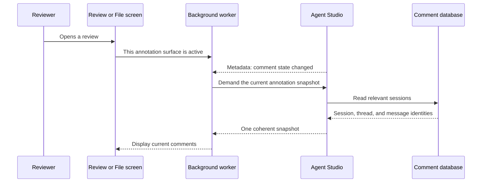
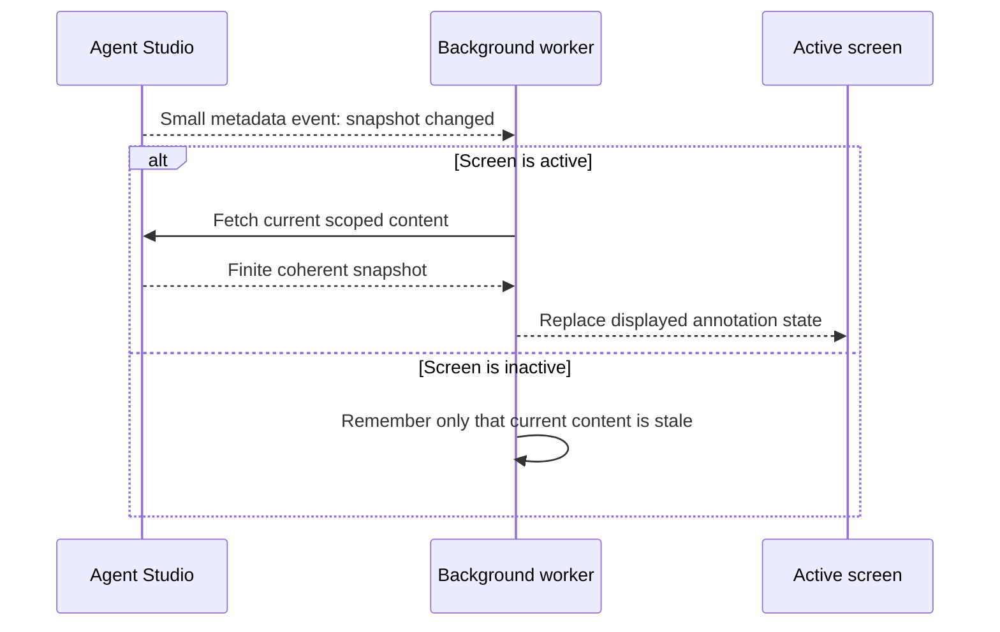
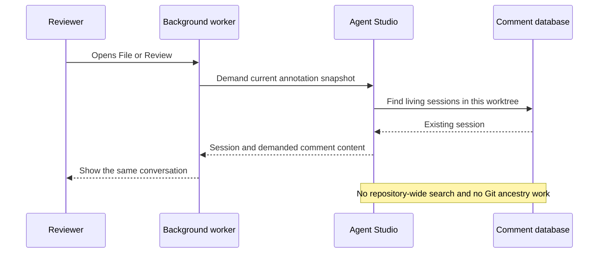
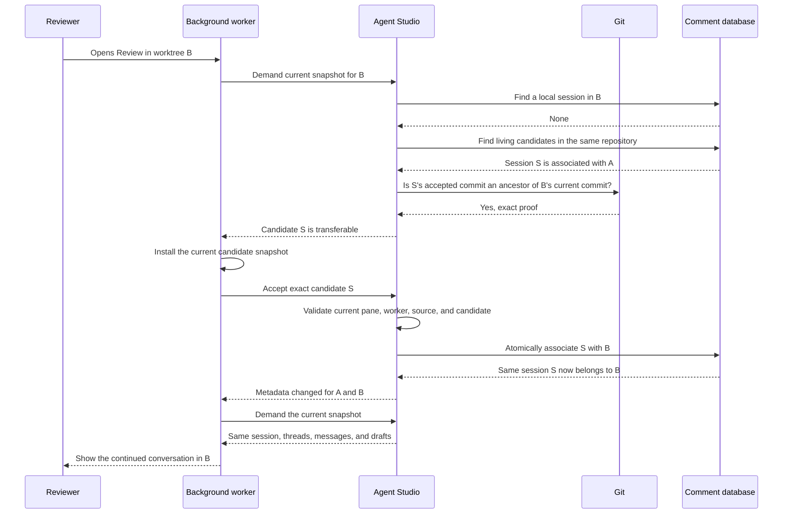
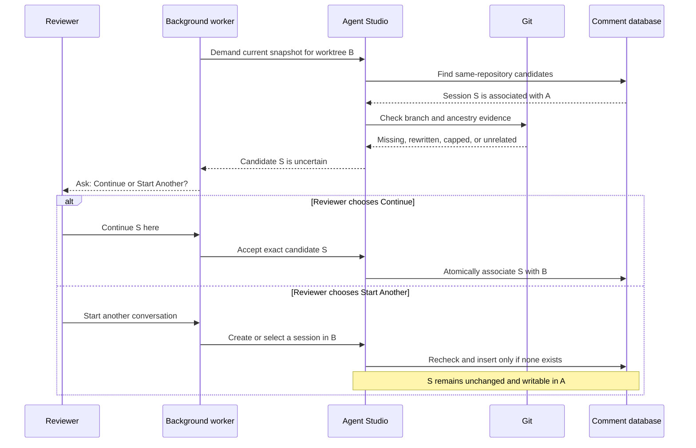
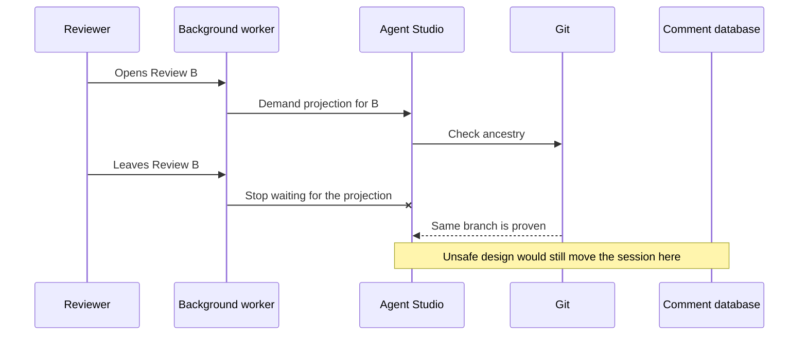
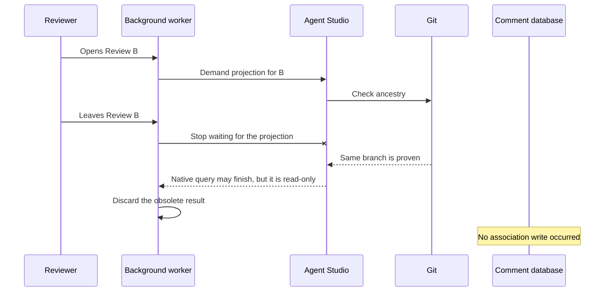
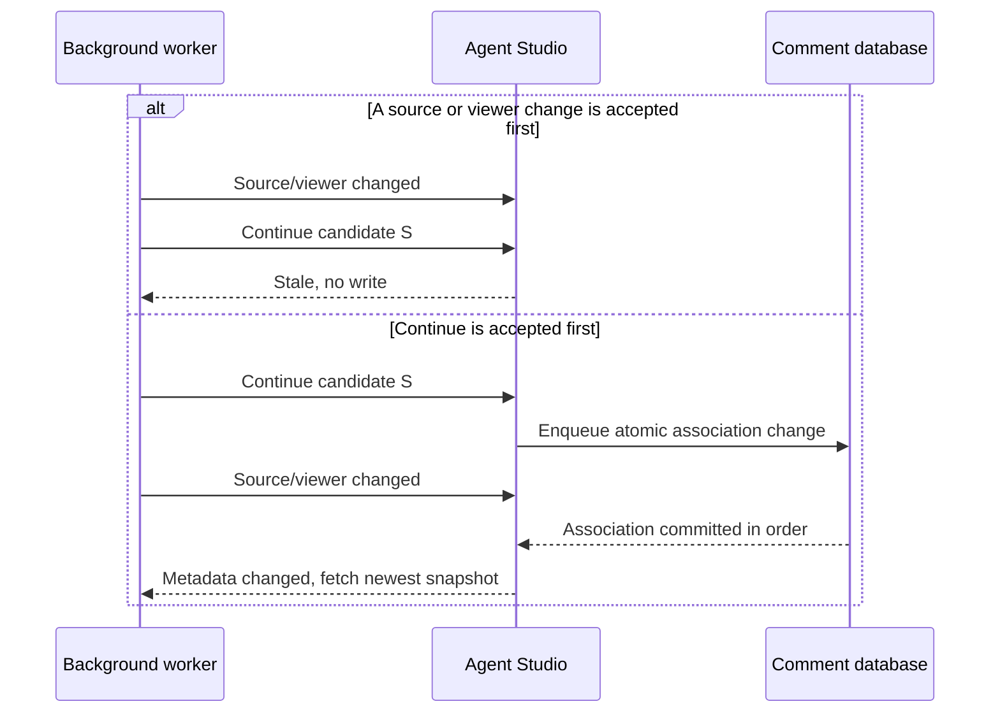

# Durable Review Subject Identity — Program Design

Requirements:
[`2026-08-26-requirements.md`](./2026-08-26-requirements.md)

Specification:
[`2026-08-26-specification.md`](./2026-08-26-specification.md)

## The system in one minute

A comment conversation has one permanent session ID. Its current worktree is
only where that conversation is available now. Moving the same branch to
another worktree may move the session's association, but it never copies or
recreates the session, threads, messages, drafts, or output history.

The annotation system already has the three communication shapes this feature
needs:

```text
continuous metadata stream
  “Comment state changed; your current snapshot is stale.”

content requested on demand
  “This Review screen is active. Give me its current annotation snapshot.”

ordered command
  “Accept this exact candidate and move its association.”
```

This feature reuses those shapes. It does not add another stream, queue, port,
poller, watcher, cache, or durable identity service.



## Why metadata streams while content is demand-loaded

The continuous stream and the content query solve different problems.

### The continuous stream says when state changed

Agent Studio pushes a small annotation notification whenever canonical comment
state changes. The notification contains the worktree scope, a monotonic change
revision, and an operation correlation. It does not carry all comments.

That keeps the stream cheap and prevents it from becoming a second copy of the
comment database.

### The demand query says what the active screen needs now

The background worker knows whether File or Review is active, the exact source
generation being displayed, the installed Review publication when applicable,
and which session details are currently demanded. It asks Agent Studio for one
finite snapshot only while that surface is active.

An empty session-ID list is still real demand:

```text
active: true
session IDs: []

meaning:
  “The screen is active, but it does not know its relevant session yet.”
```

That is the pre-session discovery case. It is when Agent Studio may look for a
conversation associated with another worktree in the same repository.

### Why the stream does not carry full content

If every notification carried session, thread, message, draft, and placement
content, the stream would need to own:

- visibility and selection demand;
- large-payload transfer and backpressure;
- multi-page snapshot consistency;
- replacement of obsolete content; and
- recovery after a partially delivered snapshot.

Those responsibilities already belong to the finite projection/content path.
Keeping notifications small gives one authority for content snapshots and lets
intermediate notifications coalesce.

### Why content is not polled

Without the continuous notification, the worker would have to poll SQLite or
Git, adding needless work and delaying comment updates. The stream wakes the
worker immediately; demand determines whether content should actually load.



## What travels in each direction

| Direction | Purpose | Carries | Deliberately excludes |
| --- | --- | --- | --- |
| Agent Studio → worker, continuous | invalidate stale annotation state | worktree scope, change revision, correlation | comment bodies, Git evidence, session details |
| worker → Agent Studio, on demand | describe the active content scope | pane/worker authority, File or Review, source generation, Review publication, demanded session IDs | branch-history decisions, durable mutation |
| Agent Studio → worker, finite snapshot | provide coherent identity and content metadata | local session summaries, candidate session IDs/revisions/dispositions, demanded thread/message content | foreign candidate thread/message bodies before acceptance |
| worker → Agent Studio, ordered command | request one durable decision | candidate session ID, expected session/projection/source revisions, Continue or Start Another | branch name, commit OID, source fingerprint |

The worker receives enough information to render and reference a candidate, but
not enough to forge native continuity evidence. Branch names, commit witnesses,
the previous association, and accepted source fingerprints stay in Agent
Studio's retained candidate record.

```text
request provides scope
  repository + worktree + pane + surface + source generation

snapshot provides identities
  session ID + semantic revision + native disposition

accepted local session provides details
  thread IDs + message IDs + bodies + drafts + placement
```

## The reviewer journeys

### The conversation is already in this worktree

This remains the common and cheapest path.



### The same branch moved to another worktree

Agent Studio first returns a read-only candidate. Only after the active worker
installs that candidate does a separate ordered command move the association.



### Agent Studio cannot prove continuity

Uncertain candidates remain associated with their accepted worktree. Their
conversation content is not projected into the new worktree until the reviewer
chooses Continue.



## How Agent Studio decides continuity

The durable session stores accepted reviewed-subject evidence:

```text
branch name       the checked-out local branch meaning, when one exists
reviewed HEAD     the exact full commit object ID
```

For Review, both values come from the same retained Git contribution result.
The comparison target and presentation label are never used as the reviewed
branch. Review performs no second HEAD read.

For File, the existing scheduled `resolveRevision(HEAD)` read captures the same
pair.

When the worktree differs, the existing scheduled Git range read asks whether
the accepted commit is equal to or an ancestor of the current commit. The
accepted witness is the base; current HEAD is the candidate. Annotation-owned
limits are 10 counted commits and 256 traversed commits.

| Evidence | Meaning |
| --- | --- |
| Same repository and same canonical worktree | applicable; ordinary edits, rename, rebase, path movement, and comparison-target changes continue |
| Same repository, different worktree, same non-empty branch meaning, exact ancestry | transferable candidate |
| Same repository, different worktree, but evidence missing, capped, traversal-limited, rewritten, unrelated, detached, or ambiguous | uncertain candidate |
| Accepted association is authoritatively proven to belong to a different repository lineage | detached |

Branch-name equality alone never transfers a conversation.

## Why discovery is read-only

The worker can stop caring about a projection request, but once Swift has begun
processing an exact product control it intentionally finishes and caches the
response. Aborting response consumption is therefore not proof that native work
stopped.

If the projection query moved SQLite directly, this could happen:



The selected design forbids that write. Projection may only return candidate
metadata. A later ordered command performs the durable move.



## The native commit fence

The ordered `Continue` command is allowed to enqueue the SQLite transaction
only when every currentness guard still matches.

| Guard | Question answered |
| --- | --- |
| Product session authority | Is this the current pane session, worker instance, surface, and worker generation? |
| Active viewer source | Is the reviewer still on this File or Review source? |
| Retained candidate | Is this the exact candidate and snapshot Agent Studio produced? |
| Source generation | Has the File/Review source changed since classification? |
| Product admission | Is the pane still alive and admitted? |
| Session revision and association | Has another pane already modified or moved the session? |

The command supplies only session/projection/source revision identities. Agent
Studio resolves the Git evidence, previous worktree, and accepted fingerprints
from its retained candidate. If any guard fails, the command returns stale or
conflict and writes nothing.

After the final source check, the annotation service enqueues one database
transaction. That enqueue is the ordering boundary:



SQLite independently rechecks the expected session revision, repository, and
previous worktree association. The transaction updates together:

```text
current worktree association
accepted reviewed-subject evidence
accepted source fingerprint
source relationship = applicable
session semantic revision
updated timestamp
```

Session, thread, message, draft, and output identities never change.

## Candidate metadata and lifetime

The finite projection includes local session summaries plus relevant foreign
candidate summaries. A candidate summary contains only:

```text
session ID
session semantic revision
projection revision
File/Review source generation
native disposition: transferable or uncertain
```

Foreign candidate thread details, message bodies, placement, New/All output
membership, and output history remain excluded until acceptance.

Agent Studio retains the native half of that exact candidate beside the
existing bounded projection reservation:

```text
previous association
accepted and current reviewed-subject evidence
accepted source fingerprint
Review publication identity, when applicable
pane session + worker instance + surface generation authority
```

This is temporary admission state, not a durable cache. A newer projection,
source replacement, Review publication replacement, worker replacement, pane
close, successful claim, or product-admission close makes it unusable. No
timer-based expiry is needed.

## Durable storage and migration

The existing session UUID remains the durable review-subject identity. The
repository/worktree columns become its current association.

```text
annotation session
  ID                         stable review conversation
  repository ID              canonical repository authority
  worktree ID                movable current association
  accepted reviewed subject  branch + exact HEAD witness
  accepted source fingerprint
                             File/Review placement provenance
```

The pre-release annotation schema adds:

```text
accepted_reviewed_subject_json nullable
index(repository_id, lifecycle, source_relationship)
```

Migration preserves every existing row and descendant ID. A legacy Review
fingerprint may seed only its reviewed HEAD witness. It must not invent branch
meaning from a display label or comparison target. A session without branch
evidence remains fully usable in its current worktree and becomes uncertain if
considered from another worktree.

## Repository behavior

Discovery has two stages:

```text
1. Indexed lookup in the current worktree
   found a controlling living session ──► stop

2. Only when the active projection still has no controlling session
   indexed same-repository foreign lookup ──► classify candidates
```

Completed sessions remain durable and queryable but do not block a new living
session.

Association acceptance is one atomic transaction guarded by expected session
revision, repository, and previous worktree. It returns both old and new
worktree IDs so the existing compact metadata notification wakes both viewers.

`Start Another` also rechecks current-worktree admission inside one transaction:

```text
no applicable current session   create one
one applicable current session  use it
several applicable sessions     return the existing bounded choice
```

Two panes cannot create two sessions from the same stale choice.

The unused `keepDetached` choice is removed. A foreign worktree declining a
candidate must not detach a conversation that remains valid in its accepted
worktree.

## Failure and recovery

| Failure | Result |
| --- | --- |
| Branch or HEAD unavailable | keep candidate uncertain; preserve content |
| Ancestry count or traversal limit reached | ask the reviewer; do not transfer |
| Projection becomes inactive or obsolete | discard result; projection is read-only |
| Old worker attempts to use a candidate | worker/pane authority mismatch; no write |
| Source advances before database enqueue | source-generation mismatch; no write |
| Another pane moves or edits the session first | revision/association conflict; no write |
| Association commits before notification delivery | SQLite remains authority; next projection or restart converges |
| Process exits after commit | restart reads the new association atomically |
| Migration or decoding fails | use existing fail-closed annotation recovery; never fabricate empty state |

If two panes race to accept the same session, the first matching transaction
wins. The second sees a revision or previous-association conflict and fetches
current truth.

## Performance and privacy

The same-worktree path adds no Git ancestry read and no repository-wide query.
Foreign discovery runs only for an active File/Review projection with no
controlling local session. Current source evidence is captured once per source
generation, and equal ancestry questions are deduplicated within that
projection.

Telemetry may record result class, candidate count, ancestry disposition,
whether association changed, and latency. It must not export branch names,
paths, commit OIDs, session/worktree IDs, comment bodies, or SQL errors.

No new security or authorization mechanism is introduced.

## Proof architecture

The proof pyramid answers different questions:

| Layer | What it proves |
| --- | --- |
| Pure classifier | same-worktree, transferable, uncertain, and different-repository decisions |
| SQLite integration | migration preserves IDs/content; association and Start Another transactions are atomic |
| Real Git integration | actual branch rename, descendant transfer, detached HEAD, rewrite, and name reuse |
| Swift integration | active projection discovery, candidate retention, commit fence, old/new invalidation, and restart |
| Vite/Chrome journey | production React → worker → Swift backend → SQLite preserves one conversation |
| Packaged WKWebView journey | the actual app keeps File/Review comments visible and writable after movement |

The concurrency proof must include:

```text
Git read blocked → screen becomes inactive → result discarded → no write

candidate installed → source/viewer change accepted first
                    → Continue rejected → no write

candidate installed → Continue enqueued first
                    → association commits → newest projection reconciles

candidate produced by old worker → new worker attempts use → rejected

File and Review choose Start Another together → at most one new session
```

Real Git worktrees, file-backed SQLite restart, the production communication
worker, and packaged WKWebView cannot be replaced by fakes at their proof layer.

### Requirement coverage

| Requirement | Design realization |
| --- | --- |
| RSI-R1 | Atomic reassociation changes no session, thread, message, draft, or output identity |
| RSI-R2 | Current-worktree lookup wins before any foreign search or Git ancestry work |
| RSI-R3 | Exact branch/ancestry proof produces a transferable candidate; the fenced command performs one atomic move |
| RSI-R4 | Uncertain candidates expose only summary/revision metadata until the reviewer chooses |
| RSI-R5 | Only authoritative accepted-association repository mismatch may detach; missing evidence remains uncertain |
| RSI-R6 | Active projection discovery considers same-repository candidates before zero-session creation |
| RSI-R7 | Comparison target remains outside session identity and reassociation |
| RSI-R8 | Nullable evidence migration preserves all existing rows and never invents branch meaning |
| RSI-R9 | Continuous invalidation plus active demand gates the bounded foreign path; the common path stays indexed and Git-free |
| RSI-R10 | Old/new worktree invalidations, finite projection, SQLite restart, and File/Review proof converge on one decision |

## Technical ownership lookup

This section maps the human model above to current code. It is lookup material,
not the primary explanation.

| Human responsibility | Current owner |
| --- | --- |
| Continuous annotation change notifications | `BridgePaneAnnotationNotificationSource` |
| Active annotation demand, coalescing, and obsolete-result cancellation | `BridgeCommWorkerAnnotationProjectionQueryController` |
| Finite annotation snapshot and candidate reservation | `BridgeAnnotationProjectionSource` |
| Current File/Review source evidence | `WorktreeAnnotationSourceResolver` |
| Continuity policy | `WorktreeAnnotationContinuityClassifier` |
| Git HEAD and ancestry facts | `AgentStudioGitBridgeReviewDataClient` through `agentstudio-git` |
| Ordered pane/worker product controls | `BridgeProductSession` |
| Native active File/Review source | `BridgePaneController.activeViewerModeSignalState` |
| Annotation sequencing and compact invalidation | `WorktreeAnnotationServiceActor` |
| Durable queries and atomic association | `WorktreeAnnotationSQLiteRepository` |

## Complexity spent and boundaries preserved

The design spends:

- one nullable accepted-evidence column and one repository index;
- one pure continuity classifier;
- one conditional same-repository candidate lookup;
- existing scheduled HEAD and bounded ancestry reads;
- candidate fields in the existing finite projection;
- a bounded extension to the existing projection reservation;
- expected projection/source revisions on the existing continuity command;
- one atomic association transaction; and
- existing compact invalidations for the old and new worktrees.

The design does not add:

- a subject table or subject service;
- another metadata stream, transport port, queue, or scheduler;
- a branch registry, reflog history, watcher, poller, or cache service;
- a new event type, atom, store, coordinator, or authorization system;
- a second comment system or new session-management UI; or
- changes to comparison calculation, target selection, thread origin,
  placement meaning, Save/draft/output behavior, or render backpressure.

If real-worktree proof shows that the bounded ancestry read asks the reviewer
too often, the follow-up is a focused `agentstudio-git` ancestry predicate. It
is not a Bridge commit walk or a general branch-history database.
