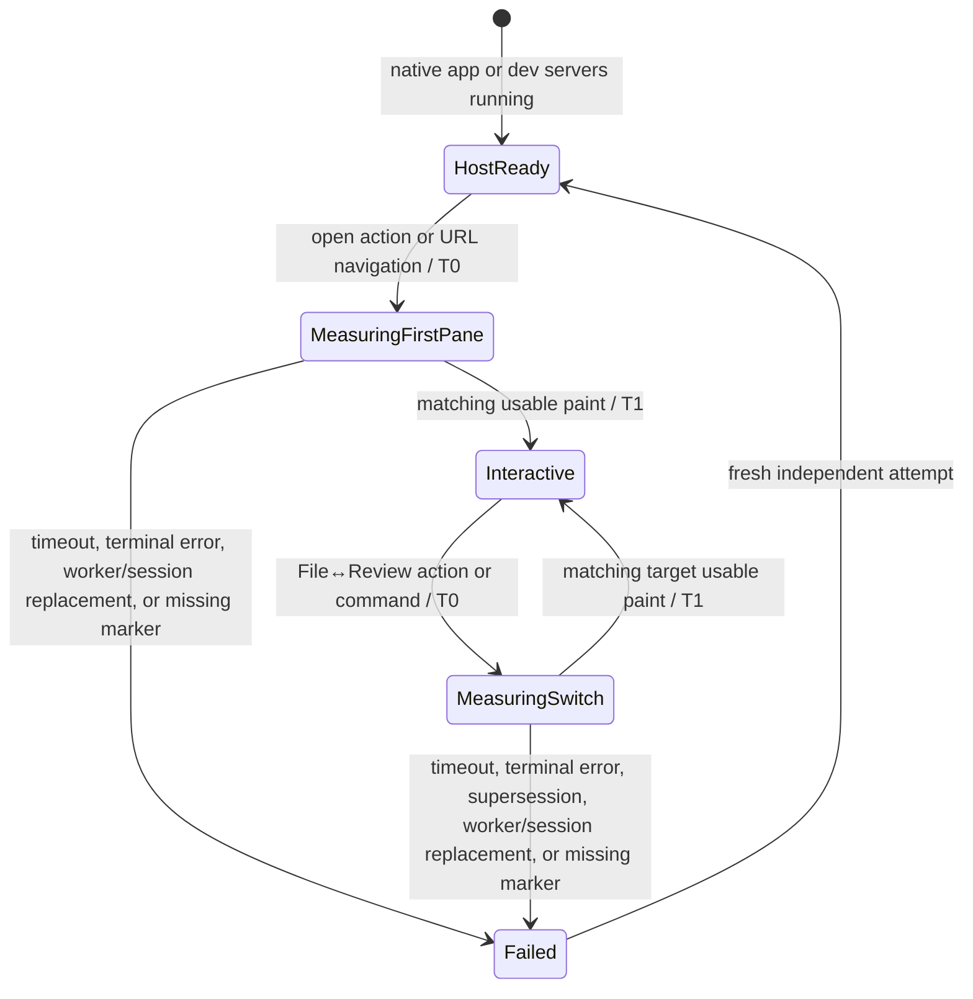
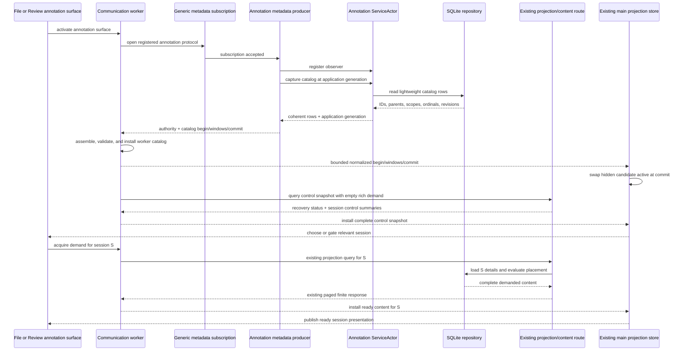
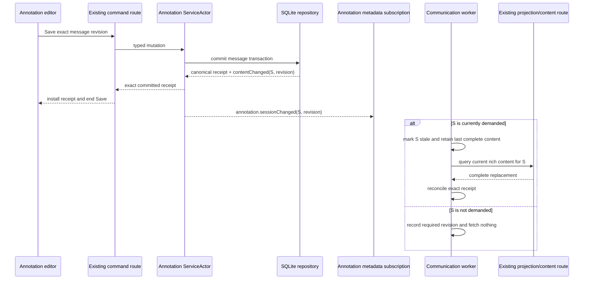
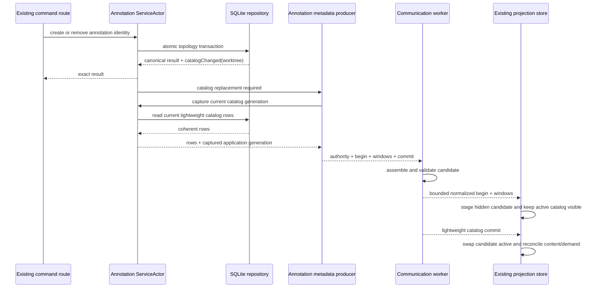
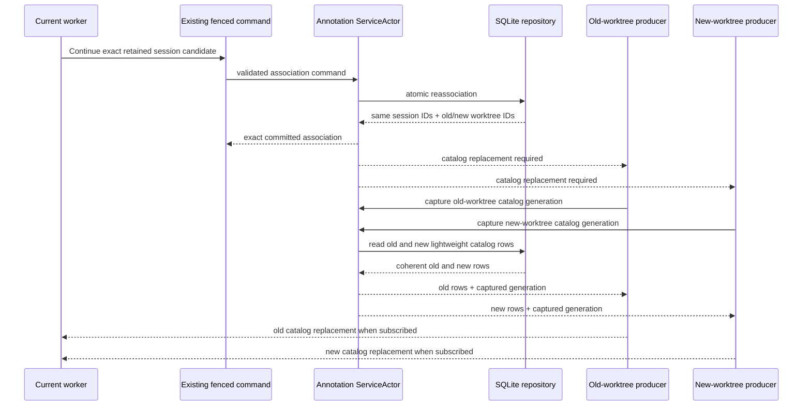
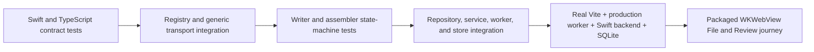

# Bridge Metadata Application Protocol — Program Design

Requirements:
[`2026-08-27-requirements.md`](./2026-08-27-requirements.md)

Specification:
[`2026-08-27-specification.md`](./2026-08-27-specification.md)

## The system in one minute

Bridge keeps its three physical routes and one pane communication worker. The
metadata route becomes structurally generic: it validates delivery fields,
then asks a statically registered application protocol to validate and type the
application payload. File and Review register their existing event contracts;
all behavior remains unchanged except MAP-U9's complete first-pane and mode-
switch performance correction, including File's progressive demand admission.

The same generic layer gains one bounded catalog-transfer primitive. Worktree
Annotations uses it to continuously publish only session, thread, message, and
scope relationships. Existing session demand and finite content continue to
carry bodies, drafts, origin, placement, history, and output details.

```mermaid
flowchart LR
    NativeApplication[Typed native application producer]
    NativeProtocol[Registered native application protocol]
    Stream[Existing pane metadata stream]
    Envelope[Generic envelope validation]
    WebProtocol[Registered worker application protocol]
    Application[File, Review, or Worktree Annotation applicator]
    Content[Existing demand and content route]

    NativeApplication --> NativeProtocol --> Stream --> Envelope --> WebProtocol --> Application
    Application -->|application demand| Content
    Content -->|finite rich data| Application
```



The transport never interprets a file path, Review item, annotation session,
thread, or message. The registered application protocol does.

## Current system and the structural gap

The physical metadata transport is already generic in behavior. It owns stream
and subscription identities, sequence, interest barriers, source generation,
worker epochs, bounded queues, reset/end/error, acknowledgement, frame bounds,
and producer backpressure.

Application payloads are still compiled into generic owners in two places:

- Swift `BridgeProductSubscriptionData` is an exhaustive enum with File,
  Review, and annotation cases.
- TypeScript `bridgeProductSubscriptionDataFrameSchema` is an exhaustive union
  with the same application kinds and schemas.

Adding an application therefore changes both transport definitions even when
no delivery mechanic changes.

Worktree Annotations has a second gap. Current code emits only
`snapshot.required`; the worker responds by querying all session summaries plus
full details for currently demanded sessions. The decoded result replaces
session summaries and hydrated threads/messages as one snapshot. That loses
the distinction between “this identity exists but content is not demanded” and
“this identity is confirmed empty.”

```text
current annotation path

SQLite mutation
  → ServiceActor publishes snapshot.required
  → pane annotation subscription
  → worker invalidates combined projection
  → projection query loads all session summaries
      + bodies/drafts/origin/placement for demanded sessions
  → one complete sessions[] + threads/messages[] replacement
```

Source anchors are Swift `BridgeProductSubscriptionContracts`,
`WorktreeAnnotationServiceActor`, and the pane annotation notification source;
and TypeScript session contracts, annotation query controller, and projection store.

## Structural choice

| Direction | Gain | Cost | Decision |
| --- | --- | --- | --- |
| Keep central application unions and add annotation catalog cases there | smallest immediate diff | every future application still changes generic transport; no reusable catalog transfer | rejected |
| Static typed application registry plus generic bounded catalog transfer | application meaning stays typed; future additions do not reopen delivery mechanics; annotations reuse File/Review paradigm | one hard cutover across Swift and TypeScript; registry/type-erasure boundary must be proven | selected |
| Runtime-discovered application protocols | independent deployment of new protocol code | new trust, versioning, lifecycle, and executable-loading system with no requirement | rejected |
| Annotation catalog deltas from the first release | smaller topology updates | requires upsert/tombstone lineage, cascade semantics, and reassociation recovery before measurement shows need | deferred |

The selected design spends one static registry per language and one generic
writer/assembler pair. It removes application payload cases from generic frame
owners. It does not add another route, queue, scheduler, persistence boundary,
or presentation store.

The cost is a synchronized Swift/TypeScript hard cutover. Packaged Bridge and
the Vite development backend ship matching contracts, so there is no supported
mixed-version period. File and Review regression proof bears most of that cost.

The choice reopens only if evidence shows that static registration cannot
preserve current type safety, or measured annotation topology replacement cost
requires application-specific deltas.

## Target composition and ownership

```text
Bridge metadata transport
  Generic metadata envelope
    owns: stream/subscription delivery fields and bounds
    consumes: encoded application payload
    changes when: physical transport contract changes

  Metadata application registry
    owns: subscription kind → typed application protocol and source binding
    consumes: generic envelope and application control payloads
    owns: application-specific interest admission relative to source bootstrap
    changes when: an application protocol is added or removed

  Metadata catalog transfer
    owns: begin/window/commit framing and atomic candidate assembly
    consumes: application-defined complete catalog entries
    changes when: generic replacement-transfer semantics change

Application protocols
  File annotation protocol
    owns: current File annotation kind/surface/source authority
    consumes: shared Worktree Annotation event/source implementation

  File metadata protocol
    owns: current File surface, options/open conversion, interests/deltas,
          source lifecycle, event schema, generation extraction

  Review annotation protocol
    owns: current Review annotation kind/surface/source authority
    consumes: shared Worktree Annotation event/source implementation

  Review metadata protocol
    owns: current Review surface, options/open conversion, interests/deltas,
          source lifecycle, event schema, generation extraction

  Shared Worktree Annotation application protocol implementation
    owns: empty interests, catalog/control/session-change event schemas,
          generation extraction, and reusable native source behavior

Worktree Annotation application
  Repository catalog projection
    owns: lightweight SQLite ID/relationship read

  Service change classifier
    owns: content-only versus catalog-affecting committed change

  Pane annotation metadata producer
    owns: gap-free bootstrap and current catalog/change publication

  Worker annotation catalog applicator
    owns: catalog relationship validation and application map construction

  Existing annotation projection store
    owns: active catalog plus content-by-session and command overlays

  Existing annotation demand/query/content owners
    own: rich session loading, source authority, placement, and convergence

```

Singular truth remains unchanged:

| Truth or invariant | Owner |
| --- | --- |
| stream, subscription, sequence, interest, frame, acknowledgement, and backpressure state | existing generic product transport |
| registered surface/source binding, option/interest transforms, schemas, and generation reader | metadata application registry entry |
| durable annotation sessions/threads/messages/content | Worktree Annotation SQLite repository |
| committed-change classification and observer fan-out | `WorktreeAnnotationServiceActor` |
| current annotation catalog for one surface/source authority | worker annotation catalog applicator and existing projection store |
| rich content currentness for one demanded session | existing annotation query controller and projection store |
| initiating command success/failure and exact canonical receipt | existing typed command response |

Forbidden edges:

- generic transport must not import File, Review, or Worktree Annotation event
  schemas;
- catalog-transfer helpers must not inspect application entry fields;
- Worktree Annotation catalog production must not decode bodies, drafts,
  origins, placement, history, or output rows;
- React must not construct authoritative catalog relationships from hydrated
  messages;
- File or Review applicators must not be rewritten around annotation catalog
  semantics;
- application protocols must not change generic queue, sequence,
  acknowledgement, or backpressure policy.

## Generic metadata application contract

### Raw and typed frames

The TypeScript structural decoder produces the Specification's generic
`BridgeProductMetadataDataFrame<unknown>`: stream/subscription identities and
sequences, source generation, optional correlation, and raw `data`. The registry
resolves the subscription kind, validates `data`, compares the registered event
generation with the frame, and returns
`BridgeProductMetadataDataFrame<TEvent>`.

No application consumer accepts `unknown`, and no assertion substitutes for
schema validation.

### Application registration

Each language-specific `MetadataApplicationProtocol<Options, Interest, Event>`
owns the Specification's full registration contract: kind, surface/source
authority, options and initial-open conversion, empty/target interest state and
delta accounting, and event validation/generation. The Swift native application
registration additionally owns source lifecycle and whether admitted interest
waits for complete bootstrap or may run after source acceptance while bootstrap
continues.
The registration adapts an existing native authority owner; it cannot create or
widen pane, surface, worktree, provider, Review publication, mutation, or
content authority. Generic admission runs before the registered adapter, and
the adapter preserves its application's existing authority fences.

TypeScript exposes a typed definition factory and uses its protocol value as
the generic parameter to `transport.subscribe(protocol, options)`. The returned
subscription event iterator is typed from that protocol.

Swift keeps application producers typed and erases only the registry entry. An
`AnyBridgeProductMetadataApplicationProtocol` retains strict Codable
encode/decode closures, surface authority, initial-open conversion, canonical
interest encoding/delta construction, native source lifecycle binding, and the
event-generation reader. A typed producer asks its application protocol to
encode an event; the generic coordinator receives only subscription kind,
source generation, and encoded application JSON.

The registry rejects duplicate registration. Unknown subscription kinds are
rejected at open/update/data admission. A string-valued validated subscription
kind with named static constants replaces the exhaustive application enum so a
new registered kind does not require a transport switch.

### Application control payloads

Subscription open and interest update follow the same boundary as data:

```text
generic control envelope
  subscription kind
  raw application options or interest update
      → registry validation
      → typed application source
```

The generic control multiplexer continues to own request sequence,
correlation, pane/worker identity admission, generic batching, and committed
interest barriers. The registered protocol owns the application surface/source
binding, initial-open conversion, canonical empty/target interest state, and
application delta construction/accounting. Its source binding receives typed
open/update/cancel/close calls while the generic producer lifecycle continues
to own task replacement, sequencing, and drain.

File and Review registrations wrap their current schemas and event unions.
They do not change wire literals. Application behavior is preserved except for
the registered File admission policy required by MAP-U9.

The native File registration selects `afterSourceAcceptance`. Review and both
Worktree Annotation registrations select `afterBootstrap`. This is one native
application policy carried by the existing static registration; it creates no
second task owner, queue, scheduler, or transport state.

For `afterBootstrap`, the shared producer lifecycle retains its current
bootstrap-predecessor wait. For `afterSourceAcceptance`, the coordinator uses
the existing File `sourceAccepted` event as the milestone. Only after that
event is successfully enqueued under the current product and foreground
admissions does the coordinator mark the subscription ready for overlapping
interest.

An interest committed before that milestone records the subscription ID in
the coordinator's existing deferred-update set and starts no update task. The
product session remains the sole owner of the latest committed interest
snapshot. When the milestone arrives, the coordinator reads that current
snapshot from the session and starts one update. A newer commit replaces the
session snapshot and cancels any older interest task through existing
lifecycle behavior; no second interest snapshot, queue, or revision owner is
introduced.

File's source already installs its subscription/source context before emitting
`sourceAccepted`, appends each progressive tree window to the manifest before
emission, and accepts descriptor demand only for current manifest members.
Therefore overlap does not weaken admission: an interest update may run during
enumeration, but only a path already present in the current manifest can reach
descriptor refresh and publication. An accepted interest whose path is not yet
a manifest member still updates the File source's current subscription; the
existing per-window rerun observes it when a later window admits the member.
Review and Annotation sources retain their complete-bootstrap predecessor
because they do not expose the same progressive member-admission seam.

Reset, cancellation, source or worker replacement, foreground revocation, and
subscription retirement clear both the interest-ready marker and existing
deferred-update ID through the coordinator's current lifecycle cleanup. A late
acceptance or update from retired authority fails the existing product,
foreground, subscription, source, and generation guards and cannot restore
readiness.

The current application-kind switches in Swift source construction, surface
mapping, open/update conversion, empty-interest construction, delta accounting,
and TypeScript subscription event typing are removed. A fixture protocol with
empty interests must require only one registration in each language; generic
subscription state and producer lifecycle remain unchanged.

## Generic bounded catalog transfer

The reusable `MetadataCatalogTransfer<Entry>` is the Specification's strict
begin/window/commit union: one transfer/revision, expected total entries,
contiguous window ordinals with complete entries, and final window/entry counts.

An empty catalog emits `begin(expectedEntryCount: 0)` followed by
`commit(windowCount: 0, entryCount: 0)`. It emits no empty window.

### Writer

`MetadataCatalogWriter<Entry>` is a generic native helper. The application
supplies ordered strict entries and catalog revision. The helper asks the
existing metadata frame encoder whether a prospective full frame, including
its envelope, fits the current metadata-frame ceiling. It packs as many
complete entries as fit, never splits one entry, and waits on the existing
producer/acknowledgement path before advancing.

Before emitting `begin`, the writer rejects a catalog with more than 200,000
entries or more than 8 MiB of encoded application entry bytes and proves that
each individual entry can fit inside one complete prospective metadata frame.
An oversized catalog or indivisible entry therefore emits no partial transfer.

The existing metadata observation owner retains multiple sequence waits per
producer lease. An acknowledgement advances one monotonic observed high-water
mark and completes every wait at or below that sequence. A Review final-barrier
wait and a catalog-window wait on the shared pane metadata stream therefore
cannot supersede or falsely fail one another. This extends the existing
observation owner; it adds no port, queue, timer, scheduler, or emission owner.

The writer owns no queue and retains no durable transfer. Cancellation,
producer replacement, reset, and pane close use existing task and metadata
producer lifecycles.

### Assembler

```mermaid
stateDiagram-v2
    [*] --> Idle
    Idle --> Receiving: first begin for expected authority accepted
    Receiving --> Receiving: next contiguous window accepted
    Receiving --> Complete: matching commit and counts accepted
    Receiving --> Receiving: same-authority newer begin supersedes candidate
    Receiving --> Receiving: late frame for noncurrent transfer rejected
    Receiving --> Idle: reset, error, cancellation, or current-candidate defect
    Complete --> Receiving: same-authority begin newer than active accepted
    Complete --> Complete: committed replay rejected without state change
    Complete --> Idle: authority retired; numeric baseline cleared
```

`MetadataCatalogAssembler<Entry>` is a generic worker helper with this state:



The helper owns one candidate's identity, revision, next ordinal, entries,
encoded application-entry byte count, and entry/window counts. It rejects a
`begin` above 200,000 expected entries and discards the current candidate before
any accepted window would exceed 200,000 entries or 8 MiB of encoded application
entry bytes. Within one lifecycle-admitted subscription/source authority, a `begin`
replaces that candidate only when its revision is newer than both the active and
candidate revisions. Authority retirement discards the candidate and clears the
numeric comparison baseline while the application may retain the prior active
catalog visibly stale. After the generic lifecycle admits the expected new
authority, its first `begin` is accepted regardless of the retained stale
catalog's revision. A `begin` from any other authority is rejected. A window or
commit for any noncurrent transfer identity is rejected without changing the
current candidate. An ordinal, count, revision, or entry defect belonging to
the current transfer discards only that transfer. A committed replay is rejected
without state effect; no retained equivalence digest is required. The helper
returns a complete candidate only after commit. It never installs application
state. The application validates relationships and performs the active-state
swap.

The application retains at most one active catalog and one candidate. A
malformed candidate is discarded without changing active state.

## Worktree Annotation catalog

### Durable source and lightweight projection

SQLite already owns:

```text
annotation_session(id, worktree_id, semantic_revision)
  └─ annotation_thread(id, session_id, scope, created_ordinal)
       └─ annotation_message(id, thread_id, ordinal)
```

Existing foreign keys and indexes supply the relationship. No schema migration
is needed.

The repository adds one immutable catalog capture from a single SQLite read
transaction:

```text
WorktreeAnnotationCatalogCapture
  worktreeId
  ordered session entries
  ordered thread entries
  ordered message entries
```

Its SQL selects only IDs, parent IDs, scope, ordinals, and session semantic
revision. It does not select or decode saved/draft bodies, edit tokens,
origin JSON, placement, history, output membership, or exact output bytes.

The repository owns only those immutable rows. `WorktreeAnnotationServiceActor`
owns the application source generation: it captures its current projection
revision, performs the repository read, rechecks that revision and recovery
state, then wraps the rows in a service capture. A mutation during the read
therefore produces either one coherent captured generation or a stale-capture
result followed by a newer notification. The repository never manufactures or
advances the service generation.

### Entry contract

`WorktreeAnnotationCatalogEntry` is the strict Specification union: session ID
plus semantic revision; thread ID, parent session, scope, and ordinal; or
message ID, parent thread, and ordinal.

The application applicator validates unique identities, known parents, and
unique/canonical sibling ordinals before constructing:

```text
WorktreeAnnotationCatalog
  sessionsById
  orderedSessionIds
  threadsById
  threadIdsBySessionId
  messagesById
  messageIdsByThreadId
```

The transport and generic assembler never construct these maps.

### Committed-change classification

Repository mutations return the existing canonical result beside one compact
committed-change description. The primary description uses
`catalog > control > content > none` precedence and retains newest affected
session revisions when a control or catalog transaction also changes rich
content:

```text
none
  no durable semantic change

contentChanged
  newest committed revision per affected session

controlChanged
  affected worktree IDs
  reason: discovery | recovery
  newest committed revision per affected session, when applicable

catalogChanged
  affected worktree IDs
  newest committed revision per affected session, when applicable
```

The repository transaction is the only place that knows whether it inserted,
removed, or reassociated catalog identities. The service uses that returned
classification; it does not requery and diff the catalog after every edit.

Body/draft/viewed/handled/resolution and other relationship-preserving changes
return `contentChanged`. Lifecycle, source relationship, foreign-candidate
disposition, and recovery admission changes return `controlChanged`; they may
also carry the newest affected session revision. Creating or removing a
session/thread/message, changing catalog parent/scope, session reassociation,
recovery replacement, and bootstrap/reset require `catalogChanged`. A topology
transaction may also advance rich session content; catalog commit reconciles
that revision and causes current demanded content to refresh.

Every successful transaction that changes session-scoped rich content advances
that session's semantic revision exactly once. Rich content includes output
attempt, history, and event state as well as bodies, drafts, message state,
placement inputs, and handled/viewed state. An idempotent replay or zero-row
mutation advances the revision zero times and returns `none`. Output message
helpers report whether they changed rows; the owning outer output transaction
performs the single session revision advancement when either output history or
member-message state changed. This prevents both an equal-revision change from
being suppressed and one transaction from incrementing twice.

The existing service projection revision remains the monotonic application
source generation and capture fence. Every annotation event carries a common
authority `{ worktreeId, applicationSourceGeneration }`; the registered
generation reader returns that application source generation and the generic
frame must match it. A catalog transfer uses the captured application source
generation as its catalog revision. Catalog replacements may skip revision
numbers when intervening content-only commits occur; they must increase, not be
contiguous. Session semantic revision remains the per-session rich-content
currentness fence.

## Gap-free annotation publication

The pane annotation producer registers its service observer before capturing
the bootstrap catalog. A mutation racing that capture therefore produces
either:

- a capture that includes the mutation plus a harmless newer notification; or
- an earlier capture followed by the notification that converges it.

The observer retains one aggregate pending state:

```text
catalog replacement required
  supersedes pending control and per-session changes

otherwise
  control snapshot changed, when applicable
  newest semantic revision per changed session
```

On catalog-required state, the producer captures and sends one current complete
catalog and marks the active control snapshot stale. On control-changed state,
it emits one bounded control-change event. On content-only state, it emits one
bounded session-change event per retained changed session. Coalescing may skip
intermediate revisions but cannot lose the newest committed control or session
revision.

File and Review annotation subscriptions each retain their own pane/surface
source authority and catalog application. The catalog contains no
surface-specific placement, so both derive the same durable relationships
without sharing mutable pane state.

## Annotation worker and presentation state

The registered Worktree Annotation event is:

```ts
type WorktreeAnnotationMetadataEvent =
  | {
      readonly kind: 'annotation.catalog';
      readonly authority: {
        readonly worktreeId: string;
        readonly applicationSourceGeneration: number;
      };
      readonly transfer: MetadataCatalogTransfer<WorktreeAnnotationCatalogEntry>;
    }
  | {
      readonly kind: 'annotation.sessionChanged';
      readonly authority: {
        readonly worktreeId: string;
        readonly applicationSourceGeneration: number;
      };
      readonly sessionId: string;
      readonly semanticRevision: number;
    }
  | {
      readonly kind: 'annotation.controlChanged';
      readonly authority: {
        readonly worktreeId: string;
        readonly applicationSourceGeneration: number;
      };
      readonly reason: 'discovery' | 'recovery';
    };
```

The worker application catalog applicator owns one generic assembler and the
active normalized annotation catalog used for demand/currentness decisions.
After native commit and relationship validation, it sends bounded normalized
catalog staging units over the existing worker-to-main port. The existing main
projection store applies those units to a hidden candidate bank; React keeps
reading the prior active bank. One final lightweight commit swaps the candidate
bank active and increments presentation revision once. A reset or replacement
during main staging discards the hidden candidate without exposing partial
membership.

The worker-to-main staging unit uses the same generic begin/window/commit
semantics with an application-defined normalized catalog entry. It is a new
message family on the existing port and existing port FIFO, not a new route,
queue, scheduler, or persistence owner. Each complete staging message is
independently bounded by the 128 KiB metadata-frame ceiling; no pre-existing
generic worker-message budget is assumed. The hidden main candidate bank applies the
same authority-scoped revision rule: a lifecycle-admitted worker/source
replacement clears the comparison baseline, while an unexpected authority is
rejected. It enforces the same 8 MiB and 200,000-entry aggregate candidate
limits as the worker assembler.

The existing store is evolved, not duplicated:

```text
WorktreeAnnotationProjectionStore
  catalog
    active catalog revision, source authority, current/stale state,
    normalized ID maps, and hidden main-thread candidate bank

  control
    recovery status
    current session summaries: identity, semantic revision, lifecycle,
    source relationship, and candidate disposition
    unknown | loading | ready | stale | unavailable

  contentBySessionId
    notDemanded
    loading(requiredRevision)
    ready(contentRevision, complete threads/messages/placement)
    stale(requiredRevision, retained last complete content)
    unavailable(requiredRevision, optional retained content)

  command-confirmed overlays
  read/recovery status
  output history
```

The control bank preserves the existing demand-independent part of the finite
annotation projection. An active surface first queries with an empty demanded
session list to obtain recovery and session-control summaries. It derives the
relevant living/applicable or uncertain session from that bank, then acquires
rich demand. A lifecycle, source-relationship, candidate, or recovery mutation
emits `annotation.controlChanged`; an active surface refreshes the control bank
without hydrating undemanded bodies. A body-only session change does not refresh
the control bank when that session is undemanded.

Catalog commit reconciles content states:

- removed sessions retire their demand and reject later rich results;
- retained sessions keep last complete content;
- retained sessions whose semantic revision advanced become stale;
- newly discovered sessions begin `notDemanded`;
- current demand for a stale retained session schedules one existing projection
  refresh.

Reset, stream/source replacement, worker replacement, and reopen discard the
catalog candidate and mark the retained active catalog stale against the new
expected subscription/source authority. Stale identities may remain visible,
but cannot establish current empty state, mutation admission, output
membership, or rich-result install authority. Catalog commit binds the new
subscription, worker epoch, worktree, and application source generation and
makes the candidate current.

Catalog-only state is never projected as empty-ready content. Pierre, editors,
viewed reconciliation, and Share consume only complete ready or explicitly
retained stale content according to their governing PR1 rules. Share membership
remains unavailable until the demanded session content and source/output fences
are complete and current.

## Current-to-target call paths

### Generic subscription data

| Edge | Current | Target | Status |
| --- | --- | --- | --- |
| application encoding | central Swift data enum | registered native protocol | changed |
| metadata coordinator/frame | generic owner | same owner | preserved |
| data decoding | central TypeScript payload union | generic envelope then registered schema | changed |
| subscription state and application result | generic subscription to typed consumer | same result through registered event type | preserved |

Central File/Review/Annotation payload switches are removed.

Generic delivery errors still return through the existing subscription
failure/reset path. Application schema or generation errors are classified
before application consumption and use that same terminal path.

### Generic subscription control and native source lifecycle

```text
worker subscribe(protocol, options)
  → registered initial-open or target-interest conversion        [changed]
  → registered application delta construction/accounting         [changed]
  → generic control batching and committed barrier               [preserved]
  → native registered open/update validation and source binding  [changed]
  → generic producer replacement and drain                       [preserved]
```

This removes current application-kind switches in surface maps, empty-interest
state, option/open conversion, update/delta accounting, and native routing.

Open/update rejection and source failure return through the existing typed
control result and subscription reset/end/error paths. File and Review source
objects, events, and lifecycle semantics are preserved behind their
registrations.

### File first-selected-content admission

```mermaid
sequenceDiagram
    participant Main as Main File surface
    participant Worker as Communication worker
    participant Lifecycle as Native producer lifecycle
    participant File as File metadata source
    participant Manifest as Current manifest index

    File->>Manifest: install source authority
    File-->>Worker: sourceAccepted
    Worker->>Lifecycle: enqueue accepted; mark subscription interest-ready
    Lifecycle->>Worker: read latest committed interest snapshot
    File->>Manifest: append early tree window
    File-->>Main: early tree window
    Main->>Worker: select admitted path
    Worker->>Lifecycle: commit File interest
    Lifecycle->>Lifecycle: current source is interest-ready
    Lifecycle->>File: update while later windows stream
    File->>Manifest: validate current member
    File-->>Main: descriptorReady
    Main->>File: request selected content
    File-->>Main: selected preview
    File-->>Main: later tree windows continue
```

Changed edges: a pre-acceptance File interest records the existing deferred
update ID; successful enqueue of the current File `sourceAccepted` event marks
the subscription interest-ready, reads the latest session-owned snapshot, and
starts the update without awaiting final bootstrap. Intentionally unchanged
edges: generic interest commit ordering, session ownership of current
interests, subscription/source/generation/foreground fences, manifest
membership validation, descriptor publication, content request, and all
result/error paths. Review and Worktree Annotation predecessor waits are
intentionally unchanged.

This admission correction is necessary but does not by itself complete
MAP-U9. The repository-owned verifier currently starts its File and Review
clocks immediately before page navigation, which is the correct development
start boundary. Its approximately 1.4-second File and Review results are real
first-pane failures, not excluded frontend setup. A command-only clock that
begins after React and the communication worker are ready would hide the pane,
page, module, handshake, and worker delay that the reviewer experiences.

### Review demand roles reach native admission through the existing subscription

The Review communication-worker scheduler is the sole owner of current
selected, visible, nearby, speculative, and background membership. React sends
selection, viewport, and hover facts; it does not derive or publish another
role map. Every ledger path that changes active membership—including internal
release, rejection, retry, publication settlement, and refill—projects its
complete current-intent, current-generation active set into one atomic
replacement of the existing Review metadata subscription interests. The set
contains at most the existing twelve logical positions:

```text
current
  React selection / viewport / hover
    → communication-worker highest-role reducer              [preserved]
    → Review 3-reserved + 9-dynamic ledger                   [preserved]
    → content preparation and native open                    [preserved]
    → native demand authority sees no committed role
        and classifies the request as unspecified            [gap]

target
  React selection / viewport / hover
    → communication-worker highest-role reducer              [preserved]
    → Review 3-reserved + 9-dynamic ledger                   [preserved]
    → final current-intent active snapshot for every refill  [added]
    → existing product controller replaces Review interests [added]
    → existing subscription.update commits the snapshot      [added]
    → scheduler records newest authority-scoped promise      [added]
    → pre-native open loops until newest promise settles     [changed]
    → native demand authority classifies the same role       [changed]
    → existing Git/content/render path                       [preserved]

  result: existing typed content result or existing Review metadata failure
  evidence: communication-worker demand scheduler and product controller;
            native BridgePaneProductContentDemandAuthority
```

The projection maps `selected` to the existing `foreground` subscription lane,
`visible` to `visible`, `nearby` to `nearby`, `speculative` to `speculative`,
and `background` to `idle`. It sends active logical positions rather than the
complete background catalog, so the subscription interest ceiling cannot
truncate later traversal and native receives only roles for work that may open
content now.

The Review ledger invokes one scheduling-owned active-membership callback after
every reconciliation, including reconciliations it initiates internally while
settling an attempt. The callback excludes lifecycle-retained published records
whose `intentCurrent` is false. Those records remain only so exact render
receipts release their original positions; they cannot become interests under
a replacement source or subscription authority.

The product controller replaces all projected lanes before issuing one
subscription update. Its existing desired-signature equality gate suppresses
equal snapshots, and its existing serialized interest-update promise preserves
update order. The scheduler stores the newest promise for the current Review
subscription authority. Before calling the existing synchronous content-open
entry, a not-yet-native request reads and awaits that promise, then rereads it;
it may proceed only when the settled promise remains newest. A pre-native role
change or refill therefore advances the barrier. A later change after the
request reaches native updates later admission truth but does not cancel,
restart, or duplicate the started response.

An interest-update rejection terminalizes that subscription authority's
barrier. Waiting opens fail without proceeding as `unspecified`, queued updates
cannot continue on that subscription, and the product controller uses the
existing Review subscription cancel/reopen lifecycle to create a new authority
with an empty interest map. The scheduler recomputes and publishes a fresh
current-intent snapshot after replacement metadata is admitted. Existing
Review failure presentation may retain the last usable display while recovery
continues. Pane close uses the existing subscription and content
cancellation/drain lifecycle.

The existing `metadataInterestUpdate` command remains supported only as a
request to publish and await the scheduler's current authoritative snapshot.
Its caller-supplied lane and item membership is validated at ingress but does
not mutate production interest state. The deleted React interest runtime is
not restored and worker-derived membership does not loop through Main.

No new protocol, route, port, queue, scheduler, cache, store, atom,
coordinator, timeout, or compatibility path is introduced. The barrier is one
promise slot and authority identity inside the existing scheduler; the active
snapshot callback extends the existing Review ledger. The later
carrier-specific capacity decision also remains: packaged/custom-scheme
transport uses twelve physical responses and Vite HTTP uses four.

### Complete first-pane and mode-switch measurement

The accepted design uses one user-perceived clock with carrier-specific start
points. It does not create a frontend readiness state:

```mermaid
sequenceDiagram
    participant User as User or proof driver
    participant Host as Native pane host or ready Vite server
    participant Page as WKWebView or browser page
    participant App as BridgeApp
    participant Worker as Communication worker
    participant Native as Existing native product session
    participant Mode as File or Review presentation

    Note over Host: Host/server process is already running; outside clock
    User->>Host: open File/Review or navigate URL (T0)
    Host->>Page: create or navigate page
    Page->>App: load assets and mount React
    App->>Worker: handshake and install current bootstrap
    Worker-->>App: current worker ready
    App->>Worker: admit requested File/Review operation
    Worker->>Native: existing control, metadata, and content work
    Native-->>Worker: source, metadata, and selected content
    Worker-->>Mode: bounded current presentation
    Mode->>Mode: commit and paint usable frame (T1)
    Mode-->>User: requested pane visible and interactive
```

For the native first-pane journey, T0 is the user action or application command
that opens the first File or Review pane. Pane creation, WKWebView creation or
navigation, packaged asset loading, React mount, page handshake, product-
session bootstrap, communication-worker startup, source/metadata/content work,
and paint are inside the clock. The already-running macOS application and its
pre-existing worktree context are outside it.

The current native capture occurs too late: `BridgePaneController` creates the
viewer-open epoch/root trace while constructing bootstrap artifacts, after the
App command has already resolved context, created pane state, and entered view
construction. The target moves ownership to the accepted App action without
creating durable state:

```text
current
  AppCommandDispatcher
    → PaneTabViewController.executeBridgeSurfaceCommand
    → WorkspaceActionExecutor.openBridge{Files,Review}InNewTab
    → WorkspaceSurfaceCoordinator.openBridgePane
    → createViewForContent → createBridgePaneView
    → BridgePaneController.makeBootstrapArtifacts
        creates viewer-open epoch/root trace                       [too late]

target
  PaneTabViewController.executeBridgeSurfaceCommand
    creates ephemeral viewer-open epoch/root trace at accepted action [T0]
    → WorkspaceActionExecutor                                     [changed: carry]
    → WorkspaceSurfaceCoordinator.openBridgePane                  [changed: carry]
    → createViewForContent → createBridgePaneView                 [changed: carry]
    → BridgePaneController                                        [changed: consume]
    → makeBootstrapArtifacts                                      [changed: transport only]
    → page handshake                                              [preserved]
    → time_to_first_interaction + selected-preview paint           [T1]
```

The anchor is an immutable call-scoped value. It is not written to
`BridgePaneState`, SQLite, an atom, a coordinator map, or another store. Restore,
repair, automatic diagnostic creation, and other non-user pane construction
pass no user-open anchor and cannot enter the native user-action cohort. If pane
admission or view creation fails before the handshake, the initiating attempt
is recorded as failed/abandoned by the App-side proof owner rather than emitted
later as a successful shortened browser sample. The existing page handshake is
the only cross-WebView carrier; bootstrap no longer chooses T0.

For the development first-pane journey, the Vite and Swift development-server
processes must already be listening before the sample. T0 is browser navigation
to the File or Review URL. Every page, module, React, handshake, worker,
source/metadata/content, and paint step after navigation is inside the clock.
Compilation and server process startup before they listen are outside it.

For Review-to-File and File-to-Review, T0 is the initiating action or admitted
navigation command in the already-running pane. T1 is the same usable-paint
condition as first pane. A retained target may reuse existing current state,
but proof must not prime a target solely to improve the measured result.

### One correlation joins each complete clock to existing phases

First-pane correlation must exist before React. The existing viewer-open
telemetry anchor already carries an open epoch and root traceparent through the
page handshake, then emits
`performance.bridge.viewer.time_to_first_interaction` from the first painted,
interactive File or Review presentation. The native pane-open owner captures
that anchor at the initiating open action before pane or WKWebView work and
threads it through the existing telemetry bootstrap. The development proof
driver creates one immutable attempt record and captures navigation T0 before
`page.goto`, then admits only telemetry from the exact page/handshake session
created by that navigation. It does not ask `BridgeApp` to reconstruct an
earlier timestamp or require a pre-navigation browser session to exist.

`BridgeApp` remains the owner of in-page File/Review navigation admission and
its existing monotonic activation sequence. Each File-to-Review or Review-to-
File operation receives one stable activation sequence at its T0. Retries,
source arrival, and intermediate renders retain that sequence; they do not mint
a replacement measurement. Native navigation command IDs and worker request
IDs retain their existing correctness jobs and are not reinterpreted as the
performance identity.

The resulting measurement identity is one closed union: a first-pane sample is
keyed by its existing viewer-open trace/telemetry session, while a switch sample
is keyed by that page session plus activation sequence. Existing telemetry phase
events carry the applicable key where they currently omit it. No new transport,
telemetry service, event family, or persistent correlation store is introduced.
Both keys are scrubbed and export no path, item, publication, or annotation
identity.

Every switch ingress uses one changed `BridgeApp` activation edge:

```text
context switcher ────────────────┐
Review file-corner action ───────┼─→ beginViewerActivation
nativeSurfaceSelectionRequest ───┤      sequence + start + cause + target
incoming active-mode change ─────┘               │
                                                  ├─→ navigation admission
                                                  ├─→ File mode telemetry input
                                                  └─→ Review mode telemetry input
```

Today native selection and incoming-mode effects can update navigation state
without `activateViewerMode`, and only File receives the activation fields.
The target removes those bypasses: all genuine mode changes create or reuse the
single `BridgeViewerActivation` value before committing the target active. Both
mode owners receive it. Their interactive-tree and selected-preview paint
owners key once-per-activation guards by its sequence, so retained modes can
emit a new warm T1 without remounting. A retry keeps the same sequence; a newer
activation marks the prior attempt superseded; a late tree/content paint whose
sequence is not current is rejected and cannot close either sample. First-pane
cold TTFI continues to use the pre-React viewer-open anchor and does not mint a
second activation clock merely because initial navigation arrives.

| Phase | Existing owner and observation | Correlation rule |
| --- | --- | --- |
| T0 first pane | native pane-open owner or development proof driver | capture viewer-open trace/epoch or navigation start before pane/page work |
| page and application | existing WKWebView/browser navigation and `BridgeApp` mount | elapsed under the same first-pane sample; not a readiness prerequisite |
| handshake and worker | existing page handshake and current `BridgePaneCommWorkerSession` ready health | retain the first-pane key; replacement before T1 fails the attempt |
| T0 mode switch | existing `viewer_activation_requested` / navigation admission | capture page session plus activation sequence at the initiating action/command |
| source established | existing File source-accepted or Review source/publication apply | applicable sample key plus current source generation |
| metadata installed | existing File display status or `review_metadata_apply` | applicable sample key plus current source/publication |
| initial selection | existing `selection_commit` | applicable sample key |
| content delivery | existing content request/response and `file_open_ready` or Review materialization phases | applicable sample key plus current demand identity |
| T1 usable paint | existing `time_to_first_interaction` plus File terminal ready-paint or Review `selected_content_painted`, verified against the active non-inert host | close the sample at the later matching interactive-tree and selected-preview paint |

The T1 verifier checks behavior, not only event presence: the requested host is
active and not inert, source and metadata are current, one current item is
selected, its preview is visible after a completed animation frame, and the
reading/navigation controls are enabled. A shell mount, worker-ready event,
HTTP response, content-ready patch, or hidden/offscreen render cannot close the
sample alone.

### Measurement state and failure handling



The proof driver serializes measured actions, so an overlapping user command is
not normal sample input. If one nevertheless supersedes the measured operation,
the attempt is recorded as failed rather than removed. Timeout, terminal error,
worker or product-session replacement, missing correlation, stale generation,
or a page that never becomes usable are likewise visible failures. A failure
cannot disappear from percentile input through filtering.

Each of the four semantic journeys—first File, first Review, Review-to-File,
and File-to-Review—is reduced independently. Each uses at least three
independent launches and at least 100 measured attempts per launch, following
the existing local-first proof model. The reducer reports nearest-rank p95 and
p99 per launch, pooled across launches, and the worst launch; it also reports
failure count and raw bounded samples. Every launch, the pooled result, and the
worst-launch result must satisfy p95 at most 600 milliseconds and p99 at most
1,000 milliseconds with zero discarded or unreported attempts. Development
and packaged/native carrier results remain separate; one cannot average away
the other's failure.

First-pane attempts use a fresh pane/page lifecycle in which the target mode
has not already been evaluated by that page. Switch attempts start from a
fully interactive source mode and do not artificially prewarm the target.
Normal shared native worktree observation and ordinary platform caches remain
part of the declared fixture rather than being silently cleared or primed.

### Measurement is the admitted precursor to the performance correction

The total SLO is authoritative; phase timings are diagnostic. The implementation
loop captures a baseline, ranks the p95/p99 contribution of page/application,
handshake/worker, source/metadata, selection/content, and commit/paint, and then
changes only the existing owner of the largest confirmed tail. The corresponding
focused deterministic regression is added before the correction, followed by
all four real distributions. A fast internal phase does not receive a separate
product budget merely to make the total appear explained.

The real 3,886-file, 927-Review-item fixture selected four corrections inside
existing owners:

| Observed cost | Evidence-selected correction | Existing owner |
| --- | --- | --- |
| first File took 814–872 ms and became metadata-ready only when the complete tree finished | publish the already-current status after preparation; keep streaming later tree windows after the selected member can become usable | File metadata source and existing progressive manifest |
| first Review took 2.36–2.46 seconds while inactive File work also ran | admit expensive metadata work from the existing active-viewer signal; begin inactive Review warm-up only after current selected File descriptor readiness | communication-worker product controller and existing native Review construction admission |
| full Review publication took 743–808 ms for one source event and 27 windows | project once per reservation and seal each typed application event once before final frame encoding | Review metadata source and generic Swift application registry |
| physical Review comparison took 706–824 ms after binary-patch generation was removed | preserve the contribution reader's direct tree-to-working-copy semantics and omit unused context lines, subject to exact semantic and real-fixture falsifiers | `agentstudio-git` libgit2 Review reader |

The selected corrections do not change application data, final-barrier
atomicity, frame limits, source or generation fences, demand roles, or the
three physical carriers. They do not add a route, port, queue, scheduler,
worker, cache, store, atom, coordinator, timeout, partial Review publication,
or UI state owner.

### Active work starts before inactive work

The initial viewer protocol already establishes File or Review before React,
and `bridge.activeViewerMode.update` already accepts a nullable active source.
Today BridgeApp suppresses the initial null-source update until eager metadata
creates a source. The target removes that cycle: once the communication worker
is ready, BridgeApp sends the initial selected mode once with
`activeSource: null`. The worker uses the mode—not the absent source—as startup
admission for that mode's metadata. When metadata establishes the source,
BridgeApp sends the existing source-bound update normally. Every later switch
keeps the same command and monotonic sequence.

Worker installation opens the annotation subscriptions, which do not enter
the File/Review Git class, but waits for that existing initial or later
active-viewer command before opening File or Review metadata.

```text
current
  communication worker installed
    ├── open Review metadata                         [eager]
    └── discover and open File metadata              [eager]
          both may consume same-worktree Git and metadata-stream capacity

target — first Review
  communication worker installed
    └── initial active-viewer update: Review, source pending [changed]
          ├── open Review metadata                   [changed]
          ├── build and atomically publish Review    [unchanged]
          └── after Review commit or terminal failure
                discover File in background          [changed]

target — first File
  communication worker installed
    └── initial active-viewer update: File, source pending   [changed]
          ├── discover and open File metadata        [changed]
          ├── publish early usable File state        [changed below]
          └── after current selected descriptorReady
                request Review background intake on the existing route
                → native prepares Review without an inactive metadata stream

switch before background release
  active-viewer update starts the requested target immediately through the
  same idempotent ensure path; already-running physical Git work remains
  non-preemptive and retains its existing completion/drain behavior
```

Native foreground admission no longer starts Review for every Bridge pane.
Review construction begins when the accepted active-mode command names Review,
or when the worker has enqueued `descriptorReady` for the current active File
selection and sends the existing `review.intake.ready` call with a background-
warmup reason. If the current File source has no selectable member, its final
empty-tree outcome releases the same one-shot warm-up; a typed terminal File
failure also releases it so the alternate viewer remains recoverable.
The reason extends the existing intake contract; it is not a new command,
event, route, or lifecycle owner. An early intake emitted merely because the
inactive Review React tree mounted is acknowledged but cannot schedule Review
for an initial File pane.

File-first background Review remains useful for the File-to-Review switch, but
it begins only after File has claimed the critical path. With no inactive
Review subscription, native can prepare and retain the current Review
publication without emitting Review metadata frames or competing on the
stream. Review-first defers File discovery because File has no corresponding
prerequisite for Review and its tree windows were observed interleaving with
active Review publication.

The product controller uses its existing idempotent `ensureFileSource` and
`ensureReviewMetadata` operations. A Review final-barrier commit releases
background File start. A terminal Review failure also releases it so a broken
active source cannot starve the alternate viewer. A newer mode command starts
its target's existing ensure path immediately. It does not preempt a physical
Git call that already started; cancellation continues to move that call through
the existing draining state until physical return. Worker, product-session,
source, or pane retirement cancels the same existing subscriptions and work;
it does not preserve a new startup state across authority replacement.

The native active-viewer receiver continues to treat a null source as no
source-bound authority; startup admission does not make it current. Only the
later update whose source protocol, stream, and generation pass the existing
native checks installs active source authority. A failed or retried initial
send uses the existing bounded active-mode retry and sequence rules. The intake
handler's background-warmup branch may schedule and retain Review construction
but MUST NOT set, clear, or replace `activeViewerModeSignalState`; inactive-
mount intake has the same no-authority rule.

### File becomes usable before the complete tree finishes

File preparation already produces one coherent status result and ignore/
tracked-path policy before tree enumeration. The source publishes that status
immediately after applying preparation under the current product, source, and
foreground-or-loaded-hidden admission. It then enumerates exactly the same
ordered 256-row windows.

```text
current
  source accepted
    → prepare status and manifest policy
    → enumerate every tree window
    → final tree replacement
    → publish current status
    → selected descriptor/content can satisfy usable paint

target
  source accepted
    → prepare status and manifest policy
    → publish current status                         [moved earlier]
    → first window containing the selected member
    → descriptor and demanded content
    → usable paint
    → remaining tree windows continue progressively [same producer]
    → final tree replacement                         [unchanged]
```

Status is current only under the same source/admission guards used today. A
status patch may precede rows it describes; later rows already carry their
authoritative change status, while patches update rows that are present. The
final tree window remains the atomic completion of the full replacement, but
it is no longer the readiness gate for an already admitted selected member.
If preparation fails, no ready status is published. If enumeration later
fails or is superseded, existing failure/stale behavior retains the last usable
state and the incomplete candidate never claims a complete tree.

### Review publication keeps one typed value through the generic boundary

The generic application registry currently proves source generation by
encoding and decoding the same typed event repeatedly before the final generic
frame is encoded. The target registry accepts the registered application's
exact event type, reads its generation directly through that registration,
encodes it once into the generic JSON value, and returns one sealed pair:

```text
sealed application event
  ├── validated generic JSON value
  └── source generation read from the same typed value
```

The frame builder consumes that pair and performs the existing final-frame
encoding and byte-ceiling check. The receiving side still performs independent
strict JSON/schema validation and verifies the frame generation against the
decoded application event. Removing redundant producer-side round trips does
not remove receiver validation or trust the producer's generation blindly.

Review reservation also retains its immutable projected item/tree values and
chosen window boundaries in the existing reservation value. Delivery consumes
that value instead of rebuilding item descriptors and directory-row identities.
Commit-owned final fields are still bound at delivery, and every resulting
event is checked against the byte ceiling before enqueue. The reservation is a
call-scoped value released with the existing attempt, not a cache or a second
publication store. A mismatched package/publication/generation/revision or an
oversized final event rejects through the existing reservation/delivery path.

### Git omits unused patch context without changing comparison meaning

After removal of `GIT_DIFF_SHOW_BINARY`, a fresh native profile placed most
remaining contribution-comparison samples in tree-to-working-directory scan
and hashing, followed by per-file text-patch generation for exact line totals.
The contribution reader deliberately uses direct tree-to-working-directory
semantics: its staged-deletion/same-path-recreation contract reports the
recreated working-tree content as modified. The index-aware sibling API would
report the staged deletion instead and therefore cannot replace this path as a
performance optimization.

The contribution reader keeps its existing direct comparison and the same
untracked, recursive-untracked, type-change, rename, binary, hash, size, and
per-file line-stat contracts. It sets `context_lines` to zero because Review
retains additions and deletions, not unchanged patch context. It does not drop
patch generation or line statistics.

Two falsifiers guard this change. The semantic snapshot must remain exact for
staged/unstaged edits, staged deletion followed by same-path recreation,
untracked files, deletes, type changes, binary files, and renames. The pinned
real fixture must also show a material reduction in physical comparison time;
otherwise zero-context generation is not retained as a performance correction
and no broader libgit2 or cache mechanism is inferred from it.

### Failure, consistency, and proof

| Case | Required behavior and owner |
| --- | --- |
| initial active-mode command has not arrived | worker starts neither File nor Review metadata; the current ready/health path remains pending rather than guessing a default |
| initial command has a null source | worker admits only the named mode's metadata; native retains no source-bound active authority until the later validated source update |
| active metadata fails | existing typed failure is published and the inactive target is released for background start |
| user changes mode during active startup | newer active-viewer sequence admits the requested target immediately, but an already-running physical Git call remains non-preemptive and may keep its same-worktree slot until return; existing source/generation fences reject late prior results |
| inactive Review mount announces intake before selected File descriptor readiness | native acknowledges intake without constructing Review or mutating active authority; current selected `descriptorReady`, final empty File, terminal File failure, or active Review releases the appropriate one-shot path |
| File status succeeds but tree enumeration fails | early ready state cannot mark the full tree replacement complete; existing failure/stale presentation applies |
| Review reservation is superseded | its call-scoped projection is discarded with the reservation and cannot be delivered under another publication |
| producer and receiver generation disagree | receiver-side registered schema/generation validation rejects the frame exactly as today |
| zero-context Git result differs | semantic proof rejects the change before it can replace the current Review result |

The deterministic seams are initial null-source mode before metadata, later
source-bound authority, background intake with no authority mutation, no
Review construction before current selected File descriptor readiness, File
status and selected descriptor before a paused final window, one typed-event
producer encoding with independent receiver rejection, reservation projection
consumed once, and exact Git snapshot parity. Real proof repeats all four complete
journeys against the pinned large fixture in development and packaged carriers,
preserving failures and phase timings. The structural falsifier remains the
complete boundary: a native or ready-server first pane or switch that misses
p95 600 ms or p99 1,000 ms rejects the realization. It never authorizes moving
T0 after page/worker readiness or T1 before usable paint.

The named File-to-Review and Review-to-File performance cohorts begin from the
specified fully interactive source mode. A mode change during that source's
startup remains a correctness and non-preemptive-drain interleaving, not a
silently added fifth percentile cohort.

### Annotation bootstrap and demand



Changed edges are service-owned catalog capture/publication, worker and hidden
main-bank atomic catalog install, and explicit control-snapshot selection before
rich demand. Existing surface activation, session demand, projection query,
content paging, placement, and presentation publication remain authoritative.

### Annotation Save or content-only change



The command result/error edge is intentionally unchanged. The removed edge is
“every commit emits `snapshot.required` and refetches the combined projection.”

### Annotation topology change



### Session reassociation



The existing candidate classification, command fence, and atomic reassociation
remain governed by Durable Review Subject Identity. Only its post-commit
convergence changes from generic snapshot invalidation to exact catalog
replacement for both associations.

## Failure, recovery, and consistency

| Failure or interleaving | Detection and containment | Recovery owner |
| --- | --- | --- |
| unregistered subscription kind | registry lookup fails before source/event admission | generic control/stream owner returns existing rejection/reset |
| malformed options, interest, or event | registered strict schema fails | generic subscription terminates/resets; application state unchanged |
| frame and event generation disagree | registered generation reader comparison fails | subscription recovery reopens current source |
| catalog window exceeds frame ceiling | writer cannot admit prospective encoded frame | application producer fails current candidate; prior catalog remains active |
| catalog entry cannot fit alone | writer reports bounded application encoding failure | annotation catalog remains stale/unavailable; no partial replacement |
| catalog exceeds 8 MiB or 200,000 entries | writer preflight or worker/Main candidate capacity guard rejects the replacement | retain the last complete catalog and await a later admissible replacement |
| defect in the current candidate | assembler ordinal/count/revision/entry guard fails | discard that candidate; retain active catalog and await current replacement |
| late frame from a superseded transfer | transfer identity differs from current candidate | reject frame without changing newer candidate or active catalog |
| reset/reconnect during candidate | generic reset retires worker and main candidates, clears their numeric revision baselines, and marks retained active catalog stale | register observer, capture current catalog, and accept the first replacement only for the lifecycle-admitted new authority regardless of the stale catalog's revision |
| newer topology change during candidate | newer begin supersedes candidate; older frames are noncurrent | producer sends newest complete catalog; worker rejects obsolete frames without damaging it |
| content change during catalog capture | service revision fence and registered observer expose newest change | catalog contains it or later session-change/catalog replacement converges it |
| output history changes without a member-message change | owning output transaction treats attempt/history/event state as rich content and advances the session revision once | session-change publication refreshes demanded output history; no second query or revision owner |
| idempotent or zero-row annotation mutation | repository returns `none` and does not advance session or application generation | command returns its existing canonical result; no publication is scheduled |
| rich response finishes after catalog removed session | catalog/content authority check rejects retired session result | no install; current demand reconciles from active catalog |
| catalog commit while editor open | store retains ready/stale content and exact command overlay for retained session | content refresh replaces only after complete current response |
| reset while bounded worker-to-main staging is incomplete | main candidate authority no longer matches | discard hidden candidate; retain active catalog visibly stale until replacement commit |
| File/Review protocol registration mismatch | fixture/contract validation fails before application | hard-cut build is invalid; no compatibility fallback |
| File interest arrives before source acceptance | coordinator retains the existing deferred-update ID while the product session owns the latest committed snapshot | successful current `sourceAccepted` enqueue reads and applies the latest snapshot exactly once; no interest is lost |
| File interest arrives after source acceptance during tree bootstrap | registration admits overlap; File source accepts the newest interest but resolves only paths already present in the current source manifest | admitted paths publish normally; not-yet-admitted paths remain unresolved until a later window re-runs current interest |
| Review active-role interest update fails before content open | authority-scoped latest-commit promise rejects; waiting opens and later queued updates cannot use that subscription | existing Review subscription cancellation/reopen creates a new authority with empty interests; scheduler recomputes a fresh snapshot; retained display may remain, but no open proceeds as unspecified |
| Review role changes before content reaches native | ledger publishes a newer complete current-intent snapshot and advances the scheduler's promise barrier | waiting open loops through the newer promise and opens once with the newest committed role |
| Review role changes after content reached native | worker updates the next active interest snapshot without retiring the current logical record or response | the started response settles normally; later opens use the newest committed role |
| Review worker/source replacement retains old published records | ledger marks old records noncurrent but retains their exact receipt/position ownership | active-interest projection excludes them; new subscription opens empty and receives only freshly recomputed current-intent membership; old receipts still settle exactly |
| source/reset/cancellation races overlapping File interest | existing product, foreground, source, subscription, generation, and manifest guards reject obsolete work | current source bootstrap or replacement remains the sole recovery owner |
| pane/worker/source closes | existing cancellation and revocation fences retire producer, assembler, demand, and content attempts | fresh session bootstrap only |

Ordering and atomicity rules:

- generic stream and subscription sequences remain contiguous FIFO delivery
  authority;
- one monotonic observation high-water mark may settle multiple independent
  same-lease waits; registering a later wait never retires an earlier wait;
- catalog window ordinal is an application-transfer invariant inside that FIFO;
- SQLite transaction commit precedes the corresponding session-change or
  catalog-required publication;
- one transaction advances each affected session semantic revision at most
  once; its committed classification carries the post-commit revision;
- `none` advances neither session semantic revision nor application source
  generation and emits no annotation change;
- service projection revision fences a coherent catalog capture;
- session semantic revision fences rich content, not catalog membership;
- only catalog commit swaps active relationships;
- catalog commit binds subscription, worker, worktree, and application source
  authority; reset/source replacement marks retained active state stale;
- revision precedence applies only within one admitted authority; replacement
  clears the numeric comparison baseline but does not admit an unexpected
  authority;
- native-to-worker and worker-to-main catalog transfers both use bounded staging
  and final commit; React never observes either candidate;
- only complete rich response swaps session content;
- File bootstrap and File interest may overlap only after registered
  `afterSourceAcceptance` admission; the session-owned latest interest,
  coordinator interest-ready/deferred markers, manifest membership, and
  existing authority fences form the consistency boundary;
- the Review ledger's current-intent active snapshot is the only role
  projection into native admission; every reconciliation and internal refill
  advances one authority-scoped latest-commit promise, each pre-native open
  loops until the newest promise settles, and already-started responses survive
  later role changes;
- lifecycle-retained old-generation published records remain exact receipt and
  position owners but are excluded from new-authority subscription interests;
- exact command receipts may overlay presentation before either swap;
- a surface holds at most one active and one candidate catalog, one rich query
  per existing controller policy, and one newest coalesced invalidation state.

No polling, timeout increase, second queue, durable pending-frame log, or
parallel compatibility path is introduced.

## Hard cutover

Swift and BridgeWeb cut over together in one wire version/build:

```text
1. introduce registry and generic envelope/application boundaries
2. register all four current File/Review metadata and annotation protocols with unchanged events
3. move annotation subscription to its registered protocol
4. add generic catalog writer/assembler
5. publish and install Worktree Annotation catalogs
6. split existing annotation store catalog/content state
7. replace snapshot.required-only convergence with sessionChanged or catalog replacement
8. delete central application payload cases and obsolete combined-snapshot assumptions
```

This order describes authority dependencies, not a compatibility period. The
branch does not retain old and new event paths simultaneously at completion.

During development, a slice may compile with adapter wiring only while its
tests are red/green, but no checkpoint may claim product readiness until Swift,
the production worker, Vite, and packaged transport use the same registered
contracts. Rollback is source rollback to the previous complete build, not a
runtime mode switch.

No SQLite migration occurs. Existing annotation rows and identities remain
authoritative.

## Performance, trust, and observability

Performance:

- catalog SQL reads indexed identity/relationship columns only;
- content-only mutations emit one bounded session-change fact;
- undemanded sessions cause no rich query;
- catalog transfer uses existing metadata acknowledgement/backpressure;
- the shared observation owner releases every eligible same-lease sequence wait
  without serializing application producers;
- generic writer measures the full prospective encoded frame, not an estimated
  payload-only size;
- worker and Main each stage at most one candidate beside one active catalog;
  every candidate is bounded to 8 MiB of encoded entries and 200,000 entries;
- catalog normalization and validation run in the communication worker;
- the worker sends bounded normalized staging units over the existing main
  port, and the existing projection store holds at most one hidden main
  candidate beside one active bank;
- main-thread work per staging unit is bounded, React receives no wake per
  entry/window, and one lightweight final commit swaps active revision and
  publishes one presentation change.
- native first-pane and ready-server development navigation measure the full
  open-to-usable path, including pane/page, modules, React, handshake, worker,
  source, metadata, selection, content, commit, and paint;
- first File, first Review, Review-to-File, and File-to-Review distributions
  independently enforce p95 at most 600 milliseconds and p99 at most 1,000
  milliseconds without discarding failed attempts;
- the existing active-viewer signal admits File/Review metadata startup, so an
  inactive File tree cannot delay active Review publication and an inactive
  Review has no metadata stream until requested;
- native Review construction begins for active Review or after current selected
  File descriptor readiness, never merely because a File pane became
  foreground; background intake never mutates active-viewer authority;
- File descriptor demand for an admitted early manifest member overlaps
  remaining tree enumeration instead of paying full-bootstrap latency;
- File publishes its already-current ready status before complete tree
  enumeration, while final replacement completion remains unchanged;
- the Swift registry seals each typed application event once and Review
  delivery consumes the projection carried by its existing reservation;
- contribution comparison preserves its direct tree-to-working-directory
  semantics and omits unused context lines without omitting exact addition/
  deletion totals.

Trust and validation:

- pane capability, product session, worker epoch, source generation, and
  subscription interest remain existing enforcement boundaries;
- raw application payload stays unknown until a locally registered strict
  schema validates it;
- the registry is product composition, not wire-controlled behavior;
- application protocols cannot relax generic identity, sequence, bound,
  acknowledgement, or backpressure checks;
- Worktree Annotation repository paths and continuity evidence remain native
  authority and are absent from the catalog.

Observability records application kind, generic/registered validation result,
transfer phase, catalog revision, window/entry/byte counts, candidate discard
reason, session-change coalescing, demand disposition, and latency using
scrubbed correlation. It does not export payload entries, annotation IDs,
bodies, drafts, paths, origins, output bytes, edit tokens, or SQL errors.

## Proof architecture



The proof pyramid has distinct jobs:

| Layer | Real boundary and observation |
| --- | --- |
| Generic unit | protocol registration, duplicate/unknown rejection, raw-to-typed validation, generation extraction, begin/window/commit state machine, frame packing |
| File/Review regression | existing schemas, applicators, subscriptions, interests, demand, reset, and presentation receive unchanged typed events behind the registry |
| Annotation repository | real SQLite catalog query returns only IDs/parents/scope/order/revision and preserves reassociation identities |
| Annotation Swift integration | observer-before-capture bootstrap, content-vs-catalog classification, coalescing, old/new invalidation, reset/restart |
| Annotation worker/store | catalog atomicity, relationship validation, catalog-only states, content-by-session fences, overlay/viewed/Share continuity |
| Browser integration | production React and comm worker observe catalog before gated content, Save immediate settlement, demanded-only refresh, reset/restart |
| Packaged product | URL-scheme transport, WKWebView lifecycle, File/Review annotations, focus/editor continuity, output membership and effects |

MAP-U9 performance proof follows production owners rather than the annotation
functional journey below:

```text
development first pane
  Vite listening + Swift development server listening       [outside clock]
  → page navigation                                          [T0]
  → production React + communication worker + Swift backend
  → matching File or Review usable paint                     [T1]

native first pane
  Agent Studio running + worktree context available          [outside clock]
  → user opens File or Review pane                            [T0]
  → real WKWebView + packaged assets + production worker
  → matching File or Review usable paint                     [T1]

mode switch
  source mode already interactive
  → user action or admitted navigation command               [T0]
  → existing retained/activation/source/content owners
  → matching target-mode usable paint                        [T1]
```

The proof harness may drive the action and observe markers, but it may not
replace React, the communication worker, Swift product session, Git/source
owner, content route, render store, or paint boundary. Page or server setup
needed to establish the stated precondition is completed before T0 and reported
separately. It is not subtracted from a clock that has already started.

The real development-browser journey is:

```text
isolated file-backed SQLite
  → start Swift development backend
  → start Vite production React/worker composition
  → open File and Review annotation subscriptions
  → observe worker and bounded main-bank catalog commit before rich content
  → query recovery/session control with empty rich demand and choose session
  → acquire one session demand and release gated content
  → Save one message and observe exact receipt before session refresh
  → keep another undemanded session unfetched
  → create a reply and observe atomic catalog replacement
  → reassociate a session and observe old/new worktree catalogs
  → reset during a staged replacement and retain the prior catalog visibly stale
  → reopen metadata subscription and commit a current authority-bound catalog
  → restart backend on the same SQLite root
  → recover the same session/thread/message identities and rich content
```

The harness must inspect worker catalog/content state, browser presentation,
native telemetry, and canonical SQLite. Direct HTTP or mocked browser evidence
cannot substitute for this boundary. Packaged WKWebView remains required above
the development-browser proof.

## Requirement realization

| Requirement | Structural realization | Proof seam |
| --- | --- | --- |
| MAP-R1, R2, R3 | generic raw envelope; static typed registries owning surface/source lifecycle, option/open and interest/delta transforms, schemas, and generation reader; preserved generic batching/barrier/transport state machine | fixture application plus schema/type and native/worker subscription integration |
| MAP-R4, R5 | generic full-frame-measured writer, multi-waiter observation high-water, precedence-aware capacity-bounded candidate assembler, authority-bound active/stale catalog, bounded worker-to-main hidden staging | packing, concurrent observation, aggregate-capacity, and transfer state-machine tests including late superseded frames, replay rejection, reset, failure, and main-bank commit |
| MAP-R6 | File/Review registrations wrap existing contracts and feed existing applicators; the File registration alone admits interest after successful current `sourceAccepted` enqueue, with the product session retaining newest pre-acceptance interest and current manifest membership preserving source truth; the worker-owned Review reducer projects current-intent active demand through one existing subscription-interest replacement, and an authority-scoped latest-commit promise gates every pre-native open without a React-owned duplicate | existing regression suites, wire/application parity fixtures, deterministic File pre-acceptance/member/bootstrap/replacement tests, and Review worker-runtime proof for every refill, five-role projection, equality suppression, newest-update-before-open ordering, stale-command non-mutation, pre/post-native role changes, rejected-update retirement/reopen, stale-publication exclusion, and exact old-receipt settlement |
| MAP-R7, R8 | service-generation-fenced lightweight SQLite catalog rows, common annotation authority, relationship applicator, existing store catalog/control/content banks | real repository, worker, store, recovery/session-selection, and browser catalog-only tests |
| MAP-R9, R10 | existing control/rich projection demand, session-change revision coalescing, and discovery/recovery control invalidation | empty-demand control selection, demanded/undemanded rich content, control refresh, and equal/older/newer revision integration |
| MAP-R11 | repository committed-change classification, full replacement, old/new reassociation publication, catalog/demand reconciliation | topology/reassociation races and restart proof |
| MAP-R12 | unchanged exact command receipts and overlays independent of catalog/content convergence | delayed/failed replacement editor and Share tests |
| MAP-R13 | existing pane/product/worker/source lifecycle retires writers, worker/main candidates, and content attempts while marking retained authority stale | replacement/reset/inactive/close integration |
| MAP-R14 | catalog capacity, staging, acknowledgement/backpressure, operation-correlated complete clocks, exact native T0, all-ingress switch propagation, active-view-first metadata admission, authority-neutral background intake after exact File readiness, File readiness before complete progressive enumeration, one-pass producer application sealing with call-scoped Review projection reuse, and direct-semantics/zero-context Git comparison | byte/window/port-unit telemetry, deterministic ordering/authority/progressive-readiness/encoding/parity seams, main-thread long-task measurement, and separate three-launch nearest-rank p95/p99 reductions for first File, first Review, Review-to-File, and File-to-Review in development and native/packaged carriers |
| MAP-R15 | identical protocol registrations behind URL-scheme and HTTP carriers | real Vite/Swift and packaged journeys |

## Deliberate limits and revisit signals

- File and Review keep their application-specific transfer and delta models.
  They adopt the registry, not the annotation catalog protocol.
- Worktree Annotation demand stays session-granular until measurement shows a
  session is too expensive to refresh as one coherent detail unit.
- Annotation topology uses complete bounded replacement until measured
  topology frequency or catalog size proves a delta protocol necessary.
- The existing projection store is evolved because it already owns
  read-convergence and command overlays; a second store would create two
  currentness authorities.
- The catalog is pane/surface-local worker state derived from SQLite. It is not
  persisted separately and is not shared across panes.
- Application registration remains static product composition. Independent
  runtime protocol loading would require a separate trust and versioning
  design.
