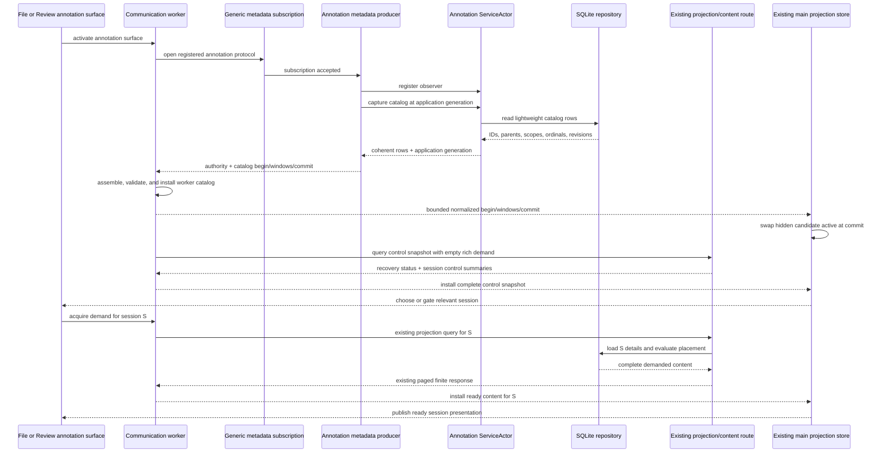
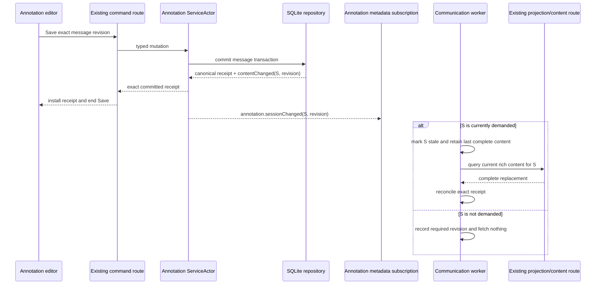
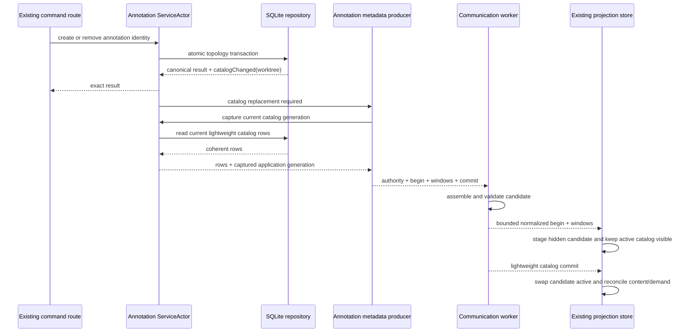
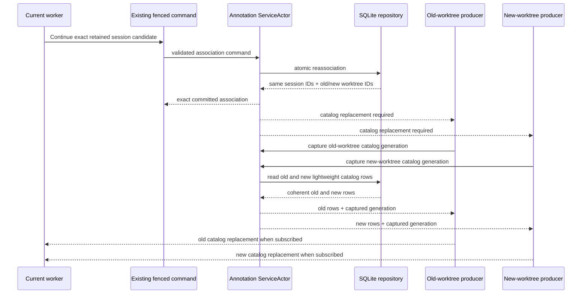
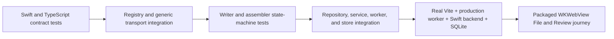

# Bridge Metadata Application Protocol — Program Design

Requirements:
[`2026-08-27-requirements.md`](./2026-08-27-requirements.md)

Specification:
[`2026-08-27-specification.md`](./2026-08-27-specification.md)

## The system in one minute

Bridge keeps its three physical routes and one pane communication worker. The
metadata route becomes structurally generic: it validates delivery fields,
then asks a statically registered application protocol to validate and type the
application payload. File and Review register their existing event contracts
without changing behavior.

The same generic layer gains one bounded catalog-transfer primitive. Worktree
Annotations uses it to continuously publish only session, thread, message, and
scope relationships. Existing session demand and finite content continue to
carry bodies, drafts, origin, placement, history, and output details.

```mermaid
flowchart LR
    NativeApplication[Typed native application producer]
    NativeProtocol[Registered native application protocol]
    Stream[Existing pane metadata stream]
    Envelope[Generic envelope validation]
    WebProtocol[Registered worker application protocol]
    Application[File, Review, or Worktree Annotation applicator]
    Content[Existing demand and content route]

    NativeApplication --> NativeProtocol --> Stream --> Envelope --> WebProtocol --> Application
    Application -->|application demand| Content
    Content -->|finite rich data| Application
```



The transport never interprets a file path, Review item, annotation session,
thread, or message. The registered application protocol does.

## Current system and the structural gap

The physical metadata transport is already generic in behavior. It owns stream
and subscription identities, sequence, interest barriers, source generation,
worker epochs, bounded queues, reset/end/error, acknowledgement, frame bounds,
and producer backpressure.

Application payloads are still compiled into generic owners in two places:

- Swift `BridgeProductSubscriptionData` is an exhaustive enum with File,
  Review, and annotation cases.
- TypeScript `bridgeProductSubscriptionDataFrameSchema` is an exhaustive union
  with the same application kinds and schemas.

Adding an application therefore changes both transport definitions even when
no delivery mechanic changes.

Worktree Annotations has a second gap. Current code emits only
`snapshot.required`; the worker responds by querying all session summaries plus
full details for currently demanded sessions. The decoded result replaces
session summaries and hydrated threads/messages as one snapshot. That loses
the distinction between “this identity exists but content is not demanded” and
“this identity is confirmed empty.”

```text
current annotation path

SQLite mutation
  → ServiceActor publishes snapshot.required
  → pane annotation subscription
  → worker invalidates combined projection
  → projection query loads all session summaries
      + bodies/drafts/origin/placement for demanded sessions
  → one complete sessions[] + threads/messages[] replacement
```

Source anchors are Swift `BridgeProductSubscriptionContracts`,
`WorktreeAnnotationServiceActor`, and the pane annotation notification source;
and TypeScript session contracts, annotation query controller, and projection store.

## Structural choice

| Direction | Gain | Cost | Decision |
| --- | --- | --- | --- |
| Keep central application unions and add annotation catalog cases there | smallest immediate diff | every future application still changes generic transport; no reusable catalog transfer | rejected |
| Static typed application registry plus generic bounded catalog transfer | application meaning stays typed; future additions do not reopen delivery mechanics; annotations reuse File/Review paradigm | one hard cutover across Swift and TypeScript; registry/type-erasure boundary must be proven | selected |
| Runtime-discovered application protocols | independent deployment of new protocol code | new trust, versioning, lifecycle, and executable-loading system with no requirement | rejected |
| Annotation catalog deltas from the first release | smaller topology updates | requires upsert/tombstone lineage, cascade semantics, and reassociation recovery before measurement shows need | deferred |

The selected design spends one static registry per language and one generic
writer/assembler pair. It removes application payload cases from generic frame
owners. It does not add another route, queue, scheduler, persistence boundary,
or presentation store.

The cost is a synchronized Swift/TypeScript hard cutover. Packaged Bridge and
the Vite development backend ship matching contracts, so there is no supported
mixed-version period. File and Review regression proof bears most of that cost.

The choice reopens only if evidence shows that static registration cannot
preserve current type safety, or measured annotation topology replacement cost
requires application-specific deltas.

## Target composition and ownership

```text
Bridge metadata transport
  Generic metadata envelope
    owns: stream/subscription delivery fields and bounds
    consumes: encoded application payload
    changes when: physical transport contract changes

  Metadata application registry
    owns: subscription kind → typed application protocol and source binding
    consumes: generic envelope and application control payloads
    changes when: an application protocol is added or removed

  Metadata catalog transfer
    owns: begin/window/commit framing and atomic candidate assembly
    consumes: application-defined complete catalog entries
    changes when: generic replacement-transfer semantics change

Application protocols
  File annotation protocol
    owns: current File annotation kind/surface/source authority
    consumes: shared Worktree Annotation event/source implementation

  File metadata protocol
    owns: current File surface, options/open conversion, interests/deltas,
          source lifecycle, event schema, generation extraction

  Review annotation protocol
    owns: current Review annotation kind/surface/source authority
    consumes: shared Worktree Annotation event/source implementation

  Review metadata protocol
    owns: current Review surface, options/open conversion, interests/deltas,
          source lifecycle, event schema, generation extraction

  Shared Worktree Annotation application protocol implementation
    owns: empty interests, catalog/control/session-change event schemas,
          generation extraction, and reusable native source behavior

Worktree Annotation application
  Repository catalog projection
    owns: lightweight SQLite ID/relationship read

  Service change classifier
    owns: content-only versus catalog-affecting committed change

  Pane annotation metadata producer
    owns: gap-free bootstrap and current catalog/change publication

  Worker annotation catalog applicator
    owns: catalog relationship validation and application map construction

  Existing annotation projection store
    owns: active catalog plus content-by-session and command overlays

  Existing annotation demand/query/content owners
    own: rich session loading, source authority, placement, and convergence
```

Singular truth remains unchanged:

| Truth or invariant | Owner |
| --- | --- |
| stream, subscription, sequence, interest, frame, acknowledgement, and backpressure state | existing generic product transport |
| registered surface/source binding, option/interest transforms, schemas, and generation reader | metadata application registry entry |
| durable annotation sessions/threads/messages/content | Worktree Annotation SQLite repository |
| committed-change classification and observer fan-out | `WorktreeAnnotationServiceActor` |
| current annotation catalog for one surface/source authority | worker annotation catalog applicator and existing projection store |
| rich content currentness for one demanded session | existing annotation query controller and projection store |
| initiating command success/failure and exact canonical receipt | existing typed command response |

Forbidden edges:

- generic transport must not import File, Review, or Worktree Annotation event
  schemas;
- catalog-transfer helpers must not inspect application entry fields;
- Worktree Annotation catalog production must not decode bodies, drafts,
  origins, placement, history, or output rows;
- React must not construct authoritative catalog relationships from hydrated
  messages;
- File or Review applicators must not be rewritten around annotation catalog
  semantics;
- application protocols must not change generic queue, sequence,
  acknowledgement, or backpressure policy.

## Generic metadata application contract

### Raw and typed frames

The TypeScript structural decoder produces the Specification's generic
`BridgeProductMetadataDataFrame<unknown>`: stream/subscription identities and
sequences, source generation, optional correlation, and raw `data`. The registry
resolves the subscription kind, validates `data`, compares the registered event
generation with the frame, and returns
`BridgeProductMetadataDataFrame<TEvent>`.

No application consumer accepts `unknown`, and no assertion substitutes for
schema validation.

### Application registration

Each language-specific `MetadataApplicationProtocol<Options, Interest, Event>`
owns the Specification's full registration contract: kind, surface/source
authority, options and initial-open conversion, empty/target interest state and
delta accounting, event validation/generation, and native source lifecycle.
The registration adapts an existing native authority owner; it cannot create or
widen pane, surface, worktree, provider, Review publication, mutation, or
content authority. Generic admission runs before the registered adapter, and
the adapter preserves its application's existing authority fences.

TypeScript exposes a typed definition factory and uses its protocol value as
the generic parameter to `transport.subscribe(protocol, options)`. The returned
subscription event iterator is typed from that protocol.

Swift keeps application producers typed and erases only the registry entry. An
`AnyBridgeProductMetadataApplicationProtocol` retains strict Codable
encode/decode closures, surface authority, initial-open conversion, canonical
interest encoding/delta construction, native source lifecycle binding, and the
event-generation reader. A typed producer asks its application protocol to
encode an event; the generic coordinator receives only subscription kind,
source generation, and encoded application JSON.

The registry rejects duplicate registration. Unknown subscription kinds are
rejected at open/update/data admission. A string-valued validated subscription
kind with named static constants replaces the exhaustive application enum so a
new registered kind does not require a transport switch.

### Application control payloads

Subscription open and interest update follow the same boundary as data:

```text
generic control envelope
  subscription kind
  raw application options or interest update
      → registry validation
      → typed application source
```

The generic control multiplexer continues to own request sequence,
correlation, pane/worker identity admission, generic batching, and committed
interest barriers. The registered protocol owns the application surface/source
binding, initial-open conversion, canonical empty/target interest state, and
application delta construction/accounting. Its source binding receives typed
open/update/cancel/close calls while the generic producer lifecycle continues
to own task replacement, sequencing, and drain.

File and Review registrations wrap their current schemas and event unions.
They do not change wire literals or application behavior.

The current application-kind switches in Swift source construction, surface
mapping, open/update conversion, empty-interest construction, delta accounting,
and TypeScript subscription event typing are removed. A fixture protocol with
empty interests must require only one registration in each language; generic
subscription state and producer lifecycle remain unchanged.

## Generic bounded catalog transfer

The reusable `MetadataCatalogTransfer<Entry>` is the Specification's strict
begin/window/commit union: one transfer/revision, expected total entries,
contiguous window ordinals with complete entries, and final window/entry counts.

An empty catalog emits `begin(expectedEntryCount: 0)` followed by
`commit(windowCount: 0, entryCount: 0)`. It emits no empty window.

### Writer

`MetadataCatalogWriter<Entry>` is a generic native helper. The application
supplies ordered strict entries and catalog revision. The helper asks the
existing metadata frame encoder whether a prospective full frame, including
its envelope, fits the current metadata-frame ceiling. It packs as many
complete entries as fit, never splits one entry, and waits on the existing
producer/acknowledgement path before advancing.

Before emitting `begin`, the writer rejects a catalog with more than 200,000
entries or more than 8 MiB of encoded application entry bytes and proves that
each individual entry can fit inside one complete prospective metadata frame.
An oversized catalog or indivisible entry therefore emits no partial transfer.

The existing metadata observation owner retains multiple sequence waits per
producer lease. An acknowledgement advances one monotonic observed high-water
mark and completes every wait at or below that sequence. A Review final-barrier
wait and a catalog-window wait on the shared pane metadata stream therefore
cannot supersede or falsely fail one another. This extends the existing
observation owner; it adds no port, queue, timer, scheduler, or emission owner.

The writer owns no queue and retains no durable transfer. Cancellation,
producer replacement, reset, and pane close use existing task and metadata
producer lifecycles.

### Assembler

```mermaid
stateDiagram-v2
    [*] --> Idle
    Idle --> Receiving: first begin for expected authority accepted
    Receiving --> Receiving: next contiguous window accepted
    Receiving --> Complete: matching commit and counts accepted
    Receiving --> Receiving: same-authority newer begin supersedes candidate
    Receiving --> Receiving: late frame for noncurrent transfer rejected
    Receiving --> Idle: reset, error, cancellation, or current-candidate defect
    Complete --> Receiving: same-authority begin newer than active accepted
    Complete --> Complete: committed replay rejected without state change
    Complete --> Idle: authority retired; numeric baseline cleared
```

`MetadataCatalogAssembler<Entry>` is a generic worker helper with this state:



The helper owns one candidate's identity, revision, next ordinal, entries,
encoded application-entry byte count, and entry/window counts. It rejects a
`begin` above 200,000 expected entries and discards the current candidate before
any accepted window would exceed 200,000 entries or 8 MiB of encoded application
entry bytes. Within one lifecycle-admitted subscription/source authority, a `begin`
replaces that candidate only when its revision is newer than both the active and
candidate revisions. Authority retirement discards the candidate and clears the
numeric comparison baseline while the application may retain the prior active
catalog visibly stale. After the generic lifecycle admits the expected new
authority, its first `begin` is accepted regardless of the retained stale
catalog's revision. A `begin` from any other authority is rejected. A window or
commit for any noncurrent transfer identity is rejected without changing the
current candidate. An ordinal, count, revision, or entry defect belonging to
the current transfer discards only that transfer. A committed replay is rejected
without state effect; no retained equivalence digest is required. The helper
returns a complete candidate only after commit. It never installs application
state. The application validates relationships and performs the active-state
swap.

The application retains at most one active catalog and one candidate. A
malformed candidate is discarded without changing active state.

## Worktree Annotation catalog

### Durable source and lightweight projection

SQLite already owns:

```text
annotation_session(id, worktree_id, semantic_revision)
  └─ annotation_thread(id, session_id, scope, created_ordinal)
       └─ annotation_message(id, thread_id, ordinal)
```

Existing foreign keys and indexes supply the relationship. No schema migration
is needed.

The repository adds one immutable catalog capture from a single SQLite read
transaction:

```text
WorktreeAnnotationCatalogCapture
  worktreeId
  ordered session entries
  ordered thread entries
  ordered message entries
```

Its SQL selects only IDs, parent IDs, scope, ordinals, and session semantic
revision. It does not select or decode saved/draft bodies, edit tokens,
origin JSON, placement, history, output membership, or exact output bytes.

The repository owns only those immutable rows. `WorktreeAnnotationServiceActor`
owns the application source generation: it captures its current projection
revision, performs the repository read, rechecks that revision and recovery
state, then wraps the rows in a service capture. A mutation during the read
therefore produces either one coherent captured generation or a stale-capture
result followed by a newer notification. The repository never manufactures or
advances the service generation.

### Entry contract

`WorktreeAnnotationCatalogEntry` is the strict Specification union: session ID
plus semantic revision; thread ID, parent session, scope, and ordinal; or
message ID, parent thread, and ordinal.

The application applicator validates unique identities, known parents, and
unique/canonical sibling ordinals before constructing:

```text
WorktreeAnnotationCatalog
  sessionsById
  orderedSessionIds
  threadsById
  threadIdsBySessionId
  messagesById
  messageIdsByThreadId
```

The transport and generic assembler never construct these maps.

### Committed-change classification

Repository mutations return the existing canonical result beside one compact
committed-change description. The primary description uses
`catalog > control > content > none` precedence and retains newest affected
session revisions when a control or catalog transaction also changes rich
content:

```text
none
  no durable semantic change

contentChanged
  newest committed revision per affected session

controlChanged
  affected worktree IDs
  reason: discovery | recovery
  newest committed revision per affected session, when applicable

catalogChanged
  affected worktree IDs
  newest committed revision per affected session, when applicable
```

The repository transaction is the only place that knows whether it inserted,
removed, or reassociated catalog identities. The service uses that returned
classification; it does not requery and diff the catalog after every edit.

Body/draft/viewed/handled/resolution and other relationship-preserving changes
return `contentChanged`. Lifecycle, source relationship, foreign-candidate
disposition, and recovery admission changes return `controlChanged`; they may
also carry the newest affected session revision. Creating or removing a
session/thread/message, changing catalog parent/scope, session reassociation,
recovery replacement, and bootstrap/reset require `catalogChanged`. A topology
transaction may also advance rich session content; catalog commit reconciles
that revision and causes current demanded content to refresh.

Every successful transaction that changes session-scoped rich content advances
that session's semantic revision exactly once. Rich content includes output
attempt, history, and event state as well as bodies, drafts, message state,
placement inputs, and handled/viewed state. An idempotent replay or zero-row
mutation advances the revision zero times and returns `none`. Output message
helpers report whether they changed rows; the owning outer output transaction
performs the single session revision advancement when either output history or
member-message state changed. This prevents both an equal-revision change from
being suppressed and one transaction from incrementing twice.

The existing service projection revision remains the monotonic application
source generation and capture fence. Every annotation event carries a common
authority `{ worktreeId, applicationSourceGeneration }`; the registered
generation reader returns that application source generation and the generic
frame must match it. A catalog transfer uses the captured application source
generation as its catalog revision. Catalog replacements may skip revision
numbers when intervening content-only commits occur; they must increase, not be
contiguous. Session semantic revision remains the per-session rich-content
currentness fence.

## Gap-free annotation publication

The pane annotation producer registers its service observer before capturing
the bootstrap catalog. A mutation racing that capture therefore produces
either:

- a capture that includes the mutation plus a harmless newer notification; or
- an earlier capture followed by the notification that converges it.

The observer retains one aggregate pending state:

```text
catalog replacement required
  supersedes pending control and per-session changes

otherwise
  control snapshot changed, when applicable
  newest semantic revision per changed session
```

On catalog-required state, the producer captures and sends one current complete
catalog and marks the active control snapshot stale. On control-changed state,
it emits one bounded control-change event. On content-only state, it emits one
bounded session-change event per retained changed session. Coalescing may skip
intermediate revisions but cannot lose the newest committed control or session
revision.

File and Review annotation subscriptions each retain their own pane/surface
source authority and catalog application. The catalog contains no
surface-specific placement, so both derive the same durable relationships
without sharing mutable pane state.

## Annotation worker and presentation state

The registered Worktree Annotation event is:

```ts
type WorktreeAnnotationMetadataEvent =
  | {
      readonly kind: 'annotation.catalog';
      readonly authority: {
        readonly worktreeId: string;
        readonly applicationSourceGeneration: number;
      };
      readonly transfer: MetadataCatalogTransfer<WorktreeAnnotationCatalogEntry>;
    }
  | {
      readonly kind: 'annotation.sessionChanged';
      readonly authority: {
        readonly worktreeId: string;
        readonly applicationSourceGeneration: number;
      };
      readonly sessionId: string;
      readonly semanticRevision: number;
    }
  | {
      readonly kind: 'annotation.controlChanged';
      readonly authority: {
        readonly worktreeId: string;
        readonly applicationSourceGeneration: number;
      };
      readonly reason: 'discovery' | 'recovery';
    };
```

The worker application catalog applicator owns one generic assembler and the
active normalized annotation catalog used for demand/currentness decisions.
After native commit and relationship validation, it sends bounded normalized
catalog staging units over the existing worker-to-main port. The existing main
projection store applies those units to a hidden candidate bank; React keeps
reading the prior active bank. One final lightweight commit swaps the candidate
bank active and increments presentation revision once. A reset or replacement
during main staging discards the hidden candidate without exposing partial
membership.

The worker-to-main staging unit uses the same generic begin/window/commit
semantics with an application-defined normalized catalog entry. It is a new
message family on the existing port and existing port FIFO, not a new route,
queue, scheduler, or persistence owner. Each complete staging message is
independently bounded by the 128 KiB metadata-frame ceiling; no pre-existing
generic worker-message budget is assumed. The hidden main candidate bank applies the
same authority-scoped revision rule: a lifecycle-admitted worker/source
replacement clears the comparison baseline, while an unexpected authority is
rejected. It enforces the same 8 MiB and 200,000-entry aggregate candidate
limits as the worker assembler.

The existing store is evolved, not duplicated:

```text
WorktreeAnnotationProjectionStore
  catalog
    active catalog revision, source authority, current/stale state,
    normalized ID maps, and hidden main-thread candidate bank

  control
    recovery status
    current session summaries: identity, semantic revision, lifecycle,
    source relationship, and candidate disposition
    unknown | loading | ready | stale | unavailable

  contentBySessionId
    notDemanded
    loading(requiredRevision)
    ready(contentRevision, complete threads/messages/placement)
    stale(requiredRevision, retained last complete content)
    unavailable(requiredRevision, optional retained content)

  command-confirmed overlays
  read/recovery status
  output history
```

The control bank preserves the existing demand-independent part of the finite
annotation projection. An active surface first queries with an empty demanded
session list to obtain recovery and session-control summaries. It derives the
relevant living/applicable or uncertain session from that bank, then acquires
rich demand. A lifecycle, source-relationship, candidate, or recovery mutation
emits `annotation.controlChanged`; an active surface refreshes the control bank
without hydrating undemanded bodies. A body-only session change does not refresh
the control bank when that session is undemanded.

Catalog commit reconciles content states:

- removed sessions retire their demand and reject later rich results;
- retained sessions keep last complete content;
- retained sessions whose semantic revision advanced become stale;
- newly discovered sessions begin `notDemanded`;
- current demand for a stale retained session schedules one existing projection
  refresh.

Reset, stream/source replacement, worker replacement, and reopen discard the
catalog candidate and mark the retained active catalog stale against the new
expected subscription/source authority. Stale identities may remain visible,
but cannot establish current empty state, mutation admission, output
membership, or rich-result install authority. Catalog commit binds the new
subscription, worker epoch, worktree, and application source generation and
makes the candidate current.

Catalog-only state is never projected as empty-ready content. Pierre, editors,
viewed reconciliation, and Share consume only complete ready or explicitly
retained stale content according to their governing PR1 rules. Share membership
remains unavailable until the demanded session content and source/output fences
are complete and current.

## Current-to-target call paths

### Generic subscription data

| Edge | Current | Target | Status |
| --- | --- | --- | --- |
| application encoding | central Swift data enum | registered native protocol | changed |
| metadata coordinator/frame | generic owner | same owner | preserved |
| data decoding | central TypeScript payload union | generic envelope then registered schema | changed |
| subscription state and application result | generic subscription to typed consumer | same result through registered event type | preserved |

Central File/Review/Annotation payload switches are removed.

Generic delivery errors still return through the existing subscription
failure/reset path. Application schema or generation errors are classified
before application consumption and use that same terminal path.

### Generic subscription control and native source lifecycle

```text
worker subscribe(protocol, options)
  → registered initial-open or target-interest conversion        [changed]
  → registered application delta construction/accounting         [changed]
  → generic control batching and committed barrier               [preserved]
  → native registered open/update validation and source binding  [changed]
  → generic producer replacement and drain                       [preserved]
```

This removes current application-kind switches in surface maps, empty-interest
state, option/open conversion, update/delta accounting, and native routing.

Open/update rejection and source failure return through the existing typed
control result and subscription reset/end/error paths. File and Review source
objects, events, and lifecycle semantics are preserved behind their
registrations.

### Annotation bootstrap and demand



Changed edges are service-owned catalog capture/publication, worker and hidden
main-bank atomic catalog install, and explicit control-snapshot selection before
rich demand. Existing surface activation, session demand, projection query,
content paging, placement, and presentation publication remain authoritative.

### Annotation Save or content-only change



The command result/error edge is intentionally unchanged. The removed edge is
“every commit emits `snapshot.required` and refetches the combined projection.”

### Annotation topology change



### Session reassociation



The existing candidate classification, command fence, and atomic reassociation
remain governed by Durable Review Subject Identity. Only its post-commit
convergence changes from generic snapshot invalidation to exact catalog
replacement for both associations.

## Failure, recovery, and consistency

| Failure or interleaving | Detection and containment | Recovery owner |
| --- | --- | --- |
| unregistered subscription kind | registry lookup fails before source/event admission | generic control/stream owner returns existing rejection/reset |
| malformed options, interest, or event | registered strict schema fails | generic subscription terminates/resets; application state unchanged |
| frame and event generation disagree | registered generation reader comparison fails | subscription recovery reopens current source |
| catalog window exceeds frame ceiling | writer cannot admit prospective encoded frame | application producer fails current candidate; prior catalog remains active |
| catalog entry cannot fit alone | writer reports bounded application encoding failure | annotation catalog remains stale/unavailable; no partial replacement |
| catalog exceeds 8 MiB or 200,000 entries | writer preflight or worker/Main candidate capacity guard rejects the replacement | retain the last complete catalog and await a later admissible replacement |
| defect in the current candidate | assembler ordinal/count/revision/entry guard fails | discard that candidate; retain active catalog and await current replacement |
| late frame from a superseded transfer | transfer identity differs from current candidate | reject frame without changing newer candidate or active catalog |
| reset/reconnect during candidate | generic reset retires worker and main candidates, clears their numeric revision baselines, and marks retained active catalog stale | register observer, capture current catalog, and accept the first replacement only for the lifecycle-admitted new authority regardless of the stale catalog's revision |
| newer topology change during candidate | newer begin supersedes candidate; older frames are noncurrent | producer sends newest complete catalog; worker rejects obsolete frames without damaging it |
| content change during catalog capture | service revision fence and registered observer expose newest change | catalog contains it or later session-change/catalog replacement converges it |
| output history changes without a member-message change | owning output transaction treats attempt/history/event state as rich content and advances the session revision once | session-change publication refreshes demanded output history; no second query or revision owner |
| idempotent or zero-row annotation mutation | repository returns `none` and does not advance session or application generation | command returns its existing canonical result; no publication is scheduled |
| rich response finishes after catalog removed session | catalog/content authority check rejects retired session result | no install; current demand reconciles from active catalog |
| catalog commit while editor open | store retains ready/stale content and exact command overlay for retained session | content refresh replaces only after complete current response |
| reset while bounded worker-to-main staging is incomplete | main candidate authority no longer matches | discard hidden candidate; retain active catalog visibly stale until replacement commit |
| File/Review protocol registration mismatch | fixture/contract validation fails before application | hard-cut build is invalid; no compatibility fallback |
| pane/worker/source closes | existing cancellation and revocation fences retire producer, assembler, demand, and content attempts | fresh session bootstrap only |

Ordering and atomicity rules:

- generic stream and subscription sequences remain contiguous FIFO delivery
  authority;
- one monotonic observation high-water mark may settle multiple independent
  same-lease waits; registering a later wait never retires an earlier wait;
- catalog window ordinal is an application-transfer invariant inside that FIFO;
- SQLite transaction commit precedes the corresponding session-change or
  catalog-required publication;
- one transaction advances each affected session semantic revision at most
  once; its committed classification carries the post-commit revision;
- `none` advances neither session semantic revision nor application source
  generation and emits no annotation change;
- service projection revision fences a coherent catalog capture;
- session semantic revision fences rich content, not catalog membership;
- only catalog commit swaps active relationships;
- catalog commit binds subscription, worker, worktree, and application source
  authority; reset/source replacement marks retained active state stale;
- revision precedence applies only within one admitted authority; replacement
  clears the numeric comparison baseline but does not admit an unexpected
  authority;
- native-to-worker and worker-to-main catalog transfers both use bounded staging
  and final commit; React never observes either candidate;
- only complete rich response swaps session content;
- exact command receipts may overlay presentation before either swap;
- a surface holds at most one active and one candidate catalog, one rich query
  per existing controller policy, and one newest coalesced invalidation state.

No polling, timeout increase, second queue, durable pending-frame log, or
parallel compatibility path is introduced.

## Hard cutover

Swift and BridgeWeb cut over together in one wire version/build:

```text
1. introduce registry and generic envelope/application boundaries
2. register all four current File/Review metadata and annotation protocols with unchanged events
3. move annotation subscription to its registered protocol
4. add generic catalog writer/assembler
5. publish and install Worktree Annotation catalogs
6. split existing annotation store catalog/content state
7. replace snapshot.required-only convergence with sessionChanged or catalog replacement
8. delete central application payload cases and obsolete combined-snapshot assumptions
```

This order describes authority dependencies, not a compatibility period. The
branch does not retain old and new event paths simultaneously at completion.

During development, a slice may compile with adapter wiring only while its
tests are red/green, but no checkpoint may claim product readiness until Swift,
the production worker, Vite, and packaged transport use the same registered
contracts. Rollback is source rollback to the previous complete build, not a
runtime mode switch.

No SQLite migration occurs. Existing annotation rows and identities remain
authoritative.

## Performance, trust, and observability

Performance:

- catalog SQL reads indexed identity/relationship columns only;
- content-only mutations emit one bounded session-change fact;
- undemanded sessions cause no rich query;
- catalog transfer uses existing metadata acknowledgement/backpressure;
- the shared observation owner releases every eligible same-lease sequence wait
  without serializing application producers;
- generic writer measures the full prospective encoded frame, not an estimated
  payload-only size;
- worker and Main each stage at most one candidate beside one active catalog;
  every candidate is bounded to 8 MiB of encoded entries and 200,000 entries;
- catalog normalization and validation run in the communication worker;
- the worker sends bounded normalized staging units over the existing main
  port, and the existing projection store holds at most one hidden main
  candidate beside one active bank;
- main-thread work per staging unit is bounded, React receives no wake per
  entry/window, and one lightweight final commit swaps active revision and
  publishes one presentation change.

Trust and validation:

- pane capability, product session, worker epoch, source generation, and
  subscription interest remain existing enforcement boundaries;
- raw application payload stays unknown until a locally registered strict
  schema validates it;
- the registry is product composition, not wire-controlled behavior;
- application protocols cannot relax generic identity, sequence, bound,
  acknowledgement, or backpressure checks;
- Worktree Annotation repository paths and continuity evidence remain native
  authority and are absent from the catalog.

Observability records application kind, generic/registered validation result,
transfer phase, catalog revision, window/entry/byte counts, candidate discard
reason, session-change coalescing, demand disposition, and latency using
scrubbed correlation. It does not export payload entries, annotation IDs,
bodies, drafts, paths, origins, output bytes, edit tokens, or SQL errors.

## Proof architecture



The proof pyramid has distinct jobs:

| Layer | Real boundary and observation |
| --- | --- |
| Generic unit | protocol registration, duplicate/unknown rejection, raw-to-typed validation, generation extraction, begin/window/commit state machine, frame packing |
| File/Review regression | existing schemas, applicators, subscriptions, interests, demand, reset, and presentation receive unchanged typed events behind the registry |
| Annotation repository | real SQLite catalog query returns only IDs/parents/scope/order/revision and preserves reassociation identities |
| Annotation Swift integration | observer-before-capture bootstrap, content-vs-catalog classification, coalescing, old/new invalidation, reset/restart |
| Annotation worker/store | catalog atomicity, relationship validation, catalog-only states, content-by-session fences, overlay/viewed/Share continuity |
| Browser integration | production React and comm worker observe catalog before gated content, Save immediate settlement, demanded-only refresh, reset/restart |
| Packaged product | URL-scheme transport, WKWebView lifecycle, File/Review annotations, focus/editor continuity, output membership and effects |

The real development-browser journey is:

```text
isolated file-backed SQLite
  → start Swift development backend
  → start Vite production React/worker composition
  → open File and Review annotation subscriptions
  → observe worker and bounded main-bank catalog commit before rich content
  → query recovery/session control with empty rich demand and choose session
  → acquire one session demand and release gated content
  → Save one message and observe exact receipt before session refresh
  → keep another undemanded session unfetched
  → create a reply and observe atomic catalog replacement
  → reassociate a session and observe old/new worktree catalogs
  → reset during a staged replacement and retain the prior catalog visibly stale
  → reopen metadata subscription and commit a current authority-bound catalog
  → restart backend on the same SQLite root
  → recover the same session/thread/message identities and rich content
```

The harness must inspect worker catalog/content state, browser presentation,
native telemetry, and canonical SQLite. Direct HTTP or mocked browser evidence
cannot substitute for this boundary. Packaged WKWebView remains required above
the development-browser proof.

## Requirement realization

| Requirement | Structural realization | Proof seam |
| --- | --- | --- |
| MAP-R1, R2, R3 | generic raw envelope; static typed registries owning surface/source lifecycle, option/open and interest/delta transforms, schemas, and generation reader; preserved generic batching/barrier/transport state machine | fixture application plus schema/type and native/worker subscription integration |
| MAP-R4, R5 | generic full-frame-measured writer, multi-waiter observation high-water, precedence-aware capacity-bounded candidate assembler, authority-bound active/stale catalog, bounded worker-to-main hidden staging | packing, concurrent observation, aggregate-capacity, and transfer state-machine tests including late superseded frames, replay rejection, reset, failure, and main-bank commit |
| MAP-R6 | File/Review registrations wrap existing contracts and feed existing applicators | existing regression suites plus wire/application parity fixtures |
| MAP-R7, R8 | service-generation-fenced lightweight SQLite catalog rows, common annotation authority, relationship applicator, existing store catalog/control/content banks | real repository, worker, store, recovery/session-selection, and browser catalog-only tests |
| MAP-R9, R10 | existing control/rich projection demand, session-change revision coalescing, and discovery/recovery control invalidation | empty-demand control selection, demanded/undemanded rich content, control refresh, and equal/older/newer revision integration |
| MAP-R11 | repository committed-change classification, full replacement, old/new reassociation publication, catalog/demand reconciliation | topology/reassociation races and restart proof |
| MAP-R12 | unchanged exact command receipts and overlays independent of catalog/content convergence | delayed/failed replacement editor and Share tests |
| MAP-R13 | existing pane/product/worker/source lifecycle retires writers, worker/main candidates, and content attempts while marking retained authority stale | replacement/reset/inactive/close integration |
| MAP-R14 | body-free entries, prospective full-frame packing, bounded worker-to-main staging, one active+candidate per boundary, existing ack/backpressure | byte/window/port-unit telemetry, main-thread long-task measurement, and resource-state inspection |
| MAP-R15 | identical protocol registrations behind URL-scheme and HTTP carriers | real Vite/Swift and packaged journeys |

## Deliberate limits and revisit signals

- File and Review keep their application-specific transfer and delta models.
  They adopt the registry, not the annotation catalog protocol.
- Worktree Annotation demand stays session-granular until measurement shows a
  session is too expensive to refresh as one coherent detail unit.
- Annotation topology uses complete bounded replacement until measured
  topology frequency or catalog size proves a delta protocol necessary.
- The existing projection store is evolved because it already owns
  read-convergence and command overlays; a second store would create two
  currentness authorities.
- The catalog is pane/surface-local worker state derived from SQLite. It is not
  persisted separately and is not shared across panes.
- Application registration remains static product composition. Independent
  runtime protocol loading would require a separate trust and versioning
  design.
