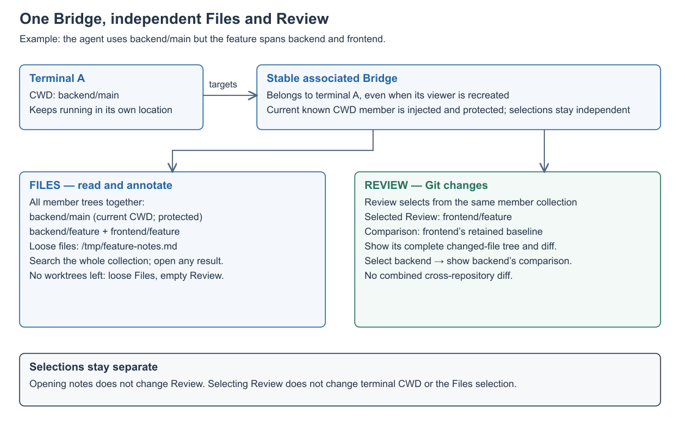
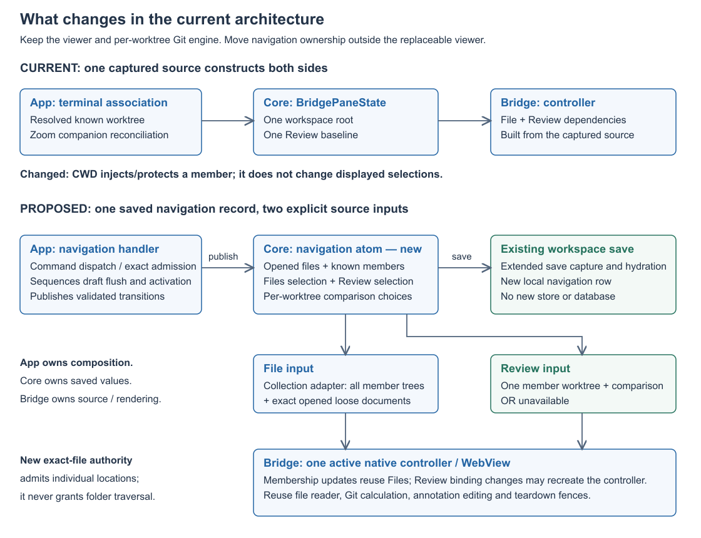
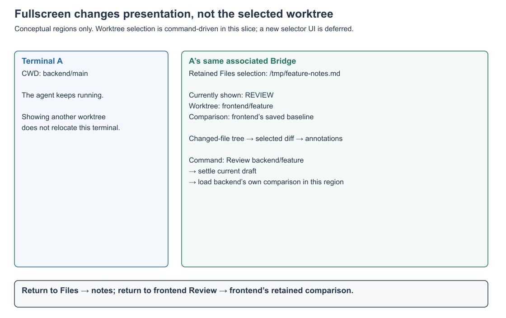
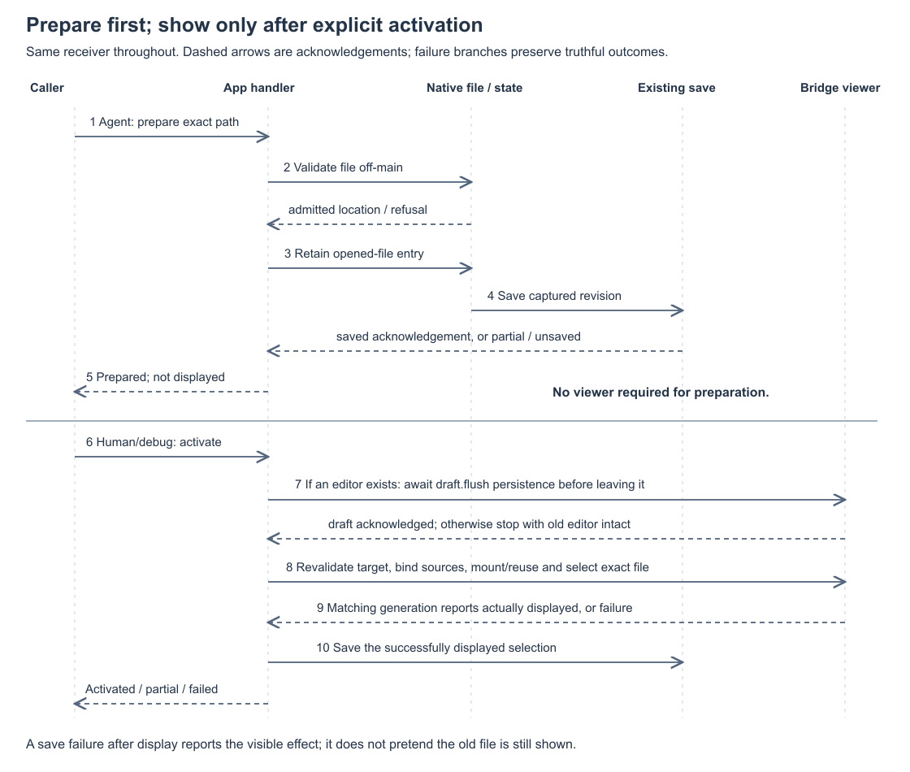

# Bridge Files and Worktree Navigation — Program Design

[Requirements](./2026-09-12-requirements.md) →
[command-first Specification](./2026-09-12-bridge-navigation.md) → this design.

## Start with the files you want to read

An agent can work in another worktree or related repository for any reason.
The human should still read its files in the same receiving Bridge. An exact
file path needs no worktree membership; membership is for directory browsing
and Git Review. These are independent inputs, not a worktree-first opening flow.

```text
Terminal A: current known CWD worktree
       │ inject into members; protect from removal
       │ later CWD changes never select displayed content
       ▼
Same associated Bridge
├─ Files collection
│    All member worktree trees + opened files outside those members
│    Search across the collection; select a document directly
└─ Review
     One member worktree + its independently retained comparison

No known CWD / standalone Bridge → no protected member
No members → loose Files remain; Review is empty
```

.

For example, terminal A can remain in `backend/main` while its Bridge retains
`/tmp/feature-notes.md`, a backend feature file and a frontend feature file.
The **Files collection** combines every member's tree with exact opened files
outside member roots. It never enumerates arbitrary loose-file parent folders.
A file's resolved location determines its group; there is no stored flag for how
it was opened. Commands search the collection and activate results directly.
All member trees are represented together using the existing tree primitive;
new picker, Command-P entry and visual control design remain separate.

**Review** selects one member worktree and its own Git comparison. Selecting
frontend Review leaves the notes available in Files. Selecting backend Review
changes the diff shown in that same Bridge and retains frontend's comparison
for the next visit. Review does not combine changes from different worktrees.

The diagrams below answer different questions: [what changes in the code](#current-foundation-and-the-necessary-split),
[what fullscreen means](#how-multiple-worktrees-work-in-fullscreen), and
[how a file reaches the display](#preparation-no-native-viewer-required).
They are architecture views, not screenshots or a new UI layout specification.

## Current foundation and the necessary split

.

The important change is where navigation lives: the terminal identifies the
receiving Bridge, while a saved record supplies what that Bridge reads. A
controller can be replaced without losing the record. The diagram's arrows
show ownership/data flow; the activation sequence below shows asynchronous
ordering and acknowledgement.

The current [BridgePaneState](../../../Sources/AgentStudio/Core/Models/BridgePaneState.swift)
contains one source with a workspace root and baseline. Controller construction
uses that state for runtime metadata, File authority, Review provider/pipeline,
annotation adapters and product sessions. Merely changing metadata leaves the
old providers and source authority installed.

The [Zoom companion coordinator](../../../Sources/AgentStudio/App/Coordination/WorkspaceSurfaceCoordinator+ZoomCompanion.swift)
already keys the logical relationship by source terminal pane. On a different
worktree it retires the old companion and creates a new companion ID/controller.
Its continuity record preserves only File/Review surface and visibility; it does
not persist opened documents or per-worktree comparison choices.

[Review construction](../../../Sources/AgentStudio/Features/Bridge/Transport/BridgePaneReviewSharedConstructionBinder.swift)
already keys calculations by repository, worktree, root and comparison. Reuse
that calculation mechanism for each target. There is no aggregate Git comparison
across worktrees in this design.

The [File source provider](../../../Sources/AgentStudio/Features/Bridge/Runtime/WorktreeFileSurface/BridgeWorktreeFileSourceProvider.swift)
requires a Worktree and root token. Beneath it, the
[descriptor-based reader](../../../Sources/AgentStudio/Features/Bridge/Transport/BridgePaneProductFileContentSource.swift)
already performs ordinary filesystem reads, content classification and source
validation. The new standalone path reuses that reader while replacing the
worktree-only admission above it.

The existing [draft scheduler](../../../BridgeWeb/src/worktree-annotations/worktree-annotation-draft-scheduler.ts)
already persists draft text without publishing it as a saved annotation. The
[Review installation gate](../../../BridgeWeb/src/core/comm-worker/bridge-main-review-presentation-installation-gate.ts)
awaits registered editor preparation before an affected publication installs.
Ordinary File/Markdown selection and whole-controller teardown do not currently
provide the same awaited barrier; that is the navigation gap this design closes.

## How multiple worktrees work in fullscreen

.

Pane Zoom mounts the terminal's associated receiver into its existing Bridge
region. The same navigation record is used when the region is hidden, shown or
recreated. Fullscreen does not introduce a second workspace or another selected
worktree. A standalone Bridge tab has its own record and can use the same source
selection rules without becoming the terminal's receiver.

| Explicit command intent | Changed state in this receiver | State retained |
| --- | --- | --- |
| Prepare `/tmp/feature-notes.md` | Opened-document inventory and prepared location | Display, Files selection, Review, CWD and focus |
| Activate notes in Files | Select notes within the collection; display Files | Review worktree and its comparison |
| Add known frontend worktree | Browsing membership | Both selections and current display |
| Review frontend against its baseline | Selected Review worktree/comparison; display Review after draft settlement | Files document/filter, backend comparison and terminal CWD |
| Review backend, then frontend again | Review target changes in the same Bridge region | Each worktree's separately retained comparison |
| Return to Files | Display the collection and retained Files document | Selected Review worktree/comparison |
| Hide/show Bridge or leave/re-enter Zoom | Presentation lifecycle only | Receiver, opened documents, membership and both selections |

These transitions realize Specification R3/R4/R15/R16 and C3/C4/C7. Draft failure
stops a source switch before teardown. A missing worktree yields unavailable
Review for that target; it does not select the terminal's worktree as a fallback.

## Structural choices and tradeoffs

**Navigation memory:** add one focused Core `BridgeNavigationAtom`, observed by
commands, the host and read-only snapshots. Extend the existing `WorkspaceStore`
and `WorkspaceLocalRepository` save/hydration path; add no new store or database.
Putting the state inside a controller loses it on source replacement; using only
Bridge pane payloads does not cover transient Zoom companions; adding unrelated
fields to the drawer atom or runtime-only Zoom atom obscures its lifetime.
The cost is a new atom and a local row projection. Both serve R3/R15/R16.

**Source lifetime:** retain one collection adapter behind each controller's Files
input. Member addition, removal of an unselected member, loose-file preparation,
and CWD injection update that adapter without recreating the WebView or active
editor. Individual member engines still have their own immutable source identity
and teardown fences. Review keeps an immutable worktree/comparison binding;
changing it can replace the controller after draft settlement. Reconstruct the
Files adapter from retained navigation state and restore its selection in that
case. There is one active WebView per receiver, not one per member.

**Files aggregation:** add `BridgeFileCollectionSource` in the Bridge feature to
compose existing per-worktree metadata sources and exact loose-document admission.
Its workers/projectors merge source-qualified rows for the existing Pierre tree.
This is more work than the earlier single-tree selector, but the selector cannot
satisfy all-member Files/search. The adapter preserves per-source read authority;
it does not invent a filesystem super-root or copy all content into shared state.
The cost is collection-aware row/query contracts, keyed member lifetimes and
partial-result handling. Revisit controller reuse only if measured Review-switch
cost warrants a broader in-place Review rebinding design.

**Annotations:** extend the existing annotation subject model with a local-file
case. Keep Git-worktree subjects and their continuity rules. Reuse the same
message/draft/edit/anchor machinery instead of adding a second annotations
product. This requires a local annotation schema and product-codec migration;
it is the main data-contract change in the design.

## Owners and dependency direction

```text
Core
  BridgeNavigationAtom — live values and equality/revision publication only
  BridgeReceiver / DocumentLocation / NavigationRecord — shared value contracts
  BridgeNavigationRules — pure transitions and membership/selection invariants
  existing workspace store/local repository — save, hydrate and migration

App
  existing AppCommandDispatcher / pane executor — command identity and target
  BridgeNavigationCommandHandler — sequences admission, transitions and effects
  existing WorkspaceSurfaceCoordinator — host creation/retirement and composition
  IPC contribution — maps v2 typed inputs/outcomes through the command owner

Bridge feature
  BridgeDocumentAdmission — exact local-file authority
  BridgeFileCollectionSource — member-source composition and loose-document rows
  existing workers/projectors — collection rows and search results
  source configuration factories — separate File and Review dependencies
  existing controller/product session — rendering and source lifetime
  annotation subject/adapters — Git or local-file provenance and draft settlement

BridgeWeb
  existing File/Review renderer and worker — source-qualified display/selection
  existing editor preparation — flush acknowledged drafts before activation
```

Core values contain file locations and known-worktree references, not Feature
annotation actors or WebKit objects. App composes the Feature dependencies.
Feature source engines receive values/ports rather than reading Core persistence.
Atom methods never perform I/O, source discovery, routing policy or SQL.

The navigation handler owns per-receiver asynchronous command sequencing and
cancellation, not a second authoritative copy of navigation state. File I/O runs
off MainActor; unrelated receivers may progress concurrently. Existing command
validation resolves concrete receiving owners before any effect. Source-kind or
presentation-ineligible targets return typed refusal through the same boundary.
No fallback to focus or another terminal’s Bridge is introduced.

## Navigation state and identity

A `BridgeReceiver` references an existing pane identity plus its kind:
terminal-associated or standalone Bridge. It does not mint another persistent
workspace/project/Bridge-session ID. The workspace ID scopes storage. Native
companion IDs remain replaceable implementation details.

A persistent navigation record contains:

- ordered opened-document locations;
- ordered known-worktree membership;
- optional Files filter: all members by default, or an explicit narrower scope;
- last successfully activated Files document;
- selected Review worktree, or none, independently of the Files selection;
- retained File/Review presentation surface;
- per-worktree Review comparison selections.

The selected Review worktree indexes its own retained comparison. A Files
selection transition never rewrites that key; a Review transition never rewrites
the Files selection. Membership defines the Files collection and eligible Review
targets, not a shared active root. The initial known terminal worktree can seed Review; later
CWD changes alter membership/protection without changing either selection.

A document location is a canonical local file URL, with its original admitted
known-worktree provenance when applicable. Resolve relative input using the
captured base, normalize it, and resolve symlinks before deduplication. A later
request for the same canonical location reuses the entry without changing the
currently displayed selection. Canonicalization
must respect the actual filesystem; do not lowercase paths to invent identity.
No automatic move/rename tracking or content archive is added.

Known-worktree provenance contains the existing repository/worktree reference and
worktree-relative path. It is source evidence at admission, not a second mutable
repository catalog. A file whose exact containing context cannot be established
as known is admitted as a local document. Source resolution must not register a
repository or mistake simple path-prefix containment for proof of Git identity.

Availability, current loading request, request generation, content descriptors
and displayed native instance are runtime values. A restored path starts
unverified until checked; persisted state must not claim cached bytes or current
readability. The first receiver record is seeded from the current known terminal
association, or empty if none exists. Subsequent admitted CWD changes inject the
new known member if absent and change removal protection. No known association
means no protected member. Previous members remain listed; selections stay fixed.
The protected ID is derived from current terminal association, not a persisted
last-known-CWD or independently mutable field.

The active displayed document and retained inventory are separate facts. Agent
preparation updates the inventory, never the displayed selection. This design
adds no persisted prepared-line/default-activation field.
Queries combine the navigation record with current host/render observations and
carry their generation/currentness; a stale native response is not a current
presentation snapshot.

### Drawer caller resolution

The App command target resolver uses the existing pane graph to map a drawer
terminal to its owner before resolving `BridgeReceiver`. Terminal owners use their
associated Bridge; Bridge owners are themselves the receiver. Other owner kinds
without a receiver return unsupported-target. Resolve from durable owner identity,
not focus or whichever worktree matches the file. A missing/changed ownership
relation invalidates an in-flight request before it publishes state.

```text
Drawer caller + captured caller CWD
        │ resolve relative file location
        ▼
Exact document + owner pane ID
        │ existing owner relationship selects Bridge receiver
        ▼
Owner's collection → member worktree file OR loose file by resolved location

Owner terminal CWD → injected/protected member
Drawer terminal CWD → relative-path base only; no protection/injection effect
```

The v2 contribution must classify this owned-drawer mapping explicitly. It is
not a grant to select an arbitrary other pane, nor a new workspace permission.
The navigation atom stores one record for the owner receiver; no separate drawer
Bridge record or WebView is created. CWD injection runs only for the receiving
owner's terminal association; unrelated drawer CWD publications are ignored by
that membership path. File preparation itself does not add its containing root.

## CWD injection and worktree removal

The existing [CWD update owner](../../../Sources/AgentStudio/App/Coordination/WorkspaceSurfaceCoordinator.swift)
resolves and publishes terminal association before reconciling its companion.
Keep that authority. Replace the terminal-following source-reset effect with an
App call to the navigation handler carrying the already-resolved association.
No new raw-CWD observer, event bus case, repo discovery or MainActor path scan is
needed. Pure navigation rules decide membership and selection changes; the atom
only publishes their values. Protection reads the latest terminal association.

```text
Admitted CWD fact → existing terminal association resolution/publication
    → navigation handler → ensure known member exists (idempotent)
    → collection adds only the missing member source
    → current association determines protection; save changed membership

Explicit remove(member)
    → reject if currently protected
    → derive affected documents from resolved membership before removal
    → await current draft settlement if content/Review will leave
    → revalidate current CWD + membership (they may have changed while waiting)
    → commit one transition: remove member and its retained open entries,
      clear affected Files selection/filter, choose Review fallback if needed
    → revoke removed member resources; display empty Files or new Review
    → save revision and report actual effect / partial failure
```

Removing retained open entries from that member prevents them from immediately
reappearing as loose files. This changes navigation memory only; annotation
subjects, comments, disk files and the app's repository catalog survive. A later
explicit exact-file open can admit the path as a loose entry again. Classification
uses canonical location and member ownership, not a persisted opening-method flag.

| Input | Membership/protection | Files and Review |
| --- | --- | --- |
| Known CWD A → known B | Ensure B exists; protect B; retain A as removable | Preserve both selections, active drafts and host |
| Known CWD → no known worktree | Keep members; no protected member | Preserve both selections |
| Standalone Bridge | No terminal-derived protection | Same explicit navigation/removal rules |
| Remove protected member | Refuse with no mutation | Keep current content |
| Remove other member | Remove only that member and its retained open entries | Clear its selected Files document; reset a filter targeting it to all |
| Remove selected Review member | Select next remaining member, wrapping in collection order | Restore its comparison; show loading/unavailable truthfully if necessary |
| Remove last member | Empty membership; preserve unrelated loose entries | Files remains usable; Review has no target and is empty |
| Temporary catalog/path unavailability | Keep identifiable unavailable member | No implicit removal or Review fallback |
| Explicit catalog unregistration | Apply the same removal transition to each affected receiver | Clear affected file; ordered Review fallback; preserve annotations |

If the fallback member has no saved comparison, use the existing first-time
comparison-designation behavior; do not copy the removed worktree's baseline.
A removal does not silently skip an unavailable fallback member or select based
on terminal focus. The requested surface remains the same; an empty Review does
not force Files to display.

CWD publication can occur while removal awaits a draft. Recheck protection after
that await and before the synchronous membership transition; refusal preserves
the old member and content. A membership revision fences old searches and file
activation requests. No late result may restore a removed entry automatically.
Save failure after a committed removal reports the known in-memory/display effect
and unsaved state, using existing workspace save accounting rather than claiming
rollback. On restore, reconcile the terminal's current known association before
accepting removals, without replacing saved Files/Review choices.

Catalog unregistration uses the existing App topology-mutation completion path.
Capture the removed worktree identity and resolved affected-document membership
before losing its catalog entry, then reconcile each affected receiver through
the same navigation removal rules. Existing pane-association clearing removes
CWD protection for an unregistered ID; never re-inject it from stale pane metadata.
This is propagation of an existing catalog mutation, not new agent authority to
mutate arbitrary receivers. Temporary catalog/path unavailability does not use
this branch.

If catalog mutation has already committed while an active draft still awaits
acknowledgement, block new admission for that removed member and retain only the
existing editor/session needed to settle the draft. Report pending cleanup;
do not claim that membership/content has fully cleared or that catalog removal
was rolled back. After acknowledgement, clear affected navigation entries, retire
that source, and apply ordered Review fallback. Preserve failures through the
existing draft/error path; never silently discard text to force removal complete.

## Commands and the IPC boundary

Use dedicated `openFile` for preparation, as reserved by IPC v2. Add separate
`activateBridgeFile` and `activateBridgeReview` identities for typed receiver
navigation. Keep existing `showBridgeFiles`, `showBridgeReview` and explicit
new-tab opening commands with their current presentation contracts; their creation
path seeds the new receiver state as described in the cutover below. Do not give
one identity both a targetless tab-opening meaning and a typed exact-file meaning.
The new activation commands are not routed through `showViewer`/CodeViewer.

New semantic operations needed alongside preparation are known-worktree
add/removal/Review selection, opened-file activation/close and collection search.
They receive typed receiver/location/worktree/comparison arguments. Read-only
inventory/availability/presentation inspection uses the existing snapshot/query
contribution boundary. Future UI supplies arguments to these owners rather than
creating new lists or file-opening paths.

The command inventory is concrete; new names below are proposed AppCommand
identities, not separately implemented transport verbs:

| Identity | Owner effect | Exposure boundary |
| --- | --- | --- |
| `openFile` (v2 reserved) | Prepare and persist an exact file in the receiver’s inventory | Self-pane agent preparation; no presentation override |
| `activateBridgeFile` (new) | Activate a prepared document in the receiving collection, or return to Files | Typed command/debug entry; explicit receiver and selection; no new UI row |
| `activateBridgeReview` (new) | Activate an explicit known-worktree comparison and optional file | Typed command/debug entry; full comparison retained; no new UI row |
| `addBridgeWorktree` (new) | Add a known worktree to this receiver only | Self-pane membership; idempotent, no selection effect |
| `selectBridgeWorktree` (new) | Select a member for Review; an explicit Files variant only narrows its filter | Human/debug navigation; Files default remains all members; preserve the other selection |
| `removeBridgeWorktree` (new) | Remove a nonprotected member, clear its selected file and apply Review fallback | Human/debug; draft settlement and current-CWD revalidation before commit |
| `closeBridgeFile` (new) | Remove an open inventory entry; protect draft if active | Explicit human/debug navigation; annotations retained |
| `searchBridgeFiles` (new) | Search all members and opened loose files by default; allow explicit narrowing | Read-only result; no persistent search store or activation |

Query/snapshot contributions expose the resulting inventory, selection and
presentation through v2’s existing query boundary. The IPC owner must map these
semantic effects into the current typed-dispatch/descriptor API; the viewing
slice does not define another command execution catalog.

The existing dispatcher’s typed result path is currently synchronous and narrow.
The v2 integration must provide the typed async-effect/result completion seam
for these handlers. The Bridge handler returns a domain outcome: refused,
in-progress, prepared, activated, partial, cancelled or uncertain, with the
receiving owner and actual source. The v2 contribution projects that through its
own catalog/outcome taxonomy; it does not create a second operation journal.

Production agent `file.open` only prepares. Visible activation and disruptive
navigation use human or v2-authorized debug execution. All debug variants remain
explicit and picker-free. New identities use the exhaustive not-presented
interactive policy for this slice; existing controls remain available. Future UI
projects these same identities instead of introducing a second execution path.
Known-worktree addition mutates only the receiving
Bridge’s membership and never the repository catalog, so no workspace-wide grant
capability is introduced here.

The [IPC coordination draft](../../wip/communications/2026-09-13-ipc-v2-bridge-coordination-draft.md)
owns the proposed C7 amendment. The sibling design at `cc0f0fdc8` reserves
`file.open` but still contains obsolete drawer/presentation fields. Integration
must consume the current v2 descriptor/dispatch seams once agreed with that
owner. Do not implement a temporary v1 adapter to make this branch runnable.

## Preparation: no native viewer required

.

The caller enters through the existing command dispatcher and validated receiver.
In the diagram, **Native file / state** groups two different owners to keep the
sequence readable: Bridge's exact-file admission performs filesystem work
off-main; Core's navigation atom publishes pure-rule results on MainActor.
**Existing save** is the existing workspace capture/local repository path.
The App handler sequences them and returns typed results through IPC v2.
Steps 1–5 add a preparation path with no viewer predecessor; steps 6–10 change
the existing display path to await draft settlement and exact arrival.

File admission validates a regular readable local target and the existing
supported-content rules. It returns a native document record and availability;
it does not create a pane, WebView, worktree registration or directory index.
Initial invalid paths leave the inventory unchanged. An unavailable restored
entry is preserved and can be reopened explicitly.

Only exact admitted document locations may receive content descriptors. Public
relative paths may legitimately point outside the caller’s CWD; that is not the
same as allowing a renderer to traverse from an admitted descriptor to an
unadmitted sibling. Preserve issued-descriptor equality, source-generation and
regular-file/containment checks in the low-level reader.

Preparation does not require full-file caching. Activation revalidates the file
and issues current content descriptors, so an agent’s subsequent edits are not
mistaken for the content validated during preparation. If the file changes during
reading, existing stale/source-changed handling applies.

If persistence fails after the in-memory transition, return a partial/unsaved
outcome and keep the state inspectable and dirty under the existing save path.
Do not return a completed prepared receipt that claims saved state. A retry is
state-idempotent for the same location; correlation conflict/replay is still v2’s
responsibility.

## Activation and source replacement

The active source configuration contains two independent inputs:

- File source: the receiving owner's collection adapter containing admitted
  member sources and loose-document entries;
- Review source: a known member worktree plus its retained comparison, or unavailable.

Each member retains its own repo/worktree/root identity, ignore policy, metadata
engine and descriptor validation. Loose entries authorize only their exact file.
The collection adapter maps a display key to `(member source, relative path)` or
an admitted loose document. Synthetic tree group paths are presentation keys,
never filesystem paths or read authority. A content request resolves through the
native map to the original descriptor source. Basenames alone are never keys.

The current [display model](../../../BridgeWeb/src/file-viewer/bridge-file-viewer-display-model.ts)
has one source and path-indexed rows. Extend the native/product/worker/display
contracts together: a receiver collection identity wraps source-qualified member
rows; row selection and content requests retain the member identity. Preserve
Pierre tree/rendering ownership. Do not render one separate app per root.

Metadata/list revision and each member's authority generation are distinct.
Adding a member or preparing a loose file cannot invalidate unrelated descriptors,
reset selection, or replace an active editor. A newly added member may regroup a
previous loose entry by location without changing document/annotation identity.
Read authority for an already-displayed document remains valid through that
metadata-only regrouping until explicit navigation or existing source refresh.
Removed members revoke their descriptors only after any required draft settlement.

Collection search executes in the existing BridgeWeb communication worker.
`BridgeCommWorkerFileQueryProjection` owns filtering/projecting the source-qualified
collection rows; `bridge-file-tree-search.ts` remains the single matcher. Extend
that projection across member rows and retained loose entries, preserving existing
text/regex semantics and row ordering rather than inventing a separate ranking
engine. The native collection adapter supplies admitted metadata, not search code.

The App handler requires the target receiver's mounted, ready controller and
submits a typed query to that worker through the existing product/control path.
An absent/unready worker returns unavailable/not-ready without mounting a hidden
WebView or changing focus, selection or membership. Preparation still works without
a mounted viewer. This removes the unsupported promise of headless search while
preserving all-member search and the existing search implementation.

The worker returns query generation, membership revision, results and per-member
availability; native receipt validation fences old/removed sources. Deduplicate
canonical document locations and retain source labels. Failed member status is
separate from successful results and empty matches. Keep query results in the
worker/query projection, never in the navigation atom or a new persisted index.
For overlapping known roots, canonical containment chooses the deepest admitted
member; ambiguous equal-root identities fail resolution rather than guess Git
provenance. Files physically outside every member remain loose.

```text
explicit activation
  → validate current receiver, document/worktree and desired configuration
  → prepare current editors for installation
       → existing draft.flush → SQLite acknowledgement
       ← failure: stop; preserve old source and editor
  → if Review binding changes: retire old controller resources
  → otherwise reuse Files collection and update only affected member resources
  → construct File and Review dependencies from their separate explicit inputs
  → mount/reuse the existing associated or standalone Bridge host
  → issue exact surface/document selection after source readiness
  ← generation-matched displayed-arrival acknowledgement
  → publish last successful selection and persist it
```

Current controller construction must stop deriving every File/Review dependency
from one `BridgePaneState.source` or one runtime metadata worktree. File authority
comes from the File input; Review provider/binder/Git-read context comes from the
Review input. Annotation adapters resolve the actual active document/review
subject. Generic pane metadata may describe the currently displayed context,
but it is not authority for every source owned by the controller.

Use the existing controller teardown fence to close product/refresh admission,
cancel work, drain leases/publications and retire the old worker. Draft settlement
must happen before that fence closes. During replacement the host can show its
existing loading/failure presentation; old content must not be labelled as the
new source. A failed activation never counts as displayed arrival.

For same-source file selection, route existing File selection and Markdown path
replacement through editor preparation before changing selection. The same
protection applies to closing the currently displayed opened-file entry. Reuse
`prepareActiveEditorsForInstallation()` and `draft.flush`, not `draft.save`:
retaining draft text is different from publishing the user’s annotation.

Existing human tree selection uses the same draft/selection gate as programmatic
activation. A verified displayed-selection receipt maps the issued source/file
identity back to its admitted canonical document and records inventory/selection
through the same navigation rules and persistence path. A tree highlight alone
is not that receipt. New inventory entries from existing tree clicks are accepted
only from the native source’s issued identity, not an arbitrary path supplied by
the renderer. Equal receipts are suppressed; stale worker/source generations are
rejected. This also preserves user selections across restart rather than saving
only selections made by IPC.

Native-requested removal/source replacement needs a typed preparation request/ack
through
the existing product-control boundary, allowing the browser to flush active
editors while its old client and native admission are still alive. This is a
navigation barrier, not a new notification/event bus. The response is bound to
receiver, source/worker generation and request. Refusal, timeout or stale response
leaves the old source usable; cancellation never authorizes teardown anyway.

Activation outcomes separate rendered success from persistence success. If the
new document is displayed but saving the remembered selection fails, report the
known partial effect and use the existing dirty/flush path. Do not claim rollback
of a visible effect or silently describe the old selection as still displayed.

## Annotations for Git and local documents

Introduce a discriminated annotation subject:

```text
Git-worktree subject → existing repo/worktree fingerprint and review provenance
Local-file subject   → canonical document location and observed source evidence
```

Keep the existing annotation service/repository, session/thread/message IDs,
draft editing, source excerpts/context and placement evaluator. Extend their
subject admission/query/projection contracts and product codecs so local-file
subjects do not require fabricated repository/worktree IDs. The local subject is
independent of which receiver currently displays the file; closing an inventory
entry does not delete that subject or its saved annotations.

For Git subjects, preserve repository/worktree continuity and comparison-origin
rules. For local subjects, compare the admitted document location and current
content evidence, then evaluate anchors within that document. Do not use branch
or ancestry evidence for a non-Git file and do not search other files to relocate
its annotations. A missing file preserves annotations with unavailable placement.

The annotation subject chosen for an admitted document does not silently change
when catalog membership or file-tree scope changes. New Git knowledge is not
permission to migrate local annotations. If provenance cannot be established,
keep existing annotations detached/unavailable rather than attach them to another
source. Automatic cross-subject migration remains excluded.

Replace the worktree-only annotation source refresh with subject-specific source
material: Git subjects retain existing Git readers; local-file subjects use only
the exact descriptor-authorized file reader. Preserve semantic revisions,
worker/edit-token ownership and the existing refusal of stale writers.

The local schema migration makes Git identity variant-specific and adds local
subject identity. Backfill existing annotation sessions as Git subjects while
preserving all session/thread/message/draft/output IDs and revisions. Update
stored fingerprint/origin decoding in the same cutover. The subject discovery
index must support both variants. Do not keep two permanent annotation stores or
silently reset old annotations if migration fails.

### How feedback gets back to the agent

The human uses the existing annotation composer and copy/export flow, including
the Markdown batch used to review these documents. This is a user-mediated
handoff; preparing a file, saving a comment or copying a batch does not prove an
agent received it. No new delivery, Sessions or notification system is introduced.

```text
Actual displayed document + selection
  → existing annotation editor: save comment against that subject
  → existing output coordinator: select saved feedback and prepare exact output
  → subject-aware batch projector: location + excerpt/placement + comment
  → existing clipboard/export effect and its success/partial/failure result
  → human hands the feedback to the agent
```

The current [batch projector](../../../Sources/AgentStudio/Features/Bridge/Models/WorktreeAnnotations/WorktreeAnnotationBatchProjector.swift)
builds a session with mandatory repository/worktree IDs; its validator rejects
empty IDs. The [output coordinator](../../../Sources/AgentStudio/Features/Bridge/Runtime/WorktreeAnnotations/WorktreeAnnotationOutputCoordinatorActor.swift)
also requires worktree labels. Extend these existing owners and the output
snapshot/Markdown/JSON contracts to the same Git-or-local subject distinction.
Git feedback preserves its worktree/comparison provenance; local-file feedback
names the canonical document without manufacturing Git context. Never derive
the batch header from whichever Review worktree happens to be selected.

Keep existing output attempt IDs, exact-byte records, selected saved revisions,
edit-lock rules and partial-effect reporting. Historical output remains evidence
of what was actually copied/exported; a subject-schema migration must not rewrite
those bytes or pretend an earlier output was generated in the new format. New
outputs use the cutover subject-aware contract. No merged multi-session feedback
batch is needed to return feedback from each subject.

## Persistence, restore and owner lifecycle

Navigation is local UX memory in a `local_bridge_navigation` row keyed by
workspace plus receiving pane/kind, with a versioned payload and navigation
revision. The payload contains the navigation record described above, never
file bodies, native handles or cached readiness. Extend
`WorkspaceSQLiteSaveCapture`, local snapshot projection and prepared composition
so the new atom is installed before mounting and before autosave observation.
Use the existing local repository/database and workspace save ordering. A distinct
row projection stores navigation data; live atom values are not the SQL row type.

`WorkspaceStore` observes navigation revisions. Save completion acknowledges only
the captured revision; a newer change remains dirty for a subsequent save. Normal
shutdown flush includes all acknowledged/opened-document changes. No per-frame
writes, additional database or polling service is introduced.

Standalone Bridge panes currently serialize `BridgePaneState.source` in the core
pane payload. After cutover, native Files/Review source and comparison authority
comes only from the receiver navigation record. Legacy `source` is decoded by a
conversion DTO during hydration; live pane state and new pane writes no longer
carry a competing source-selection field. No separate persisted `converted` flag
is needed: presence of the imported local record and removal of the legacy payload
field are the ordered conversion checkpoints.

Conversion runs inside the existing datastore ownership boundary before mounting
or accepting source-changing commands. Import the exact legacy root/comparison
and supported query variant to the local record, commit and acknowledge that write,
then rewrite the core pane payload without the legacy field. The ordinary save
path commits core before local and cannot be used to discard the old field before
this explicit import acknowledgement. Do not pretend the two databases share one
transaction. If local import fails, keep legacy core data intact and expose failed
conversion/unavailable presentation; do not mount an alternate legacy runtime.
If the core rewrite fails after local commit, restart sees the imported record,
does not overwrite it, and retries only the core conversion step. This is one-time
data conversion, not parallel old/new live source writers.

Preserve commit/branch-diff/workspace/snapshot source variants already supported
by existing panes through an explicit imported query value in the navigation
record. A variant that cannot resolve to an eligible known context stays an
identifiable unavailable imported value with its original payload, never a fake
worktree or silently discarded data. This conversion is not new support for a
currently dormant source variant. Normal new receiver creation uses the new
known-membership/query values directly and cannot write a legacy source.

| Current live writer/reader | Post-cutover owner and removed edge |
| --- | --- |
| `WorkspacePaneGraphAtom.setInitialBridgeContributionTargetIfAbsent` / `setBridgeContributionTarget` | Command handler applies per-member Review choice via navigation rules; remove writes to `.workspace(rootPath:baseline:)` in pane content |
| Generic `updateBridgePaneState` source mutation | Cannot mutate navigation via pane payload; route navigation requests through the one handler |
| `openBridgePane` / worktree tab-opening paths | Preserve placement identity; create pane plus initial receiver record through existing workspace composition, no legacy source write |
| Zoom companion creation and contribution callbacks | Build derived File/Review configuration from owner receiver; commit comparison to that record, never the transient companion payload |
| `BridgeReviewComparisonTargetProjection(state:)`, provider/bootstrap source reads | Consume the explicit selected Review query from navigation; no runtime legacy-field fallback |
| SQLite pane JSON encode/decode | Encode new source-free live pane state; legacy DTO admitted only to the ordered hydration conversion above |

A reset/unavailable local database follows the existing local recovery policy and
cannot be reported as restoring former browsing choices. Core pane topology stays
authoritative. Terminal companions have no durable old document inventory to
import; initialize their receiver from terminal context. Local record corruption
or later loss does not reactivate retired legacy writers.

Local state for an owner remains eligible while the pane is live or retained by
available durable undo. Use core pane IDs and existing undo member identities to
filter local state during ordinary save/load; do not prune merely because a
pane disappeared from the active layout. Undo restores the same receiver key.
Permanent removal/expired undo makes the row eligible for cleanup through the
same local persistence path. Annotation data retains its independent lifetime.
No global recent-files/archive or new cleanup timer is added.

A local persistence/migration failure follows existing local recovery and reporting
rules, preserving old data rather than manufacturing successful restoration.
Whole-app crash/termination retains the existing last-acknowledged draft boundary;
the new strict editor barrier applies to this slice’s deliberate navigation and
source replacement, not an unrelated rewrite of shutdown infrastructure.

## Refresh, concurrency and failure boundaries

Known-worktree refresh continues through existing construction invalidation and
Git/read scopes. Route by the explicit File/Review bindings, not only
`controller.runtime.metadata.worktreeId`. Ordinary file changes stay worktree-
scoped; shared Git-internal/ref changes can invalidate comparisons in multiple
linked worktrees without merging their calculation results.

Standalone document content is revalidated on explicit activation/reopening.
Its product freshness describes an observed/on-demand snapshot; it must not reuse
a worktree-only live-source claim merely to satisfy the old wire shape.
The first slice does not introduce an arbitrary-directory watcher. An open
snapshot may therefore require reopening to reflect later external edits; content
read/anchor checks must still expose stale or changed evidence honestly. This
keeps directory monitoring and notification work out of the preparation path.

Same-receiver semantic mutations are sequenced; expensive file I/O stays off-main
and outside the workspace persistence critical section. Revalidate owner and
known-worktree existence before applying a result. Owner removal cancels its
pending operations; stale completions cannot recreate its navigation state.
Different receivers can run independently.

Activation carries a generation through draft preparation, source retirement,
mount and displayed acknowledgement. A late result for an older generation is
ignored as an activation result, though any already-known effect remains in the
v2 partial/cancellation response. Queries distinguish requested, prepared and
actually displayed state; they do not infer presentation from a command result.

## Current-to-target call-path changes

| Behavior | Current path | Target path and preserved boundary |
| --- | --- | --- |
| Drawer caller | Only top-level panes pass companion-context guard | Added: caller-relative path + pane ownership resolution → owner receiver; protection uses owner CWD. V2 classifies owned-drawer mapping explicitly. |
| Agent opening | IPC adapter → new Bridge tab → pane handle | Changed: typed `openFile` → exact admission → retained navigation state/save → prepared result. Removed: view/tab creation from preparation. V2 owns wire/auth/results. |
| Source selection | Terminal CWD association → companion reconciliation → captured root | Changed: admitted CWD injects/protects membership; navigation state independently selects content. The terminal-to-Bridge receiver key is preserved. |
| File activation | File/Markdown selection changes immediately; unmount starts an unawaited draft flush | Changed: await existing editor preparation/draft.flush, then change selection or retire source. Failure leaves old editor/source intact. |
| Source replacement | Companion worktree mismatch → retire controller → construct from one root | Changed: collection membership updates reuse the viewer; Review rebinding awaits drafts, drains the controller and restores both inputs. Preserved: existing admission/session retirement fences. |
| Review calculation | Request/binder keyed by worktree, root, endpoints and comparison | Preserved calculation. Changed: context and retained comparison come from per-receiver/per-worktree navigation state rather than a nil baseline on every replacement. |
| Files admission | Worktree-only source authority → descriptor-bound filesystem reader | Changed authority composes keyed member sources plus exact loose-document sets. Preserved: native descriptor equality, content validation and filesystem admission. |
| State restore | Durable Bridge source in pane payload; companion continuity is runtime-only | Changed: one navigation record keyed to the receiving owner, integrated with workspace save/hydration and undo retention. Ordered local import then core legacy-field removal; contribution/new-pane writers move to navigation; runtime legacy reads removed. |
| Annotation source | Mandatory repo/worktree session and Git material refresh | Changed: Git or local-file subject and matching source reader. Preserved: message/draft IDs, revisions, editing and placement evidence. |
| Membership removal | No current collection-removal predecessor | Added: command → draft settlement → latest-CWD validation → pure removal/fallback transition → collection revocation/save. Annotation storage is preserved. |
| Collection search | One source/path index per Files display | Changed: mounted receiver controller → existing JS query projection over all member/loose rows → qualified generation-bound results. Unmounted target returns unavailable; no new native search engine. |
| Refresh | Controller runtime metadata selects one worktree for routing | Changed: explicit File/Review bindings select affected sources. Preserved: separate calculations and same-repository Git-internal invalidation rules. |

The production barriers and result paths are part of these changes: asynchronous
I/O completes back to the navigation owner; renderer acknowledgement is checked
against the activation generation; persistence failure returns a known partial
outcome. None of the preserved source or target identities is inferred from the
currently focused pane.

## Proof and enforcement

- R1/R5/R14: real temporary files outside Git; captured relative bases; file
  changes between prepare/read; supported-content and exact-descriptor refusal.
  Assert preparation creates no visible pane and changes no focus/current read.
  Include a drawer caller with a different CWD: resolve its path, use owner Bridge,
  retain owner protection, reject a removed/reparented caller before publication.
- R3/R15: source-controller recreation, hide/show, ordinary app restart and
  close/undo preserve the receiver’s ordered documents and selection. Prove
  terminal-associated state without pretending the companion is a durable pane.
  Prove known-CWD injection/deduplication, no-known-CWD unprotection, retained
  previous members and selection preservation, including a CWD/removal overlap.
- R4/R16: known-worktree add/remove/select/inspect, duplicate addition, unknown refusal,
  independent comparisons, switching back to retained choices, and linked-ref
  invalidation with worktree-separated results. In the real fullscreen host,
  switch frontend → backend → frontend Review while retaining Files' notes
  selection, the same receiving Bridge and terminal CWD. Prove protected removal
  refusal, selected-file clearing without loose-file reclassification, retained
  annotations, ordered Review fallback and last-member removal. Include explicit
  catalog unregistration across affected receivers, temporary unavailability
  without removal, and draft settlement delayed after catalog commit.
- R6: real draft.flush acknowledgement before same-source selection, Markdown
  replacement and cross-source teardown; failed persistence leaves the old
  editor/document intact. Migrate existing Git annotations and prove local-file
  capture/save/restart plus exact/relocated/outdated/unavailable placement.
  Exercise existing copy/export for each subject: exact locations and feedback,
  truthful Git/local labels, preserved output records and no agent-delivery claim.
- R2/R7: all-member tree/search with equal paths, exact-location deduplication,
  unavailable-member partial results and removed-member stale-result refusal;
  mounted-worker query execution and explicit unmounted/unready refusal;
  actual v2 typed command/registry path and read-only snapshots. Reuse its
  auth/correlation/replay rules; a mock dispatcher is not integration proof.
- R8 and R9–R13: source opening does not create Bridge drawer content; existing
  drawer/placement preservation remains governed by its separate specification.

Types distinguish receiver, file location, source configuration and annotation
subject; native guards enforce known membership and descriptor authority; schema
and migration enforce valid subject variants; operation generations and existing
admission fences reject stale results. Cross-module rules and command catalog
exhaustiveness remain enforced by the repository’s architecture checks.

No test file/order or exact commands are prescribed here. The required proof
seams are native filesystem/SQLite, existing browser/native rendering and IPC v2.
Paths, content, raw identities and annotation text remain outside telemetry;
marker-scoped probes record only the source-scrubbed lifecycle facts needed to
prove preparation, activation, retirement and draft settlement.
