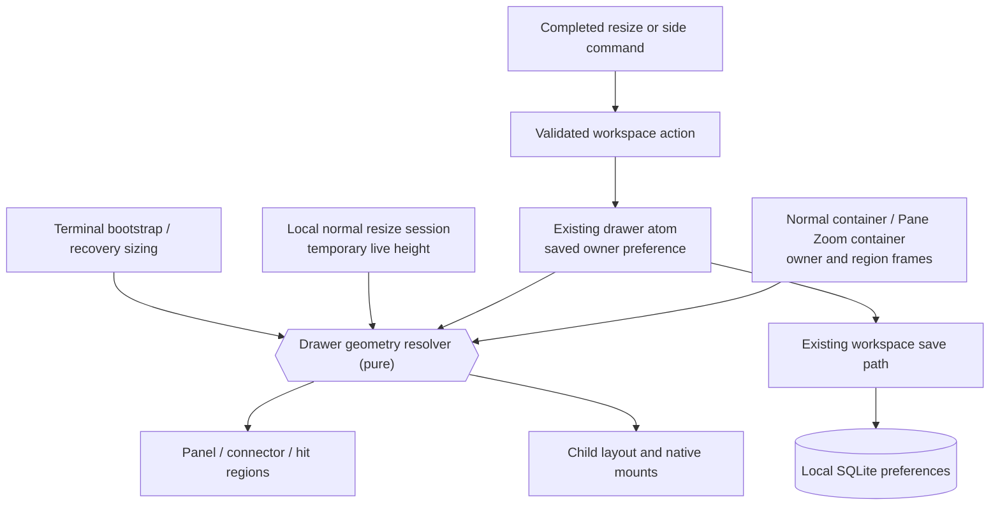
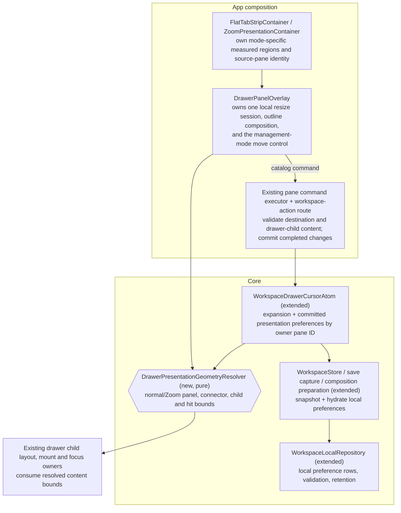
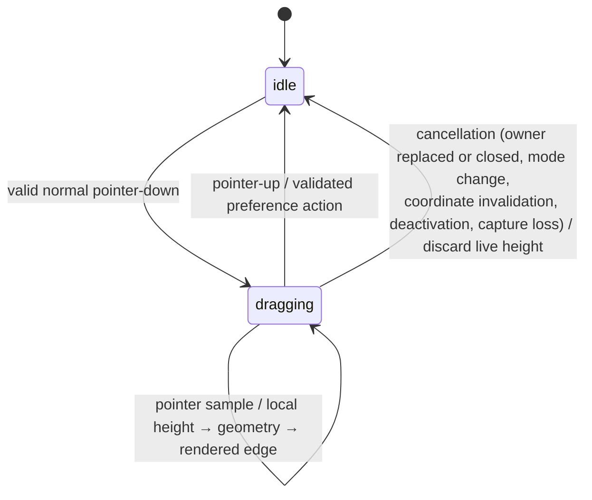
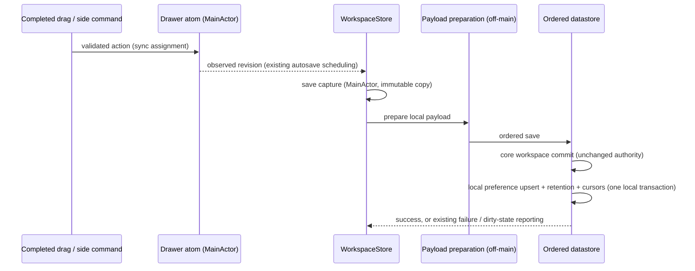
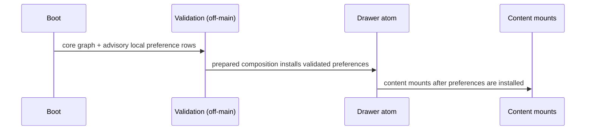
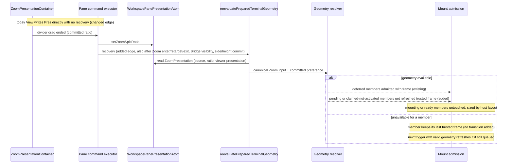

# Drawer Presentation — Program Design

[Requirements](./requirements.md) → [Specification](./specification.md) →
this structural design.

Keep the existing drawer and child hosts. Separate a pane's saved choices from
the rectangle currently available to display them. Both the visible overlay and
initial terminal sizing consume the same geometry policy; only the normal-mode
top handle owns a transient resize session.



Pane ownership, selected child, focus and terminal sessions remain separate.

## Existing constraints and the choices they leave

The current implementation has a global `drawerHeightRatio`, two copies of
overlay arithmetic, and one overlay composition used in normal mode and Pane
Zoom. Its normal resize gesture reports incremental changes from a default local
coordinate space and writes the global preference on every sample. The
[system analysis](../../wip/2026-09-13-drawer-bridge-system-analysis.md) separates
these observations from the unproven jitter and bottom-gap explanations.

Source anchors for the load-bearing paths:

- [DrawerPanel](../../../Sources/AgentStudio/App/Panes/Hosting/DrawerPanel.swift):
  `DrawerResizeHandle` owns the current gesture and reports deltas.
- [DrawerPanelOverlay](../../../Sources/AgentStudio/App/Panes/Hosting/DrawerPanelOverlay.swift):
  `body` reads global height, computes the outline and positions existing children.
- [ZoomPresentationContainer](../../../Sources/AgentStudio/App/Panes/Hosting/ZoomPresentationContainer.swift):
  the terminal/companion split sits above one common toolbar.
- [WorkspaceSurfaceCoordinator geometry](../../../Sources/AgentStudio/App/Coordination/WorkspaceSurfaceCoordinator+ViewLifecycle.swift):
  `resolveInitialFrames` and `resolvedDrawerContentRect` independently calculate
  drawer child bootstrap frames, including for collapsed/background drawers.
- [WorkspaceDrawerCursorAtom](../../../Sources/AgentStudio/Core/State/MainActor/Atoms/WorkspaceDrawerCursorAtom.swift)
  owns expansion; [WorkspaceStore](../../../Sources/AgentStudio/Core/State/MainActor/Persistence/WorkspaceStore.swift)
  observes explicit persisted fields and owns autosave/flush.
- [WorkspaceSQLiteDatastoreActor](../../../Sources/AgentStudio/Core/State/SQLite/WorkspaceSQLiteDatastoreActor.swift)
  commits core state before local state; journal mutations return after the core
  commit. [Undo snapshots](../../../Sources/AgentStudio/Core/State/MainActor/Persistence/WorkspaceUndoCloseSnapshot.swift)
  retain pane identities and content, but contain no external local preferences.

### Alternatives

Per-pane keys in UserDefaults would be a smaller storage change and would retain
the current technology. They would leave bootstrap/hydration and pane/undo
cleanup outside the workspace persistence path. A wholly new drawer store would
make those responsibilities explicit but introduce another save owner. The
selected design extends the existing drawer atom and workspace-local repository:
maintainers pay for a local schema addition and snapshot plumbing, while retaining
one workspace autosave/flush owner. No new atom, store, service or event bus is
introduced.

For geometry, patching the two existing calculations independently is credible
for the immediate gap fix, but leaves mode/connector/inset changes capable of
diverging again. One pure resolver earns its boundary because rendering and
terminal bootstrap are already distinct consumers. It owns rectangle arithmetic,
not drawer topology or native mount lifecycle.

For resizing, a native pan recognizer is a viable alternative if a stable
SwiftUI coordinate space cannot meet native pointer proof. Start with the
existing SwiftUI control, a fixed ancestor space and a drag-start model. This
avoids a second input bridge. A measured discrepancy between fixed-space pointer
motion and handle tracking would reopen that platform choice; source inspection
does not establish that the smaller repair already fixes the symptom.

## Owners and interfaces



**Committed preferences.** A `DrawerPresentationPreference` value contains a
normal height ratio and preferred Zoom side (`terminal` or `bridge`). The key is
the owning layout `Pane.id` within the current workspace, not the drawer child,
drawer instance, arrangement, worktree or focused responder. Recreating an empty
drawer on the same surviving pane therefore keeps that pane's presentation
choice. A different pane receives defaults.

Extend `WorkspaceDrawerCursorAtom` with related, equality-suppressed preference
values and a preference revision. Its methods only publish validated values and
maintain observation keys. Pure policy validates finite ratios and legal sides
before assignment; the atom performs no SQL, region calculation or lifecycle
policy. A read for a missing owner returns normal default `0.8` and terminal
side without inserting a row. Saved normal ratios retain the current `0.2…0.8`
range. Display clamping never changes the committed preference.

**Geometry.** `DrawerPresentationGeometryResolver.resolve` synchronously accepts
an immutable input: owner ID, mode, container bounds, owner content/toolbar
bounds, terminal and optional visible Bridge region, committed preference,
optional live normal height, and existing drawer metrics. It returns a
`DrawerPresentationGeometry` value or unavailable. The output names the effective
side, full outline, panel, connector, child-content and dismissal/hit bounds in
one container coordinate system. It creates no state and never requests Bridge.

The App containers supply measured geometry for the visible overlay. The
existing bootstrap/recovery caller (`resolveInitialFrames`,
`WorkspaceSurfaceCoordinator+ViewLifecycle.swift:826`) supplies canonical
geometry derived only from shared state, never from SwiftUI local state. Both
say whether the footer is already excluded. Normal hidden drawers keep their
residency/expansion-independent bootstrap calculation.

**Zoom input for bootstrap and recovery.** For a tab in Pane Zoom, the canonical
input is built from:

| Input | Owner (current source) |
| --- | --- |
| Terminal container bounds | `WindowLifecycleAtom.terminalContainerBounds` |
| Zoom source pane and committed split ratio | the tab's `ZoomPresentation` in `WorkspacePanePresentationAtom` (`sourcePaneId`, `transientSplitRatio`, written by `setZoomSplitRatio`) |
| Bridge region visible or hidden | the same `ZoomPresentation.viewerPresentation` plus the existing companion host-presence gate used by `ZoomPresentationContainer.resolveRenderState` |
| Divider width | the Zoom `SplitView` divider metric, promoted from its private constant to a package layout metric so paint and bootstrap share one value |
| Footer height | `DrawerLayout.iconBarFrameHeight`, the metric bootstrap already uses |
| Committed drawer preference | the extended drawer atom |

During an unfinished divider drag the visible expanded drawer follows SwiftUI's
live local split, as today; its hosted children are laid out by that same pass.
Bootstrap/recovery serves collapsed, background and not-yet-mounted drawer
children and uses the committed ratio. A missing container bounds value or an
unready Bridge host yields unavailable geometry or the terminal-side fallback
respectively; unavailable geometry keeps the existing `.deferredGeometry`
admission (`PreparedTerminalMountAdmissionPort.installTrustedInitialFrames`).

**Recovery triggers.** Existing recovery (`reevaluatePreparedTerminalGeometry`)
already runs after container-bounds layout and after resize, minimize, expand,
arrangement and drawer-toggle actions. Zoom changes currently skip it. Add the
same call, through the existing pane command executor, after: Zoom enter,
retarget and exit (`applyZoomCommand`); a committed split ratio; a Bridge
visibility change in Zoom; and a committed drawer side or normal height. The
split-ratio commit moves from the view writing the atom directly
(`ZoomPresentationContainer.persistSplitRatio`) to a container callback that the
executor handles — atom write, then recovery — matching `resizePane`. No new
observer, registry, atom, bus event or timer is added; each trigger is an
existing discrete action. The recovery pass reads current shared state, so a
trigger that arrives after a newer change recomputes from the newer state.

**Frame currency for queued children.** Recovery today only re-admits children
held in `.deferredGeometry` (`PreparedTerminalMountAdmissionPort.acceptLaterTrustedFrames`);
a child already given a trusted frame keeps it through `.pending`, claim and
activation (`claimPreparedTerminal`, `activateClaimedTerminal` read the frame
installed or captured earlier). A drawer child queued with a normal-mode frame
would therefore mount at that size after the user entered Zoom or moved the
drawer. The port — the existing owner of trusted frames — gains one more
operation in the same contract: refresh the trusted frame of members still in
`.pending` custody, or claimed but not yet activated, from a recovery pass.
Claim and activation read the port's current frame for the member at the moment
of use instead of a copy captured earlier. Members that have started mounting,
are ready, failed or were replaced are not touched; their size is owned by
host layout. The three outcomes of a recovery pass are therefore:

| Member custody | Recovery effect | Owner |
| --- | --- | --- |
| `.deferredGeometry` | admitted with the new frame (existing) | admission port |
| `.pending`, or claimed for a first attempt that has not been activated | trusted frame refreshed (added) | admission port |
| claimed for a retry (a previous attempt was activated and returned a retryable failure) | none; a retry keeps the frame of its first activation (existing same-frame retry contract) | admission port |
| mounting, ready | none; the host view is sized by layout from the resolver's current output, and the terminal runtime receives the actual size through existing native size feedback | host layout |

A drawer child that becomes mounted while the user drags the Zoom divider gets
its creation frame from the committed ratio; its host is laid out inside the
visible overlay from the live resolver output before first display, so the
first displayed size matches the overlay. This is stated behavior with its own
proof below, not an exemption.

**Commands.** Add `moveZoomDrawerToTerminal` and `moveZoomDrawerToBridge` through
the existing `AppCommand` catalog. Their display and invocation
contexts derive the owning pane from the active Zoom source, even when focus is
inside a child or companion.

**Move control.** While Pane Zoom is showing an expanded drawer and the existing
management layer is active (`atom(\.managementLayer).isActive`, the same signal
`ZoomPresentationContainer` uses for its management chrome), `DrawerPanelOverlay`
renders one move control on the drawer outline. It projects whichever side
command moves the drawer to the other region through the existing command
display pipeline (`AppCommandSpec` → `CommandDisplayDescriptor` →
`ControlTooltipSource`), so its label, icon and tooltip come from the catalog,
and it dispatches through the same targeted command action as other catalog
controls. It is not shown in normal mode or outside management mode. The command
bar and IPC reach the same two commands. The existing pane executor dispatches a typed
`setDrawerZoomSide` workspace action with owner ID and side; validation rejects a
stale/non-Zoom owner before mutation. Repeating the same side is an equal write.
The side action changes neither expansion nor focus, and does not create a
drawer or open Bridge. Controls are unavailable without the source's existing
drawer. The Bridge-side preference may be selected while that region is hidden;
effective placement still follows the specified terminal fallback.

**IPC classification (amended 2026-09-23 for merged Agent IPC v2 R-13).** The
merged exhaustive projection (`App/Commands/AppCommand+IPCProjection.swift`) has
no interactive-only class: every `AppCommand` declares an exposure, execution
mode, privilege and target kind, and debug builds execute every command through
typed `command.execute`. Both side commands join their drawer siblings
(`toggleDrawer`, `addDrawerPane`) exactly: exposure `.debugTesting`, execution
mode `.headless`, privilege `.layoutMutate`, argument variant `.drawerParent`
(`IPCDrawerParentCommandArguments`: window identity plus parent-pane selector),
and the siblings' allowed handle kinds `.window` and `.pane`. No new handle kind
is added. The durable target is the owning pane, not a Zoom presentation object; the existing `setDrawerZoomSide`
validation rejects an owner that is not the current Zoom source, so a stale or
non-Zoom handle fails before mutation with the ordinary validation error.
Widening exposure beyond debug is a program-level authority decision
(workstream "IPC control surface"), not part of this slice. No new
Bridge IPC and no new transport method are added here.

## One calculation for each presentation

### Normal drawer

Preserve the current tab-relative width and owner-relative horizontal anchor.
Derive the available bottom from the owner's content and measured toolbar once.
Use the saved ratio, or live resize height, subject to the existing height limits
and physically available space. Connector space is included when deciding
whether a complete outline fits. Child padding and resize-handle height are
subtracted from the panel exactly once.

If the region is too small to accommodate valid child bounds, return unavailable
instead of synthesizing a positive size outside the available region. A narrow
window can temporarily show a smaller bounded panel; that display result does
not replace the saved ratio. This is safe geometry admission, not a new normal
drawer layout model.

### Pane Zoom drawer

Let `region` be the visible chosen content region, already excluding the common
bottom toolbar. A missing Bridge region selects terminal as the effective side
while retaining `preferredSide = bridge`. A visible Bridge error/empty-state
region still counts as a region.

```text
outline width  = 0.97 × region width
outline height = 0.85 × region height
outline center = region horizontal center
outline bottom = region bottom
panel height   = outline height − connector height
```

The selected 3% total width reduction lies within R-DP-3's 2–5% range, giving a
1.5% gutter on each side. These are geometry/paint metrics, not user settings.
The connector keeps the existing arc treatment and nominal height where it fits;
its bottom anchor is centered within the effective region and constrained to
the outline. It never stretches back across the divider to the terminal owner.
The complete outline leaves the upper 15% exposed. No footer deduction follows.

There is no resize handle or resize hit region in Zoom. The noninteractive top
padding may retain the normal border thickness, but must not retain an invisible
gesture. A split/window/Bridge-visibility change recomputes all output rectangles
from the current input. The existing child layout then partitions the returned
content rectangle; no alternate child grid is introduced.

## Stable normal resizing

The existing top handle measures pointer Y in the fixed `tabContainer` ancestor
space rather than its own moving bounds. `DrawerPanelOverlay` owns an idle or
dragging session containing owner ID, mode, initial displayed height, initial
pointer position, and the geometry context that made those values valid.

During ordinary unconstrained motion, height is the drag-start displayed height
minus cumulative pointer displacement. It is never previous rendered height plus
a cumulative translation. At a size bound, rebase the local pointer/height pair
to the clamped result; reversing direction then moves the edge immediately
instead of spending motion on overshoot. Rebasing changes only the local session.



Owner replacement/close, mode change, ancestor-coordinate invalidation, window
deactivation or loss of gesture capture cancels the session. No delayed end
callback may commit to another owner or a newer session. A completed gesture
commits one validated owner-specific ratio through the typed
`setDrawerNormalHeightRatio` workspace action. Cancellation restores the committed
choice. The overlay must observe gesture cancellation/lifecycle reset as well as
normal pointer-up; `onEnded` alone is not a complete termination contract.

Per-frame state stays local to the overlay. No per-frame preference, workspace
save, bus message or debounce task is emitted. AppKit layout continues reporting
actual terminal size to the existing terminal runtime.

## Save, restore and undo

Use a new `local_drawer_presentation` row projection keyed by
`(workspace_id, owner_pane_id)`
with normal ratio and preferred side. It belongs to `WorkspaceLocalRepository`,
separate from `replaceCursorRows`' delete-and-reinsert table set. The persisted
row type is distinct from the live preference value.

Extend the existing save capture/bundle and prepared composition with local
presentation values. `WorkspaceStore` observes the committed preference revision;
save capture copies values on MainActor, preparation/validation stays off-main,
and the datastore writes through its existing persistence ordering. Hydration
installs validated preferences before content mounts and persistence observation.
The normal shutdown flush includes the current committed choices.





**Undo retention.** Closing an owner does not immediately remove its preference
from live memory or local SQLite. At each ordinary local save/load, the datastore
derives the retention set from live core pane IDs plus pane members of available
undo records, using the existing core journal. Local writes merge current
preference values and remove only rows outside that set. Hydration retains values
for those undo members too, so restoring the same pane needs no preference fields
inside the core undo payload. A later save after expiry/discard removes orphaned
rows; an inactive workspace may retain them until next load. No timer or separate
cleanup worker is introduced.

Retention queries and the local transaction run within the existing ordered
workspace persistence operation, so close/restore cannot interleave between
computing membership and pruning. If membership cannot be established, do not
prune. Report the local save failure through the existing path. The existing
core-first close acknowledgment remains unchanged: local presentation failure
must not turn an already committed close into a different content result.

The in-memory map may keep a retired owner until the next composition reload;
reads/writes require a live owner and persistence filters against the authoritative
retention set, so those entries cannot resurrect a pane. The map is reset on
workspace composition replacement. This session-lifetime residue avoids adding
new topology notifications solely to reclaim two preference fields.

**Global preference cutover.** Local migration 015 only creates the
`local_drawer_presentation` table. The legacy import is a one-time boot data
step outside the migrator, run after local migrations; the presence of the
legacy global-height key is its pending marker. When the key holds a finite
value, the step captures the persisted owning panes across existing workspaces
from core, then inserts the clamped legacy ratio with terminal side for each of
them in one local transaction (`INSERT OR IGNORE`, so a row an ordinary save
already wrote is kept); new panes use `0.8`. The key is removed only after that
transaction commits. If owner enumeration or the write fails, nothing is
written, the key is kept, and the next boot tries again; local database opening
is unaffected. After the import there is one read/write path: local
preferences. Both runtime global-height readers are removed; the key is never a
runtime fallback. No conditionally registered migration, old/new runtime mode,
or durable core/undo-payload migration is introduced.

## Changed paths and preserved boundaries

**Normal drag:** replace `DrawerResizeHandle → delta callback → @AppStorage`
with `fixed-space handle → local resize session → geometry`, followed by one
completed-choice workspace action. The changed state write is owner-specific;
existing child mounts and native size feedback remain intact.

**Render and bootstrap:** replace arithmetic inside `DrawerPanelOverlay` and
`resolvedDrawerContentRect` with the shared resolver. Container measurement and
canonical bootstrap frame derivation remain authoritative inputs. Add the Zoom
input above; preserve existing unavailable-frame deferral and add the Zoom
recovery triggers. Hit/dismissal rectangles come from the same result as paint.



**Zoom side:** there is no current side-preference predecessor. Add catalog
commands → existing pane executor → validated workspace action → drawer atom.
Geometry derives effective placement. There is no edge to Bridge source updates,
terminal CWD, child reparenting, or WebKit construction.

**Persistence:** replace global preference writes with the existing observed
workspace capture and local write path. Extend local save/load projections and
add local preference retention using existing core IDs/undo records. Keep core
graph transactions, journal acknowledgment, undo identity, and child lifecycle
unchanged. No SQL or I/O enters the drawer atom or view.

## Failure and overlap behavior

- **Invalid saved values:** reject non-finite ratios and unknown side encodings;
  use the field's deterministic default. Stale owner rows do not create panes.
  Local database unavailability retains the existing advisory-memory fallback;
  normal saved-choice behavior is verified with a functioning local store.
- **Local save failure:** keep current live choices and use existing dirty/error
  reporting and later autosave/flush behavior. Do not add a retry loop. An already
  committed core operation is not rolled back because its local memory failed.
- **Preference change during save:** immutable captures carry a presentation
  revision. Completion can acknowledge only that captured revision; a newer live
  preference remains dirty and is included in a subsequent save/normal shutdown
  flush. This extends save accounting only for the new local payload.
- **Owner closes during drag:** session cancellation prevents a late commit;
  the last committed choice remains eligible during existing undo availability.
- **Bridge disappears:** recompute effective terminal placement. Retain saved
  Bridge choice; showing Bridge again recomputes placement without a write.
- **Bounds are invalid or too small:** yield unavailable geometry and preserve
  preferences/content. Existing admission defers only members that have no
  trusted frame yet (`installTrustedInitialFrames` → `.deferredGeometry`).
  A member that already holds a trusted frame keeps it when current geometry is
  unavailable. The design adds no queued→deferred transition and no claim
  revocation: the activation scheduler treats a rejected queued claim as a
  terminal failure (`TerminalActivationScheduler`), and an issued claim cannot be
  cancelled. The next trigger with valid geometry refreshes that member if it is
  still `.pending` or claimed for its first attempt (valid → unavailable → valid).
  If it activates while geometry is unavailable, it mounts at its last valid
  frame and host layout then sizes it from the resolver's current output
  through native size feedback. This is the "existing safe geometry admission
  behavior" that R-DP-6 names as the baseline for unavailable bounds. It is
  reachable only when container bounds exist but the drawer region cannot hold
  valid child bounds (a very small window), and S8 observes it natively.
- **Footer metric disagrees with measurement:** paint uses the measured footer;
  bootstrap uses `DrawerLayout.iconBarFrameHeight`. A mismatch is a defect caught
  by the V-DP-6 native agreement proof, not a runtime correction path.

## Proof and structural enforcement

All proof uses the production resolver and persistence owners. Pure geometry
and resize-policy scenarios can use value inputs; native gesture/edge behavior
requires a real AppKit/SwiftUI composition. Persistence proof uses real local
SQLite plus core close/undo membership. Clocks may be injected for existing
autosave scheduling; replacing the database or gesture system would hide the
interaction under test.

- **U-BN-08 → R-DP-1 → V-DP-1/V-DP-2:** fixed-space session, completed commit and
  per-owner preference. Prove monotonic motion, bound reversal, cancellation,
  independent heights, normal/Zoom return and ordinary restart.
- **U-BN-09 → R-DP-2 → V-DP-3:** mode-specific resolver and handle-free Zoom panel.
  Native outline/connector/footer evidence proves top exposure and absence of
  resize hit targets.
- **U-BN-10 → R-DP-3/R-DP-4 → V-DP-3/V-DP-4:** region input, saved/effective side
  distinction and validated commands. Prove 70/30 splits, child/Bridge focus,
  hidden/restored Bridge, side persistence and normal-mode command exclusion.
- **U-BN-11 → R-DP-1/R-DP-3–R-DP-6 → V-DP-2/V-DP-5:** stable owner key and retained
  child hosts/undo identity. Prove close/autosave/undo and restart without
  reparenting, terminal recreation or loss of the normal Bridge-owned drawer.
- **U-BN-12 → R-DP-2/R-DP-6 → V-DP-3/V-DP-6:** shared geometry output reaches paint,
  child sizing and hit/dismissal consumers. Prove measured and bootstrap paths,
  collapsed/background drawer admission, later recovery of unavailable bounds,
  and recovery after each Zoom trigger: enter/exit, a finished divider drag at
  unequal ratios, Bridge hide/show, and a side change. Hold an already-framed
  pending drawer child across normal→Zoom and a side/split change with a causal
  barrier, release its claim, and assert the frame actually supplied to
  mounting is the current Zoom frame; separately, a child mounting during a
  divider drag shows the overlay's size at first display. The existing
  unavailable→valid case stays its own proof.
- **Performance (owner rule 2026-09-23: nothing heavy on the MainActor; review caution):** marker-scoped
  measurement of the overlay's body/read counts and synchronous MainActor
  held time during normal drag and divider drag under the current workload;
  `DrawerPanelOverlay.expandedPaneInfo` composition is inside that measurement.

Types separate committed preference, transient gesture and derived geometry.
Runtime validation enforces valid owners/modes/bounds; the local schema enforces
unique owner keys; persistence ordering protects retention; native/integration
evidence verifies relationships types cannot establish. Module/import and command
catalog rules remain enforced by the existing architecture checks.

Use marker-scoped pointer Y, resolved panel-top Y and geometry-mode observations
to test the suspected feedback path under real load. Do not export paths,
content or raw pane IDs. The hot path is fixed-size geometry and local view state;
no SQL, filesystem, repository joins or scheduling runs per pointer sample.
Existing shared command controls carry accessible names and command availability.
Zoom omits the resize accessibility/input target as well as its visible handle.

**Drawer child content.** A drawer child is a terminal or a browser. The pure
content check (`PaneContent` kind ∈ {terminal, webview}) runs where drawer
children are admitted: the existing `ActionValidator` cases that create or insert
drawer children, and the IPC drawer-creation adapter owned by the IPC control
workstream. A refused request creates no pane and returns the existing
validation failure. Current creation paths already construct only terminals
(`addDrawerPane`, `insertDrawerPane`) and browsers (`executeAddWebviewDrawerPane`),
and drag is container-internal, so no existing content is migrated or deleted.
The graph atom keeps accepting any `PaneContent`; the rule lives at admission,
not in the atom.

Bridge source switching, navigation IPC and multi-repo membership remain outside
this design.
