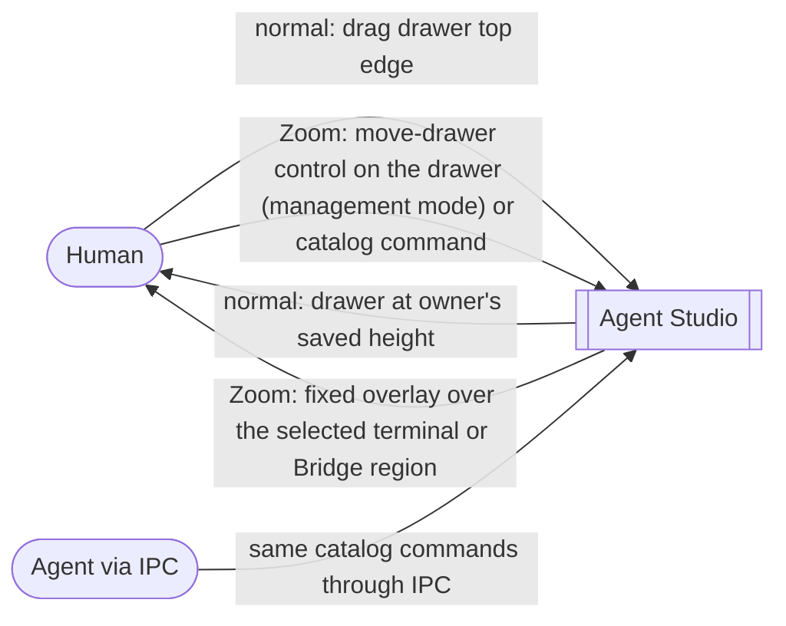
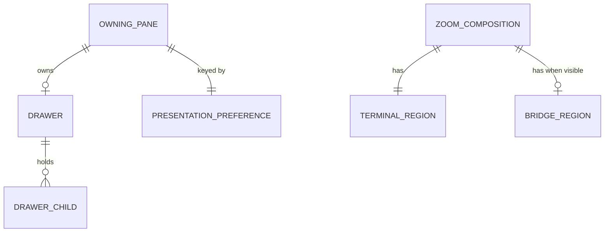

# Drawer Presentation — Specification

Governing needs: [Requirements](./requirements.md). Source context:
[system analysis](../../wip/2026-09-13-drawer-bridge-system-analysis.md).

The rules below capture the selected drawer behavior, including the owner's
explicit first-side and hidden-Bridge choices D-DP-1/D-DP-2.

## Observable model

Bridge source selection, multi-worktree membership and file-open IPC are outside
this slice.

## Entities

| ID | Term | Identity | Relationships | Invariants | Observable states |
| --- | --- | --- | --- | --- | --- |
| E-DP-1 | Owning pane | The workspace pane that owns a drawer; the same pane across arrangements, tabs and ordinary restart | owns 0..1 drawer (E-DP-2); has exactly 1 presentation preference (E-DP-3) | Changing mode, side, arrangement or focus never changes which pane owns the drawer | open, closed (undo-restorable), restored |
| E-DP-2 | Drawer | The supporting container attached to one owning pane | belongs to 1 E-DP-1; holds 0..n drawer children (E-DP-5) | Moving or resizing the drawer never reparents children | expanded, collapsed |
| E-DP-3 | Drawer presentation preference | Keyed by the owning pane, not by the drawer instance, arrangement, worktree or focused responder; a drawer recreated on a surviving owner reuses it | belongs to 1 E-DP-1 | Normal height and Zoom side are independent values; display clamping and hidden-Bridge fallback never overwrite them | normal height: unset or a saved height; Zoom side: terminal (initial) or Bridge |
| E-DP-4 | Zoom region | The terminal (left) or Bridge (right) region of a Pane Zoom composition | 1 Zoom composition has 1 terminal region and 0..1 visible Bridge region | The Bridge region may be hidden; the terminal region always exists in Zoom | visible, hidden (Bridge only) |
| E-DP-5 | Drawer child | One pane inside a drawer | belongs to 1 E-DP-2 | Content is a terminal or a browser; never Bridge or code viewer | running, collapsed with its drawer, closed (undo-restorable) |

## R-DP-1 — Normal resizing

In normal mode, the drawer MUST retain top-edge height resizing and MUST NOT
add left/right-edge resizing. Within available size bounds, monotonic pointer
movement MUST NOT produce uncommanded edge reversal, oscillation, or runaway
height changes. Reversing direction at a bound MUST produce predictable tracking.

The chosen normal height MUST be associated with its owning pane. Changes to
pane A's normal drawer MUST NOT overwrite pane B's height. Entering/exiting Pane
Zoom MUST NOT overwrite the saved normal height. This includes drawers owned
by normal Bridge tabs.

The saved normal height MUST survive ordinary application shutdown/restart when
the same owning pane is restored. Returning from Zoom alone is not sufficient
evidence of saved-preference restoration.

Basis: U-BN-08, U-BN-11. Proof: V-DP-1, V-DP-2.

## R-DP-2 — Fixed full-screen shape

In Pane Zoom, the drawer MUST expose no resize handles or invisible resize hit
targets. Its full outline, including the connector, MUST occupy the intended
lower portion of the selected content region, leaving approximately 15% visible
above it. The shared bottom toolbar is outside that content region and MUST NOT
be subtracted a second time as an unintended gap.

The 15% is exposed underlying content above the complete overlay, not a panel
height ratio to which another connector offset is subsequently added. Shadows
may soften its visual boundary; native visual evidence establishes the result.

Basis: U-BN-09, U-BN-12. Proof: V-DP-3.

## R-DP-3 — Width and placement

The drawer MUST fit the actual selected terminal or Bridge region. Its width
MUST be 95–98% of that region's width, with no 50% minimum relative to the whole
workspace. The overlay MUST be horizontally centered within that region so the
gutter is visible on both sides; no user-adjustable horizontal position is added.

When the terminal/Bridge divider or window size changes, the overlay MUST remain
within the selected region's usable bounds and retain the width reduction.
Temporary display clamping MUST NOT rewrite a saved normal height.

Basis: U-BN-10, U-BN-11. Proof: V-DP-3, V-DP-4.

## R-DP-7 — Zoom split bounds (owner, 2026-09-25)

In Pane Zoom the terminal/Bridge split defaults to 40% terminal / 60% Bridge.
The terminal region MUST stay within 30–60% of the split width and the Bridge
region within 40–70%. Dragging stops at those bounds, resetting the divider
returns to the default, and a stored ratio outside the bounds is clamped when
restored. With these bounds the tiny-region case of R-DP-6 no longer arises
from dragging.

## R-DP-4 — Side commands

Two commands MUST place the full-screen drawer over the terminal or Bridge
region. A visible move-drawer control MUST appear on the drawer itself as an
overlay while management mode is active in Pane Zoom; it invokes the same
commands. The commands MUST also be reachable through the command bar and IPC
like every other catalog command. No move control is presented outside Pane Zoom.
Invocation MUST target the Zoom source pane's drawer, even when a drawer child
or Bridge currently has focus. The commands MUST NOT create a different drawer,
change terminal CWD, or alter Bridge's selected Git source.

The initial saved side MUST be terminal. An explicit side command MUST update
the saved preference for the owning pane. If the saved Bridge side has no
visible region, the overlay MUST temporarily use the terminal region without
changing that saved preference; showing Bridge again MUST restore the saved
Bridge-side placement. Command names, copy, icons and exposure MUST follow the
existing command-spec system.

The saved side MUST survive ordinary application shutdown/restart when the same
owning pane is restored. If Bridge is initially hidden after restoration, the
terminal fallback MUST preserve the restored Bridge-side preference.

Basis: U-BN-10, U-BN-11. Proof: V-DP-4.

## R-DP-5 — Preserve content and ownership

Moving the overlay or its visual connector MUST preserve the drawer's parent,
child membership, child layout, running work, and existing content state. Normal
Bridge-owned drawers MUST remain available.

A new drawer child MUST be a terminal or a browser. Bridge and code-viewer
content MUST NOT be added to a drawer through any path — interactive action,
command, drag, or IPC — and an attempt MUST be refused without creating a pane.
Existing content is not migrated or deleted by this slice; no current path
creates Bridge or code-viewer drawer children.

Existing collapse/dismissal, child close/undo and child navigation semantics
MUST remain intact. Outer presentation changes MUST NOT invent a new child grid
or right-side content switcher.

Basis: U-BN-11, U-BN-07 and S-DP-23c. Proof: V-DP-5.

## R-DP-6 — Geometry consistency

Visible overlay bounds, connector, native child-content size, and hit/dismissal
regions MUST agree in both modes. The connector MAY move with the full-screen
overlay without changing the drawer owner. No geometry consumer may present a
stale normal-mode size as the current full-screen drawer size.

Invalid or temporarily unavailable layout bounds MUST NOT produce negative or
non-finite child sizes or persist corrupt preferences. The existing safe
geometry admission behavior remains the baseline for unavailable native bounds.

Basis: U-BN-12, U-BN-11. Proof: V-DP-3, V-DP-6.

## State transitions

| Situation | Observable outcome |
| --- | --- |
| Open normal drawer | Use that owner's saved normal height, with display bounds applied. |
| Resize normal drawer | Track pointer predictably; retain the owner's resulting height independently. |
| Enter Zoom with a visible drawer | Use fixed full-screen geometry; retain the same owner/children. |
| First full-screen open | Terminal side; later explicit choices are remembered per owning pane. |
| Select another visible side | Move the overlay/visual anchor; remember the selected side independently of normal height. |
| Bridge content unavailable but its region remains visible | The region remains a placement region. Moving the drawer does not repair or change Bridge's data source. |
| Selected Bridge region is hidden | Temporarily use terminal and retain the saved Bridge-side preference. Do not auto-open Bridge. Return to Bridge-side placement when its region is shown again. |
| Leave Zoom | Recover normal presentation and owner-specific normal height. |
| Restore the same panes after ordinary application restart | Recover each pane's saved normal height and Zoom side independently; apply hidden-Bridge fallback without changing the restored preference. |
| Collapse drawer | Hide supporting content through the existing lifecycle; do not delete children. |
| Owner closes | Use existing close/undo semantics; a geometry change does not add another content owner. |

## Examples

- With a 70/30 terminal/Bridge split, a drawer over Bridge uses 95–98% of the
  30%-wide region. It does not expand to half the workspace.
- Resizing A's normal drawer, moving it to Bridge's side in Zoom, and returning
  to normal recovers A's chosen normal height. B's normal height is unaffected.
- A Bridge tab in a normal arrangement retains its own drawer and top-edge
  resizing. It is not treated as the transient right-hand Zoom companion.

## Coverage and proof

| Need | Problem/outcome | Requirement | Observable contract | Evidence |
| --- | --- | --- | --- | --- |
| U-BN-08 | Shared/jittery normal height → reliable owner-specific sizing | R-DP-1 | Normal resize and mode return | V-DP-1 native monotonic drag/reversal/clamp trace; V-DP-2 independent saved owner heights across mode changes and ordinary app restart |
| U-BN-09 | Ordinary resize rules in Zoom → fixed contextual overlay | R-DP-2 | Full-screen shape | V-DP-3 native geometry/visual capture including absence of resize hit targets |
| U-BN-10 | One tab-wide position → selected-region overlay, easy to move | R-DP-3, R-DP-4 | Width and side selection | V-DP-4 actual unequal splits; the on-drawer control in management mode and the command-bar/IPC commands, each targeting the Zoom owner with terminal, drawer-child and Bridge focus; no control outside Zoom; saved side across ordinary app restart, including initially hidden Bridge and its later return |
| U-BN-11 | Presentation changes risk coupled state → same supporting work | R-DP-1, R-DP-3–R-DP-6 | State transitions and preservation | V-DP-2 per-owner memory, including a drawer recreated on a surviving owner; V-DP-5 real child ownership, focus, close/undo, Bridge-owned drawers, and refusal of Bridge/code-viewer drawer children through each admission path |
| U-BN-12 | Inconsistent geometry/gap → coherent outline and content | R-DP-2, R-DP-6 | Geometry consistency | V-DP-3 visible panel/connector/footer; V-DP-6 bootstrap/recovery child sizing and hit/dismissal bounds |

The normal drag test must observe actual input and rendered edge movement;
arithmetic-only tests do not prove SwiftUI gesture behavior. Applicable
[marker-scoped performance proof](../../architecture/observability/observability_and_traceability.md#manual-and-stress-verification)
remains required. No implementation pass or jitter-cause proof is claimed here.
