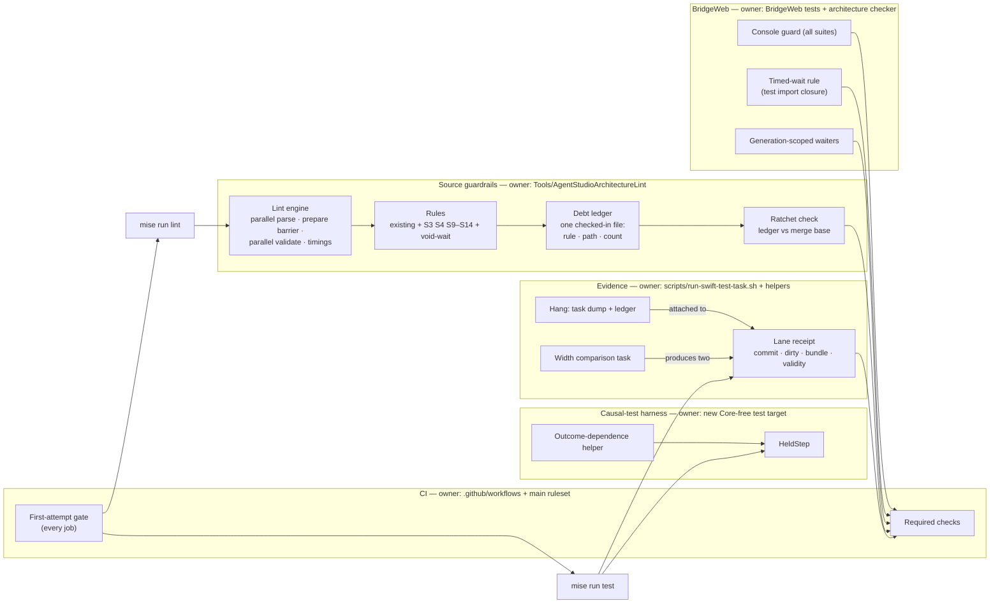
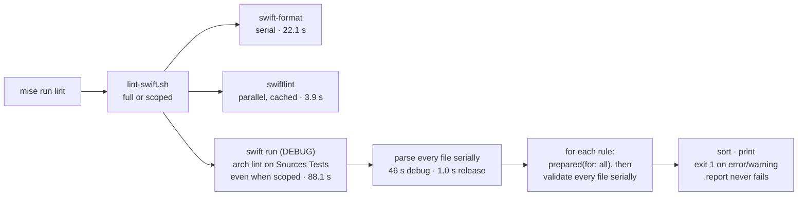
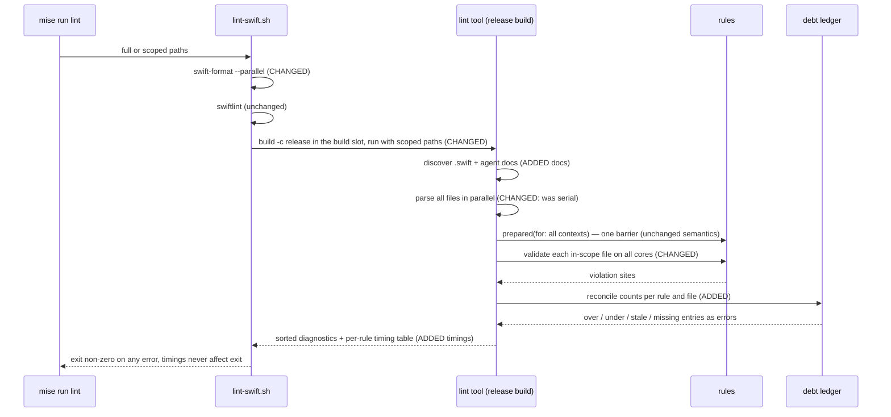
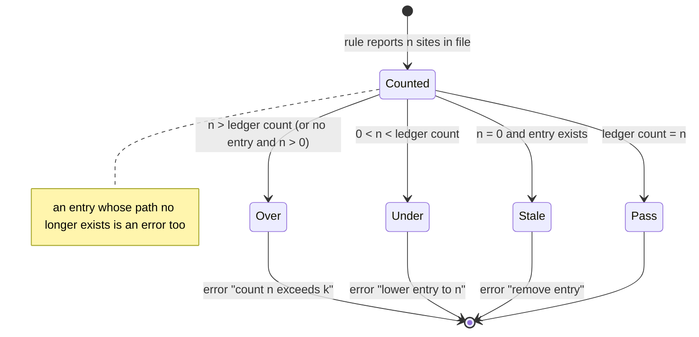
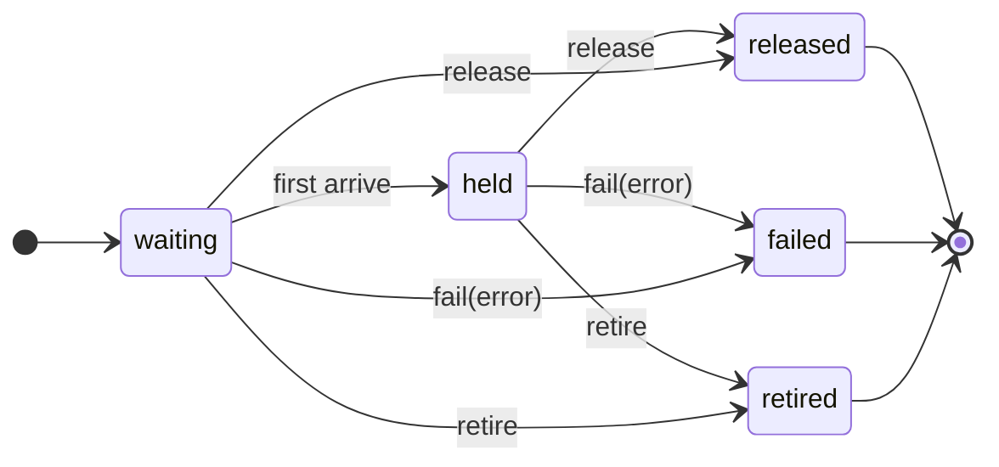
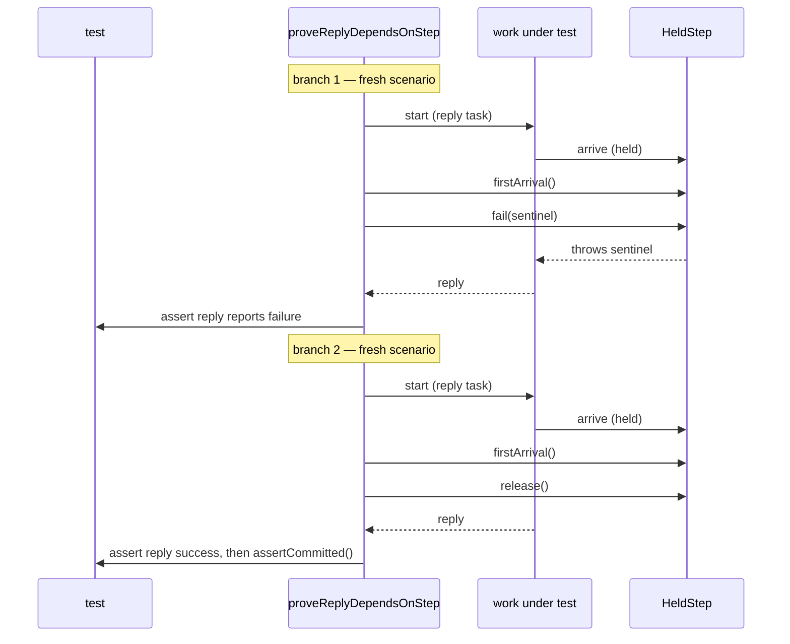
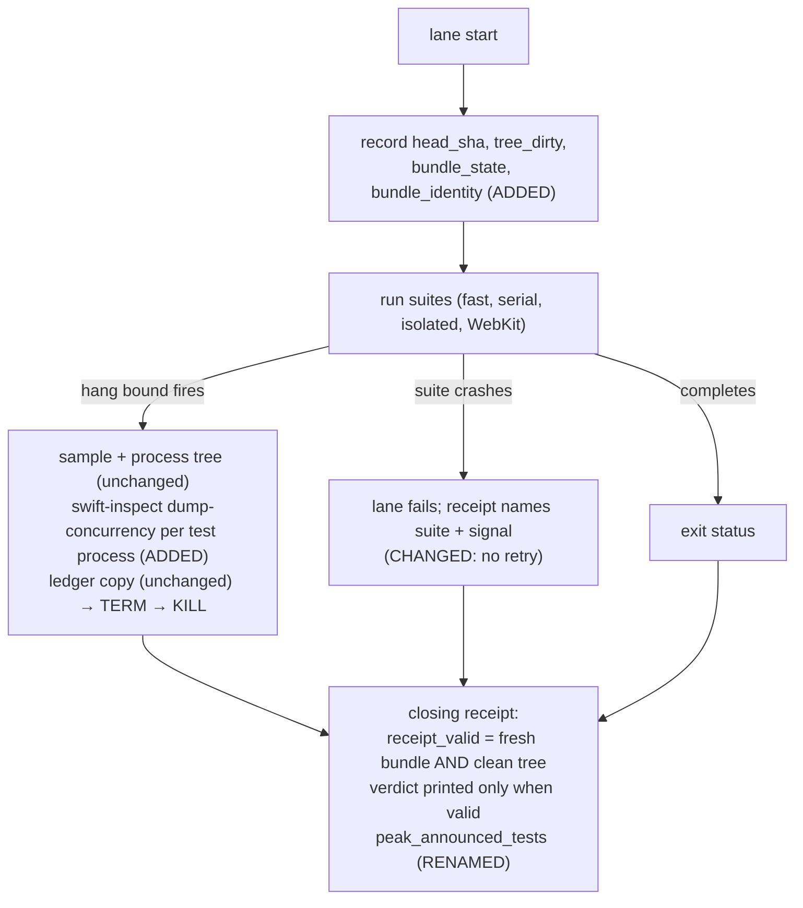

# CI and MainActor Guardrails — Program Design

How the repository realizes the [Specification](2026-09-23-ci-guardrails-specification.md), which realizes the
[Requirements](2026-09-23-ci-guardrails-requirements.md).

```text
Requirements  ->  Specification  ->  Program Design (this file)
```

## How the pieces fit



Seven owners, each with one reason to change:

| Component | Owns | Consumers | Changes when |
| --- | --- | --- | --- |
| Lint engine (`ArchitectureLintCommand` and its runner) | File discovery, parsing, rule scheduling, diagnostic rendering, timings, scoped mode | `scripts/lint-swift.sh`, lint tool tests | Parsing or scheduling strategy changes |
| Rules (`Rules/*`) | One predicate per guardrail; named-owner allowlists in `ArchitectureAllowlists` | The engine | A mistake shape or its owners change |
| Debt ledger + ratchet | Permitted counts per rule and file; the only-decrease invariant | Engine (reconciliation); CI ratchet step | Debt is paid down |
| Causal-test harness (new target `AgentStudioTestHarness`) | `HeldStep`, the outcome-dependence helper | Every Swift test target | The harness contract changes |
| Evidence (Swift runner scripts) | Receipt fields, hang evidence, width comparison, no in-lane retry | `mise run test:*`, CI | Lane topology or receipt fields change |
| CI (`.github/workflows`, `main` ruleset) | First-attempt gate, required checks | Owner merge decision | Job set changes |
| BridgeWeb guardrails | Console guard, hang-bound declarations, timed-wait rule, generation-scoped waiters | BridgeWeb suites, `pnpm run check` | BridgeWeb test topology changes |

## Current system and what changes

### Lint run today



Anchors: `scripts/lint-swift.sh:7-14` (always `Sources Tests`, even when scoped, `:80`),
`Tools/AgentStudioArchitectureLint/Sources/AgentStudioArchitectureLintCore/ArchitectureLintCommand.swift:77-100`.
Every rule is a `Sendable` struct with `let` fields whose `validate` builds its own visitor, so per-file validation is
safe to run concurrently. Two rules override `prepared(for:)`: `ProductAtomBoundaryRule` (atom owner index) and
`TestPollingWaitRule` (baseline path existence). `ArchitectureLintContext.location(for:)` rebuilds a line table per
diagnostic.

### Lint run after this change



| Edge | Status | Consequence |
| --- | --- | --- |
| `swift run` debug build of the tool | changed → release build, same build slot | 88 s → ~11 s single-threaded before parallelism; one cold release compile (139 s measured) per slot |
| serial parse and rule loops | changed → parallel map over files | 11.2 s → an estimated 1–2 s on 16 cores and about 4 s on the 3-core runner; measured in proof |
| scoped mode lints `Sources Tests` | changed → parse all (for `prepared` indexes), validate only scoped files | Same diagnostics for those files as a full run (R13) |
| `.report` severity | removed | No guardrail can be report-only (R5) |
| per-file debt lists compiled into `ArchitectureAllowlists` | removed → ledger file | Counts, not presence; diffable against the merge base |
| per-diagnostic line table | changed → one converter per file, built lazily | Removes a cost proportional to diagnostics |
| rule order and output sorting | intentionally unchanged | Output stays deterministic under parallelism |

### Selected structure and alternatives

| Crux | Chosen | Rejected, and why | Revisit when |
| --- | --- | --- | --- |
| Lint speed | Release build + parallel per-file validation in the existing engine | One shared visitor walking each tree once for all rules — larger rewrite of 32 rules; only needed if R11 is still missed after parallelism | Measured architecture stage > 5 s on the reference Mac |
| Debt format | One ledger file (`rule`, `path`, `count`) read at lint time | Keep Swift arrays — cannot express counts cheaply and cannot be diffed against the merge base without compiling | — |
| Discarded completion handle (S3) | Type system: the 14 task-returning operations become `async` functions, so an outcome exists only after completion and a synchronous caller cannot obtain one; a declaration-only lint rule forbids new task-returning functions in `Sources` | Lint call-site rule over a name index (needs three renames, name-based); compiler `-Werror` group (Swift 6.3.3: `unknown warning group` for `NoUsage`, probe 2026-09-23); `treatAllWarnings(as: .error)` (the build still has `ActorIsolatedCall` warnings) | A future need to return a cancellable handle; that gets a named handle type whose outcome is still only `async` |
| Harness home | New Core-free target `AgentStudioTestHarness` | Put it in `AgentStudioTestSupport` — it depends on `AgentStudioCore` and six test targets cannot import it | — |
| Causal proof | Outcome dependence (fail and release branches) | "Not yet reported while held" — racy without an owner quiescence seam most boundaries lack | — |
| Rerun gate placement | A composite action as the first step of every job | A separate gate job — jobs have no `needs:` by design (`CIFastLaneWorkflowTests.swift:72-83`), so a separate job cannot stop the others | — |

What stays the same: the rule protocol, rule identifiers, diagnostic format, SwiftLint and swift-format
configuration, the lane topology, and every existing assertion. What it costs: a cold release compile of SwiftSyntax
once per build slot, a ledger file that must be kept exact, and about 190 call-site edits to await or explicitly start the 14 operations.

## Lint engine

### Scheduling

1. Discover `.swift` files under the requested roots plus every `AGENTS.md` in the repository (excluding
   `node_modules`, vendored sources and build output).
2. Parse all files with a bounded parallel map (one task per core), keeping results indexed by input order and
   deduplicated by source identity as today.
3. Run `prepared(for:)` for every rule once, after all parsing finishes. This is the only barrier.
4. Validate: parallel over in-scope files; each worker runs every rule on its file and records diagnostics and
   per-rule elapsed time in its own slot. No shared mutable state is touched during validation.
5. Reconcile against the ledger (below), sort, print.

`RuleParityTests.swift:756-777` currently copies the engine loop. The copy is replaced by a call to the engine's
single entry point, so tests and production cannot drift.

### Timing report

The tool prints one line per rule, `architecture-lint timing rule=<id> ms=<sum across files>`, plus parse and
prepare totals. `lint-swift.sh` prints wall time per stage. No code path compares a time with a threshold (R14).

### Debt ledger and ratchet

- **Home:** `Tools/AgentStudioArchitectureLint/architecture-debt-ledger.tsv`, one row per `rule_id`, repository-relative
  `path`, `count`. Sorted. Created in this change from the merge-base counts of every ratcheted rule.
- **Reconciliation** (in the engine, per rule and file):



- **Illegal state kept out:** a ledger row that raises a count or adds a path. The engine cannot see history, so a CI
  step owns this: it reads the ledger at the pull request's merge base (`git show <merge-base>:<ledger>`) and runs
  the tool's `--check-ledger-ratchet <base-file>` mode, which fails on any higher count or new row. A base without
  the file (this change) passes. The code-quality job checks out enough history to compute the merge base.
- **Recording lower counts:** `--lower-ledger-counts` rewrites only counts that went down and removes zero rows. It
  cannot raise a count.
- **Named-owner allowlists stay separate** in `ArchitectureAllowlists` with one owner and reason per entry (R10). The
  current `blockingTestWaitOwners` stays an owner list; `blockingTestWaitKnownDebt` and `pollingWaitKnownDebt` move to
  the ledger. The blocking list gains the stale and missing checks it lacks today.

### Rules added or changed

| Shape | Rule | Predicate (syntax only) | Allowlist | Initial ledger |
| --- | --- | --- | --- | --- |
| S1, S2 | existing polling and blocking rules | unchanged, now counted per site | owner lists unchanged | current per-file counts |
| S3 | `agentstudio_no_task_returning_functions` | in `Sources/`, a function or computed property whose declared result type is `Task<…>` or `Task<…>?` | none | none: the 14 declarations become `async` in this change |
| S4 | `agentstudio_test_ad_hoc_gate` | in `Tests/`, outside the harness target, a type named `*Gate`, `*Latch`, `*Barrier`, `*Blocker` or `*Hold` that stores a continuation, a continuation array, a `DispatchSemaphore` or an `NSCondition` | the harness target | per-file counts after this change's migrations |
| void wait | `agentstudio_test_wait_helper_returns_observation` | in `Tests/`, an `async` function named `wait*`, `require*`, `await*`, `expect*Eventually` or `waitUntil*` with no return type | the harness target | per-file counts |
| S5–S8 | four existing report rules | predicates unchanged; severity `.error` | unchanged (empty) | 101 / 1 / 13 / 2 sites at merge base |
| S9 | `agentstudio_observation_rearm_guarded` | a `withObservationTracking` whose `onChange` closure re-invokes the enclosing method, in a type that has neither a generation fence (the closure compares a stored generation with a captured `let` or parameter) nor an arm latch (`guard !flag` before arming, `flag = true` on arm, `flag = false` in `onChange`) | none | 15 sites |
| S10 | `agentstudio_swiftui_body_derivation` | inside `var body: some View`, or a same-file method it calls: a call to `canDispatch`, `snapshot(state:)`, `fuzzyMatch`/`score*`, or a collection `sorted`/`sort`/`filter`/`reduce`/`grouping`; plus calls to `Type.member` resolvers that the `prepared(for:)` index shows call `canDispatch`. `Optional.map` and `compactMap` are not in the predicate | none | 4 sites |
| S11 | `agentstudio_atom_assign_only` | in a type named `*Atom` under `/State/MainActor/Atoms/`: `FileManager`, `sqlite3_*`, `Process`, `URLSession`, `Timer`, `DispatchQueue`, `Task {`, `Task.detached`, `withObservationTracking`, `sorted`/`sort` | none | 2 true sites plus the 2 unsure sites, frozen |
| S12 | `agentstudio_mainactor_hop_per_element` | (a) `MainActor.run` or `Task { @MainActor` inside a `for await` body; (b) a `for await` inside a `Task { @MainActor` or `@MainActor` type whose body acts before any comparison of the element with a stored value | named thin adapters (the two reducer consumers in `WorkspaceSurfaceCoordinator`) | measured at merge base |
| S13 | `agentstudio_probe_reports_off_main` | in the performance recorder and telemetry recorder files: `Task { @MainActor`, `MainActor.run`, or a `@MainActor` reporter type | none | 1 site (`AgentStudioPerformanceTraceRecorder.swift:170,323`) |
| S14 | `agentstudio_agent_doc_reference_resolves` | in every `AGENTS.md`: each Markdown link target and each backticked token that starts with a repository top-level entry or `./`, resolved against the document directory and the repository root, must exist; each `#anchor` must equal a heading slug in the target (GitHub slug rules) | none | none: the three broken anchors (`AGENTS.md:106,171,288`) are fixed in this change |

Every rule gets matching and non-matching fixtures in the lint tool's tests (R6). The rules operate on source text
only; their false-negative limits are listed in the lint inventory beside each rule.

## Completion handles (S3)

The 14 `@discardableResult` declarations that return a task become `async` operations that return the outcome
directly, for example `submitTargetedPaneFocus(_:) async -> Bool`. Each call site is resolved as one of:

- **awaited** when the caller reports or depends on the outcome;
- **started explicitly** with `Task { await … }` in a synchronous caller (AppKit gesture handlers, callbacks) that
  has no outcome to report.

A synchronous function can no longer produce a success value from an operation it did not await, so the pane.focus
defect class does not compile. Callers that stored a handle for cancellation keep a `Task` they create themselves.
The ~100 test `teardown()` calls await completion, which also makes teardown part of each test. The declaration
rule keeps new task-returning functions out of `Sources`.

## Causal-test harness

### Placement

New SwiftPM target `AgentStudioTestHarness` at `Tests/AgentStudioTestHarness/`, depending only on the standard
library, Foundation and `Synchronization`. Every test target that needs a hold depends on it, including the six that
cannot see `AgentStudioTestSupport`. Declarations are `package`. The directory-structure and test-target-ownership
docs gain the target.

### HeldStep

`HeldStep<Arrival: Sendable>` is a `final class` that is `Sendable` through a `Mutex`-protected state. It is not an
actor, so a synchronous production seam can arrive without an `await`.



In `held`, further arrivals queue. Leaving `held` resumes every queued arrival: normally on `released`, throwing the
error on `failed`, throwing `CancellationError` on `retired`. A terminal state is sticky: later arrivals pass, or
throw the same error, immediately.

| Operation | Caller | Behavior |
| --- | --- | --- |
| `arrive(_:) async throws` | fake dependency on an async seam | suspends until a terminal state; records the arrival |
| `arriveBlocking(_:) throws` | fake dependency on a synchronous seam (socket join, FSEvents factory) | parks the calling thread on a per-arrival semaphore owned by the harness; never called from the cooperative pool (the S2 rule allowlists only the harness) |
| `firstArrival() async -> Arrival` | test | returns the first arrival's value once it happens; never times out; the runner hang bound names the step |
| `release()`, `fail(_:)`, `retire()` | test | first terminal call wins; later calls are no-ops that do not change the state |

Task cancellation of an async arrival resumes it with `CancellationError` inside the cancellation handler under the
same lock. No detached task relays the resume (15 existing gates do; that shape is not carried over). Terminal state
before arrival is kept, so an early `release()` cannot be lost.

### Outcome-dependence helper



Signature shape: `proveReplyDependsOnStep(makeScenario:, replyReportsFailure:, assertCommitted:)`. `makeScenario`
builds a fresh system under test and its `HeldStep` per branch. An implementation that replies before the step
finishes returns success in branch 1 and fails the test deterministically.

### Boundaries proven in this change (R19)

| Boundary | Hold point (existing seam) | Branch 1 expectation | Branch 2 expectation |
| --- | --- | --- | --- |
| IPC `pane.focus` | `PaneCommittedFocusOperation(execute:)` closure | `focusPane` throws `validationRejected` | focus committed in the workspace store |
| Bridge producer retirement | producer body passed to `registerContentProducer` | retirement fails and the lease stays registered | retirement succeeds; frame-delivery observation and replay for the lease are cleared, and a late frame is not observed |
| Socket listener stop | `acceptLoopJoinWait` (synchronous; `arriveBlocking`) | fallback branch: descriptor closed before the second join | normal branch: descriptor freed after the join |
| Darwin FSEvents fixture | stream factory used by `streamClient.prepare` (synchronous; `arriveBlocking`) | fixture setup fails; no authority read happens | final coverage barrier passes and the single authority read runs |

`WorkspaceCommandGestureOrderingTests.swift:31,112,172` currently detect arrival with the legacy `eventually` poll;
they move to `firstArrival()`.

### Migration in this change

- Gates used by the boundaries above.
- Every gate type that exists as a duplicate: the eight byte-identical copies shared by `AgentStudioTests` and
  `AgentStudioBridgeTests`, and the renamed near-identical pairs listed by the 2026-09-23 inventory.
- The private socket-test helpers `LockedValue`, `awaitSignal` and `awaitBlocking` (and the copy in
  `IPCDescriptorClientTests.swift:501`) are replaced by `HeldStep`.

Everything else is frozen by the S4 and void-wait ledgers and retired in the stacked follow-up pull requests until
both ledgers are empty.

## Evidence: runner and receipts



| Change | Where (current anchor) | Detail |
| --- | --- | --- |
| Receipt identity | `scripts/run-swift-test-task.sh:35-40` (opening), `:77-105` (closing) | `git rev-parse HEAD`, `git status --porcelain` emptiness, `bundle_state=fresh` only when this invocation's prebuild ran, bundle path plus modification time; `test-prebuild` also prints a closing receipt (its early exit at `:42-45` moves after the trap) |
| Validity | same | `receipt_valid=false reason=reused_bundle|dirty_tree`; an invalid receipt prints `verdict=unverified`; the exit status is unchanged, so the local edit-test loop still works |
| Announced counts | `:84,89`, `swift-test-helpers.sh:102`, `SwiftLaneRunnerReportTests.swift:96,119`, testing doc `:346,349` | `peak_started_tests` → `peak_announced_tests` |
| Task dump | beside `swift-test-helpers.sh:1078`, before TERM | `xcrun swift-inspect dump-concurrency <pid>` for each sampled test process into the retained ledger directory; when the tool is unavailable the receipt says `task_dump=unavailable reason=<error>` and continues |
| No in-lane retry | remove `swift-test-helpers.sh:1227-1272` | a signal crash is a failed isolated suite, already reported by `failed_isolated_suites` |
| Width comparison | new mise task `test:swift:width-comparison` | one prebuild pinned to one build slot; fast lane twice with `SWIFT_TEST_SKIP_PREBUILD=1` (width 3, then unset); ledger retention forced for both runs whether they pass or fail; labels carry the width and bundle identity; a `workflow_dispatch` CI job runs the same task on the 3-core runner. It is not a pull-request gate |

## CI

- **First-attempt gate:** a composite action, `.github/actions/first-attempt-gate`, is the first step of every job
  in `ci.yml`. When `github.run_attempt` is greater than 1 it reads the pull request's live labels with
  `gh api repos/{owner}/{repo}/issues/{number}/labels`, because a re-run replays the original event payload. Without
  the `ci-rerun-approved` label it fails with a message naming that label. An API failure fails closed with the
  error. Runs that are not pull requests have no label to read and fail on a re-run attempt. The workflow grants
  `issues: read`. `CIFastLaneWorkflowTests` gains an assertion that every job starts with the gate.
- **Ratchet step:** the code-quality job computes the merge base and runs the ledger ratchet check (above).
- **Required checks:** the `main` ruleset (id 12371621) gains a `required_status_checks` rule listing the code-quality
  job (lint, ratchet, doc references), the Swift test jobs and the BridgeWeb validation job. Applying the ruleset is
  an owner-authorized repository change made through `gh api` in the implementation, and recorded on the work thread.

## BridgeWeb

| Guardrail | Owner | Realization |
| --- | --- | --- |
| `act()` warnings fail (R27) | `BridgeWeb/tests/console-error-guard.ts` (moved out of `tests/vitest-browser-setup.ts`) | one setup module used by the unit, node-integration, browser-integration and E2E configs; it fails a test on `console.error` except the single allowlisted message that exists today. E2E journeys also fail on a page console message containing `not wrapped in act` |
| Hang bounds declared (R27a) | `BridgeWeb/tests/vitest-hang-bounds.ts` | one module exports each suite's `testTimeout`; every config imports it. Values equal today's effective values, so no bound is tuned |
| No timed waits (R28) | `scripts/check-bridgeweb-architecture.ts`, new rule `no-timed-wait-in-tests` | builds the import closure from every file under `tests/` with the TypeScript program it already creates; flags `waitForTimeout(`, awaited `sleep`/`delay` helpers, and an awaited `new Promise` whose only resolution is a timer. A timer used as the losing side of a `Promise.race` against a condition is a hang bound and is not flagged. Today no violation is reachable, so the rule starts with none |
| Generation-scoped waiters (R29) | `scripts/verify-bridge-viewer-worktree-dev-server/product-only-real-router-page.ts` and `reload-join-diagnostics.ts` | a page-generation counter increments on each main-frame navigation request; every request is tagged with the counter at its `request` event; each waiter is created for a generation (a reload waiter is armed for "next generation") and accepts only responses whose request carries that tag. The `unresolved=` diagnostic (`product-only-real-router-failure.ts:11-22`) prints each unresolved waiter with its generation |

## Failure behavior

| Failure | Detection | Handling |
| --- | --- | --- |
| Ledger file missing or malformed | engine load | lint fails closed naming the file and line |
| Ledger path no longer exists | engine reconciliation | error: remove the entry |
| Merge base not computable in CI | ratchet step | step fails; the job's checkout depth is the fix, never skipping the check |
| A worker thread fails while parsing | engine | the run fails with the file path; no partial result is printed as a pass |
| `swift-inspect` unavailable or refused | runner | `task_dump=unavailable` in the receipt; the lane verdict is unaffected |
| `gh api` label read fails in the gate | gate action | the job fails closed with the API error |
| A causal test's step is never reached | `firstArrival()` suspends | the runner hang bound fires; its report names the suite and the dump shows the parked `firstArrival` |
| A test forgets to release a step | the reply stays suspended | same as above; the helper always terminates the step in both branches |

## Concurrency

- **Lint engine:** parsing and validation run in parallel over files. Validation writes only to per-file result
  slots. `prepared(for:)` runs after all parsing completes and before any validation, which preserves today's
  semantics for the two cross-file rules and the new S3 and S10 indexes.
- **HeldStep:** all state changes happen under one `Mutex`. The first terminal call wins. Async and blocking arrivals
  are resumed outside the lock after the state change is recorded, so a resumed arrival that immediately arrives
  again sees the terminal state.
- **Generation tagging:** Playwright delivers `request` events in issue order on one event loop, so a request issued
  before a reload's navigation request carries the old generation.

## Cross-cutting

| Quality | Realization |
| --- | --- |
| Performance (R11–R14) | Parallel engine, release build, `swift-format --parallel`, lazy line tables; per-rule timings; before/after measurement on the reference Mac |
| Reliability | Every new gate fails closed; no guardrail depends on elapsed time |
| Security | The gate action reads labels with the job's `GITHUB_TOKEN` at `issues: read`; no secret is added. Task dumps contain stack frames only and follow the existing artifact upload |
| Compatibility | Hard cutover: ledger replaces the lists; harness replaces the migrated gates; the retry is removed. No product behavior changes |
| Operability | Every failure message names the fix (count to record, label to add, reference to correct) |

## How each requirement is realized and verified

| Requirement | Realization | Proof seam |
| --- | --- | --- |
| R1–R3 | engine reconciliation against the ledger | lint tool tests: over, equal, under, stale, missing-path |
| R4 | `--check-ledger-ratchet` in the code-quality job | lint tool test with two ledgers; a CI run on a branch that raises a count |
| R5 | severity change + merge-base counts in the ledger | ledger inspection; `RuleInventoryTests` severities |
| R6 | fixtures per rule | lint tool tests |
| R7, R8 | 14 operations made `async`; declaration rule | compilation of the tree; lint tool tests; a fixture where a synchronous caller of an `async` operation fails to compile is not kept — the compiler is the proof |
| R9, R10 | S9–S13 rules; owner allowlists with reasons | lint tool tests; ledger inspection |
| R11, R12, R14 | engine scheduling, release build, timing lines | measurement before/after on the reference Mac; source inspection shows no threshold on an exit path |
| R13 | scoped mode | lint tool test comparing scoped and full diagnostics for the same files |
| R15 | `HeldStep` | harness self-tests: release before and after arrival, fail, retire, cancellation, blocking arrival on a real thread |
| R16 | `proveReplyDependsOnStep` | harness self-test with a deliberately early-replying fake that the helper rejects |
| R17 | harness API returns values; void-wait rule freezes the rest | lint tool tests; ledger inspection |
| R18 | migration list; S4 rule | S4 ledger shows the migrated files at zero; lint tool tests |
| R19 | four causal tests | each test run against its current implementation; a temporary early-reply variant fails branch 1 (demonstrated during implementation, not kept) |
| R20–R23, R22a | runner changes | runner report tests (`SwiftLaneRunnerReportTests`); a local forced hang; a local reused-bundle run |
| R24 | gate action | `CIFastLaneWorkflowTests`; one re-run attempt on the pull request without the label |
| R24a | ruleset | `gh api` ruleset read-back; a pull request with a red required check shows as blocked |
| R25, R26 | S14 rule | lint tool tests; full lint run |
| R27, R27a | console guard, hang-bound module | BridgeWeb tests with a component that triggers an `act()` warning in each suite |
| R28 | timed-wait rule | architecture checker tests with an imported module that waits on a timer |
| R29 | generation tagging | E2E harness test where a stale-generation response arrives first and does not settle the waiter |
| R30, R31 | width comparison task and CI job | the two receipts and ledgers from one bundle, linked in the pull request |
| R32 | delivery | `mise run test` receipts valid on the final commit; CI first-attempt green at that commit |
| R33 | testing architecture and lint inventory docs | document inspection |
