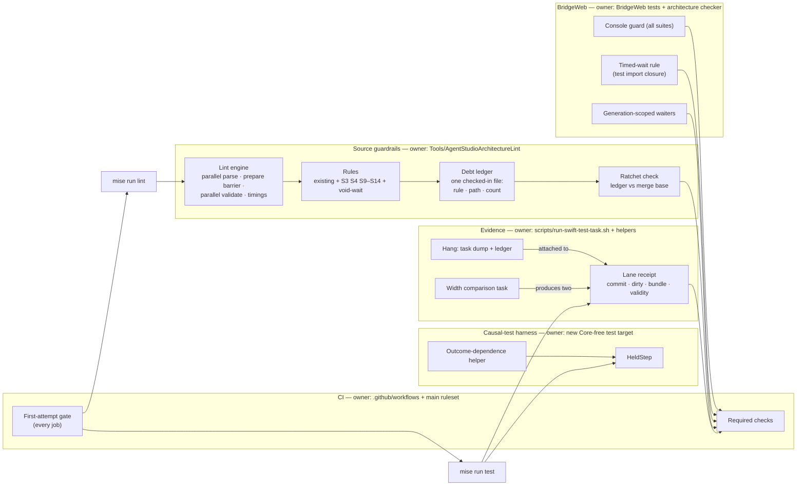
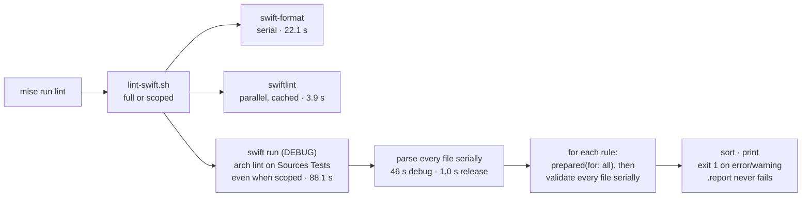
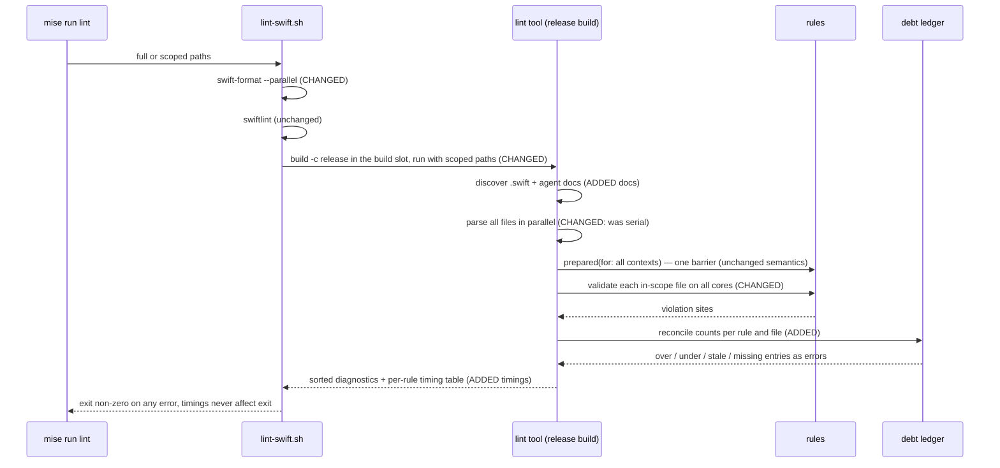
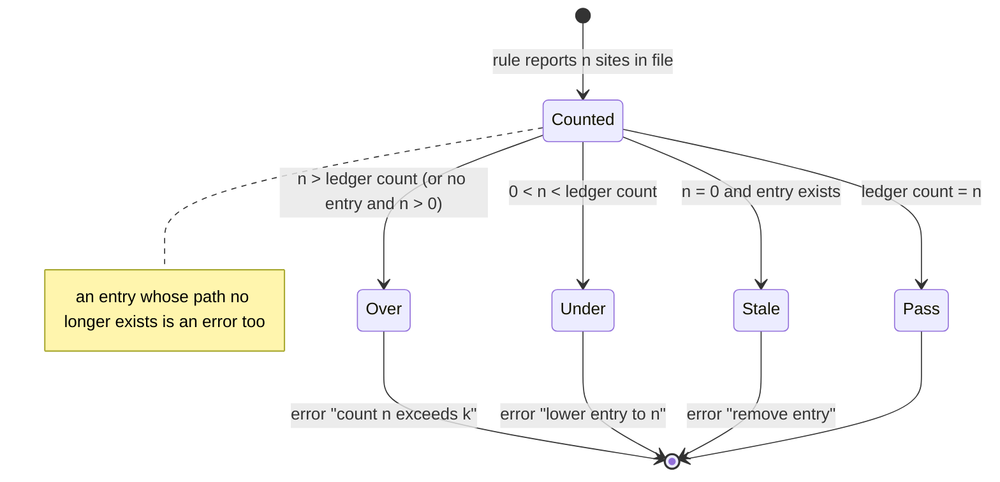
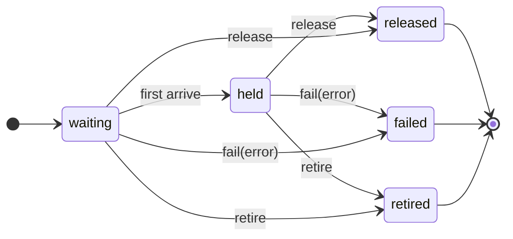
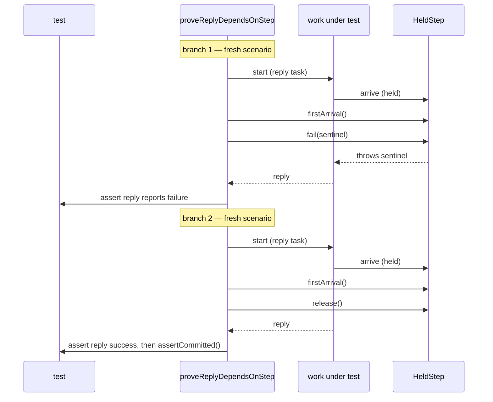
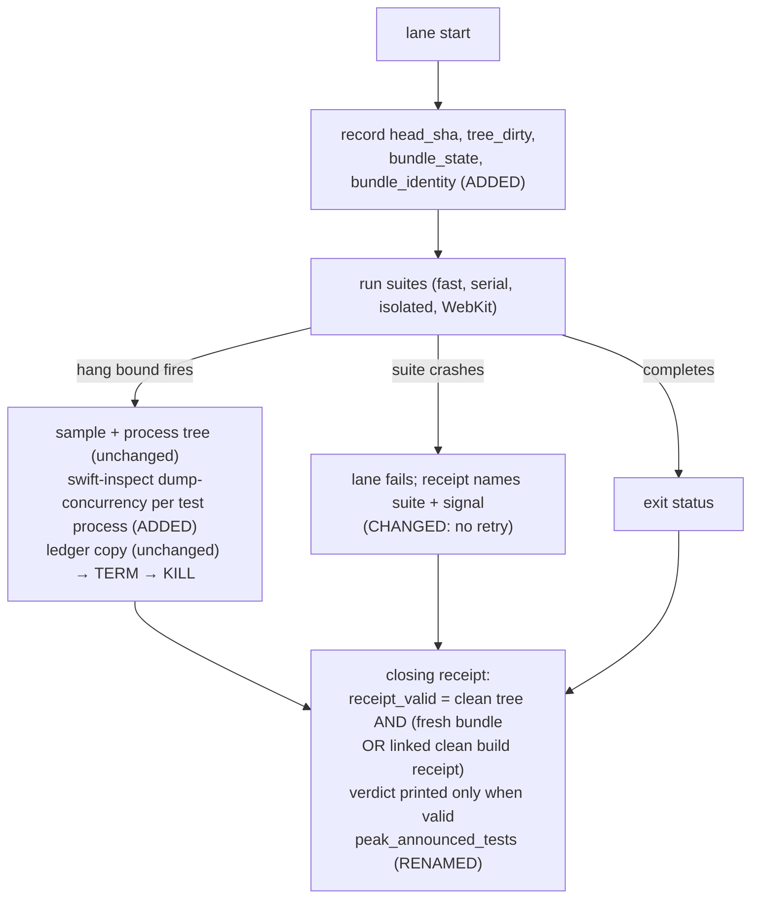

# CI and MainActor Guardrails — Program Design

How the repository realizes the [Specification](2026-09-23-ci-guardrails-specification.md), which realizes the
[Requirements](2026-09-23-ci-guardrails-requirements.md).

```text
Requirements  ->  Specification  ->  Program Design (this file)
```

## How the pieces fit



Seven owners, each with one reason to change:

| Component | Owns | Consumers | Changes when |
| --- | --- | --- | --- |
| Lint engine (`ArchitectureLintCommand` and its runner) | File discovery, parsing, rule scheduling, diagnostic rendering, timings, scoped mode | `scripts/lint-swift.sh`, lint tool tests | Parsing or scheduling strategy changes |
| Rules (`Rules/*`) | One predicate per guardrail; named-owner allowlists in `ArchitectureAllowlists` | The engine | A mistake shape or its owners change |
| Debt ledger + ratchet | Permitted counts per rule and file; the only-decrease invariant | Engine (reconciliation); CI ratchet step | Debt is paid down |
| Causal-test harness (new target `AgentStudioTestHarness`) | `HeldStep`, the outcome-dependence helper | Every Swift test target | The harness contract changes |
| Evidence (Swift runner scripts) | Receipt fields, hang evidence, width comparison, no in-lane retry | `mise run test:*`, CI | Lane topology or receipt fields change |
| CI (`.github/workflows`, `main` ruleset) | First-attempt gate, required checks | Owner merge decision | Job set changes |
| BridgeWeb guardrails | Console guard, hang-bound declarations, timed-wait rule, generation-scoped waiters | BridgeWeb suites, `pnpm run check` | BridgeWeb test topology changes |

## Current system and what changes

### Lint run today



Anchors: `scripts/lint-swift.sh:7-14` (always `Sources Tests`, even when scoped, `:80`),
`Tools/AgentStudioArchitectureLint/Sources/AgentStudioArchitectureLintCore/ArchitectureLintCommand.swift:77-100`.
Every rule is a `Sendable` struct with `let` fields whose `validate` builds its own visitor, so per-file validation is
safe to run concurrently. Two rules override `prepared(for:)`: `ProductAtomBoundaryRule` (atom owner index) and
`TestPollingWaitRule` (baseline path existence). `ArchitectureLintContext.location(for:)` rebuilds a line table per
diagnostic.

### Lint run after this change



| Edge | Status | Consequence |
| --- | --- | --- |
| `swift run` debug build of the tool | changed → release build, same build slot | 88 s → ~11 s single-threaded before parallelism; one cold release compile (139 s measured) per slot |
| serial parse and rule loops | changed → parallel map over files | 11.2 s → an estimated 1–2 s on 16 cores and about 4 s on the 3-core runner; measured in proof |
| scoped mode lints `Sources Tests` | changed → parse all (for `prepared` indexes), validate only scoped files | Same diagnostics for those files as a full run (R13) |
| `.report` severity | removed | No guardrail can be report-only (R5) |
| per-file debt lists compiled into `ArchitectureAllowlists` | removed → ledger file | Counts, not presence; diffable against the merge base |
| per-diagnostic line table | changed → one converter per file, built lazily | Removes a cost proportional to diagnostics |
| rule order and output sorting | intentionally unchanged | Output stays deterministic under parallelism |

### Selected structure and alternatives

| Crux | Chosen | Rejected, and why | Revisit when |
| --- | --- | --- | --- |
| Lint speed | Release build + parallel per-file validation in the existing engine | One shared visitor walking each tree once for all rules — larger rewrite of 32 rules; only needed if R11 is still missed after parallelism | Measured architecture stage > 5 s on the reference Mac |
| Debt format | One ledger file (`rule`, `path`, `count`) read at lint time | Keep Swift arrays — cannot express counts cheaply and cannot be diffed against the merge base without compiling | — |
| Discarded completion handle (S3) | Keep each operation's synchronous admission and returned task; remove `@discardableResult` from the 14; make the repository's own targets treat warnings as errors so a silent discard fails compilation (type-aware, incremental-safe because an error blocks the object file); lint bans `@discardableResult` on task-returning declarations and requires a reason on explicit discards | Make the 14 `async` (rejected: moves load-bearing synchronous prefixes — the teardown generation fence at `BridgePaneController.swift:559`, presentation snapshots, close-time drains — into a later MainActor turn); split each into sync admission + async outcome (14 dual entry points); a name-indexed call-site lint for bare calls (name collisions, renames) | A toolchain release adds warnings in our targets faster than they can be fixed; then downgrade that named group, never disable the policy |
| Harness home | New Core-free target `AgentStudioTestHarness` | Put it in `AgentStudioTestSupport` — it depends on `AgentStudioCore` and six test targets cannot import it | — |
| Causal proof | Outcome dependence (fail and release branches) | "Not yet reported while held" — racy without an owner quiescence seam most boundaries lack | — |
| Rerun gate placement | One anchored `run:` step, aliased as the first step of every job | A separate gate job — jobs have no `needs:` by design (`CIFastLaneWorkflowTests.swift:72-83`); a local composite action — resolves only after checkout | — |

What stays the same: the rule protocol, rule identifiers, diagnostic format, SwiftLint and swift-format
configuration, the lane topology, and every existing assertion. What it costs: a cold release compile of SwiftSyntax
once per build slot, a ledger file that must be kept exact, and about 190 call-site edits to await, store or explicitly discard the 14 handles, and fixing the build's existing warnings.

## Lint engine

### Scheduling

1. Discover `.swift` files under the requested roots plus every `AGENTS.md` in the repository (excluding
   `node_modules`, vendored sources and build output).
2. Parse all files with a bounded parallel map (one task per core), keeping results indexed by input order and
   deduplicated by source identity as today.
3. Run `prepared(for:)` for every rule once, after all parsing finishes. This is the only barrier.
4. Validate: parallel over in-scope files; each worker runs every rule on its file and records diagnostics and
   per-rule elapsed time in its own slot. No shared mutable state is touched during validation.
5. Reconcile against the ledger (below), sort, print.

`RuleParityTests.swift:756-777` currently copies the engine loop. The copy is replaced by a call to the engine's
single entry point, so tests and production cannot drift.

### Timing report

The tool prints one line per rule, `architecture-lint timing rule=<id> ms=<sum across files>`, plus parse and
prepare totals. `lint-swift.sh` prints wall time per stage. No code path compares a time with a threshold (R14).

### Debt ledger and ratchet

- **Home:** `Tools/AgentStudioArchitectureLint/architecture-debt-ledger.tsv`, one row per `rule_id`, repository-relative
  `path`, `count`. Sorted. Created in this change from the merge-base counts of every ratcheted rule.
- **Reconciliation** (in the engine, per rule and file):



- **Illegal state kept out:** a ledger row that raises a count or adds a path. The engine cannot see history, so a CI
  step owns this: it reads the ledger at the pull request's merge base (`git show <merge-base>:<ledger>`) and runs
  the tool's `--check-ledger-ratchet <base-file>` mode, which fails on any higher count or new row. A base without
  the file (this change) passes. The code-quality job checks out enough history to compute the merge base.
- **Recording lower counts:** `--lower-ledger-counts` rewrites only counts that went down and removes zero rows. It
  cannot raise a count.
- **Granularity (owner-accepted):** counts per rule and file. Replacing one violation with another in the same file
  keeps the count and passes; this is the known limit of the accepted `[path: count]` format.
- **Scoped runs** reconcile only the files they validate; an unvisited file is never treated as a zero count, so a
  scoped run cannot report stale entries.
- **Named-owner allowlists stay separate** in `ArchitectureAllowlists` with one owner and reason per entry (R10). The
  current `blockingTestWaitOwners` stays an owner list; `blockingTestWaitKnownDebt` and `pollingWaitKnownDebt` move to
  the ledger. The blocking list gains the stale and missing checks it lacks today.

### Rules added or changed

| Shape | Rule | Predicate (syntax only) | Allowlist | Initial ledger |
| --- | --- | --- | --- | --- |
| S1, S2 | existing polling and blocking rules | unchanged, now counted per site | owner lists unchanged | current per-file counts |
| S3 | `agentstudio_completion_handle_not_discardable` | `@discardableResult` on a declaration returning `Task<…>` or `Task<…>?`; an explicit `_ =` of a call to a task-returning function (whole-repo index) without a `// fire-and-forget:` reason | none | none: all 14 attributes removed and every discard carries a reason in this change |
| S4 | `agentstudio_test_ad_hoc_gate` | in `Tests/`, outside the harness target, a type named `*Gate`, `*Latch`, `*Barrier`, `*Blocker` or `*Hold` that stores a continuation, a continuation array, a `DispatchSemaphore` or an `NSCondition` | the harness target | per-file counts after this change's migrations |
| void wait | `agentstudio_test_wait_helper_returns_observation` | in `Tests/`, an `async` function named `wait*`, `require*`, `await*`, `expect*Eventually` or `waitUntil*` with no return type | the harness target | per-file counts |
| S5–S8 | four existing report rules | predicates unchanged; severity `.error` | unchanged (empty) | 101 / 1 / 13 / 2 sites at merge base |
| S9 | `agentstudio_observation_rearm_guarded` | a `withObservationTracking` whose `onChange` closure re-invokes the enclosing method, unless the re-arm is controlled by a guard: a generation fence (`guard stored == captured else { return }` before the re-arm, or the re-arm nested inside `if stored == captured`) or an arm latch (`guard !flag else { return }` before arming, `flag = true` on arm, `flag = false` in `onChange`). A comparison whose result does not control the re-arm does not count | none | 15 sites |
| S10 | `agentstudio_swiftui_body_derivation` | inside `var body: some View`, or a same-file method it calls: a call to `canDispatch`, `snapshot(state:)`, `fuzzyMatch`/`score*`, or a collection `sorted`/`sort`/`filter`/`reduce`/`grouping`; plus calls to `Type.member` resolvers that the `prepared(for:)` index shows call `canDispatch`. `Optional.map` and `compactMap` are not in the predicate | none | 4 sites |
| S11 | `agentstudio_atom_assign_only` | in a type named `*Atom` under `/State/MainActor/Atoms/`: `FileManager`, `sqlite3_*`, `Process`, `URLSession`, `Timer`, `DispatchQueue`, `Task {`, `Task.detached`, `withObservationTracking`, `sorted`/`sort` | none | 2 true sites plus the 2 unsure sites, frozen |
| S12 | `agentstudio_mainactor_hop_per_element` | (a) `MainActor.run` or `Task { @MainActor` inside a `for await` body; (b) a `for await` inside a `Task { @MainActor` or `@MainActor` type whose action is not controlled by an equality guard on the element: `guard element != stored else { continue }` (or `if element == stored { continue }`) before the action in the loop body, or the action nested in `if element != stored`. A comparison whose result does not control the action does not count | named thin adapters (the two reducer consumers in `WorkspaceSurfaceCoordinator`) | measured at merge base |
| S13 | `agentstudio_probe_reports_off_main` | in the performance recorder and telemetry recorder files: `Task { @MainActor`, `MainActor.run`, or a `@MainActor` reporter type | none | 1 site (`AgentStudioPerformanceTraceRecorder.swift:170,323`) |
| S14 | `agentstudio_agent_doc_reference_resolves` | in every `AGENTS.md`: each Markdown link target and each backticked token that starts with a repository top-level entry or `./`, resolved against the document directory and the repository root, must exist; each `#anchor` must equal a heading slug in the target (GitHub slug rules) or an explicit anchor ID declared there (`<a id=…>`, `<a name=…>`) | none | none: every current reference resolves (the anchors at `AGENTS.md:106,171,288` resolve to explicit IDs) |

Every rule gets matching and non-matching fixtures in the lint tool's tests (R6). The rules operate on source text
only; their false-negative limits are listed in the lint inventory beside each rule.

## Completion handles (S3)

Each of the 14 operations keeps its synchronous admission step and returns its task, so ordering is unchanged. The
`@discardableResult` attribute is removed from all 14. Each call site becomes one of:

- **awaited** (`await handle.value`) when the caller reports or depends on the outcome;
- **stored** when a later owner awaits or cancels it;
- **discarded with a reason**: `_ = f() // fire-and-forget: <why no one needs the outcome>`.

A `defer` block cannot await, so test cleanup in `defer` (`defer { _ = controller.teardown() }`) is an explicit
discard; a test that asserts on retirement stores the handle and awaits it.

Compile enforcement: the repository's own SwiftPM targets (app, features, core, infrastructure, shared components,
test targets and the lint tool) set `.treatAllWarnings(as: .error)`. An unused non-discardable result is a warning,
so a silent discard fails the build. Existing warnings are fixed in the same change; a group that a future toolchain
floods may be downgraded by name with `.treatWarning(<group>, as: .warning)` only if the unused-result warning stays an
error (the negative-compilation proof is rerun), never by removing the policy. Vendored
packages are unaffected because the setting is per target.

Lint: `agentstudio_completion_handle_not_discardable` fails on `@discardableResult` over a declaration returning
`Task<…>`/`Task<…>?`, and on an explicit `_ =` whose discarded expression is itself a direct call (`f(…)`, `x.f(…)`, `x?.f(…)`) to a name
in the `prepared(for:)` index of task-returning declarations, or is `await` of such a call (an actor-crossing call
still yields the task), without a `// fire-and-forget:` reason on the same line or the line directly above.
`_ = await f().value` discards an outcome, not a task, and is not flagged. The index is exact because a third
predicate fails when a task-returning name is also declared with a non-task result anywhere in `Sources` or `Tests`;
this change renames the five task-returning operations whose names had non-task twins (`teardown`, `submit`,
`requestClose`, `prepareHeldPanePreview` on the coordinator, `dispatchAction`) to names that say they start work
and return its task, leaving the 17 unrelated non-task declarations untouched, so no exclusion list exists. Stored-handle accessors that return a task
(`take*Task`, enum payload `task`) are unaffected: they are neither discardable nor discarded.

## Causal-test harness

### Placement

New SwiftPM target `AgentStudioTestHarness` at `Tests/AgentStudioTestHarness/`, depending only on the standard
library, Foundation and `Synchronization`. Every test target that needs a hold depends on it, including the six that
cannot see `AgentStudioTestSupport`. Declarations are `package`. The directory-structure and test-target-ownership
docs gain the target.

### HeldStep

`HeldStep<Arrival: Sendable>` is a `final class` that is `Sendable` through a `Mutex`-protected state. It is not an
actor, so a synchronous production seam can arrive without an `await`.



In `held`, further arrivals queue. Leaving `held` resumes every queued arrival: normally on `released`, throwing the
error on `failed`, throwing `CancellationError` on `retired`. A terminal state is sticky: later arrivals pass, or
throw the same error, immediately.

| Operation | Caller | Behavior |
| --- | --- | --- |
| `arrive(_:) async throws` | fake dependency on an async seam | suspends until a terminal state; records the arrival |
| `arriveBlocking(_:) throws` | fake dependency on a synchronous seam reached from a dedicated thread (socket join) | parks the calling thread on a per-arrival semaphore owned by the harness. If called synchronously from inside a task (`withUnsafeCurrentTask` is non-nil: cooperative pool or an actor), it records a test failure naming the step and does not park |
| `firstArrival() async throws -> Arrival` | test | returns the first arrival's value once it happens; never times out; throws `HeldStepNeverReached(<step name>)` only when the waiting task is cancelled (the runner's hang bound cancels it), so the failure names the step. Each step is created with a name |
| `release()`, `fail(_:)`, `retire()` | test | first terminal call wins; later calls are no-ops that do not change the state |
| cancellation policy (init) | test | `.resumeOnCancellation` resumes a cancelled async arrival as cancelled; `.holdThroughCancellation` keeps it held until a terminal call and records the cancellation |
| `cancellationObserved() async throws` | test | returns once an arriving task has been cancelled (for `.holdThroughCancellation` interleavings such as the late-frame regression) |

The harness also owns `valueFromDedicatedThread(_:)`, the single implementation of running blocking work off the
cooperative pool; `AgentStudioTestSupport`'s `withoutBlockingCooperativePool` delegates to it. State changes happen under the lock;
continuations and semaphores are resumed after the lock is released. No detached task relays the resume (15 existing gates do; that shape is not carried over). Terminal state
before arrival is kept, so an early `release()` cannot be lost.

### Outcome-dependence helper



The helper applies only where the held dependency's own contract can report failure (pane.focus's task yields `false`; Bridge retirement's lifecycle acknowledgement returns `false`); it never invents an error. Signature shape: `proveReplyDependsOnStep(makeScenario:, replyReportsFailure:, assertCommitted:)`. `makeScenario`
builds a fresh system under test and its `HeldStep` per branch. An implementation that replies before the step
finishes returns success in branch 1 and fails the test deterministically.

### Boundaries proven in this change (R19)

| Boundary | Hold point (existing seam) | Branch 1 expectation | Branch 2 expectation |
| --- | --- | --- | --- |
| IPC `pane.focus` | entry `PaneFocusAppControl.focusPane`; hold in a fake behind a narrow protocol seam for `submitTargetedPaneFocus(_:)` (production injects the controller) whose returned task awaits the step | the task yields `false`; `focusPane` throws `validationRejected` | the task yields `true`; `focusPane` returns |
| Bridge producer retirement | the frame pump's `acknowledgeLifecycle` closure (`BridgeProductSchemeFramePump.swift:78-87`, `:537`); the producer body arrives at a second step and ends by cancellation | retirement returns false; the producer is already unregistered (`:529-540`) and its pending lifecycle acknowledgement remains (`BridgeProductProducerRegistry.swift:364-379`) | retirement succeeds; frame-delivery observation and replay for the lease are cleared, and a late frame is not observed |
| Socket listener stop | `stop()` called through `valueFromDedicatedThread`; `acceptLoopJoinWait` holds with `arriveBlocking` on that thread (`stop()` returns Void, so the helper does not apply) | the existing normal, fallback and both-timeouts branch tests, holds migrated, assertions unchanged | — |
| Darwin FSEvents fixture | no hold: `prepare` is `@concurrent` (`DarwinFSEventStreamClient.swift:246`), so a blocking hold in its factory would park a cooperative-pool thread | existing deterministic setup failure when the final barrier does not cover the installed bindings | existing single authority read after the barrier |

`WorkspaceCommandGestureOrderingTests.swift:31,112,172` currently detect arrival with the legacy `eventually` poll;
they move to `firstArrival()`.

### Migration in this change

- Gates used by the boundaries above, including the late-frame regression (`BridgeProductSchemeFramePumpTests.swift:140-197`) migrated with `.holdThroughCancellation` and its interleaving and assertions unchanged.
- Every duplicate gate type (same or different name) whose semantics the `HeldStep` API covers, as R18 states (each is classified first; any that needs more is frozen for the stack): the eight byte-identical copies shared by `AgentStudioTests` and
  `AgentStudioBridgeTests`, and the renamed near-identical pairs listed by the 2026-09-23 inventory.
- The private socket-test helpers `LockedValue`, `awaitSignal` and `awaitBlocking` (and the copy in
  `IPCDescriptorClientTests.swift:501`) are replaced by `HeldStep`.

Everything else is frozen by the S4 and void-wait ledgers and retired in the stacked follow-up pull requests until
both ledgers are empty.

## Evidence: runner and receipts



| Change | Where (current anchor) | Detail |
| --- | --- | --- |
| Receipt identity | `scripts/run-swift-test-task.sh:35-40` (opening), `:77-105` (closing) | `git rev-parse HEAD`, `git status --porcelain` emptiness, `bundle_state=fresh` only when this invocation's prebuild ran, bundle path plus modification time; `test-prebuild` also prints a closing receipt (its early exit at `:42-45` moves after the trap) |
| Validity | same | Build receipt: at prebuild start the slot's receipt is deleted; `head_sha` and `tree_dirty` are sampled before compiling; the receipt is published only after a successful prebuild by atomic rename; `bundle_identity` is the exact xctest executable the resolver returns (path, size, mtime). A lane reusing the bundle is valid only when the receipt exists and parses, recorded `tree_dirty=false`, recorded head equals current HEAD, the current tree is clean, and the identity matches the executable it runs; otherwise `receipt_valid=false reason=reused_bundle_unlinked|built_from_dirty_tree|bundle_head_mismatch|dirty_tree` and `verdict=unverified`. The exit status is unchanged. The EXIT trap is chained so the build-slot release still runs |
| Announced counts | `:84,89`, `swift-test-helpers.sh:102`, `SwiftLaneRunnerReportTests.swift:96,119`, testing doc `:346,349` | `peak_started_tests` → `peak_announced_tests` |
| Task dump | beside `swift-test-helpers.sh:1078`, before TERM | `xcrun swift-inspect dump-concurrency <pid>` for each sampled test process into `tmp/plan-workflows/ci-runs/lane-<label>.task-dump.txt`; the CI upload selection (`ci.yml:439-448`) adds `lane-*.task-dump.txt`; when the tool is unavailable the receipt says `task_dump=unavailable reason=<error>`; the lane stays failed |
| No in-lane retry | remove `swift-test-helpers.sh:1227-1272` | a signal crash is a failed isolated suite, already reported by `failed_isolated_suites` |
| Width comparison | new mise task `test:swift:width-comparison` | one prebuild pinned to one build slot; fast lane twice with `SWIFT_TEST_SKIP_PREBUILD=1` (width 3, then unset); ledger retention forced for both runs whether they pass or fail; labels carry the width and bundle identity; a `workflow_dispatch` CI job runs the same task on the 3-core runner. It is not a pull-request gate |

## CI

- **First-attempt gate:** one `run:` step, defined with a YAML anchor in the first job and reused by alias as the
  first step of every job in `ci.yml` (a local composite action would need a checkout first). When `github.run_attempt` is greater than 1 it reads the pull request's live labels with
  `gh api repos/{owner}/{repo}/issues/{number}/labels`, because a re-run replays the original event payload. Without
  the `ci-rerun-approved` label it fails with a message naming that label. An API failure fails closed with the
  error. Runs that are not pull requests have no label to read and fail on a re-run attempt. The workflow grants
  `issues: read`. `CIFastLaneWorkflowTests` gains an assertion that every job starts with the gate.
- **Ratchet step:** the code-quality job computes the merge base and runs the ledger ratchet check (above).
- **Required checks:** the `main` ruleset (id 12371621) gains a `required_status_checks` rule listing the code-quality
  job (lint, ratchet, doc references), the Swift test jobs and the BridgeWeb validation job. Applying the ruleset is
  an owner-authorized repository change made through `gh api` in the implementation, and recorded on the work thread.

## BridgeWeb

| Guardrail | Owner | Realization |
| --- | --- | --- |
| `act()` warnings fail (R27) | `BridgeWeb/tests/console-error-guard.ts` (moved out of `tests/vitest-browser-setup.ts`) | the browser suite keeps its existing broad `console.error` guard unchanged; the unit, node-integration and E2E configs gain a guard that fails only on React `act()` warnings; E2E journeys fail on a page console message containing `not wrapped in act` |
| Hang bounds declared (R27a) | `BridgeWeb/tests/vitest-hang-bounds.ts` | one module exports each suite's `testTimeout`; every config imports it. Values equal today's effective values, so no bound is tuned |
| No timed waits (R28) | `scripts/check-bridgeweb-architecture.ts`, new rule `no-timed-wait-in-tests` | takes its roots from the `include` globs of every Vitest config (tests live under `tests/`, `src/` and `scripts/`) and resolves imports with `ts.resolveModuleName` and BridgeWeb's tsconfig (the checker today parses single source files); flags `waitForTimeout(`, awaited `sleep`/`delay` helpers, and an awaited `new Promise` whose only resolution is a timer. A zero-delay timer used to wait counts. A timer racing a condition is allowed only when its delay is the shared hang-bound constant (R27a). The existing zero-delay wait at `src/app/bridge-app-viewer-activation.browser.test.tsx:69` becomes a condition wait. One reachable violation exists today — the dev-server readiness interval poll (`BridgeWeb/scripts/dev-server/bridge-development-server-process.ts:119-123`); it is replaced by a readiness line the Swift dev server prints once after bind (`Sources/AgentStudioBridgeDevelopmentServer`), awaited on stdout and raced against the child's lifecycle, so the rule starts with none |
| Generation-scoped waiters (R29) | `scripts/verify-bridge-viewer-worktree-dev-server/product-only-real-router-page.ts` and `reload-join-diagnostics.ts` | an init script (`page.addInitScript`) runs in every document instance and mints its token. The journey's product requests are issued by the dedicated comm worker (`bridge-comm-worker-dev-factory.ts:1`, `bridge-product-http-request-executor.ts:10`), and init scripts do not run in worker globals, so the init script also wraps the document's `Worker` constructor: each worker is started from a small module that records the creating document's token, wraps the worker's `fetch` to add it as a request header to `/__bridge-product/*` requests, and then imports the original worker module. Requests stay worker-owned; an old document's worker keeps the old token after a reload. Requests from the main window (bootstrap) carry the document token directly; the harness assigns generations in order of first appearance of each new token, so a reload advances the generation and a same-document (history or hash) navigation, redirect or aborted navigation does not; a waiter is bound to a generation (a reload waiter to the next new token) and accepts only responses to requests carrying that token. If a bridge transport cannot carry the header, that path is reported rather than guessed. The `unresolved=` diagnostic (`product-only-real-router-failure.ts:11-22`) prints each unresolved waiter with its generation |

## Failure behavior

| Failure | Detection | Handling |
| --- | --- | --- |
| Ledger file missing or malformed | engine load | lint fails closed naming the file and line |
| Ledger path no longer exists | engine reconciliation | error: remove the entry |
| Merge base not computable in CI | ratchet step | step fails; the job's checkout depth is the fix, never skipping the check |
| A worker thread fails while parsing | engine | the run fails with the file path; no partial result is printed as a pass |
| `swift-inspect` unavailable or refused | runner | `task_dump=unavailable` in the receipt; the lane verdict is unaffected |
| `gh api` label read fails in the gate | gate action | the job fails closed with the API error |
| A causal test's step is never reached | `firstArrival()` suspends | Two paths. Swift Testing `.timeLimit` cancels the test task: `firstArrival()` throws `HeldStepNeverReached(<step name>)`. The lane watchdog terminates the process (TERM/KILL, no task cancellation): every `HeldStep` appends `waiting <name>` / `arrived <name>` lines to the file named by `AGENTSTUDIO_HELD_STEP_LOG` (set per lane by the runner; unset means no log), and the hang report prints each `waiting` with no matching `arrived` and retains the file with the ledger and dump |
| A test forgets to release a step | the reply stays suspended | same as above; the helper always terminates the step in both branches |

## Concurrency

- **Lint engine:** parsing and validation run in parallel over files. Validation writes only to per-file result
  slots. `prepared(for:)` runs after all parsing completes and before any validation, which preserves today's
  semantics for the two cross-file rules and the new S3 and S10 indexes.
- **HeldStep:** all state changes happen under one `Mutex`. The first terminal call wins. Async and blocking arrivals
  are resumed outside the lock after the state change is recorded, so a resumed arrival that immediately arrives
  again sees the terminal state.
- **Generation tagging:** each request carries the token of the document that issued it, so ordering between
  navigation events and requests does not matter. An old document's late request carries the old token.

## Cross-cutting

| Quality | Realization |
| --- | --- |
| Performance (R11–R14) | Parallel engine, release build, `swift-format --parallel`, lazy line tables; per-rule timings; before/after measurement on the reference Mac |
| Reliability | Every new gate fails closed; no guardrail depends on elapsed time |
| Security | The gate action reads labels with the job's `GITHUB_TOKEN` at `issues: read`; no secret is added. Task dumps contain stack frames only and follow the existing artifact upload |
| Compatibility | Hard cutover: ledger replaces the lists; harness replaces the migrated gates; the retry is removed. No product behavior changes |
| Operability | Every failure message names the fix (count to record, label to add, reference to correct) |

## How each requirement is realized and verified

| Requirement | Realization | Proof seam |
| --- | --- | --- |
| R1–R3 | engine reconciliation against the ledger | lint tool tests: over, equal, under, stale, missing-path |
| R4 | `--check-ledger-ratchet` in the code-quality job | lint tool test with two ledgers; a CI run on a branch that raises a count |
| R5 | severity change + merge-base counts in the ledger | ledger inspection; `RuleInventoryTests` severities |
| R6 | fixtures per rule | lint tool tests |
| R7, R8 | attribute removed from 14; warnings-as-errors on our targets; S3 lint | the tree builds with warnings as errors; lint tool tests for both S3 predicates; one temporary bare call (not committed) shown to fail compilation |
| R9, R10 | S9–S13 rules; owner allowlists with reasons | lint tool tests; ledger inspection |
| R11, R12, R14 | engine scheduling, release build, timing lines | measurement before/after on the reference Mac; source inspection shows no threshold on an exit path |
| R13 | scoped mode | lint tool test comparing scoped and full diagnostics for the same files |
| R15 | `HeldStep` | harness self-tests: release before and after arrival, fail, retire, cancellation, blocking arrival on a real thread |
| R16 | `proveReplyDependsOnStep` | harness self-test with a deliberately early-replying fake that the helper rejects |
| R17 | harness API returns values; void-wait rule freezes the rest | lint tool tests; ledger inspection |
| R18 | migration list; S4 rule | S4 ledger shows the migrated files at zero; lint tool tests |
| R19 | four causal tests | each test run against its current implementation; a temporary early-reply variant fails branch 1 (demonstrated during implementation, not kept) |
| R20–R23, R22a | runner changes | runner report tests (`SwiftLaneRunnerReportTests`); a local forced hang; a local reused-bundle run |
| R24 | gate action | `CIFastLaneWorkflowTests`; one re-run attempt on the pull request without the label |
| R24a | ruleset | `gh api` ruleset read-back; a pull request with a red required check shows as blocked |
| R25, R26 | S14 rule | lint tool tests; full lint run |
| R27, R27a | console guard, hang-bound module | BridgeWeb tests with a component that triggers an `act()` warning in each suite |
| R28 | timed-wait rule | architecture checker tests with an imported module that waits on a timer |
| R29 | generation tagging | E2E harness test where a stale-generation response arrives first and does not settle the waiter |
| R30, R31 | width comparison task and CI job | the two receipts and ledgers from one bundle, linked in the pull request |
| R32 | delivery | `mise run test` receipts valid on the final commit; CI first-attempt green at that commit |
| R33 | testing architecture and lint inventory docs | document inspection |
