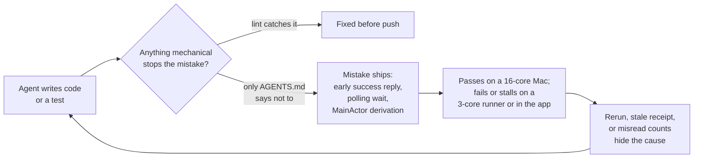
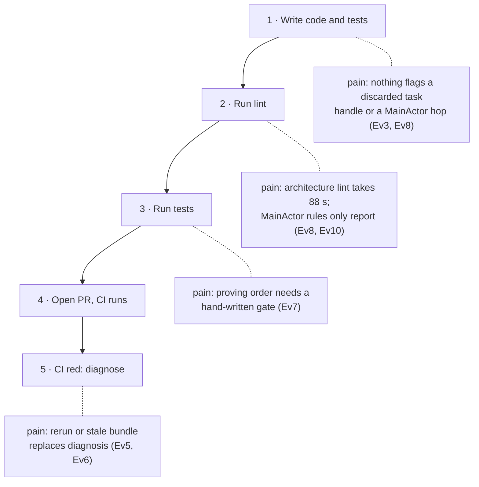
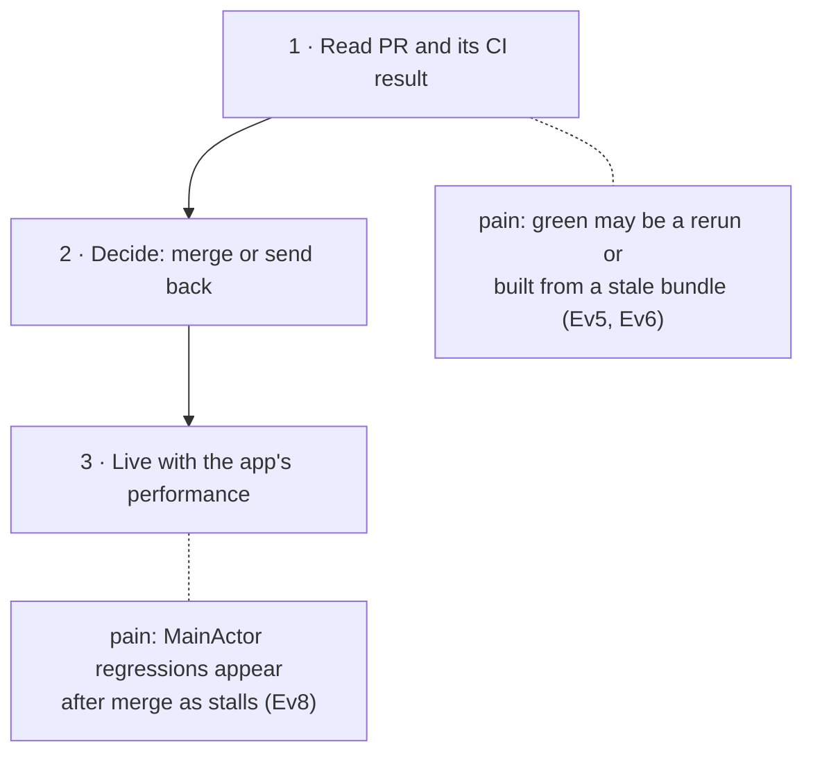

# CI and MainActor Guardrails — Requirements

Why this work exists, for whom, and within what boundary. What must be observably true lives in the
[Specification](2026-09-23-ci-guardrails-specification.md); how it is built lives in the
[Program Design](2026-09-23-ci-guardrails-program-design.md).

```text
Requirements (this file)  ->  Specification  ->  Program Design
```

This work follows the [CI reliability program](../2026-09-17-ci-reliability/2026-09-17-ci-reliability-requirements.md)
(PR #351) and the fixes merged in PRs #355, #345 and #348. Those fixed specific failures. This work makes the
failure *classes* mechanically hard to reintroduce.

## The problem in one picture



Today most of the Sep 17–22 failure classes reach only the lower branch. A written rule is the only barrier,
and the rules were followed unevenly (Ev1–Ev9).

## Who is affected

| Class | Their job | What the missing guardrails cost them |
| --- | --- | --- |
| Owner / maintainer | Decide whether a PR merges; keep the app fast | Red and green do not reliably mean "this change"; MainActor regressions surface as user-visible stalls long after merge (Ev8) |
| Implementing agents (Claude, Codex) | Land a scoped change with proof | Nothing stops a plausible-looking shape (a discarded completion handle, a polling wait, a hop per stream element) until CI or the app fails |
| Reviewing and orchestrating agents | Judge readiness from code, tests and CI | Must re-derive completion ordering and MainActor placement by hand on every PR; evidence can come from a stale bundle or a rerun (Ev5, Ev6) |
| Future test authors | Prove async ordering | Each writes a private gate type from scratch (Ev7), so causal tests are skipped |

## User requirements

Authority state is the producer's. `authorized` rows are the owner's own statements in the 2026-09-23 session and
are the only rows a normative requirement may rest on. The owner set every in-scope row to the same priority
("everything we discussed in here should be covered"); P0 below records that, not a ranking.

| ID | Need or outcome | Why it matters | Owner's words (2026-09-23, verbatim) | Authority | Priority |
| --- | --- | --- | --- | --- | --- |
| U1 | The failure classes from the Sep 17–22 CI work cannot recur without a failing gate | Fixes one at a time returned within two weeks before (Ev1) | "make sure that we have guardrails to prevent this from happening again" | authorized | P0 |
| U2 | Guardrails are mechanical; instruction files alone do not count | Written rules were already present and were not followed (Ev2, Ev9) | "claude isntuciotns okr agent.md is nto enough" | authorized | P0 |
| U3 | The lint system is the primary guardrail for mistakes it can detect | Lint runs before push and costs no CI time | "what should our linting system do?" | authorized | P0 |
| U4 | MainActor misuse shapes are caught by lint and fail the build, including the name-based rules | MainActor misuse degrades the app for users (Ev8) | "yes to 1 because it really fucks ukp performance"; "lint improve fo rmain action issue and people putting htisn into main actor" | authorized | P0 |
| U5 | All lint is fast, and existing lint is reviewed for bad performance | A slow lint is skipped or waited on (Ev10) | "all litn sokubl be performant tso review for bad performance"; "yes as long as all lints etc are performant" | authorized | P0 |
| U6 | Lint speed target: `mise run lint` at most 30 s and the architecture stage at most 5 s on a 16-core development Mac | Makes U5 checkable | Selected "≤30s total, ≤5s arch (Recommended)" | authorized | P0 |
| U7 | A shared causal-test harness exists: a held-step primitive plus a three-phase helper | Makes proving "reply after commit" cheap enough to require (Ev7) | "include here for harness"; "i agree with your standard for full implemeantaiton" | authorized | P0 |
| U8 | Existing hand-written gate types migrate onto the harness using current Swift 6 idioms. This PR seeds the harness, migrates the incident-boundary gates and the duplicated copies, and freezes the rest by count; the remaining migration of gate types and wait helpers ships as follow-up pull requests stacked on this one, all delivered by this orchestrator | Removes duplicate copies and gives one pattern to copy; the inventory is far larger than first estimated (Ev12) | "yes migrate use latest swi8ft 6 standard"; "seed and ractch ethe rest is follow pr ins tack you will do them all" | authorized | P0 |
| U9 | Agent docs cannot claim a path that does not exist; this is a lint rule and a CI merge gate | A stale hook claim survived a documented fix (Ev9) | "this shoudl be a lint an dci merge agate" | authorized | P0 |
| U10 | The stale PostToolUse hook claim is removed and no hook is restored | There is no hook | "nothers no post ool hook remove that" | authorized | P0 |
| U11 | A CI re-run attempt fails unless an override label is applied | Reruns hid evidence (Ev5) | Accepted the recommendation "hard fail plus the label" ("yes taht soudsn good") | authorized | P0 |
| U12 | An operation's success cannot be reported before the operation completes; this is enforced by the type system and compiler where possible, with lint for what they cannot see | The pane.focus defect discarded the handle and reported success early (Ev3) | Accepted "explicit `_ =` with a reason" ("yes taht soudsn good"); then "we can enforce with type safety? and compile safety?" and confirmed "ok sokunds good" | authorized | P0 |
| U13 | Everything discussed in the guardrails conversation is covered, including BridgeWeb browser/E2E guardrails and the Swift Testing width question | The browser failures and the width question were part of the same CI history (Ev4, Ev11) | "everythign we discuseed in here shodu be covered" | authorized | P0 |
| U14 | Delivery: the guardrails ship as one pull request (the remaining migration follows as stacked pull requests, U8); each pull request merges only with `mise run test` green in this worktree and CI green at its exact head | One coupled change; green must mean this commit | "that means eveyrhtign pases in tis worktree as well before emr merge"; accepted "one PR" | authorized | P0 |
| U15 | The design is specified clearly and reviewed by an Astra-high advisor before implementation | The change spans lint, harness, runner, CI and docs | "this needs to be specced out very clearly and reviwed by advisotr astra high"; "we need a spec and design" | authorized | P0 |
| U16 | The lint, baseline and doc-path checks become required status checks for merges to `main` | Today no check blocks a merge (Ev13) | Selected "Add required checks" | authorized | P0 |
| U17 | The runner's automatic retry of crashed WebKit suites is removed; a crash is a red lane | An in-runner retry is a hidden rerun (Ev13) | Selected "Remove WebKit auto-retry" | authorized | P0 |

## Owner-set limits on how the work is done

These constrain delivery. They are not product behavior.

- The orchestrator (this Claude session) owns orchestration and design authorship. Sol-medium or Opus-low
  helpers may assist; agent coordination uses the repository's agent-collaboration board
  ("you are in charge of orchestration and design").
- Repository rules in `AGENTS.md` bind this work and are not reopened here: no wall-clock or turn-budget test
  verdicts; a proof gate is never deleted or weakened to obtain a pass; test topology has one owner
  (`mise run test:*` and `scripts/run-swift-test-task.sh`); hard cutover with no dual paths; no new `#if DEBUG`
  test hooks in production files.

## Goal boundary

| Field | Boundary |
| --- | --- |
| Primary goal | Each failure class in Ev1–Ev11 and each MainActor misuse shape in Ev8 meets a failing mechanical gate (lint, test, runner or CI) before merge |
| Affected classes | The four classes above |
| Existing foundation to reuse | `Tools/AgentStudioArchitectureLint` and its rules; the polling-wait and blocking-wait rules; the report-only performance rules; the Swift test runner and its lane report; `BridgeWeb/scripts/check-bridgeweb-architecture.ts`; the fixes merged in #355, #345, #348 |
| What is actually missing | Per-call-site debt baselines; a blocking channel for the performance rules; rules for discarded task handles and MainActor shapes; a shared causal-test harness; receipt identity in lane reports; a rerun gate; an agent-doc path gate; BridgeWeb wait and warning gates; a defined width experiment; a fast lint engine |
| May change | Architecture lint rules, engine and baselines; lint and test scripts and mise tasks; CI workflows; test support and test code needed for the harness migration; production declarations whose task-returning results must no longer be discardable, and their callers; BridgeWeb test configuration and its architecture check; agent instruction files and architecture docs; the `main` branch ruleset (required status checks, U16) |
| Protected | Shipped product behavior; proof strength of every existing test; vendored Ghostty and zmx sources; release identity and signing |
| Non-goals | Paying down existing debt (the 114 polling files, 18 blocking files and existing MainActor findings are frozen, not fixed; a separate worktree owns paydown). Migrating every remaining gate type and wait helper in the first pull request (it follows in stacked pull requests, U8). Fixing the MainActor incidents themselves (command-bar body derivation, git admission throttle and similar; a separate worktree owns them). Restoring a PostToolUse hook. A general "expensive MainActor" heuristic without a named shape. Changing the AppIPC server executor. A failing wall-clock gate on lint speed |
| Acceptable complexity | One lint engine, one baseline format shared by every ratcheted rule, one harness primitive with one helper. A second baseline format, a second wait convention, or a per-suite bespoke gate reopens scope |

## Journeys

### Implementing agent



Desired difference: each pain point above becomes a failing check at that step (U1–U12). Rows: U1, U3, U4, U5, U7,
U11, U12.

### Owner



Desired difference: a green check means this exact commit passed on its first attempt, and MainActor shapes that
cause stalls cannot merge unnoticed. Rows: U2, U4, U11, U14.

## Evidence

Evidence rows are observational; they establish the pain, not the desired behavior.

| ID | Evidence | Source |
| --- | --- | --- |
| Ev1 | Flakes fixed one at a time in #327 (2026-09-05) returned within two weeks | [2026-09-17 Requirements, U2](../2026-09-17-ci-reliability/2026-09-17-ci-reliability-requirements.md) |
| Ev2 | 114 test files remain on the polling-wait baseline and 18 on the blocking-wait baseline; both baselines are per file, so a new violation inside a listed file passes | `Tools/AgentStudioArchitectureLint/Sources/AgentStudioArchitectureLintCore/Paths/ArchitectureAllowlists.swift` (`pollingWaitKnownDebt`, `blockingTestWaitKnownDebt`) |
| Ev3 | PR #345's IPC `pane.focus` returned `focused: true` before focus committed, because a synchronous wrapper discarded the submitted task; 13 production functions returning a task handle are `@discardableResult` | CI run 35727551876 log line 5430; `Sources/AgentStudio/App/Commands/PaneFocusAppControl.swift:39`; `Sources/AgentStudio/App/Panes/PaneTabViewController.swift:3871` |
| Ev4 | PR #345's failed browser run logged React `act()` warnings from menu components; PR #348's product E2E reload join timed out with two unresolved `metadataStream.open` requests on page generations g1 and g2; neither cause was proven fixed | CI run 35727551876 log line 13945; CI run 35727971802 log line 103 |
| Ev5 | PR #348 went green on attempt 3 (2026-09-20) and earlier attempt-2 runs exist on #345 and #348, although the testing standard forbids reruns | `gh run list` for both branches; `docs/architecture/testing/testing_architecture.md` "When a run is red" |
| Ev6 | A "116 focused tests passed" receipt was withdrawn: it used a skipped prebuild and an obsolete bundle; a diagnostic SHA receipt was reported wrong; the lane report carries no head SHA, dirty-tree or prebuild flag | investigation summary (navigation-cmds worktree, `tmp/research-workflows/2026-09-21-ci-stability/summary.md:29`); `scripts/run-swift-test-task.sh:35-40,122` |
| Ev7 | More than ten hand-written gate types exist in `Tests/`, some as identical copies in two test targets (`BridgeContentLoadGate`) | `Tests/AgentStudioTests/Features/Bridge/BridgeReviewSourceProviderFake.swift`, `Tests/AgentStudioTests/App/WebKit/Bridge/TestSupport/BridgeReviewSourceProviderTestSupport.swift` |
| Ev8 | MainActor incidents: an observation re-arm leak refreshed ~1,400 times per second; 95.1% of MainActor publications were equal outcomes; a stall probe reported through the actor it measured. Four performance rules exist but only report: 117 findings today, 101 of them unbounded collection work, never failing | project memory notes (observation-tracking storm, performance program, stall attribution); `docs/architecture/structure/architecture_lint_inventory.md:55-72`; architecture lint run on 2026-09-23 |
| Ev9 | `AGENTS.md` claimed a `.claude/hooks/check.sh` PostToolUse hook that does not exist; the 2026-09-17 program design recorded the fix, and it never landed | `docs/specs/2026-09-17-ci-reliability/2026-09-17-ci-reliability-program-design.md:293` |
| Ev10 | Measured on a 16-core Mac over 2,866 Swift files: swift-format 22.1 s serial (2.5 s with `--parallel`); architecture lint 88.1 s as run (debug build, 46 s of parsing), 11.2 s as a release build on one thread; one rule is 40% of release rule time | measurements 2026-09-23 on this worktree |
| Ev12 | 92 top-level `*Gate`/`*Latch`/`*Barrier`/`*Blocker`/`*Hold` declarations in `Tests/` (236 gate-like types by mechanism); 205 wait helpers return nothing (about 880 call sites); the shared test-support target depends on `AgentStudioCore` and six test targets cannot import it | `Tests/` source scan 2026-09-23; `Package.swift:333-341` |
| Ev13 | `main` has no required status checks (branch protection absent; the only ruleset has none); the Swift runner retries a signal-crashed WebKit suite up to three times inside one lane | `gh api` rulesets 2026-09-23; `scripts/swift-test-helpers.sh:1227-1272` |
| Ev11 | The Swift Testing width is left unset because finite widths hung 15 of 28 local runs; the inference that the limiter was defective was later withdrawn because `testStarted` precedes admission; the comparison experiment was never run | `scripts/swift-test-helpers.sh:17-25`; navigation-cmds `tmp/research-workflows/2026-09-21-ci-stability/current-causal-inventory.md:44,106,114` |

## Open hypotheses

- Whether the width comparison (U13) will show the uncapped lane or a finite width to be the better default is
  unknown. This work defines and runs the comparison; changing the default stays an owner decision after its result.
- Whether every current MainActor-shape match is a true misuse is unknown until the rule predicates are fixed;
  the ratchet freezes current matches either way, and their disposition belongs to the separate MainActor worktree.
